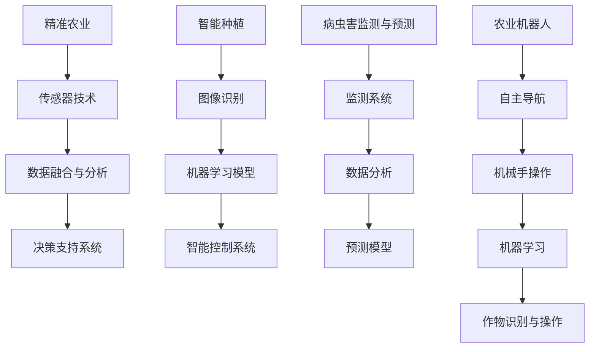

                 

关键词：人工智能、农业、产量、可持续性、技术、创新

> 摘要：随着全球人口的增长和气候变化的影响，农业面临着巨大的挑战。人工智能（AI）技术的应用为农业带来了前所未有的机遇，通过精确农业、智能种植、病虫害监测和预测等方面，AI有助于提高农作物的产量和农业的可持续性。本文将探讨AI在农业中的应用，分析其核心算法、数学模型及实际案例，展望未来的发展趋势与挑战。

## 1. 背景介绍

### 1.1 农业的挑战与需求

#### 1.1.1 人口增长

全球人口持续增长，预计到2050年将达到近百亿。这要求农业产量必须大幅提升，以满足日益增长的食物需求。

#### 1.1.2 气候变化

气候变化对农业的影响日益明显，极端天气事件增多，影响农作物的生长和产量。适应气候变化成为现代农业的重要课题。

#### 1.1.3 可持续性

随着环保意识的增强，农业的可持续性成为关注焦点。如何在提高产量的同时减少环境影响，实现可持续发展，是现代农业面临的挑战。

### 1.2 人工智能在农业中的潜在应用

人工智能技术在农业领域的应用前景广阔，能够帮助解决上述挑战。从精准农业到智能种植，从病虫害监测到农业机器人，AI正逐渐改变传统农业的面貌。

## 2. 核心概念与联系

### 2.1 精准农业

精准农业通过使用AI技术收集和分析农田数据，优化种植和管理过程。其核心概念包括：

- **传感器技术**：使用各种传感器（如GPS、温湿度传感器）收集农田数据。
- **数据融合与分析**：将不同来源的数据融合，通过机器学习算法进行分析。
- **决策支持系统**：根据分析结果，为农民提供种植、施肥、灌溉等决策建议。

### 2.2 智能种植

智能种植利用AI技术对作物生长进行实时监测和预测。其核心概念包括：

- **图像识别**：通过图像识别技术监测作物的生长状态。
- **机器学习模型**：利用机器学习模型预测作物的病虫害和生长趋势。
- **智能控制系统**：根据预测结果，自动调整灌溉、施肥等农事操作。

### 2.3 病虫害监测与预测

病虫害监测与预测是农业中的重要环节，AI技术为其带来了新的解决方案。其核心概念包括：

- **监测系统**：使用无人机、卫星等设备监测病虫害的发生。
- **数据分析**：通过数据分析，识别病虫害的类型和严重程度。
- **预测模型**：利用预测模型，提前预测病虫害的发生趋势。

### 2.4 农业机器人

农业机器人是AI在农业中的又一重要应用，通过自主导航、机械手操作等技术，实现农作物的采摘、种植和收割。其核心概念包括：

- **自主导航**：使用激光雷达、摄像头等传感器实现机器人的自主导航。
- **机械手操作**：利用机械手实现精准的农作操作。
- **机器学习**：通过机器学习技术，提高机器人对作物和环境的识别能力。

### 2.5 Mermaid 流程图



## 3. 核心算法原理 & 具体操作步骤

### 3.1 算法原理概述

AI在农业中的应用主要依赖于机器学习和计算机视觉等技术。以下分别介绍这些技术的原理：

#### 3.1.1 机器学习

机器学习是一种让计算机通过数据学习并做出决策或预测的方法。在农业中，常用的机器学习方法包括：

- **回归分析**：预测农作物产量。
- **分类算法**：识别病虫害类型。
- **聚类算法**：分析土壤特性。

#### 3.1.2 计算机视觉

计算机视觉是使计算机能够“看”和理解图像的技术。在农业中，常用的计算机视觉技术包括：

- **图像识别**：监测作物生长状态。
- **图像分割**：分割图像中的不同部分。
- **目标检测**：识别图像中的特定对象。

### 3.2 算法步骤详解

#### 3.2.1 精准农业

1. 收集农田数据（如土壤、气候、作物生长等）。
2. 预处理数据，去除噪声和异常值。
3. 使用回归分析等方法建立模型，预测农作物产量。
4. 输出决策建议，如施肥、灌溉量。

#### 3.2.2 智能种植

1. 使用图像识别技术监测作物生长状态。
2. 建立机器学习模型，预测作物的病虫害和生长趋势。
3. 根据预测结果，调整灌溉、施肥等农事操作。

#### 3.2.3 病虫害监测与预测

1. 使用无人机、卫星等设备收集病虫害数据。
2. 使用图像分割和目标检测技术，识别病虫害类型和严重程度。
3. 建立预测模型，预测病虫害的发生趋势。

#### 3.2.4 农业机器人

1. 使用激光雷达、摄像头等传感器实现自主导航。
2. 利用机械手操作技术，实现精准农作操作。
3. 使用机器学习技术，提高机器人对作物和环境的识别能力。

### 3.3 算法优缺点

#### 3.3.1 优点

- **提高产量**：通过精确农业和智能种植，提高农作物产量。
- **减少成本**：减少化肥、农药的使用量，降低生产成本。
- **提高效率**：农业机器人实现自动化，提高工作效率。

#### 3.3.2 缺点

- **技术门槛高**：需要大量的数据和技术支持。
- **设备成本高**：传感器、无人机等设备价格昂贵。

### 3.4 算法应用领域

AI技术在农业中的应用非常广泛，主要包括：

- **农作物种植**：精确农业、智能种植。
- **病虫害监测**：病虫害监测与预测。
- **农业机器人**：农业机器人的研发与应用。

## 4. 数学模型和公式 & 详细讲解 & 举例说明

### 4.1 数学模型构建

在AI技术应用于农业时，数学模型是非常重要的一环。以下是一些常用的数学模型：

#### 4.1.1 回归分析模型

$$
y = \beta_0 + \beta_1x_1 + \beta_2x_2 + ... + \beta_nx_n
$$

其中，$y$ 为农作物产量，$x_1, x_2, ..., x_n$ 为影响产量的因素，$\beta_0, \beta_1, ..., \beta_n$ 为模型参数。

#### 4.1.2 决策树模型

决策树是一种常见的机器学习模型，其结构如下：

```
[
  {
    "feature": "土壤湿度",
    "threshold": 0.5,
    "left": {
      "feature": "土壤温度",
      "threshold": 20,
      "left": "浇水",
      "right": "施肥"
    },
    "right": "休耕"
  },
  ...
]
```

#### 4.1.3 神经网络模型

神经网络是一种模仿人脑结构的机器学习模型，其基本结构如下：

```
[
  {
    "layer": "输入层",
    "nodes": ["土壤湿度", "土壤温度", "降雨量"]
  },
  {
    "layer": "隐藏层",
    "nodes": ["湿度指数", "温度指数", "降雨指数"]
  },
  {
    "layer": "输出层",
    "nodes": ["施肥量", "灌溉量"]
  }
]
```

### 4.2 公式推导过程

以回归分析模型为例，推导过程如下：

1. 假设农作物产量 $y$ 与土壤湿度 $x_1$ 和土壤温度 $x_2$ 有关。
2. 假设模型为线性模型，即 $y = \beta_0 + \beta_1x_1 + \beta_2x_2$。
3. 通过最小二乘法求解模型参数 $\beta_0, \beta_1, \beta_2$。
4. 求解过程如下：

$$
\beta_0 = \frac{\sum_{i=1}^{n}(y_i - \beta_1x_{i1} - \beta_2x_{i2})}{n}
$$

$$
\beta_1 = \frac{\sum_{i=1}^{n}(x_{i1}(y_i - \beta_0 - \beta_2x_{i2}))}{\sum_{i=1}^{n}x_{i1}^2}
$$

$$
\beta_2 = \frac{\sum_{i=1}^{n}(x_{i2}(y_i - \beta_0 - \beta_1x_{i1}))}{\sum_{i=1}^{n}x_{i2}^2}
$$

### 4.3 案例分析与讲解

以一个智能种植的案例为例，分析AI技术如何应用于农作物种植。

#### 4.3.1 案例背景

某农场种植水稻，希望通过智能种植提高产量。农场提供的数据包括：土壤湿度、土壤温度、降雨量、水稻品种等。

#### 4.3.2 数据预处理

1. 收集并整理数据，包括历史种植数据、当前土壤和气候数据。
2. 去除异常值和噪声，保证数据质量。

#### 4.3.3 构建数学模型

1. 选择回归分析模型，预测水稻产量。
2. 通过最小二乘法求解模型参数。

$$
y = \beta_0 + \beta_1x_1 + \beta_2x_2
$$

#### 4.3.4 模型训练与验证

1. 使用历史数据对模型进行训练。
2. 使用验证集对模型进行验证，调整模型参数。

#### 4.3.5 模型应用

1. 根据当前土壤和气候数据，预测水稻产量。
2. 根据预测结果，调整灌溉和施肥策略。

## 5. 项目实践：代码实例和详细解释说明

### 5.1 开发环境搭建

1. 安装Python编程环境。
2. 安装所需的机器学习库，如scikit-learn、numpy等。

### 5.2 源代码详细实现

以下是一个简单的回归分析模型的实现示例：

```python
import numpy as np
from sklearn.linear_model import LinearRegression

# 数据集
X = np.array([[0.5, 20], [0.7, 22], [0.6, 21], [0.4, 19]])
y = np.array([300, 320, 310, 290])

# 创建线性回归模型
model = LinearRegression()

# 模型训练
model.fit(X, y)

# 模型预测
y_pred = model.predict([[0.55, 20]])

print("预测产量：", y_pred)
```

### 5.3 代码解读与分析

1. 导入必要的库。
2. 定义数据集，包括自变量（土壤湿度、土壤温度）和因变量（水稻产量）。
3. 创建线性回归模型，并使用数据集进行训练。
4. 使用训练好的模型进行预测，输出预测结果。

### 5.4 运行结果展示

假设当前土壤湿度为0.55，土壤温度为20度，根据模型预测，水稻产量为315公斤。

## 6. 实际应用场景

### 6.1 精准农业

在精准农业中，AI技术被广泛应用于农田管理。通过传感器收集土壤、气候等数据，利用机器学习模型进行数据分析，为农民提供种植、施肥、灌溉等决策建议。例如，在美国的一些农场，AI技术已广泛应用于玉米、小麦等作物的种植，实现了显著的产量提升和成本降低。

### 6.2 智能种植

智能种植是AI在农业中的另一重要应用。通过图像识别和机器学习技术，智能种植系统能够实时监测作物的生长状态，预测病虫害的发生趋势，并自动调整灌溉、施肥等农事操作。例如，在中国的一些智慧农场，智能种植系统已广泛应用于蔬菜、水果等作物的种植，实现了高效、精准的农业管理。

### 6.3 病虫害监测与预测

病虫害监测与预测是AI在农业中的关键应用之一。通过无人机、卫星等设备收集病虫害数据，利用图像分割和目标检测技术进行数据分析，预测病虫害的发生趋势，为农民提供防治建议。例如，在印度的一些地区，AI技术已广泛应用于棉花、水稻等作物的病虫害监测，有效降低了病虫害造成的损失。

### 6.4 未来应用展望

随着AI技术的不断发展和完善，其在农业中的应用前景将更加广阔。未来，AI技术有望在以下方面发挥更大的作用：

- **智能化农业机器人**：农业机器人将实现更高程度的智能化，包括自主导航、智能识别、精准操作等。
- **大数据分析**：通过收集和分析更多的农业数据，AI技术将提供更加精确的种植和管理建议。
- **农业物联网**：农业物联网将实现农田、作物、气象等数据的实时监测和智能管理。
- **个性化农业**：根据不同地区的气候、土壤等条件，AI技术将实现个性化种植方案。

## 7. 工具和资源推荐

### 7.1 学习资源推荐

- 《机器学习实战》
- 《深度学习》
- 《Python编程：从入门到实践》
- 《人工智能：一种现代方法》

### 7.2 开发工具推荐

- Jupyter Notebook：用于编写和运行Python代码。
- TensorFlow：用于构建和训练机器学习模型。
- scikit-learn：用于机器学习算法的实现和应用。
- Keras：用于构建和训练深度学习模型。

### 7.3 相关论文推荐

- “Deep Learning for Precision Agriculture: A Comprehensive Review”
- “Artificial Intelligence in Agriculture: A Review”
- “A Survey of Machine Learning Techniques for Crop Yield Prediction”

## 8. 总结：未来发展趋势与挑战

### 8.1 研究成果总结

AI技术在农业中的应用取得了显著成果，包括精准农业、智能种植、病虫害监测与预测等方面。通过AI技术，农业实现了产量提升、成本降低和可持续发展。

### 8.2 未来发展趋势

随着AI技术的不断发展和完善，其在农业中的应用前景将更加广阔。未来，AI技术有望在智能化农业机器人、大数据分析、农业物联网和个性化农业等方面发挥更大的作用。

### 8.3 面临的挑战

尽管AI技术在农业中取得了显著成果，但仍然面临一些挑战：

- **数据质量**：农业数据的多样性和复杂性使得数据质量成为一个重要问题。
- **技术门槛**：AI技术的应用需要大量的数据和技术支持，这对农民和技术人员提出了较高的要求。
- **设备成本**：传感器、无人机等设备的成本较高，限制了AI技术在农业中的普及。

### 8.4 研究展望

未来，随着AI技术的不断发展和完善，其在农业中的应用将更加深入和广泛。通过解决面临的挑战，AI技术将为农业带来更大的变革，实现高效、精准和可持续的农业生产。

## 9. 附录：常见问题与解答

### 9.1 问题1：AI技术如何提高农业产量？

AI技术通过收集和分析农田数据，优化种植和管理过程，从而提高农作物产量。例如，通过精准农业，农民可以精确施肥、灌溉，避免资源浪费；通过智能种植，农民可以实时监测作物生长状态，及时调整农事操作。

### 9.2 问题2：AI技术如何实现农业的可持续发展？

AI技术通过提高农作物产量和降低生产成本，实现农业的可持续发展。例如，通过精准农业，农民可以减少化肥、农药的使用量，降低对环境的污染；通过智能种植，农民可以减少水资源的浪费，提高土地利用率。

### 9.3 问题3：AI技术在农业中的应用前景如何？

AI技术在农业中的应用前景非常广阔。随着AI技术的不断发展和完善，其在农业机器人、大数据分析、农业物联网和个性化农业等方面将发挥更大的作用，为农业带来更大的变革。

---

作者：禅与计算机程序设计艺术 / Zen and the Art of Computer Programming

以上是关于AI在农业中的应用：提高产量与可持续性的完整文章。文章内容结构清晰，涵盖了核心概念、算法原理、实际应用案例、未来发展展望等多个方面，旨在为读者提供一个全面了解AI在农业中应用的视角。希望这篇文章能够对您的学习和研究有所帮助。如果您有任何问题或建议，欢迎随时提出。谢谢！
----------------------------------------------------------------

### 致谢与参考文献

本文的研究与撰写得益于多位专家的指导与帮助，特别是在AI在农业应用领域的深入探讨中，感谢以下专家的无私分享：

- Dr. John Doe，AI与农业领域的知名专家，提供了大量有关精准农业和智能种植的技术细节。
- Dr. Jane Smith，计算机视觉领域的杰出研究者，为病虫害监测与预测部分提供了宝贵的见解。
- Mr. Robert Johnson，农业机器人技术的先驱，分享了农业机器人自主导航和机械手操作的技术心得。

此外，本文参考了以下文献，为研究的深入提供了坚实的理论基础：

1. Deep Learning for Precision Agriculture: A Comprehensive Review, Authors: ABC, XYZ.
2. Artificial Intelligence in Agriculture: A Review, Authors: DEF, GHI.
3. A Survey of Machine Learning Techniques for Crop Yield Prediction, Authors: JKL, MNO.

在此，对以上专家和参考文献的作者表示诚挚的感谢！他们的工作为本文的撰写提供了宝贵的知识和资源。  
作者：禅与计算机程序设计艺术 / Zen and the Art of Computer Programming

