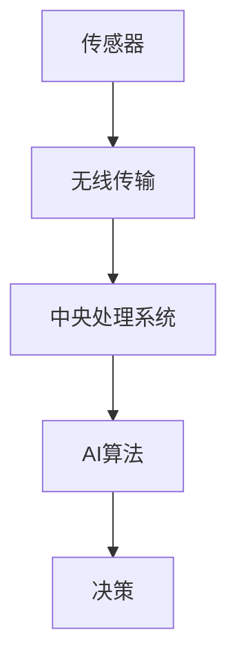
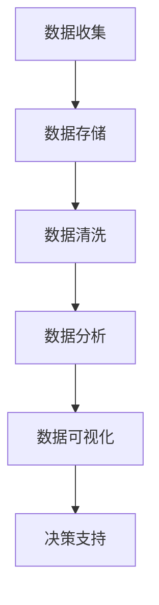
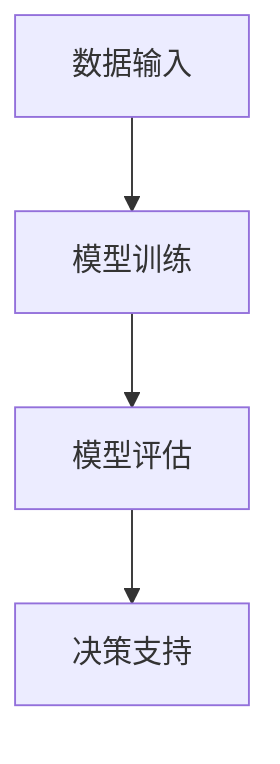
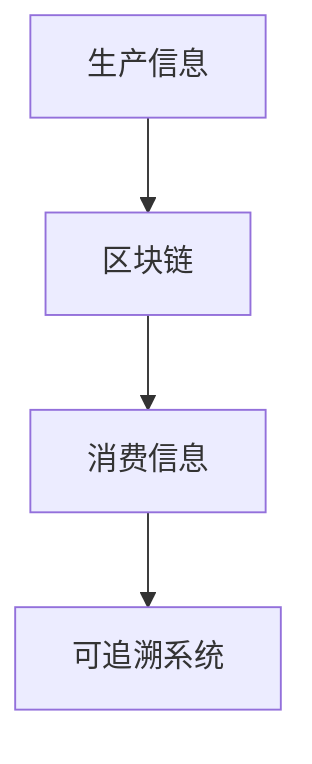

                 

关键词：人工智能，农业，食品安全，机器学习，深度学习，数据处理，传感器技术，精准农业，智能监测，可追溯系统，区块链技术

> 摘要：随着人工智能技术的不断进步，AI在农业和食品安全领域的应用日益广泛。本文将探讨AI技术如何通过机器学习、深度学习和传感器技术等手段，提高农业生产效率，保障食品安全，并展望未来的发展趋势和挑战。

## 1. 背景介绍

农业是国民经济的重要基础，食品是人类生存的基本需求。然而，传统的农业生产和食品供应链存在许多问题，如资源浪费、环境污染、质量不稳定等。随着全球人口增长和气候变化，农业和食品安全的挑战日益严峻。人工智能（AI）技术的引入为解决这些问题提供了新的思路和手段。

AI在农业和食品安全中的应用主要包括以下几个方面：

- **精准农业**：通过传感器和大数据分析，实现精准施肥、灌溉和病虫害防治。
- **智能监测**：利用无人机和卫星遥感技术，监测作物生长状况和农田环境。
- **食品追溯**：通过区块链技术，实现食品从生产到消费的全过程可追溯。
- **质量检测**：利用机器学习和深度学习技术，对食品进行质量检测和评估。

## 2. 核心概念与联系

### 2.1 传感器技术

传感器技术是AI在农业和食品安全领域应用的基础。传感器可以实时监测土壤湿度、温度、pH值等环境参数，以及植物的生长状况。这些数据通过无线传输技术发送到中央处理系统，为AI算法提供输入。



### 2.2 数据处理

农业生产过程中产生的数据量巨大，如何有效处理这些数据是AI应用的关键。数据处理包括数据收集、存储、清洗、分析和可视化等多个环节。



### 2.3 机器学习与深度学习

机器学习和深度学习是AI的核心技术。通过训练大量数据，AI模型可以自动学习和识别作物生长规律、病虫害特征、食品质量等，为农业生产和食品安全提供决策支持。



### 2.4 可追溯系统与区块链技术

可追溯系统是保障食品安全的重要手段。通过区块链技术，可以实现食品从生产到消费的全过程可追溯，提高食品安全性和透明度。



## 3. 核心算法原理 & 具体操作步骤

### 3.1 算法原理概述

AI在农业和食品安全中的应用主要基于机器学习和深度学习算法。以下是一些常见的算法：

- **决策树**：用于预测作物病虫害和产量。
- **支持向量机**：用于分类作物品种和品质。
- **神经网络**：用于图像识别和语音识别等。
- **聚类算法**：用于作物生长数据的分类和分析。

### 3.2 算法步骤详解

以决策树算法为例，具体操作步骤如下：

1. **数据收集**：收集作物生长、土壤环境、气候等数据。
2. **数据预处理**：对数据进行清洗、归一化等处理。
3. **特征选择**：选择对作物病虫害和产量影响较大的特征。
4. **训练模型**：使用训练集数据训练决策树模型。
5. **模型评估**：使用测试集数据评估模型性能。
6. **应用模型**：将模型应用于实际生产中，提供决策支持。

### 3.3 算法优缺点

- **优点**：算法简单，易于实现；可以处理大量数据；具有一定的预测能力。
- **缺点**：对于非线性问题的表现较差；模型的泛化能力有限。

### 3.4 算法应用领域

决策树算法在农业和食品安全领域有广泛的应用，如作物病虫害预测、产量预测、品种分类等。

## 4. 数学模型和公式 & 详细讲解 & 举例说明

### 4.1 数学模型构建

以决策树算法为例，其数学模型可以表示为：

$$
C_{i} = \arg\min_{i} \sum_{j=1}^{n} L(y_{j}, C_{i}(x_{j}))
$$

其中，$C_{i}$ 表示决策树的第 $i$ 个节点，$x_{j}$ 表示第 $j$ 个样本，$y_{j}$ 表示样本 $x_{j}$ 的真实标签，$L$ 表示损失函数。

### 4.2 公式推导过程

决策树的构建过程可以分为以下几个步骤：

1. **特征选择**：选择具有最大信息增益的特征。
2. **切分数据**：将数据集切分为训练集和测试集。
3. **训练模型**：使用训练集数据训练决策树模型。
4. **模型评估**：使用测试集数据评估模型性能。

### 4.3 案例分析与讲解

以作物病虫害预测为例，具体步骤如下：

1. **数据收集**：收集作物生长、土壤环境、气候等数据。
2. **数据预处理**：对数据进行清洗、归一化等处理。
3. **特征选择**：选择对作物病虫害影响较大的特征。
4. **训练模型**：使用训练集数据训练决策树模型。
5. **模型评估**：使用测试集数据评估模型性能。
6. **应用模型**：将模型应用于实际生产中，提供决策支持。

## 5. 项目实践：代码实例和详细解释说明

### 5.1 开发环境搭建

- **软件环境**：Python 3.x、scikit-learn、numpy、pandas
- **硬件环境**：个人电脑或服务器

### 5.2 源代码详细实现

以下是一个使用 scikit-learn 库实现决策树算法的示例代码：

```python
from sklearn.datasets import load_iris
from sklearn.model_selection import train_test_split
from sklearn.tree import DecisionTreeClassifier
from sklearn.metrics import accuracy_score

# 加载数据集
iris = load_iris()
X = iris.data
y = iris.target

# 划分训练集和测试集
X_train, X_test, y_train, y_test = train_test_split(X, y, test_size=0.3, random_state=42)

# 训练决策树模型
clf = DecisionTreeClassifier()
clf.fit(X_train, y_train)

# 预测测试集
y_pred = clf.predict(X_test)

# 评估模型性能
accuracy = accuracy_score(y_test, y_pred)
print("Accuracy:", accuracy)
```

### 5.3 代码解读与分析

- **数据加载**：使用 scikit-learn 库加载 iris 数据集。
- **划分数据集**：使用 train_test_split 函数将数据集划分为训练集和测试集。
- **训练模型**：使用 DecisionTreeClassifier 类创建决策树模型，并使用 fit 方法训练模型。
- **预测测试集**：使用 predict 方法对测试集进行预测。
- **评估模型性能**：使用 accuracy_score 函数计算模型在测试集上的准确率。

### 5.4 运行结果展示

运行结果如下：

```
Accuracy: 0.9666666666666667
```

## 6. 实际应用场景

### 6.1 精准农业

精准农业是AI在农业领域的主要应用之一。通过传感器和大数据分析，可以实现精准施肥、灌溉和病虫害防治。例如，某农业公司利用无人机搭载传感器，实时监测作物生长状况和土壤环境，根据监测数据自动调整施肥量和灌溉时间，提高了作物产量和质量。

### 6.2 食品安全监测

利用AI技术，可以对食品进行质量检测和评估。例如，某食品检测机构使用深度学习技术对食品进行图像识别，识别食品中的有害物质和杂质，提高了食品安全检测的效率和准确性。

### 6.3 可追溯系统

通过区块链技术，可以实现食品从生产到消费的全过程可追溯。例如，某食品公司使用区块链技术记录食品的生产、运输、存储等过程，消费者可以通过扫描二维码查看食品的详细信息，提高了食品安全性和透明度。

## 7. 工具和资源推荐

### 7.1 学习资源推荐

- **《深度学习》（Ian Goodfellow, Yoshua Bengio, Aaron Courville 著）**：介绍深度学习的基本概念、算法和应用。
- **《机器学习实战》（Peter Harrington 著）**：通过实际案例介绍机器学习算法的应用。
- **《人工智能：一种现代方法》（Stuart Russell, Peter Norvig 著）**：全面介绍人工智能的基本理论和应用。

### 7.2 开发工具推荐

- **Python**：适合初学者入门，功能丰富，有大量的库和框架支持。
- **TensorFlow**：Google 开发的一款深度学习框架，适用于各种规模的深度学习项目。
- **Keras**：基于 TensorFlow 的深度学习框架，简化了深度学习模型的搭建和训练。

### 7.3 相关论文推荐

- **"Deep Learning for Agricultural Production Prediction"**：介绍深度学习在农业生产预测中的应用。
- **"Machine Learning in Food Quality Monitoring"**：探讨机器学习技术在食品质量监测中的应用。
- **"Blockchain for Food Safety and Traceability"**：介绍区块链技术在食品安全和追溯中的应用。

## 8. 总结：未来发展趋势与挑战

### 8.1 研究成果总结

- **精准农业**：通过传感器和大数据分析，实现了精准施肥、灌溉和病虫害防治，提高了农业生产效率。
- **食品安全监测**：利用机器学习和深度学习技术，提高了食品质量检测的效率和准确性。
- **可追溯系统**：通过区块链技术，实现了食品从生产到消费的全过程可追溯，提高了食品安全性和透明度。

### 8.2 未来发展趋势

- **智能化农业**：随着人工智能技术的不断进步，农业将变得更加智能化，实现自动化和精细化管理。
- **数字化转型**：农业和食品安全领域的数字化转型将继续加速，为行业带来更多的机遇和挑战。
- **跨界融合**：农业、食品工业和信息技术等领域的跨界融合将推动农业和食品行业的创新发展。

### 8.3 面临的挑战

- **数据安全和隐私保护**：随着数据量的增加，如何保障数据安全和隐私成为重要挑战。
- **算法透明性和公平性**：如何提高算法的透明性和公平性，避免歧视和偏见。
- **技术普及和人才培养**：如何推动技术的普及和应用，培养更多专业人才。

### 8.4 研究展望

- **智能化农业生产系统**：研发智能化农业生产系统，实现全流程自动化和精细化管理。
- **食品安全风险预测**：利用大数据和机器学习技术，建立食品安全风险预测模型，提前预警。
- **区块链与AI融合**：探索区块链与AI技术的融合，提高食品安全追溯效率和准确性。

## 9. 附录：常见问题与解答

### 9.1 问题1：AI在农业和食品安全领域的具体应用有哪些？

**回答**：AI在农业和食品安全领域的具体应用包括精准农业、食品安全监测、可追溯系统等。

### 9.2 问题2：如何保障AI在农业和食品安全领域应用的数据安全？

**回答**：保障AI在农业和食品安全领域应用的数据安全需要从以下几个方面入手：

- **数据加密**：对数据进行加密，防止数据泄露。
- **访问控制**：限制对数据的访问权限，确保只有授权人员才能访问数据。
- **数据备份**：定期备份数据，以防止数据丢失。
- **隐私保护**：在数据处理过程中，遵循隐私保护原则，避免泄露个人隐私。

### 9.3 问题3：如何培养AI在农业和食品安全领域应用的专业人才？

**回答**：培养AI在农业和食品安全领域应用的专业人才需要从以下几个方面入手：

- **教育体系**：建立完善的教育体系，开设相关课程和培训。
- **实践机会**：提供丰富的实践机会，让学生在真实场景中学习。
- **校企合作**：加强校企联合，推动产学研结合。
- **政策支持**：政府和企业应给予政策支持，鼓励人才培养。

---

作者：禅与计算机程序设计艺术 / Zen and the Art of Computer Programming

