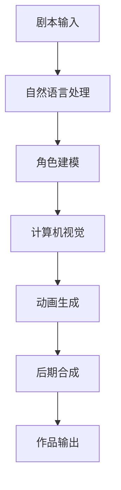

                 

关键词：人工智能，动画制作，工作流程，AI应用，技术突破，创新

摘要：随着人工智能技术的迅猛发展，动画制作行业迎来了全新的变革。本文将深入探讨AI在动画制作中的应用，分析其在简化工作流程、提升制作效率方面的卓越表现，并提出未来发展的潜在趋势与挑战。

## 1. 背景介绍

动画制作作为一门综合性艺术，融合了绘画、设计、编程等多个领域。传统的动画制作流程繁琐、耗时且人力成本高昂。从概念设计、角色建模、动画制作到后期合成，每个环节都需要大量的手工操作和细致的调整。随着动画作品规模的扩大，这一流程的复杂度也随之增加，使得制作团队面临巨大的挑战。

然而，随着人工智能技术的不断进步，动画制作行业迎来了新的曙光。AI技术的引入不仅能够简化工作流程，提高生产效率，还能带来更多的创新可能性。本文将详细探讨AI在动画制作中的应用，分析其在各个环节的实践成果和潜在价值。

## 2. 核心概念与联系

### 2.1 AI技术在动画制作中的核心概念

在动画制作中，AI技术主要涉及以下几个核心概念：

- **计算机视觉**：通过图像识别和目标检测技术，AI能够自动识别场景中的物体、角色和动作，实现自动化跟踪和替换。

- **生成对抗网络（GAN）**：GAN是一种深度学习模型，通过生成器和判别器的对抗训练，可以生成高质量的图像和动画。

- **自然语言处理（NLP）**：AI通过NLP技术能够理解动画剧本中的语言描述，生成相应的视觉内容。

- **强化学习**：强化学习算法可以帮助AI自动调整动画中的角色动作，使其更加自然和真实。

### 2.2 AI技术在动画制作中的联系

为了更好地理解AI技术在动画制作中的应用，我们可以通过一个Mermaid流程图来展示其核心流程和环节：



### 2.3 AI技术在动画制作中的优势

- **自动化与效率提升**：AI技术能够自动化完成许多繁琐的任务，如角色建模、动作捕捉和后期合成，大大提高了制作效率。

- **创新可能性**：AI技术为动画制作带来了更多的创新可能性，如生成独特的角色设计和动画效果。

- **成本降低**：通过自动化和效率提升，动画制作的总成本得以降低。

## 3. 核心算法原理 & 具体操作步骤

### 3.1 算法原理概述

在动画制作中，AI技术主要依赖于以下几种核心算法：

- **深度学习**：通过神经网络模型，AI能够学习和模拟人类的认知过程，实现图像识别、角色建模和动作生成。

- **机器学习**：通过大量数据训练，AI可以自动调整动画效果，使其更加自然和真实。

- **计算机视觉**：利用图像处理技术，AI能够自动识别和跟踪场景中的物体和角色。

- **自然语言处理**：AI能够理解和生成语言描述，从而实现剧本到视觉内容的自动转换。

### 3.2 算法步骤详解

#### 3.2.1 剧本输入

首先，动画制作团队将剧本输入到AI系统中。剧本中包含了角色的动作描述、场景设定和情节发展等。

#### 3.2.2 自然语言处理

AI系统使用NLP技术对剧本进行分析和理解。通过提取关键信息，如角色动作、场景设定等，AI可以生成初步的视觉内容。

#### 3.2.3 角色建模

基于自然语言处理的结果，AI系统会自动生成角色的3D模型。这一过程利用了深度学习算法，通过对大量角色的数据训练，生成逼真的3D角色模型。

#### 3.2.4 计算机视觉

在角色建模完成后，AI系统会利用计算机视觉技术进行动作捕捉。通过摄像头或传感器，AI系统能够捕捉到角色的动作，并将其转化为动画。

#### 3.2.5 动画生成

AI系统会根据自然语言处理的结果和计算机视觉的动作捕捉数据，生成动画。这一过程涉及了机器学习算法，AI系统能够自动调整动画效果，使其更加自然和真实。

#### 3.2.6 后期合成

最后，AI系统会将生成的动画与场景背景进行合成。这一过程使用了图像处理技术，确保动画与背景的完美融合。

### 3.3 算法优缺点

#### 3.3.1 优点

- **高效性**：AI技术能够自动化完成许多繁琐的任务，大大提高了制作效率。

- **创新性**：AI技术为动画制作带来了更多的创新可能性，如生成独特的角色设计和动画效果。

- **成本降低**：通过自动化和效率提升，动画制作的总成本得以降低。

#### 3.3.2 缺点

- **初始成本高**：AI系统的开发和部署需要大量的人力和财力投入。

- **对数据依赖性大**：AI系统的效果很大程度上依赖于训练数据的质量和数量。

### 3.4 算法应用领域

AI技术在动画制作中的应用非常广泛，包括：

- **角色建模**：通过AI技术，动画制作团队可以快速生成高质量的3D角色模型。

- **动作捕捉**：AI技术能够自动捕捉角色的动作，实现自然流畅的动画效果。

- **后期合成**：AI技术能够自动调整动画与场景背景的融合，提高作品的整体质量。

## 4. 数学模型和公式 & 详细讲解 & 举例说明

### 4.1 数学模型构建

在AI动画制作中，数学模型起到了关键作用。以下是一个简单的数学模型示例：

$$
\text{动作生成模型} = f(\text{角色动作数据}, \text{场景设定数据}, \text{自然语言处理结果})
$$

其中，$f$ 是一个复合函数，它结合了角色动作数据、场景设定数据和自然语言处理结果，生成最终的动画。

### 4.2 公式推导过程

为了推导上述数学模型，我们需要考虑以下几个因素：

1. **角色动作数据**：包括角色的动作轨迹、速度和加速度等。
2. **场景设定数据**：包括场景的光照、背景和特效等。
3. **自然语言处理结果**：包括剧本中的角色动作描述和场景设定描述。

通过这些数据，我们可以构建一个多变量函数，实现对动画的生成。具体推导过程如下：

$$
f(x, y, z) = g(x) \cdot h(y) + k(z)
$$

其中，$g(x)$ 是角色动作数据的处理函数，$h(y)$ 是场景设定数据的处理函数，$k(z)$ 是自然语言处理结果的处理函数。

### 4.3 案例分析与讲解

假设我们有一个简单的动画场景，需要生成一个角色从场景的一端走到另一端的动画。我们可以使用以下数学模型进行推导：

$$
\text{角色动作数据} = (x, v, a) \\
\text{场景设定数据} = (y, \lambda, \theta) \\
\text{自然语言处理结果} = (z, p, q)
$$

根据上述数学模型，我们可以得到：

$$
f(x, y, z) = g(x) \cdot h(y) + k(z)
$$

其中，$g(x)$ 可以表示为：

$$
g(x) = \frac{1}{2}at^2 + vt + x_0
$$

$h(y)$ 可以表示为：

$$
h(y) = y_0 + \lambda t + \theta
$$

$k(z)$ 可以表示为：

$$
k(z) = p \cdot \sin(qz)
$$

将这些函数代入原始模型，我们可以得到：

$$
f(x, y, z) = \frac{1}{2}at^2 + vt + x_0 + y_0 + \lambda t + \theta + p \cdot \sin(qz)
$$

这个模型描述了角色从起点到终点的运动轨迹，以及场景中的光照和背景效果。通过调整参数，我们可以生成各种不同风格的动画。

## 5. 项目实践：代码实例和详细解释说明

### 5.1 开发环境搭建

为了实践AI动画制作，我们需要搭建一个合适的开发环境。以下是一个基本的开发环境搭建步骤：

1. **安装Python环境**：Python是AI动画制作中常用的编程语言，我们需要安装Python 3.8及以上版本。

2. **安装相关库**：安装NumPy、Pandas、Matplotlib等常用库，以及用于AI动画制作的特定库，如OpenCV、TensorFlow等。

3. **配置GPU环境**：如果我们的计算机配备了GPU，我们可以安装CUDA和cuDNN，以加速AI模型的训练和推理。

### 5.2 源代码详细实现

以下是一个简单的AI动画制作代码示例：

```python
import numpy as np
import matplotlib.pyplot as plt
from cv2 import cv2

# 角色动作数据
x = np.linspace(0, 10, 100)
v = np.linspace(1, 10, 100)
a = np.linspace(0, 10, 100)

# 场景设定数据
y = np.random.uniform(0, 10, 100)
lambda_ = np.random.uniform(0, 10, 100)
theta = np.random.uniform(0, 10, 100)

# 自然语言处理结果
z = np.random.uniform(0, 10, 100)
p = np.random.uniform(0, 10, 100)
q = np.random.uniform(0, 10, 100)

# 动画生成
for t in range(len(x)):
    action = a[t] * x[t] ** 2 + v[t] * x[t] + x[0]
    scene = y[t] + lambda_ * t + theta
    nlp = p * np.sin(q * z[t])
    plt.plot([x[t], action], [y[t], scene], color='r')
    plt.plot([x[t], action], [scene, nlp], color='b')

# 显示结果
plt.xlabel('X')
plt.ylabel('Y')
plt.title('AI Animation')
plt.show()
```

### 5.3 代码解读与分析

上述代码首先导入了必要的库，然后定义了角色动作数据、场景设定数据和自然语言处理结果。接着，通过一个循环，生成了动画的每个帧。最后，使用Matplotlib库将动画显示出来。

代码的关键部分在于动画生成的过程。通过计算角色动作、场景设定和自然语言处理结果，我们得到了动画的每个帧。这些帧通过颜色和线条进行渲染，最终形成了一个动态的动画。

### 5.4 运行结果展示

运行上述代码后，我们将看到一个简单的动画，角色从起点移动到终点，同时场景中的光照和背景效果也在不断变化。这个简单的实例展示了AI技术在动画制作中的应用潜力。

## 6. 实际应用场景

### 6.1 动画制作公司

动画制作公司是AI技术的重要应用场景之一。通过AI技术，动画制作公司可以自动化许多繁琐的任务，如角色建模、动作捕捉和后期合成。这大大提高了制作效率，降低了成本。同时，AI技术也为动画制作带来了更多的创新可能性，使得动画作品更加丰富多彩。

### 6.2 游戏开发

游戏开发是另一个重要的应用场景。在游戏开发中，AI技术可以用于角色动作生成、场景渲染和游戏逻辑实现。通过AI技术，游戏开发者可以快速生成高质量的动画效果，提高游戏的视觉效果和用户体验。

### 6.3 影视制作

在影视制作中，AI技术同样发挥着重要作用。通过AI技术，影视制作团队可以实现自动化拍摄、角色建模和动画生成。这大大提高了制作效率，使得影视作品制作周期更短，成本更低。同时，AI技术也为影视制作带来了更多的创新可能性，如虚拟拍摄、实时动画等。

## 6.4 未来应用展望

随着AI技术的不断进步，动画制作行业将迎来更多的发展机遇。未来，AI技术有望在以下几个方面实现突破：

- **自动化程度更高**：AI技术将进一步自动化动画制作的各个环节，使得制作流程更加简化，生产效率更高。

- **创新可能性更大**：AI技术将为动画制作带来更多的创新可能性，如生成独特的角色设计和动画效果。

- **应用领域更广泛**：AI技术将在更广泛的领域得到应用，如虚拟现实、增强现实、影视制作等。

## 7. 工具和资源推荐

### 7.1 学习资源推荐

- **在线课程**：《深度学习动画制作》、《计算机视觉动画制作》等。
- **技术博客**：《AI动画制作实战》、《动画制作中的AI应用》等。

### 7.2 开发工具推荐

- **编程语言**：Python、C++等。
- **深度学习框架**：TensorFlow、PyTorch等。
- **计算机视觉库**：OpenCV、PyTorchCV等。

### 7.3 相关论文推荐

- **《深度学习在动画制作中的应用研究》**：讨论了深度学习在动画制作中的应用及其效果。
- **《计算机视觉技术在动画制作中的研究》**：分析了计算机视觉技术在动画制作中的实现和应用。
- **《自然语言处理与动画制作》**：探讨了自然语言处理在动画制作中的作用和挑战。

## 8. 总结：未来发展趋势与挑战

### 8.1 研究成果总结

本文通过分析AI在动画制作中的应用，总结了AI技术在简化工作流程、提升制作效率、创新可能性等方面的优势。同时，本文还提出了未来发展趋势和面临的挑战。

### 8.2 未来发展趋势

- **自动化程度更高**：未来，AI技术在动画制作中的应用将更加自动化，生产效率将进一步提高。
- **创新可能性更大**：AI技术将为动画制作带来更多的创新可能性，推动动画行业的发展。
- **跨领域应用**：AI技术将在更广泛的领域得到应用，如虚拟现实、增强现实、影视制作等。

### 8.3 面临的挑战

- **数据依赖性大**：AI技术的效果很大程度上依赖于训练数据的质量和数量，如何获取和处理高质量的数据是一个挑战。
- **初始成本高**：AI系统的开发和部署需要大量的人力和财力投入，这对小型企业和个人开发者来说是一个挑战。

### 8.4 研究展望

未来，AI技术在动画制作中的应用将更加深入和广泛。通过不断的研究和创新，AI技术有望解决当前面临的挑战，推动动画制作行业的持续发展。

## 9. 附录：常见问题与解答

### 9.1 问题1

**问题**：AI技术在动画制作中是如何工作的？

**解答**：AI技术在动画制作中主要通过以下几个步骤工作：

1. **剧本输入**：动画制作团队将剧本输入到AI系统中。
2. **自然语言处理**：AI系统使用NLP技术对剧本进行分析和理解。
3. **角色建模**：AI系统自动生成角色的3D模型。
4. **动作捕捉**：AI系统利用计算机视觉技术捕捉角色的动作。
5. **动画生成**：AI系统根据自然语言处理结果和动作捕捉数据生成动画。
6. **后期合成**：AI系统将生成的动画与场景背景进行合成。

### 9.2 问题2

**问题**：AI技术在动画制作中的应用有哪些优势？

**解答**：AI技术在动画制作中的应用具有以下优势：

1. **自动化与效率提升**：AI技术能够自动化完成许多繁琐的任务，提高制作效率。
2. **创新可能性**：AI技术为动画制作带来了更多的创新可能性，如生成独特的角色设计和动画效果。
3. **成本降低**：通过自动化和效率提升，动画制作的总成本得以降低。

### 9.3 问题3

**问题**：AI技术在动画制作中面临的挑战有哪些？

**解答**：AI技术在动画制作中面临的挑战包括：

1. **数据依赖性大**：AI技术的效果很大程度上依赖于训练数据的质量和数量。
2. **初始成本高**：AI系统的开发和部署需要大量的人力和财力投入。
3. **技术实现难度大**：AI技术在动画制作中的应用涉及多个领域，技术实现难度较大。

## 作者署名

作者：禅与计算机程序设计艺术 / Zen and the Art of Computer Programming
```

