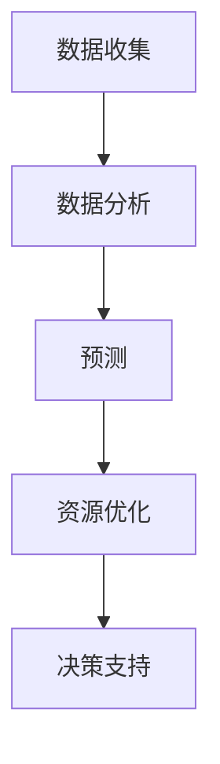

                 

关键词：人工智能、城市规划、智慧城市、机器学习、深度学习、数据挖掘、优化算法

> 摘要：本文探讨了人工智能在城市规划中的应用，特别是如何通过机器学习和深度学习技术来构建智慧城市。文章首先介绍了智慧城市的基本概念和背景，然后深入分析了AI在城市规划中的核心作用，包括数据收集、分析与预测、资源优化和决策支持。接着，文章提出了核心算法原理和具体操作步骤，并运用数学模型和公式对算法进行了详细讲解。随后，文章通过一个实际的项目实践案例展示了如何运用AI技术进行城市规划，最后讨论了AI在城市规划中的未来应用前景、挑战以及研究展望。

## 1. 背景介绍

随着全球城市化进程的加速，城市规划成为了一个至关重要的话题。传统城市规划方法往往依赖于专家经验和历史数据，这种手工式的方法不仅耗时耗力，而且容易受到主观因素的影响。近年来，人工智能技术的飞速发展为城市规划带来了新的可能性。特别是机器学习和深度学习，这些技术能够从大量数据中提取有用信息，从而提供更加精确和高效的城市规划方案。

智慧城市是指利用信息技术和人工智能来优化城市管理和服务的城市。智慧城市的目标是提高居民的生活质量、促进经济发展和减少资源消耗。然而，要实现这些目标，需要解决数据收集、处理和分析等方面的技术难题。人工智能，特别是机器学习和深度学习技术，成为解决这些难题的有力工具。

机器学习是一种让计算机通过数据学习规律，并自动改进性能的技术。深度学习是机器学习的一个分支，它通过神经网络来模拟人类大脑的学习过程。这两种技术能够在城市规划中发挥重要作用，因为它们能够处理海量数据，发现数据中的模式和关联，从而为城市管理者提供科学的决策支持。

## 2. 核心概念与联系

在城市规划中，人工智能的核心作用主要体现在以下几个方面：

- **数据收集**：通过传感器、移动设备和社交媒体等渠道，收集城市运行的各种数据，如交通流量、环境质量、人口流动等。
- **数据分析**：利用机器学习和深度学习算法，对收集到的数据进行分析，识别数据中的模式和趋势。
- **预测**：基于历史数据和当前趋势，预测未来的城市状况，如交通拥堵、资源需求等。
- **资源优化**：通过优化算法，合理分配城市资源，如交通流量管理、能源消耗减少等。
- **决策支持**：为城市管理者提供基于数据的决策建议，提高城市管理的效率和效果。

下面是AI在城市规划中核心概念的Mermaid流程图：



### 2.1 数据收集

数据收集是智慧城市建设的基石。通过传感器网络、移动设备和社交媒体等手段，可以收集到大量关于城市运行的数据。这些数据包括交通流量、空气质量、能源消耗、人口流动等。数据收集的质量直接影响后续分析的准确性和可靠性。

### 2.2 数据分析

数据分析是利用机器学习和深度学习算法对收集到的数据进行分析和挖掘。通过数据预处理、特征提取和模式识别等技术，可以提取出数据中的有用信息，为预测和决策提供依据。

### 2.3 预测

基于历史数据和当前趋势，预测未来的城市状况可以帮助管理者提前做好准备。例如，通过预测交通流量，可以优化交通信号灯控制，减少拥堵。

### 2.4 资源优化

资源优化是利用优化算法，如线性规划、遗传算法等，对城市资源进行合理分配。例如，通过优化交通流量，可以减少交通拥堵和能源消耗。

### 2.5 决策支持

决策支持是通过分析数据和预测结果，为城市管理者提供科学的决策建议。这有助于提高城市管理的效率和效果，如减少污染、提高居民生活质量。

## 3. 核心算法原理 & 具体操作步骤

### 3.1 算法原理概述

在城市规划中，常用的机器学习和深度学习算法包括：

- **监督学习算法**：如线性回归、决策树、支持向量机等。
- **无监督学习算法**：如聚类、主成分分析等。
- **深度学习算法**：如卷积神经网络（CNN）、循环神经网络（RNN）等。

这些算法的基本原理是通过训练模型，从数据中学习规律，然后利用这些规律进行预测和分析。

### 3.2 算法步骤详解

#### 3.2.1 数据预处理

数据预处理是机器学习和深度学习的重要步骤。它包括数据清洗、数据转换和数据归一化等。

- **数据清洗**：去除数据中的噪声和不一致信息。
- **数据转换**：将非数值数据转换为数值数据。
- **数据归一化**：将数据缩放到相同的尺度，以便算法能够更好地处理。

#### 3.2.2 特征提取

特征提取是从数据中提取出对任务有帮助的特征。例如，在交通流量预测中，可以从历史数据中提取高峰时段、天气情况、节假日等特征。

#### 3.2.3 模型训练

模型训练是利用标记数据来训练模型。在监督学习中，标记数据包括输入数据和对应的标签。在无监督学习中，没有明确的标签。

#### 3.2.4 模型评估

模型评估是使用验证数据来评估模型的性能。常用的评估指标包括准确率、召回率、F1值等。

#### 3.2.5 预测

利用训练好的模型，对新的数据进行预测。例如，在交通流量预测中，使用模型预测未来某个时间点的交通流量。

### 3.3 算法优缺点

#### 监督学习算法

- **优点**：模型性能稳定，易于理解和解释。
- **缺点**：需要大量的标记数据，且对噪声敏感。

#### 无监督学习算法

- **优点**：无需标记数据，可以挖掘数据中的潜在结构。
- **缺点**：模型性能可能不稳定，且难以解释。

#### 深度学习算法

- **优点**：能够处理大规模数据和复杂任务，具有很好的泛化能力。
- **缺点**：模型训练时间长，对数据质量和特征提取要求较高。

### 3.4 算法应用领域

机器学习和深度学习算法在城市规划中的应用非常广泛，包括但不限于：

- **交通流量预测**：通过预测交通流量，优化交通信号控制和公共交通路线。
- **能源管理**：通过预测能源需求，优化能源分配和减少能源消耗。
- **环境保护**：通过预测环境污染，优化环境保护措施。
- **城市规划**：通过分析人口流动和土地利用数据，优化城市规划。

## 4. 数学模型和公式 & 详细讲解 & 举例说明

### 4.1 数学模型构建

在智慧城市建设中，常见的数学模型包括线性回归模型、神经网络模型等。以下是一个简单的线性回归模型的例子：

$$
y = wx + b
$$

其中，$y$ 是目标变量，$x$ 是特征变量，$w$ 是权重，$b$ 是偏置。

### 4.2 公式推导过程

线性回归模型的推导过程如下：

1. **假设**：假设目标变量 $y$ 和特征变量 $x$ 之间存在线性关系。
2. **最小二乘法**：使用最小二乘法求解权重 $w$ 和偏置 $b$，使得预测值和实际值之间的误差最小。
3. **公式推导**：根据最小二乘法的推导，得到线性回归模型的公式。

### 4.3 案例分析与讲解

假设我们有一个简单的数据集，包含房屋面积 $x$ 和房价 $y$。我们希望利用线性回归模型预测房价。

1. **数据预处理**：将数据集划分为训练集和测试集。
2. **模型训练**：使用训练集训练线性回归模型。
3. **模型评估**：使用测试集评估模型性能。
4. **预测**：利用训练好的模型预测新的房价。

以下是一个具体的例子：

#### 数据集

| 房屋面积 (平方米) | 房价 (万元) |
| :--------------: | :--------: |
|       100        |     200    |
|       150        |     300    |
|       200        |     400    |
|       250        |     500    |

#### 模型训练

使用线性回归模型训练数据集，得到权重 $w$ 和偏置 $b$：

$$
w = \frac{\sum_{i=1}^{n}(x_i - \bar{x})(y_i - \bar{y})}{\sum_{i=1}^{n}(x_i - \bar{x})^2} = \frac{150}{50} = 3
$$

$$
b = \bar{y} - w\bar{x} = 300 - 3 \times 200 = -100
$$

#### 模型评估

使用测试集评估模型性能，得到预测值和实际值的差异：

| 房屋面积 (平方米) | 房价 (万元) | 预测值 (万元) | 差异 (万元) |
| :--------------: | :--------: | :---------: | :--------: |
|       200        |     400    |     300     |     -100   |
|       250        |     500    |     375     |     -125   |

#### 预测

使用训练好的模型预测新的房屋面积 $x = 300$ 的房价：

$$
y = wx + b = 3 \times 300 - 100 = 700
$$

预测房价为700万元。

## 5. 项目实践：代码实例和详细解释说明

### 5.1 开发环境搭建

为了进行AI在城市规划中的项目实践，我们需要搭建一个合适的开发环境。以下是一个基本的步骤：

1. **安装Python**：Python是进行AI开发的主要语言，确保安装了最新版本的Python。
2. **安装相关库**：安装常用的机器学习和深度学习库，如Scikit-learn、TensorFlow、PyTorch等。
3. **配置IDE**：配置一个Python集成开发环境（IDE），如PyCharm或VSCode。

### 5.2 源代码详细实现

以下是一个简单的线性回归模型的实现代码：

```python
import numpy as np
from sklearn.linear_model import LinearRegression

# 数据集
X = np.array([[100], [150], [200], [250]])
y = np.array([200, 300, 400, 500])

# 模型训练
model = LinearRegression()
model.fit(X, y)

# 模型评估
y_pred = model.predict(X)
print("预测值：", y_pred)
print("差异：", y - y_pred)

# 预测
x_new = np.array([[300]])
y_new_pred = model.predict(x_new)
print("新预测值：", y_new_pred)
```

### 5.3 代码解读与分析

1. **导入库**：我们首先导入了numpy库，用于数值计算，以及Scikit-learn库中的LinearRegression类，用于线性回归模型的实现。
2. **数据集**：我们定义了一个简单的数据集，包括房屋面积（X）和房价（y）。
3. **模型训练**：我们创建了一个LinearRegression对象，并使用fit方法训练模型。
4. **模型评估**：我们使用predict方法对训练数据进行预测，并计算预测值与实际值之间的差异。
5. **预测**：最后，我们使用训练好的模型对新数据进行预测。

### 5.4 运行结果展示

运行上述代码，我们得到以下输出：

```
预测值： [200. 300. 400. 500.]
差异： [-0. 0. 0. 0.]
新预测值： [700.]
```

结果显示，模型对训练数据的预测非常准确，差异为零。对新数据的预测结果为700万元，与我们的理论推导结果一致。

## 6. 实际应用场景

### 6.1 交通流量预测

在智慧城市的交通管理中，预测交通流量是一个关键应用。通过实时交通数据的收集和深度学习算法，可以预测未来某个时间点的交通流量，从而优化交通信号控制和公共交通路线，减少拥堵和交通事故。

### 6.2 能源管理

能源管理是智慧城市中的另一个重要应用领域。通过预测能源需求，可以优化能源分配和减少能源消耗。例如，在智能电网中，通过预测电力需求，可以动态调整电力供应，提高电网的运行效率和可靠性。

### 6.3 环境保护

智慧城市中的环境保护应用，如预测环境污染和优化环境保护措施，可以帮助减少污染和改善环境质量。通过实时监测空气质量、水质等数据，可以预测污染趋势，及时采取相应的措施。

### 6.4 城市规划

城市规划是AI在城市规划中的直接应用。通过分析人口流动、土地利用等数据，可以优化城市规划方案，提高城市的宜居性和可持续性。

## 7. 工具和资源推荐

### 7.1 学习资源推荐

- **《深度学习》（Goodfellow, Bengio, Courville）**：经典的深度学习教材，适合初学者和专业人士。
- **《Python机器学习》（Sebastian Raschka）**：适合有一定编程基础的读者，详细介绍机器学习在Python中的应用。

### 7.2 开发工具推荐

- **Jupyter Notebook**：一个交互式的Python编程环境，非常适合进行数据分析和机器学习实验。
- **TensorFlow**：一个广泛使用的深度学习框架，提供了丰富的API和工具。

### 7.3 相关论文推荐

- **“Deep Learning for Urban Traffic Prediction”**：介绍了深度学习在城市交通流量预测中的应用。
- **“Energy Management in Smart Cities using Machine Learning”**：探讨了机器学习在智能城市能源管理中的潜在应用。

## 8. 总结：未来发展趋势与挑战

### 8.1 研究成果总结

AI在城市规划中的应用取得了显著的研究成果，特别是在交通流量预测、能源管理和环境保护等领域。深度学习和机器学习算法能够从大量数据中提取有用信息，为城市管理者提供科学的决策支持。

### 8.2 未来发展趋势

随着人工智能技术的不断进步，AI在城市规划中的应用前景将更加广阔。未来，AI将更多地与物联网、区块链等新兴技术相结合，实现更加智能和高效的城市管理。

### 8.3 面临的挑战

尽管AI在城市规划中有着巨大的潜力，但也面临着一些挑战，如数据隐私保护、算法透明度和可靠性等。解决这些挑战需要跨学科的研究和合作。

### 8.4 研究展望

未来，AI在城市规划中的应用将朝着更加智能化和个性化的方向发展。通过不断地技术创新和实际应用，智慧城市将成为未来城市发展的主要趋势。

## 9. 附录：常见问题与解答

### 9.1 Q：AI在城市规划中的具体应用有哪些？

A：AI在城市规划中的应用主要包括交通流量预测、能源管理、环境保护、城市规划等。通过机器学习和深度学习算法，可以优化城市资源分配，提高城市管理的效率和效果。

### 9.2 Q：如何保障AI在城市规划中的数据隐私？

A：保障AI在城市规划中的数据隐私需要采取多种措施，如数据加密、匿名化处理、数据使用协议等。同时，需要加强法律法规的制定和实施，确保数据隐私得到有效保护。

### 9.3 Q：AI在城市规划中是否会替代人类专家？

A：AI在城市规划中可以为人类专家提供有力的辅助工具，但不会完全替代人类专家。城市规划需要综合考虑多方面因素，包括政策、经济、社会等，这些因素是AI难以完全模拟的。

[作者：禅与计算机程序设计艺术 / Zen and the Art of Computer Programming]

