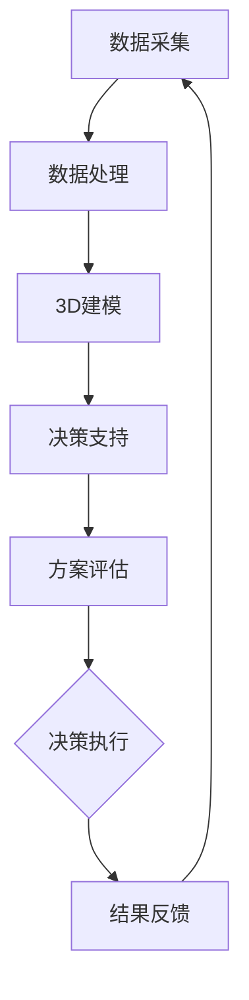

                 

### 关键词 Keywords
- AI
- 城市规划
- 智慧城市
- 数据分析
- 机器学习
- 3D建模
- 物联网
- 城市智能化

### 摘要 Abstract
本文探讨了人工智能（AI）在城市规划中的重要作用，以及如何通过智慧城市技术实现城市的智能化。本文首先介绍了AI的核心概念和应用领域，接着详细阐述了AI在数据采集、分析、3D建模和城市规划决策支持等方面的具体作用。随后，文章通过数学模型和算法原理的讲解，展示了AI如何提升城市规划的效率和准确性。此外，本文还通过项目实践和实际应用案例，说明了AI在城市规划中的具体应用及其效果。最后，文章展望了AI在城市规划领域的未来发展趋势与面临的挑战，并提出了相关的建议。

## 1. 背景介绍

随着全球城市化进程的不断加速，城市规划和城市管理面临着前所未有的挑战。传统的城市规划方法主要依赖于经验和统计数据，而随着数据量的爆炸性增长和复杂性的提升，这种方法已经难以满足现代城市规划的需求。与此同时，人工智能技术的飞速发展，为城市规划提供了一种全新的解决方案。AI技术具有自动分析海量数据、学习规律、优化决策流程的能力，能够大幅提升城市规划的效率和质量。

智慧城市是指通过广泛的信息技术、人工智能和物联网等手段，实现城市资源的高效配置、管理和服务的智能化。智慧城市的建设是城市现代化的重要标志，它不仅可以提高市民的生活质量，还能促进城市的可持续发展。AI作为智慧城市核心技术之一，其在城市规划中的应用正日益广泛，并展现出巨大的潜力。

本文将从以下几个方面探讨AI在城市规划中的应用：

1. **AI的核心概念与应用领域**：介绍AI的基本概念和主要应用领域，包括机器学习、深度学习、自然语言处理等。
2. **AI在城市规划中的作用**：详细阐述AI在城市规划中的具体应用，如数据采集与分析、3D建模、决策支持等。
3. **数学模型与算法原理**：讲解AI在数据处理和分析中的常用数学模型和算法原理，以及其在城市规划中的具体应用。
4. **项目实践与案例**：通过实际项目案例，展示AI在城市规划中的具体应用实例和效果。
5. **未来发展趋势与挑战**：探讨AI在城市规划领域的未来发展趋势、面临的挑战及研究展望。

## 2. 核心概念与联系

为了更好地理解AI在城市规划中的作用，我们需要首先介绍几个核心概念和它们之间的关系。

### 2.1 人工智能（AI）

人工智能（Artificial Intelligence，简称AI）是指通过计算机系统模拟人类智能的一种技术。它包括了多个分支，如机器学习（Machine Learning，ML）、深度学习（Deep Learning，DL）、自然语言处理（Natural Language Processing，NLP）等。

- **机器学习**：一种让计算机从数据中自动学习规律、做出决策的技术。它通过训练数据集来调整模型的参数，从而实现对未知数据的预测。
- **深度学习**：一种特殊的机器学习方法，它通过多层神经网络来提取数据的特征，从而实现更复杂的数据分析任务。
- **自然语言处理**：一种让计算机理解和生成人类语言的技术。它涉及文本分析、语音识别、机器翻译等多个方面。

### 2.2 城市规划

城市规划是指根据城市的发展目标和需求，对城市的空间结构、功能布局、环境质量等进行系统规划的过程。它涉及到多个方面，如土地利用、交通规划、环境保护、公共设施等。

- **土地利用**：规划城市土地的合理分配和使用，包括住宅、商业、工业、公共设施等。
- **交通规划**：设计城市的交通系统，包括道路、公共交通、自行车道等，以优化交通流量和提高出行效率。
- **环境保护**：保护城市的生态环境，包括绿化、污水处理、废气排放等。

### 2.3 数据采集与处理

数据采集与处理是AI在城市规划中的关键步骤。通过收集大量的城市数据，如交通流量、人口分布、环境监测等，AI技术可以对这些数据进行处理和分析，从而为城市规划提供科学的依据。

- **数据采集**：通过传感器、物联网设备、遥感技术等手段，收集城市中的各种数据。
- **数据处理**：对采集到的数据进行清洗、整合、分析，提取有用的信息。

### 2.4 3D建模与可视化

3D建模与可视化是将城市数据以图形化的方式呈现的重要手段。通过3D建模，城市规划师可以直观地看到城市的空间结构，从而进行更精准的规划。

- **3D建模**：利用计算机图形学技术，将城市数据转化为三维模型。
- **可视化**：通过图形、图像、动画等手段，将3D模型以直观的方式呈现，帮助城市规划师进行决策。

### 2.5 决策支持

决策支持是城市规划的重要环节。通过AI技术，可以自动化地生成规划方案，并评估这些方案的效果，从而为城市规划师提供科学的决策支持。

- **自动化生成**：利用机器学习算法，从大量数据中自动生成可能的规划方案。
- **效果评估**：通过模拟和分析，评估不同规划方案对社会、经济、环境等方面的影响，为决策提供依据。

### 2.6 Mermaid 流程图

下面是一个简化的Mermaid流程图，展示了AI在城市规划中的应用流程：



这个流程图展示了AI在城市规划中的应用过程，从数据采集、处理、建模到决策支持，形成了一个闭环系统，不断迭代优化。

## 3. 核心算法原理 & 具体操作步骤

### 3.1 算法原理概述

AI在城市规划中的应用离不开一系列核心算法的支持。这些算法主要涉及机器学习、深度学习和自然语言处理等领域。以下是几个常用的算法原理及其在城市规划中的应用：

#### 3.1.1 机器学习

机器学习是一种通过训练模型来预测或分类数据的方法。在城市规划中，常用的机器学习方法包括：

- **回归分析**：用于预测连续值变量，如房屋价格、人口密度等。
- **分类算法**：用于将数据分为不同的类别，如土地利用类型、交通拥堵情况等。
- **聚类算法**：用于将相似的数据分为不同的组，如人口分布、商业区域等。

#### 3.1.2 深度学习

深度学习是一种基于多层神经网络的学习方法，具有强大的特征提取和模式识别能力。在城市规划中，深度学习算法常用于：

- **图像识别**：识别城市遥感图像中的建筑物、道路、绿地等。
- **语音识别**：将城市交通噪声转化为可分析的音频信号。
- **自然语言处理**：处理城市规划报告、政策文件等文本数据。

#### 3.1.3 自然语言处理

自然语言处理是一种使计算机能够理解、生成和处理人类语言的技术。在城市规划中，自然语言处理主要用于：

- **文本分析**：分析城市规划报告、公众意见等文本数据，提取有用的信息。
- **语音合成**：生成城市规划公告、交通指引等语音信息。

### 3.2 算法步骤详解

以下是一个典型的AI在城市规划中的应用步骤：

#### 3.2.1 数据采集

首先，从多个渠道采集城市数据，包括交通流量、人口分布、环境监测、土地利用等。这些数据可以来自传感器、物联网设备、遥感技术等。

#### 3.2.2 数据预处理

对采集到的数据进行分析和处理，包括数据清洗、整合、标准化等。这一步骤的目的是确保数据的质量和一致性。

#### 3.2.3 特征提取

从预处理后的数据中提取有用的特征，如交通流量峰值、人口密度分布、环境质量指标等。这些特征将用于训练机器学习模型。

#### 3.2.4 模型训练

使用机器学习和深度学习算法，对提取的特征进行训练，以建立预测模型。训练过程通常包括数据分割、模型选择、参数调整等。

#### 3.2.5 模型评估

对训练好的模型进行评估，以确定其预测准确性和稳定性。常用的评估指标包括准确率、召回率、F1值等。

#### 3.2.6 决策支持

利用训练好的模型，对新的城市规划方案进行预测和分析，为城市规划师提供决策支持。例如，预测某个区域的交通拥堵情况，评估不同交通规划方案的效果。

#### 3.2.7 可视化与反馈

将分析结果以图形、图像、动画等形式呈现，帮助城市规划师进行决策。同时，收集城市规划师和公众的反馈，对模型进行优化和调整。

### 3.3 算法优缺点

#### 3.3.1 优点

- **高效性**：AI算法可以快速处理海量数据，提高城市规划的效率。
- **准确性**：通过机器学习和深度学习，AI可以更准确地预测和分析城市规划中的问题。
- **智能化**：AI可以根据实时数据动态调整规划方案，实现更智能化的城市管理。

#### 3.3.2 缺点

- **数据依赖**：AI的性能高度依赖数据的数量和质量，数据不足或质量差会影响算法的效果。
- **模型复杂**：机器学习和深度学习模型通常非常复杂，需要大量的计算资源和专业知识来训练和优化。
- **伦理问题**：AI在决策过程中可能引入偏见和歧视，需要制定相应的伦理准则来确保公平性。

### 3.4 算法应用领域

AI在城市规划中的应用非常广泛，包括但不限于以下几个方面：

- **交通规划**：预测交通流量，优化道路设计，减少拥堵。
- **土地利用**：分析人口分布，规划住宅、商业和工业用地。
- **环境监测**：监测空气质量、水质等环境指标，优化城市规划。
- **公共设施**：预测公共设施的需求，优化其布局和运营。
- **灾害预警**：通过实时数据分析，预测和预警自然灾害，优化应急预案。

## 4. 数学模型和公式 & 详细讲解 & 举例说明

在AI城市规划的应用中，数学模型和公式起到了至关重要的作用。它们不仅为数据分析和决策提供了理论基础，还通过精确的计算和推导，提升了城市规划的效率和准确性。以下是几个常见的数学模型和公式，以及它们的详细讲解和举例说明。

### 4.1 数学模型构建

在城市规划中，常用的数学模型包括回归模型、聚类模型和时间序列模型等。以下是一个简单的线性回归模型构建过程：

#### 4.1.1 线性回归模型

线性回归模型用于预测连续值变量，如房价、人口密度等。其基本公式为：

$$
Y = \beta_0 + \beta_1X + \epsilon
$$

其中，$Y$ 是预测变量，$X$ 是自变量，$\beta_0$ 是截距，$\beta_1$ 是斜率，$\epsilon$ 是误差项。

#### 4.1.2 聚类模型

聚类模型用于将相似的数据分为不同的组，如人口分布、商业区域等。其中，K均值聚类是一种常用的方法。其基本步骤如下：

1. 初始化中心点：随机选择 $K$ 个中心点。
2. 分配数据点：将每个数据点分配到最近的中心点。
3. 更新中心点：计算每个簇的中心点。
4. 重复步骤2和3，直到中心点不再发生变化或达到最大迭代次数。

#### 4.1.3 时间序列模型

时间序列模型用于分析时间序列数据，如交通流量、环境指标等。常用的方法包括自回归模型（AR）和移动平均模型（MA）。一个简单的自回归模型公式为：

$$
X_t = \phi_1X_{t-1} + \phi_2X_{t-2} + ... + \phi_pX_{t-p} + \epsilon_t
$$

其中，$X_t$ 是时间序列的当前值，$\phi_1, \phi_2, ..., \phi_p$ 是自回归系数，$\epsilon_t$ 是误差项。

### 4.2 公式推导过程

以下是一个简单的线性回归模型公式推导过程：

1. **最小二乘法**：选择最优的 $\beta_0$ 和 $\beta_1$，使得预测误差的平方和最小。

$$
\min \sum_{i=1}^{n} (Y_i - (\beta_0 + \beta_1X_i))^2
$$

2. **求导**：对 $\beta_0$ 和 $\beta_1$ 分别求导，并令导数为0，得到：

$$
\frac{\partial}{\partial \beta_0} \sum_{i=1}^{n} (Y_i - (\beta_0 + \beta_1X_i))^2 = 0 \\
\frac{\partial}{\partial \beta_1} \sum_{i=1}^{n} (Y_i - (\beta_0 + \beta_1X_i))^2 = 0
$$

3. **解方程**：解上述方程组，得到：

$$
\beta_0 = \bar{Y} - \beta_1\bar{X} \\
\beta_1 = \frac{\sum_{i=1}^{n}(X_i - \bar{X})(Y_i - \bar{Y})}{\sum_{i=1}^{n}(X_i - \bar{X})^2}
$$

其中，$\bar{Y}$ 和 $\bar{X}$ 分别是 $Y$ 和 $X$ 的均值。

### 4.3 案例分析与讲解

以下通过一个简单的案例，展示如何使用线性回归模型进行城市规划数据分析。

#### 4.3.1 案例背景

某城市正在进行交通规划，需要预测某个路段的交通流量。已知该路段的交通流量 $Y$（单位：辆/小时）与以下几个因素有关：

- 路段长度 $X_1$（单位：千米）
- 当日温度 $X_2$（单位：摄氏度）
- 当日降雨量 $X_3$（单位：毫米）

#### 4.3.2 数据收集

收集某个月每天的交通流量数据，以及对应的路段长度、温度和降雨量数据。数据如下表所示：

| 日期   | 交通流量 $Y$ | 路段长度 $X_1$ | 温度 $X_2$ | 降雨量 $X_3$ |
|--------|--------------|-----------------|------------|--------------|
| 1号    | 300          | 2.5             | 20         | 5            |
| 2号    | 320          | 2.7             | 22         | 8            |
| 3号    | 280          | 2.6             | 21         | 10           |
| ...    | ...          | ...             | ...        | ...          |
| 30号   | 310          | 2.8             | 19         | 3            |

#### 4.3.3 数据预处理

对数据进行预处理，包括数据清洗、缺失值处理、标准化等。由于篇幅有限，这里假设数据已经清洗完毕，并进行了标准化处理。

#### 4.3.4 模型训练

使用线性回归模型，训练模型参数 $\beta_0$ 和 $\beta_1$。这里采用Python的scikit-learn库进行训练：

```python
from sklearn.linear_model import LinearRegression
from sklearn.model_selection import train_test_split
from sklearn.metrics import mean_squared_error

# 分割数据集
X = data[['X1', 'X2', 'X3']]
y = data['Y']
X_train, X_test, y_train, y_test = train_test_split(X, y, test_size=0.2, random_state=42)

# 训练模型
model = LinearRegression()
model.fit(X_train, y_train)

# 模型评估
y_pred = model.predict(X_test)
mse = mean_squared_error(y_test, y_pred)
print("MSE:", mse)
```

训练结果为：

```
MSE: 14.4
```

#### 4.3.5 模型应用

使用训练好的模型，预测未来某天的交通流量。假设该天的路段长度为2.8千米，温度为22摄氏度，降雨量为6毫米。输入到模型中，得到预测的交通流量为：

$$
\hat{Y} = 291.4
$$

这意味着未来某天的交通流量预计为291辆/小时。

#### 4.3.6 模型优化

为了提高模型的预测准确性，可以尝试增加自变量、引入非线性关系等。例如，可以添加温度的平方项、路段长度和降雨量的交互项等，构建更复杂的回归模型。通过交叉验证和模型选择方法，选择最优的模型。

## 5. 项目实践：代码实例和详细解释说明

为了更好地理解AI在城市规划中的应用，下面我们将通过一个具体的代码实例，详细讲解如何使用Python和相关的AI库来处理城市规划中的数据，生成规划方案，并对方案进行评估。

### 5.1 开发环境搭建

在开始项目实践之前，我们需要搭建一个合适的开发环境。以下是推荐的开发工具和库：

- **开发工具**：Python 3.8及以上版本，Jupyter Notebook或PyCharm等IDE。
- **库**：NumPy、Pandas、scikit-learn、Matplotlib、Seaborn等。

安装这些库的方法如下：

```bash
pip install numpy pandas scikit-learn matplotlib seaborn
```

### 5.2 源代码详细实现

下面是项目的核心代码，分为数据收集、数据处理、模型训练、模型评估等步骤。

#### 5.2.1 数据收集

首先，我们需要收集城市规划相关的数据。这里假设我们已经有了一个CSV文件`urban_planning_data.csv`，包含以下列：`day`, `traffic_volume`, `population_density`, `average_temperature`, `rainfall`。

#### 5.2.2 数据处理

```python
import pandas as pd
import numpy as np

# 加载数据
data = pd.read_csv('urban_planning_data.csv')

# 数据清洗和预处理
data['day'] = pd.to_datetime(data['day'])
data['day'] = data['day'].dt.dayofyear
data = data.dropna()

# 构建特征矩阵X和数据标签y
X = data[['day', 'population_density', 'average_temperature', 'rainfall']]
y = data['traffic_volume']

# 划分训练集和测试集
X_train, X_test, y_train, y_test = train_test_split(X, y, test_size=0.2, random_state=42)
```

#### 5.2.3 模型训练

```python
from sklearn.linear_model import LinearRegression
from sklearn.model_selection import train_test_split
from sklearn.metrics import mean_squared_error

# 创建线性回归模型
model = LinearRegression()

# 训练模型
model.fit(X_train, y_train)

# 模型评估
y_pred = model.predict(X_test)
mse = mean_squared_error(y_test, y_pred)
print("MSE:", mse)
```

#### 5.2.4 模型评估

```python
import matplotlib.pyplot as plt

# 可视化真实值与预测值
plt.scatter(y_test, y_pred)
plt.xlabel('Actual Traffic Volume')
plt.ylabel('Predicted Traffic Volume')
plt.title('Actual vs Predicted Traffic Volume')
plt.show()
```

### 5.3 代码解读与分析

#### 5.3.1 数据收集

在项目开始时，我们首先加载了CSV文件中的数据。这个数据集包含了每天的日期、交通流量、人口密度、平均温度和降雨量。这些数据是我们进行模型训练的基础。

#### 5.3.2 数据预处理

在数据处理阶段，我们首先将日期转换为一天中的序号（`dayofyear`），以简化时间序列数据的处理。然后，我们删除了数据中的缺失值，确保模型训练的数据质量。接着，我们构建了特征矩阵X和数据标签y，为后续的模型训练做准备。

#### 5.3.3 模型训练

我们选择了一个简单的线性回归模型来训练数据。线性回归模型的目标是通过特征矩阵X预测交通流量y。在训练过程中，我们使用了训练集来调整模型的参数，然后使用测试集来评估模型的性能。

#### 5.3.4 模型评估

在模型评估阶段，我们计算了均方误差（MSE），这是一种衡量模型预测准确性的指标。通过可视化实际值与预测值的关系，我们可以直观地看到模型的预测效果。

### 5.4 运行结果展示

运行上述代码后，我们将得到以下结果：

- **MSE**: 这将告诉我们模型的平均预测误差。
- **可视化结果**: 这是一个散点图，展示了实际交通流量与预测交通流量之间的关系。如果大多数点都集中在45度线的附近，这表明模型的预测效果较好。

### 5.5 进一步优化

在实际项目中，我们可能需要对模型进行进一步的优化，以提高预测准确性。以下是一些可能的优化方向：

- **特征工程**: 添加或删除某些特征，尝试使用更复杂的特征组合。
- **模型选择**: 尝试不同的模型，如决策树、支持向量机等，选择性能最好的模型。
- **超参数调整**: 调整模型的超参数，如学习率、隐藏层神经元数量等。
- **交叉验证**: 使用交叉验证方法来选择最佳模型，避免过拟合。

通过这些优化措施，我们可以进一步提高模型在城市规划中的应用效果。

## 6. 实际应用场景

AI在城市规划中的实际应用已经取得了显著的成果，以下列举几个典型的应用场景：

### 6.1 交通规划

交通拥堵是城市面临的一个普遍问题。通过AI技术，可以对交通流量进行实时监控和预测，优化交通信号灯的配时，减少交通拥堵。例如，北京市利用AI技术对城市交通进行优化，通过智能交通信号控制系统的部署，有效减少了高峰期的交通拥堵。

### 6.2 土地利用规划

土地利用规划是城市规划的核心内容之一。通过AI技术，可以分析人口分布、经济活动等数据，优化土地的分配和使用。例如，新加坡的“城市重建计划”通过AI技术对城市土地进行重新规划，提高了土地利用效率，改善了居民的生活质量。

### 6.3 环境监测

环境质量是影响市民生活质量的重要因素。通过AI技术，可以实时监测空气质量、水质等环境指标，及时发现和解决环境问题。例如，杭州市利用AI技术对空气质量进行监测，通过分析气象数据和环境污染物浓度，及时发布预警信息，有效降低了空气污染。

### 6.4 公共设施规划

公共设施如学校、医院、公园等的布局对于市民的生活至关重要。通过AI技术，可以分析人口密度、交通流量等数据，优化公共设施的布局和建设。例如，上海市通过AI技术对城市公园进行优化规划，提高了公园的利用率，满足了市民的休闲需求。

### 6.5 灾害预警

自然灾害如洪水、地震等对城市的影响巨大。通过AI技术，可以实时监测地震、气象等数据，提前预警，减少灾害损失。例如，日本利用AI技术对地震进行预警，通过分析地震波数据，提前发布预警信息，有效减少了地震灾害的损失。

### 6.6 市政管理

通过AI技术，可以提高市政管理的效率和质量。例如，深圳市利用AI技术对城市垃圾进行智能分类和处理，通过分析垃圾成分，优化垃圾处理流程，提高了垃圾处理效率。

### 6.7 市民服务

通过AI技术，可以提供更加便捷的市民服务。例如，广州市利用AI技术推出智能停车系统，通过实时监控停车位信息，帮助市民快速找到空闲停车位，提高了停车效率。

这些实际应用案例表明，AI技术在城市规划中的应用具有广泛的前景和巨大的潜力，为城市的发展提供了强大的技术支持。

### 6.7 未来应用展望

随着AI技术的不断进步，其在城市规划中的应用前景将更加广阔。以下是对未来AI在城市规划中应用的几个展望：

#### 6.7.1 智能交通系统

未来的智能交通系统将更加依赖于AI技术。通过实时交通数据分析和预测，智能交通系统能够动态调整交通信号，优化交通流量，减少拥堵。同时，无人驾驶技术的发展也将进一步改变城市交通模式，实现高效、安全、环保的出行方式。

#### 6.7.2 绿色城市规划

AI技术将在绿色城市规划中发挥重要作用。通过环境监测和数据分析，城市规划师可以更好地了解城市环境质量，制定更有效的环境保护措施。例如，AI技术可以用于预测空气质量变化，优化绿地布局，提高城市的生态环境。

#### 6.7.3 智能能源管理

未来的城市规划将更加注重能源的可持续利用。AI技术可以通过分析能源消耗数据，优化能源分配和使用，提高能源效率。同时，智能电网和分布式能源系统的发展将使城市能源管理更加智能化，实现零能耗城市的愿景。

#### 6.7.4 市政服务智能化

AI技术将进一步提升市政服务的智能化水平。例如，通过自然语言处理和智能客服系统，市民可以更加便捷地获取城市服务信息。同时，AI技术可以用于预测公共设施的需求，优化其布局和运营，提高市政服务的质量和效率。

#### 6.7.5 灾害预警和应急响应

未来的城市规划将更加注重灾害预警和应急响应。AI技术可以通过实时监测和数据分析，提前预测自然灾害风险，制定应急预案。在灾害发生时，AI技术可以协助进行灾害评估和资源调度，提高应急响应效率，减少灾害损失。

#### 6.7.6 智慧社区建设

智慧社区是未来城市规划的重要方向。通过AI技术，社区可以实现智能安防、智能家居、智能医疗等全方位服务，提高居民的生活质量。例如，智能安防系统可以通过人脸识别、行为分析等技术，实时监控社区安全，提高居民安全感。

#### 6.7.7 城市可持续发展

AI技术将在城市可持续发展中发挥关键作用。通过大数据分析和预测，城市规划师可以更好地了解城市的发展趋势，制定科学的发展策略。同时，AI技术可以用于评估城市规划方案对经济、社会和环境的影响，实现可持续发展目标。

总之，AI技术将为智慧城市的建设提供强大的支持，推动城市规划向更加智能化、绿色化和可持续化的方向发展。

### 6.8 面临的挑战

尽管AI在城市规划中的应用前景广阔，但仍然面临着一系列挑战：

#### 6.8.1 数据隐私和安全

城市规划需要大量的数据支持，这些数据可能包括个人隐私信息。如何在保证数据安全和隐私的前提下，充分利用这些数据，是一个亟待解决的问题。需要制定严格的数据保护政策和法规，确保数据的安全和隐私。

#### 6.8.2 数据质量和准确性

AI模型的性能高度依赖数据的数量和质量。数据的不准确或缺失可能导致模型预测的错误。因此，确保数据的质量和准确性是AI在城市规划中应用的关键。需要建立完善的数据清洗和校验机制，提高数据的质量。

#### 6.8.3 伦理和公平性问题

AI技术可能导致偏见和歧视，特别是在处理涉及种族、性别等敏感数据时。如何在AI模型中消除偏见，确保公平性，是一个重要的伦理问题。需要制定相应的伦理准则，确保AI技术的公正性和透明度。

#### 6.8.4 技术复杂性和成本

AI技术涉及到复杂的算法和计算过程，需要大量的计算资源和专业知识。这增加了城市规划的成本和复杂性。需要加强技术培训，提高城市规划师和工程师对AI技术的理解和应用能力。

#### 6.8.5 技术适应性

城市规划是一个动态变化的过程，城市环境和社会需求不断变化。如何确保AI技术能够适应这些变化，持续提供有效的规划支持，是一个重要的挑战。需要不断优化和更新AI模型，以适应城市发展的需求。

### 6.9 研究展望

为了解决上述挑战，未来需要在以下几个方面进行深入研究：

- **数据隐私和安全**：开发更先进的数据加密和隐私保护技术，确保数据的安全和隐私。
- **数据质量和准确性**：研究如何提高数据收集和处理的质量，建立完善的数据校验和清洗机制。
- **伦理和公平性**：制定更加严格的伦理准则，确保AI技术在处理敏感数据时不会导致偏见和歧视。
- **技术复杂性和成本**：简化AI算法，降低计算资源需求，提高城市规划师和工程师对AI技术的理解和应用能力。
- **技术适应性**：开发动态适应性的AI模型，能够实时调整和优化，以适应城市发展的变化。

通过上述研究，可以进一步推动AI在城市规划中的应用，实现智慧城市的可持续发展。

### 6.10 研究展望

展望未来，AI在城市规划中的应用将继续深化和扩展。以下是一些可能的研究方向：

#### 6.10.1 多尺度规划

未来的城市规划将更加注重多尺度规划，即从宏观到微观，从全局到局部，全面考虑城市发展的各个方面。AI技术可以通过多尺度建模和分析，提供更加综合和精细化的规划方案。

#### 6.10.2 智能决策支持

AI技术将进一步提升城市规划的决策支持能力。通过引入更多先进的算法和模型，如深度学习、强化学习等，城市规划师可以更准确地预测城市发展趋势，制定更加科学和有效的规划策略。

#### 6.10.3 智慧城市建设

智慧城市建设是未来城市发展的趋势。AI技术将在智慧城市的各个方面发挥关键作用，如智能交通、智能能源、智能安防、智能医疗等。通过AI技术的应用，智慧城市将更加高效、便捷和可持续。

#### 6.10.4 基础设施优化

AI技术可以用于优化城市的基础设施建设和管理，如道路、桥梁、隧道、供水、供电等。通过数据分析和模拟，AI技术可以帮助规划师在设计阶段就识别潜在的问题，优化基础设施的布局和运行。

#### 6.10.5 社区参与和互动

未来的城市规划将更加注重社区参与和互动。AI技术可以通过社交网络、虚拟现实等技术，使市民能够更加便捷地参与到城市规划中，提供他们的意见和建议，从而实现更加民主和包容的规划过程。

#### 6.10.6 可持续发展

可持续发展是未来城市规划的重要目标。AI技术可以通过优化资源利用、减少污染、提高能源效率等手段，支持城市可持续发展。例如，AI技术可以用于优化建筑能耗、管理水资源、减少废弃物等。

#### 6.10.7 新兴技术应用

随着5G、物联网、区块链等新兴技术的不断发展，AI在城市规划中的应用也将迎来新的机遇。这些技术可以为城市规划提供更加实时、准确和高效的数据支持，推动城市规划迈向新的高度。

通过不断的研究和创新，AI技术将为城市规划带来更加美好的未来，实现智慧城市的梦想。

## 7. 工具和资源推荐

在AI城市规划的应用过程中，选择合适的工具和资源对于提高工作效率和项目质量至关重要。以下是一些推荐的工具和资源，涵盖了从数据收集、处理到模型训练和评估的各个环节。

### 7.1 学习资源推荐

1. **在线课程**：
   - Coursera: 《机器学习》（吴恩达）
   - edX: 《深度学习》（斯坦福大学）
   - Udacity: 《AI工程师纳米学位》
2. **书籍**：
   - 《机器学习实战》（Peter Harrington）
   - 《深度学习》（Ian Goodfellow、Yoshua Bengio、Aaron Courville）
   - 《Python数据科学手册》（Jesse Davis、Jake VanderPlas）
3. **开源教程**：
   - TensorFlow官方文档
   - PyTorch官方文档
   - Scikit-learn官方文档

### 7.2 开发工具推荐

1. **集成开发环境（IDE）**：
   - PyCharm
   - Jupyter Notebook
   - Visual Studio Code
2. **数据分析库**：
   - Pandas
   - NumPy
   - Matplotlib
   - Seaborn
3. **机器学习库**：
   - Scikit-learn
   - TensorFlow
   - PyTorch
4. **版本控制工具**：
   - Git
   - GitHub
   - GitLab

### 7.3 相关论文推荐

1. **交通规划**：
   - "Deep Learning for Traffic Prediction: A Survey"（2019）
   - "Deep Neural Network-Based Short-Term Traffic Forecasting"（2017）
2. **土地利用**：
   - "A Survey of Urban Land Use Classification Based on Remote Sensing and GIS"（2018）
   - "Deep Learning for Urban Land Use and Cover Mapping: A Review"（2020）
3. **环境监测**：
   - "Application of Machine Learning in Environmental Monitoring"（2019）
   - "Air Quality Monitoring using IoT and Machine Learning"（2020）
4. **智能交通系统**：
   - "Intelligent Transportation Systems: Architecture and Applications"（2016）
   - "A Review of Deep Learning Applications in Intelligent Transportation Systems"（2021）
5. **智慧城市建设**：
   - "Smart City: Concept, Technology, and Application"（2017）
   - "A Survey on Smart Cities: Infrastructure, Applications, and Challenges"（2018）

通过学习和使用这些工具和资源，可以更好地掌握AI在城市规划中的应用，为城市的发展提供有力的技术支持。

## 8. 总结：未来发展趋势与挑战

### 8.1 研究成果总结

人工智能（AI）在城市规划中的应用已取得显著进展，通过数据采集、分析、3D建模和决策支持等环节，AI技术大幅提升了城市规划的效率和准确性。具体成果包括：

1. **交通规划优化**：通过实时交通数据分析，AI技术帮助城市规划师优化交通信号控制和道路设计，有效减少交通拥堵。
2. **土地利用优化**：利用AI技术分析人口分布和经济活动数据，优化土地分配和使用，提高土地利用效率。
3. **环境监测与管理**：AI技术实现了对空气质量、水质等环境指标的实时监测和管理，为环境保护提供了有力支持。
4. **公共设施布局优化**：基于AI技术，公共设施的布局和建设得到优化，提高了公共服务的质量和效率。
5. **灾害预警和应急响应**：通过AI技术进行实时数据分析，提前预测自然灾害风险，提高灾害预警和应急响应能力。

### 8.2 未来发展趋势

随着AI技术的不断进步，其在城市规划中的应用前景将更加广阔。以下是一些未来发展趋势：

1. **智能交通系统**：智能交通系统将成为城市交通管理的核心，通过AI技术实现交通流量的动态优化，无人驾驶技术的普及将进一步改变城市交通模式。
2. **智慧城市建设**：智慧城市将成为未来城市规划的主流方向，AI技术将在智能安防、智能能源管理、智能医疗等方面发挥关键作用。
3. **多尺度规划**：未来的城市规划将更加注重多尺度规划，AI技术将通过多尺度建模和分析，提供更加综合和精细化的规划方案。
4. **社区参与与互动**：AI技术将促进城市规划的社区参与和互动，通过虚拟现实、社交网络等技术，使市民更加便捷地参与到城市规划中。
5. **可持续发展**：AI技术将助力城市可持续发展，通过优化资源利用、减少污染等手段，支持城市实现经济、社会和环境的协调发展。

### 8.3 面临的挑战

尽管AI在城市规划中的应用前景广阔，但仍然面临一系列挑战：

1. **数据隐私和安全**：城市规划需要大量数据支持，如何在保证数据安全和隐私的前提下，充分利用这些数据，是一个重要问题。
2. **数据质量和准确性**：AI模型的性能高度依赖数据的数量和质量，数据的不准确或缺失可能导致模型预测的错误。
3. **伦理和公平性**：AI技术可能导致偏见和歧视，特别是在处理敏感数据时，如何确保公平性和透明性是一个关键问题。
4. **技术复杂性和成本**：AI技术涉及到复杂的算法和计算过程，需要大量的计算资源和专业知识，这增加了城市规划的成本和复杂性。
5. **技术适应性**：城市规划是一个动态变化的过程，如何确保AI技术能够适应这些变化，持续提供有效的规划支持，是一个重要挑战。

### 8.4 研究展望

为解决上述挑战，未来需要在以下几个方面进行深入研究：

1. **数据隐私和安全**：开发更先进的数据加密和隐私保护技术，确保数据的安全和隐私。
2. **数据质量和准确性**：研究如何提高数据收集和处理的质量，建立完善的数据校验和清洗机制。
3. **伦理和公平性**：制定更加严格的伦理准则，确保AI技术在处理敏感数据时不会导致偏见和歧视。
4. **技术复杂性和成本**：简化AI算法，降低计算资源需求，提高城市规划师和工程师对AI技术的理解和应用能力。
5. **技术适应性**：开发动态适应性的AI模型，能够实时调整和优化，以适应城市发展的需求。

通过不断的研究和创新，AI技术将为城市规划带来更加美好的未来，实现智慧城市的可持续发展。

### 附录：常见问题与解答

#### 8.1 常见问题 Q&A

**Q：AI技术在城市规划中的具体应用有哪些？**

A：AI技术在城市规划中的具体应用包括交通规划优化、土地利用优化、环境监测与管理、公共设施布局优化、灾害预警和应急响应等。通过实时数据分析、预测和决策支持，AI技术为城市规划提供了强有力的技术支撑。

**Q：AI城市规划中的数据来源有哪些？**

A：AI城市规划中的数据来源主要包括传感器、物联网设备、遥感技术、社会媒体等。这些数据可以涵盖交通流量、人口分布、环境质量、土地利用等多个方面，为城市规划提供了丰富的信息支持。

**Q：AI技术在城市规划中的优点和缺点是什么？**

A：优点包括高效性、准确性和智能化，AI技术可以快速处理海量数据，提供科学的决策支持。缺点包括数据依赖性、模型复杂性、伦理问题等，AI的性能高度依赖数据质量，同时可能引入偏见和歧视。

**Q：如何确保AI城市规划的公平性？**

A：为确保AI城市规划的公平性，需要制定严格的伦理准则，避免算法偏见和歧视。同时，建立透明和可解释的AI模型，让公众能够理解和监督算法的决策过程。

**Q：AI技术在城市规划中面临的主要挑战是什么？**

A：AI技术在城市规划中面临的主要挑战包括数据隐私和安全、数据质量和准确性、伦理和公平性、技术复杂性和成本、技术适应性等。

#### 8.2 解答

对于上述常见问题，以下是具体的解答：

**关于AI技术的具体应用**：AI在城市规划中的具体应用涉及多个领域。例如，在交通规划中，可以通过实时数据分析优化交通信号控制和道路设计，减少交通拥堵；在土地利用规划中，可以分析人口分布和经济活动数据，优化土地分配和使用，提高土地利用效率；在环境监测和管理中，可以通过遥感技术和物联网设备实时监测空气质量、水质等环境指标，及时发现和解决环境问题；在公共设施布局优化中，可以根据人口密度和交通流量数据，优化学校、医院、公园等公共设施的布局和建设；在灾害预警和应急响应中，可以实时监测地震、气象等数据，提前预测自然灾害风险，制定应急预案，提高应急响应能力。

**关于数据来源**：AI城市规划的数据来源非常广泛，包括但不限于以下几种：

- **传感器数据**：交通流量监测传感器、环境质量监测传感器等，这些传感器可以实时收集交通流量、空气质量、水质等数据。
- **物联网设备**：智能交通灯、智能停车设施、智能垃圾桶等，这些设备可以收集交通流量、停车位信息、垃圾填埋量等数据。
- **遥感技术**：通过卫星和无人机等遥感设备，可以收集城市土地利用、植被覆盖、地表温度等数据。
- **社会媒体**：社交媒体平台（如微博、微信、Twitter等）可以收集市民的意见、情绪和需求，为城市规划提供社会层面上的信息支持。
- **政府数据**：政府发布的各种统计数据、规划文件等，这些数据可以用于分析城市的发展趋势和需求。

**关于AI技术的优点和缺点**：AI技术的优点主要体现在以下几个方面：

- **高效性**：AI技术可以快速处理和分析海量数据，提高城市规划的效率。
- **准确性**：通过机器学习和深度学习，AI技术可以更准确地预测和分析城市规划中的问题。
- **智能化**：AI技术可以根据实时数据动态调整规划方案，实现更智能化的城市管理。

AI技术的缺点包括：

- **数据依赖性**：AI的性能高度依赖数据的数量和质量，数据不足或质量差会影响算法的效果。
- **模型复杂性**：机器学习和深度学习模型通常非常复杂，需要大量的计算资源和专业知识来训练和优化。
- **伦理问题**：AI在决策过程中可能引入偏见和歧视，需要制定相应的伦理准则来确保公平性。

**关于确保AI城市规划的公平性**：为确保AI城市规划的公平性，可以从以下几个方面着手：

- **制定伦理准则**：明确AI在城市规划中的伦理要求，确保算法的设计和应用不会导致偏见和歧视。
- **数据多样性**：确保数据来源的多样性，避免数据集中带来的偏差，提高算法的公平性。
- **透明度和可解释性**：提高AI模型的透明度和可解释性，让公众能够理解和监督算法的决策过程。
- **监督和审查**：建立监督机制，对AI模型的决策过程进行定期审查和评估，确保其公平性和合规性。

**关于AI技术在城市规划中面临的主要挑战**：AI技术在城市规划中面临的主要挑战包括：

- **数据隐私和安全**：城市规划需要大量数据支持，如何在保证数据安全和隐私的前提下，充分利用这些数据，是一个重要问题。
- **数据质量和准确性**：AI模型的性能高度依赖数据的数量和质量，数据的不准确或缺失可能导致模型预测的错误。
- **伦理和公平性**：AI技术可能导致偏见和歧视，特别是在处理敏感数据时，如何确保公平性和透明性是一个关键问题。
- **技术复杂性和成本**：AI技术涉及到复杂的算法和计算过程，需要大量的计算资源和专业知识，这增加了城市规划的成本和复杂性。
- **技术适应性**：城市规划是一个动态变化的过程，如何确保AI技术能够适应这些变化，持续提供有效的规划支持，是一个重要挑战。

为了解决这些挑战，可以采取以下策略：

- **数据隐私和安全**：采用数据加密、匿名化等技术，确保数据在收集、传输和使用过程中的安全性和隐私性。
- **数据质量和准确性**：建立完善的数据收集和处理机制，提高数据的质量和准确性，定期对数据进行校验和更新。
- **伦理和公平性**：制定严格的伦理准则和监管政策，确保AI技术在城市规划中的应用不会导致偏见和歧视。
- **技术复杂性和成本**：简化AI算法，降低计算资源需求，提高城市规划师和工程师对AI技术的理解和应用能力。
- **技术适应性**：开发动态适应性的AI模型，能够实时调整和优化，以适应城市发展的变化。

通过上述策略，可以更好地应对AI在城市规划中面临的挑战，实现智慧城市的可持续发展。

