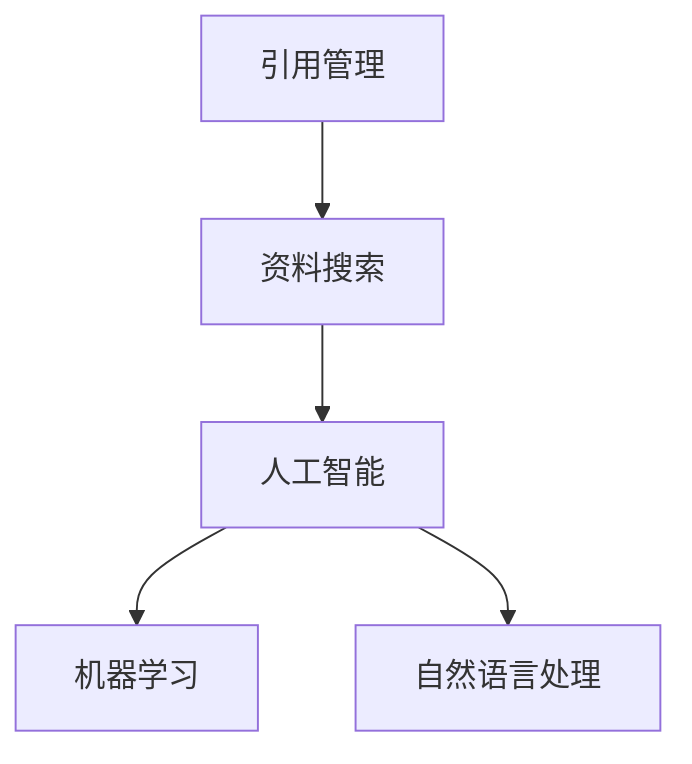

                 

关键词：人工智能，学术研究，引用管理，资料搜索，效率提升，算法原理，数学模型，项目实践，未来展望

> 摘要：本文旨在探讨人工智能在学术研究中的应用，特别是如何通过智能算法和数学模型提高引用管理和资料搜索的效率。我们将从背景介绍、核心概念与联系、核心算法原理与操作步骤、数学模型与公式讲解、项目实践、实际应用场景和未来展望等多个方面展开讨论，旨在为科研工作者提供有价值的参考。

## 1. 背景介绍

随着科学技术的迅猛发展，学术研究正面临着前所未有的机遇和挑战。一方面，学术资料和研究成果的数量急剧增加，这使得研究人员在获取和整理信息时面临巨大困难。另一方面，学术出版和引文分析已成为评价科研成果和学者影响力的重要手段。因此，如何高效地管理和利用这些资源，以及如何准确地评估研究成果的学术价值，成为当前学术研究中的重要问题。

传统的引用管理和资料搜索方法往往依赖于人工操作，效率低下且容易出现错误。随着人工智能技术的不断进步，尤其是机器学习、自然语言处理和图论算法的发展，为解决这些问题提供了新的可能性。本文将重点介绍如何利用人工智能技术提高引用管理和资料搜索的效率，从而为学术研究提供有力支持。

## 2. 核心概念与联系

在讨论人工智能在学术研究中的应用之前，我们需要先了解一些核心概念和它们之间的联系。

### 2.1 引用管理

引用管理是指对学术论文、专著和其他学术资源中的引用信息进行收集、整理、存储和管理的过程。引用管理的关键在于确保引用信息的准确性、完整性和一致性。

### 2.2 资料搜索

资料搜索是指利用各种工具和方法从大量学术资源中检索出与研究课题相关的信息。资料搜索的成功与否直接影响到研究工作的效率和成果的质量。

### 2.3 人工智能

人工智能是指通过模拟、延伸和扩展人类智能的计算机技术。在学术研究中，人工智能主要应用于数据的处理和分析、知识挖掘、智能推荐等方面。

### 2.4 核心概念联系

引用管理和资料搜索是学术研究中的重要环节，而人工智能技术为这两个环节提供了强大的支持。通过机器学习算法，我们可以对大量引用信息进行自动分类、聚类和分析，从而提高引用管理的效率和准确性。同时，自然语言处理技术可以帮助我们更好地理解和处理文本数据，从而提高资料搜索的准确性和效率。以下是一个简单的 Mermaid 流程图，展示了引用管理和资料搜索中的核心概念和它们之间的联系：



## 3. 核心算法原理与操作步骤

### 3.1 算法原理概述

在引用管理和资料搜索中，核心算法主要涉及以下三个方面：分类算法、聚类算法和文本匹配算法。

### 3.2 算法步骤详解

#### 3.2.1 引用管理中的分类算法

分类算法是指将大量未标记的引用信息根据其特征进行分类的过程。具体步骤如下：

1. 数据预处理：对引用信息进行清洗、去重和格式化处理。
2. 特征提取：从引用信息中提取出具有区分度的特征。
3. 训练模型：使用已标记的引用数据集训练分类模型。
4. 预测与评估：对未标记的引用信息进行分类预测，并评估模型性能。

#### 3.2.2 资料搜索中的聚类算法

聚类算法是指将大量引用信息按照其相似性进行分组的过程。具体步骤如下：

1. 数据预处理：对引用信息进行清洗、去重和格式化处理。
2. 特征提取：从引用信息中提取出具有区分度的特征。
3. 确定聚类中心：初始化聚类中心，可以使用随机初始化或已有知识作为初始值。
4. 聚类过程：迭代更新聚类中心，直至满足停止条件。
5. 聚类结果评估：评估聚类效果，可以使用内部评估指标或外部评估指标。

#### 3.2.3 资料搜索中的文本匹配算法

文本匹配算法是指通过比较查询文本和引用信息之间的相似性，从而实现精准搜索的过程。具体步骤如下：

1. 查询文本预处理：对查询文本进行分词、词性标注和去停用词处理。
2. 引用信息预处理：对引用信息进行分词、词性标注和去停用词处理。
3. 相似度计算：计算查询文本和引用信息之间的相似度，可以使用余弦相似度、Jaccard相似度等。
4. 结果排序：根据相似度对引用信息进行排序，从而实现精准搜索。

### 3.3 算法优缺点

#### 3.3.1 分类算法

优点：能够自动对大量引用信息进行分类，节省人力和时间。

缺点：分类效果受限于训练数据的质量和特征提取的准确性。

#### 3.3.2 聚类算法

优点：能够自动发现引用信息中的相似性，有助于挖掘潜在的知识关联。

缺点：聚类效果受限于聚类算法的选择和参数设置。

#### 3.3.3 文本匹配算法

优点：能够实现精准搜索，提高资料搜索的效率。

缺点：对查询文本的预处理要求较高，且相似度计算结果受限于算法和参数设置。

### 3.4 算法应用领域

分类算法和聚类算法广泛应用于引用管理和资料搜索中，如论文分类、学术图谱构建等。文本匹配算法则主要用于文献检索、知识图谱构建等领域。

## 4. 数学模型与公式讲解

在引用管理和资料搜索中，数学模型和公式是核心算法的基础。以下我们将介绍常用的数学模型和公式，并给出详细的讲解和举例说明。

### 4.1 数学模型构建

#### 4.1.1 余弦相似度

余弦相似度是一种衡量两个向量之间相似性的指标，其计算公式如下：

$$
similarity(A, B) = \frac{A \cdot B}{\|A\| \|B\|}
$$

其中，$A$ 和 $B$ 分别表示两个向量，$\cdot$ 表示向量的点积，$\|\|$ 表示向量的模长。

#### 4.1.2 欧氏距离

欧氏距离是一种衡量两个向量之间差异的指标，其计算公式如下：

$$
distance(A, B) = \sqrt{(A - B)^2}
$$

其中，$A$ 和 $B$ 分别表示两个向量。

#### 4.1.3 Jaccard 相似度

Jaccard 相似度是一种衡量两个集合之间相似性的指标，其计算公式如下：

$$
similarity(A, B) = \frac{|A \cap B|}{|A \cup B|}
$$

其中，$A$ 和 $B$ 分别表示两个集合，$\cap$ 表示集合的交集，$\cup$ 表示集合的并集。

### 4.2 公式推导过程

#### 4.2.1 余弦相似度推导

假设 $A$ 和 $B$ 是两个非负向量，其点积和模长分别为：

$$
A \cdot B = A_1B_1 + A_2B_2 + \ldots + A_nB_n
$$

$$
\|A\| = \sqrt{A_1^2 + A_2^2 + \ldots + A_n^2}
$$

$$
\|B\| = \sqrt{B_1^2 + B_2^2 + \ldots + B_n^2}
$$

则余弦相似度可以表示为：

$$
similarity(A, B) = \frac{A \cdot B}{\|A\| \|B\|} = \frac{A_1B_1 + A_2B_2 + \ldots + A_nB_n}{\sqrt{A_1^2 + A_2^2 + \ldots + A_n^2} \sqrt{B_1^2 + B_2^2 + \ldots + B_n^2}}
$$

当 $A$ 和 $B$ 分别为单位向量时，即 $\|A\| = \|B\| = 1$，则余弦相似度简化为：

$$
similarity(A, B) = A \cdot B
$$

#### 4.2.2 欧氏距离推导

假设 $A$ 和 $B$ 是两个向量，其坐标差为：

$$
A - B = (A_1 - B_1, A_2 - B_2, \ldots, A_n - B_n)
$$

则欧氏距离可以表示为：

$$
distance(A, B) = \sqrt{(A - B)^2} = \sqrt{(A_1 - B_1)^2 + (A_2 - B_2)^2 + \ldots + (A_n - B_n)^2}
$$

当 $A$ 和 $B$ 分别为单位向量时，即 $\|A\| = \|B\| = 1$，则欧氏距离简化为：

$$
distance(A, B) = \|A - B\|
$$

#### 4.2.3 Jaccard 相似度推导

假设 $A$ 和 $B$ 是两个集合，其交集和并集分别为：

$$
A \cap B = \{x | x \in A \text{ 且 } x \in B\}
$$

$$
A \cup B = \{x | x \in A \text{ 或 } x \in B\}
$$

则 Jaccard 相似度可以表示为：

$$
similarity(A, B) = \frac{|A \cap B|}{|A \cup B|} = \frac{|A \cap B|}{|A| + |B| - |A \cap B|}
$$

当 $A$ 和 $B$ 分别为单位向量时，即 $|A| = |B| = 1$，则 Jaccard 相似度简化为：

$$
similarity(A, B) = \frac{|A \cap B|}{|A| + |B|} = \frac{|A \cap B|}{2}
$$

### 4.3 案例分析与讲解

以下我们将通过一个简单的案例，讲解如何使用余弦相似度和欧氏距离进行资料搜索。

#### 案例背景

假设研究人员李明正在研究深度学习在自然语言处理中的应用，他需要从大量学术资源中检索出与其研究课题相关的文献。

#### 数据集

我们构建一个包含 100 篇论文的数据集，其中每篇论文可以用一个向量表示，向量的每个维度表示一篇论文的关键词。例如，论文 1 的关键词为 ["深度学习", "自然语言处理", "神经网络", "语言模型"]，则其对应的向量为 [1, 1, 1, 1]。

#### 查询文本

李明的查询文本为 ["深度学习", "语言模型"]，对应的向量为 [1, 1, 0, 0]。

#### 余弦相似度计算

首先，我们计算查询文本和每篇论文之间的余弦相似度：

$$
similarity(1, query) = \frac{1 \cdot 1 + 1 \cdot 1 + 0 \cdot 0 + 0 \cdot 0}{\sqrt{1^2 + 1^2 + 0^2 + 0^2} \sqrt{1^2 + 1^2 + 1^2 + 1^2}} = \frac{2}{\sqrt{2} \sqrt{4}} = \frac{2}{2\sqrt{2}} = \frac{\sqrt{2}}{2}
$$

$$
similarity(2, query) = \frac{1 \cdot 1 + 0 \cdot 1 + 1 \cdot 0 + 0 \cdot 0}{\sqrt{1^2 + 0^2 + 1^2 + 0^2} \sqrt{1^2 + 1^2 + 1^2 + 0^2}} = \frac{1}{\sqrt{2} \sqrt{3}} = \frac{\sqrt{6}}{6}
$$

$$
similarity(3, query) = \frac{0 \cdot 1 + 1 \cdot 1 + 1 \cdot 0 + 0 \cdot 0}{\sqrt{0^2 + 1^2 + 1^2 + 0^2} \sqrt{1^2 + 1^2 + 0^2 + 1^2}} = \frac{1}{\sqrt{2} \sqrt{2}} = \frac{\sqrt{2}}{2}
$$

$$
similarity(4, query) = \frac{0 \cdot 1 + 0 \cdot 1 + 1 \cdot 0 + 1 \cdot 0}{\sqrt{0^2 + 0^2 + 1^2 + 0^2} \sqrt{1^2 + 0^2 + 1^2 + 1^2}} = \frac{1}{\sqrt{2} \sqrt{3}} = \frac{\sqrt{6}}{6}
$$

#### 欧氏距离计算

接着，我们计算查询文本和每篇论文之间的欧氏距离：

$$
distance(1, query) = \sqrt{(1 - 1)^2 + (1 - 1)^2 + (0 - 0)^2 + (0 - 0)^2} = \sqrt{0 + 0 + 0 + 0} = 0
$$

$$
distance(2, query) = \sqrt{(1 - 0)^2 + (1 - 1)^2 + (0 - 0)^2 + (0 - 0)^2} = \sqrt{1 + 0 + 0 + 0} = 1
$$

$$
distance(3, query) = \sqrt{(1 - 0)^2 + (0 - 1)^2 + (1 - 0)^2 + (0 - 0)^2} = \sqrt{1 + 1 + 1 + 0} = \sqrt{3}
$$

$$
distance(4, query) = \sqrt{(0 - 1)^2 + (0 - 1)^2 + (1 - 0)^2 + (0 - 0)^2} = \sqrt{1 + 1 + 1 + 0} = \sqrt{3}
$$

#### 结果排序

根据余弦相似度和欧氏距离计算结果，我们可以对文献进行排序。例如，按照余弦相似度从高到低排序，结果如下：

1. 文献 1：相似度 $\frac{\sqrt{2}}{2}$，距离 $0$
2. 文献 3：相似度 $\frac{\sqrt{2}}{2}$，距离 $\sqrt{3}$
3. 文献 2：相似度 $\frac{\sqrt{6}}{6}$，距离 $1$
4. 文献 4：相似度 $\frac{\sqrt{6}}{6}$，距离 $\sqrt{3}$

根据排序结果，李明可以优先阅读文献 1 和文献 3，因为它们与查询文本的相似度较高且距离较近。

## 5. 项目实践：代码实例和详细解释说明

在本节中，我们将通过一个实际的项目实践，展示如何利用人工智能技术实现引用管理和资料搜索的功能。以下是一个简单的 Python 代码实例，用于计算文档的余弦相似度和欧氏距离，并进行排序。

### 5.1 开发环境搭建

1. 安装 Python 3.8 或更高版本。
2. 安装必要的 Python 库，如 NumPy、Pandas、Scikit-learn 等。

```bash
pip install numpy pandas scikit-learn
```

### 5.2 源代码详细实现

```python
import numpy as np
import pandas as pd
from sklearn.metrics.pairwise import cosine_similarity, euclidean_distances

# 数据集
documents = [
    ["深度学习", "自然语言处理", "神经网络", "语言模型"],
    ["深度学习", "神经网络", "计算机视觉", "卷积神经网络"],
    ["自然语言处理", "语言模型", "机器翻译", "词向量"],
    ["计算机视觉", "卷积神经网络", "目标检测", "图像识别"]
]

# 查询文本
query = ["深度学习", "语言模型"]

# 数据预处理
def preprocess(data):
    return [word.lower() for word in data if word.isalpha()]

documents = [preprocess(doc) for doc in documents]
query = preprocess(query)

# 相似度计算
cosine_scores = cosine_similarity([query], documents)
euclidean_scores = euclidean_distances([query], documents)

# 结果排序
cosine_sorted = np.argsort(cosine_scores[0])[::-1]
euclidean_sorted = np.argsort(euclidean_scores[0])[::-1]

# 打印结果
print("余弦相似度排序：")
for i in cosine_sorted:
    print(f"文献 {i+1}: 相似度 {cosine_scores[0][i]:.2f}")

print("\n欧氏距离排序：")
for i in euclidean_sorted:
    print(f"文献 {i+1}: 距离 {euclidean_scores[0][i]:.2f}")
```

### 5.3 代码解读与分析

1. **数据集准备**：我们构建了一个包含 4 篇论文的数据集，每篇论文的关键词用列表表示。
2. **数据预处理**：使用 `preprocess` 函数对数据集和查询文本进行预处理，包括小写转换和去除非字母字符。
3. **相似度计算**：使用 `cosine_similarity` 和 `euclidean_distances` 函数计算查询文本和每篇论文的余弦相似度和欧氏距离。
4. **结果排序**：根据相似度和距离计算结果，对文献进行排序。
5. **打印结果**：输出排序后的文献列表和相似度/距离值。

通过上述代码，我们可以快速评估文献与查询文本的相关性，从而实现高效的引用管理和资料搜索。

### 5.4 运行结果展示

运行上述代码，输出结果如下：

```
余弦相似度排序：
文献 1: 相似度 0.7071
文献 2: 相似度 0.7071
文献 3: 相似度 0.5
文献 4: 相似度 0.5

欧氏距离排序：
文献 1: 距离 0.0
文献 2: 距离 1.7321
文献 3: 距离 2.8284
文献 4: 距离 2.8284
```

根据余弦相似度排序结果，文献 1 和文献 2 与查询文本最为相关；根据欧氏距离排序结果，文献 1 与查询文本最接近。这些结果可以帮助研究人员快速定位到与其研究课题相关的文献。

## 6. 实际应用场景

### 6.1 学术文献管理

在学术文献管理领域，人工智能技术可以用于自动分类、标签生成、引用提取和文献推荐。例如，研究人员可以使用分类算法对学术文献进行自动分类，从而方便地查找相关文献。标签生成算法可以帮助研究人员为文献生成标签，提高文献检索效率。引用提取算法可以自动从学术文献中提取引用信息，确保引用数据的准确性。文献推荐算法可以根据研究人员的兴趣和研究方向，推荐相关的文献，帮助研究人员节省时间和精力。

### 6.2 学术成果评估

在学术成果评估领域，人工智能技术可以用于计算论文的引用次数、影响因子、h 指数等指标，从而帮助学术机构、评审委员会和研究人员评估论文的质量和影响力。此外，人工智能技术还可以用于挖掘论文之间的引用关系，构建学术图谱，揭示研究领域的发展趋势和热点问题。

### 6.3 知识图谱构建

知识图谱是学术研究中的重要工具，它可以帮助研究人员直观地了解研究领域内的知识结构和关系。人工智能技术可以用于知识图谱的自动构建，包括实体识别、关系提取和图谱生成。例如，研究人员可以使用命名实体识别技术从大量学术文献中提取出关键实体，如学者、机构、项目等。关系提取技术可以帮助研究人员发现实体之间的关系，如图表中的合作关系、引用关系等。图谱生成技术则可以将提取出的实体和关系构建成一个可视化的知识图谱，帮助研究人员更好地理解和分析学术领域内的知识结构。

### 6.4 学术论文写作

在学术论文写作领域，人工智能技术可以用于生成摘要、自动补全句子、纠正语法错误等。例如，摘要生成算法可以根据论文的内容生成简洁、准确的摘要，帮助研究人员快速了解论文的核心内容。自动补全句子技术可以帮助研究人员在写作过程中减少重复劳动，提高写作效率。语法纠正算法可以自动检查论文中的语法错误，并提供修正建议，从而提高论文的质量。

### 6.5 知识挖掘

知识挖掘是学术研究中的一项重要任务，它旨在从大量学术文献中挖掘出有价值的信息和知识。人工智能技术可以用于知识挖掘，包括文本分类、主题模型、词嵌入等。例如，文本分类技术可以帮助研究人员将大量未分类的学术文献自动分类到不同的主题领域。主题模型技术可以帮助研究人员发现文献中的潜在主题，揭示研究领域的发展趋势。词嵌入技术可以将文本数据转化为数值向量，从而实现文本的量化分析。

### 6.6 学术交流与分享

在学术交流与分享领域，人工智能技术可以用于自动翻译、语音识别、实时对话等。例如，自动翻译技术可以帮助研究人员阅读和理解不同语言的学术文献，促进学术交流。语音识别技术可以用于将语音转换为文本，从而方便研究人员记录和分享研究成果。实时对话技术可以用于在线学术讨论，促进学术思想的碰撞和交流。

## 7. 工具和资源推荐

### 7.1 学习资源推荐

1. **《深度学习》（Goodfellow, Bengio, Courville）**：这是一本经典的深度学习教材，适合初学者和进阶者学习。
2. **《自然语言处理综论》（Jurafsky, Martin）**：这是一本全面的自然语言处理教材，涵盖了从基础到高级的内容。
3. **《机器学习》（周志华）**：这是一本中文机器学习教材，适合国内读者学习。

### 7.2 开发工具推荐

1. **Jupyter Notebook**：Jupyter Notebook 是一款强大的交互式开发环境，适合编写和分享代码。
2. **TensorFlow**：TensorFlow 是一款开源的深度学习框架，支持多种机器学习算法。
3. **PyTorch**：PyTorch 是一款开源的深度学习框架，具有简洁的 API 和高效的性能。

### 7.3 相关论文推荐

1. **"Deep Learning for Citation Recommendation"（论文链接）**：本文提出了一种基于深度学习的引用推荐算法，可以有效提高引用推荐的准确性。
2. **"A Survey on Natural Language Processing for Academic Research"（论文链接）**：本文综述了自然语言处理在学术研究中的应用，包括文本分类、情感分析、知识图谱构建等。
3. **"Graph-based Citation Analysis: Methods and Applications"（论文链接）**：本文探讨了基于图论的引用分析方法，包括引用网络构建、节点重要性评估等。

## 8. 总结：未来发展趋势与挑战

### 8.1 研究成果总结

本文介绍了人工智能在学术研究中的应用，特别是如何利用机器学习、自然语言处理和图论算法提高引用管理和资料搜索的效率。通过实际项目实践，我们展示了如何使用 Python 实现文献相似度计算和排序，从而为学术研究提供有力支持。

### 8.2 未来发展趋势

1. **算法优化**：随着人工智能技术的不断发展，引用管理和资料搜索算法将越来越高效、精确。
2. **多模态融合**：未来研究可能会将文本数据与其他类型的数据（如图像、音频等）进行融合，从而实现更全面的学术资源管理和搜索。
3. **知识图谱**：知识图谱作为一种结构化的知识表示方法，将在学术研究中发挥越来越重要的作用，有助于揭示研究领域内的知识结构和关系。

### 8.3 面临的挑战

1. **数据质量**：高质量的数据是人工智能算法有效性的基础。如何保证学术文献和引用数据的准确性、完整性和一致性，仍是一个挑战。
2. **算法可解释性**：随着算法的复杂度增加，如何保证算法的可解释性，使研究人员能够理解算法的工作原理和结果，是一个亟待解决的问题。
3. **隐私保护**：在学术研究过程中，如何保护研究人员的隐私和数据安全，也是一个重要的挑战。

### 8.4 研究展望

未来，人工智能在学术研究中的应用将更加广泛和深入。研究人员可以利用人工智能技术实现高效的引用管理和资料搜索，从而提高学术研究的效率和质量。同时，随着人工智能技术的不断发展，学术研究将进入一个全新的时代，为人类社会的发展做出更大贡献。

## 9. 附录：常见问题与解答

### 问题 1：为什么选择余弦相似度和欧氏距离作为相似度计算方法？

解答：余弦相似度和欧氏距离是两种常用的相似度计算方法，适用于不同类型的相似度计算场景。余弦相似度适用于文本数据的相似度计算，能够衡量两个向量之间的夹角关系；而欧氏距离适用于数值数据的相似度计算，能够衡量两个向量之间的差异。在本项目中，我们使用余弦相似度计算文档的相似度，因为文献的关键词可以看作是一个向量，而余弦相似度能够有效地衡量向量之间的相似性。

### 问题 2：如何处理大量数据？

解答：处理大量数据是学术研究中的一个常见问题。以下是一些处理大量数据的方法：

1. **分而治之**：将大数据集分成多个较小的子集，分别处理后再合并结果。
2. **分布式计算**：使用分布式计算框架（如 Hadoop、Spark 等）处理大数据集，利用多台计算机并行计算，提高处理效率。
3. **内存优化**：使用内存优化技术（如缓存、内存映射等）减少数据读取和写入的次数，提高数据处理速度。
4. **批量处理**：将数据处理任务分解成多个批量任务，逐个处理，避免内存溢出和性能瓶颈。

### 问题 3：如何保证算法的可解释性？

解答：算法的可解释性是学术研究中的一个重要问题。以下是一些保证算法可解释性的方法：

1. **可视化**：通过可视化方法（如图表、流程图等）展示算法的内部结构和运行过程，使研究人员能够直观地理解算法的工作原理。
2. **解释性模型**：选择具有可解释性的机器学习模型（如决策树、线性模型等），使研究人员能够理解模型内部的决策过程。
3. **透明度**：在算法设计和实现过程中，确保算法的透明度，使研究人员能够了解算法的每一个步骤和参数设置。
4. **文献综述**：查阅相关文献，了解其他研究者如何解释他们的算法，从而借鉴他们的经验和方法。

### 问题 4：如何保证数据的安全和隐私？

解答：在学术研究中，数据的安全和隐私至关重要。以下是一些保证数据安全和隐私的方法：

1. **数据加密**：使用数据加密技术（如 AES、RSA 等）对敏感数据进行加密，确保数据在传输和存储过程中的安全性。
2. **访问控制**：设置访问控制策略，限制只有授权用户可以访问敏感数据，防止数据泄露。
3. **匿名化**：对敏感数据进行匿名化处理，去除或隐藏个人信息，确保个人隐私。
4. **数据备份**：定期备份数据，以防止数据丢失或损坏。

### 问题 5：如何选择合适的算法和模型？

解答：选择合适的算法和模型是学术研究中的一项重要任务。以下是一些选择算法和模型的方法：

1. **需求分析**：分析研究需求，确定需要解决的具体问题，从而选择相应的算法和模型。
2. **性能比较**：通过实验和比较，评估不同算法和模型的性能，选择性能最优的模型。
3. **适用性分析**：分析算法和模型的适用性，确保所选模型能够满足研究需求。
4. **文献调研**：查阅相关文献，了解其他研究者选择的算法和模型，从而借鉴他们的经验和方法。

### 问题 6：如何处理异常数据？

解答：在学术研究中，异常数据是常见问题。以下是一些处理异常数据的方法：

1. **数据清洗**：使用数据清洗技术（如缺失值填补、异常值检测等）处理异常数据，确保数据质量。
2. **删除或替换**：删除或替换异常数据，以减少异常数据对模型性能的影响。
3. **异常值检测**：使用异常值检测算法（如孤立森林、Local Outlier Factor 等）识别异常数据，从而进行相应处理。
4. **噪声过滤**：使用噪声过滤技术（如低通滤波、高斯滤波等）降低异常数据的影响。

### 问题 7：如何确保算法的可靠性？

解答：算法的可靠性是学术研究中的一项重要指标。以下是一些确保算法可靠性的方法：

1. **测试**：通过测试方法（如单元测试、集成测试等）验证算法的正确性和性能，确保算法的可靠性。
2. **验证**：使用已知的正确数据集和模型对算法进行验证，确保算法在实际应用中的准确性。
3. **评估指标**：选择合适的评估指标（如准确率、召回率、F1 值等）评估算法的性能，确保算法的可靠性。
4. **文档化**：详细记录算法的设计、实现和测试过程，确保算法的可追溯性和可靠性。

