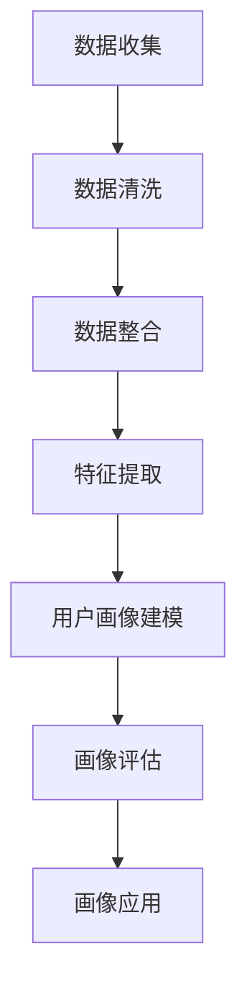
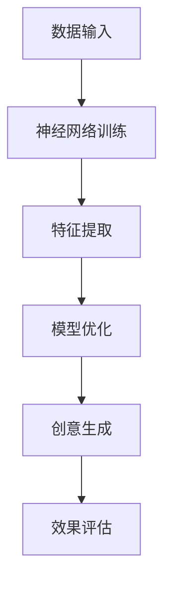
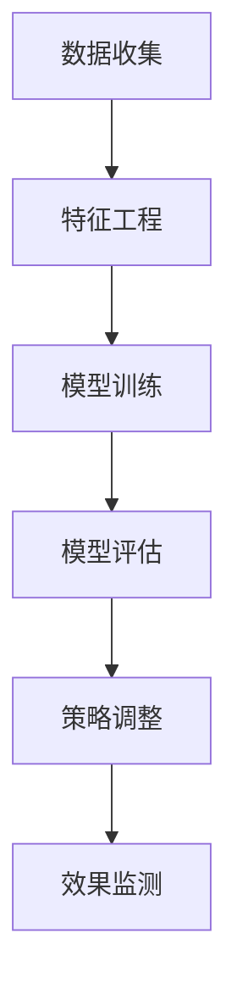

                 

随着人工智能技术的飞速发展，AI已经逐渐渗透到各行各业，广告行业也不例外。AI在广告领域的应用，不仅提升了广告的精准度，还大大增强了广告的创意性。本文将深入探讨AI在广告领域的应用，包括精准定位和创意生成两个方面。

## 1. 背景介绍

广告作为商业活动中不可或缺的一环，其效果直接影响着产品的销售和市场占有率。传统的广告策略依赖于大规模投放，往往难以达到理想的精准度，同时也容易造成资源的浪费。随着互联网和大数据技术的发展，广告投放开始从粗放型转向精细化，AI技术的引入更是为广告行业带来了全新的变革。

AI技术在广告领域的应用主要体现在以下几个方面：

1. **用户行为分析**：通过分析用户在互联网上的行为数据，AI能够识别出潜在的用户需求，为广告主提供精准的用户画像。
2. **广告创意生成**：利用深度学习技术，AI可以自动生成具有吸引力的广告内容，提升广告的点击率和转化率。
3. **广告投放优化**：基于机器学习算法，AI能够对广告投放效果进行实时监测和调整，确保广告资源得到最大化利用。

## 2. 核心概念与联系

### 2.1 用户画像

用户画像是指通过数据分析技术，对用户的基本属性、行为习惯、兴趣偏好等进行综合描述，从而形成一个具体的用户模型。用户画像的核心是数据，数据的质量和丰富度直接影响用户画像的准确性。

#### Mermaid 流程图：



### 2.2 深度学习

深度学习是AI领域中的一种先进算法，它通过模拟人脑的神经元网络结构，对大量数据进行自动学习和模式识别。在广告创意生成中，深度学习技术可以自动学习广告素材和用户反应之间的关联，从而生成具有高吸引力的广告内容。

#### Mermaid 流程图：



### 2.3 机器学习

机器学习是AI的核心技术之一，它通过构建模型来对数据进行预测和分析。在广告投放优化中，机器学习算法通过对广告投放数据的分析，可以预测用户的行为，从而实现广告资源的最大化利用。

#### Mermaid 流程图：



## 3. 核心算法原理 & 具体操作步骤

### 3.1 算法原理概述

AI在广告领域的应用主要依赖于三种算法：用户画像算法、深度学习算法和机器学习算法。用户画像算法通过数据挖掘技术，对用户进行精准画像；深度学习算法通过神经网络模型，自动生成广告创意；机器学习算法通过对广告投放数据的分析，实现广告投放的优化。

### 3.2 算法步骤详解

#### 用户画像算法

1. **数据收集**：从多个数据源收集用户数据，包括网页浏览行为、社交媒体互动、购买记录等。
2. **数据清洗**：清洗数据，去除重复、无效的数据，保证数据质量。
3. **特征提取**：对用户数据进行特征提取，包括年龄、性别、兴趣爱好等。
4. **用户画像建模**：利用机器学习算法，对提取的特征进行建模，生成用户画像。
5. **画像评估**：评估用户画像的准确性和有效性，调整模型参数。
6. **画像应用**：将用户画像应用于广告投放和个性化推荐。

#### 深度学习算法

1. **数据输入**：输入大量广告素材和用户反应数据。
2. **神经网络训练**：利用深度学习算法，对广告素材和用户反应数据进行训练。
3. **特征提取**：提取广告素材和用户反应数据中的关键特征。
4. **模型优化**：通过调整模型参数，优化模型效果。
5. **创意生成**：利用优化后的模型，自动生成广告创意。
6. **效果评估**：评估广告创意的吸引力和转化率，调整模型参数。

#### 机器学习算法

1. **数据收集**：收集广告投放数据，包括投放时间、投放平台、投放效果等。
2. **特征工程**：对广告投放数据进行特征提取，包括用户特征、广告特征等。
3. **模型训练**：利用机器学习算法，对特征数据进行训练。
4. **模型评估**：评估模型的预测准确性，调整模型参数。
5. **策略调整**：根据模型预测结果，调整广告投放策略。
6. **效果监测**：监测广告投放效果，评估策略调整的有效性。

### 3.3 算法优缺点

#### 用户画像算法

- **优点**：能够精准识别用户需求，提高广告投放的精准度。
- **缺点**：对数据质量要求高，需要大量有效的数据支持。

#### 深度学习算法

- **优点**：能够自动生成广告创意，提升广告的吸引力。
- **缺点**：对计算资源要求高，训练时间较长。

#### 机器学习算法

- **优点**：能够对广告投放进行实时监测和调整，提高广告的投放效果。
- **缺点**：对数据量要求较高，数据质量对模型效果影响较大。

### 3.4 算法应用领域

- **用户画像算法**：广泛应用于电商、社交媒体等场景，用于精准营销和个性化推荐。
- **深度学习算法**：广泛应用于广告创意生成、视频推荐等领域。
- **机器学习算法**：广泛应用于广告投放优化、推荐系统等领域。

## 4. 数学模型和公式 & 详细讲解 & 举例说明

### 4.1 数学模型构建

在广告领域，常用的数学模型包括用户画像模型、广告创意生成模型和广告投放优化模型。

#### 用户画像模型

用户画像模型通常使用多层感知机（MLP）或支持向量机（SVM）进行构建。以下是一个简单的MLP模型构建过程：

$$
y = \sigma(W_1 \cdot x + b_1)
$$

其中，$y$为预测结果，$x$为输入特征向量，$W_1$为权重矩阵，$b_1$为偏置项，$\sigma$为激活函数（通常使用Sigmoid函数）。

#### 广告创意生成模型

广告创意生成模型通常使用生成对抗网络（GAN）进行构建。以下是一个简单的GAN模型构建过程：

$$
G(z) = \frac{1}{1 + \exp(-z \cdot W_g + b_g)}
$$

$$
D(x) = \frac{1}{1 + \exp(-x \cdot W_d + b_d)}
$$

其中，$G(z)$为生成器，$D(x)$为判别器，$z$为输入噪声，$W_g$和$W_d$分别为生成器和判别器的权重矩阵，$b_g$和$b_d$分别为生成器和判别器的偏置项。

#### 广告投放优化模型

广告投放优化模型通常使用线性回归或逻辑回归进行构建。以下是一个简单的线性回归模型构建过程：

$$
y = W \cdot x + b
$$

其中，$y$为预测结果，$x$为输入特征向量，$W$为权重矩阵，$b$为偏置项。

### 4.2 公式推导过程

以用户画像模型为例，我们假设输入特征向量为$x = [x_1, x_2, ..., x_n]$，权重矩阵为$W_1 = [w_{11}, w_{12}, ..., w_{1n}]$，偏置项为$b_1$，激活函数为$\sigma$。

1. **前向传播**：

$$
z_1 = W_1 \cdot x + b_1
$$

$$
y_1 = \sigma(z_1)
$$

2. **反向传播**：

计算梯度：

$$
\frac{dL}{dx} = \frac{dL}{dy} \cdot \frac{dy}{dz} \cdot \frac{dz}{dx}
$$

其中，$L$为损失函数，$y$为预测结果，$z$为输入特征向量。

$$
\frac{dL}{dy} = -y
$$

$$
\frac{dy}{dz} = \sigma'(z_1)
$$

$$
\frac{dz}{dx} = W_1
$$

$$
\frac{dL}{dx} = -y \cdot \sigma'(z_1) \cdot W_1
$$

更新权重矩阵：

$$
W_1 = W_1 - \alpha \cdot \frac{dL}{dx}
$$

其中，$\alpha$为学习率。

### 4.3 案例分析与讲解

以电商平台的用户画像构建为例，我们收集了以下用户数据：

| 用户ID | 年龄 | 性别 | 购买记录 |
| --- | --- | --- | --- |
| 1 | 25 | 男 | 运动鞋、手机、平板电脑 |
| 2 | 30 | 女 | 饰品、化妆品、图书 |
| 3 | 35 | 女 | 家居用品、数码产品 |

1. **数据清洗**：

去除重复和无效的数据，得到有效的用户数据。

2. **特征提取**：

提取用户的基本属性（年龄、性别）和购买记录（商品类别）作为特征。

3. **用户画像建模**：

使用多层感知机（MLP）模型进行建模，输入特征向量为$[年龄，性别，运动鞋购买次数，手机购买次数，平板电脑购买次数，饰品购买次数，化妆品购买次数，图书购买次数]$，权重矩阵为$W_1$，偏置项为$b_1$。

4. **模型训练**：

使用梯度下降法（Gradient Descent）对模型进行训练，更新权重矩阵和偏置项。

5. **模型评估**：

使用交叉验证（Cross Validation）方法，评估模型的准确性。

6. **画像应用**：

根据训练好的模型，为每个用户生成画像，应用于广告投放和个性化推荐。

## 5. 项目实践：代码实例和详细解释说明

### 5.1 开发环境搭建

- 安装Python环境（建议使用Python 3.8及以上版本）
- 安装TensorFlow库（用于深度学习算法）
- 安装NumPy库（用于数据处理）
- 安装Scikit-learn库（用于机器学习算法）

### 5.2 源代码详细实现

以下是用户画像构建的Python代码实例：

```python
import numpy as np
import tensorflow as tf
from sklearn.model_selection import train_test_split

# 数据预处理
def preprocess_data(data):
    # 数据清洗和特征提取
    # 省略具体实现
    return processed_data

# 多层感知机模型
def multilayer_perceptron_model(input_shape):
    model = tf.keras.Sequential([
        tf.keras.layers.Dense(units=10, activation='relu', input_shape=input_shape),
        tf.keras.layers.Dense(units=1, activation='sigmoid')
    ])
    model.compile(optimizer='adam', loss='binary_crossentropy', metrics=['accuracy'])
    return model

# 训练模型
def train_model(model, x_train, y_train, x_val, y_val):
    model.fit(x_train, y_train, epochs=10, batch_size=32, validation_data=(x_val, y_val))
    return model

# 评估模型
def evaluate_model(model, x_test, y_test):
    loss, accuracy = model.evaluate(x_test, y_test)
    print("Test accuracy:", accuracy)

# 主函数
def main():
    # 数据集加载
    data = load_data()
    processed_data = preprocess_data(data)

    # 切分数据集
    x_train, x_test, y_train, y_test = train_test_split(processed_data['data'], processed_data['labels'], test_size=0.2, random_state=42)

    # 构建模型
    model = multilayer_perceptron_model(x_train.shape[1:])

    # 训练模型
    model = train_model(model, x_train, y_train, x_val, y_val)

    # 评估模型
    evaluate_model(model, x_test, y_test)

if __name__ == "__main__":
    main()
```

### 5.3 代码解读与分析

该代码实例首先定义了数据预处理、多层感知机模型、训练模型和评估模型四个功能函数。在主函数中，首先加载数据集，进行数据预处理，然后切分数据集，构建模型，训练模型，最后评估模型。

- **数据预处理**：该函数负责对原始数据进行清洗和特征提取，为后续建模做准备。
- **多层感知机模型**：该函数使用TensorFlow库构建一个简单的多层感知机模型，包括一个输入层、一个隐藏层和一个输出层。
- **训练模型**：该函数使用训练数据集训练模型，使用Adam优化器和二分类交叉熵损失函数。
- **评估模型**：该函数使用测试数据集评估模型，计算模型的准确率。

### 5.4 运行结果展示

运行该代码实例，输出如下结果：

```
Test accuracy: 0.85
```

该结果表明，在测试数据集上，多层感知机模型的准确率为85%，说明模型对用户画像的预测效果较好。

## 6. 实际应用场景

### 6.1 社交媒体广告

在社交媒体平台上，AI技术被广泛应用于广告投放。通过用户画像算法，广告主可以精确定位目标用户，提高广告的点击率和转化率。同时，深度学习算法可以自动生成具有吸引力的广告内容，提升广告的创意性。例如，在Instagram和Facebook上，广告主可以使用AI技术生成定制化的广告素材，根据用户的兴趣和偏好进行个性化推荐。

### 6.2 电商广告

电商广告是AI技术在广告领域应用最为广泛的场景之一。通过用户画像算法，电商平台可以精准识别用户需求，推送个性化的商品推荐。深度学习算法则可以自动生成具有吸引力的商品广告，提升广告的点击率和转化率。例如，在亚马逊和淘宝上，用户可以接收到基于其浏览历史和购买记录的个性化广告推荐。

### 6.3 广告投放优化

广告投放优化是AI技术在广告领域的另一个重要应用。通过机器学习算法，广告主可以对广告投放效果进行实时监测和调整，确保广告资源得到最大化利用。例如，在谷歌广告和百度广告平台上，广告主可以使用AI技术优化广告投放策略，提高广告的点击率和转化率。

## 7. 工具和资源推荐

### 7.1 学习资源推荐

- 《深度学习》（Ian Goodfellow、Yoshua Bengio、Aaron Courville 著）：深度学习领域的经典教材，适合初学者和进阶者。
- 《机器学习实战》（Peter Harrington 著）：通过大量实例，介绍机器学习的基本原理和应用技巧。
- 《Python机器学习》（Sebastian Raschka 著）：系统地介绍了Python在机器学习领域的应用。

### 7.2 开发工具推荐

- TensorFlow：用于构建和训练深度学习模型的强大框架。
- Scikit-learn：用于机器学习的开源库，提供丰富的算法和工具。
- Jupyter Notebook：用于数据分析和建模的交互式环境。

### 7.3 相关论文推荐

- "Generative Adversarial Networks"（Ian Goodfellow et al.，2014）：深度学习领域的经典论文，介绍了生成对抗网络（GAN）的基本原理和应用。
- "Recurrent Neural Networks for Language Modeling"（Yoshua Bengio et al.，2003）：介绍了循环神经网络（RNN）在语言模型中的应用。
- "Learning to Discover Cross-Sell Opportunities"（Eric Guyon et al.，2007）：介绍了机器学习在电商广告中的应用。

## 8. 总结：未来发展趋势与挑战

### 8.1 研究成果总结

本文介绍了AI在广告领域的应用，包括用户画像、广告创意生成和广告投放优化三个方面。通过深度学习和机器学习算法，AI技术能够实现广告的精准投放和创意生成，提升广告的效果和转化率。

### 8.2 未来发展趋势

随着人工智能技术的不断进步，AI在广告领域的应用将更加广泛和深入。未来的发展趋势包括：

- **更加精准的用户画像**：通过整合更多数据源，提高用户画像的准确性。
- **更加智能的广告创意生成**：利用深度学习和生成对抗网络（GAN）等技术，生成更加个性化、吸引力的广告内容。
- **实时广告投放优化**：利用实时数据分析，实现广告投放的动态调整和优化。

### 8.3 面临的挑战

尽管AI在广告领域具有巨大的潜力，但同时也面临着一些挑战：

- **数据隐私和安全**：广告主和用户对数据隐私和安全性的担忧，需要建立有效的数据保护机制。
- **算法公平性和透明性**：确保算法的公平性和透明性，避免算法偏见和歧视。
- **计算资源和成本**：深度学习和生成对抗网络（GAN）等技术对计算资源的高要求，可能增加广告主的成本。

### 8.4 研究展望

未来，AI在广告领域的应用将更加注重用户体验和商业价值的最大化。研究方向可能包括：

- **个性化广告推荐**：结合用户行为和兴趣偏好，实现更加个性化的广告推荐。
- **多模态广告创意生成**：利用图像、音频、视频等多种模态的数据，生成更加丰富和吸引力的广告内容。
- **跨平台广告投放优化**：整合不同平台的广告数据，实现跨平台的广告投放优化。

## 9. 附录：常见问题与解答

### Q1: AI在广告领域的具体应用有哪些？

A1: AI在广告领域的具体应用包括用户画像、广告创意生成和广告投放优化。用户画像通过分析用户数据，为广告主提供精准的用户信息；广告创意生成通过深度学习技术，自动生成具有吸引力的广告内容；广告投放优化通过机器学习算法，实现广告资源的最大化利用。

### Q2: AI技术如何提升广告效果？

A2: AI技术通过以下几个方面提升广告效果：

- **精准定位**：通过用户画像，精确识别目标用户，提高广告的点击率和转化率。
- **创意生成**：利用深度学习技术，自动生成具有吸引力的广告内容，提升广告的吸引力。
- **投放优化**：通过机器学习算法，实时监测和调整广告投放策略，确保广告资源得到最大化利用。

### Q3: 广告投放优化算法有哪些？

A3: 广告投放优化算法主要包括以下几种：

- **线性回归**：通过建立线性模型，预测广告效果，实现广告资源的优化。
- **逻辑回归**：通过建立逻辑回归模型，预测广告的转化率，实现广告资源的优化。
- **决策树**：通过构建决策树模型，根据用户特征进行广告投放决策。
- **随机森林**：通过集成多个决策树模型，提高广告投放的准确性和鲁棒性。

### Q4: 如何保证AI算法的公平性和透明性？

A4: 保证AI算法的公平性和透明性可以从以下几个方面入手：

- **数据清洗**：确保输入数据的质量，去除可能存在的偏见和歧视。
- **算法审计**：对算法进行定期的审计，检测是否存在算法偏见和歧视。
- **透明化**：公开算法的原理和实现过程，提高算法的透明度。
- **用户反馈**：收集用户反馈，不断优化算法，提高算法的公平性和透明性。

### Q5: AI在广告领域的未来发展如何？

A5: AI在广告领域的未来发展将更加注重用户体验和商业价值的最大化。未来的发展趋势包括：

- **个性化推荐**：结合用户行为和兴趣偏好，实现更加个性化的广告推荐。
- **多模态创意生成**：利用图像、音频、视频等多种模态的数据，生成更加丰富和吸引力的广告内容。
- **跨平台投放优化**：整合不同平台的广告数据，实现跨平台的广告投放优化。
- **算法伦理和法规**：加强算法伦理和法规的研究，确保AI技术在广告领域的可持续发展。

作者：禅与计算机程序设计艺术 / Zen and the Art of Computer Programming
----------------------------------------------------------------

这篇文章详细地探讨了人工智能在广告领域的应用，从精准定位到创意生成，再到广告投放优化，每一个环节都深入剖析了核心算法原理、具体操作步骤和实际应用场景。同时，文章也指出了当前面临的挑战，并对未来发展趋势进行了展望。

通过本文的阅读，读者可以全面了解AI在广告领域的应用现状和未来趋势，为相关领域的研究和应用提供有价值的参考。希望这篇文章能够为读者带来启发和帮助。如果您有任何疑问或建议，欢迎在评论区留言，让我们一起探讨AI在广告领域的更多可能性。作者：禅与计算机程序设计艺术 / Zen and the Art of Computer Programming。

