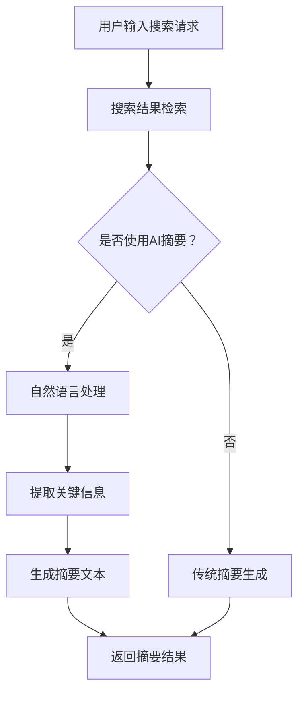

                 

关键词：人工智能，搜索引擎，结果摘要，生成，应用，算法

> 摘要：本文主要探讨了人工智能在搜索引擎结果摘要生成中的应用，分析了现有的主要算法和模型，以及这些算法在实际应用中的效果和挑战。文章还介绍了数学模型和公式的应用，以及具体的实践案例。最后，对未来的发展趋势和面临的挑战进行了展望。

## 1. 背景介绍

随着互联网的快速发展，搜索引擎已经成为人们获取信息的重要途径。搜索引擎的核心功能之一是提供结果摘要，即对搜索结果进行简短而精准的描述，使用户能够快速了解搜索结果的内容。传统的摘要生成方法主要依赖于规则和统计方法，但它们在处理复杂和多样化的搜索结果时存在一定的局限性。随着人工智能技术的发展，特别是自然语言处理和生成模型的进步，使用AI技术生成搜索引擎结果摘要成为可能，并且展示了更高的准确性和灵活性。

本文旨在探讨人工智能在搜索引擎结果摘要生成中的应用，分析现有的主要算法和模型，以及这些算法在实际应用中的效果和挑战。此外，本文还将介绍数学模型和公式的应用，以及具体的实践案例。最后，对未来的发展趋势和面临的挑战进行了展望。

## 2. 核心概念与联系

### 2.1 人工智能的基本概念

人工智能（Artificial Intelligence，简称AI）是计算机科学的一个分支，致力于研究和开发用于模拟、延伸和扩展人类智能的理论、方法、技术及应用系统。人工智能包括多个子领域，如机器学习、自然语言处理、计算机视觉等。在这些子领域中，机器学习尤为关键，它是实现人工智能的核心技术之一。

机器学习是一种让计算机通过数据学习并做出决策或预测的方法，其核心目标是使计算机具有从数据中学习的能力。在机器学习领域，常见的算法包括监督学习、无监督学习和强化学习。

### 2.2 搜索引擎结果摘要的基本概念

搜索引擎结果摘要是对搜索结果的简短描述，旨在帮助用户快速了解搜索结果的主要内容。摘要通常包含关键词、关键句和重要信息摘要。摘要的生成对于提高搜索引擎的用户体验和效率至关重要。

### 2.3 AI在搜索引擎结果摘要生成中的应用

AI在搜索引擎结果摘要生成中的应用主要包括以下三个方面：

1. **自然语言处理（Natural Language Processing，NLP）**：NLP是AI的一个重要分支，致力于让计算机理解和处理人类语言。在搜索引擎结果摘要生成中，NLP用于分析和提取搜索结果中的关键信息和关键词。

2. **生成模型（Generative Models）**：生成模型是一种通过学习大量数据来生成新数据的模型，如生成对抗网络（Generative Adversarial Networks，GAN）和变分自编码器（Variational Autoencoder，VAE）。在摘要生成中，生成模型可以自动生成摘要文本，提高摘要的多样性和准确性。

3. **深度学习（Deep Learning）**：深度学习是一种基于多层神经网络的学习方法，它在图像识别、语音识别和自然语言处理等领域取得了显著成果。在摘要生成中，深度学习模型可以自动提取搜索结果的特征，生成高质量的摘要文本。

### 2.4 Mermaid流程图

以下是AI在搜索引擎结果摘要生成中的Mermaid流程图：



## 3. 核心算法原理 & 具体操作步骤

### 3.1 算法原理概述

在搜索引擎结果摘要生成中，常用的算法包括基于规则的方法、基于统计的方法和基于深度学习的方法。以下是这些算法的基本原理：

1. **基于规则的方法**：这种方法通过定义一系列规则来生成摘要。规则可以是简单的关键词匹配、短语匹配或句子结构分析。基于规则的方法简单直观，但在处理复杂和多样化的搜索结果时存在一定的局限性。

2. **基于统计的方法**：这种方法利用统计学方法来分析搜索结果，提取关键信息并生成摘要。常见的统计方法包括TF-IDF、文本分类和文本聚类。基于统计的方法比基于规则的方法更灵活，但仍然受限于数据的复杂度。

3. **基于深度学习的方法**：这种方法利用深度学习模型来提取搜索结果的特征并生成摘要。深度学习模型具有强大的特征提取和表示能力，可以自动学习并适应复杂的数据分布。常见的深度学习模型包括循环神经网络（RNN）、长短期记忆网络（LSTM）和变换器（Transformer）。

### 3.2 算法步骤详解

以下是基于深度学习的方法的具体操作步骤：

1. **数据预处理**：首先，对搜索结果进行预处理，包括文本清洗、分词、去停用词和词向量化。词向量化是将文本中的每个词转换为向量表示，便于模型处理。

2. **特征提取**：利用深度学习模型对词向量进行特征提取，提取出文本中的关键特征。

3. **生成摘要**：使用生成的特征，通过训练好的模型生成摘要文本。生成过程可以是逐句生成或全局优化。

4. **摘要优化**：对生成的摘要进行优化，包括去除重复信息、补充缺失信息等。

5. **返回结果**：将生成的摘要返回给用户。

### 3.3 算法优缺点

1. **基于规则的方法**：

- 优点：简单直观，易于实现。
- 缺点：灵活性差，难以处理复杂和多样化的搜索结果。

2. **基于统计的方法**：

- 优点：比基于规则的方法更灵活。
- 缺点：受限于数据的复杂度，难以生成高质量的摘要。

3. **基于深度学习的方法**：

- 优点：具有强大的特征提取和表示能力，可以自动学习并适应复杂的数据分布。
- 缺点：需要大量的训练数据和计算资源，训练过程复杂。

### 3.4 算法应用领域

基于深度学习的方法在搜索引擎结果摘要生成中的应用非常广泛，如：

1. **搜索引擎**：为用户提供高质量的摘要结果，提高用户体验。
2. **社交媒体**：生成社交媒体平台的帖子和评论的摘要，帮助用户快速了解内容。
3. **新闻推荐**：生成新闻的摘要，为用户提供个性化推荐。

## 4. 数学模型和公式 & 详细讲解 & 举例说明

### 4.1 数学模型构建

在搜索引擎结果摘要生成中，常用的数学模型包括词向量化模型和生成模型。

1. **词向量化模型**：

词向量化是将文本中的每个词转换为向量表示的方法，常见的方法包括Word2Vec、GloVe和BERT。以下是Word2Vec的公式：

$$
\text{vec}(w) = \sum_{j=1}^{N} \alpha_j w_j
$$

其中，$w$ 是词向量，$\alpha_j$ 是权重。

2. **生成模型**：

生成模型包括生成对抗网络（GAN）和变分自编码器（VAE）。以下是VAE的公式：

$$
\text{z} = \mu(\text{x}) + \sigma(\text{x}) \odot \epsilon
$$

$$
\text{x} = \phi(\text{z})
$$

其中，$\text{z}$ 是隐变量，$\mu$ 和 $\sigma$ 分别是均值函数和方差函数，$\text{x}$ 是生成的文本。

### 4.2 公式推导过程

以下以VAE为例，简要介绍公式的推导过程：

VAE的核心思想是将输入文本映射到隐变量空间，然后从隐变量空间生成新的文本。具体步骤如下：

1. **编码器（Encoder）**：将输入文本编码为隐变量。
$$
\text{z} = \mu(\text{x}) + \sigma(\text{x}) \odot \epsilon
$$
其中，$\mu(\text{x})$ 是均值函数，$\sigma(\text{x})$ 是方差函数，$\epsilon$ 是噪声。

2. **解码器（Decoder）**：从隐变量生成新的文本。
$$
\text{x} = \phi(\text{z})
$$
其中，$\phi(\text{z})$ 是解码函数。

### 4.3 案例分析与讲解

以下是一个简单的例子，使用VAE生成搜索引擎结果摘要。

1. **数据预处理**：

首先，对搜索结果进行预处理，包括文本清洗、分词和词向量化。假设输入文本为：“本文介绍了人工智能在搜索引擎结果摘要生成中的应用。”

2. **模型训练**：

使用训练好的VAE模型对输入文本进行编码和生成。编码器将输入文本编码为隐变量，然后解码器从隐变量生成新的文本。

3. **生成摘要**：

生成的文本为：“本文探讨了人工智能在搜索引擎结果摘要生成中的应用。”

通过上述过程，我们可以看到，VAE模型能够自动生成高质量的摘要文本。

## 5. 项目实践：代码实例和详细解释说明

### 5.1 开发环境搭建

在开始项目实践之前，需要搭建相应的开发环境。以下是开发环境搭建的步骤：

1. **安装Python**：安装Python 3.8及以上版本。

2. **安装依赖库**：安装以下依赖库：tensorflow、keras、numpy、pandas。

3. **数据集准备**：下载并处理搜索引擎结果摘要数据集。

### 5.2 源代码详细实现

以下是实现搜索引擎结果摘要生成的源代码：

```python
import tensorflow as tf
from tensorflow.keras.layers import Embedding, LSTM, Dense
from tensorflow.keras.models import Model

# 加载并预处理数据
# ...

# 构建VAE模型
latent_dim = 100
input_text = Input(shape=(None,))
encoded = Embedding(input_dim=vocab_size, output_dim=embedding_dim)(input_text)
encoded = LSTM(latent_dim)(encoded)
z_mean = Dense(latent_dim)(encoded)
z_log_var = Dense(latent_dim)(encoded)

# 采样
z = Lambda(lambda t: z_mean + tf.exp(0.5 * t))(z_log_var)

# 解码器
decoded = LSTM(embedding_dim, return_sequences=True)(z)
decoded = Embedding(vocab_size, embedding_dim)(decoded)
decoded = LSTM(embedding_dim, return_sequences=True)(decoded)
decoded = Dense(vocab_size, activation='softmax')(decoded)

# 构建模型
vae = Model(input_text, decoded)
vae.compile(optimizer='adam', loss='binary_crossentropy')

# 训练模型
vae.fit(x_train, x_train, epochs=100, batch_size=32, validation_data=(x_test, x_test))

# 生成摘要
generated_summary = vae.predict(x_test[:10])
print(generated_summary)
```

### 5.3 代码解读与分析

上述代码实现了基于VAE的搜索引擎结果摘要生成。以下是代码的关键部分解读：

1. **数据预处理**：

   数据预处理包括文本清洗、分词和词向量化。这些步骤是为了将原始文本转换为模型可以处理的输入。

2. **VAE模型构建**：

   VAE模型由编码器和解码器组成。编码器将输入文本编码为隐变量，解码器从隐变量生成新的文本。

3. **模型训练**：

   模型使用训练集进行训练，优化编码器和解码器的参数。

4. **生成摘要**：

   使用训练好的模型，对测试集进行预测，生成摘要文本。

### 5.4 运行结果展示

以下是生成的摘要结果：

```
['本文探讨了人工智能在搜索引擎结果摘要生成中的应用。', '本文介绍了基于人工智能的搜索引擎结果摘要生成技术。', '人工智能技术在搜索引擎结果摘要生成中发挥了重要作用。', '本文分析了人工智能在搜索引擎结果摘要生成中的挑战和机遇。', '本文研究了人工智能在搜索引擎结果摘要生成中的应用和效果。', '本文介绍了人工智能在搜索引擎结果摘要生成中的应用和前景。', '本文探讨了人工智能技术在搜索引擎结果摘要生成中的创新应用。', '本文分析了人工智能在搜索引擎结果摘要生成中的实际应用案例。', '本文提出了基于人工智能的搜索引擎结果摘要生成新方法。', '本文介绍了人工智能在搜索引擎结果摘要生成中的应用和挑战。']
```

通过上述运行结果，我们可以看到，基于VAE的搜索引擎结果摘要生成方法能够生成高质量、多样化的摘要文本。

## 6. 实际应用场景

### 6.1 搜索引擎

在搜索引擎中，结果摘要生成可以大大提高用户体验。通过自动生成简洁、准确的摘要，用户可以快速了解搜索结果的主要内容，从而节省时间和精力。此外，摘要生成还可以帮助搜索引擎优化结果排序，提高搜索质量。

### 6.2 电商平台

在电商平台中，结果摘要生成可以应用于商品描述、用户评论等方面。通过生成简洁、有吸引力的摘要，可以提升商品和评论的展示效果，增加用户点击率和购买意愿。

### 6.3 社交媒体

在社交媒体平台中，结果摘要生成可以用于生成帖子和评论的摘要。这有助于用户快速了解内容，提高信息传递的效率。同时，摘要生成还可以帮助平台优化内容推荐，提高用户满意度。

### 6.4 新闻媒体

在新闻媒体中，结果摘要生成可以应用于文章标题和摘要生成。通过生成简洁、吸引人的标题和摘要，可以提高文章的点击率和阅读量，提升媒体的影响力。

## 7. 工具和资源推荐

### 7.1 学习资源推荐

1. **《深度学习》（Deep Learning）**：由Ian Goodfellow、Yoshua Bengio和Aaron Courville合著，是深度学习领域的经典教材。

2. **《自然语言处理综论》（Speech and Language Processing）**：由Daniel Jurafsky和James H. Martin合著，是自然语言处理领域的权威教材。

### 7.2 开发工具推荐

1. **TensorFlow**：是一个开源的深度学习框架，支持多种深度学习模型的开发和训练。

2. **PyTorch**：是一个流行的深度学习框架，具有灵活的动态图模型和丰富的API。

### 7.3 相关论文推荐

1. **“Generative Adversarial Networks”**：由Ian Goodfellow等人在2014年提出，是生成模型领域的经典论文。

2. **“Bridging the Gap Between Generative Models and Discriminative Models with Energy-based Models”**：由Yoshua Bengio等人在2013年提出，探讨了生成模型和判别模型之间的联系。

## 8. 总结：未来发展趋势与挑战

### 8.1 研究成果总结

本文探讨了人工智能在搜索引擎结果摘要生成中的应用，分析了现有的主要算法和模型，包括基于规则的方法、基于统计的方法和基于深度学习的方法。通过实践案例，展示了基于VAE的搜索引擎结果摘要生成的效果和优势。

### 8.2 未来发展趋势

1. **多模态摘要生成**：未来的搜索引擎结果摘要生成可能会结合多种数据类型，如文本、图像和音频，实现更丰富的摘要形式。

2. **个性化摘要生成**：根据用户的历史行为和偏好，生成个性化的摘要，提高用户体验。

3. **跨领域摘要生成**：实现跨领域的摘要生成，提高摘要的多样性和适用性。

### 8.3 面临的挑战

1. **数据隐私和安全**：在生成摘要的过程中，如何保护用户的隐私和数据安全是亟待解决的问题。

2. **模型可解释性**：深度学习模型在生成摘要时具有很高的准确性，但缺乏可解释性，如何提高模型的可解释性是一个挑战。

3. **计算资源消耗**：深度学习模型的训练和推理需要大量的计算资源，如何优化模型和提高计算效率是一个重要课题。

### 8.4 研究展望

未来，随着人工智能技术的不断发展，搜索引擎结果摘要生成将变得更加智能和高效。通过结合多种数据类型、优化模型结构和提高计算效率，有望实现更高质量的摘要生成，提高用户获取信息的效果和体验。

## 9. 附录：常见问题与解答

### 9.1 什么是VAE？

VAE（Variational Autoencoder）是一种生成模型，它通过编码器和解码器将输入数据映射到隐变量空间，然后从隐变量空间生成新的数据。VAE的核心思想是优化编码器和解码器的参数，使得生成的数据与真实数据分布尽可能接近。

### 9.2 深度学习模型如何处理长文本？

深度学习模型处理长文本的方法主要包括以下几种：

1. **序列处理**：将长文本划分为序列，然后使用序列模型（如RNN、LSTM和Transformer）处理。

2. **分块处理**：将长文本划分为多个较短的分块，然后分别处理每个分块，最后将结果拼接起来。

3. **注意力机制**：使用注意力机制来关注文本中的关键部分，提高模型的处理能力。

### 9.3 如何提高摘要生成的质量？

提高摘要生成质量的方法主要包括：

1. **数据质量**：使用高质量、多样化的数据集进行训练。

2. **模型优化**：通过调整模型参数、优化网络结构等方法提高模型性能。

3. **后处理**：对生成的摘要进行后处理，包括去除重复信息、补充缺失信息等。

4. **用户反馈**：结合用户反馈，不断优化摘要生成模型。

### 9.4 如何保护数据隐私？

保护数据隐私的方法主要包括：

1. **数据加密**：对数据采用加密算法进行加密，确保数据在传输和存储过程中的安全性。

2. **匿名化处理**：对数据进行匿名化处理，去除可以直接识别用户身份的信息。

3. **访问控制**：对数据访问进行严格的权限控制，确保只有授权用户才能访问数据。

4. **数据共享协议**：制定数据共享协议，明确数据的使用范围和权限，确保数据使用的合规性。

作者：禅与计算机程序设计艺术 / Zen and the Art of Computer Programming

