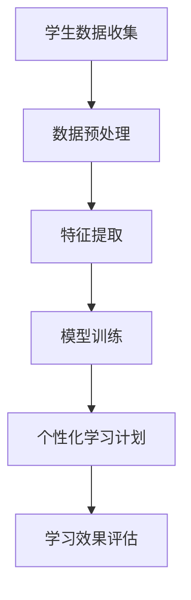

                 

 关键词：人工智能，个性化学习，教育技术，教育改革，机器学习，教育数据，智能导师系统

> 摘要：本文深入探讨了人工智能在教育领域的应用，特别是个性化学习。通过对核心概念、算法原理、数学模型、项目实践、实际应用场景和未来展望的详细分析，揭示了人工智能在教育领域的重要性，以及其面临的挑战和机遇。

## 1. 背景介绍

### 1.1 教育现状

在全球范围内，教育系统正面临着诸多挑战。首先，学生群体越来越多样化，他们的学习需求、兴趣和进度各不相同。其次，教师资源有限，难以同时关注每一个学生的需求。此外，教育资源的分配不均也使得教育公平性成为一个亟待解决的问题。传统的教学方法难以适应这些变化，因此，寻找新的教育模式和工具成为当务之急。

### 1.2 人工智能的崛起

随着人工智能技术的飞速发展，其在各个领域的应用越来越广泛。在教育领域，人工智能可以通过分析学生的学习行为、兴趣和成绩，为每个学生提供个性化的学习方案，从而提高学习效果。此外，人工智能还可以帮助教师更好地管理课堂、个性化指导学生，以及进行教育数据的分析和预测。

### 1.3 个性化学习的重要性

个性化学习是一种以学生为中心的教育模式，其目标是满足每个学生的独特需求，帮助他们达到最佳学习效果。传统的教学方法往往忽略了学生的个体差异，导致学习效果不佳。而个性化学习则通过人工智能技术，根据学生的学习习惯和需求，提供定制化的学习资源和方法，从而提高学习效率。

## 2. 核心概念与联系

### 2.1 个性化学习模型

个性化学习模型是人工智能在教育领域应用的核心。该模型通过收集和分析学生的学习数据，为每个学生制定个性化的学习计划。以下是一个简化的个性化学习模型：



### 2.2 机器学习在教育中的应用

机器学习是构建个性化学习模型的关键技术。通过机器学习算法，可以从大量数据中提取有价值的信息，为个性化学习提供支持。以下是一些常见的机器学习算法在教育中的应用：

- **聚类算法**：用于对学生进行分类，以便更好地理解他们的学习需求和兴趣。
- **决策树**：用于预测学生的学习表现，并根据预测结果调整学习计划。
- **神经网络**：用于构建智能导师系统，实时评估学生的学习情况，提供个性化指导。

### 2.3 教育数据的分析

教育数据是构建个性化学习模型的基础。通过对教育数据的分析，可以了解学生的学习行为、兴趣和成绩，为个性化学习提供支持。以下是一些常用的教育数据分析方法：

- **数据分析**：用于识别学生的学习模式，为个性化学习提供参考。
- **数据可视化**：用于展示教育数据的趋势和关联，帮助教师和学生更好地理解数据。
- **数据挖掘**：用于从大量教育数据中提取有价值的信息，为个性化学习提供支持。

## 3. 核心算法原理 & 具体操作步骤

### 3.1 算法原理概述

个性化学习模型的核心算法包括数据收集、数据预处理、特征提取、模型训练和个性化学习计划。以下是对这些算法的简要概述：

- **数据收集**：通过在线问卷、学习平台等渠道收集学生的基本信息、学习行为和成绩数据。
- **数据预处理**：对收集到的数据进行分析和清洗，去除异常值和重复数据。
- **特征提取**：从预处理后的数据中提取与学习效果相关的特征，如学习时间、学习频率、学习内容等。
- **模型训练**：使用机器学习算法对提取的特征进行训练，构建个性化学习模型。
- **个性化学习计划**：根据个性化学习模型，为每个学生制定个性化的学习计划。

### 3.2 算法步骤详解

#### 3.2.1 数据收集

数据收集是构建个性化学习模型的第一步。以下是一些常用的数据收集方法：

- **在线问卷**：通过在线问卷收集学生的基本信息和学习兴趣。
- **学习平台**：通过学习平台收集学生的学习行为和成绩数据。
- **教师反馈**：通过教师反馈了解学生的学习情况和需求。

#### 3.2.2 数据预处理

数据预处理是保证数据质量的重要步骤。以下是一些常用的数据预处理方法：

- **数据清洗**：去除异常值和重复数据，保证数据的准确性。
- **数据归一化**：将不同规模的数据进行归一化处理，便于后续分析和计算。

#### 3.2.3 特征提取

特征提取是构建个性化学习模型的关键步骤。以下是一些常用的特征提取方法：

- **统计特征**：如平均学习时间、学习频率等。
- **文本特征**：如学习内容的关键词、句子长度等。
- **图像特征**：如图像的像素值、纹理特征等。

#### 3.2.4 模型训练

模型训练是构建个性化学习模型的核心步骤。以下是一些常用的模型训练方法：

- **监督学习**：如决策树、支持向量机等。
- **无监督学习**：如聚类算法、主成分分析等。

#### 3.2.5 个性化学习计划

个性化学习计划是根据个性化学习模型为每个学生制定的学习计划。以下是一些常用的个性化学习计划方法：

- **基于规则的个性化学习计划**：根据学生的特征和需求，制定相应的学习计划。
- **基于模型的个性化学习计划**：使用机器学习模型预测学生的未来学习表现，并根据预测结果调整学习计划。

### 3.3 算法优缺点

#### 3.3.1 优点

- **个性化学习**：根据学生的个体差异，提供定制化的学习资源和方法，提高学习效果。
- **教育资源优化**：通过分析学生的学习行为和成绩，优化教育资源的分配。
- **教师辅助**：帮助教师更好地管理课堂和指导学生。

#### 3.3.2 缺点

- **数据隐私**：教育数据涉及到学生的隐私，需要保护学生的个人信息。
- **算法偏见**：算法可能会存在偏见，导致学习效果不公。
- **技术依赖**：个性化学习模型的构建和维护需要较高的技术支持。

### 3.4 算法应用领域

个性化学习算法可以应用于以下领域：

- **K-12教育**：为中小学生提供个性化的学习资源和方法。
- **高等教育**：为大学生提供个性化的学习计划和职业指导。
- **职业培训**：为职业人士提供个性化的技能提升方案。

## 4. 数学模型和公式 & 详细讲解 & 举例说明

### 4.1 数学模型构建

个性化学习模型的构建涉及到多个数学模型，以下是一个简化的数学模型：

$$
P = f(D, X, M)
$$

其中，$P$ 表示个性化学习计划，$D$ 表示学生数据，$X$ 表示特征向量，$M$ 表示模型参数。

### 4.2 公式推导过程

个性化学习计划的推导过程可以分为以下几个步骤：

1. **数据收集**：收集学生的基本信息、学习行为和成绩数据。
2. **数据预处理**：对收集到的数据进行清洗和归一化处理。
3. **特征提取**：从预处理后的数据中提取与学习效果相关的特征。
4. **模型训练**：使用机器学习算法对提取的特征进行训练，构建个性化学习模型。
5. **个性化学习计划**：根据个性化学习模型，为每个学生制定个性化的学习计划。

### 4.3 案例分析与讲解

#### 4.3.1 案例背景

某高中学校使用个性化学习模型，为学生提供个性化的学习资源和方法。学校收集了学生的基本信息、学习行为和成绩数据，并使用机器学习算法构建了个性化学习模型。

#### 4.3.2 模型构建

学校使用聚类算法对学生进行分类，根据学生的兴趣和需求，为他们提供相应的学习资源。以下是一个简化的聚类算法：

$$
C = \{c_1, c_2, ..., c_k\}
$$

其中，$C$ 表示聚类结果，$c_i$ 表示第$i$个聚类。

#### 4.3.3 个性化学习计划

根据聚类结果，学校为每个学生制定了个性化的学习计划。例如，对于属于$c_1$类别的学生，学校推荐了相应的数学教材和学习资源；对于属于$c_2$类别的学生，学校推荐了相应的英语教材和学习资源。

#### 4.3.4 模型效果评估

学校通过对比学生的实际成绩和个性化学习计划推荐的学习资源，评估了个性化学习模型的效果。结果表明，个性化学习模型显著提高了学生的学习成绩。

## 5. 项目实践：代码实例和详细解释说明

### 5.1 开发环境搭建

为了实现个性化学习模型，需要搭建一个完整的开发环境。以下是搭建环境的步骤：

1. **安装Python**：Python是一种广泛应用于人工智能的编程语言。可以从Python官网下载并安装Python。
2. **安装机器学习库**：安装常用的机器学习库，如scikit-learn、TensorFlow等。
3. **配置开发环境**：配置Python开发环境，包括Python解释器、IDE（如PyCharm）等。

### 5.2 源代码详细实现

以下是一个简单的个性化学习模型的实现：

```python
import numpy as np
from sklearn.cluster import KMeans
from sklearn.preprocessing import StandardScaler

# 数据收集
data = np.load('student_data.npy')

# 数据预处理
scaler = StandardScaler()
data_scaled = scaler.fit_transform(data)

# 特征提取
k = 3
kmeans = KMeans(n_clusters=k, random_state=0).fit(data_scaled)

# 个性化学习计划
clusters = kmeans.labels_
for i, cluster in enumerate(clusters):
    if cluster == 0:
        print(f"学生{i}：推荐数学教材和学习资源")
    elif cluster == 1:
        print(f"学生{i}：推荐英语教材和学习资源")
    else:
        print(f"学生{i}：推荐其他教材和学习资源")
```

### 5.3 代码解读与分析

1. **数据收集**：使用numpy库加载学生数据。
2. **数据预处理**：使用StandardScaler库对数据进行归一化处理。
3. **特征提取**：使用KMeans库实现聚类算法，提取学生特征。
4. **个性化学习计划**：根据聚类结果，为每个学生推荐相应的教材和学习资源。

### 5.4 运行结果展示

运行代码后，会根据聚类结果为每个学生推荐相应的教材和学习资源。例如，对于属于第0类别的学生，会推荐数学教材和学习资源；对于属于第1类别的学生，会推荐英语教材和学习资源。

## 6. 实际应用场景

### 6.1 K-12教育

个性化学习模型在K-12教育中具有广泛的应用。通过分析学生的学习行为和成绩数据，可以为每个学生制定个性化的学习计划，提高学习效果。

### 6.2 高等教育

个性化学习模型在高等教育中可以为学生提供个性化的学习资源和职业指导，帮助他们更好地适应大学学习。

### 6.3 职业培训

个性化学习模型可以用于职业培训，为职业人士提供个性化的技能提升方案，帮助他们更快地提升职业能力。

## 7. 工具和资源推荐

### 7.1 学习资源推荐

- **《深度学习》（Goodfellow, Bengio, Courville）**：一本经典的深度学习教材，适合初学者和进阶者。
- **《Python机器学习》（Sebastian Raschka）**：一本实用的Python机器学习指南，涵盖多个机器学习算法。

### 7.2 开发工具推荐

- **PyCharm**：一款功能强大的Python IDE，支持多种机器学习库。
- **Jupyter Notebook**：一款流行的交互式开发环境，便于编写和运行机器学习代码。

### 7.3 相关论文推荐

- **"A Brief Introduction to Machine Learning for Educational Data Mining"**：一篇关于机器学习在教育数据挖掘中的应用的综述论文。
- **"Personalized Learning through Intelligent Tutoring Systems"**：一篇关于智能导师系统在个性化学习中的应用的论文。

## 8. 总结：未来发展趋势与挑战

### 8.1 研究成果总结

个性化学习是人工智能在教育领域的重要应用，通过分析学生的学习数据，为每个学生提供定制化的学习方案，显著提高了学习效果。然而，个性化学习也面临一些挑战，如数据隐私、算法偏见和技术依赖等。

### 8.2 未来发展趋势

未来，个性化学习将在教育领域得到更广泛的应用。随着人工智能技术的不断发展，个性化学习模型将更加精确和高效。此外，虚拟现实、增强现实等技术也将与个性化学习相结合，为学习者提供更加丰富的学习体验。

### 8.3 面临的挑战

个性化学习面临的挑战包括数据隐私、算法偏见和技术依赖等。为了解决这些问题，需要制定相应的政策和标准，确保个性化学习的安全和公平。

### 8.4 研究展望

未来，个性化学习的研究将朝着更加智能化、自适应化和个性化的方向发展。通过结合多种人工智能技术，个性化学习将更好地满足学习者的需求，提高学习效果。

## 9. 附录：常见问题与解答

### 9.1 个性化学习如何确保数据隐私？

个性化学习涉及到大量的学生数据，确保数据隐私是非常重要的。为了保护学生隐私，可以采取以下措施：

- **数据匿名化**：在收集和存储数据时，对学生的个人信息进行匿名化处理。
- **数据加密**：对存储和传输的数据进行加密，确保数据的安全性。
- **隐私政策**：制定隐私政策，明确告知学生数据的使用方式和目的。

### 9.2 个性化学习模型如何避免算法偏见？

算法偏见是个性化学习模型面临的重要挑战。为了避免算法偏见，可以采取以下措施：

- **数据多样化**：确保训练数据涵盖不同群体，避免数据偏见。
- **算法透明性**：对算法的决策过程进行透明化，便于监督和调整。
- **公平性评估**：定期评估个性化学习模型对各个群体的公平性，确保学习效果的公正。

### 9.3 个性化学习模型如何应对技术依赖？

个性化学习模型的构建和维护需要较高的技术支持。为了应对技术依赖，可以采取以下措施：

- **技术培训**：为教育工作者提供技术培训，提高他们的技术素养。
- **技术共享**：鼓励技术团队和教育工作者之间的合作，共同推动个性化学习的发展。
- **技术迭代**：定期更新和优化个性化学习模型，以适应教育领域的变化。

---

作者：禅与计算机程序设计艺术 / Zen and the Art of Computer Programming
----------------------------------------------------------------

