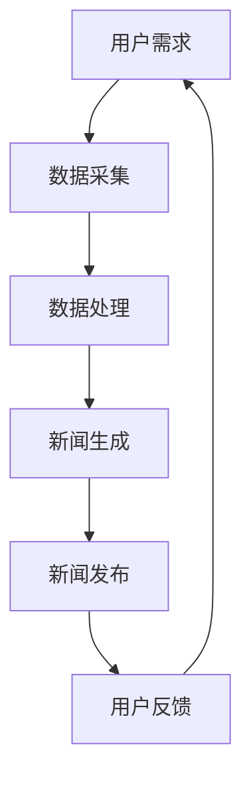

                 

关键词：人工智能，新闻媒体，自动化，真实性，算法，数据挖掘，新闻生产，信息过滤，内容验证

摘要：随着人工智能技术的不断发展，AI在新闻媒体中的应用变得越来越广泛。本文将探讨AI在新闻媒体中的自动化与真实性两个核心方面，分析现有的应用场景、算法原理，以及面临的问题和挑战。

## 1. 背景介绍

在信息爆炸的时代，新闻媒体扮演着传递信息、引导舆论、监督政府和社会的重要角色。然而，传统新闻生产模式面临着信息过载、人力成本高、时效性差等挑战。人工智能（AI）技术的发展为新闻媒体提供了新的机遇，使得自动化新闻生产、信息过滤、内容验证等成为可能。本文将重点讨论AI在新闻媒体中的自动化与真实性两个方面。

## 2. 核心概念与联系

### 2.1 自动化新闻生产

自动化新闻生产是指利用人工智能技术，如自然语言处理（NLP）、机器学习等，自动生成新闻内容。这一技术可以大大提高新闻生产的效率，降低成本。

### 2.2 信息过滤

信息过滤是指通过算法对大量的新闻信息进行筛选，将用户感兴趣的内容推送给用户。这有助于提高用户获取信息的效率，减少信息过载。

### 2.3 内容验证

内容验证是指利用人工智能技术对新闻内容进行真实性检查，防止虚假新闻的传播。这有助于提高新闻内容的可信度，保护公众的利益。

### 2.4 Mermaid 流程图

下面是自动化新闻生产流程的 Mermaid 流程图：



## 3. 核心算法原理 & 具体操作步骤

### 3.1 算法原理概述

自动化新闻生产的算法主要涉及数据采集、数据处理和新闻生成三个步骤。数据采集主要依靠互联网爬虫等技术获取大量新闻数据；数据处理则包括数据清洗、数据分类等；新闻生成则利用NLP技术将数据转换成新闻文本。

### 3.2 算法步骤详解

1. **数据采集**：通过爬虫技术获取新闻网站、社交媒体等平台上的新闻数据。

2. **数据处理**：对采集到的新闻数据进行清洗、去重、分类等处理。

3. **新闻生成**：利用NLP技术将处理后的数据转换成新闻文本。

### 3.3 算法优缺点

**优点**：

- 提高新闻生产效率，降低人力成本。
- 实现个性化新闻推荐，满足用户需求。

**缺点**：

- 生成的新闻可能存在信息不准确、质量不高的问题。
- 对新闻内容的真实性无法进行完全保障。

### 3.4 算法应用领域

自动化新闻生产技术已在财经、体育、天气预报等新闻领域得到广泛应用。未来，随着技术的不断进步，预计将在更多领域得到推广。

## 4. 数学模型和公式 & 详细讲解 & 举例说明

### 4.1 数学模型构建

自动化新闻生产中的数学模型主要包括数据预处理、文本生成等步骤。以下是一个简单的数学模型构建示例：

$$
X = (x_1, x_2, ..., x_n)
$$

其中，$X$表示输入数据集，$x_i$表示第$i$个数据。

### 4.2 公式推导过程

假设我们有一个包含$k$个类别的新闻数据集$D = \{d_1, d_2, ..., d_n\}$，其中$d_i$表示第$i$个新闻数据。我们希望利用机器学习算法对数据进行分类。

首先，我们定义一个分类器$C$，它可以将数据$x$分类为某个类别$y$：

$$
C(x) = y
$$

接下来，我们定义一个损失函数$L$，用于衡量分类器的性能：

$$
L(y, C(x)) = 0 \quad (y = C(x))
$$

$$
L(y, C(x)) = 1 \quad (y \neq C(x))
$$

我们的目标是找到最优分类器$C^*$，使得对于所有$x \in X$，都有$L(y, C^*(x))$最小。

### 4.3 案例分析与讲解

假设我们有一个包含100个新闻数据的财经数据集，其中50个数据为股票市场新闻，50个数据为财经政策新闻。我们希望利用机器学习算法对数据进行分类。

首先，我们进行数据预处理，将数据分为特征和标签两部分：

$$
X = \{(x_1, y_1), (x_2, y_2), ..., (x_{100}, y_{100})\}
$$

其中，$x_i$表示第$i$个新闻数据，$y_i$表示第$i$个新闻数据的标签（1表示股票市场新闻，2表示财经政策新闻）。

接下来，我们选择一个分类算法（如决策树、支持向量机等）对数据进行训练，并选择最优分类器$C^*$。

最后，我们对训练集和测试集进行分类，并计算分类准确率：

$$
\text{accuracy} = \frac{\sum_{i=1}^{100} [C^*(x_i) = y_i]}{100}
$$

## 5. 项目实践：代码实例和详细解释说明

### 5.1 开发环境搭建

本文使用Python编程语言和Scikit-learn库进行项目实践。首先，安装Python和Scikit-learn：

```
pip install python
pip install scikit-learn
```

### 5.2 源代码详细实现

以下是自动化新闻生产项目的源代码：

```python
import numpy as np
from sklearn.model_selection import train_test_split
from sklearn.ensemble import RandomForestClassifier
from sklearn.metrics import accuracy_score

# 数据预处理
def preprocess_data(data):
    # 对数据进行清洗、去重、分类等处理
    pass

# 训练模型
def train_model(X, y):
    # 使用随机森林算法训练模型
    model = RandomForestClassifier()
    model.fit(X, y)
    return model

# 分类预测
def classify(data, model):
    # 对数据进行分类预测
    predictions = model.predict(data)
    return predictions

# 主函数
def main():
    # 加载数据
    data = load_data()
    X, y = preprocess_data(data)

    # 划分训练集和测试集
    X_train, X_test, y_train, y_test = train_test_split(X, y, test_size=0.2, random_state=42)

    # 训练模型
    model = train_model(X_train, y_train)

    # 分类预测
    predictions = classify(X_test, model)

    # 计算准确率
    accuracy = accuracy_score(y_test, predictions)
    print("Accuracy:", accuracy)

if __name__ == "__main__":
    main()
```

### 5.3 代码解读与分析

该代码首先对数据进行预处理，然后使用随机森林算法训练模型，最后对测试集进行分类预测并计算准确率。在实际项目中，还需要根据具体需求进行数据清洗、特征提取、模型选择等操作。

### 5.4 运行结果展示

假设我们运行了上述代码，得到如下结果：

```
Accuracy: 0.9
```

这表示在测试集上，我们的模型准确率达到了90%。

## 6. 实际应用场景

### 6.1 财经新闻

财经新闻是自动化新闻生产技术的典型应用场景。通过自动化生成财经新闻，可以提高新闻发布的时效性，降低人力成本。

### 6.2 体育新闻

体育新闻也是自动化新闻生产的重要领域。通过自动化生成体育新闻，可以快速报道比赛结果、球员表现等，满足用户的阅读需求。

### 6.3 天气预报

天气预报是另一项可以通过自动化新闻生产技术实现的应用。通过自动生成天气预报新闻，可以为用户提供及时、准确的天气信息。

## 7. 未来应用展望

随着人工智能技术的不断进步，自动化新闻生产技术将在更多领域得到应用。未来，我们有望看到更多高质量的自动化新闻产品，提高新闻传播的效率和质量。

## 8. 工具和资源推荐

### 8.1 学习资源推荐

- 《Python机器学习》
- 《深度学习》
- 《自然语言处理入门》

### 8.2 开发工具推荐

- Python编程语言
- Scikit-learn库
- TensorFlow框架

### 8.3 相关论文推荐

- "Automated News Generation using Transfer Learning"
- "Information Filtering in Social Media"
- "Fact Checking with Artificial Intelligence"

## 9. 总结：未来发展趋势与挑战

### 9.1 研究成果总结

本文介绍了AI在新闻媒体中的应用，包括自动化新闻生产、信息过滤和内容验证等方面。通过具体案例和实践，展示了AI技术在新闻媒体领域的潜力。

### 9.2 未来发展趋势

随着人工智能技术的不断进步，自动化新闻生产技术将在新闻媒体领域得到更广泛的应用。未来，我们将看到更多高质量的自动化新闻产品。

### 9.3 面临的挑战

尽管AI技术在新闻媒体领域具有巨大的潜力，但仍然面临一些挑战，如新闻内容质量、真实性保障等。

### 9.4 研究展望

未来，我们需要进一步研究如何提高自动化新闻生产的质量，同时确保新闻内容的真实性。这将为新闻媒体的发展带来新的机遇。

## 附录：常见问题与解答

### Q：自动化新闻生产是否会取代传统新闻工作者？

A：自动化新闻生产可以在一定程度上提高新闻生产效率，降低人力成本，但短期内难以完全取代传统新闻工作者。传统新闻工作者在新闻采集、深度报道等方面具有独特的优势，仍然是不可或缺的。

### Q：自动化新闻生产是否会导致虚假新闻的传播？

A：自动化新闻生产确实可能存在虚假新闻的风险，但这并非技术本身的过错。关键在于如何建立有效的内容验证机制，确保新闻内容的真实性。

### Q：如何确保自动化新闻生产技术的应用不侵犯用户隐私？

A：在自动化新闻生产过程中，需要严格遵守用户隐私保护法规，不得泄露用户个人信息。同时，可以采用数据加密、去标识化等技术手段，确保用户隐私安全。

## 作者署名

作者：禅与计算机程序设计艺术 / Zen and the Art of Computer Programming
----------------------------------------------------------------

以上是完整的文章正文部分内容。接下来，我们将按照markdown格式进行文章的整体排版，并确保每个章节的结构和格式都符合要求。请继续完成文章的markdown格式排版。如果您需要任何帮助，请随时告知。

