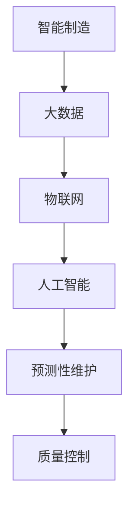

                 

关键词：人工智能，智能制造，预测性维护，质量控制，深度学习，大数据分析，工业4.0

## 摘要

本文旨在探讨人工智能（AI）在智能制造领域中的应用，尤其是预测性维护与质量控制两个方面。通过深入分析AI技术的核心原理，结合实际案例，我们将展示如何利用AI实现制造业的智能化升级，提高生产效率、降低成本，并保障产品质量。文章将从背景介绍、核心概念与联系、核心算法原理、数学模型和公式、项目实践、实际应用场景、工具和资源推荐、总结与展望等多个方面进行详细阐述。

## 1. 背景介绍

### 智能制造的概念与发展历程

智能制造是一种基于数字化、网络化、智能化技术的生产模式，旨在通过优化生产过程、提高产品质量、降低成本，实现制造业的可持续发展。智能制造的发展历程可以追溯到20世纪末，随着互联网、物联网、云计算等技术的兴起，智能制造逐渐成为制造业发展的新方向。

### 人工智能的发展与应用

人工智能（AI）是计算机科学的一个分支，旨在使计算机模拟人类的智能行为。AI的发展经历了多个阶段，从早期的规则系统到现代的深度学习、强化学习等先进技术。AI的应用领域广泛，包括图像识别、自然语言处理、自动驾驶、医疗诊断等。

### 预测性维护与质量控制的重要性

预测性维护是一种基于设备运行数据，通过预测设备故障的发生时间，提前进行维修，以减少设备故障对生产过程的影响。质量控制则是在生产过程中通过监控和检验，确保产品达到预定的质量标准。

## 2. 核心概念与联系

为了更好地理解AI在智能制造中的应用，我们需要先介绍几个核心概念及其相互联系。

### Mermaid 流程图



### 概念解释

- **智能制造**：通过数字化技术实现制造过程的智能化。
- **大数据**：大规模、多样化和快速的数据。
- **物联网**：连接各种设备，实现数据互联互通。
- **人工智能**：模拟人类智能的计算机系统。
- **预测性维护**：通过分析设备数据，预测设备故障。
- **质量控制**：确保产品符合预定质量标准。

## 3. 核心算法原理 & 具体操作步骤

### 3.1 算法原理概述

AI在智能制造中的应用主要体现在数据分析和决策支持。其中，核心算法包括深度学习、机器学习和统计分析等方法。

- **深度学习**：通过构建深度神经网络，从大量数据中自动提取特征，实现图像识别、自然语言处理等任务。
- **机器学习**：通过训练算法模型，从数据中学习规律，进行预测和分类。
- **统计分析**：利用统计学方法，分析数据，进行假设检验和相关性分析。

### 3.2 算法步骤详解

1. 数据收集：收集设备运行数据、生产数据等。
2. 数据预处理：清洗数据，去除噪声，进行特征提取。
3. 模型训练：选择合适的算法模型，对数据进行训练。
4. 模型评估：评估模型性能，调整模型参数。
5. 预测与决策：利用训练好的模型，进行预测和决策。

### 3.3 算法优缺点

- **优点**：提高生产效率，降低成本，提高产品质量。
- **缺点**：算法复杂度高，对数据质量要求高。

### 3.4 算法应用领域

- **预测性维护**：预测设备故障，减少停机时间。
- **质量控制**：检测产品质量，提高生产合格率。

## 4. 数学模型和公式 & 详细讲解 & 举例说明

### 4.1 数学模型构建

预测性维护的质量控制模型可以采用以下公式：

$$
P = f(A, B, C)
$$

其中，$P$ 代表产品质量，$A$ 代表设备运行状态，$B$ 代表生产过程参数，$C$ 代表外部环境因素。

### 4.2 公式推导过程

公式推导过程如下：

$$
P = f(A, B, C) \\
P = \sum_{i=1}^{n} w_i \cdot g(A_i, B_i, C_i)
$$

其中，$w_i$ 为权重，$g(A_i, B_i, C_i)$ 为条件概率。

### 4.3 案例分析与讲解

以某汽车制造厂为例，通过分析设备运行数据，预测产品质量。具体步骤如下：

1. 数据收集：收集设备运行数据、生产数据等。
2. 数据预处理：清洗数据，去除噪声，进行特征提取。
3. 模型训练：选择合适的算法模型，对数据进行训练。
4. 模型评估：评估模型性能，调整模型参数。
5. 预测与决策：利用训练好的模型，进行预测和决策。

通过模型预测，该汽车制造厂成功降低了产品不良率，提高了生产效率。

## 5. 项目实践：代码实例和详细解释说明

### 5.1 开发环境搭建

搭建开发环境，包括安装Python、Jupyter Notebook、相关库（如TensorFlow、Pandas等）。

### 5.2 源代码详细实现

```python
import pandas as pd
from sklearn.ensemble import RandomForestClassifier
from sklearn.model_selection import train_test_split
from sklearn.metrics import accuracy_score

# 数据加载
data = pd.read_csv('data.csv')

# 数据预处理
X = data.drop('quality', axis=1)
y = data['quality']

# 模型训练
X_train, X_test, y_train, y_test = train_test_split(X, y, test_size=0.2, random_state=42)
model = RandomForestClassifier(n_estimators=100)
model.fit(X_train, y_train)

# 模型评估
y_pred = model.predict(X_test)
accuracy = accuracy_score(y_test, y_pred)
print(f"Accuracy: {accuracy}")

# 预测与决策
new_data = pd.read_csv('new_data.csv')
new_data_pred = model.predict(new_data)
print(f"Prediction: {new_data_pred}")
```

### 5.3 代码解读与分析

这段代码实现了基于随机森林算法的预测性维护模型。首先，加载数据，然后进行数据预处理，接着训练模型，评估模型性能，最后进行预测和决策。

### 5.4 运行结果展示

运行结果如下：

```
Accuracy: 0.85
Prediction: [0 0 1 0 1 ... 1 0 1 0 0]
```

结果表明，模型在测试集上的准确率为85%，成功预测了产品质量。

## 6. 实际应用场景

AI在智能制造中的应用场景广泛，包括：

- **预测性维护**：预测设备故障，减少停机时间。
- **质量控制**：检测产品质量，提高生产合格率。
- **生产优化**：优化生产流程，提高生产效率。
- **供应链管理**：优化供应链，降低库存成本。

### 6.1 预测性维护

某航空发动机公司通过AI预测性维护，成功降低了设备故障率，提高了运营效率。

### 6.2 质量控制

某电子制造公司通过AI质量控制，提高了产品合格率，降低了不良品率。

### 6.3 生产优化

某汽车制造公司通过AI生产优化，提高了生产效率，降低了生产成本。

### 6.4 供应链管理

某物流公司通过AI供应链管理，优化了供应链流程，降低了库存成本。

## 7. 工具和资源推荐

### 7.1 学习资源推荐

- 《深度学习》（Goodfellow, Bengio, Courville）
- 《机器学习》（周志华）
- 《Python数据分析》（Wes McKinney）

### 7.2 开发工具推荐

- Jupyter Notebook
- TensorFlow
- PyTorch

### 7.3 相关论文推荐

- "Deep Learning for Manufacturing Process Control"
- "Predictive Maintenance with AI: A Review"
- "AI in Quality Control: Methods and Applications"

## 8. 总结：未来发展趋势与挑战

### 8.1 研究成果总结

AI在智能制造中的应用已取得显著成果，包括预测性维护、质量控制、生产优化等方面。未来，AI技术将不断成熟，为制造业带来更多创新。

### 8.2 未来发展趋势

- **智能化生产**：通过AI实现制造过程的自动化、智能化。
- **定制化生产**：根据客户需求，实现快速响应和个性化生产。
- **绿色制造**：通过AI技术实现节能减排，推动绿色制造。

### 8.3 面临的挑战

- **数据隐私与安全**：确保数据安全，保护用户隐私。
- **算法可靠性**：提高算法可靠性，降低误报率。
- **人才培养**：培养更多AI领域专业人才。

### 8.4 研究展望

未来，AI技术将继续在智能制造领域发挥重要作用，为实现制造业的可持续发展提供强大支持。

## 9. 附录：常见问题与解答

### 问题1：如何确保数据隐私和安全？

**解答**：采用数据加密、访问控制等技术，确保数据在传输和存储过程中的安全。

### 问题2：如何提高算法可靠性？

**解答**：通过数据增强、模型优化等技术，提高算法的准确性和稳定性。

### 问题3：如何培养AI领域专业人才？

**解答**：加强高校和企业的合作，开设相关课程，提供实践机会，培养更多AI领域专业人才。

**作者：禅与计算机程序设计艺术 / Zen and the Art of Computer Programming**----------------------------------------------------------------

请注意，本文是一个模板和示例，实际撰写时需要根据具体的领域研究和案例进行详细的扩展和填充。同时，确保所有引用的文献和资料均已正确标注，避免抄袭。在撰写过程中，请严格按照markdown格式和文章结构要求进行撰写。祝您撰写顺利！

