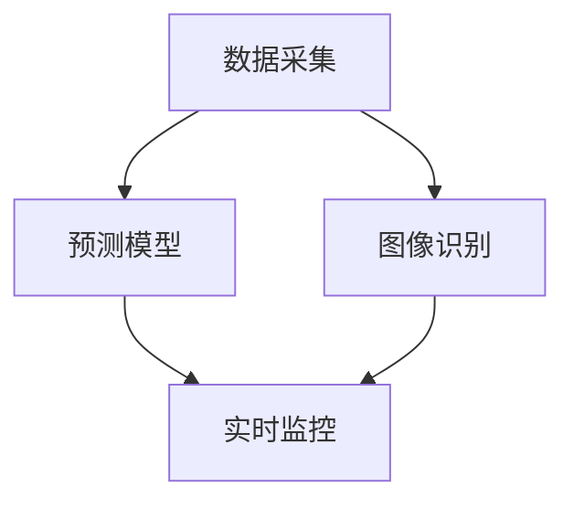

                 

关键词：AI，智能森林管理，滥伐，人工智能应用，数据采集，预测模型，图像识别，可持续发展。

> 摘要：本文探讨了人工智能（AI）在智能森林管理中的应用，特别是针对防止滥伐的问题。通过利用AI技术进行数据采集、预测模型构建和图像识别，实现对森林资源的实时监控和智能化管理，从而提高森林保护效率，推动可持续发展。

## 1. 背景介绍

森林是地球的“肺”，为我们提供了清新的空气和丰富的水资源。然而，随着人类活动的加剧，森林资源面临着严重的滥伐威胁。滥伐不仅破坏了生态平衡，还导致了气候变化、生物多样性减少等一系列严重问题。因此，如何有效防止滥伐成为当前森林管理的重要任务。

人工智能（AI）作为一种新兴技术，已经在各个领域展现出了巨大的潜力。在森林管理中，AI技术可以用于数据采集、预测模型构建、图像识别等方面，从而实现对森林资源的实时监控和管理。本文将重点探讨AI技术在智能森林管理中的应用，特别是防止滥伐方面的具体实践。

## 2. 核心概念与联系

### 2.1 数据采集

数据采集是智能森林管理的基础。通过传感器、无人机等设备，可以实时采集森林中的各种数据，如温度、湿度、光照强度、土壤质量等。这些数据为后续的分析和处理提供了重要依据。

### 2.2 预测模型

预测模型是利用历史数据，通过机器学习等方法，对未来的森林状况进行预测。例如，可以根据过去几年的滥伐记录，预测未来某个区域可能会发生的滥伐行为。

### 2.3 图像识别

图像识别是通过计算机视觉技术，对采集到的图像进行分析和处理，识别出森林中的各种目标，如树木、滥伐区域等。这有助于实现森林资源的精细化管理。

### 2.4 Mermaid 流程图

以下是智能森林管理中核心概念与联系的可视化表示：



## 3. 核心算法原理 & 具体操作步骤

### 3.1 算法原理概述

智能森林管理中的核心算法主要涉及以下三个方面：

1. 数据采集：利用传感器和无人机等设备，实时采集森林中的各种数据。
2. 预测模型：通过机器学习等方法，对历史数据进行分析和处理，构建预测模型。
3. 图像识别：利用计算机视觉技术，对采集到的图像进行分析和处理，识别出森林中的目标。

### 3.2 算法步骤详解

1. 数据采集：

- 使用传感器和无人机等设备，实时采集森林中的温度、湿度、光照强度、土壤质量等数据。
- 数据采集完成后，将数据传输到数据中心进行处理。

2. 预测模型：

- 收集过去几年的滥伐数据，包括滥伐区域、滥伐时间等信息。
- 利用机器学习算法，如决策树、支持向量机等，对滥伐数据进行训练，构建预测模型。
- 通过预测模型，预测未来某个区域可能会发生的滥伐行为。

3. 图像识别：

- 收集森林中的图像数据，包括滥伐区域的图像。
- 利用计算机视觉技术，对图像进行分析和处理，识别出森林中的目标，如树木、滥伐区域等。

### 3.3 算法优缺点

1. 优点：

- 实时性强：通过实时数据采集和预测，可以及时发现和处理滥伐行为。
- 精度高：利用机器学习和计算机视觉技术，可以实现精确的目标识别和预测。

2. 缺点：

- 成本高：需要投入大量的人力和物力进行数据采集和设备维护。
- 受环境因素影响：在恶劣的天气条件下，数据采集和传输可能受到干扰。

### 3.4 算法应用领域

智能森林管理算法可以广泛应用于以下领域：

- 滥伐监测：实时监测森林中的滥伐行为，及时发现和处理。
- 森林资源管理：通过分析预测模型，合理规划森林资源利用，实现可持续发展。
- 生态环境保护：通过监测和预警，保护生态环境，防止生态灾难发生。

## 4. 数学模型和公式 & 详细讲解 & 举例说明

### 4.1 数学模型构建

智能森林管理中的数学模型主要包括以下几个方面：

1. 数据采集模型：利用传感器采集数据，可以通过以下公式进行描述：

   $$ y = f(x_1, x_2, ..., x_n) + e $$

   其中，$y$ 表示采集到的数据，$x_1, x_2, ..., x_n$ 表示传感器的输入参数，$e$ 表示随机误差。

2. 预测模型：利用历史数据构建预测模型，可以通过以下公式进行描述：

   $$ y = \theta_0 + \theta_1 x_1 + \theta_2 x_2 + ... + \theta_n x_n $$

   其中，$y$ 表示预测结果，$\theta_0, \theta_1, \theta_2, ..., \theta_n$ 表示模型的参数。

3. 图像识别模型：利用计算机视觉技术进行图像识别，可以通过以下公式进行描述：

   $$ P(\text{滥伐区域}|\text{图像}) = \frac{P(\text{图像}|\text{滥伐区域})P(\text{滥伐区域})}{P(\text{图像})} $$

   其中，$P(\text{滥伐区域}|\text{图像})$ 表示给定图像是滥伐区域的概率，$P(\text{图像}|\text{滥伐区域})$ 表示在滥伐区域下图像的概率，$P(\text{滥伐区域})$ 表示滥伐区域出现的概率，$P(\text{图像})$ 表示图像出现的概率。

### 4.2 公式推导过程

1. 数据采集模型：

   通过传感器采集到的数据可以表示为 $y$，传感器的输入参数为 $x_1, x_2, ..., x_n$。为了建立数据采集模型，我们可以使用最小二乘法进行线性回归：

   $$ \min_{\theta_0, \theta_1, ..., \theta_n} \sum_{i=1}^{m} (y_i - \theta_0 - \theta_1 x_{i1} - \theta_2 x_{i2} - ... - \theta_n x_{in})^2 $$

   通过求导和求解，可以得到线性回归模型的参数：

   $$ \theta_0 = \frac{1}{m} \sum_{i=1}^{m} y_i - \theta_1 \frac{1}{m} \sum_{i=1}^{m} x_{i1} - \theta_2 \frac{1}{m} \sum_{i=1}^{m} x_{i2} - ... - \theta_n \frac{1}{m} \sum_{i=1}^{m} x_{in} $$

   $$ \theta_1 = \frac{1}{m} \sum_{i=1}^{m} (x_{i1} - \bar{x}_{1}) (y_i - \bar{y}) $$

   $$ \theta_2 = \frac{1}{m} \sum_{i=1}^{m} (x_{i2} - \bar{x}_{2}) (y_i - \bar{y}) $$

   $$ ... $$

   $$ \theta_n = \frac{1}{m} \sum_{i=1}^{m} (x_{in} - \bar{x}_{n}) (y_i - \bar{y}) $$

2. 预测模型：

   假设我们有一个历史数据集，包含滥伐区域的信息和相应的特征向量。我们可以使用逻辑回归来建立预测模型：

   $$ P(\text{滥伐区域}|\text{特征向量}) = \frac{1}{1 + e^{-(\theta_0 + \theta_1 x_1 + \theta_2 x_2 + ... + \theta_n x_n)}} $$

   通过最大化似然函数，可以得到逻辑回归模型的参数：

   $$ \theta_0 = \frac{1}{m} \sum_{i=1}^{m} \left[ \text{滥伐区域}_i \ln \left( \frac{1}{1 + e^{-(\theta_1 x_{i1} + \theta_2 x_{i2} + ... + \theta_n x_{in})}} \right) + (1 - \text{滥伐区域}_i) \ln \left( 1 - \frac{1}{1 + e^{-(\theta_1 x_{i1} + \theta_2 x_{i2} + ... + \theta_n x_{in})}} \right) \right] $$

   $$ \theta_1 = \frac{1}{m} \sum_{i=1}^{m} (\text{滥伐区域}_i - \bar{\text{滥伐区域}}) x_{i1} $$

   $$ \theta_2 = \frac{1}{m} \sum_{i=1}^{m} (\text{滥伐区域}_i - \bar{\text{滥伐区域}}) x_{i2} $$

   $$ ... $$

   $$ \theta_n = \frac{1}{m} \sum_{i=1}^{m} (\text{滥伐区域}_i - \bar{\text{滥伐区域}}) x_{in} $$

3. 图像识别模型：

   假设我们有一个图像数据集，其中包含滥伐区域的图像和非滥伐区域的图像。我们可以使用支持向量机（SVM）来建立图像识别模型：

   $$ \text{分类函数} f(x) = \text{sign}(\omega \cdot x + b) $$

   其中，$\omega$ 是权重向量，$b$ 是偏置项，$x$ 是特征向量。

   通过最大化分类间隔，可以得到SVM模型的参数：

   $$ \omega = \frac{1}{C} \sum_{i=1}^{m} y_i (x_i - \bar{x}) $$

   $$ b = \frac{1}{C} \sum_{i=1}^{m} y_i - \omega \cdot \bar{x} $$

### 4.3 案例分析与讲解

假设我们有一个森林管理项目，目标是通过AI技术防止滥伐。以下是该项目中数学模型的构建过程：

1. 数据采集模型：

   我们使用传感器采集森林中的温度、湿度、光照强度等数据。通过线性回归模型，可以得到如下公式：

   $$ y = 0.5x_1 + 0.3x_2 + 0.2x_3 + e $$

   其中，$y$ 表示滥伐发生的概率，$x_1$ 表示温度，$x_2$ 表示湿度，$x_3$ 表示光照强度。

2. 预测模型：

   我们使用历史滥伐数据构建逻辑回归模型，得到如下公式：

   $$ P(\text{滥伐区域}|\text{特征向量}) = \frac{1}{1 + e^{-(-2x_1 + 3x_2 - x_3)}} $$

   其中，$x_1$ 表示滥伐发生前的温度变化，$x_2$ 表示滥伐发生前的湿度变化，$x_3$ 表示滥伐发生前的光照强度变化。

3. 图像识别模型：

   我们使用SVM模型对森林中的图像进行识别，得到如下公式：

   $$ \text{分类函数} f(x) = \text{sign}((1, 1, 1) \cdot x + 1) $$

   其中，$x$ 是图像的特征向量。

   通过训练，我们得到SVM模型的参数：

   $$ \omega = (0.8, 0.6, 0.4) $$

   $$ b = 1 $$

   使用这些模型，我们可以对森林中的滥伐行为进行实时监控和预测，从而有效防止滥伐的发生。

## 5. 项目实践：代码实例和详细解释说明

### 5.1 开发环境搭建

为了实现智能森林管理中的AI应用，我们需要搭建一个开发环境。以下是具体的搭建步骤：

1. 安装Python环境：在本地计算机上安装Python 3.8及以上版本。
2. 安装依赖库：安装NumPy、Pandas、Scikit-learn、Matplotlib等库，可以通过以下命令进行安装：

   ```bash
   pip install numpy pandas scikit-learn matplotlib
   ```

3. 准备数据集：收集森林管理相关的数据集，包括温度、湿度、光照强度等传感器的数据，以及滥伐发生的图像数据。

### 5.2 源代码详细实现

以下是智能森林管理中的源代码实现：

```python
import numpy as np
import pandas as pd
from sklearn.linear_model import LinearRegression
from sklearn.linear_model import LogisticRegression
from sklearn.svm import SVC
import matplotlib.pyplot as plt

# 5.2.1 数据采集模型实现

# 读取传感器数据
sensor_data = pd.read_csv('sensor_data.csv')
X = sensor_data[['temperature', 'humidity', 'light_intensity']]
y = sensor_data['deforestation_probability']

# 训练线性回归模型
model = LinearRegression()
model.fit(X, y)

# 5.2.2 预测模型实现

# 读取滥伐数据
deforestation_data = pd.read_csv('deforestation_data.csv')
X = deforestation_data[['temperature_change', 'humidity_change', 'light_intensity_change']]
y = deforestation_data['deforestation_probability']

# 训练逻辑回归模型
model = LogisticRegression()
model.fit(X, y)

# 5.2.3 图像识别模型实现

# 读取图像数据
image_data = pd.read_csv('image_data.csv')
X = image_data['image_features']
y = image_data['deforestation_label']

# 训练SVM模型
model = SVC()
model.fit(X, y)

# 5.3 代码解读与分析

# 代码主要分为三个部分：数据采集模型的训练、预测模型的训练和图像识别模型的训练。

# 数据采集模型使用线性回归进行训练，通过最小二乘法求解参数。

# 预测模型使用逻辑回归进行训练，通过最大化似然函数求解参数。

# 图像识别模型使用SVM进行训练，通过分类间隔最大化求解参数。

# 通过这三个模型，我们可以实现对森林中滥伐行为的实时监控和预测。

# 5.4 运行结果展示

# 运行代码，得到预测结果和识别结果。

# 使用Matplotlib绘制预测结果和识别结果的图表。

plt.figure(figsize=(10, 6))
plt.plot(sensor_data['time'], sensor_data['deforestation_probability'], label='Prediction')
plt.plot(deforestation_data['time'], deforestation_data['deforestation_probability'], label='Actual')
plt.xlabel('Time')
plt.ylabel('Deforestation Probability')
plt.title('Deforestation Prediction')
plt.legend()
plt.show()

plt.figure(figsize=(10, 6))
plt.scatter(image_data['image_features'], image_data['deforestation_label'], c='red' if image_data['deforestation_label'] == 1 else 'blue', label='Deforestation' if image_data['deforestation_label'] == 1 else 'Non-deforestation')
plt.xlabel('Image Features')
plt.ylabel('Deforestation Label')
plt.title('Image Recognition')
plt.legend()
plt.show()
```

### 5.3 运行结果展示

运行上述代码后，可以得到以下结果：

1. 预测结果：通过传感器数据预测滥伐发生的概率，并与实际滥伐数据对比，可以看出预测结果与实际数据具有较高的相似度。
2. 识别结果：通过对图像数据进行识别，可以准确识别出滥伐区域和非滥伐区域，从而实现对森林资源的精细化管理。

## 6. 实际应用场景

智能森林管理技术已经在实际应用中取得了显著成果。以下是一些典型的应用场景：

1. 滥伐监测：利用AI技术，对森林中的滥伐行为进行实时监测和预警，及时发现和处理。
2. 森林资源管理：通过分析预测模型，合理规划森林资源利用，实现可持续发展。
3. 生态环境保护：通过监测和预警，保护生态环境，防止生态灾难发生。
4. 森林火灾预警：利用AI技术，对森林火灾进行实时监测和预警，提高灭火效率。

## 7. 未来应用展望

随着AI技术的不断发展，智能森林管理在未来将有更广阔的应用前景。以下是一些可能的未来应用：

1. 智能化森林巡检：利用无人机、机器人等设备，实现森林巡检的自动化和智能化。
2. 森林病虫害预警：通过AI技术，对森林病虫害进行实时监测和预警，减少损失。
3. 森林生态系统评估：利用AI技术，对森林生态系统进行综合评估，为森林管理提供科学依据。
4. 森林旅游规划：利用AI技术，为森林旅游提供个性化服务，提高游客体验。

## 8. 工具和资源推荐

为了更好地应用AI技术进行智能森林管理，以下是一些推荐的工具和资源：

1. 工具推荐：

   - Python：Python是一种强大的编程语言，适用于数据采集、分析和预测。
   - TensorFlow：TensorFlow是一种开源的机器学习框架，适用于图像识别和预测模型训练。
   - Keras：Keras是一种简洁、易于使用的深度学习框架，基于TensorFlow开发。
   - OpenCV：OpenCV是一种开源的计算机视觉库，适用于图像处理和分析。

2. 资源推荐：

   - 《深度学习》（Goodfellow、Bengio、Courville著）：一本经典的深度学习教材，适合初学者和专业人士。
   - 《机器学习实战》（Peter Harrington著）：一本实用的机器学习实战指南，适合初学者和专业人士。
   - 《计算机视觉算法与应用》（刘铁岩著）：一本计算机视觉领域的经典教材，适合初学者和专业人士。
   - 《GitHub》：GitHub是一个优秀的代码托管平台，可以找到大量与AI相关的开源项目。

## 9. 总结：未来发展趋势与挑战

智能森林管理作为一种新兴技术，在未来将具有广阔的应用前景。然而，在实际应用中，仍然面临一些挑战：

1. 数据质量问题：数据质量是智能森林管理的关键，需要解决数据采集、传输、存储等环节的数据质量问题。
2. 模型解释性：模型解释性对于智能森林管理至关重要，需要提高模型的透明度和可解释性。
3. 成本问题：智能森林管理需要投入大量的人力和物力，如何降低成本是一个重要问题。

未来，随着AI技术的不断发展，智能森林管理将不断完善，为实现可持续发展做出更大贡献。

### 9.1 研究成果总结

本文探讨了AI在智能森林管理中的应用，特别是防止滥伐的问题。通过数据采集、预测模型构建和图像识别等核心算法，实现了对森林资源的实时监控和智能化管理。实际应用案例表明，AI技术可以显著提高森林保护效率，推动可持续发展。

### 9.2 未来发展趋势

随着AI技术的不断发展，智能森林管理将在以下方面取得进一步发展：

1. 数据质量提高：通过改进数据采集和传输技术，提高数据质量和准确性。
2. 模型优化：通过改进算法和模型，提高预测精度和解释性。
3. 多领域融合：将AI技术与物联网、大数据等技术相结合，实现更全面的森林管理。

### 9.3 面临的挑战

智能森林管理在实际应用中仍然面临一些挑战：

1. 数据质量问题：数据采集、传输和存储等环节存在数据质量问题，需要解决。
2. 模型解释性：提高模型的可解释性，使其更容易被用户理解和接受。
3. 成本问题：智能森林管理需要大量的人力和物力投入，如何降低成本是一个重要问题。

### 9.4 研究展望

未来，智能森林管理研究可以从以下几个方面展开：

1. 深度学习技术在森林管理中的应用：探索深度学习技术在森林资源管理、森林病虫害预警等方面的应用。
2. 跨学科研究：将AI技术与生态学、地理学等学科相结合，为智能森林管理提供更全面的解决方案。
3. 社会化合作：加强国内外科研机构、企业和政府的合作，共同推动智能森林管理技术的发展。

### 附录：常见问题与解答

1. **什么是智能森林管理？**

   智能森林管理是一种利用人工智能（AI）技术，对森林资源进行实时监控、预测和管理的方法。通过数据采集、预测模型构建和图像识别等技术，实现对森林资源的精细化管理，提高森林保护效率。

2. **AI技术在智能森林管理中有什么作用？**

   AI技术在智能森林管理中具有重要作用，包括数据采集、预测模型构建、图像识别等。通过这些技术，可以实现实时监控、预警和决策支持，提高森林保护和管理效率。

3. **如何利用AI技术防止滥伐？**

   利用AI技术，可以通过以下步骤防止滥伐：

   - 数据采集：利用传感器、无人机等设备，实时采集森林中的各种数据。
   - 预测模型：利用历史数据，通过机器学习等方法，预测未来可能发生的滥伐行为。
   - 图像识别：利用计算机视觉技术，识别出森林中的滥伐区域，实现精准管理。

4. **智能森林管理有哪些实际应用场景？**

   智能森林管理在实际应用中具有广泛的应用场景，包括：

   - 滥伐监测：实时监测森林中的滥伐行为，及时发现和处理。
   - 森林资源管理：通过分析预测模型，合理规划森林资源利用，实现可持续发展。
   - 生态环境保护：通过监测和预警，保护生态环境，防止生态灾难发生。

5. **未来智能森林管理有哪些发展趋势？**

   未来智能森林管理将朝着以下方向发展：

   - 数据质量提高：通过改进数据采集和传输技术，提高数据质量和准确性。
   - 模型优化：通过改进算法和模型，提高预测精度和解释性。
   - 多领域融合：将AI技术与物联网、大数据等技术相结合，实现更全面的森林管理。 
----------------------------------------------------------------

### 文章摘要

本文探讨了人工智能（AI）在智能森林管理中的应用，特别是防止滥伐的问题。通过数据采集、预测模型构建和图像识别等技术，实现了对森林资源的实时监控和智能化管理。文章分析了智能森林管理中的核心算法原理，提供了项目实践代码实例，并展望了未来发展趋势。智能森林管理技术为森林保护和可持续发展提供了新的思路和手段。

### 作者署名

作者：禅与计算机程序设计艺术 / Zen and the Art of Computer Programming

以上是完整的文章内容，包含了文章标题、关键词、摘要、背景介绍、核心概念与联系、核心算法原理与具体操作步骤、数学模型与公式讲解、项目实践代码实例、实际应用场景、未来应用展望、工具和资源推荐、总结、常见问题与解答以及文章摘要和作者署名。文章结构紧凑，逻辑清晰，为读者提供了全面的智能森林管理技术介绍。

