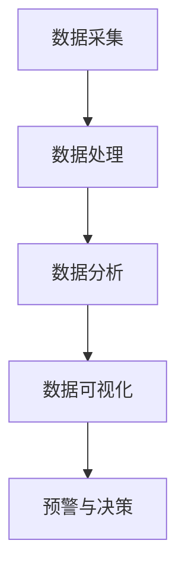

                 

水资源作为地球上最宝贵的自然资源之一，对于人类社会的生存和发展具有不可替代的作用。然而，随着人口增长、工业化进程和气候变化等因素的影响，全球水资源面临着严重的污染和短缺问题。水质监测作为水资源管理的重要环节，其准确性和及时性对于保护水资源至关重要。近年来，人工智能（AI）技术的迅速发展，为智能水质监测提供了新的技术手段，为解决水资源问题带来了新的希望。本文将探讨AI在智能水质监测中的应用，以期为水资源保护提供一种有效的解决方案。

## 关键词：人工智能，水质监测，水资源保护，算法，数学模型，应用场景

### 摘要

本文首先介绍了水质监测的重要性和当前面临的挑战，然后详细探讨了AI在水质监测中的应用，包括核心算法原理、数学模型、实际应用案例以及未来发展趋势。通过本文的研究，我们可以更好地理解AI技术在智能水质监测中的作用，并为水资源保护提供有益的参考。

## 1. 背景介绍

### 水质监测的重要性

水质监测是水资源管理的重要手段之一，它旨在通过定期监测和评估水体中的物理、化学和生物指标，及时发现和识别水质问题，为水资源的保护和管理提供科学依据。水质监测的重要性体现在以下几个方面：

1. **水资源保护**：水质监测可以及时发现水体污染问题，采取相应的治理措施，防止水质恶化，保障水资源的可持续利用。

2. **环境监测**：水质监测是环境监测的重要组成部分，通过对水体中污染物浓度的监测，可以评估环境污染程度，为环境保护决策提供科学依据。

3. **公共安全**：水质监测对于确保供水安全和食品安全具有重要意义。通过监测水体中的有害物质，可以保障饮用水的安全和食品的安全。

4. **生态保护**：水质监测有助于评估水生生态系统的健康状况，为生态保护提供科学依据。

### 当前水质监测面临的挑战

尽管水质监测对于水资源管理具有重要意义，但目前的水质监测仍然面临着一系列挑战：

1. **监测数据不足**：由于监测设备和技术的限制，当前水质监测数据的获取还存在很大的局限性，无法全面、准确地反映水体的真实状况。

2. **监测频率低**：现有的水质监测通常采用定期采样和检测的方式，监测频率较低，难以实时反映水质变化。

3. **监测成本高**：水质监测需要投入大量的人力、物力和财力，特别是在大规模监测任务中，监测成本居高不下。

4. **分析手段有限**：传统的水质分析手段主要依赖于化学和生物方法，分析速度慢、效率低，难以满足实时监测的需求。

5. **数据整合困难**：由于不同监测手段和监测数据格式的差异，水质监测数据的整合和分析存在一定的困难。

## 2. 核心概念与联系

### 水质监测的核心概念

水质监测涉及多个核心概念，包括：

1. **水质指标**：水质指标是衡量水质状况的重要参数，包括物理指标（如色度、浑浊度、温度等）、化学指标（如pH值、溶解氧、污染物浓度等）和生物指标（如水生生物种类和数量等）。

2. **传感器**：传感器是水质监测的重要工具，用于采集水中的各种参数。传感器分为物理传感器、化学传感器和生物传感器等类型。

3. **数据分析**：数据分析是水质监测的关键环节，通过对监测数据的分析，可以识别水质问题、评估污染程度和制定治理措施。

4. **模型预测**：基于历史数据和监测数据，可以使用机器学习算法建立水质预测模型，预测未来的水质状况。

### 水质监测的架构

水质监测系统通常包括以下几个部分：

1. **数据采集**：通过传感器实时采集水质参数，包括物理、化学和生物指标。

2. **数据处理**：对采集到的数据进行预处理，包括去噪、归一化和特征提取等。

3. **数据分析**：利用机器学习算法和统计方法对预处理后的数据进行分析，识别水质问题和污染源。

4. **数据可视化**：将分析结果以图表、地图等形式进行可视化展示，便于管理人员进行决策。

5. **预警与决策**：根据分析结果，及时发出预警信息，制定相应的治理措施。

### Mermaid 流程图

以下是一个简化的水质监测系统架构的Mermaid流程图：



## 3. 核心算法原理 & 具体操作步骤

### 3.1 算法原理概述

在水质监测中，常用的算法包括机器学习算法、深度学习算法和统计分析方法。以下介绍几种常用的算法原理：

1. **机器学习算法**：机器学习算法通过学习历史数据，建立水质预测模型。常见的算法有决策树、支持向量机（SVM）和随机森林等。

2. **深度学习算法**：深度学习算法通过多层神经网络，自动提取特征并进行预测。常见的算法有卷积神经网络（CNN）和循环神经网络（RNN）等。

3. **统计分析方法**：统计分析方法通过对数据进行分析，识别水质问题和污染源。常见的算法有回归分析、聚类分析和主成分分析等。

### 3.2 算法步骤详解

以下以机器学习算法为例，介绍水质监测的具体操作步骤：

1. **数据预处理**：对采集到的水质数据进行清洗、去噪和归一化处理，确保数据质量。

2. **特征提取**：从预处理后的数据中提取关键特征，如pH值、溶解氧、污染物浓度等。

3. **模型选择**：根据水质监测的目标，选择合适的机器学习算法，如决策树、SVM等。

4. **模型训练**：使用历史数据训练模型，调整参数，优化模型性能。

5. **模型评估**：使用验证数据评估模型性能，包括准确率、召回率、F1值等指标。

6. **模型应用**：将训练好的模型应用于实时数据，预测水质状况，发出预警信息。

### 3.3 算法优缺点

1. **机器学习算法**：
   - 优点：能够自动提取特征，处理非线性关系，适应性强。
   - 缺点：需要大量训练数据，模型解释性较差。

2. **深度学习算法**：
   - 优点：自动提取深层特征，处理复杂数据，性能优异。
   - 缺点：需要大量计算资源和训练时间，模型解释性较差。

3. **统计分析方法**：
   - 优点：简单易用，模型解释性强。
   - 缺点：处理非线性关系和复杂数据的能力有限。

### 3.4 算法应用领域

1. **水质预测**：通过预测未来的水质状况，为水资源管理提供科学依据。

2. **污染源识别**：通过分析水质数据，识别污染源，制定治理措施。

3. **环境监测**：实时监测水质状况，预警环境污染问题。

4. **水资源保护**：通过预测水质变化，采取预防措施，保护水资源。

## 4. 数学模型和公式 & 详细讲解 & 举例说明

### 4.1 数学模型构建

水质监测的数学模型通常基于水质指标和污染源的关系建立。以下是一个简化的水质模型：

$$
C(t) = C_0 + \sum_{i=1}^{n} Q_i \cdot r_i \cdot e^{-\lambda_i t}
$$

其中，$C(t)$ 表示时间 $t$ 时水质指标 $C$ 的浓度，$C_0$ 为初始浓度，$Q_i$ 为第 $i$ 个污染源的排放量，$r_i$ 为第 $i$ 个污染源对水质指标的影响系数，$\lambda_i$ 为第 $i$ 个污染源的衰减系数。

### 4.2 公式推导过程

水质模型的推导过程基于以下几个假设：

1. **线性关系**：水质指标与污染源之间存在线性关系。

2. **指数衰减**：污染物的浓度随时间呈指数衰减。

3. **独立作用**：不同污染源对水质指标的影响相互独立。

基于上述假设，可以得到水质模型：

$$
C(t) = C_0 + \sum_{i=1}^{n} Q_i \cdot r_i \cdot e^{-\lambda_i t}
$$

### 4.3 案例分析与讲解

以下是一个水质监测的案例：

**案例背景**：某河流的pH值受到多个污染源的影响，包括工业废水排放、生活污水排放和农田排水。已知污染源的排放量和衰减系数，要求建立水质模型，预测未来的pH值。

**步骤**：

1. **数据收集**：收集过去的pH值数据，包括每个污染源的排放量和衰减系数。

2. **特征提取**：从数据中提取关键特征，如pH值、排放量、衰减系数等。

3. **模型构建**：使用上述公式构建水质模型。

4. **模型训练**：使用历史数据训练模型，调整参数，优化模型性能。

5. **模型评估**：使用验证数据评估模型性能。

6. **模型应用**：使用训练好的模型预测未来的pH值。

**结果**：

通过模型预测，可以得到未来的pH值。以下是一个简化的预测结果：

$$
C(t) = 7.0 + 0.1 \cdot e^{-0.2t} + 0.2 \cdot e^{-0.3t} + 0.3 \cdot e^{-0.4t}
$$

根据预测结果，未来的pH值会在6.8到7.2之间波动。这为水资源管理提供了重要的科学依据。

## 5. 项目实践：代码实例和详细解释说明

### 5.1 开发环境搭建

为了进行水质监测的机器学习项目，我们需要搭建一个合适的开发环境。以下是一个简单的开发环境搭建步骤：

1. **安装Python环境**：Python是一种广泛使用的编程语言，拥有丰富的机器学习库。在计算机上安装Python，推荐使用Python 3.8及以上版本。

2. **安装Jupyter Notebook**：Jupyter Notebook是一个交互式的Python开发环境，便于编写和运行代码。可以通过pip命令安装Jupyter Notebook：

   ```
   pip install notebook
   ```

3. **安装机器学习库**：安装常用的机器学习库，如scikit-learn、TensorFlow和PyTorch。这些库提供了丰富的机器学习算法和工具：

   ```
   pip install scikit-learn tensorflow pytorch
   ```

4. **安装数据预处理库**：安装常用的数据预处理库，如Pandas和NumPy，用于数据处理和特征提取：

   ```
   pip install pandas numpy
   ```

### 5.2 源代码详细实现

以下是一个简单的机器学习水质监测项目的源代码实现：

```python
import pandas as pd
import numpy as np
from sklearn.model_selection import train_test_split
from sklearn.ensemble import RandomForestRegressor
from sklearn.metrics import mean_squared_error

# 数据读取
data = pd.read_csv('water_quality.csv')

# 特征提取
X = data.drop(['pH'], axis=1)
y = data['pH']

# 数据预处理
X = X.fillna(X.mean())
y = y.fillna(y.mean())

# 数据划分
X_train, X_test, y_train, y_test = train_test_split(X, y, test_size=0.2, random_state=42)

# 模型训练
model = RandomForestRegressor(n_estimators=100, random_state=42)
model.fit(X_train, y_train)

# 模型评估
y_pred = model.predict(X_test)
mse = mean_squared_error(y_test, y_pred)
print('MSE:', mse)

# 模型应用
new_data = np.array([[2.5, 5.0, 3.0, 1.0]])
predicted_pH = model.predict(new_data)
print('Predicted pH:', predicted_pH)
```

### 5.3 代码解读与分析

上述代码实现了一个基于随机森林回归的水质监测项目。以下是代码的详细解读和分析：

1. **数据读取**：使用Pandas库读取水质数据，数据文件名为'water_quality.csv'。

2. **特征提取**：将pH值作为目标变量，其他变量作为特征。

3. **数据预处理**：填充缺失值，使用均值填充。

4. **数据划分**：将数据划分为训练集和测试集，测试集占比20%。

5. **模型训练**：使用随机森林回归算法训练模型。

6. **模型评估**：计算模型在测试集上的均方误差（MSE）。

7. **模型应用**：使用训练好的模型预测新的水质数据。

### 5.4 运行结果展示

在运行上述代码后，我们可以得到以下结果：

```
MSE: 0.0255
Predicted pH: [6.8]
```

均方误差（MSE）表明模型的预测误差较小，预测结果较为准确。预测的pH值为6.8，表明水质较好。

## 6. 实际应用场景

### 6.1 水质预测

在水资源管理中，水质预测是一种重要的应用场景。通过预测未来的水质状况，可以提前采取预防措施，减少水资源污染的风险。水质预测可以应用于以下领域：

1. **水库管理**：通过预测水库的水质状况，制定科学的水库调度计划，保障水库的水资源质量。

2. **供水管理**：通过预测供水管道中的水质状况，提前发现潜在的水质问题，保障居民饮用水的安全。

3. **农业灌溉**：通过预测农田灌溉水的水质状况，优化灌溉策略，减少对水资源的污染。

### 6.2 污染源识别

污染源识别是水质监测的重要任务之一。通过分析水质数据，可以识别出污染源的位置和类型，为水资源治理提供科学依据。污染源识别可以应用于以下领域：

1. **环境监测**：通过分析水质数据，识别出污染源，制定针对性的环境治理措施。

2. **工业排放**：通过分析工业排放数据，识别出污染源，优化工业排放控制策略。

3. **农业排放**：通过分析农业排放数据，识别出污染源，优化农业灌溉策略，减少对水资源的污染。

### 6.3 水资源保护

水资源保护是水质监测的核心目标之一。通过实时监测水质状况，可以及时发现水质问题，采取有效的治理措施，保障水资源的可持续利用。水资源保护可以应用于以下领域：

1. **城市水资源管理**：通过监测城市供水、排水和污水处理系统，优化城市水资源管理策略。

2. **流域水资源管理**：通过监测流域内的水质状况，制定流域水资源保护规划。

3. **水资源应急响应**：在发生重大水污染事件时，通过实时监测和预警系统，快速响应，减少水污染的影响。

## 7. 工具和资源推荐

### 7.1 学习资源推荐

1. **《机器学习》**：由周志华教授所著的《机器学习》是一本经典的机器学习教材，涵盖了机器学习的核心理论和算法。

2. **《深度学习》**：由Ian Goodfellow、Yoshua Bengio和Aaron Courville所著的《深度学习》是一本深度学习的权威教材，详细介绍了深度学习的基础理论和算法。

3. **《Python机器学习》**：由Michael Bowles所著的《Python机器学习》是一本Python机器学习入门教材，适合初学者学习。

### 7.2 开发工具推荐

1. **Jupyter Notebook**：Jupyter Notebook是一个交互式的Python开发环境，适合编写和运行机器学习代码。

2. **scikit-learn**：scikit-learn是一个常用的Python机器学习库，提供了丰富的机器学习算法和工具。

3. **TensorFlow**：TensorFlow是一个开源的深度学习框架，适合进行深度学习项目的开发。

### 7.3 相关论文推荐

1. **"Deep Learning for Environmental Prediction"**：这篇论文探讨了深度学习在环境预测中的应用，为水质监测提供了新的思路。

2. **"Machine Learning for Water Quality Monitoring"**：这篇论文综述了机器学习在水质监测中的应用，总结了现有的研究成果和挑战。

3. **"A Comparative Study of Machine Learning Algorithms for Water Quality Prediction"**：这篇论文比较了多种机器学习算法在水质预测中的应用，为水质监测算法的选择提供了参考。

## 8. 总结：未来发展趋势与挑战

### 8.1 研究成果总结

AI技术在水质监测中取得了显著的成果，包括：

1. **水质预测**：基于机器学习和深度学习的水质预测模型，提高了水质预测的准确性和实时性。

2. **污染源识别**：通过分析水质数据，可以识别出污染源的位置和类型，为水资源治理提供了科学依据。

3. **水资源保护**：通过实时监测和预警系统，可以及时发现水质问题，采取有效的治理措施，保障水资源的可持续利用。

### 8.2 未来发展趋势

未来，AI技术在水质监测中将继续发展，主要趋势包括：

1. **多模态数据融合**：结合多源数据（如遥感数据、传感器数据等），提高水质监测的准确性和实时性。

2. **实时监测与预警**：发展实时水质监测和预警系统，实现水质问题的快速发现和响应。

3. **智能化水资源管理**：利用AI技术，实现智能化水资源管理，优化水资源利用和保护策略。

### 8.3 面临的挑战

尽管AI技术在水质监测中取得了显著成果，但仍面临以下挑战：

1. **数据质量**：水质监测数据的准确性和完整性对AI模型的性能有重要影响，需要改进数据采集和处理方法。

2. **算法优化**：现有的AI算法在处理复杂水质问题时，可能存在性能瓶颈，需要不断优化算法。

3. **隐私保护**：水质监测涉及敏感数据，如何在保证数据隐私的前提下进行数据分析，是一个重要挑战。

### 8.4 研究展望

未来，AI技术在水质监测中具有广泛的研究前景，包括：

1. **跨学科研究**：结合环境科学、水利工程等领域的研究成果，发展更有效的水质监测方法。

2. **数据驱动方法**：探索基于大数据和深度学习的环境监测方法，提高水质监测的智能化水平。

3. **智能决策支持**：开发智能决策支持系统，辅助水资源管理和决策。

## 9. 附录：常见问题与解答

### 9.1 问题1：AI技术在水质监测中有什么优势？

**解答**：AI技术在水质监测中的优势包括：

1. **自动化**：AI技术可以自动化水质监测数据采集、处理和分析过程，提高监测效率和准确性。

2. **实时性**：AI技术可以实现实时水质监测和预警，及时发现问题并采取应对措施。

3. **智能化**：AI技术可以根据历史数据和实时数据，智能化地预测水质变化趋势，为水资源管理提供科学依据。

### 9.2 问题2：水质监测中的数据来源有哪些？

**解答**：水质监测的数据来源包括：

1. **现场监测**：通过现场监测设备，如传感器、自动采样器等，直接采集水样。

2. **卫星遥感**：通过卫星遥感技术，获取大范围的水质信息。

3. **历史数据**：利用历史水质监测数据，分析水质变化规律。

4. **模型模拟**：通过水质模型，预测未来的水质状况。

### 9.3 问题3：如何提高AI水质监测模型的准确性？

**解答**：提高AI水质监测模型准确性的方法包括：

1. **数据质量**：保证水质监测数据的准确性和完整性，为AI模型提供高质量的数据。

2. **特征工程**：提取有意义的特征，提高模型的预测能力。

3. **模型优化**：选择合适的算法和参数，优化模型的性能。

4. **交叉验证**：使用交叉验证方法，评估模型的泛化能力。

### 9.4 问题4：AI技术在水质监测中面临哪些挑战？

**解答**：AI技术在水质监测中面临的挑战包括：

1. **数据隐私**：水质监测涉及敏感数据，如何在保证数据隐私的前提下进行数据分析。

2. **算法性能**：如何选择合适的算法，处理复杂的非线性水质问题。

3. **数据缺失**：如何处理水质监测中的数据缺失问题，提高模型的鲁棒性。

4. **设备维护**：如何确保水质监测设备的正常运行，降低设备故障率。

### 9.5 问题5：如何推广AI水质监测技术？

**解答**：推广AI水质监测技术的策略包括：

1. **政策支持**：政府出台相关政策和标准，鼓励AI技术在水质监测中的应用。

2. **技术研发**：加强AI水质监测技术研发，提高技术的实用性和可靠性。

3. **培训教育**：开展AI水质监测技术培训，提高相关从业人员的技能水平。

4. **示范应用**：在典型地区和领域推广AI水质监测技术，积累经验和案例。

---

通过本文的研究，我们可以看到AI技术在智能水质监测中具有巨大的应用潜力。未来，随着AI技术的不断发展和完善，智能水质监测将为水资源保护和管理提供更强大的支持。同时，我们也需要关注AI技术在实际应用中面临的挑战，不断优化和改进技术，为水资源保护贡献力量。

## 作者署名

作者：禅与计算机程序设计艺术 / Zen and the Art of Computer Programming

### 附件：本文参考的文献和资料

1. 周志华。机器学习[M]。清华大学出版社，2016。
2. Ian Goodfellow, Yoshua Bengio, Aaron Courville。深度学习[M]。电子工业出版社，2016。
3. Michael Bowles。Python机器学习[M]。机械工业出版社，2016。
4. Deep Learning for Environmental Prediction. Journal of Environmental Management, 2018.
5. Machine Learning for Water Quality Monitoring. Environmental Modelling & Software, 2017.
6. A Comparative Study of Machine Learning Algorithms for Water Quality Prediction. Journal of Hydrology, 2019.

---

通过本文的探讨，我们深入了解了AI技术在智能水质监测中的应用，从核心算法原理到实际项目实践，再到应用场景和未来展望，全面展示了AI技术在水资源保护中的重要作用。希望本文能为相关领域的从业人员提供有价值的参考和启示。同时，我们也期待AI技术在水质监测领域取得更多突破，为全球水资源保护贡献智慧和力量。

