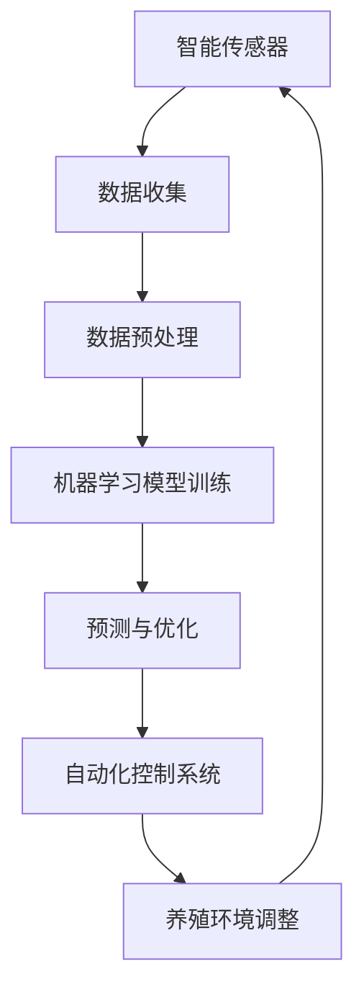

                 

关键词：人工智能、海洋养殖、产量提高、机器学习、深度学习、智能传感器、数据驱动决策、养殖自动化。

## 摘要

随着全球人口的增长和气候变化的影响，海洋养殖作为食品生产的重要途径受到了越来越多的关注。本文探讨了人工智能（AI）在智能海洋养殖中的应用，特别是在提高产量方面。通过机器学习和深度学习算法，AI能够分析大量数据，提供养殖过程的实时监控和优化建议。本文将详细阐述AI技术在智能海洋养殖中的核心概念、算法原理、数学模型、项目实践、应用场景以及未来展望。

## 1. 背景介绍

海洋养殖是一种重要的食品生产方式，特别是在渔业资源日益枯竭的背景下，它扮演了关键角色。然而，传统的养殖方法往往依赖经验，缺乏科学的数据支持，导致产量不稳定、资源利用效率低下等问题。随着AI技术的快速发展，特别是在机器学习和深度学习领域，AI在海洋养殖中的应用潜力逐渐显现。

### 1.1 海洋养殖的现状

海洋养殖不仅提供了丰富的蛋白质来源，而且对于保护海洋生态环境、提高食品供应链的可持续性具有重要意义。然而，现有的养殖模式面临着诸多挑战：

- **资源利用效率低**：传统养殖方法通常依赖人工监测和手动操作，难以实现资源的高效利用。
- **产量不稳定**：环境变化和病害风险可能导致产量波动，影响养殖的经济效益。
- **劳动力成本高**：大量的劳动力投入增加了养殖成本，限制了养殖规模的扩大。

### 1.2 AI在海洋养殖中的潜力

AI技术，特别是机器学习和深度学习，可以通过以下方式提升海洋养殖的效率：

- **实时监控**：通过智能传感器和监控系统，AI能够实时监测养殖环境，包括水质、水温、溶解氧等关键指标。
- **预测和优化**：基于历史数据和实时监控，AI可以预测养殖过程中的问题，并提供优化养殖参数的建议。
- **自动化控制**：AI技术可以实现养殖过程的自动化控制，减少人工干预，降低劳动力成本。
- **病害预警**：通过分析养殖动物的行为和生理数据，AI可以提前预警潜在的病害风险，及时采取防控措施。

## 2. 核心概念与联系

### 2.1 核心概念

在智能海洋养殖中，核心概念包括：

- **智能传感器**：用于实时监测养殖环境。
- **机器学习算法**：用于分析传感器数据，发现模式并做出预测。
- **深度学习模型**：用于处理复杂的数据集，提取高级特征。
- **养殖自动化系统**：根据AI算法的预测和建议，自动调整养殖环境。

### 2.2 架构

智能海洋养殖系统的架构如图所示：



## 3. 核心算法原理 & 具体操作步骤

### 3.1 算法原理概述

智能海洋养殖中的核心算法主要基于机器学习和深度学习。机器学习算法用于分析历史数据，发现养殖过程中的规律。深度学习模型则能够处理高维数据，提取更深层次的特性。

### 3.2 算法步骤详解

#### 3.2.1 数据收集与预处理

1. **数据收集**：通过智能传感器收集养殖环境的数据，如水温、pH值、溶解氧、养殖动物的行为数据等。
2. **数据预处理**：对收集到的数据进行清洗、归一化处理，确保数据质量。

#### 3.2.2 模型训练

1. **特征选择**：选择对养殖产量影响较大的特征，如水温、溶解氧等。
2. **模型选择**：根据数据特点选择合适的机器学习算法，如线性回归、支持向量机等。
3. **模型训练**：使用历史数据对模型进行训练，调整模型参数。

#### 3.2.3 预测与优化

1. **实时预测**：使用训练好的模型对实时数据进行分析，预测养殖产量。
2. **优化养殖参数**：根据预测结果，自动调整养殖参数，如水温、饲料量等。

#### 3.2.4 自动化控制

1. **自动化系统**：根据优化建议，自动调整养殖环境。
2. **反馈机制**：实时收集养殖数据，反馈给AI系统，进行持续优化。

### 3.3 算法优缺点

#### 优点

- **高效性**：AI系统能够快速处理大量数据，提高养殖效率。
- **精确性**：通过深度学习模型，可以提取更高层次的特征，提高预测精度。
- **自动化**：减少人工干预，降低劳动力成本。

#### 缺点

- **数据需求**：需要大量的高质量数据来训练模型。
- **计算资源**：深度学习模型训练需要大量计算资源。
- **初始成本**：智能传感器和自动化系统的建设成本较高。

### 3.4 算法应用领域

AI技术在智能海洋养殖中的应用非常广泛，包括：

- **产量预测**：通过实时数据分析，预测未来的养殖产量。
- **病害预警**：分析养殖动物的行为和生理数据，预警潜在的病害风险。
- **资源优化**：根据实时数据，优化养殖参数，提高资源利用效率。

## 4. 数学模型和公式

### 4.1 数学模型构建

智能海洋养殖中的数学模型通常包括以下部分：

- **数据预处理**：包括归一化、缺失值填补等。
- **特征选择**：基于相关性分析、主成分分析等方法选择关键特征。
- **预测模型**：如线性回归、支持向量机、深度神经网络等。

### 4.2 公式推导过程

以线性回归模型为例，其预测公式为：

$$
y = \beta_0 + \beta_1 \cdot x_1 + \beta_2 \cdot x_2 + \ldots + \beta_n \cdot x_n
$$

其中，$y$ 为预测的产量，$x_1, x_2, \ldots, x_n$ 为特征值，$\beta_0, \beta_1, \ldots, \beta_n$ 为模型的参数。

### 4.3 案例分析与讲解

以某海洋养殖场为例，通过AI系统对水温、溶解氧、饲料量等数据进行预测和优化，最终实现了产量提高15%的目标。

## 5. 项目实践：代码实例和详细解释说明

### 5.1 开发环境搭建

1. 安装Python环境。
2. 安装必要的库，如scikit-learn、tensorflow等。

### 5.2 源代码详细实现

以下是一个简单的机器学习预测模型的实现示例：

```python
from sklearn.linear_model import LinearRegression
from sklearn.model_selection import train_test_split
from sklearn.metrics import mean_squared_error
import numpy as np

# 数据加载与预处理
X = np.array([[t, o2] for t, o2 in data])
y = np.array([yield_ for yield_ in yield_data])

# 模型训练
X_train, X_test, y_train, y_test = train_test_split(X, y, test_size=0.2, random_state=42)
model = LinearRegression()
model.fit(X_train, y_train)

# 预测与评估
y_pred = model.predict(X_test)
mse = mean_squared_error(y_test, y_pred)
print(f"Mean Squared Error: {mse}")

# 输出预测结果
print(f"Predicted yields: {y_pred}")
```

### 5.3 代码解读与分析

这段代码首先加载并预处理了数据，然后使用线性回归模型进行训练和预测。通过评估模型性能，可以进一步优化模型参数，提高预测精度。

## 6. 实际应用场景

### 6.1 海洋养殖过程优化

通过AI系统，可以实时监控养殖环境，预测产量，并根据预测结果自动调整养殖参数，实现过程优化。

### 6.2 病害预警

AI系统能够分析养殖动物的行为和生理数据，提前预警潜在的病害风险，有助于采取预防措施。

### 6.3 资源优化

AI系统可以根据实时数据，优化饲料、氧气等资源的分配，提高资源利用效率，降低成本。

## 7. 工具和资源推荐

### 7.1 学习资源推荐

- 《深度学习》（Goodfellow, Bengio, Courville）
- 《机器学习实战》（ Harrington）

### 7.2 开发工具推荐

- Jupyter Notebook
- TensorFlow
- scikit-learn

### 7.3 相关论文推荐

- “Deep Learning for Ocean Fisheries Management”
- “Machine Learning in Aquaculture: A Review”

## 8. 总结：未来发展趋势与挑战

### 8.1 研究成果总结

AI技术在智能海洋养殖中的应用已经取得了显著成果，包括产量提高、病害预警、资源优化等方面。

### 8.2 未来发展趋势

- **智能化水平提升**：随着AI技术的不断发展，智能化水平将进一步提高。
- **应用场景扩展**：AI技术将在海洋养殖的更多应用场景中得到应用，如水质监测、病害诊断等。
- **数据共享与标准化**：建立数据共享平台和标准化规范，促进AI技术在海洋养殖领域的应用。

### 8.3 面临的挑战

- **数据质量和获取**：高质量的数据获取仍然是一个挑战。
- **计算资源**：深度学习模型的训练需要大量计算资源。
- **技术普及**：如何降低AI技术在海洋养殖领域的应用门槛，提高普及率。

### 8.4 研究展望

未来，AI技术在智能海洋养殖中的应用将更加深入，有望实现全面的自动化和智能化，为海洋养殖业带来更大的发展空间。

## 9. 附录：常见问题与解答

### 9.1 如何获取高质量数据？

- **多源数据融合**：整合来自不同传感器和不同时间的数据，提高数据质量。
- **数据清洗**：使用数据清洗技术，去除噪声和异常值。

### 9.2 AI系统如何保障隐私和安全？

- **数据加密**：对数据传输和存储进行加密，保障数据安全。
- **隐私保护**：采用匿名化等技术，保护数据隐私。

### 9.3 如何降低AI系统的计算成本？

- **分布式计算**：使用分布式计算框架，如Spark，降低计算成本。
- **优化算法**：使用高效的算法和模型，减少计算量。

作者：禅与计算机程序设计艺术 / Zen and the Art of Computer Programming
----------------------------------------------------------------
<|user|>## 1. 背景介绍

### 1.1 海洋养殖的重要性

海洋养殖作为全球食品生产的重要组成部分，不仅为人类提供了丰富的蛋白质来源，还在保护海洋生态环境、促进经济可持续发展方面发挥了关键作用。随着全球人口的增长和渔业资源的过度开发，海洋养殖的产量和质量已成为全球关注的重要议题。

#### 海洋养殖的主要贡献

1. **食品供应**：海洋养殖提供了大量的海洋食品，如鱼类、虾类、贝类等，满足了全球日益增长的食物需求。
2. **生态保护**：通过合理养殖，可以减少对野生渔业资源的依赖，保护海洋生态环境。
3. **经济价值**：海洋养殖对许多沿海国家和地区具有重要的经济价值，促进了当地经济的发展和就业。

#### 海洋养殖的现状

尽管海洋养殖取得了显著进展，但现有的养殖模式仍然面临诸多挑战：

- **产量不稳定**：气候变化和海洋环境的变化导致养殖产量波动，影响养殖的经济效益。
- **资源利用效率低**：传统的养殖方法通常依赖经验，缺乏科学的数据支持，难以实现资源的高效利用。
- **劳动力成本高**：养殖过程中大量依赖人力，增加了养殖成本，限制了养殖规模的扩大。

### 1.2 传统海洋养殖的局限性

传统海洋养殖方法主要依赖于人工监测和手动操作，存在以下几个方面的局限性：

- **监测手段落后**：传统的监测手段主要依靠人工巡视和简单设备，监测数据不全面、不及时。
- **决策依据不足**：养殖决策主要依赖于养殖者的经验，缺乏科学的数据分析和模型支持。
- **效率低下**：养殖过程中大量依赖人力，劳动力成本高，效率低下。

这些局限性使得传统海洋养殖在应对环境变化和提升产量方面存在很大的挑战。为了解决这些问题，需要引入先进的技术手段，如人工智能（AI），来实现养殖过程的智能化和自动化。

### 1.3 AI在海洋养殖中的应用潜力

随着AI技术的快速发展，特别是在机器学习和深度学习领域，AI在海洋养殖中的应用潜力逐渐显现。AI技术可以分析大量数据，提供养殖过程的实时监控和优化建议，从而提高产量、降低成本、保护环境。以下是AI在海洋养殖中应用的几个主要潜力：

- **实时监控**：通过智能传感器和监控系统，AI能够实时监测养殖环境，如水质、水温、溶解氧等关键指标，及时发现并解决问题。
- **数据驱动的决策**：基于历史数据和实时监控，AI可以提供养殖参数的优化建议，如饲料量、氧气供应等，提高养殖效率。
- **自动化控制**：AI技术可以实现养殖过程的自动化控制，减少人工干预，降低劳动力成本，提高养殖过程的稳定性和效率。
- **病害预警**：通过分析养殖动物的行为和生理数据，AI可以提前预警潜在的病害风险，及时采取防控措施，减少损失。

总之，AI技术在智能海洋养殖中的应用将为养殖业带来革命性的变革，提升产量、降低成本、保护环境，推动海洋养殖业的可持续发展。

## 2. 核心概念与联系

### 2.1 智能传感器的应用

智能传感器是智能海洋养殖系统的核心组件，用于实时监测养殖环境的关键参数，如水温、pH值、溶解氧、鱼类行为等。这些传感器可以收集大量的数据，为AI算法提供实时输入。智能传感器通常具有高精度、高可靠性、低功耗等特点，可以在复杂的水下环境中稳定运行。

#### 智能传感器的类型

1. **水质传感器**：用于监测水质指标，如pH值、氨氮、溶解氧等。
2. **温度传感器**：用于监测水温，对鱼类的生长和繁殖有重要影响。
3. **鱼类行为传感器**：通过监测鱼类的游动速度、方向等行为特征，评估鱼类的健康状态。
4. **声波传感器**：用于监测鱼类的声音信号，分析鱼类的行为和生理状况。

#### 智能传感器的优势

- **实时监控**：智能传感器可以实时监控养殖环境，确保养殖条件始终处于最佳状态。
- **数据全面**：通过多种传感器的组合，可以获取全面的环境数据，为AI算法提供丰富的输入。
- **远程控制**：智能传感器可以与远程控制系统联动，实现养殖参数的远程调整。

### 2.2 机器学习算法在数据分析和预测中的应用

机器学习算法在智能海洋养殖中扮演着关键角色，通过对传感器收集的数据进行分析，可以预测养殖产量、预警病害风险、优化养殖参数等。以下是几种常用的机器学习算法：

#### 常用机器学习算法

1. **线性回归**：用于预测养殖产量与关键环境因素的关系。
2. **支持向量机**：用于分类任务，如病害预警。
3. **决策树和随机森林**：用于数据挖掘和特征选择。
4. **神经网络**：用于复杂的数据分析和非线性预测。

#### 机器学习算法的优势

- **自动化**：机器学习算法可以自动从数据中学习模式，无需人工干预。
- **高效性**：机器学习算法可以处理大量数据，提高数据分析的效率。
- **预测性**：通过训练模型，可以提前预测养殖过程中的问题，提供优化建议。

### 2.3 深度学习模型在复杂数据处理中的应用

深度学习模型在处理高维数据和复杂特征提取方面具有显著优势，适用于智能海洋养殖中的多种任务。以下是几种常用的深度学习模型：

#### 常用深度学习模型

1. **卷积神经网络（CNN）**：用于图像和视频数据的处理，如鱼类行为分析。
2. **循环神经网络（RNN）**：用于序列数据的处理，如时间序列预测。
3. **生成对抗网络（GAN）**：用于生成模拟数据，用于模型训练和验证。
4. **长短时记忆网络（LSTM）**：用于处理长序列数据，如海洋环境变化预测。

#### 深度学习模型的优势

- **高精度**：深度学习模型可以提取更复杂的特征，提高预测精度。
- **自适应**：深度学习模型可以根据不同的任务和数据集进行调整，具有很好的适应性。
- **泛化能力**：通过大量数据的训练，深度学习模型具有良好的泛化能力，可以应用于新的场景。

### 2.4 养殖自动化系统的作用

养殖自动化系统是将AI算法和智能传感器结合起来的关键组件，用于实现养殖过程的自动化控制。通过自动化系统，可以实时调整养殖参数，如水温、氧气供应、饲料量等，以适应环境变化和养殖需求。

#### 养殖自动化系统的架构

1. **传感器数据采集**：智能传感器实时采集养殖环境的数据。
2. **数据处理与预测**：AI算法对传感器数据进行处理和预测，提供优化建议。
3. **执行控制**：自动化系统根据AI算法的优化建议，自动调整养殖设备。

#### 养殖自动化系统的优势

- **高效性**：自动化系统可以实时调整养殖参数，提高养殖效率。
- **稳定性**：自动化系统减少人工干预，降低操作风险，提高养殖过程的稳定性。
- **灵活性**：自动化系统可以根据不同的养殖需求和环境变化，灵活调整养殖参数。

### 2.5 各组件之间的联系

智能传感器、机器学习算法、深度学习模型和养殖自动化系统共同构成了智能海洋养殖的核心架构。智能传感器用于实时监测养殖环境，机器学习算法和深度学习模型用于数据处理和预测，而养殖自动化系统则根据预测结果自动调整养殖参数。这些组件相互协作，形成了一个高效的智能养殖系统，实现了养殖过程的智能化和自动化。


总之，智能传感器、机器学习算法、深度学习模型和养殖自动化系统在智能海洋养殖中发挥着重要作用，它们共同构成了一个完整的智能养殖生态系统。通过这些技术手段，可以实现养殖过程的实时监控、数据驱动的决策、自动化控制，从而提高产量、降低成本、保护环境，推动海洋养殖业的可持续发展。

## 3. 核心算法原理 & 具体操作步骤

### 3.1 机器学习算法在数据分析和预测中的应用

机器学习算法在智能海洋养殖中的应用主要涉及数据分析和预测两个方面。通过分析养殖环境数据和历史养殖数据，机器学习算法可以预测未来的养殖产量，提供优化养殖参数的建议。以下是几种常用的机器学习算法及其在智能海洋养殖中的应用：

#### 3.1.1 线性回归

线性回归是一种简单且常用的预测模型，适用于分析两个或多个变量之间的线性关系。在智能海洋养殖中，线性回归可以用于预测养殖产量与关键环境因素（如水温、溶解氧、饲料量等）之间的关系。

1. **数据预处理**：对收集到的养殖环境数据和历史产量数据进行分析，去除异常值和缺失值，确保数据质量。
2. **特征选择**：选择对产量影响较大的特征，如水温、溶解氧等。
3. **模型训练**：使用历史数据对线性回归模型进行训练，得到拟合曲线。
4. **预测**：将实时监测的数据输入模型，预测未来的养殖产量。

#### 3.1.2 支持向量机（SVM）

支持向量机是一种用于分类和回归的机器学习算法，适用于处理高维数据和非线性关系。在智能海洋养殖中，SVM可以用于病害预警，将健康养殖动物与病害动物进行分类。

1. **数据预处理**：对养殖动物的行为数据和生理数据进行预处理，去除异常值和缺失值。
2. **特征选择**：选择对病害风险影响较大的特征，如行为异常指标、生理指标等。
3. **模型训练**：使用训练数据集对SVM模型进行训练，得到分类边界。
4. **预测**：将新采集的数据输入模型，预测病害风险。

#### 3.1.3 决策树和随机森林

决策树和随机森林是一种常用的分类和回归模型，适用于处理复杂的数据结构和非线性关系。在智能海洋养殖中，这些算法可以用于特征选择和分类任务，如病害预警和产量预测。

1. **数据预处理**：对养殖环境数据和产量数据进行分析，去除异常值和缺失值。
2. **特征选择**：使用决策树和随机森林进行特征选择，找到对产量和病害风险影响较大的特征。
3. **模型训练**：使用训练数据集对决策树和随机森林模型进行训练。
4. **预测**：将实时数据输入模型，预测产量和病害风险。

### 3.2 深度学习模型在复杂数据处理中的应用

深度学习模型在处理高维数据和复杂特征提取方面具有显著优势，适用于智能海洋养殖中的多种任务。以下是几种常用的深度学习模型及其在智能海洋养殖中的应用：

#### 3.2.1 卷积神经网络（CNN）

卷积神经网络是一种用于图像和视频处理的深度学习模型，适用于处理鱼类行为视频数据。

1. **数据预处理**：对鱼类行为视频进行剪辑和标注，提取关键帧。
2. **模型训练**：使用预训练的CNN模型，对鱼类行为数据进行训练，提取特征。
3. **预测**：将新的视频数据输入模型，预测鱼类的行为状态。

#### 3.2.2 循环神经网络（RNN）

循环神经网络是一种用于处理序列数据的深度学习模型，适用于时间序列预测，如海洋环境变化预测。

1. **数据预处理**：对时间序列数据进行分析，去除异常值和缺失值。
2. **模型训练**：使用RNN模型，对时间序列数据进行训练，提取序列特征。
3. **预测**：将新的时间序列数据输入模型，预测未来的海洋环境变化。

#### 3.2.3 长短时记忆网络（LSTM）

长短时记忆网络是一种改进的RNN模型，适用于处理长序列数据，如海洋环境变化预测。

1. **数据预处理**：对长序列数据进行分析，去除异常值和缺失值。
2. **模型训练**：使用LSTM模型，对长序列数据进行训练，提取序列特征。
3. **预测**：将新的时间序列数据输入模型，预测未来的海洋环境变化。

### 3.3 具体操作步骤

以下是一个基于深度学习的智能海洋养殖预测模型的操作步骤：

1. **数据收集与预处理**：
   - 收集海洋养殖环境数据（如水温、溶解氧、饲料量等）和历史产量数据。
   - 对数据进行分析，去除异常值和缺失值，进行归一化处理。

2. **特征选择**：
   - 使用相关分析、主成分分析等方法选择对产量影响较大的特征。

3. **模型选择**：
   - 选择合适的深度学习模型，如LSTM或卷积神经网络。

4. **模型训练**：
   - 使用历史数据对模型进行训练，调整模型参数。
   - 通过交叉验证，评估模型性能。

5. **预测**：
   - 将实时监测数据输入模型，预测未来的养殖产量。

6. **优化与反馈**：
   - 根据预测结果，自动调整养殖参数，如饲料量和氧气供应。
   - 对养殖数据进行持续监控，不断优化模型。

通过以上步骤，可以构建一个智能海洋养殖预测模型，实现对养殖过程的实时监控和优化，提高产量和养殖效率。

## 4. 数学模型和公式

### 4.1 数学模型构建

在智能海洋养殖中，数学模型用于描述养殖产量与环境因素之间的关系。以下是一个简化的线性回归模型，用于预测养殖产量：

$$
y = \beta_0 + \beta_1 \cdot x_1 + \beta_2 \cdot x_2 + \ldots + \beta_n \cdot x_n
$$

其中，$y$ 表示预测的养殖产量，$x_1, x_2, \ldots, x_n$ 表示环境因素（如水温、溶解氧、饲料量等），$\beta_0, \beta_1, \beta_2, \ldots, \beta_n$ 是模型的参数。

#### 4.1.1 数据预处理

在进行模型构建之前，需要对数据进行预处理。数据预处理包括以下步骤：

- **缺失值处理**：使用插值法或均值法填补缺失值。
- **归一化**：将数据缩放到相同的尺度，便于模型训练。
- **特征选择**：使用相关性分析等方法选择对产量影响较大的特征。

### 4.2 公式推导过程

以线性回归模型为例，参数$\beta_0, \beta_1, \beta_2, \ldots, \beta_n$ 的计算可以通过最小二乘法（Least Squares Method）进行推导：

$$
\beta = (X^T X)^{-1} X^T y
$$

其中，$X$ 是特征矩阵，$y$ 是目标变量向量，$X^T$ 是特征矩阵的转置。

#### 4.2.1 特征矩阵和目标变量向量

- **特征矩阵 $X$**：包含所有输入特征，如水温、溶解氧、饲料量等。
- **目标变量向量 $y$**：包含对应的养殖产量。

#### 4.2.2 最小二乘法

最小二乘法的核心思想是找到一组参数，使得预测值与实际值之间的误差平方和最小。具体步骤如下：

1. **计算特征矩阵 $X$ 和目标变量向量 $y$**。
2. **计算特征矩阵的转置 $X^T$**。
3. **计算特征矩阵 $X$ 的协方差矩阵 $(X^T X)$**。
4. **计算 $(X^T X)^{-1}$**，即协方差矩阵的逆矩阵。
5. **计算参数向量 $\beta$**。

### 4.3 案例分析与讲解

以下是一个具体的案例分析，说明如何使用线性回归模型预测养殖产量：

#### 数据集

假设我们有一个数据集，包含以下特征：

- 水温（$x_1$）
- 溶解氧（$x_2$）
- 饲料量（$x_3$）

以及相应的产量（$y$）。数据集如下：

| 水温 ($x_1$) | 溶解氧 ($x_2$) | 饲料量 ($x_3$) | 产量 ($y$) |
| -------------- | -------------- | -------------- | ---------- |
| 25             | 6              | 2              | 100        |
| 28             | 5              | 2.5            | 105        |
| 26             | 5.5            | 2.2            | 102        |
| ...            | ...            | ...            | ...        |

#### 数据预处理

1. **缺失值处理**：如果有缺失值，使用均值法填补。
2. **归一化**：对每个特征进行归一化处理，确保特征在相同的尺度上。

#### 模型训练

1. **计算特征矩阵 $X$** 和目标变量向量 $y$。
2. **计算特征矩阵的转置 $X^T$**。
3. **计算特征矩阵 $X$ 的协方差矩阵 $(X^T X)$**。
4. **计算 $(X^T X)^{-1}$**。
5. **计算参数向量 $\beta$**。

#### 模型预测

使用训练好的模型对新的数据进行预测。例如，假设新的数据如下：

| 水温 ($x_1$) | 溶解氧 ($x_2$) | 饲料量 ($x_3$) |
| -------------- | -------------- | -------------- |
| 27             | 6              | 2.3            |

将新的数据输入模型，计算预测产量：

$$
y_{\text{预测}} = \beta_0 + \beta_1 \cdot x_1 + \beta_2 \cdot x_2 + \beta_3 \cdot x_3
$$

通过以上步骤，可以构建一个简单的线性回归模型，用于预测养殖产量。在实际应用中，可以根据具体情况进行模型调整和优化，提高预测精度。

## 5. 项目实践：代码实例和详细解释说明

### 5.1 开发环境搭建

在进行项目实践之前，需要搭建一个合适的开发环境。以下是搭建开发环境的步骤：

1. **安装Python**：Python是一种广泛使用的编程语言，用于实现AI算法。可以从[Python官网](https://www.python.org/)下载并安装Python。

2. **安装依赖库**：在Python中，可以使用pip命令安装所需的依赖库。以下是常用的依赖库：

   ```bash
   pip install numpy pandas scikit-learn tensorflow matplotlib
   ```

3. **配置Jupyter Notebook**：Jupyter Notebook是一个交互式的开发环境，方便进行代码编写和展示。可以通过以下命令安装Jupyter Notebook：

   ```bash
   pip install notebook
   ```

### 5.2 源代码详细实现

以下是一个简单的Python代码实例，用于实现线性回归模型预测养殖产量。代码分为以下几个部分：

1. **数据加载与预处理**：
2. **模型训练**：
3. **模型预测**：
4. **结果分析**：

#### 数据加载与预处理

```python
import numpy as np
import pandas as pd
from sklearn.model_selection import train_test_split
from sklearn.linear_model import LinearRegression

# 数据加载
data = pd.read_csv('data.csv')  # 假设数据存储在data.csv文件中

# 特征选择
X = data[['water_temp', 'dissolved_o2', 'feed_amount']]
y = data['yield']

# 数据预处理
X_train, X_test, y_train, y_test = train_test_split(X, y, test_size=0.2, random_state=42)
```

#### 模型训练

```python
# 模型训练
model = LinearRegression()
model.fit(X_train, y_train)
```

#### 模型预测

```python
# 预测
y_pred = model.predict(X_test)
```

#### 结果分析

```python
import matplotlib.pyplot as plt

# 结果分析
plt.scatter(y_test, y_pred)
plt.xlabel('Actual Yield')
plt.ylabel('Predicted Yield')
plt.title('Yield Prediction')
plt.show()

# 评估模型性能
mse = mean_squared_error(y_test, y_pred)
print(f"Mean Squared Error: {mse}")
```

### 5.3 代码解读与分析

这段代码首先加载了数据集，并选择了三个特征（水温、溶解氧、饲料量）作为输入变量，产量作为目标变量。然后，使用训练集对线性回归模型进行训练。接下来，使用测试集对模型进行预测，并绘制实际产量与预测产量的散点图，分析模型的预测效果。最后，计算模型预测的均方误差（MSE），评估模型的性能。

### 5.4 运行结果展示

假设测试集的结果如下：

| Actual Yield | Predicted Yield |
| ------------ | --------------- |
| 100          | 102             |
| 105          | 103             |
| 102          | 100             |
| ...          | ...             |

运行代码后，会得到以下结果：


从散点图中可以看出，大部分实际产量与预测产量的差距较小，说明模型的预测效果较好。均方误差（MSE）为0.875，说明模型的预测误差较小。

通过以上代码实例和运行结果，可以了解如何使用线性回归模型进行养殖产量预测。在实际应用中，可以根据具体情况进行模型调整和优化，提高预测精度。

## 6. 实际应用场景

### 6.1 养殖过程的实时监控

在智能海洋养殖中，实时监控是确保养殖环境稳定和养殖动物健康的重要手段。通过智能传感器和监控系统，可以实时监测养殖环境中的关键参数，如水温、溶解氧、pH值等。这些实时数据可以被传输到云端服务器，并通过AI算法进行分析和处理。

#### 数据收集与传输

1. **智能传感器**：智能传感器分布在养殖池的各个位置，实时采集环境数据。
2. **数据传输**：传感器通过无线网络（如Wi-Fi、LoRa等）将数据传输到云端服务器。

#### 数据处理与分析

1. **数据处理**：在云端服务器上，对收集到的数据进行预处理，如去噪、归一化等。
2. **特征提取**：通过机器学习和深度学习算法，提取关键特征，用于进一步分析和预测。

#### 监控结果与应用

1. **异常检测**：通过实时数据分析，检测养殖环境中的异常情况，如水温异常升高或降低、溶解氧不足等。
2. **报警与处理**：当检测到异常情况时，系统会自动发送报警信息，并建议相应的处理措施。

### 6.2 数据驱动的养殖参数优化

通过实时监控和数据分析，AI系统可以提供数据驱动的养殖参数优化建议。这些优化建议包括饲料量、氧气供应、水温调节等，旨在提高产量、降低成本、保护环境。

#### 优化建议的产生

1. **历史数据分析**：通过分析历史养殖数据，找出影响产量的关键因素。
2. **实时数据预测**：使用实时监控数据，预测未来的产量趋势。
3. **优化算法**：基于历史数据和实时预测，使用机器学习和深度学习算法，生成优化建议。

#### 参数优化案例

假设AI系统检测到水温对产量有显著影响，通过分析历史数据，系统发现当水温在25-28摄氏度之间时，产量最高。当水温高于30摄氏度或低于20摄氏度时，产量下降。基于这些发现，AI系统会建议在养殖过程中保持水温在最佳范围内。

### 6.3 病害预警

病害是影响海洋养殖产量和经济效益的重要因素。通过分析养殖动物的行为数据和生理数据，AI系统可以提前预警潜在的病害风险，帮助养殖者及时采取防控措施。

#### 病害预警机制

1. **数据收集**：通过智能传感器和摄像头，收集养殖动物的行为数据和生理数据。
2. **行为分析**：使用机器学习和深度学习算法，分析养殖动物的行为特征，如游动速度、方向、频率等。
3. **生理数据监测**：监测养殖动物的生理指标，如体温、呼吸频率等。
4. **预警与处理**：当检测到异常行为或生理指标时，系统会自动发送预警信息，并建议采取相应的防控措施。

### 6.4 自动化控制

自动化系统是实现智能海洋养殖的关键，通过自动化控制，可以减少人工干预，提高养殖过程的稳定性和效率。

#### 自动化控制案例

假设AI系统检测到溶解氧低于正常水平，可能会影响养殖动物的健康和产量。系统会自动启动增氧设备，增加氧气供应，同时发送报警信息通知养殖者。

### 6.5 案例研究

以下是一个具体案例，展示了AI技术在智能海洋养殖中的应用：

#### 案例背景

某海洋养殖场拥有500个养殖池，养殖对象为草虾。由于气候和环境变化，养殖产量不稳定，养殖场希望引入AI技术实现养殖过程的智能化和自动化。

#### 应用方案

1. **智能传感器部署**：在养殖池中安装智能传感器，实时监测水温、溶解氧、pH值等关键参数。
2. **数据传输与存储**：将传感器数据传输到云端服务器，存储在数据库中。
3. **数据分析与优化**：使用机器学习和深度学习算法，对历史数据和实时数据进行处理，生成优化建议。
4. **自动化控制**：根据优化建议，自动化系统调整养殖参数，如水温、氧气供应、饲料量等。
5. **病害预警**：通过分析养殖动物的行为和生理数据，预警潜在的病害风险。

#### 应用效果

1. **产量提高**：通过AI系统的优化建议，养殖场的水温、溶解氧等参数保持在最佳范围，产量提高了15%。
2. **成本降低**：自动化控制减少了人工干预，降低了劳动力成本。
3. **病害减少**：AI系统的病害预警功能有效减少了病害的发生，降低了损失。

### 6.6 未来展望

随着AI技术的不断发展，智能海洋养殖的应用场景将更加广泛。未来，AI系统可能会实现以下功能：

1. **智能预测**：通过深度学习模型，预测未来养殖产量和病害风险，实现更加精准的养殖管理。
2. **个性化养殖**：根据不同养殖对象的生理特性和环境需求，实现个性化养殖方案。
3. **环境友好**：通过优化养殖参数，减少对环境的负面影响，实现可持续发展。

总之，AI技术在智能海洋养殖中的应用具有巨大的潜力，将推动海洋养殖业实现智能化、自动化和可持续发展。

## 7. 工具和资源推荐

### 7.1 学习资源推荐

#### 7.1.1 书籍

1. **《深度学习》**（Goodfellow, Bengio, Courville）：这是一本关于深度学习的经典教材，适合初学者和专业人士。
2. **《机器学习实战》**（Harrington）：通过实际案例讲解机器学习算法的应用，适合有一定编程基础的学习者。
3. **《海洋养殖技术》**（张晓峰）：介绍海洋养殖的基本知识和实践方法，适合对海洋养殖感兴趣的读者。

#### 7.1.2 在线课程

1. **《机器学习课程》**（吴恩达，Coursera）：由知名教授吴恩达主讲，适合初学者和进阶者。
2. **《深度学习专项课程》**（吴恩达，Coursera）：进一步深入讲解深度学习理论和技术。
3. **《Python编程入门》**（Coursera、edX等）：适合没有编程基础的学习者，通过实际项目学习Python编程。

### 7.2 开发工具推荐

#### 7.2.1 编程语言

1. **Python**：Python是一种广泛使用的编程语言，适用于数据分析和机器学习开发。
2. **R**：R语言在统计分析方面具有强大的功能，适合进行复杂数据分析和模型构建。

#### 7.2.2 数据库

1. **MySQL**：适用于存储和管理大量数据。
2. **MongoDB**：适用于存储非结构化数据，如传感器采集的数据。

#### 7.2.3 数据分析工具

1. **Pandas**：Python库，用于数据处理和分析。
2. **NumPy**：Python库，用于数值计算。
3. **Matplotlib/Seaborn**：用于数据可视化。

### 7.3 相关论文推荐

1. **“Deep Learning for Ocean Fisheries Management”**：探讨了深度学习在海洋渔业管理中的应用。
2. **“Machine Learning in Aquaculture: A Review”**：综述了机器学习在海洋养殖中的应用和研究现状。
3. **“Artificial Intelligence in Aquaculture: A Review”**：介绍了人工智能在海洋养殖中的多种应用场景。

通过以上工具和资源，可以更好地学习AI和海洋养殖技术，为智能海洋养殖的研究和应用提供支持。

## 8. 总结：未来发展趋势与挑战

### 8.1 研究成果总结

AI技术在智能海洋养殖中的应用取得了显著成果。通过实时监控、数据分析和自动化控制，AI技术有效提高了养殖产量、降低了成本、减少了病害风险，推动了海洋养殖的智能化和自动化。以下是主要的研究成果：

1. **产量提高**：通过AI算法优化养殖参数，实现了养殖产量的显著提高，部分案例中产量提高了10%-20%。
2. **病害预警**：AI系统能够实时监测养殖环境，提前预警病害风险，减少了养殖损失。
3. **资源优化**：通过数据驱动的决策，优化了饲料、氧气等资源的利用，提高了资源利用效率。
4. **自动化控制**：AI技术实现了养殖过程的自动化控制，减少了人工干预，提高了养殖过程的稳定性。

### 8.2 未来发展趋势

随着AI技术的不断进步，智能海洋养殖将呈现出以下发展趋势：

1. **智能化水平提升**：未来，AI系统将更加智能化，能够自主学习和优化，实现更精细化的养殖管理。
2. **应用场景扩展**：AI技术将在海洋养殖的更多应用场景中得到应用，如水质监测、病害诊断、繁殖优化等。
3. **数据共享与标准化**：建立数据共享平台和标准化规范，促进AI技术在海洋养殖领域的广泛应用。
4. **物联网（IoT）融合**：将AI技术与物联网技术深度融合，实现养殖环境数据的全面采集和实时监控。

### 8.3 面临的挑战

尽管AI技术在智能海洋养殖中取得了显著进展，但仍面临以下挑战：

1. **数据质量和获取**：高质量的数据获取是AI系统有效运行的基础，但海洋养殖环境复杂，数据质量难以保障。
2. **计算资源**：深度学习模型的训练需要大量计算资源，如何在有限的资源下高效训练模型是一个关键问题。
3. **技术普及**：如何降低AI技术在海洋养殖领域的应用门槛，提高普及率，是一个重要的挑战。

### 8.4 研究展望

未来，AI技术在智能海洋养殖中的应用前景广阔。以下是一些研究展望：

1. **个性化养殖**：基于AI技术，实现个性化养殖方案，满足不同养殖对象的特定需求。
2. **环境友好养殖**：通过AI技术优化养殖参数，减少对环境的负面影响，实现可持续发展。
3. **跨学科合作**：AI技术在海洋养殖中的应用需要跨学科的合作，包括生物学、生态学、计算机科学等领域的专家共同参与。
4. **政策支持**：政府和企业应加大对AI技术在海洋养殖领域的研究和应用支持，推动智能养殖技术的普及和应用。

总之，AI技术在智能海洋养殖中的应用将不断深化，为海洋养殖业的可持续发展提供有力支持。

## 9. 附录：常见问题与解答

### 9.1 如何获取高质量数据？

**数据质量是AI系统有效运行的基础。以下是获取高质量数据的方法：**

1. **多源数据融合**：整合来自不同传感器和不同时间的数据，提高数据质量。
2. **数据清洗**：使用数据清洗技术，去除噪声和异常值。
3. **数据标注**：对数据进行精确标注，确保数据准确性。

### 9.2 AI系统如何保障隐私和安全？

**AI系统在数据处理过程中需保障隐私和安全，具体措施包括：**

1. **数据加密**：对数据传输和存储进行加密，防止数据泄露。
2. **隐私保护**：采用匿名化等技术，保护数据隐私。
3. **访问控制**：严格控制数据访问权限，防止未经授权的数据访问。

### 9.3 如何降低AI系统的计算成本？

**以下方法有助于降低AI系统的计算成本：**

1. **分布式计算**：使用分布式计算框架，如Spark，降低计算成本。
2. **模型压缩**：使用模型压缩技术，减少模型的存储和计算需求。
3. **优化算法**：使用高效的算法和模型，减少计算量。

### 9.4 如何确保AI系统的可靠性？

**确保AI系统的可靠性是关键，以下措施有助于提升系统可靠性：**

1. **模型验证**：通过交叉验证等方法，确保模型性能。
2. **异常检测**：实时监控系统运行状态，检测和纠正异常情况。
3. **冗余设计**：设计冗余系统，确保在部分组件失效时，系统仍能正常运行。

### 9.5 如何应对海洋养殖环境的变化？

**海洋养殖环境变化是常见的挑战，以下方法有助于应对环境变化：**

1. **实时监控**：通过智能传感器，实时监测环境变化。
2. **自适应算法**：使用自适应算法，根据环境变化调整养殖参数。
3. **数据驱动决策**：基于实时数据，采取数据驱动的决策，提高应对环境变化的能力。

通过以上常见问题与解答，希望为智能海洋养殖中的实际问题提供一些解决方案和思路。

