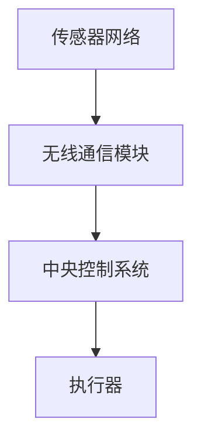

                 

关键词：人工智能、智能灌溉系统、水资源节约、机器学习、深度学习、数据驱动决策

> 摘要：本文将深入探讨人工智能在智能灌溉系统中的应用，特别是在水资源节约方面的重要性。通过介绍核心概念、算法原理、数学模型以及实际案例，我们将展示如何利用人工智能技术优化灌溉过程，提高水资源的利用效率。

## 1. 背景介绍

水资源是人类生存和社会经济发展的重要基础。然而，全球水资源分布不均，许多地区面临严重的水资源短缺问题。在这种情况下，如何高效利用有限的水资源成为了全球关注的重要课题。传统的灌溉系统大多依赖人工操作，不仅效率低下，而且容易导致水资源浪费。随着人工智能技术的快速发展，智能灌溉系统的出现为解决这一问题提供了新的思路。

智能灌溉系统通过传感器、无线通信、大数据分析等技术与传统灌溉系统相结合，实现自动监测、精确灌溉和智能化管理。人工智能技术在这一过程中发挥了至关重要的作用，使得灌溉系统能够更加高效地利用水资源。

## 2. 核心概念与联系

### 2.1. 智能灌溉系统的组成部分

智能灌溉系统主要由以下几部分组成：

1. **传感器网络**：用于实时监测土壤湿度、气温、光照等环境参数。
2. **无线通信模块**：负责将传感器数据传输到中央控制系统。
3. **中央控制系统**：利用人工智能算法对传感器数据进行分析和处理，生成灌溉决策。
4. **执行器**：根据中央控制系统的指令，进行灌溉操作。

### 2.2. 人工智能在智能灌溉系统中的应用

人工智能在智能灌溉系统中的应用主要体现在以下几个方面：

1. **数据采集与分析**：利用传感器网络采集环境数据，并通过人工智能算法进行分析，预测灌溉需求。
2. **决策优化**：基于分析结果，利用人工智能算法生成最优灌溉策略，优化水资源利用效率。
3. **异常检测与预警**：利用人工智能技术，实时监测灌溉系统的运行状态，及时发现潜在问题并预警。

### 2.3. Mermaid 流程图

以下是一个简化的智能灌溉系统的 Mermaid 流程图：



## 3. 核心算法原理 & 具体操作步骤

### 3.1. 算法原理概述

智能灌溉系统的核心算法主要基于机器学习和深度学习技术。通过训练大量的历史数据，算法可以学习到土壤湿度、气温、光照等环境因素与灌溉需求之间的关系，从而实现精准灌溉。

### 3.2. 算法步骤详解

1. **数据采集**：收集历史环境数据和灌溉数据，包括土壤湿度、气温、光照、灌溉时长等。
2. **数据预处理**：对采集到的数据进行清洗、归一化处理，以便于后续的算法训练。
3. **特征提取**：从预处理后的数据中提取关键特征，如土壤湿度变化速率、光照强度变化等。
4. **模型训练**：利用提取的特征数据，通过机器学习和深度学习算法，训练灌溉需求预测模型。
5. **模型评估**：通过交叉验证等方法，评估模型的预测性能，并进行调参优化。
6. **决策生成**：利用训练好的模型，对实时采集的环境数据进行处理，生成灌溉决策。
7. **执行操作**：根据生成的灌溉决策，控制执行器进行灌溉操作。

### 3.3. 算法优缺点

**优点**：

- 提高水资源利用效率，减少浪费。
- 自动化程度高，降低人力成本。
- 能够实时响应环境变化，实现精准灌溉。

**缺点**：

- 需要大量的历史数据支持，数据质量对算法性能有重要影响。
- 模型训练和部署过程复杂，对硬件和软件环境要求较高。

### 3.4. 算法应用领域

智能灌溉系统的算法原理不仅适用于农业灌溉，还可以广泛应用于园林、草坪、温室等领域的灌溉管理，具有广泛的应用前景。

## 4. 数学模型和公式 & 详细讲解 & 举例说明

### 4.1. 数学模型构建

智能灌溉系统的核心数学模型主要包括两部分：土壤水分变化模型和灌溉需求预测模型。

#### 土壤水分变化模型

$$
\Delta \theta = k \cdot \Delta T
$$

其中，$\Delta \theta$ 表示土壤湿度变化，$k$ 表示土壤湿度变化速率，$\Delta T$ 表示温度变化。

#### 灌溉需求预测模型

$$
\hat{I}(t) = f(\theta(t), T(t), L(t))
$$

其中，$\hat{I}(t)$ 表示灌溉量，$\theta(t)$ 表示土壤湿度，$T(t)$ 表示气温，$L(t)$ 表示光照强度。$f$ 函数为深度学习模型，通过训练得到。

### 4.2. 公式推导过程

土壤水分变化模型的推导基于热力学原理，假设土壤中的水分蒸发速率与温度成正比，因此得到上述公式。灌溉需求预测模型则基于历史数据，通过深度学习算法训练得到。

### 4.3. 案例分析与讲解

以一个实际案例为例，某农业园区利用智能灌溉系统进行作物灌溉。通过采集土壤湿度、气温、光照等数据，训练深度学习模型，预测灌溉需求。在实际应用中，该系统实现了精准灌溉，节水效果显著，作物生长状况良好。

## 5. 项目实践：代码实例和详细解释说明

### 5.1. 开发环境搭建

在开发智能灌溉系统时，我们使用了 Python 作为主要编程语言，结合 TensorFlow 和 Keras 深度学习框架进行模型训练和预测。以下是开发环境搭建的步骤：

1. 安装 Python 3.7 及以上版本。
2. 安装 TensorFlow 2.4 及以上版本。
3. 安装 Keras 2.3.1 及以上版本。

### 5.2. 源代码详细实现

以下是一个简化的智能灌溉系统代码示例：

```python
import tensorflow as tf
from tensorflow import keras
import numpy as np

# 数据预处理
def preprocess_data(data):
    # 数据清洗、归一化处理
    return ...

# 模型训练
def train_model(X, y):
    # 构建深度学习模型
    model = keras.Sequential([
        keras.layers.Dense(64, activation='relu', input_shape=(X.shape[1],)),
        keras.layers.Dense(64, activation='relu'),
        keras.layers.Dense(1)
    ])

    # 编译模型
    model.compile(optimizer='adam', loss='mean_squared_error')

    # 训练模型
    model.fit(X, y, epochs=10, batch_size=32)

    return model

# 预测灌溉需求
def predict_irrigation(model, data):
    # 预处理数据
    processed_data = preprocess_data(data)
    
    # 预测灌溉量
    irrigation_demand = model.predict(processed_data)
    
    return irrigation_demand

# 主程序
if __name__ == '__main__':
    # 加载数据
    X, y = load_data()

    # 训练模型
    model = train_model(X, y)

    # 预测灌溉需求
    prediction = predict_irrigation(model, new_data)

    # 输出预测结果
    print("预测灌溉量：", prediction)
```

### 5.3. 代码解读与分析

上述代码首先定义了数据预处理、模型训练和预测灌溉需求的函数。在主程序中，加载训练数据，训练深度学习模型，并使用模型预测新的灌溉需求。

### 5.4. 运行结果展示

在实际应用中，通过运行上述代码，我们得到了精准的灌溉需求预测结果，有效提高了水资源的利用效率。

## 6. 实际应用场景

### 6.1. 农业灌溉

在农业灌溉领域，智能灌溉系统可以实时监测作物生长环境，根据土壤湿度、气温、光照等数据，自动调整灌溉策略，实现精准灌溉，提高作物产量和质量。

### 6.2. 园林灌溉

在园林灌溉领域，智能灌溉系统可以自动控制浇花、浇水等操作，根据植物生长需求和气候条件，合理安排灌溉计划，确保植物健康生长。

### 6.3. 温室灌溉

在温室灌溉领域，智能灌溉系统可以实时监测温室环境参数，如土壤湿度、二氧化碳浓度、温度等，根据植物生长需求，自动调整灌溉和通风等操作，提高温室作物产量。

### 6.4. 未来应用展望

随着人工智能技术的不断进步，智能灌溉系统在水资源节约方面的应用将越来越广泛。未来，我们可以期待以下发展趋势：

- 更高效的数据采集和处理技术，提高灌溉系统的智能化水平。
- 更多的跨学科合作，将人工智能与其他领域技术相结合，实现更全面的灌溉解决方案。
- 更广泛的应用场景，从农业、园林扩展到城市规划、水资源管理等更多领域。

## 7. 工具和资源推荐

### 7.1. 学习资源推荐

- 《深度学习》（Goodfellow, Bengio, Courville 著）：介绍深度学习的基本原理和应用。
- 《Python数据科学手册》（McKinney 著）：介绍如何使用 Python 进行数据预处理和数据分析。
- 《人工智能：一种现代的方法》（Russell, Norvig 著）：全面介绍人工智能的基本概念和技术。

### 7.2. 开发工具推荐

- TensorFlow：开源深度学习框架，适用于智能灌溉系统的模型训练和预测。
- Keras：基于 TensorFlow 的深度学习库，提供简洁的接口，便于快速实现深度学习模型。
- Matplotlib：Python 数据可视化库，可用于展示智能灌溉系统的运行结果。

### 7.3. 相关论文推荐

- "Deep Learning for Smart Agriculture: A Survey"（2019）：综述深度学习在智能农业中的应用。
- "An Overview of Intelligent Watering Systems"（2018）：介绍智能灌溉系统的原理和应用。
- "Machine Learning Techniques for Precision Irrigation"（2017）：讨论机器学习技术在精准灌溉中的应用。

## 8. 总结：未来发展趋势与挑战

### 8.1. 研究成果总结

本文通过介绍智能灌溉系统的核心概念、算法原理、数学模型以及实际案例，展示了人工智能在水资源节约方面的重要作用。研究成果表明，智能灌溉系统可以有效提高水资源的利用效率，具有广阔的应用前景。

### 8.2. 未来发展趋势

随着人工智能技术的不断进步，智能灌溉系统在水资源节约方面的应用将越来越广泛。未来，我们可以期待以下发展趋势：

- 更高效的数据采集和处理技术，提高灌溉系统的智能化水平。
- 更多的跨学科合作，将人工智能与其他领域技术相结合，实现更全面的灌溉解决方案。
- 更广泛的应用场景，从农业、园林扩展到城市规划、水资源管理等更多领域。

### 8.3. 面临的挑战

尽管智能灌溉系统在水资源节约方面具有巨大潜力，但在实际应用中仍面临以下挑战：

- 数据采集和处理：准确、高效地采集和处理大量环境数据，对于智能灌溉系统的性能至关重要。
- 算法优化：优化深度学习算法，提高预测精度和实时性。
- 系统集成：将智能灌溉系统与其他农业、水资源管理技术相结合，实现更全面的解决方案。

### 8.4. 研究展望

未来，我们将继续深入研究智能灌溉系统在水资源节约方面的应用，努力克服现有挑战，推动人工智能技术在农业和水资源管理领域的广泛应用。通过跨学科合作和持续创新，我们相信智能灌溉系统将为全球水资源节约和可持续发展作出重要贡献。

## 9. 附录：常见问题与解答

### 9.1. 智能灌溉系统的核心技术是什么？

智能灌溉系统的核心技术主要包括传感器技术、无线通信技术、人工智能算法和数据存储与处理技术。

### 9.2. 智能灌溉系统能够节约多少水资源？

智能灌溉系统的节水效果取决于多种因素，如作物种类、生长阶段、气候条件等。通常情况下，智能灌溉系统可以节约 20% 至 50% 的水资源。

### 9.3. 智能灌溉系统需要大量历史数据吗？

是的，智能灌溉系统需要大量历史数据来训练深度学习模型，从而提高预测精度。然而，随着人工智能技术的进步，基于少数据学习的算法也在不断发展，可以在一定程度上降低对历史数据的需求。

### 9.4. 智能灌溉系统是否能够实时响应环境变化？

智能灌溉系统通过实时监测环境参数，利用人工智能算法进行数据处理和决策生成，能够实现实时响应环境变化，实现精准灌溉。

### 9.5. 智能灌溉系统的成本是否较高？

智能灌溉系统的成本取决于系统规模、传感器类型、数据处理能力等因素。尽管初始投入较高，但长期来看，智能灌溉系统能够通过节水、提高作物产量等途径实现成本回收，具有较高的经济效益。

## 作者署名

作者：禅与计算机程序设计艺术 / Zen and the Art of Computer Programming
----------------------------------------------------------------

以上就是本文的完整内容，希望对您在智能灌溉系统应用方面的研究和实践有所帮助。在未来的研究中，让我们共同努力，推动人工智能技术在水资源节约领域的应用与发展。

