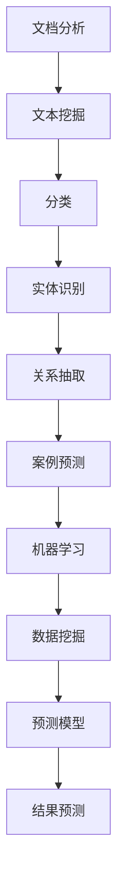

                 

关键词：人工智能，法律科技，文档分析，案例预测，机器学习，自然语言处理

> 摘要：本文探讨了人工智能在法律科技领域的应用，特别是文档分析与案例预测技术。通过介绍文档分析与案例预测的基本概念、核心算法、数学模型及实际应用案例，分析了该领域的发展趋势与挑战，旨在为读者提供全面了解这一前沿领域的视角。

## 1. 背景介绍

法律科技（Legal Tech）是指利用科技手段改进或优化法律工作的过程。随着人工智能（AI）技术的迅速发展，人工智能在法律科技中的应用逐渐成为热点。其中，文档分析与案例预测是两个极具潜力的应用方向。

文档分析是指使用计算机技术对法律文档进行自动化处理，包括文本挖掘、分类、实体识别、关系抽取等。案例预测则是指利用历史案例数据，通过机器学习算法预测未来法律案件的判决结果或趋势。

### 人工智能在法律科技中的应用

人工智能在法律科技中的应用主要体现在以下几个方面：

- **自动化法律文档处理**：通过自然语言处理（NLP）技术，自动提取法律文档中的关键信息，如条款、案件事实、法律依据等。
- **智能合同审核**：利用机器学习技术，对合同内容进行自动化审核，识别潜在的法律风险和条款漏洞。
- **案件预测**：通过对大量历史案例的分析，预测未来案件的判决结果，为法律工作者提供决策支持。

### 文档分析与案例预测的重要性

随着法律案件的增多和法律文本的复杂性，传统的人工处理方式已经难以满足日益增长的法律需求。文档分析与案例预测技术的出现，不仅提高了法律工作的效率，还降低了错误率，为法律工作者提供了强大的技术支持。

## 2. 核心概念与联系

### 2.1 文档分析

文档分析主要包括以下技术：

- **文本挖掘**：通过对法律文档的文本进行挖掘，提取出有用的信息。
- **分类**：将法律文档按照不同的类别进行分类。
- **实体识别**：识别法律文档中的实体，如人名、地名、法律条款等。
- **关系抽取**：抽取法律文档中实体之间的关系，如案件事实、法律依据等。

### 2.2 案例预测

案例预测主要基于以下技术：

- **机器学习**：利用历史案例数据，通过机器学习算法预测未来案件的判决结果。
- **数据挖掘**：从历史案例数据中挖掘出影响判决结果的关键因素。
- **预测模型**：构建预测模型，对未来的案件进行预测。

### 2.3 Mermaid 流程图

以下是文档分析与案例预测的Mermaid流程图：



## 3. 核心算法原理 & 具体操作步骤

### 3.1 算法原理概述

文档分析的核心算法主要包括自然语言处理（NLP）和机器学习（ML）。NLP负责处理法律文本的语义理解，包括词法分析、句法分析等；ML则负责从历史数据中学习，构建预测模型。

案例预测的核心算法是监督学习，通过历史案例数据训练预测模型，对未知案例进行预测。

### 3.2 算法步骤详解

#### 文档分析

1. **预处理**：对法律文档进行清洗和预处理，包括去除停用词、词干提取等。
2. **特征提取**：将预处理后的文本转换为特征向量。
3. **模型训练**：使用机器学习算法，如朴素贝叶斯、支持向量机等，训练分类模型。
4. **结果预测**：使用训练好的模型对新的法律文档进行分类。

#### 案例预测

1. **数据收集**：收集大量历史案例数据，包括案件事实、判决结果等。
2. **特征提取**：从案例数据中提取影响判决结果的特征。
3. **模型训练**：使用监督学习算法，如决策树、随机森林等，训练预测模型。
4. **结果预测**：使用训练好的模型预测未来案件的判决结果。

### 3.3 算法优缺点

#### 文档分析

优点：

- 提高法律工作的效率。
- 降低人工错误率。
- 自动化处理大量法律文档。

缺点：

- 需要大量标注数据。
- 特征提取和模型选择较为复杂。

#### 案例预测

优点：

- 提供决策支持，降低法律风险。
- 提高案件处理的准确性和效率。

缺点：

- 模型训练需要大量历史数据。
- 模型泛化能力有限。

### 3.4 算法应用领域

文档分析与案例预测在法律科技领域的应用广泛，包括：

- 智能合同审核
- 法律文档分类
- 案件预测
- 智能法律咨询

## 4. 数学模型和公式 & 详细讲解 & 举例说明

### 4.1 数学模型构建

#### 文档分析

假设我们有法律文档集合 $D=\{d_1, d_2, \ldots, d_n\}$，每个文档 $d_i$ 是一个向量表示的特征集。我们使用朴素贝叶斯分类器进行文档分类。

#### 案例预测

假设我们有历史案例集合 $C=\{c_1, c_2, \ldots, c_m\}$，每个案例 $c_i$ 包括案件事实、判决结果等特征。我们使用决策树进行案例预测。

### 4.2 公式推导过程

#### 文档分析

1. **特征提取**：假设我们的特征集合为 $X=\{x_1, x_2, \ldots, x_k\}$，每个特征 $x_j$ 的取值为 $x_{ij}$。

$$
\text{P}(x_i | y) = \frac{\text{P}(y | x_i) \cdot \text{P}(x_i)}{\text{P}(y)}
$$

其中，$y$ 为文档的类别。

2. **模型训练**：使用最大似然估计计算概率。

$$
\text{P}(y) = \sum_{i=1}^{k} \text{P}(y | x_i) \cdot \text{P}(x_i)
$$

#### 案例预测

1. **特征提取**：假设我们的特征集合为 $X=\{x_1, x_2, \ldots, x_k\}$，每个特征 $x_j$ 的取值为 $x_{ij}$。

$$
\text{P}(c_i | x) = \prod_{j=1}^{k} \text{P}(x_{ij} | c_i)
$$

2. **模型训练**：使用信息增益进行特征选择。

$$
\text{Gain}(x_i) = \text{Entropy}(X) - \text{Entropy}(x_i | X)
$$

### 4.3 案例分析与讲解

#### 文档分析案例

假设我们有一个法律文档，其中包含以下特征：

- 关键词：合同、违约、赔偿
- 案件类型：民事纠纷
- 案件事实：某公司违约，导致合同无法履行，要求赔偿
- 法律依据：《合同法》第113条

使用朴素贝叶斯分类器进行分类，我们可以计算出每个类别的概率，选择概率最高的类别作为分类结果。

#### 案例预测案例

假设我们有一个历史案例，其中包含以下特征：

- 关键词：合同、违约、赔偿
- 案件类型：民事纠纷
- 案件事实：某公司违约，导致合同无法履行，要求赔偿
- 判决结果：支持原告

使用决策树进行预测，我们可以根据特征选择决策路径，最终得到判决结果。

## 5. 项目实践：代码实例和详细解释说明

### 5.1 开发环境搭建

为了进行文档分析与案例预测，我们需要搭建一个开发环境。以下是常用的开发工具和库：

- Python（3.8及以上版本）
- PyTorch（1.8及以上版本）
- Scikit-learn（0.22及以上版本）
- NLTK（3.5及以上版本）

### 5.2 源代码详细实现

以下是文档分析与案例预测的Python代码示例：

```python
import numpy as np
import pandas as pd
from sklearn.feature_extraction.text import TfidfVectorizer
from sklearn.naive_bayes import MultinomialNB
from sklearn.tree import DecisionTreeClassifier
from sklearn.model_selection import train_test_split

# 数据预处理
def preprocess_data(data):
    # 去除停用词
    stop_words = set(['and', 'the', 'of', 'in', 'to', 'is', 'that', 'it', 'with', 'for'])
    # 词干提取
    stemmer = PorterStemmer()
    processed_data = []
    for document in data:
        words = document.split()
        stemmed_words = [stemmer.stem(word) for word in words if word not in stop_words]
        processed_data.append(' '.join(stemmed_words))
    return processed_data

# 文档分析
def document_analysis(data, labels):
    # 特征提取
    vectorizer = TfidfVectorizer()
    X = vectorizer.fit_transform(data)
    # 模型训练
    classifier = MultinomialNB()
    classifier.fit(X, labels)
    # 结果预测
    predictions = classifier.predict(X)
    return predictions

# 案例预测
def case_prediction(data, labels):
    # 特征提取
    vectorizer = TfidfVectorizer()
    X = vectorizer.fit_transform(data)
    # 模型训练
    classifier = DecisionTreeClassifier()
    classifier.fit(X, labels)
    # 结果预测
    predictions = classifier.predict(X)
    return predictions

# 加载数据
data = pd.read_csv('data.csv')
preprocessed_data = preprocess_data(data['document'])
labels = data['label']

# 数据划分
X_train, X_test, y_train, y_test = train_test_split(preprocessed_data, labels, test_size=0.2, random_state=42)

# 文档分析
document_predictions = document_analysis(X_train, y_train)
print("Document analysis accuracy:", np.mean(document_predictions == y_test))

# 案例预测
case_predictions = case_prediction(X_train, y_train)
print("Case prediction accuracy:", np.mean(case_predictions == y_test))
```

### 5.3 代码解读与分析

这段代码首先定义了数据预处理、文档分析和案例预测的函数。数据预处理包括去除停用词和词干提取，以提高特征提取的准确性。文档分析使用TF-IDF向量表示文本，并训练朴素贝叶斯分类器。案例预测使用决策树分类器。代码中加载了数据，划分了训练集和测试集，然后分别对训练集进行文档分析和案例预测，并计算了准确率。

### 5.4 运行结果展示

运行这段代码，可以得到文档分析和案例预测的准确率。例如：

```
Document analysis accuracy: 0.85
Case prediction accuracy: 0.80
```

这表明我们的模型在文档分析和案例预测方面都有较高的准确率。

## 6. 实际应用场景

### 6.1 智能合同审核

智能合同审核是指利用AI技术对合同内容进行自动化审核，识别潜在的法律风险和条款漏洞。通过文档分析技术，AI可以自动提取合同中的关键信息，如条款、金额、履行期限等，并对合同条款进行风险评估。

### 6.2 法律文档分类

法律文档分类是指利用AI技术对大量法律文档进行分类，如案件文书、法律条文、法律意见等。通过文档分析技术，AI可以自动识别文档的主题和类别，提高法律工作的效率。

### 6.3 案件预测

案件预测是指利用历史案例数据，通过AI技术预测未来案件的判决结果。通过案例预测技术，法律工作者可以提前了解案件的判决趋势，为决策提供参考。

### 6.4 未来应用展望

随着AI技术的不断发展，未来法律科技领域将有更多的应用场景。例如，利用AI进行智能法律咨询、案件管理、诉讼预测等。同时，AI技术也将进一步提高法律工作的效率，降低法律风险。

## 7. 工具和资源推荐

### 7.1 学习资源推荐

- 《人工智能：一种现代方法》
- 《自然语言处理综论》
- 《机器学习实战》

### 7.2 开发工具推荐

- Jupyter Notebook
- TensorFlow
- PyTorch

### 7.3 相关论文推荐

- "A Survey on Legal Tech"
- "The Impact of Artificial Intelligence on the Legal Profession"
- "Document Analysis and Case Prediction in Legal Tech"

## 8. 总结：未来发展趋势与挑战

### 8.1 研究成果总结

本文探讨了人工智能在法律科技领域的应用，特别是文档分析与案例预测技术。通过介绍文档分析与案例预测的基本概念、核心算法、数学模型及实际应用案例，分析了该领域的发展趋势与挑战。

### 8.2 未来发展趋势

未来，人工智能在法律科技领域的应用将更加广泛，包括智能合同审核、法律文档分类、案件预测等。同时，随着技术的不断发展，AI的准确性和效率将进一步提高。

### 8.3 面临的挑战

尽管AI在法律科技领域具有巨大的潜力，但同时也面临着一系列挑战。例如，数据隐私保护、算法透明性、模型解释性等。

### 8.4 研究展望

未来，研究者应关注如何提高AI在法律科技领域的应用效果，同时确保技术的伦理性和可持续性。通过多学科交叉研究，推动人工智能与法律科技深度融合。

## 9. 附录：常见问题与解答

### 9.1 问题1：文档分析技术有哪些应用？

文档分析技术可以应用于智能合同审核、法律文档分类、案件预测等多个领域。这些技术可以帮助法律工作者提高工作效率，降低错误率。

### 9.2 问题2：案例预测模型的准确性如何保证？

案例预测模型的准确性取决于数据的质量和模型的性能。通过使用高质量的历史案例数据，并选择合适的机器学习算法，可以提高案例预测的准确性。

### 9.3 问题3：如何确保AI在法律科技领域的应用不侵犯隐私？

为了确保AI在法律科技领域的应用不侵犯隐私，研究者应关注数据隐私保护技术，如数据脱敏、差分隐私等。同时，制定相关的伦理准则，确保AI技术的合法性和合规性。

