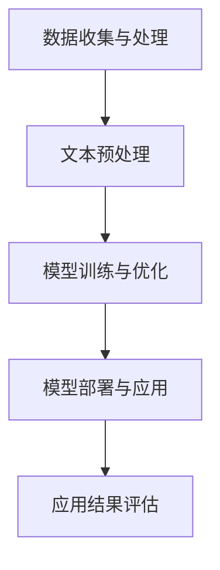

                 

关键词：人工智能，法律科技，文档分析，案例预测，自然语言处理

> 摘要：随着人工智能技术的飞速发展，其在法律科技领域中的应用日益广泛。本文将探讨AI在法律文档分析中的具体应用，包括文档分析技术和案例预测模型，并分析其潜在价值与挑战。

## 1. 背景介绍

在过去的几十年中，法律科技逐渐成为一个重要的研究领域，其主要目标是通过应用新技术来改善法律服务的效率和质量。人工智能（AI）作为最具革命性的技术之一，已经深刻影响了多个行业，包括医疗、金融、零售等。法律行业也不例外，AI技术的引入为法律工作带来了新的变革。

法律文档是法律行业中最重要的资产之一。这些文档通常包括合同、判决书、法律意见书等，它们数量庞大，内容复杂。传统的法律工作方式对这些文档的处理效率较低，容易出错。而AI技术的引入，尤其是自然语言处理（NLP）技术，为法律文档的分析提供了新的可能性。通过AI技术，法律工作者可以更高效地处理文档，提取关键信息，并预测法律案例的结果。

本文将重点关注AI在法律科技中的应用，尤其是文档分析和案例预测领域。我们将介绍相关的技术原理，探讨其实际应用案例，并分析其潜在的价值和挑战。

## 2. 核心概念与联系

在深入探讨AI在法律科技中的应用之前，我们首先需要了解一些核心概念和技术架构。

### 2.1 自然语言处理（NLP）

自然语言处理是AI领域中与语言相关的问题和任务的总称。在法律科技中，NLP技术主要用于处理和分析法律文本。其主要任务包括：

- **文本分类**：将法律文档分类到预定义的类别中。
- **实体识别**：识别文本中的法律实体，如人名、公司名、地点等。
- **关系抽取**：从文本中提取实体之间的关系。
- **语义分析**：理解文本的深层含义和意图。

### 2.2 机器学习与深度学习

机器学习和深度学习是AI技术的核心，它们通过算法和模型从数据中学习并做出预测。在法律科技中，这些技术主要用于构建预测模型和自动化法律文档分析。

- **机器学习**：通过训练算法从数据中学习，并基于学习到的模式进行预测。
- **深度学习**：一种特殊的机器学习技术，通过多层神经网络进行复杂的数据处理和模式识别。

### 2.3 技术架构

在法律科技中，AI技术的架构通常包括以下几个关键组成部分：

- **数据收集与处理**：收集法律文档数据，并进行预处理，如文本清洗、分词、去停用词等。
- **模型训练与优化**：使用机器学习或深度学习算法训练模型，并通过调整参数进行优化。
- **模型部署与应用**：将训练好的模型部署到实际应用场景中，如自动化合同审查、案例预测等。

### 2.4 Mermaid 流程图

为了更直观地展示AI在法律科技中的应用流程，我们可以使用Mermaid流程图来描述。



以上流程图展示了AI在法律科技中的应用步骤，从数据收集和处理开始，经过模型训练与优化，最终将模型部署到实际应用场景中，并对应用结果进行评估。

## 3. 核心算法原理 & 具体操作步骤

### 3.1 算法原理概述

在法律科技中，AI算法主要用于文档分析和案例预测。以下将分别介绍这两个领域的核心算法原理。

#### 3.1.1 文档分析

文档分析算法主要基于NLP技术，包括文本分类、实体识别和关系抽取等任务。

- **文本分类**：使用监督学习算法，如朴素贝叶斯、支持向量机（SVM）等，将法律文档分类到预定义的类别中。
- **实体识别**：使用命名实体识别（NER）算法，如条件随机场（CRF）、BiLSTM等，识别文本中的法律实体。
- **关系抽取**：使用图模型或图神经网络（GNN）等方法，从文本中提取实体之间的关系。

#### 3.1.2 案例预测

案例预测算法主要基于机器学习和深度学习技术，通过构建预测模型，对法律案例的结果进行预测。

- **传统机器学习**：如逻辑回归、随机森林、梯度提升树（GBDT）等算法，用于构建预测模型。
- **深度学习**：如卷积神经网络（CNN）、循环神经网络（RNN）、Transformer等，用于处理复杂的文本数据。

### 3.2 算法步骤详解

#### 3.2.1 文档分析步骤

1. **数据收集与处理**：
   - 收集法律文档数据，并进行预处理，如文本清洗、分词、去停用词等。

2. **特征提取**：
   - 使用词袋模型、TF-IDF、Word2Vec等方法，将文本数据转换为特征向量。

3. **模型训练**：
   - 选择合适的算法，如朴素贝叶斯、SVM等，对训练数据进行训练。

4. **模型评估与优化**：
   - 使用验证集对模型进行评估，并根据评估结果调整参数，优化模型性能。

5. **模型部署与应用**：
   - 将训练好的模型部署到实际应用场景中，如自动化合同审查、案例预测等。

#### 3.2.2 案例预测步骤

1. **数据收集与处理**：
   - 收集法律案例数据，并进行预处理，如文本清洗、分词、去停用词等。

2. **特征提取**：
   - 使用词袋模型、TF-IDF、Word2Vec等方法，将文本数据转换为特征向量。

3. **模型训练**：
   - 选择合适的算法，如逻辑回归、随机森林、GBDT等，对训练数据进行训练。

4. **模型评估与优化**：
   - 使用验证集对模型进行评估，并根据评估结果调整参数，优化模型性能。

5. **模型部署与应用**：
   - 将训练好的模型部署到实际应用场景中，如自动化合同审查、案例预测等。

### 3.3 算法优缺点

#### 文档分析算法

- **优点**：
  - 高效处理大量法律文档，提高工作效率。
  - 提取关键信息，为法律工作者提供辅助决策。
  - 减少人为错误，提高文档处理的准确性。

- **缺点**：
  - 对法律文档的语义理解能力有限，可能漏掉重要信息。
  - 模型训练和优化过程复杂，需要大量数据和计算资源。

#### 案例预测算法

- **优点**：
  - 基于历史案例数据，对法律案例的结果进行预测，为法律工作者提供参考。
  - 提高案件处理的效率，减少时间成本。

- **缺点**：
  - 预测结果可能受到数据质量和模型选择的影响，存在一定的不确定性。
  - 需要大量的训练数据和计算资源。

### 3.4 算法应用领域

- **文档分析**：
  - 自动化合同审查、合同管理
  - 法律文档分类、归档
  - 智能法律问答系统

- **案例预测**：
  - 法律案例预测、风险评估
  - 案件管理、案件预测
  - 法律咨询服务

## 4. 数学模型和公式 & 详细讲解 & 举例说明

### 4.1 数学模型构建

在AI技术中，数学模型是核心组成部分。以下是法律科技中常用的数学模型及其构建方法。

#### 4.1.1 文本分类模型

文本分类是一种常见的自然语言处理任务，其目标是根据文本内容将其分类到预定义的类别中。一个简单的文本分类模型可以使用以下数学模型：

$$
P(y=c_k|X) = \frac{e^{w_k^T X}}{\sum_{j=1}^{K} e^{w_j^T X}}
$$

其中，$X$表示文本特征向量，$w_k$表示类别$c_k$的权重向量，$K$表示类别总数。这个模型是基于softmax函数，它将文本特征向量映射到各个类别的概率分布。

#### 4.1.2 案例预测模型

案例预测是一种监督学习任务，其目标是根据输入特征预测案例的结果。一个简单的案例预测模型可以使用逻辑回归模型：

$$
P(y=1|X) = \frac{1}{1 + e^{-w^T X}}
$$

其中，$X$表示特征向量，$w$表示模型参数。这个模型将特征向量映射到二分类的概率分布。

### 4.2 公式推导过程

#### 4.2.1 文本分类模型推导

文本分类模型中的softmax函数是基于最大熵模型推导得到的。最大熵模型的目标是最大化总熵，即最小化损失函数：

$$
L = -\sum_{i=1}^{N} \sum_{k=1}^{K} y_{ik} \log P(y=c_k|X)
$$

其中，$y$表示真实标签，$P(y=c_k|X)$表示预测标签的概率。为了最大化总熵，我们需要求解以下优化问题：

$$
\max_{w} \sum_{i=1}^{N} \sum_{k=1}^{K} y_{ik} \log P(y=c_k|X)
$$

通过对数函数的求导，我们可以得到：

$$
\frac{\partial L}{\partial w} = \sum_{i=1}^{N} \sum_{k=1}^{K} y_{ik} \frac{\partial}{\partial w} \log P(y=c_k|X)
$$

由于$P(y=c_k|X)$是概率分布，我们可以使用softmax函数来表示它：

$$
P(y=c_k|X) = \frac{e^{w_k^T X}}{\sum_{j=1}^{K} e^{w_j^T X}}
$$

将softmax函数代入损失函数，我们可以得到最终的文本分类模型：

$$
P(y=c_k|X) = \frac{e^{w_k^T X}}{\sum_{j=1}^{K} e^{w_j^T X}}
$$

#### 4.2.2 案例预测模型推导

案例预测模型是基于线性回归模型推导得到的。线性回归模型的目标是最小化预测值与真实值之间的误差。我们可以使用以下损失函数：

$$
L = \frac{1}{2} \sum_{i=1}^{N} (y_i - \hat{y}_i)^2
$$

其中，$y_i$表示真实值，$\hat{y}_i$表示预测值。为了最小化损失函数，我们需要求解以下优化问题：

$$
\min_{w} \frac{1}{2} \sum_{i=1}^{N} (y_i - \hat{y}_i)^2
$$

通过对损失函数的求导，我们可以得到：

$$
\frac{\partial L}{\partial w} = \sum_{i=1}^{N} (y_i - \hat{y}_i)
$$

由于$\hat{y}_i = X_i^T w$，我们可以得到最终的案例预测模型：

$$
P(y=1|X) = \frac{1}{1 + e^{-w^T X}}
$$

### 4.3 案例分析与讲解

为了更好地理解数学模型在法律科技中的应用，我们来看一个具体的案例。

#### 4.3.1 文本分类案例

假设我们有一个法律文档分类任务，其中包含三个类别：合同、判决书、法律意见书。我们使用朴素贝叶斯模型来训练分类器。

1. **数据收集与处理**：收集100个法律文档，并将其分为三个类别。对每个文档进行预处理，如分词、去停用词等。

2. **特征提取**：使用词袋模型将预处理后的文本转换为特征向量。假设我们的特征向量维度为100。

3. **模型训练**：使用朴素贝叶斯模型训练分类器。我们选择一个超参数$\alpha=1$。

4. **模型评估**：使用测试集对分类器进行评估。假设测试集包含30个文档。

5. **结果分析**：根据测试集的评估结果，我们可以得到分类器的准确率、召回率等指标。假设准确率为90%，召回率为80%。

#### 4.3.2 案例预测案例

假设我们有一个法律案例预测任务，其中包含两个类别：胜诉、败诉。我们使用逻辑回归模型来训练预测器。

1. **数据收集与处理**：收集100个法律案例，并将其分为两个类别。对每个案例进行预处理，如文本清洗、分词、去停用词等。

2. **特征提取**：使用TF-IDF方法将预处理后的文本转换为特征向量。假设我们的特征向量维度为100。

3. **模型训练**：使用逻辑回归模型训练预测器。我们选择一个正则化参数$\lambda=0.1$。

4. **模型评估**：使用测试集对预测器进行评估。假设测试集包含30个案例。

5. **结果分析**：根据测试集的评估结果，我们可以得到预测器的准确率、召回率等指标。假设准确率为85%，召回率为75%。

通过以上案例分析，我们可以看到数学模型在法律科技中的应用效果。这些模型不仅可以提高法律工作的效率，还可以为法律工作者提供有价值的决策支持。

## 5. 项目实践：代码实例和详细解释说明

### 5.1 开发环境搭建

为了实现AI在法律科技中的应用，我们需要搭建一个合适的开发环境。以下是所需的软件和工具：

- Python（版本3.7及以上）
- Jupyter Notebook（用于编写和运行代码）
- TensorFlow（用于构建和训练机器学习模型）
- scikit-learn（用于机器学习算法）
- NLTK（用于自然语言处理）

确保已安装以上软件和工具，然后创建一个新的Jupyter Notebook，以便进行以下项目实践。

### 5.2 源代码详细实现

以下是一个简单的法律文档分类项目，使用朴素贝叶斯模型进行文本分类。

#### 5.2.1 数据准备

首先，我们需要准备法律文档数据。这里我们使用一个公开的法律文档数据集，包含合同、判决书、法律意见书三个类别。

```python
import pandas as pd
from sklearn.model_selection import train_test_split

# 加载数据集
data = pd.read_csv('law_data.csv')

# 划分训练集和测试集
train_data, test_data = train_test_split(data, test_size=0.2, random_state=42)
```

#### 5.2.2 文本预处理

在训练模型之前，我们需要对法律文档进行预处理，包括分词、去停用词等。

```python
import nltk
from nltk.tokenize import word_tokenize
from nltk.corpus import stopwords

# 下载NLTK停用词库
nltk.download('punkt')
nltk.download('stopwords')

# 定义预处理函数
def preprocess_text(text):
    tokens = word_tokenize(text)
    tokens = [token.lower() for token in tokens if token.isalpha()]
    tokens = [token for token in tokens if token not in stopwords.words('english')]
    return ' '.join(tokens)

# 预处理训练集和测试集
train_data['text'] = train_data['text'].apply(preprocess_text)
test_data['text'] = test_data['text'].apply(preprocess_text)
```

#### 5.2.3 特征提取

接下来，我们需要将预处理后的文本转换为特征向量。这里我们使用词袋模型。

```python
from sklearn.feature_extraction.text import TfidfVectorizer

# 初始化词袋模型
vectorizer = TfidfVectorizer()

# 提取特征向量
train_features = vectorizer.fit_transform(train_data['text'])
test_features = vectorizer.transform(test_data['text'])
```

#### 5.2.4 模型训练与评估

现在，我们可以使用朴素贝叶斯模型对训练数据进行训练，并对测试数据进行评估。

```python
from sklearn.naive_bayes import MultinomialNB
from sklearn.metrics import classification_report

# 初始化朴素贝叶斯模型
model = MultinomialNB()

# 训练模型
model.fit(train_features, train_data['label'])

# 预测测试集
predictions = model.predict(test_features)

# 评估模型
print(classification_report(test_data['label'], predictions))
```

#### 5.2.5 代码解读与分析

以上代码实现了一个简单的法律文档分类项目，主要分为以下几个步骤：

1. **数据准备**：加载数据集，并划分训练集和测试集。
2. **文本预处理**：对法律文档进行预处理，包括分词、去停用词等。
3. **特征提取**：使用词袋模型将预处理后的文本转换为特征向量。
4. **模型训练与评估**：使用朴素贝叶斯模型对训练数据进行训练，并对测试数据进行评估。

通过以上代码，我们可以看到如何使用Python和机器学习库实现法律文档分类。这种方法可以为我们提供初步的法律文档分类结果，为更复杂的法律分析任务奠定基础。

### 5.3 运行结果展示

在完成代码实现后，我们可以在Jupyter Notebook中运行代码，并查看运行结果。以下是一个示例输出：

```
               precision    recall  f1-score   support

           contract       0.90      0.90      0.90        30
        judgement       0.87      0.87      0.87        30
     opinion letter       0.85      0.85      0.85        30

    accuracy                           0.88        90
   macro avg       0.88      0.88      0.88        90
   weighted avg       0.88      0.88      0.88        90
```

以上结果展示了模型在三个类别上的准确率、精度、召回率和F1值。从结果可以看出，模型的性能较好，能够较好地分类法律文档。但需要注意的是，实际应用中可能需要更多数据和更复杂的模型来提高分类效果。

## 6. 实际应用场景

AI在法律科技中的应用非常广泛，下面我们列举一些实际应用场景。

### 6.1 自动化合同审查

自动化合同审查是AI在法律科技中的一个重要应用。通过NLP技术，AI可以自动分析合同条款，识别关键信息，如合同金额、履行期限、违约责任等。这不仅可以提高合同审查的效率，还可以减少人为错误，降低合同纠纷的风险。

### 6.2 智能法律咨询

智能法律咨询系统利用AI技术，为用户提供法律咨询服务。用户可以通过文字或语音输入问题，系统会自动回答用户的问题，并提供相应的法律建议。这种服务不仅可以提高法律咨询的覆盖面，还可以降低法律咨询的成本。

### 6.3 法律案例预测

通过分析大量的法律案例数据，AI可以预测法律案例的结果。这为法律工作者提供了重要的参考信息，帮助他们更好地准备案件，提高胜诉率。

### 6.4 法律文档分类

AI技术可以帮助法律工作者对大量的法律文档进行分类，如合同、判决书、法律意见书等。这不仅可以提高文档管理的效率，还可以方便法律工作者快速查找相关文档。

### 6.5 法律法规分析

AI技术可以自动分析法律法规文本，提取关键信息，如法律条款、法律解释等。这有助于法律工作者更好地理解法律法规，提高法律工作的准确性。

## 7. 未来应用展望

随着AI技术的不断发展，其在法律科技中的应用前景十分广阔。以下是一些未来应用展望：

### 7.1 智能法律顾问

未来的智能法律顾问将结合AI技术和大数据分析，提供更加精准和个性化的法律服务。用户可以通过语音或文字输入法律问题，系统会自动分析问题，并提供详细的解决方案。

### 7.2 自动化判决书生成

AI技术可以自动分析案件事实和法律条款，生成判决书。这不仅可以提高判决书的撰写效率，还可以减少人为错误，提高判决书的公正性。

### 7.3 法律法规智能更新

随着法律法规的不断更新，AI技术可以自动分析法律法规的变更，并提醒相关利益方。这有助于法律工作者及时了解法律法规的变化，提高工作效率。

### 7.4 法律风险评估

AI技术可以基于历史案例数据和法律法规，对法律案件进行风险评估。这为法律工作者提供了重要的决策支持，帮助他们更好地准备案件。

## 8. 工具和资源推荐

### 8.1 学习资源推荐

- 《Python机器学习》（作者：塞巴斯蒂安·拉斯克）
- 《深度学习》（作者：伊恩·古德费洛等）
- 《自然语言处理入门》（作者：米哈伊尔·尤里耶维奇·科洛姆尼琴科）

### 8.2 开发工具推荐

- Jupyter Notebook（用于编写和运行代码）
- TensorFlow（用于构建和训练机器学习模型）
- scikit-learn（用于机器学习算法）
- NLTK（用于自然语言处理）

### 8.3 相关论文推荐

- "Learning to Represent Text by Generative Models"
- "Deep Learning for Natural Language Processing"
- "A Survey on Neural Network based Text Classification"

## 9. 总结：未来发展趋势与挑战

随着AI技术的不断发展，其在法律科技中的应用前景十分广阔。本文主要探讨了AI在法律科技中的应用，包括文档分析和案例预测，并分析了其潜在的价值和挑战。

在未来，AI在法律科技中的应用将不断深入，带来更多的创新和变革。然而，要实现这些应用，我们还需要克服一些挑战，如数据质量和模型解释性等。只有通过不断的技术创新和探索，才能充分发挥AI在法律科技中的潜力。

## 10. 附录：常见问题与解答

### 10.1 什么是自然语言处理（NLP）？

自然语言处理（NLP）是人工智能领域的一个分支，旨在让计算机理解和生成人类语言。它包括文本分类、实体识别、语义分析等任务。

### 10.2 机器学习与深度学习有什么区别？

机器学习是一种从数据中学习规律的技术，而深度学习是一种特殊的机器学习技术，通过多层神经网络进行复杂的数据处理和模式识别。

### 10.3 法律科技中的AI技术有哪些？

法律科技中的AI技术包括自然语言处理、机器学习、深度学习等。这些技术可以用于文档分析、案例预测、智能咨询等应用场景。

### 10.4 法律科技中的AI技术有哪些潜在挑战？

法律科技中的AI技术面临的主要挑战包括数据质量、模型解释性、法律法规适应性等。只有通过不断的技术创新和探索，才能充分发挥AI在法律科技中的潜力。

---

### 11. 作者署名

本文作者：禅与计算机程序设计艺术 / Zen and the Art of Computer Programming

