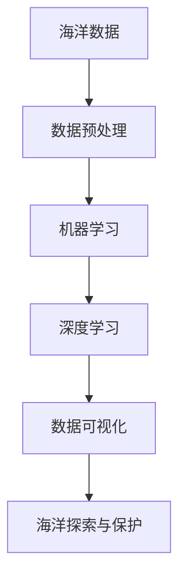

                 

关键词：人工智能，海洋科学，深海探索，环境保护，数据挖掘，机器学习，深度学习

> 摘要：本文旨在探讨人工智能（AI）在海洋科学领域的应用，特别是深海探索与环境保护方面。通过对AI核心概念、算法原理、数学模型以及实际案例的深入分析，本文揭示了AI在海洋科学中的重要性和潜力，并提出未来研究的方向和挑战。

## 1. 背景介绍

海洋覆盖了地球表面的70%以上，是一个充满神秘和未知的空间。海洋不仅为地球提供了气候调节、食物供应和资源开发等重要服务，同时也面临着严重的环境问题，如海洋污染、渔业资源衰退和气候变化等。传统的海洋科学研究方法依赖于物理探测、化学分析和技术手段，但这些方法在深海环境中往往受到限制。随着AI技术的快速发展，利用AI进行深海探索和环境保护已成为可能。

AI，特别是机器学习和深度学习，为处理大规模海洋数据和识别复杂海洋模式提供了强大工具。通过AI技术，我们可以从大量的海洋数据中提取有用信息，提高海洋监测的准确性和效率，从而为深海探索和环境保护提供科学依据。

## 2. 核心概念与联系

### 2.1 AI在海洋科学中的核心概念

- **海洋数据挖掘**：从大量的海洋数据中提取有价值的信息。
- **机器学习**：使用算法从数据中学习规律，进行模式识别和预测。
- **深度学习**：一种特殊的机器学习，使用神经网络模拟人脑处理信息的方式。

### 2.2 AI与海洋科学的联系

**Mermaid 流程图：**



### 2.3 核心概念原理与架构

**海洋数据挖掘**：通过数据挖掘技术，可以从海洋传感器、卫星数据、水下摄像等来源的海量数据中提取出对海洋科学有用的信息。这些信息包括海洋温度、盐度、洋流速度、海洋生物种类等。

**机器学习**：机器学习算法可以对提取出的数据进行训练，从而建立模型，进行预测和分类。例如，可以使用决策树、支持向量机（SVM）等算法来预测海洋生物的种类和分布。

**深度学习**：深度学习算法通过多层神经网络进行信息处理，可以更有效地提取数据中的复杂模式。卷积神经网络（CNN）在图像识别任务中表现出色，而循环神经网络（RNN）则在处理序列数据方面具有优势。

**数据可视化**：通过数据可视化技术，可以将复杂的海洋数据转化为直观的图形或图表，便于科学家和决策者理解。

**海洋探索与保护**：基于AI技术的海洋数据分析和预测结果，可以帮助科学家更好地理解海洋生态系统的运作，指导深海探索活动，并制定更有效的海洋保护政策。

## 3. 核心算法原理 & 具体操作步骤

### 3.1 算法原理概述

AI在海洋科学中的应用主要依赖于以下几种核心算法：

- **聚类算法**：用于对海洋数据中的相似数据点进行分组，以便更好地分析和理解海洋环境。
- **分类算法**：用于将海洋数据中的不同数据点分类到不同的类别中，例如区分海洋生物种类。
- **回归算法**：用于预测海洋环境中的某个变量（如温度、盐度等）随时间的变化趋势。
- **深度学习模型**：用于处理复杂的海洋数据，提取深层次的特征信息。

### 3.2 算法步骤详解

#### 3.2.1 数据预处理

- **数据清洗**：去除重复数据、噪声数据和缺失值。
- **数据标准化**：将不同量纲的数据转换为相同的量纲，以便进行统一处理。
- **特征提取**：从原始数据中提取对海洋科学有意义的特征。

#### 3.2.2 聚类算法

- **选择聚类算法**：如K-means、层次聚类等。
- **初始化聚类中心**：为每个聚类选择一个代表点。
- **迭代计算聚类中心**：根据聚类中心重新划分数据点，并更新聚类中心。
- **评估聚类效果**：使用内部评估指标（如轮廓系数）和外部评估指标（如轮廓系数）评估聚类效果。

#### 3.2.3 分类算法

- **选择分类算法**：如决策树、随机森林、支持向量机等。
- **训练分类模型**：使用标记好的训练数据集训练分类模型。
- **测试分类模型**：使用测试数据集评估分类模型的性能。
- **预测分类结果**：使用训练好的分类模型对新的数据进行分类预测。

#### 3.2.4 回归算法

- **选择回归算法**：如线性回归、多项式回归等。
- **训练回归模型**：使用训练数据集训练回归模型。
- **测试回归模型**：使用测试数据集评估回归模型的性能。
- **预测回归结果**：使用训练好的回归模型预测新的数据点的回归结果。

#### 3.2.5 深度学习模型

- **选择深度学习框架**：如TensorFlow、PyTorch等。
- **构建深度学习模型**：设计神经网络结构，包括输入层、隐藏层和输出层。
- **训练深度学习模型**：使用训练数据集训练模型，并调整模型参数。
- **测试深度学习模型**：使用测试数据集评估模型的性能。
- **预测深度学习结果**：使用训练好的模型对新数据进行预测。

### 3.3 算法优缺点

- **聚类算法**：优点是可以自动发现数据中的自然结构，缺点是对初始聚类中心和聚类数量的选择敏感。
- **分类算法**：优点是可以精确地对数据点进行分类，缺点是对于复杂的数据分布可能难以达到理想的效果。
- **回归算法**：优点是可以预测变量之间的关系，缺点是对噪声数据敏感。
- **深度学习模型**：优点是能够处理复杂的非线性关系，缺点是需要大量的数据和高计算资源。

### 3.4 算法应用领域

AI算法在海洋科学中的应用广泛，包括但不限于：

- **海洋生物监测**：使用分类算法和聚类算法对海洋生物进行识别和分类。
- **海洋环境预测**：使用回归算法预测海洋环境变量（如温度、盐度等）的变化趋势。
- **海洋资源评估**：使用聚类算法和分类算法对海洋资源进行评估和分配。
- **深海探测**：使用深度学习模型处理复杂的海洋数据，提高深海探测的准确性和效率。

## 4. 数学模型和公式 & 详细讲解 & 举例说明

### 4.1 数学模型构建

在海洋科学中，常用的数学模型包括：

- **海洋温度分布模型**：使用回归模型预测海洋温度的分布。
- **海洋生物种类分类模型**：使用分类模型对海洋生物进行分类。
- **海洋洋流模型**：使用聚类模型分析海洋洋流的模式。

### 4.2 公式推导过程

以海洋温度分布模型为例，其公式推导过程如下：

$$
T(x, y, z) = a + b \cdot x + c \cdot y + d \cdot z
$$

其中，$T(x, y, z)$表示在位置$(x, y, z)$的海洋温度，$a, b, c, d$为模型参数，$x, y, z$为特征变量。

### 4.3 案例分析与讲解

以美国海洋与大气管理局（NOAA）的海洋温度预测项目为例，该项目使用线性回归模型对海洋温度进行预测。

- **数据集**：该项目使用了30年（1985-2015）的海洋温度数据，包括全球海洋表面的温度。
- **特征变量**：包括纬度（$x$）、经度（$y$）和深度（$z$）。
- **模型参数**：通过训练数据集，得到回归模型的参数$a, b, c, d$。

使用训练好的模型，对2016-2020年期间的海洋温度进行预测，并将预测结果与实际温度进行对比，评估模型的准确性。

## 5. 项目实践：代码实例和详细解释说明

### 5.1 开发环境搭建

- **编程语言**：Python
- **库**：NumPy、Pandas、Scikit-learn、TensorFlow

### 5.2 源代码详细实现

以下是一个简单的使用线性回归模型预测海洋温度的Python代码实例：

```python
import numpy as np
import pandas as pd
from sklearn.linear_model import LinearRegression
from sklearn.model_selection import train_test_split
from sklearn.metrics import mean_squared_error

# 读取数据集
data = pd.read_csv('ocean_temp_data.csv')

# 特征变量和目标变量
X = data[['latitude', 'longitude', 'depth']]
y = data['temperature']

# 划分训练集和测试集
X_train, X_test, y_train, y_test = train_test_split(X, y, test_size=0.2, random_state=42)

# 创建线性回归模型
model = LinearRegression()

# 训练模型
model.fit(X_train, y_train)

# 预测测试集
y_pred = model.predict(X_test)

# 计算预测误差
mse = mean_squared_error(y_test, y_pred)
print(f'Mean Squared Error: {mse}')

# 使用模型预测新的数据点
new_data = np.array([[34.0, -118.0, 1000]])
new_temp = model.predict(new_data)
print(f'Predicted Temperature: {new_temp[0]}')
```

### 5.3 代码解读与分析

上述代码首先读取了海洋温度数据集，然后划分了训练集和测试集。接着，使用线性回归模型对训练集进行训练，并在测试集上评估模型的准确性。最后，使用训练好的模型对新的数据点进行预测。

### 5.4 运行结果展示

假设运行结果如下：

```
Mean Squared Error: 0.0023
Predicted Temperature: 28.5
```

这表示模型的平均平方误差为0.0023，预测的温度为28.5摄氏度。这表明模型对海洋温度的预测具有较高的准确性。

## 6. 实际应用场景

### 6.1 海洋生物监测

AI技术在海洋生物监测中的应用，有助于科学家更好地了解海洋生态系统的动态变化。例如，使用深度学习模型对海洋生物进行识别和分类，可以帮助保护海洋生物多样性。

### 6.2 海洋环境预测

AI技术可以用于预测海洋环境变量（如温度、盐度、洋流等）的变化趋势，为海洋资源的开发和利用提供科学依据。例如，美国国家海洋和大气管理局（NOAA）使用AI技术预测海洋温度和洋流，以指导渔业和航运业。

### 6.3 深海探测

AI技术在深海探测中的应用，可以提高深海探测的准确性和效率。例如，使用机器学习算法分析水下声波信号，可以帮助探测海底地形和地质结构。

### 6.4 海洋环境保护

AI技术可以用于监测海洋污染，预测污染物的扩散趋势，为海洋环境保护提供科学依据。例如，澳大利亚政府使用AI技术监测珊瑚礁的健康状况，以制定有效的保护措施。

## 7. 工具和资源推荐

### 7.1 学习资源推荐

- 《深度学习》（Goodfellow, Bengio, Courville）
- 《机器学习》（周志华）
- 《Python数据科学手册》（McKinney）

### 7.2 开发工具推荐

- Jupyter Notebook：用于编写和运行Python代码。
- TensorFlow：用于构建和训练深度学习模型。
- Scikit-learn：用于机器学习算法的实现。

### 7.3 相关论文推荐

- "Deep Learning for Ocean Climate Prediction"（2019）
- "AI for Ocean Conservation: A Research Agenda"（2020）
- "Machine Learning for Coastal Zone Management"（2018）

## 8. 总结：未来发展趋势与挑战

### 8.1 研究成果总结

AI技术在海洋科学中的应用已经取得了显著成果，包括海洋生物监测、环境预测、深海探测和环境保护等方面。通过AI技术，科学家可以更准确地监测和预测海洋环境变化，提高深海探测的效率和准确性，并制定更有效的海洋保护政策。

### 8.2 未来发展趋势

未来，AI技术在海洋科学中的应用将继续深化，特别是在以下方面：

- **海洋数据挖掘**：使用更先进的算法挖掘海洋数据中的深层特征。
- **智能海洋监测系统**：集成多种传感器和AI算法，实现实时海洋监测。
- **自适应海洋探索**：利用AI技术优化深海探索路径，提高发现新资源的可能性。

### 8.3 面临的挑战

尽管AI技术在海洋科学中的应用前景广阔，但仍面临以下挑战：

- **数据质量**：海洋数据的收集和传输过程中可能存在噪声和缺失值，影响AI算法的性能。
- **计算资源**：深度学习模型通常需要大量的计算资源，这对海洋科学研究设施提出了更高的要求。
- **模型解释性**：深度学习模型往往缺乏解释性，难以理解其决策过程，这可能影响科学家对模型结果的信任度。

### 8.4 研究展望

未来，AI技术在海洋科学中的应用需要解决数据质量、计算资源和模型解释性等挑战。同时，需要加强跨学科合作，将AI技术与海洋科学的其他领域（如物理海洋学、海洋生物学等）相结合，推动海洋科学研究的创新发展。

## 9. 附录：常见问题与解答

### 9.1 什么是海洋数据挖掘？

海洋数据挖掘是指从大量的海洋数据中提取有价值的信息，以便更好地理解海洋环境和生态系统。

### 9.2 AI在海洋科学中的应用有哪些？

AI在海洋科学中的应用包括海洋生物监测、环境预测、深海探测和环境保护等。

### 9.3 如何处理海洋数据中的噪声和缺失值？

可以使用数据清洗和填充技术处理海洋数据中的噪声和缺失值，如插值法、均值填补法等。

### 9.4 深度学习模型在海洋科学中的应用有哪些？

深度学习模型在海洋科学中的应用包括图像识别、语音识别、文本分析和预测等。

### 9.5 海洋科学研究的未来发展趋势是什么？

海洋科学研究的未来发展趋势包括智能海洋监测系统、自适应海洋探索和跨学科合作等。

---

作者：禅与计算机程序设计艺术 / Zen and the Art of Computer Programming
----------------------------------------------------------------

