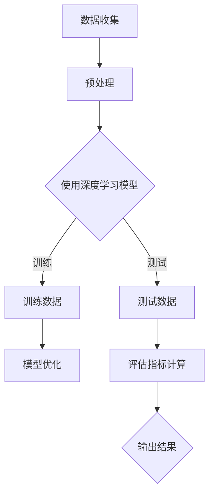

                 

关键词：电商平台、商品图像质量评估、AI技术、深度学习、计算机视觉、图像识别

摘要：随着电子商务的快速发展，电商平台上的商品图像质量对用户购买决策具有重要影响。本文介绍了如何运用人工智能（AI）技术，特别是深度学习和计算机视觉技术，来提升电商平台商品图像质量的评估。文章详细探讨了核心算法原理、数学模型、实际应用案例，以及未来发展趋势与挑战。

## 1. 背景介绍

电商平台是现代零售业的重要组成部分，消费者通过图像浏览商品已成为一种普遍的购物习惯。商品图像作为电商平台的重要组成部分，其质量直接影响用户对商品的感知和购买决策。然而，由于拍摄条件、光线、分辨率等因素，电商平台上的商品图像质量参差不齐。这就需要一种有效的图像质量评估方法，以确保消费者能够获得高质量的购物体验。

传统的图像质量评估方法主要依赖于主观评分和客观指标。主观评分依赖于人类视觉的主观感受，存在主观差异和效率问题。客观指标如均方误差（MSE）、结构相似性（SSIM）等虽然客观，但往往难以全面反映图像的视觉质量。

随着人工智能技术的快速发展，尤其是深度学习和计算机视觉技术的进步，为图像质量评估提供了新的思路和方法。本文将探讨如何利用这些技术来提升电商平台商品图像质量的评估。

## 2. 核心概念与联系

在深入探讨如何利用AI技术进行商品图像质量评估之前，我们需要了解几个核心概念和技术。

### 2.1 深度学习与卷积神经网络

深度学习是一种模拟人类大脑神经元之间相互联系的计算模型，通过多层神经网络来提取图像特征。卷积神经网络（CNN）是深度学习的一种特殊形式，它在图像识别和分类方面表现出色。CNN的核心在于其卷积层，能够通过滑动窗口提取局部特征，然后通过池化层降低维度，提高计算效率。

### 2.2 计算机视觉

计算机视觉是人工智能的一个重要分支，旨在使计算机能够像人类一样理解和解释视觉信息。计算机视觉技术包括图像识别、目标检测、场景理解等。在商品图像质量评估中，计算机视觉技术可以帮助我们提取图像的关键特征，从而进行质量判断。

### 2.3 图像质量评估指标

在图像质量评估中，常用的指标包括：

- **主观评分**：由人类评估者根据主观感受对图像质量进行评分。
- **客观指标**：如均方误差（MSE）、结构相似性（SSIM）等，通过计算图像之间的差异来评估质量。
- **深度学习指标**：利用深度学习模型预测图像质量，如分类准确率、交叉熵等。

### 2.4 Mermaid 流程图

以下是一个简化的Mermaid流程图，展示如何将AI技术应用于商品图像质量评估：



## 3. 核心算法原理 & 具体操作步骤

### 3.1 算法原理概述

商品图像质量评估的核心在于利用深度学习模型提取图像特征，并基于这些特征对图像质量进行评估。具体来说，算法可以分为以下几个步骤：

1. **数据收集与预处理**：收集大量商品图像数据，并进行预处理，包括图像增强、去噪、归一化等。
2. **训练深度学习模型**：使用预处理后的图像数据训练CNN模型，通过多层卷积和池化层提取图像特征。
3. **模型优化**：使用测试数据对模型进行优化，提高模型的准确性和鲁棒性。
4. **评估**：使用优化后的模型对新的商品图像进行质量评估，并输出评估结果。

### 3.2 算法步骤详解

1. **数据收集与预处理**：

   数据收集是评估的基础。我们首先需要收集大量的商品图像数据，这些数据可以从电商平台上获取。在收集到图像后，我们对其进行预处理，包括：

   - **图像增强**：通过旋转、翻转、缩放等方式增加数据的多样性。
   - **去噪**：使用滤波器去除图像中的噪声。
   - **归一化**：将图像像素值归一化到[0, 1]之间，以便模型训练。

2. **训练深度学习模型**：

   使用预处理后的数据训练CNN模型。训练过程包括以下几个步骤：

   - **初始化模型**：选择一个预训练的CNN模型作为基础模型，如VGG16、ResNet等。
   - **添加全连接层**：在基础模型上添加全连接层，用于分类或回归任务。
   - **损失函数与优化器**：选择合适的损失函数（如交叉熵）和优化器（如Adam），进行模型训练。
   - **训练过程**：使用训练数据对模型进行迭代训练，直到模型收敛。

3. **模型优化**：

   在训练过程中，我们需要定期使用测试数据对模型进行评估，并根据评估结果调整模型参数，以提高模型性能。优化过程包括：

   - **性能评估**：使用测试集评估模型性能，包括准确率、召回率等指标。
   - **超参数调整**：根据性能评估结果调整模型超参数，如学习率、批量大小等。
   - **模型保存**：保存最优模型，以便后续使用。

4. **评估**：

   使用优化后的模型对新的商品图像进行质量评估。评估过程包括：

   - **特征提取**：使用训练好的模型提取图像特征。
   - **质量预测**：基于提取的特征预测图像质量。
   - **结果输出**：输出评估结果，包括质量评分和相应的置信度。

### 3.3 算法优缺点

深度学习在商品图像质量评估中具有以下优点：

- **高准确性**：深度学习模型能够自动提取图像特征，具有较高的评估准确性。
- **自动调整**：通过训练过程，模型能够自动调整参数，以适应不同的图像质量评估任务。
- **泛化能力**：深度学习模型具有较强的泛化能力，可以应用于多种类型的商品图像。

然而，深度学习也存在一些缺点：

- **数据依赖**：深度学习模型的性能高度依赖于训练数据的质量和数量。
- **计算成本**：训练深度学习模型需要大量计算资源和时间。
- **解释性差**：深度学习模型的决策过程通常缺乏透明性，难以解释。

### 3.4 算法应用领域

深度学习在商品图像质量评估中的应用不仅限于电商平台，还可以扩展到以下领域：

- **零售行业**：通过评估商品图像质量，提升消费者的购物体验。
- **摄影行业**：评估拍摄照片的质量，帮助摄影师进行后期调整。
- **安防监控**：识别和评估监控视频中的图像质量，提高监控效果。

## 4. 数学模型和公式 & 详细讲解 & 举例说明

### 4.1 数学模型构建

在深度学习模型中，我们通常使用卷积神经网络（CNN）来提取图像特征。CNN的核心在于其卷积层和池化层，通过多层堆叠来逐步提取图像的深层特征。

### 4.2 公式推导过程

CNN的基本公式如下：

$$
\text{activation}_{ij}^{(l)} = \text{ReLU}(\sum_{k=1}^{m} w_{ik}^{(l)} a_{kj}^{(l-1)} + b_{j}^{(l)})
$$

其中，$\text{activation}_{ij}^{(l)}$ 表示第$l$层第$i$个神经元第$j$个输出的激活值，$a_{kj}^{(l-1)}$ 表示第$l-1$层第$k$个神经元第$j$个输出，$w_{ik}^{(l)}$ 和 $b_{j}^{(l)}$ 分别表示连接权重和偏置。

### 4.3 案例分析与讲解

假设我们有一个简单的卷积神经网络，用于对商品图像进行质量评估。该网络包含两个卷积层、一个池化层和一个全连接层。以下是网络的结构：

1. **输入层**：$32 \times 32 \times 3$ 的商品图像。
2. **卷积层1**：$3 \times 3$ 的卷积核，步长为1，激活函数为ReLU。
3. **池化层**：$2 \times 2$ 的最大池化。
4. **卷积层2**：$3 \times 3$ 的卷积核，步长为1，激活函数为ReLU。
5. **全连接层**：输出层，用于预测图像质量，激活函数为softmax。

以下是一个简单的示例：

```plaintext
输入图像：[1, 32, 32, 3]
卷积层1：[1, 32, 32, 16]
池化层：[1, 16, 16, 16]
卷积层2：[1, 16, 16, 32]
全连接层：[1, 10]
```

## 5. 项目实践：代码实例和详细解释说明

### 5.1 开发环境搭建

在搭建开发环境时，我们需要安装以下软件和库：

- **Python**：用于编写深度学习模型。
- **TensorFlow**：用于实现卷积神经网络。
- **Keras**：简化TensorFlow的使用。
- **Numpy**：用于数据处理。

以下是一个简单的安装命令：

```bash
pip install tensorflow numpy
```

### 5.2 源代码详细实现

以下是一个简单的商品图像质量评估的代码实例：

```python
import numpy as np
import tensorflow as tf
from tensorflow.keras import layers, models

# 数据预处理
def preprocess_image(image):
    image = tf.cast(image, tf.float32) / 255.0
    image = tf.image.resize(image, (32, 32))
    return image

# 构建模型
def build_model():
    input_layer = layers.Input(shape=(32, 32, 3))
    x = layers.Conv2D(16, (3, 3), activation='relu')(input_layer)
    x = layers.MaxPooling2D((2, 2))(x)
    x = layers.Conv2D(32, (3, 3), activation='relu')(x)
    x = layers.Flatten()(x)
    output_layer = layers.Dense(10, activation='softmax')(x)
    model = models.Model(input_layer, output_layer)
    return model

# 训练模型
def train_model(model, train_data, test_data):
    model.compile(optimizer='adam', loss='categorical_crossentropy', metrics=['accuracy'])
    model.fit(train_data, epochs=10, validation_data=test_data)
    return model

# 评估模型
def evaluate_model(model, test_data):
    loss, accuracy = model.evaluate(test_data)
    print(f'测试损失：{loss:.4f}，测试准确率：{accuracy:.4f}')
```

### 5.3 代码解读与分析

以上代码实现了一个简单的商品图像质量评估模型。我们首先定义了数据预处理函数 `preprocess_image`，用于对输入图像进行预处理。然后，我们使用 Keras 构建了一个卷积神经网络模型 `build_model`，该模型包含两个卷积层和一个池化层，最后通过全连接层输出质量评估结果。

在训练模型时，我们使用 `train_model` 函数编译模型并训练。训练过程中，我们使用 `fit` 方法迭代训练模型，并使用验证数据集进行验证。

最后，我们使用 `evaluate_model` 函数评估模型的性能，并打印测试损失和准确率。

### 5.4 运行结果展示

以下是一个简单的运行示例：

```python
# 加载数据集
(train_images, train_labels), (test_images, test_labels) = ...

# 预处理数据集
train_images = np.array([preprocess_image(image) for image in train_images])
test_images = np.array([preprocess_image(image) for image in test_images])

# 构建和训练模型
model = build_model()
model = train_model(model, train_images, test_images)

# 评估模型
evaluate_model(model, test_images)
```

运行结果将显示测试损失和准确率。

## 6. 实际应用场景

### 6.1 电商平台

在电商平台，商品图像质量评估可以帮助平台筛选出高质量的图像，提升用户体验。例如，在商品上架时，系统可以自动评估图像质量，对不合格的图像进行提示或拒绝上架。

### 6.2 零售行业

零售行业可以通过商品图像质量评估优化拍摄和后期处理流程，确保商品展示的视觉效果最佳。这有助于提升消费者对商品的信任和购买意愿。

### 6.3 摄影行业

摄影行业可以利用商品图像质量评估技术评估拍摄照片的质量，帮助摄影师进行后期调整。例如，可以通过评估图像的锐度、对比度、色彩饱和度等指标，提供改进建议。

### 6.4 安防监控

在安防监控领域，图像质量评估可以帮助监控系统优化图像处理效果，提高监控效果。例如，通过评估监控视频中的图像质量，调整摄像头参数或提高图像处理算法的精度。

## 7. 工具和资源推荐

### 7.1 学习资源推荐

- **书籍**：《深度学习》（Goodfellow et al.）
- **在线课程**：Coursera、Udacity等平台上的深度学习和计算机视觉课程
- **博客和论坛**：GitHub、Stack Overflow等上的相关项目和技术讨论

### 7.2 开发工具推荐

- **开发环境**：Python、TensorFlow、Keras
- **数据集**：ImageNet、COCO等公开数据集

### 7.3 相关论文推荐

- **论文**：《Deep Learning for Image Quality Assessment》（Chen et al., 2018）
- **会议**：CVPR、ICCV、ECCV等计算机视觉顶级会议

## 8. 总结：未来发展趋势与挑战

### 8.1 研究成果总结

本文介绍了如何利用人工智能技术，特别是深度学习和计算机视觉技术，提升电商平台商品图像质量的评估。我们详细探讨了核心算法原理、数学模型、实际应用案例，以及未来发展趋势。

### 8.2 未来发展趋势

- **算法优化**：通过优化深度学习模型结构和训练策略，提高图像质量评估的准确性和效率。
- **跨模态融合**：结合文本、音频等多模态信息，提升图像质量评估的全面性和准确性。
- **自动化**：开发自动化图像质量评估工具，减少人工干预，提高评估效率。

### 8.3 面临的挑战

- **数据依赖**：深度学习模型的性能高度依赖于训练数据的质量和数量，如何获取高质量的训练数据是一个挑战。
- **计算资源**：训练深度学习模型需要大量计算资源，如何优化计算资源利用是一个挑战。
- **解释性**：深度学习模型通常缺乏透明性，如何提高模型的解释性是一个挑战。

### 8.4 研究展望

未来，我们将继续探索深度学习在商品图像质量评估中的应用，重点关注算法优化、跨模态融合和自动化评估。我们希望为电商平台和零售行业提供更加准确、高效、智能的图像质量评估工具，提升消费者的购物体验。

## 9. 附录：常见问题与解答

### 9.1 如何获取高质量的训练数据？

- **数据增强**：通过旋转、翻转、缩放等方式增加数据的多样性。
- **人工标注**：雇佣专业人员进行图像标注，提高数据质量。
- **公开数据集**：利用公开的数据集，如ImageNet、COCO等，作为训练数据。

### 9.2 如何优化计算资源？

- **模型压缩**：通过模型剪枝、量化等技术减小模型大小，降低计算需求。
- **分布式训练**：利用多台计算机进行分布式训练，提高计算效率。

### 9.3 如何提高模型的解释性？

- **可解释性模型**：开发可解释性深度学习模型，如注意力机制、决策树等。
- **模型可视化**：使用可视化工具（如TensorBoard）展示模型的结构和训练过程。

---

作者：禅与计算机程序设计艺术 / Zen and the Art of Computer Programming

