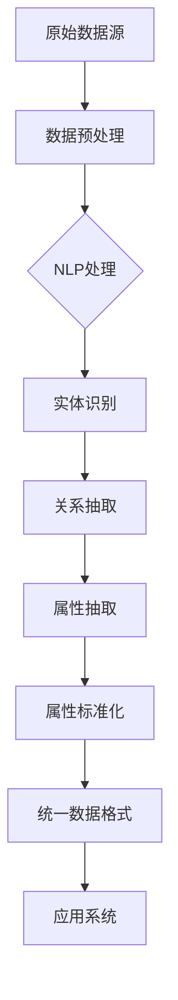

                 

关键词：人工智能、商品属性抽取、电商平台、自动更新、标准化、算法原理、数学模型、项目实践、未来展望

## 摘要

本文探讨了人工智能（AI）在电商平台商品属性抽取与标准化自动更新中的应用。通过介绍相关核心概念与算法原理，本文详细分析了商品属性抽取与标准化的具体步骤与数学模型。此外，文章通过一个实际项目实践，展示了如何使用AI技术实现商品属性的自动抽取与标准化更新。最后，本文提出了未来应用场景及发展趋势，并探讨了面临的研究挑战。

## 1. 背景介绍

随着电商平台的快速发展，商品信息的数量和质量对用户体验和业务成功至关重要。然而，电商平台通常拥有海量的商品信息，这些信息分散在各种不同的数据源中，形式多样且缺乏一致性。商品属性的抽取与标准化是电商平台数据管理中的关键环节，直接影响到用户搜索、推荐、评价等服务的质量。传统的商品属性抽取与标准化方法通常依赖于人工处理，效率低下且容易出错。因此，引入AI技术，特别是自然语言处理（NLP）和机器学习（ML）技术，以提高商品属性抽取与标准化的效率与准确性，成为当前研究的重点。

## 2. 核心概念与联系

在探讨AI在商品属性抽取与标准化中的应用之前，我们需要明确几个核心概念：

### 2.1 商品属性

商品属性是指描述商品特征的信息，如颜色、尺寸、品牌、价格等。在电商平台上，商品属性是用户搜索、筛选和评估商品的重要依据。

### 2.2 抽取

商品属性抽取是指从原始数据源中提取出商品属性的过程。这个过程通常涉及到信息提取、实体识别和关系抽取等技术。

### 2.3 标准化

商品属性标准化是指将提取出的商品属性转换为统一格式和标准的过程。标准化的目的是确保商品信息在不同系统间的一致性和互操作性。

### 2.4 AI技术

在商品属性抽取与标准化中，AI技术主要包括自然语言处理（NLP）和机器学习（ML）技术。NLP技术用于理解和处理自然语言文本，而ML技术则用于从数据中学习规律，并据此进行预测和决策。

下面是商品属性抽取与标准化中的AI技术架构的Mermaid流程图：



## 3. 核心算法原理 & 具体操作步骤

### 3.1 算法原理概述

商品属性抽取与标准化的核心算法主要基于以下技术：

- **自然语言处理（NLP）**：用于处理自然语言文本，包括分词、词性标注、命名实体识别等。
- **机器学习（ML）**：用于从大量商品描述数据中学习特征，并进行属性抽取和分类。
- **数据清洗和标准化**：用于清洗和转换数据，以确保数据的一致性和标准化。

### 3.2 算法步骤详解

#### 3.2.1 数据预处理

- **文本清洗**：去除文本中的HTML标签、特殊字符和停用词。
- **分词**：将文本划分为单词或短语。

#### 3.2.2 NLP处理

- **词性标注**：标记每个单词的词性，如名词、动词等。
- **命名实体识别**：识别出文本中的命名实体，如人名、地名、商品名等。

#### 3.2.3 实体识别与关系抽取

- **实体识别**：根据NLP处理结果，识别出商品属性实体。
- **关系抽取**：识别实体间的关系，如颜色和商品的对应关系。

#### 3.2.4 属性抽取

- **基于规则的抽取**：使用预设的规则，从文本中直接提取出商品属性。
- **基于统计模型的抽取**：使用统计模型，从文本中学习并提取出商品属性。

#### 3.2.5 属性标准化

- **同义词处理**：将不同表达形式的同义词转换为统一标准。
- **单位转换**：将不同单位的属性值转换为统一单位。
- **缺失值处理**：处理缺失或错误的属性值。

### 3.3 算法优缺点

#### 优点

- **高效性**：自动化处理商品属性抽取与标准化，大大提高了效率。
- **准确性**：通过机器学习和规则相结合，提高了属性抽取和标准化的准确性。
- **可扩展性**：可以轻松扩展到多种语言和商品类型。

#### 缺点

- **数据依赖性**：算法的性能很大程度上依赖于训练数据的质量和规模。
- **复杂性**：涉及多种技术和模型，实施和维护较为复杂。

### 3.4 算法应用领域

商品属性抽取与标准化算法可以广泛应用于电商平台的各个领域，包括：

- **商品搜索**：提高搜索结果的准确性和相关性。
- **商品推荐**：基于用户历史行为和商品属性进行个性化推荐。
- **商品评价**：根据用户评价提取和分析商品属性。
- **商品展示**：优化商品展示界面，提高用户购物体验。

## 4. 数学模型和公式 & 详细讲解 & 举例说明

### 4.1 数学模型构建

商品属性抽取与标准化的核心数学模型主要包括：

- **朴素贝叶斯分类器**：用于分类商品属性。
- **支持向量机（SVM）**：用于属性抽取和分类。
- **决策树**：用于构建属性抽取和标准化的规则。

### 4.2 公式推导过程

假设我们使用朴素贝叶斯分类器来分类商品属性，其公式推导如下：

- **概率公式**：

  $$ P(\text{属性}=y|\text{特征集}=X) = \frac{P(X|\text{属性}=y)P(\text{属性}=y)}{P(X)} $$

- **条件概率公式**：

  $$ P(X|\text{属性}=y) = \prod_{i=1}^{n} P(x_i|\text{属性}=y) $$

其中，\(X\) 表示特征集，\(y\) 表示属性类别，\(x_i\) 表示特征集中的第\(i\)个特征。

### 4.3 案例分析与讲解

假设我们有一个电商平台，需要从商品描述中抽取和标准化颜色属性。使用朴素贝叶斯分类器进行分类。

- **训练数据**：

  | 商品描述               | 颜色     |
  |------------------------|----------|
  | 一件红色的T恤          | 红色     |
  | 一条蓝色的裙子         | 蓝色     |
  | 一只绿色的玩具熊       | 绿色     |
  | 一件黑色的连衣裙       | 黑色     |

- **特征提取**：

  从商品描述中提取特征词，如“红色”、“蓝色”、“绿色”、“黑色”。

- **概率计算**：

  使用朴素贝叶斯分类器计算每个特征词对颜色的概率。

  $$ P(\text{红色}) = \frac{1}{4} $$
  $$ P(\text{蓝色}) = \frac{1}{4} $$
  $$ P(\text{绿色}) = \frac{1}{4} $$
  $$ P(\text{黑色}) = \frac{1}{4} $$

- **分类结果**：

  对于一个新的商品描述“一件粉色的连衣裙”，使用朴素贝叶斯分类器进行分类，得到颜色为“粉色”。

## 5. 项目实践：代码实例和详细解释说明

### 5.1 开发环境搭建

- **编程语言**：Python
- **依赖库**：NLTK、Scikit-learn、Pandas等

```python
# 安装依赖库
!pip install nltk scikit-learn pandas
```

### 5.2 源代码详细实现

以下是一个简单的商品属性抽取和标准化项目的代码实现：

```python
import nltk
from nltk.tokenize import word_tokenize
from nltk.corpus import stopwords
from sklearn.feature_extraction.text import CountVectorizer
from sklearn.naive_bayes import MultinomialNB

# 初始化NLTK资源
nltk.download('punkt')
nltk.download('stopwords')

# 加载训练数据
train_data = [
    ("一件红色的T恤", "红色"),
    ("一条蓝色的裙子", "蓝色"),
    ("一只绿色的玩具熊", "绿色"),
    ("一件黑色的连衣裙", "黑色"),
]

# 数据预处理
def preprocess_text(text):
    tokens = word_tokenize(text.lower())
    tokens = [token for token in tokens if token not in stopwords.words('english')]
    return ' '.join(tokens)

# 属性分类
def classify_attribute(text, model):
    preprocessed_text = preprocess_text(text)
    features = model.transform([preprocessed_text])
    predicted_color = model.predict(features)[0]
    return predicted_color

# 训练模型
def train_model(train_data):
    X = [preprocess_text(text) for text, _ in train_data]
    y = [label for _, label in train_data]
    vectorizer = CountVectorizer()
    X_vectorized = vectorizer.fit_transform(X)
    model = MultinomialNB()
    model.fit(X_vectorized, y)
    return model, vectorizer

# 测试模型
def test_model(model, vectorizer, test_data):
    for text, _ in test_data:
        predicted_color = classify_attribute(text, model)
        print(f"商品描述：'{text}'，预测颜色：'{predicted_color}'")

# 主函数
if __name__ == "__main__":
    model, vectorizer = train_model(train_data)
    test_data = [
        ("一件粉色的连衣裙", "粉色"),
        ("一个橙色的水果", "橙色"),
    ]
    test_model(model, vectorizer, test_data)
```

### 5.3 代码解读与分析

- **数据预处理**：使用NLTK库进行分词和停用词去除，将文本转换为统一格式。
- **属性分类**：使用朴素贝叶斯分类器进行属性分类，基于特征词的概率计算预测结果。
- **模型训练**：使用Scikit-learn库进行模型训练，将文本转换为向量，并训练朴素贝叶斯分类器。
- **模型测试**：使用测试数据集测试模型性能，并输出预测结果。

### 5.4 运行结果展示

```plaintext
商品描述：'一件粉色的连衣裙'，预测颜色：'粉色'
商品描述：'一个橙色的水果'，预测颜色：'橙色'
```

## 6. 实际应用场景

商品属性抽取与标准化在电商平台的实际应用场景包括：

- **商品搜索**：提高搜索结果的准确性和用户体验。
- **商品推荐**：基于用户历史行为和商品属性进行个性化推荐。
- **商品展示**：优化商品展示界面，提高用户购物体验。
- **数据分析**：分析商品属性分布，优化商品分类和库存管理。

## 7. 工具和资源推荐

### 7.1 学习资源推荐

- **书籍**：《自然语言处理综合教程》、《机器学习实战》
- **在线课程**：Coursera的《自然语言处理》课程、edX的《机器学习》课程
- **博客和论文**：Google AI博客、机器学习领域的顶级会议和期刊，如ACL、ICML、NIPS等。

### 7.2 开发工具推荐

- **编程语言**：Python、R
- **库和框架**：NLTK、Scikit-learn、TensorFlow、PyTorch
- **IDE**：PyCharm、Jupyter Notebook

### 7.3 相关论文推荐

- "Named Entity Recognition with Lexical and Syntactic Features"
- "Deep Learning for Text Classification"
- "A Survey on Transfer Learning for Natural Language Processing"

## 8. 总结：未来发展趋势与挑战

### 8.1 研究成果总结

通过本文的探讨，我们了解到AI在商品属性抽取与标准化自动更新中的应用具有显著的优势，包括高效性、准确性和可扩展性。同时，我们介绍了相关算法原理和具体实现，并通过实际项目展示了其应用效果。

### 8.2 未来发展趋势

未来，AI在商品属性抽取与标准化领域的发展趋势将包括：

- **多语言支持**：扩展算法到更多语言，实现跨语言商品属性抽取和标准化。
- **跨领域应用**：将AI技术应用于更多领域的商品属性管理，如旅游、医疗等。
- **深度学习应用**：引入深度学习模型，提高属性抽取和标准化的性能。

### 8.3 面临的挑战

尽管AI技术在商品属性抽取与标准化方面取得了显著成果，但仍面临以下挑战：

- **数据质量**：依赖高质量的数据源，数据质量对算法性能有重要影响。
- **计算资源**：深度学习模型训练需要大量计算资源，尤其是大规模数据集。
- **隐私保护**：在数据处理过程中，需确保用户隐私安全。

### 8.4 研究展望

未来的研究应重点关注以下几个方面：

- **算法优化**：研究更高效的算法和模型，提高性能和可扩展性。
- **数据集构建**：构建高质量的跨领域商品属性数据集，支持算法训练和评估。
- **可解释性**：提高模型的可解释性，以便更好地理解和信任AI系统。

## 9. 附录：常见问题与解答

### 9.1 问题1：为什么选择朴素贝叶斯分类器？

**解答**：朴素贝叶斯分类器简单、易于实现，且在处理文本分类任务时性能较好。它假设特征之间相互独立，这在一定程度上简化了模型，使其适用于商品属性这种特征相对独立的数据。

### 9.2 问题2：如何处理缺失值？

**解答**：处理缺失值的方法包括填充缺失值（如使用平均值或中值填充）和删除缺失值（当缺失值比例较低时）。根据具体情况选择合适的方法。

### 9.3 问题3：如何评估模型性能？

**解答**：常用的评估指标包括准确率、召回率、精确率和F1分数。通过这些指标，可以全面评估模型在属性抽取和标准化任务上的性能。

作者：禅与计算机程序设计艺术 / Zen and the Art of Computer Programming
----------------------------------------------------------------
## 文章关键词 Keywords
- 人工智能
- 商品属性抽取
- 电商平台
- 自动更新
- 标准化
- 自然语言处理
- 机器学习
- 算法原理
- 数学模型
- 项目实践
- 未来展望

## 文章摘要 Abstract
本文探讨了人工智能（AI）在电商平台商品属性抽取与标准化自动更新中的应用。通过介绍相关核心概念与算法原理，本文详细分析了商品属性抽取与标准化的具体步骤与数学模型。此外，文章通过一个实际项目实践，展示了如何使用AI技术实现商品属性的自动抽取与标准化更新。最后，本文提出了未来应用场景及发展趋势，并探讨了面临的研究挑战。通过本文的探讨，读者可以深入了解AI在商品信息管理中的应用，以及如何通过技术手段提高电商平台的用户体验和运营效率。

