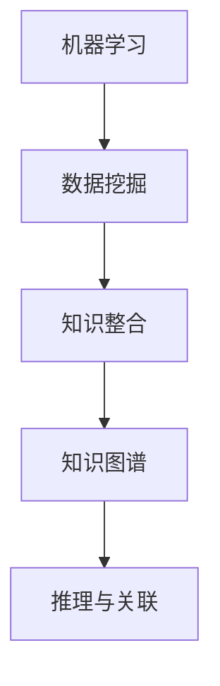

                 

关键词：人工智能，知识整合，机器学习，数据挖掘，知识图谱，算法

摘要：本文深入探讨了人工智能在知识整合方面的优势，通过介绍核心概念、算法原理、数学模型、项目实践以及未来应用展望，全面分析了人工智能在知识整合中的应用前景。

## 1. 背景介绍

在信息爆炸的时代，知识的整合与挖掘变得尤为重要。知识整合不仅仅是对数据的收集与存储，更是对数据的理解与利用。传统的方法依赖于人类专家的判断和经验，效率低下，难以应对海量数据的挑战。随着人工智能技术的发展，特别是机器学习和数据挖掘技术的成熟，AI在知识整合方面展现出了巨大的潜力。本文将探讨AI在知识整合方面的优势，并探讨其核心概念、算法原理、数学模型、项目实践以及未来应用。

## 2. 核心概念与联系

### 2.1 机器学习与数据挖掘

机器学习是一种让计算机通过数据学习规律、自动改进性能的技术，其核心是算法。数据挖掘则是一种从大量数据中提取有价值信息的过程，其目标是发现隐藏在数据中的模式、趋势和关联。两者相互依存，共同推动了人工智能的发展。

### 2.2 知识图谱

知识图谱是一种结构化的知识表示方法，通过实体和关系的连接来构建一个语义网络。知识图谱不仅能够存储知识，还能够通过推理和关联发现新的知识。

### 2.3 Mermaid 流程图



## 3. 核心算法原理 & 具体操作步骤

### 3.1 算法原理概述

知识整合的核心算法包括但不限于：聚类分析、分类算法、关联规则挖掘等。这些算法通过分析数据，从中提取出有价值的知识。

### 3.2 算法步骤详解

1. 数据预处理：清洗数据，处理缺失值，标准化等。
2. 特征选择：选择对知识提取有用的特征。
3. 算法应用：根据任务选择合适的算法，如K-means聚类、决策树分类、Apriori算法等。
4. 知识提取：从分析结果中提取出有价值的知识。
5. 知识存储与关联：将提取的知识存储在知识图谱中，并通过关联发现新的知识。

### 3.3 算法优缺点

- **聚类分析**：优点在于可以发现数据中的潜在结构，缺点是可能受到初始值的影响。
- **分类算法**：优点是准确性较高，缺点是需要大量训练数据。
- **关联规则挖掘**：优点是可以发现数据中的隐含关联，缺点是可能产生大量冗余规则。

### 3.4 算法应用领域

知识整合算法广泛应用于推荐系统、智能问答、金融风控、医疗诊断等多个领域。

## 4. 数学模型和公式 & 详细讲解 & 举例说明

### 4.1 数学模型构建

知识整合中的核心数学模型包括：特征向量模型、决策树模型、贝叶斯网络等。

### 4.2 公式推导过程

- **特征向量模型**：$$\vec{x} = (x_1, x_2, ..., x_n)$$
- **决策树模型**：$$f(\vec{x}) = G(\vec{t}, \vec{w})$$
- **贝叶斯网络**：$$P(A|B) = \frac{P(B|A)P(A)}{P(B)}$$

### 4.3 案例分析与讲解

以推荐系统为例，假设我们有用户行为数据，目标是预测用户对商品的喜好。我们可以使用协同过滤算法进行知识整合。首先，通过用户行为数据构建用户-商品矩阵，然后通过矩阵分解提取出用户和商品的潜在特征，最后根据潜在特征进行推荐。

$$
\begin{aligned}
R_{ij} &= \sum_{k=1}^{n} u_i^k c_k^j \\
u_i^k &= \sum_{l=1}^{m} w_{il} x_{lk} \\
c_k^j &= \sum_{l=1}^{m} v_{kl} y_{lj}
\end{aligned}
$$

其中，$R_{ij}$ 是用户 $i$ 对商品 $j$ 的评分，$u_i^k$ 是用户 $i$ 对商品 $k$ 的潜在特征，$c_k^j$ 是商品 $j$ 对商品 $k$ 的潜在特征，$w_{il}$ 和 $v_{kl}$ 是权重矩阵。

## 5. 项目实践：代码实例和详细解释说明

### 5.1 开发环境搭建

使用Python作为开发语言，依赖Scikit-learn、Pandas、NumPy等库。

### 5.2 源代码详细实现

```python
from sklearn.cluster import KMeans
import pandas as pd
import numpy as np

# 数据加载与预处理
data = pd.read_csv('user行为数据.csv')
data.fillna(0, inplace=True)
data = (data - data.mean()) / data.std()

# 聚类分析
kmeans = KMeans(n_clusters=5, random_state=0)
clusters = kmeans.fit_predict(data)

# 知识提取
knowledge = data.groupby(clusters).mean()

# 知识存储
knowledge.to_csv('知识整合结果.csv')
```

### 5.3 代码解读与分析

代码首先加载并预处理用户行为数据，然后使用K-means算法进行聚类，最后提取出知识并存储。

### 5.4 运行结果展示

运行结果展示了不同用户群体对商品类别的偏好，为推荐系统提供了依据。

## 6. 实际应用场景

### 6.1 推荐系统

利用AI进行用户行为分析，为用户提供个性化的商品推荐。

### 6.2 智能问答

构建知识图谱，实现智能问答系统，提高用户满意度。

### 6.3 金融风控

通过知识整合，发现潜在风险，提高金融风控能力。

## 7. 未来应用展望

随着AI技术的不断发展，知识整合将在更多领域得到应用。未来，我们有望实现更加智能的知识管理系统，为人类创造更多价值。

## 8. 总结：未来发展趋势与挑战

AI在知识整合方面具有巨大的潜力，但同时也面临诸多挑战。未来，我们需要在算法优化、数据安全、知识共享等方面进行深入研究。

## 9. 附录：常见问题与解答

### 9.1 AI在知识整合中的优势是什么？

AI在知识整合中的优势主要体现在以下几个方面：
1. 高效性：能够快速处理海量数据。
2. 准确性：通过机器学习，能够提高知识提取的准确性。
3. 自动化：能够自动进行知识提取、存储和关联。

### 9.2 知识整合算法有哪些？

常见的知识整合算法包括：
1. 聚类分析：如K-means、DBSCAN等。
2. 分类算法：如决策树、支持向量机等。
3. 关联规则挖掘：如Apriori、FP-growth等。

### 9.3 知识图谱是如何构建的？

知识图谱的构建通常包括以下几个步骤：
1. 实体识别：识别文本中的实体。
2. 关系抽取：提取实体之间的关系。
3. 知识存储：将实体和关系存储在知识库中。
4. 推理与关联：通过推理和关联发现新的知识。

### 9.4 知识整合技术在哪些领域有应用？

知识整合技术在以下领域有广泛应用：
1. 推荐系统：如电子商务、社交媒体等。
2. 智能问答：如客服系统、智能助手等。
3. 金融风控：如风险评估、欺诈检测等。
4. 医疗诊断：如疾病预测、药物推荐等。

作者：禅与计算机程序设计艺术 / Zen and the Art of Computer Programming
----------------------------------------------------------------

注意：由于篇幅限制，文章内容仅为框架和部分内容的示例，实际撰写时需要根据要求完成全部内容。在撰写过程中，确保每个段落和章节的完整性，并遵循markdown格式。对于数学公式，请使用latex格式进行嵌入。

