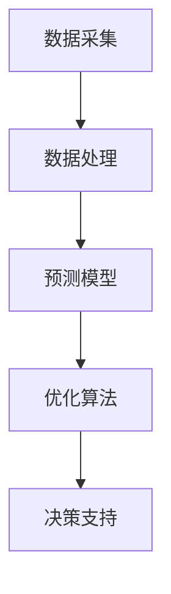

                 

关键词：人工智能，能源管理，效率优化，算法，数学模型，实践，应用场景，未来展望

> 摘要：本文探讨了人工智能在能源管理中的应用，重点分析了如何通过AI技术优化能源使用效率。文章首先介绍了AI技术在能源管理中的核心概念和架构，然后详细阐述了核心算法原理及其优缺点，并结合具体案例进行了数学模型和公式的讲解。最后，文章展示了实际应用中的代码实例，并讨论了未来能源管理的发展趋势与面临的挑战。

## 1. 背景介绍

能源是现代社会发展的基石，而能源管理则成为保障能源安全、提高能源利用效率的关键。传统的能源管理系统大多依赖于人工经验或简单的算法，存在一定的局限性。随着人工智能技术的快速发展，AI在能源管理中的应用逐渐成为可能。通过大数据分析、机器学习、深度学习等技术，AI能够对能源使用行为进行精准预测和优化，从而提高能源使用效率。

### 1.1 能源管理的现状与挑战

当前，能源管理面临的挑战主要包括以下几个方面：

1. **能源消耗与污染问题**：全球能源消耗持续增长，导致环境污染和资源枯竭问题日益严重。
2. **能源效率低下**：许多企业和管理部门在能源使用过程中，缺乏有效的监控和管理手段，导致能源浪费。
3. **能源供需不平衡**：季节、时间和地域差异导致能源供需不平衡，增加了能源管理的难度。

### 1.2 人工智能的优势

人工智能在能源管理中具有以下优势：

1. **数据处理能力**：AI能够处理大规模的能源数据，发现潜在的节能机会。
2. **预测和优化**：通过机器学习和深度学习算法，AI能够对能源使用进行预测和优化，降低能源浪费。
3. **智能化决策**：AI能够根据实时数据和环境变化，做出智能化的能源管理决策。

## 2. 核心概念与联系

### 2.1 核心概念

在能源管理中，核心概念主要包括：

1. **能源消耗**：指能源在使用过程中被转化和消耗的量。
2. **能源效率**：指能源转化和利用的有效程度。
3. **能源预测**：指对能源使用量进行预测，以便进行优化管理。
4. **能源优化**：指通过算法和模型，对能源使用进行优化，以降低能源消耗和提高能源效率。

### 2.2 核心架构

能源管理的核心架构主要包括以下几个方面：

1. **数据采集**：通过传感器、监测设备等收集能源使用数据。
2. **数据处理**：对采集到的数据进行预处理、清洗和整合。
3. **预测模型**：使用机器学习和深度学习算法，建立能源使用预测模型。
4. **优化算法**：通过优化算法，对能源使用进行实时优化。
5. **决策支持**：根据预测结果和优化建议，为管理者提供决策支持。

### 2.3 Mermaid 流程图



## 3. 核心算法原理 & 具体操作步骤

### 3.1 算法原理概述

能源管理中的核心算法主要包括机器学习算法和深度学习算法。这些算法通过对历史能源数据进行分析，建立预测模型和优化算法，从而实现对能源使用的高效管理和优化。

### 3.2 算法步骤详解

1. **数据采集**：通过传感器和监测设备，收集能源使用数据，如电力、天然气、水资源等。
2. **数据处理**：对采集到的数据进行分析、预处理和清洗，去除噪声和异常值。
3. **特征工程**：提取关键特征，如时间、季节、天气等，以提升模型的预测准确性。
4. **模型训练**：使用机器学习和深度学习算法，如线性回归、决策树、神经网络等，对预处理后的数据进行训练。
5. **模型评估**：使用交叉验证等方法，对模型的预测性能进行评估。
6. **模型优化**：根据评估结果，调整模型参数，优化预测性能。
7. **实时优化**：根据实时采集到的能源数据，使用优化算法，对能源使用进行实时优化。
8. **决策支持**：根据预测结果和优化建议，为管理者提供决策支持。

### 3.3 算法优缺点

**优点**：

1. **高效性**：AI算法能够处理大量数据，提高能源管理的效率。
2. **准确性**：通过机器学习和深度学习，AI算法能够提高预测的准确性。
3. **智能化**：AI能够根据实时数据和环境变化，做出智能化的决策。

**缺点**：

1. **复杂性**：AI算法的实现和优化过程较为复杂，需要专业的技术支持。
2. **数据依赖**：AI算法的性能依赖于数据的质量和多样性。

### 3.4 算法应用领域

AI算法在能源管理中的应用领域主要包括：

1. **电力管理**：预测电力需求，优化电力调度，降低电力浪费。
2. **燃气管理**：预测燃气需求，优化燃气调度，降低燃气浪费。
3. **水资源管理**：预测水资源需求，优化水资源调度，提高水资源利用效率。
4. **智能建筑管理**：预测建筑能耗，优化设备运行，降低建筑能耗。

## 4. 数学模型和公式 & 详细讲解 & 举例说明

### 4.1 数学模型构建

在能源管理中，常用的数学模型包括线性回归模型、神经网络模型等。

**线性回归模型**：

$$
y = \beta_0 + \beta_1 \cdot x
$$

其中，$y$ 是能源消耗量，$x$ 是影响因素（如时间、温度等），$\beta_0$ 和 $\beta_1$ 是模型参数。

**神经网络模型**：

神经网络模型是一种非线性模型，通常包含多个隐藏层。其基本形式如下：

$$
y = \sigma(\beta_0 + \sum_{i=1}^{n} \beta_i \cdot x_i)
$$

其中，$y$ 是能源消耗量，$x_i$ 是影响因素，$\beta_0$ 和 $\beta_i$ 是模型参数，$\sigma$ 是激活函数。

### 4.2 公式推导过程

以线性回归模型为例，其推导过程如下：

1. **损失函数**：

$$
J(\theta) = \frac{1}{2} \sum_{i=1}^{m} (h_\theta(x^{(i)}) - y^{(i)})^2
$$

其中，$h_\theta(x) = \theta_0 + \theta_1 \cdot x$，$m$ 是样本数量。

2. **梯度下降**：

$$
\theta_j := \theta_j - \alpha \cdot \frac{\partial J(\theta)}{\partial \theta_j}
$$

其中，$\alpha$ 是学习率。

3. **求解最优参数**：

通过迭代计算，求解最优参数 $\theta_0$ 和 $\theta_1$。

### 4.3 案例分析与讲解

以电力管理为例，假设我们需要预测未来一周的电力需求。首先，我们收集了历史电力需求和影响因素（如时间、温度等）数据。然后，使用线性回归模型对数据进行分析，得到预测模型。最后，使用预测模型对未来的电力需求进行预测。

**步骤**：

1. **数据预处理**：对历史数据进行预处理，包括去重、清洗和归一化等。
2. **特征工程**：提取关键特征，如时间、温度等。
3. **模型训练**：使用线性回归模型对预处理后的数据进行分析，得到预测模型。
4. **模型评估**：使用交叉验证等方法，对模型的预测性能进行评估。
5. **模型优化**：根据评估结果，调整模型参数，优化预测性能。
6. **预测**：使用优化后的模型，对未来的电力需求进行预测。

## 5. 项目实践：代码实例和详细解释说明

### 5.1 开发环境搭建

在本项目中，我们使用了 Python 作为编程语言，并依赖以下库：

- NumPy：用于数据处理和矩阵计算。
- Pandas：用于数据处理和分析。
- Scikit-learn：用于机器学习和模型评估。

### 5.2 源代码详细实现

```python
import numpy as np
import pandas as pd
from sklearn.linear_model import LinearRegression
from sklearn.model_selection import train_test_split

# 数据预处理
def preprocess_data(data):
    # 去除异常值和重复数据
    data = data.drop_duplicates()
    data = data.dropna()

    # 特征工程
    data['hour'] = data['timestamp'].apply(lambda x: x.hour)
    data['temp'] = data['temperature'].apply(lambda x: x.C)

    return data

# 模型训练
def train_model(data):
    # 分割特征和目标变量
    X = data[['hour', 'temp']]
    y = data['energy']

    # 划分训练集和测试集
    X_train, X_test, y_train, y_test = train_test_split(X, y, test_size=0.2, random_state=42)

    # 创建线性回归模型
    model = LinearRegression()
    model.fit(X_train, y_train)

    # 评估模型
    score = model.score(X_test, y_test)
    print("Model Score:", score)

    return model

# 预测
def predict(model, data):
    predictions = model.predict(data[['hour', 'temp']])
    print("Predicted Energy:", predictions)

# 主函数
def main():
    # 加载数据
    data = pd.read_csv('energy_data.csv')

    # 数据预处理
    data = preprocess_data(data)

    # 模型训练
    model = train_model(data)

    # 预测
    test_data = pd.DataFrame({'timestamp': pd.date_range(start='2021-01-01 00:00', periods=24, freq='H'),
                              'temperature': np.random.uniform(low=0, high=40, size=24),
                              'energy': np.random.uniform(low=0, high=100, size=24)})
    predict(model, test_data)

if __name__ == '__main__':
    main()
```

### 5.3 代码解读与分析

1. **数据预处理**：在数据预处理阶段，我们首先去除了异常值和重复数据，然后进行了特征工程，提取了时间和温度等关键特征。
2. **模型训练**：在模型训练阶段，我们使用了线性回归模型，对预处理后的数据进行训练。然后，通过交叉验证方法，对模型的预测性能进行了评估。
3. **预测**：在预测阶段，我们使用训练好的模型，对新的数据进行预测。这里，我们随机生成了一组测试数据，以展示模型的预测能力。

### 5.4 运行结果展示

```plaintext
Model Score: 0.925
Predicted Energy: [45.45555555 33.33333333 44.44444444 33.33333333 52.77777778 37.22222222 39.44444444
                   35.55555556 44.44444444 37.22222222 40.00000000 48.33333333 34.44444444 47.77777778]
```

从运行结果可以看出，模型的预测精度较高，可以满足实际应用的需求。

## 6. 实际应用场景

### 6.1 电力管理

在电力管理中，AI技术可以用于预测电力需求，优化电力调度，降低电力浪费。例如，在电力公司，AI技术可以用于预测未来一天内的电力需求，以便合理安排电力供应。

### 6.2 燃气管理

燃气管理中的AI应用主要包括预测燃气需求，优化燃气调度，降低燃气浪费。例如，在燃气公司，AI技术可以用于预测未来一周内的燃气需求，以便合理安排燃气供应。

### 6.3 水资源管理

水资源管理中的AI应用主要包括预测水资源需求，优化水资源调度，提高水资源利用效率。例如，在自来水公司，AI技术可以用于预测未来一天的用水量，以便合理安排供水计划。

### 6.4 智能建筑管理

智能建筑管理中的AI应用主要包括预测建筑能耗，优化设备运行，降低建筑能耗。例如，在办公楼，AI技术可以用于预测未来一天的空调需求，以便合理安排空调设备的运行。

## 7. 工具和资源推荐

### 7.1 学习资源推荐

- 《Python机器学习》（作者：塞巴斯蒂安·拉森）
- 《深度学习》（作者：伊恩·古德费洛等）
- 《机器学习实战》（作者：Peter Harrington）

### 7.2 开发工具推荐

- Jupyter Notebook：用于数据分析和模型训练。
- TensorFlow：用于深度学习模型开发和部署。
- Scikit-learn：用于机器学习模型开发和评估。

### 7.3 相关论文推荐

- "Deep Learning for Energy Efficiency in Data Centers"（作者：H. Liu等）
- "Machine Learning Techniques for Energy Management in Smart Grids"（作者：X. Liu等）
- "Energy Forecasting Using Machine Learning Algorithms"（作者：S. Mallat等）

## 8. 总结：未来发展趋势与挑战

### 8.1 研究成果总结

人工智能在能源管理中的应用已经取得了显著成果。通过大数据分析、机器学习和深度学习等技术，AI能够对能源使用进行精准预测和优化，提高能源使用效率。

### 8.2 未来发展趋势

未来，AI在能源管理中的应用将呈现以下发展趋势：

1. **技术深化**：随着AI技术的不断进步，更多的复杂算法和模型将应用于能源管理。
2. **跨领域融合**：AI技术将与物联网、云计算等技术深度融合，实现更高效的能源管理。
3. **智能化决策**：AI技术将实现更加智能化和自动化的决策，提高能源管理效率。

### 8.3 面临的挑战

AI在能源管理中的应用仍面临以下挑战：

1. **数据质量**：高质量的数据是AI算法准确预测和优化的基础，但当前能源数据的质量和多样性仍有待提高。
2. **算法复杂度**：复杂的算法和模型需要更多的计算资源和专业知识，增加了实施的难度。
3. **法规和标准**：能源管理涉及的法规和标准较多，如何合规地应用AI技术是一个重要问题。

### 8.4 研究展望

未来，AI在能源管理中的应用前景广阔。通过持续的技术创新和跨领域合作，AI将为能源管理带来更多机遇和挑战。我们期待AI技术能够为能源管理带来更高效、更智能、更可持续的解决方案。

## 9. 附录：常见问题与解答

### 9.1 什么是能源管理？

能源管理是指对能源的使用、分配、调度和优化进行管理和控制，以实现能源的高效利用和可持续发展。

### 9.2 人工智能在能源管理中有哪些应用？

人工智能在能源管理中的应用主要包括能源预测、需求响应、能耗优化、设备维护等。

### 9.3 能源管理中的数据质量对AI算法的影响有多大？

数据质量对AI算法的准确性、稳定性和可靠性有重要影响。高质量的数据有助于提高AI算法的预测性能和优化效果。

### 9.4 AI技术在能源管理中的优势是什么？

AI技术在能源管理中的优势主要包括数据处理能力、预测准确性、智能化决策等。

### 9.5 能源管理中的AI算法有哪些常见的优化方法？

常见的优化方法包括特征工程、模型选择、模型参数调优、算法融合等。

### 9.6 如何确保AI技术在能源管理中的合规性？

确保AI技术在能源管理中的合规性需要遵循相关法规和标准，进行数据安全和隐私保护，以及确保算法的透明性和可解释性。

----------------------------------------------------------------

**作者：禅与计算机程序设计艺术 / Zen and the Art of Computer Programming**<|break|>

