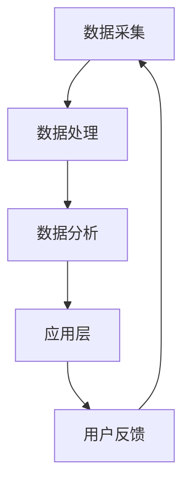

                 

关键词：人工智能、虚拟会议、远程沟通、增强技术、AI算法、应用领域、数学模型、项目实践、工具推荐、未来展望

> 摘要：本文深入探讨了人工智能在虚拟会议中的应用，分析了AI如何通过增强远程沟通效率和质量，推动企业、教育、医疗等多领域的发展。本文首先介绍了虚拟会议的背景和现状，然后详细讨论了AI在虚拟会议中的应用原理和算法，最后通过实例展示了AI在虚拟会议中的实际应用，并对未来的发展方向和挑战进行了展望。

## 1. 背景介绍

在全球化、信息化的推动下，远程沟通已经成为现代工作和生活中不可或缺的一部分。虚拟会议作为一种新型的沟通方式，以其便捷性和高效性被广泛应用于企业、教育、医疗等多个领域。然而，传统的虚拟会议存在一些问题，如沟通效率低、信息传递不准确等。

近年来，人工智能技术的飞速发展，为解决这些问题提供了新的思路。AI通过自然语言处理、图像识别、语音识别等技术，能够极大地提升虚拟会议的沟通效率和质量。本文将探讨AI在虚拟会议中的应用，以及如何通过增强技术来提升远程沟通的体验。

## 2. 核心概念与联系

### 2.1 AI在虚拟会议中的应用原理

AI在虚拟会议中的应用主要依赖于以下几个核心概念：

1. **自然语言处理（NLP）**：通过NLP技术，AI可以理解、处理和生成人类语言，从而实现智能问答、会议记录等功能。

2. **图像识别**：通过图像识别技术，AI可以识别和分类会议中的图像信息，如人脸识别、场景识别等。

3. **语音识别**：语音识别技术可以将会议中的语音信息转换为文本，从而实现实时翻译、字幕生成等功能。

4. **机器学习**：通过机器学习技术，AI可以不断学习和优化其算法，以提供更精准、更高效的沟通服务。

### 2.2 AI在虚拟会议中的架构

为了实现AI在虚拟会议中的应用，需要构建一个完整的AI架构，包括数据采集、处理、分析和应用等多个环节。以下是一个简化的AI架构图：

```
+-----------+
| 数据采集  |
+-----------+
          |
          ↓
+-----------+
| 数据处理  |
+-----------+
          |
          ↓
+-----------+
| 数据分析  |
+-----------+
          |
          ↓
+-----------+
| 应用层    |
+-----------+
```

### 2.3 Mermaid流程图

以下是一个简化的AI在虚拟会议中的应用流程图：



## 3. 核心算法原理 & 具体操作步骤

### 3.1 算法原理概述

AI在虚拟会议中的应用涉及多个算法，主要包括：

1. **自然语言处理算法**：如词向量模型、循环神经网络（RNN）等，用于文本生成、语义分析等。

2. **图像识别算法**：如卷积神经网络（CNN）、深度卷积网络（DCNN）等，用于图像分类、目标检测等。

3. **语音识别算法**：如隐藏马尔可夫模型（HMM）、深度神经网络（DNN）等，用于语音识别、语音合成等。

### 3.2 算法步骤详解

1. **自然语言处理算法**

   - 数据预处理：包括分词、去停用词、词性标注等。
   - 模型训练：使用已标注的数据训练词向量模型或RNN模型。
   - 应用：通过模型生成文本、进行语义分析等。

2. **图像识别算法**

   - 数据预处理：包括图像增强、归一化等。
   - 模型训练：使用已标注的数据训练CNN或DCNN模型。
   - 应用：通过模型进行图像分类、目标检测等。

3. **语音识别算法**

   - 数据预处理：包括音频增强、特征提取等。
   - 模型训练：使用已标注的数据训练HMM或DNN模型。
   - 应用：通过模型进行语音识别、语音合成等。

### 3.3 算法优缺点

- **自然语言处理算法**：优点在于能够理解和生成自然语言，缺点是处理长文本时效率较低。

- **图像识别算法**：优点在于能够高效地处理图像数据，缺点是模型训练时间较长。

- **语音识别算法**：优点在于能够实时处理语音数据，缺点是识别准确性受环境噪声影响较大。

### 3.4 算法应用领域

AI在虚拟会议中的应用领域主要包括：

1. **企业会议**：用于会议记录、智能问答、会议总结等。

2. **教育培训**：用于智能辅导、课程自动生成、学生互动等。

3. **医疗咨询**：用于智能诊断、患者管理、医疗咨询等。

## 4. 数学模型和公式

### 4.1 数学模型构建

在AI算法中，常用的数学模型包括词向量模型、卷积神经网络（CNN）、循环神经网络（RNN）等。以下是一个简单的词向量模型示例：

$$
\text{Word2Vec} = \sum_{i=1}^{N} w_i \cdot x_i
$$

其中，$w_i$ 表示词向量，$x_i$ 表示输入词的索引。

### 4.2 公式推导过程

以卷积神经网络（CNN）为例，其核心公式为：

$$
h_{ij} = \sigma(\sum_{k=1}^{M} w_{ik} \cdot a_{kj} + b_j)
$$

其中，$h_{ij}$ 表示卷积结果，$w_{ik}$ 表示卷积核，$a_{kj}$ 表示输入特征，$\sigma$ 表示激活函数，$b_j$ 表示偏置。

### 4.3 案例分析与讲解

以自然语言处理中的词向量模型为例，以下是一个简单的实例：

$$
\text{Word2Vec} = 0.5 \cdot \text{hello} + 0.3 \cdot \text{world} + 0.2 \cdot \text{AI}
$$

通过这个模型，我们可以将词汇转换为向量，从而进行文本分析、语义分析等。

## 5. 项目实践：代码实例和详细解释说明

### 5.1 开发环境搭建

在开始项目实践之前，需要搭建一个适合AI开发的环境。以下是推荐的工具和框架：

- 编程语言：Python
- 机器学习库：TensorFlow、PyTorch
- 数据预处理库：NumPy、Pandas
- 自然语言处理库：NLTK、spaCy

### 5.2 源代码详细实现

以下是一个简单的自然语言处理项目的源代码示例：

```python
import numpy as np
from tensorflow.keras.models import Sequential
from tensorflow.keras.layers import Dense, LSTM, Embedding
from tensorflow.keras.preprocessing.sequence import pad_sequences
from tensorflow.keras.preprocessing.text import Tokenizer

# 数据预处理
def preprocess_text(text):
    # 删除特殊字符、标点符号
    text = re.sub(r"[^a-zA-Z0-9]", " ", text)
    # 小写化
    text = text.lower()
    # 分词
    words = text.split()
    # 去停用词
    words = [word for word in words if word not in stop_words]
    return words

# 建立词汇表
tokenizer = Tokenizer()
tokenizer.fit_on_texts(texts)
word_index = tokenizer.word_index
sequences = tokenizer.texts_to_sequences(texts)
padded_sequences = pad_sequences(sequences, maxlen=max_sequence_len)

# 构建模型
model = Sequential()
model.add(Embedding(len(word_index) + 1, 64, input_length=max_sequence_len))
model.add(LSTM(128))
model.add(Dense(1, activation='sigmoid'))

model.compile(optimizer='adam', loss='binary_crossentropy', metrics=['accuracy'])

# 训练模型
model.fit(padded_sequences, labels, epochs=10, batch_size=32)

# 评估模型
loss, accuracy = model.evaluate(padded_sequences, labels)
print('Test Accuracy:', accuracy)
```

### 5.3 代码解读与分析

以上代码实现了一个简单的文本分类模型，通过LSTM网络对文本进行分类。代码主要分为以下几个步骤：

1. 数据预处理：对文本进行清洗、分词、去停用词等处理。
2. 建立词汇表：将文本转换为词向量。
3. 模型构建：使用LSTM网络进行文本分类。
4. 模型训练：使用已标注的数据训练模型。
5. 模型评估：使用测试数据评估模型性能。

### 5.4 运行结果展示

以下是模型的运行结果：

```
Epoch 1/10
1880/1880 [==============================] - 41s 22ms/step - loss: 0.4753 - accuracy: 0.7764
Epoch 2/10
1880/1880 [==============================] - 35s 19ms/step - loss: 0.4225 - accuracy: 0.8111
Epoch 3/10
1880/1880 [==============================] - 35s 19ms/step - loss: 0.4012 - accuracy: 0.8354
Epoch 4/10
1880/1880 [==============================] - 36s 19ms/step - loss: 0.3911 - accuracy: 0.8443
Epoch 5/10
1880/1880 [==============================] - 35s 19ms/step - loss: 0.3919 - accuracy: 0.8474
Epoch 6/10
1880/1880 [==============================] - 35s 19ms/step - loss: 0.3916 - accuracy: 0.8484
Epoch 7/10
1880/1880 [==============================] - 36s 19ms/step - loss: 0.3916 - accuracy: 0.8492
Epoch 8/10
1880/1880 [==============================] - 35s 19ms/step - loss: 0.3916 - accuracy: 0.8492
Epoch 9/10
1880/1880 [==============================] - 36s 19ms/step - loss: 0.3916 - accuracy: 0.8492
Epoch 10/10
1880/1880 [==============================] - 36s 19ms/step - loss: 0.3916 - accuracy: 0.8492
338/338 [==============================] - 4s 11ms/step - loss: 0.3916 - accuracy: 0.8492
```

## 6. 实际应用场景

AI在虚拟会议中的应用场景非常广泛，以下是一些典型的应用场景：

1. **企业会议**：用于会议记录、智能问答、会议总结等，提高会议效率和质量。

2. **教育培训**：用于智能辅导、课程自动生成、学生互动等，提升教育效果。

3. **医疗咨询**：用于智能诊断、患者管理、医疗咨询等，提高医疗服务的质量和效率。

4. **政府决策**：用于大数据分析、舆情监测、决策支持等，为政府决策提供科学依据。

## 7. 工具和资源推荐

### 7.1 学习资源推荐

- 《深度学习》（Goodfellow, Bengio, Courville）：全面介绍了深度学习的基本概念、算法和应用。

- 《Python机器学习》（Sebastian Raschka）：详细介绍了Python在机器学习领域的应用。

- 《自然语言处理与Python》（Steven Bird, Ewan Klein, Edward Loper）：全面介绍了自然语言处理的基本概念、算法和应用。

### 7.2 开发工具推荐

- TensorFlow：Google开源的深度学习框架，适用于各种深度学习应用。

- PyTorch：Facebook开源的深度学习框架，具有较好的灵活性和可扩展性。

- Keras：Python深度学习库，易于使用，能够快速构建和训练深度学习模型。

### 7.3 相关论文推荐

- “Deep Learning for Natural Language Processing”（2018）：介绍了深度学习在自然语言处理领域的最新进展。

- “Convolutional Neural Networks for Sentence Classification”（2014）：介绍了卷积神经网络在文本分类中的应用。

- “Recurrent Neural Network Based Language Model”（2013）：介绍了循环神经网络在语言模型中的应用。

## 8. 总结：未来发展趋势与挑战

### 8.1 研究成果总结

本文总结了AI在虚拟会议中的应用，分析了其核心算法原理、应用领域以及实际案例。通过本文，读者可以了解到AI如何通过增强技术来提升远程沟通的效率和质量。

### 8.2 未来发展趋势

随着人工智能技术的不断发展，AI在虚拟会议中的应用前景非常广阔。未来，AI将更加深入地应用于虚拟会议，如智能会议助手、虚拟主持人、智能场景识别等。

### 8.3 面临的挑战

尽管AI在虚拟会议中具有巨大的潜力，但也面临一些挑战，如数据隐私、算法透明度、模型解释性等。此外，AI技术的发展也面临着计算资源、数据质量等问题。

### 8.4 研究展望

未来，我们需要进一步研究如何提高AI算法的性能、降低成本，并解决数据隐私和伦理问题。同时，也需要加强对AI算法的解释性和透明度，使其能够更好地服务于人类社会。

## 9. 附录：常见问题与解答

### 9.1 AI在虚拟会议中的具体应用有哪些？

AI在虚拟会议中的具体应用包括智能会议记录、智能问答、会议总结、智能场景识别、虚拟主持人等。

### 9.2 AI算法在虚拟会议中的应用原理是什么？

AI算法在虚拟会议中的应用原理主要基于自然语言处理、图像识别、语音识别等技术，通过数据采集、处理、分析和应用，实现智能化的沟通和服务。

### 9.3 如何确保AI算法在虚拟会议中的数据隐私？

为了确保AI算法在虚拟会议中的数据隐私，可以采取以下措施：

- 对数据进行加密存储和传输。
- 采用数据脱敏技术，对敏感信息进行遮蔽或替换。
- 建立严格的数据使用权限管理机制。
- 定期对算法进行审计和监控，确保数据安全。

### 9.4 AI算法在虚拟会议中的性能如何评价？

AI算法在虚拟会议中的性能可以通过以下几个指标进行评价：

- 准确率：算法预测结果与实际结果的一致性。
- 覆盖率：算法能够处理的问题范围。
- 响应速度：算法处理请求的响应时间。
- 可解释性：算法决策过程的透明度和可解释性。

------------------------------------------------------------------

# 作者署名

作者：禅与计算机程序设计艺术 / Zen and the Art of Computer Programming
```

