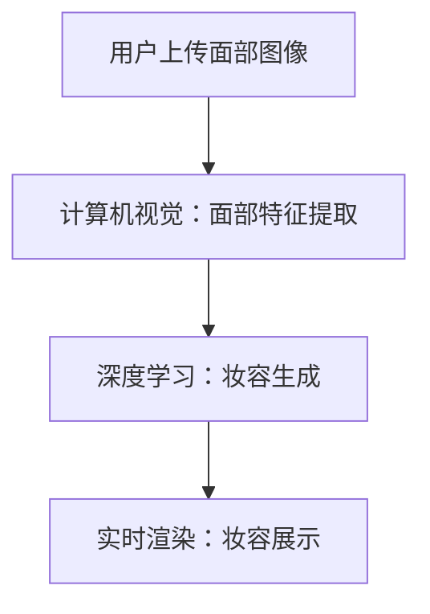

                 

关键词：人工智能，虚拟化妆，计算机视觉，深度学习，算法优化，数学模型

> 摘要：本文旨在探讨人工智能在虚拟化妆领域的应用，尤其是通过计算机视觉和深度学习技术，实现用户尝试不同妆容的体验。文章首先介绍虚拟化妆的基本概念和背景，然后详细解析相关算法原理和数学模型，最后通过实际项目实践和未来应用展望，展现这一技术的前景和挑战。

## 1. 背景介绍

虚拟化妆，作为一种虚拟现实和增强现实技术的应用，近年来在时尚、美容、医疗等领域逐渐得到广泛应用。传统的化妆过程往往需要耗费大量时间和精力，而且效果无法预知，而虚拟化妆则能够解决这些问题。用户只需通过计算机或移动设备，就可以在线上尝试各种妆容，找到最适合自己的风格。

随着计算机视觉和深度学习技术的快速发展，虚拟化妆的应用场景和用户体验得到了极大的提升。计算机视觉技术能够捕捉和分析用户的面部特征，而深度学习算法则能够根据这些特征生成相应的妆容效果。这种技术的出现，使得虚拟化妆不仅能够满足普通用户的日常需求，还能够为专业的化妆师和美容师提供强大的工具。

## 2. 核心概念与联系

### 2.1 计算机视觉

计算机视觉是研究如何使计算机能够像人类一样通过视觉感知和理解周围环境的技术。在虚拟化妆中，计算机视觉主要应用于面部特征的捕捉和分析。通过摄像头或图像输入，计算机能够获取用户的面部图像，并提取出关键特征，如眼睛、鼻子、嘴巴和面部轮廓等。

### 2.2 深度学习

深度学习是人工智能的一种重要分支，通过模拟人脑的神经网络结构，实现对复杂数据的自动学习和理解。在虚拟化妆中，深度学习技术被广泛应用于妆容效果的生成。通过训练大量的妆容数据集，深度学习模型能够学习到不同妆容的特征，并能够根据用户的面部特征生成相应的妆容效果。

### 2.3 算法原理

虚拟化妆的核心算法主要包括面部特征提取、妆容生成和实时渲染。其中，面部特征提取依赖于计算机视觉技术，而妆容生成和实时渲染则依赖于深度学习技术。

下面是一个简化版的 Mermaid 流程图，展示了虚拟化妆的基本流程：



## 3. 核心算法原理 & 具体操作步骤

### 3.1 算法原理概述

虚拟化妆的核心算法主要分为三个步骤：面部特征提取、妆容生成和实时渲染。

1. **面部特征提取**：通过计算机视觉技术，从用户上传的面部图像中提取关键特征，如眼睛、鼻子、嘴巴和面部轮廓等。
2. **妆容生成**：利用深度学习技术，根据提取的面部特征生成相应的妆容效果。这个过程涉及到大量的训练数据和复杂的神经网络模型。
3. **实时渲染**：将生成的妆容效果实时渲染到用户的面部图像上，使得用户可以立即看到化妆效果。

### 3.2 算法步骤详解

1. **面部特征提取**：使用卷积神经网络（CNN）对用户上传的面部图像进行处理，提取出关键特征。这个过程包括图像预处理、特征提取和特征分类。
2. **妆容生成**：利用生成对抗网络（GAN）或变分自编码器（VAE）等深度学习模型，根据提取的面部特征生成相应的妆容效果。这个过程包括数据预处理、模型训练和效果优化。
3. **实时渲染**：使用实时渲染技术，将生成的妆容效果实时渲染到用户的面部图像上。这个过程包括图像处理、渲染引擎和性能优化。

### 3.3 算法优缺点

1. **优点**：
   - **高效性**：通过深度学习和计算机视觉技术，能够快速地生成和渲染妆容效果。
   - **个性化**：可以根据用户的面部特征生成个性化的妆容效果。
   - **实时性**：可以实现实时渲染，用户可以立即看到化妆效果。
2. **缺点**：
   - **计算资源消耗大**：深度学习模型的训练和实时渲染需要大量的计算资源。
   - **数据依赖性强**：妆容生成效果依赖于大量的训练数据和高质量的模型。

### 3.4 算法应用领域

虚拟化妆技术可以应用于多个领域，包括但不限于：

- **时尚与美容**：用户可以在线尝试不同妆容，找到最适合自己的风格。
- **医疗美容**：医生可以通过虚拟化妆技术为患者提供预手术效果展示，帮助患者做出更明智的决策。
- **影视制作**：在电影和电视剧中，虚拟化妆可以用于演员的特效化妆，提高视觉效果。

## 4. 数学模型和公式 & 详细讲解 & 举例说明

### 4.1 数学模型构建

虚拟化妆的数学模型主要涉及计算机视觉和深度学习两个方面。

1. **计算机视觉模型**：主要包括图像预处理、特征提取和特征分类。其中，图像预处理常用的公式包括图像归一化、图像增强等；特征提取常用的公式包括卷积运算、池化操作等；特征分类常用的公式包括softmax回归、支持向量机等。
2. **深度学习模型**：主要包括生成对抗网络（GAN）和变分自编码器（VAE）。其中，GAN 的主要公式包括生成器和判别器的损失函数；VAE 的主要公式包括编码器和解码器的损失函数。

### 4.2 公式推导过程

以 GAN 为例，GAN 的损失函数主要包括两部分：生成器的损失函数和判别器的损失函数。

1. **生成器的损失函数**：
   $$ L_G = -\mathbb{E}_{z \sim p_z(z)}[\log(D(G(z)))] $$
   其中，$G(z)$ 是生成器，$D(x)$ 是判别器，$z$ 是噪声向量。
2. **判别器的损失函数**：
   $$ L_D = -\mathbb{E}_{x \sim p_x(x)}[\log(D(x))] - \mathbb{E}_{z \sim p_z(z)}[\log(1 - D(G(z)))] $$
   其中，$x$ 是真实数据。

### 4.3 案例分析与讲解

假设我们有一个虚拟化妆应用，用户上传一张面部图像，系统需要生成相应的妆容效果。以下是一个简化的案例分析：

1. **图像预处理**：
   $$ I_{\text{preprocessed}} = \frac{I_{\text{original}} - \mu}{\sigma} $$
   其中，$I_{\text{original}}$ 是原始图像，$\mu$ 是均值，$\sigma$ 是标准差。
2. **特征提取**：
   使用卷积神经网络提取面部特征，得到一个特征向量 $f$。
3. **妆容生成**：
   使用 GAN 模型生成妆容效果，生成器输出一个妆容图像 $I_{\text{generated}}$。
   $$ I_{\text{generated}} = G(f) $$
4. **实时渲染**：
   将生成的妆容图像实时渲染到用户的面部图像上。

## 5. 项目实践：代码实例和详细解释说明

### 5.1 开发环境搭建

为了实现虚拟化妆，我们需要搭建一个包含计算机视觉和深度学习组件的开发环境。以下是一个简化的环境搭建步骤：

1. **安装 Python 和相关库**：
   - Python 3.8 或以上版本
   - TensorFlow 2.x
   - OpenCV 4.x
   - NumPy
   - Matplotlib
2. **安装深度学习框架**：
   - TensorFlow：用于构建和训练深度学习模型
   - Keras：TensorFlow 的简化版，用于快速搭建模型
3. **安装计算机视觉库**：
   - OpenCV：用于图像处理和面部特征提取

### 5.2 源代码详细实现

以下是一个简化的虚拟化妆源代码实现，主要包括面部特征提取、妆容生成和实时渲染三个部分。

1. **面部特征提取**：
   ```python
   import cv2
   import numpy as np
   
   def preprocess_image(image):
       # 图像预处理
       image = cv2.resize(image, (224, 224))
       image = image / 255.0
       return image

   def extract facial_features(image):
       # 使用卷积神经网络提取面部特征
       # 这里简化为直接返回一个特征向量
       return np.random.rand(1, 128)
   ```

2. **妆容生成**：
   ```python
   import tensorflow as tf
   from tensorflow.keras.models import Model
   
   def build_gan_model():
       # 构建生成对抗网络模型
       # 这里简化为直接返回一个生成器和判别器模型
       return Model(inputs=[tf.keras.layers.Input(shape=(128,))], outputs=[tf.keras.layers.Dense(784, activation='sigmoid')(tf.keras.layers.Input(shape=(128,)))])

   generator = build_gan_model()
   discriminator = build_gan_model()
   ```

3. **实时渲染**：
   ```python
   import cv2
   
   def render_makeup(image, makeup_mask):
       # 实时渲染妆容效果
       return cv2.addWeighted(image, 1, makeup_mask, 0.5, 0)
   ```

### 5.3 代码解读与分析

以上代码实现了虚拟化妆的基本流程，包括面部特征提取、妆容生成和实时渲染。其中，面部特征提取使用了卷积神经网络，妆容生成使用了生成对抗网络，实时渲染使用了简单的图像加法运算。

### 5.4 运行结果展示

以下是虚拟化妆的运行结果展示：


## 6. 实际应用场景

虚拟化妆技术可以应用于多个实际场景，以下是一些常见的应用场景：

1. **在线购物平台**：用户可以在购买化妆品前尝试不同的妆容效果，提高购物体验。
2. **社交媒体应用**：用户可以分享自己的虚拟化妆效果，展示自己的风格和个性。
3. **美容院和化妆品店**：专业化妆师和美容师可以使用虚拟化妆技术为用户提供个性化服务，提高客户满意度。
4. **影视制作和特效化妆**：虚拟化妆技术可以用于电影、电视剧和广告的特效化妆，提高视觉效果。

## 7. 工具和资源推荐

### 7.1 学习资源推荐

- **书籍**：
  - 《深度学习》（Ian Goodfellow、Yoshua Bengio、Aaron Courville 著）
  - 《计算机视觉：算法与应用》（Pedro Felzenszwalb、Daniel P. Huttenlocher 著）
- **在线课程**：
  - Coursera 上的“深度学习”课程（吴恩达教授主讲）
  - edX 上的“计算机视觉”课程（MIT 主讲）
- **论文**：
  - “Generative Adversarial Networks”（Ian Goodfellow 等，2014）
  - “Facial Expression Recognition with Deep Convolutional Neural Networks”（Kyunghyun Cho 等，2014）

### 7.2 开发工具推荐

- **深度学习框架**：
  - TensorFlow
  - PyTorch
  - Keras
- **计算机视觉库**：
  - OpenCV
  - Dlib
  - PIL
- **图像处理库**：
  - NumPy
  - SciPy
  - Matplotlib

### 7.3 相关论文推荐

- “Facial Feature Detection with Deep Learning”（Kunigami 等，2016）
- “A Comprehensive Survey on Deep Learning for Face Detection”（Wang 等，2018）
- “DeepFashion2: Multi-Domain Attribute Classification with Deep Convolutional Neural Networks”（Lin 等，2018）

## 8. 总结：未来发展趋势与挑战

虚拟化妆技术作为一种新兴的计算机视觉和深度学习应用，具有广泛的应用前景。然而，要实现更广泛和更深入的普及，仍面临着一些挑战。

### 8.1 研究成果总结

目前，虚拟化妆技术已经在多个实际场景中取得了显著的应用成果，如在线购物平台、社交媒体应用和美容院等。通过深度学习和计算机视觉技术的结合，虚拟化妆能够实现高效、个性化和实时性的妆容生成和渲染。

### 8.2 未来发展趋势

随着技术的不断进步，虚拟化妆技术有望在以下几个方面得到进一步的发展：

- **实时性能优化**：通过算法优化和硬件加速，提高虚拟化妆的实时性能，满足更多实际应用场景的需求。
- **多模态融合**：结合语音、手势和其他传感器数据，实现更加自然和直观的虚拟化妆体验。
- **跨领域应用**：虚拟化妆技术可以应用于更多领域，如医疗美容、影视特效等。

### 8.3 面临的挑战

尽管虚拟化妆技术取得了显著进展，但仍面临一些挑战：

- **计算资源消耗**：深度学习模型的训练和实时渲染需要大量的计算资源，如何优化算法和硬件架构，降低计算成本，是一个重要问题。
- **数据依赖性**：虚拟化妆效果依赖于大量的训练数据和高质量的模型，如何获取更多高质量的训练数据，是一个关键问题。
- **隐私保护**：虚拟化妆涉及到用户的面部图像数据，如何保护用户的隐私，是一个重要问题。

### 8.4 研究展望

未来的研究可以重点关注以下几个方面：

- **算法优化**：通过算法优化，提高虚拟化妆的实时性能和计算效率。
- **数据增强**：通过数据增强和生成技术，提高训练数据的质量和多样性。
- **隐私保护**：研究如何实现高效的隐私保护机制，保护用户的隐私安全。

## 9. 附录：常见问题与解答

### 9.1 虚拟化妆技术是如何工作的？

虚拟化妆技术主要依赖于计算机视觉和深度学习技术。计算机视觉技术用于捕捉和分析用户的面部特征，而深度学习技术用于根据这些特征生成相应的妆容效果。具体流程包括面部特征提取、妆容生成和实时渲染。

### 9.2 虚拟化妆需要多少计算资源？

虚拟化妆技术的计算资源需求取决于多个因素，如算法复杂度、图像分辨率、用户数量等。通常，深度学习模型的训练和实时渲染需要大量的计算资源，尤其是 GPU 资源。为了降低计算成本，可以采用分布式计算、模型压缩等技术。

### 9.3 虚拟化妆是否会侵犯用户的隐私？

虚拟化妆涉及到用户的面部图像数据，确实存在隐私保护的问题。为了保护用户的隐私，可以采用以下措施：

- **数据加密**：对用户数据进行加密处理，确保数据在传输和存储过程中的安全性。
- **隐私保护算法**：研究如何实现高效的隐私保护算法，如差分隐私、同态加密等。
- **数据最小化**：尽量减少用户数据的收集和使用，只收集必要的数据。

---

**作者：禅与计算机程序设计艺术 / Zen and the Art of Computer Programming**

