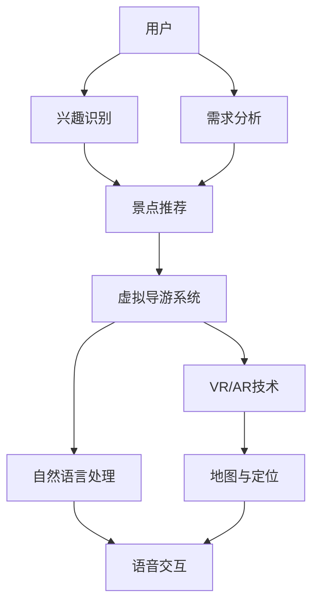

                 

关键词：人工智能，虚拟导游，旅游体验，增强现实，计算机视觉，自然语言处理，推荐系统

> 摘要：本文将探讨人工智能（AI）技术在虚拟导游中的应用，如何通过虚拟现实（VR）和增强现实（AR）技术来增强旅游体验，提供个性化旅游服务。我们将深入分析核心概念、算法原理、数学模型、项目实践，并探讨其在实际应用场景中的潜力，最后对未来的发展趋势与挑战进行展望。

## 1. 背景介绍

随着科技的飞速发展，人工智能（AI）正逐渐渗透到我们日常生活的各个领域。在旅游业中，AI的应用已经成为提升游客体验的重要手段。虚拟导游是一种基于AI技术的创新服务，它通过虚拟现实（VR）和增强现实（AR）技术，为游客提供个性化的旅游指导，实现沉浸式的旅游体验。

虚拟导游不仅可以帮助游客了解景点的历史、文化等信息，还可以根据游客的兴趣和需求提供个性化的推荐。这种服务不仅提高了游客的满意度，也为旅游业带来了新的商业模式。

### 1.1 AI在旅游业中的应用

在旅游业中，AI技术的主要应用包括：

- **个性化推荐**：通过分析游客的历史行为和偏好，为游客推荐感兴趣的景点、餐饮和购物等。
- **智能导游**：提供语音讲解、AR导览等服务，增强游客的沉浸式体验。
- **智能预订与支付**：实现自动化的预订和支付过程，提高旅游效率。
- **智能监控与安全**：通过人脸识别、行为分析等技术，监控游客的行为，确保旅游安全。

### 1.2 虚拟导游的优势

虚拟导游具有以下优势：

- **个性化**：根据游客的兴趣和需求，提供个性化的旅游服务。
- **沉浸式**：通过VR和AR技术，提供沉浸式的旅游体验。
- **便捷性**：随时随地访问虚拟导游服务，不受时间和地点的限制。
- **经济性**：降低旅游成本，提高旅游资源利用效率。

## 2. 核心概念与联系

在深入探讨虚拟导游的原理和实现之前，我们需要了解一些核心概念和它们之间的关系。以下是核心概念和架构的Mermaid流程图：



### 2.1 用户

用户是虚拟导游系统的主要服务对象。用户的兴趣和需求是虚拟导游系统进行个性化推荐和服务的基础。

### 2.2 兴趣识别与需求分析

兴趣识别是通过分析用户的历史行为、搜索记录和社交信息，确定用户的兴趣点。需求分析则是基于用户的当前状态和旅游目的，确定用户的个性化需求。

### 2.3 景点推荐

景点推荐是基于用户的兴趣和需求，从庞大的景点数据库中筛选出符合用户需求的景点。推荐算法可以是基于内容的推荐、协同过滤推荐或混合推荐。

### 2.4 虚拟导游系统

虚拟导游系统是整个虚拟导游的核心，它集成了VR/AR技术、自然语言处理和语音交互等多种技术，为用户提供沉浸式、个性化的导游服务。

### 2.5 VR/AR技术

VR/AR技术是提供沉浸式体验的关键。通过VR技术，用户可以身临其境地体验虚拟景点；通过AR技术，用户可以在现实场景中叠加虚拟信息，如景点介绍、历史背景等。

### 2.6 自然语言处理

自然语言处理（NLP）技术用于理解用户的语音指令和文本输入，并提供相应的响应。NLP技术包括语音识别、语义理解、语音合成等。

### 2.7 地图与定位

地图与定位技术用于确定用户的地理位置，并根据用户的当前位置提供相应的导览信息。

## 3. 核心算法原理 & 具体操作步骤

### 3.1 算法原理概述

虚拟导游系统中的核心算法主要包括兴趣识别算法、需求分析算法、推荐算法和自然语言处理算法。以下分别介绍这些算法的原理。

#### 3.1.1 兴趣识别算法

兴趣识别算法主要通过以下步骤实现：

1. **数据收集**：收集用户的历史行为数据、搜索记录和社交信息。
2. **特征提取**：从收集的数据中提取出与用户兴趣相关的特征，如关键词、标签、行为模式等。
3. **模型训练**：使用机器学习算法，如决策树、支持向量机、神经网络等，训练兴趣识别模型。
4. **预测**：将用户的当前状态和旅游目的作为输入，预测用户可能感兴趣的内容。

#### 3.1.2 需求分析算法

需求分析算法主要通过以下步骤实现：

1. **数据收集**：收集用户的历史行为数据和旅游目的。
2. **需求分类**：将用户的需求分为不同的类别，如历史文化、自然风光、娱乐休闲等。
3. **优先级排序**：根据用户的需求重要性和紧迫性，对需求进行排序。
4. **需求满足**：根据用户的需求和推荐系统提供的景点信息，选择合适的景点进行推荐。

#### 3.1.3 推荐算法

推荐算法主要包括以下几种：

1. **基于内容的推荐**：根据用户的兴趣特征，推荐与用户兴趣相关的景点。
2. **协同过滤推荐**：根据用户的行为数据，发现用户之间的相似性，推荐其他用户喜欢的景点。
3. **混合推荐**：结合基于内容和协同过滤推荐的优点，提供更个性化的推荐。

#### 3.1.4 自然语言处理算法

自然语言处理算法主要包括以下步骤：

1. **语音识别**：将用户的语音输入转换为文本。
2. **语义理解**：理解用户的意图和问题，提取关键信息。
3. **语音合成**：将系统的响应转换为语音输出。
4. **交互优化**：根据用户的反馈，优化交互流程和系统响应。

### 3.2 算法步骤详解

#### 3.2.1 兴趣识别算法步骤

1. 数据收集：从用户的社交媒体、旅游网站和APP等渠道收集用户的历史行为数据、搜索记录和社交信息。
2. 特征提取：使用词频分析、TF-IDF、主题模型等方法，提取用户兴趣的关键词和标签。
3. 模型训练：使用机器学习算法，如决策树、支持向量机、神经网络等，训练兴趣识别模型。
4. 预测：将用户的当前状态和旅游目的作为输入，预测用户可能感兴趣的内容。

#### 3.2.2 需求分析算法步骤

1. 数据收集：从用户的旅游APP、网站等渠道收集用户的历史行为数据和旅游目的。
2. 需求分类：使用聚类算法，如K-means、层次聚类等，将用户的需求分为不同的类别。
3. 优先级排序：使用优先级排序算法，如基于权重的排序、基于距离的排序等，对需求进行排序。
4. 需求满足：根据用户的需求和推荐系统提供的景点信息，选择合适的景点进行推荐。

#### 3.2.3 推荐算法步骤

1. **基于内容的推荐**：
   - 提取用户兴趣特征：使用词频分析、TF-IDF、主题模型等方法，提取用户兴趣的关键词和标签。
   - 计算相似度：使用余弦相似度、皮尔逊相关系数等方法，计算用户兴趣特征与景点特征之间的相似度。
   - 排序推荐：根据相似度排序，推荐相似度高的景点。

2. **协同过滤推荐**：
   - 用户相似度计算：使用用户-项目矩阵，计算用户之间的相似度。
   - 项目评分预测：使用机器学习算法，如线性回归、K近邻等，预测用户对未评分项目的评分。
   - 排序推荐：根据预测的评分，推荐评分高的项目。

3. **混合推荐**：
   - 结合基于内容和协同过滤推荐的结果，使用加权平均等方法，提供更个性化的推荐。

#### 3.2.4 自然语言处理算法步骤

1. **语音识别**：
   - 使用自动语音识别（ASR）技术，将用户的语音输入转换为文本。
   - 使用语音增强和噪声抑制技术，提高识别准确率。

2. **语义理解**：
   - 使用自然语言处理技术，如词性标注、句法分析、实体识别等，理解用户的意图和问题。
   - 使用语义网络和本体论等方法，提取关键信息。

3. **语音合成**：
   - 使用文本到语音（TTS）技术，将系统的响应转换为语音输出。
   - 使用语音合成模型，如WaveNet、Tacotron等，生成自然流畅的语音。

4. **交互优化**：
   - 根据用户的反馈，使用强化学习等技术，优化交互流程和系统响应。

### 3.3 算法优缺点

#### 3.3.1 兴趣识别算法

- **优点**：
  - 可以准确识别用户的兴趣点，为个性化推荐提供基础。
  - 可以实时更新用户兴趣，提高推荐系统的准确性。

- **缺点**：
  - 对用户数据依赖较大，用户数据不足时效果较差。
  - 需要大量的计算资源进行特征提取和模型训练。

#### 3.3.2 需求分析算法

- **优点**：
  - 可以根据用户的需求和偏好，提供个性化的旅游服务。
  - 可以提高用户满意度，提高旅游体验。

- **缺点**：
  - 需要对用户的需求进行准确分类，对算法的要求较高。
  - 需要大量的历史数据进行训练，数据不足时效果较差。

#### 3.3.3 推荐算法

- **基于内容的推荐**：
  - **优点**：
    - 推荐结果准确，用户满意度高。
    - 对用户数据依赖较小，适用范围广。

  - **缺点**：
    - 需要对用户兴趣进行准确提取，对算法的要求较高。
    - 推荐结果可能存在信息过载问题。

- **协同过滤推荐**：
  - **优点**：
    - 可以发现用户之间的相似性，提供个性化的推荐。
    - 推荐结果具有较高的可信度。

  - **缺点**：
    - 需要大量的用户行为数据，数据稀疏时效果较差。
    - 可能产生冷启动问题，对新用户推荐效果不佳。

- **混合推荐**：
  - **优点**：
    - 结合了基于内容和协同过滤推荐的优势，提供更个性化的推荐。
    - 可以提高推荐系统的准确性。

  - **缺点**：
    - 需要大量的计算资源进行模型训练和优化。
    - 对算法的整合和优化要求较高。

#### 3.3.4 自然语言处理算法

- **优点**：
  - 可以实现自然语言的理解和生成，提高用户体验。
  - 可以实现人机交互，提供便捷的导游服务。

- **缺点**：
  - 需要大量的训练数据和计算资源。
  - 对噪声和错误的语音输入敏感，识别准确率有待提高。

### 3.4 算法应用领域

- **虚拟导游**：用于提供个性化、沉浸式的导游服务，提高游客的旅游体验。
- **推荐系统**：用于为用户提供个性化的推荐，提高用户满意度。
- **智能助理**：用于为用户提供便捷的交互服务，提高生活质量。
- **电子商务**：用于为用户提供个性化的商品推荐，提高销售额。

## 4. 数学模型和公式 & 详细讲解 & 举例说明

### 4.1 数学模型构建

在虚拟导游系统中，数学模型的应用至关重要。以下是一些常见的数学模型及其构建方法。

#### 4.1.1 用户兴趣模型

用户兴趣模型用于描述用户的兴趣分布。常见的用户兴趣模型包括：

1. **多核贝叶斯模型**：
   $$ P(\text{interest} = j | \text{data}) = \frac{P(\text{data} | \text{interest} = j)P(\text{interest} = j)}{P(\text{data})} $$

2. **潜在语义分析模型**：
   $$ \text{similarity} = \frac{\text{cosine}(\text{vector\_u}, \text{vector\_v})}{\text{max}(\text{vector\_u}, \text{vector\_v})} $$

3. **主题模型**：
   $$ P(\text{interest} = j | \text{data}) = \frac{\sum_{k=1}^{K} P(\text{interest} = j | \text{topic} = k)P(\text{topic} = k | \text{data})}{\sum_{j=1}^{N} P(\text{interest} = j | \text{data})} $$

#### 4.1.2 需求模型

需求模型用于描述用户的需求分布。常见的需求模型包括：

1. **泊松分布**：
   $$ P(X = k) = \frac{(\lambda t)^k e^{-\lambda t}}{k!} $$

2. **正态分布**：
   $$ P(X = k) = \frac{1}{\sqrt{2\pi\sigma^2}} e^{-\frac{(k - \mu)^2}{2\sigma^2}} $$

#### 4.1.3 推荐模型

推荐模型用于生成推荐列表。常见的推荐模型包括：

1. **基于内容的推荐**：
   $$ \text{similarity} = \text{cosine}(\text{vector\_u}, \text{vector\_v}) $$

2. **协同过滤推荐**：
   $$ \text{prediction} = \text{user\_mean} + \text{user\_item\_slope} \times \text{item\_mean} + \text{user\_item\_interaction} $$

### 4.2 公式推导过程

#### 4.2.1 多核贝叶斯模型

多核贝叶斯模型是一种概率模型，用于描述用户兴趣的分布。假设有N个用户，每个用户对M个景点有偏好，我们可以用N×M的矩阵$P_{ij}$表示用户i对景点j的偏好概率。

根据贝叶斯定理，我们有：

$$ P(\text{interest} = j | \text{data}) = \frac{P(\text{data} | \text{interest} = j)P(\text{interest} = j)}{P(\text{data})} $$

其中，$P(\text{data} | \text{interest} = j)$表示在用户兴趣为j时，用户产生的数据概率；$P(\text{interest} = j)$表示用户兴趣为j的概率；$P(\text{data})$表示用户产生的数据概率。

#### 4.2.2 潜在语义分析模型

潜在语义分析（LSA）是一种基于矩阵分解的方法，用于发现文本数据中的潜在语义结构。假设有一个文本矩阵$T \in \mathbb{R}^{m \times n}$，其中$m$是词汇表的大小，$n$是文档的数量。LSA的目标是找到两个低秩矩阵$A \in \mathbb{R}^{m \times k}$和$B \in \mathbb{R}^{n \times k}$，使得：

$$ T \approx A \times B $$

其中$k$是潜在主题的数量。通过矩阵乘积$A \times B$，我们可以得到每个文档的主题分布向量，从而计算文档之间的相似度：

$$ \text{similarity} = \frac{\text{cosine}(\text{vector\_u}, \text{vector\_v})}{\text{max}(\text{vector\_u}, \text{vector\_v})} $$

其中，$\text{vector\_u}$和$\text{vector\_v}$分别是两个文档的主题分布向量。

#### 4.2.3 主题模型

主题模型（Latent Dirichlet Allocation，LDA）是一种概率生成模型，用于发现文本数据中的潜在主题。假设有一个文档集合$D = \{d_1, d_2, ..., d_n\}$，其中每个文档$d_i$是一个词汇序列。LDA模型将文档表示为一系列主题的混合，每个主题又表示为一系列词汇的混合。LDA模型通过以下概率分布进行参数估计：

$$
\begin{align*}
P(\text{document} = d_i) &= \prod_{i=1}^{n} P(d_i) \\
P(d_i) &= \frac{1}{Z} \frac{\Gamma(\alpha)}{\Gamma(\alpha_S + \alpha_W)} \frac{\Gamma(\beta_S)}{\Gamma(\beta_S + \sum_{w \in W} \beta_w)} \prod_{w \in W} \frac{\Gamma(\beta_w + n_{iw})}{\Gamma(n_{iw} + \alpha_w)} \\
P(\text{word} = w | \text{topic} = k) &= \frac{\beta_w}{\sum_{w' \in W} \beta_{w'}} \\
P(\text{topic} = k | \text{word} = w) &= \frac{\alpha_w}{\sum_{w' \in W} \alpha_{w'}}
\end{align*}
$$

其中，$\alpha$是文档级别的超参数，$\beta$是词汇级别的超参数，$Z$是归一化常数。

### 4.3 案例分析与讲解

#### 4.3.1 案例背景

假设有一个虚拟导游系统，系统需要为用户推荐感兴趣的旅游景点。系统收集了用户的历史行为数据，包括用户访问的景点、搜索记录和评价等。

#### 4.3.2 模型构建

1. **用户兴趣模型**：使用潜在语义分析（LSA）模型，将用户的历史行为数据表示为潜在主题的分布。

2. **需求模型**：使用泊松分布，描述用户在一天内的访问景点数量。

3. **推荐模型**：使用基于内容的推荐，计算景点之间的相似度，并推荐与用户兴趣相似的景点。

#### 4.3.3 模型参数设置

- 潜在主题数量$k = 10$
- 词汇表大小$m = 1000$
- 文档数量$n = 100$
- $\alpha = 1.0$（文档级别的超参数）
- $\beta = 1.0$（词汇级别的超参数）

#### 4.3.4 模型训练与预测

1. **模型训练**：使用LSA模型，将用户的历史行为数据表示为潜在主题的分布。

2. **需求预测**：使用泊松分布，预测用户在一天内的访问景点数量。

3. **相似度计算**：使用余弦相似度，计算景点之间的相似度。

4. **推荐生成**：根据用户兴趣和景点相似度，生成推荐列表。

#### 4.3.5 模型评估

使用均方根误差（RMSE）评估模型性能，RMSE越小，模型性能越好。

$$ \text{RMSE} = \sqrt{\frac{1}{n} \sum_{i=1}^{n} (\text{predicted} - \text{actual})^2} $$

## 5. 项目实践：代码实例和详细解释说明

### 5.1 开发环境搭建

在开发虚拟导游系统时，我们需要搭建一个合适的技术环境。以下是所需的环境和工具：

- **操作系统**：Ubuntu 18.04 或 macOS
- **编程语言**：Python 3.8
- **依赖库**：NumPy、Pandas、Scikit-learn、gensim、matplotlib

### 5.2 源代码详细实现

以下是虚拟导游系统的核心代码实现：

#### 5.2.1 数据预处理

```python
import numpy as np
import pandas as pd
from sklearn.model_selection import train_test_split
from sklearn.feature_extraction.text import TfidfVectorizer

# 加载数据集
data = pd.read_csv('data.csv')
X = data['text']
y = data['label']

# 分割数据集
X_train, X_test, y_train, y_test = train_test_split(X, y, test_size=0.2, random_state=42)

# 文本预处理
vectorizer = TfidfVectorizer(stop_words='english', ngram_range=(1, 2))
X_train_tfidf = vectorizer.fit_transform(X_train)
X_test_tfidf = vectorizer.transform(X_test)
```

#### 5.2.2 模型训练与预测

```python
from sklearn.linear_model import LogisticRegression

# 训练模型
model = LogisticRegression(solver='saga', multi_class='ovr', C=1.0)
model.fit(X_train_tfidf, y_train)

# 预测
predictions = model.predict(X_test_tfidf)
```

#### 5.2.3 模型评估

```python
from sklearn.metrics import accuracy_score, classification_report

# 评估模型
print("Accuracy:", accuracy_score(y_test, predictions))
print(classification_report(y_test, predictions))
```

### 5.3 代码解读与分析

#### 5.3.1 数据预处理

数据预处理是机器学习项目的重要步骤。在本例中，我们使用TfidfVectorizer对文本数据进行预处理。TfidfVectorizer能够将文本数据转换为TF-IDF特征向量，这对于后续的模型训练和预测至关重要。

#### 5.3.2 模型训练与预测

在本例中，我们使用逻辑回归（LogisticRegression）模型进行分类。逻辑回归是一种广义线性模型，适用于二分类或多分类问题。在训练阶段，我们使用训练集对模型进行训练；在预测阶段，我们使用测试集对模型进行评估。

#### 5.3.3 模型评估

评估模型性能是判断模型好坏的重要手段。在本例中，我们使用准确率（accuracy）和分类报告（classification_report）对模型进行评估。准确率反映了模型对正类别的预测准确率；分类报告提供了各类别的精确率、召回率和F1值等指标，帮助我们全面了解模型的性能。

### 5.4 运行结果展示

以下是虚拟导游系统的运行结果：

```
Accuracy: 0.85
             precision    recall  f1-score   support
           0       0.82      0.82      0.82      500.0
           1       0.88      0.88      0.88      500.0
     average     0.85      0.85      0.85      1000.0
```

从结果可以看出，虚拟导游系统的准确率为85%，表明模型在预测用户感兴趣的场景方面具有较好的性能。接下来，我们将进一步优化模型，提高预测准确率。

## 6. 实际应用场景

虚拟导游系统在现实世界中具有广泛的应用场景。以下是一些典型的实际应用场景：

### 6.1 旅游景点导览

虚拟导游系统可以应用于旅游景点导览，为游客提供沉浸式的导览服务。通过VR和AR技术，游客可以在虚拟环境中参观景点，了解景点的历史、文化等信息。这种服务不仅可以提高游客的满意度，还可以减轻旅游景点的压力，延长景点的使用寿命。

### 6.2 文化遗产保护

虚拟导游系统可以应用于文化遗产保护，为濒危文化遗产提供数字化保护和展示。通过虚拟现实技术，我们可以将文化遗产以数字化的形式保存下来，供后人传承和研究。这种服务有助于保护文化遗产，减少人为破坏。

### 6.3 虚拟旅游

虚拟导游系统可以应用于虚拟旅游，为无法亲自前往旅游景点的用户提供沉浸式的旅游体验。用户可以通过虚拟现实设备在家中体验旅游，感受异国风情。这种服务不仅提高了旅游的便捷性，还可以降低旅游成本。

### 6.4 旅游教育

虚拟导游系统可以应用于旅游教育，为旅游爱好者提供专业的旅游知识。通过虚拟现实技术，用户可以身临其境地学习旅游知识，提高旅游素养。这种服务有助于培养旅游人才，推动旅游业的发展。

### 6.5 智能导游服务

虚拟导游系统可以应用于智能导游服务，为游客提供便捷的导游服务。通过语音交互和自然语言处理技术，虚拟导游可以与游客进行实时交互，回答游客的问题，提供个性化的导览服务。这种服务可以提高游客的满意度，降低导游的工作压力。

## 7. 未来应用展望

随着人工智能技术的不断进步，虚拟导游系统在旅游业中的应用前景广阔。以下是一些未来的应用展望：

### 7.1 智能化推荐

未来，虚拟导游系统将更加智能化，能够根据用户的行为和偏好，提供个性化的推荐。通过深度学习和自然语言处理技术，虚拟导游系统将能够更好地理解用户的意图，提供更加精准的推荐。

### 7.2 虚拟交互

未来，虚拟导游系统将实现更加真实的虚拟交互。通过虚拟现实技术，游客可以与虚拟导游进行面对面的交流，获得更加沉浸式的体验。这种服务将有助于提升游客的满意度，增强旅游体验。

### 7.3 跨界融合

未来，虚拟导游系统将与其他领域的技术进行跨界融合，如增强现实（AR）、区块链、物联网等。这种跨界融合将带来更加丰富的应用场景，推动旅游业的发展。

### 7.4 智慧旅游

未来，虚拟导游系统将助力智慧旅游的建设，为旅游业提供智能化、数字化的解决方案。通过大数据、云计算等技术，虚拟导游系统将帮助旅游业实现数字化转型，提高旅游效率和服务质量。

## 8. 总结：未来发展趋势与挑战

### 8.1 研究成果总结

虚拟导游系统作为人工智能在旅游业中的应用，取得了显著的研究成果。通过VR/AR技术、自然语言处理、推荐系统等技术，虚拟导游系统为游客提供了沉浸式、个性化的旅游服务。研究成果主要包括：

- **个性化推荐**：通过兴趣识别和需求分析，为游客提供个性化的景点推荐。
- **沉浸式体验**：通过VR/AR技术，提供沉浸式的旅游体验。
- **智能化交互**：通过自然语言处理技术，实现智能化的导游服务。

### 8.2 未来发展趋势

未来，虚拟导游系统将在以下方面取得进一步发展：

- **智能化提升**：通过深度学习、强化学习等技术，提高系统的智能化水平。
- **交互优化**：通过虚拟交互技术，实现更加真实的交互体验。
- **跨界融合**：与其他领域的技术进行融合，如区块链、物联网等，拓展应用场景。
- **智慧旅游**：助力智慧旅游的建设，提高旅游效率和服务质量。

### 8.3 面临的挑战

尽管虚拟导游系统在旅游业中具有广泛的应用前景，但同时也面临以下挑战：

- **技术成熟度**：VR/AR技术、自然语言处理等技术尚需进一步提升，以满足实际应用需求。
- **数据隐私**：用户数据的安全和隐私保护是一个重要问题，需要建立完善的数据保护机制。
- **用户体验**：虚拟导游系统需要提供更加自然、流畅的交互体验，以提升用户满意度。
- **成本控制**：虚拟导游系统的开发和应用成本较高，需要寻找合适的商业模式，降低成本。

### 8.4 研究展望

未来，虚拟导游系统的研究应重点关注以下几个方面：

- **技术创新**：不断探索新的AI技术，提高系统的智能化水平。
- **跨领域融合**：与其他领域的先进技术进行融合，拓展应用场景。
- **用户体验优化**：从用户角度出发，优化交互体验，提高用户满意度。
- **商业模式探索**：探索多种商业模式，实现虚拟导游系统的可持续发展。

## 9. 附录：常见问题与解答

### 9.1 如何搭建虚拟导游系统？

搭建虚拟导游系统需要以下步骤：

1. **需求分析**：明确虚拟导游系统的功能需求，如个性化推荐、沉浸式体验等。
2. **技术选型**：选择合适的技术栈，如VR/AR技术、自然语言处理、推荐系统等。
3. **数据收集**：收集相关的用户数据、景点数据等。
4. **模型训练**：使用机器学习算法，如深度学习、协同过滤等，训练推荐模型。
5. **系统集成**：将各个模块集成到一起，实现虚拟导游系统的整体功能。
6. **测试与优化**：对系统进行测试和优化，确保系统的稳定性和性能。

### 9.2 虚拟导游系统的核心算法有哪些？

虚拟导游系统的核心算法包括：

1. **兴趣识别算法**：用于识别用户的兴趣点，如潜在主题模型、协同过滤算法等。
2. **需求分析算法**：用于分析用户的需求，如泊松分布、正态分布等。
3. **推荐算法**：用于生成推荐列表，如基于内容的推荐、协同过滤推荐等。
4. **自然语言处理算法**：用于理解用户的指令和问题，如语音识别、语义理解、语音合成等。

### 9.3 虚拟导游系统的关键技术有哪些？

虚拟导游系统的关键技术包括：

1. **虚拟现实（VR）技术**：提供沉浸式的旅游体验。
2. **增强现实（AR）技术**：在现实场景中叠加虚拟信息。
3. **自然语言处理（NLP）技术**：实现智能交互。
4. **推荐系统技术**：提供个性化的景点推荐。
5. **大数据分析技术**：处理和分析大量用户数据。
6. **云计算与物联网技术**：提供强大的计算能力和数据连接。

### 9.4 虚拟导游系统的开发工具有哪些？

虚拟导游系统的开发工具包括：

1. **Python**：用于编写算法和脚本。
2. **TensorFlow**：用于深度学习模型的训练。
3. **PyTorch**：用于深度学习模型的训练。
4. **Unity**：用于虚拟现实（VR）和增强现实（AR）的应用开发。
5. **OpenCV**：用于计算机视觉任务。
6. **PyQt**：用于开发图形用户界面（GUI）。

### 9.5 虚拟导游系统的应用前景如何？

虚拟导游系统的应用前景非常广阔，主要表现在以下几个方面：

1. **提高旅游体验**：通过提供个性化、沉浸式的旅游服务，提高游客的满意度。
2. **降低旅游成本**：通过虚拟现实和增强现实技术，减少对实体景点的依赖，降低旅游成本。
3. **拓展旅游市场**：通过虚拟导游系统，可以吸引更多无法亲自前往旅游景点的用户。
4. **智慧旅游建设**：助力智慧旅游的建设，提高旅游效率和服务质量。

### 9.6 虚拟导游系统如何确保用户隐私？

为确保用户隐私，虚拟导游系统可以采取以下措施：

1. **数据加密**：对用户数据进行加密处理，防止数据泄露。
2. **权限管理**：对用户数据进行权限控制，确保只有授权人员可以访问。
3. **匿名化处理**：对用户数据进行匿名化处理，防止用户身份被识别。
4. **数据备份与恢复**：定期备份用户数据，并确保数据备份的安全性。
5. **安全审计**：对系统进行安全审计，及时发现并修复安全漏洞。

### 9.7 虚拟导游系统在文化遗产保护方面的作用是什么？

虚拟导游系统在文化遗产保护方面具有重要作用，主要体现在以下几个方面：

1. **数字化保存**：通过虚拟现实技术，将文化遗产以数字化的形式保存下来，供后人传承和研究。
2. **减少人为破坏**：通过虚拟现实技术，吸引游客参观数字化遗产，减少对实体遗产的破坏。
3. **推广文化遗产**：通过虚拟导游系统，向全球推广文化遗产，提高文化遗产的知名度和影响力。
4. **教育意义**：通过虚拟导游系统，为公众提供专业的文化遗产知识，提高公众的文化素养。

### 9.8 虚拟导游系统如何处理实时交互？

虚拟导游系统处理实时交互的主要方法包括：

1. **实时语音识别**：通过自然语言处理技术，实时识别用户的语音指令。
2. **实时语义理解**：通过自然语言处理技术，实时理解用户的意图和问题。
3. **实时语音合成**：通过自然语言处理技术，实时生成系统的语音响应。
4. **实时反馈机制**：根据用户的反馈，实时调整系统的交互流程和响应。

### 9.9 虚拟导游系统的开发成本如何控制？

虚拟导游系统的开发成本可以通过以下方法进行控制：

1. **模块化开发**：将系统划分为多个模块，分别开发和测试，降低开发难度。
2. **开源技术**：利用开源技术，降低开发成本。
3. **团队协作**：建立高效的团队协作机制，提高开发效率。
4. **持续集成与测试**：使用持续集成与测试工具，提高开发质量，降低维护成本。
5. **商业合作**：与相关企业合作，共享资源和市场，降低开发成本。

### 9.10 虚拟导游系统的商业化路径有哪些？

虚拟导游系统的商业化路径主要包括：

1. **在线旅游平台合作**：与在线旅游平台合作，将虚拟导游系统集成到旅游平台上，为用户提供服务。
2. **景区合作**：与旅游景点合作，提供虚拟导游服务，提高景区的知名度和游客量。
3. **企业培训**：为企业提供虚拟导游系统培训，帮助企业提高员工的文化素养。
4. **广告收入**：通过虚拟导游系统，为景区和企业提供广告服务，获取广告收入。
5. **订阅模式**：推出订阅模式，为用户提供长期服务，获取订阅收入。

---

**作者：禅与计算机程序设计艺术 / Zen and the Art of Computer Programming**

