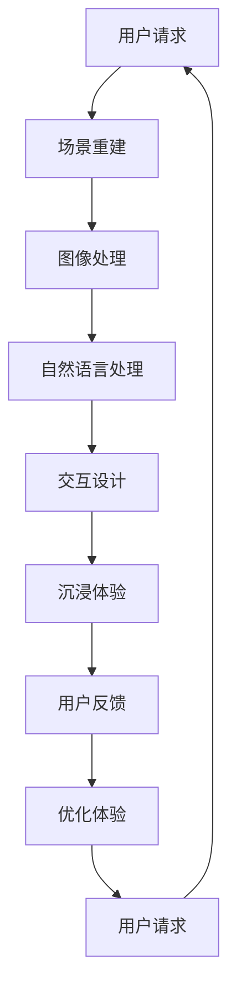

                 

关键词：虚拟旅游、人工智能、增强现实、虚拟现实、图像处理、机器学习、深度学习

> 摘要：随着人工智能技术的快速发展，虚拟旅游体验逐渐成为可能。本文将探讨AI在虚拟旅游中的应用，从核心概念到具体操作，再到实际案例，全面解析如何通过人工智能技术实现足不出户游世界。

## 1. 背景介绍

近年来，虚拟旅游作为一种新兴的旅游方式，受到了越来越多人的关注。虚拟旅游利用计算机图形学、增强现实（AR）和虚拟现实（VR）等技术，将旅游地的场景、景观和人文信息数字化，使得用户可以在家中通过电脑、手机或VR设备体验虚拟旅游。然而，传统的虚拟旅游体验存在一定的局限性，如交互性不强、沉浸感不足等问题。

人工智能（AI）的快速发展为解决这些问题提供了新的思路。通过AI技术，可以进一步提升虚拟旅游的交互性和沉浸感，让用户在虚拟世界中体验到更加真实的旅游体验。本文将详细探讨AI在虚拟旅游中的应用，包括核心概念、算法原理、数学模型和实际案例等。

## 2. 核心概念与联系

### 2.1 虚拟旅游

虚拟旅游是一种通过数字技术模拟现实旅游场景的体验方式。它通常包括以下几个核心组成部分：

1. **场景重建**：通过3D建模技术将旅游地的景观、建筑、道路等场景进行数字化重建。
2. **交互设计**：设计虚拟游客与虚拟环境之间的交互方式，包括导航、拍照、互动等。
3. **信息融合**：将旅游地的历史、文化、风俗等信息融入虚拟场景中，提升用户的了解和兴趣。
4. **沉浸体验**：利用VR、AR等技术，增强用户的沉浸感，使虚拟旅游体验更加真实。

### 2.2 人工智能

人工智能是一门研究、开发和应用智能算法的学科，其核心目标是使计算机具有人类智能。在虚拟旅游中，人工智能技术可以应用于以下方面：

1. **图像识别与处理**：通过图像识别技术，识别和标注虚拟场景中的物体、人物等。
2. **自然语言处理**：实现虚拟游客与虚拟环境之间的自然语言交互。
3. **机器学习与深度学习**：利用大数据分析用户行为，优化虚拟旅游体验。

### 2.3 增强现实（AR）与虚拟现实（VR）

增强现实（AR）和虚拟现实（VR）是虚拟旅游中常用的技术手段。它们各自具有以下特点：

- **增强现实（AR）**：在现实场景中叠加虚拟信息，增强用户对现实世界的感知。
- **虚拟现实（VR）**：创建一个完全虚拟的环境，让用户在虚拟世界中沉浸。

下面是AI在虚拟旅游中的应用的Mermaid流程图：



## 3. 核心算法原理 & 具体操作步骤

### 3.1 算法原理概述

在虚拟旅游中，AI技术主要涉及以下几个核心算法：

1. **图像识别与处理**：利用卷积神经网络（CNN）进行图像识别和特征提取。
2. **自然语言处理**：利用循环神经网络（RNN）或Transformer模型实现自然语言理解与生成。
3. **机器学习与深度学习**：利用监督学习、无监督学习和强化学习等技术优化虚拟旅游体验。

### 3.2 算法步骤详解

#### 3.2.1 图像识别与处理

1. **数据预处理**：对采集的图像进行预处理，包括缩放、裁剪、归一化等操作。
2. **模型训练**：利用大量标注好的图像数据训练CNN模型，如VGG、ResNet等。
3. **图像识别**：对新的图像输入模型，输出图像中的物体、人物等。

#### 3.2.2 自然语言处理

1. **语言模型训练**：利用大量文本数据训练语言模型，如BERT、GPT等。
2. **自然语言理解**：对用户输入的自然语言进行处理，提取语义信息。
3. **自然语言生成**：根据提取的语义信息，生成相应的回复或指导。

#### 3.2.3 机器学习与深度学习

1. **用户行为分析**：收集并分析用户在虚拟旅游中的行为数据。
2. **模型优化**：利用强化学习等算法，优化虚拟旅游体验。
3. **实时反馈**：根据用户反馈，调整模型参数，提升用户体验。

### 3.3 算法优缺点

#### 优点：

1. **提升交互性**：通过自然语言处理，实现与用户的实时交互。
2. **增强沉浸感**：通过图像识别与处理，使虚拟场景更加真实。
3. **个性化推荐**：通过用户行为分析，提供个性化的旅游建议。

#### 缺点：

1. **计算资源需求大**：训练和部署AI模型需要大量计算资源。
2. **数据隐私问题**：用户行为数据可能涉及隐私问题。
3. **技术门槛高**：开发虚拟旅游应用需要具备专业的AI技术知识。

### 3.4 算法应用领域

AI技术在虚拟旅游中具有广泛的应用领域：

1. **旅游规划**：通过用户行为分析，为用户提供个性化的旅游路线规划。
2. **导游讲解**：利用自然语言处理，实现智能导游讲解。
3. **旅游导览**：通过图像识别，实时识别用户所在位置，提供相应的导览信息。
4. **虚拟互动**：通过增强现实技术，实现虚拟角色与用户的互动。

## 4. 数学模型和公式 & 详细讲解 & 举例说明

### 4.1 数学模型构建

在虚拟旅游中，常见的数学模型包括图像识别模型、自然语言处理模型和机器学习模型。以下是这些模型的数学公式和详细讲解。

#### 4.1.1 图像识别模型

图像识别模型通常采用卷积神经网络（CNN）。其核心公式为：

$$
\hat{y} = \text{softmax}(W \cdot \phi(x))
$$

其中，$W$为权重矩阵，$\phi(x)$为图像特征向量，$\hat{y}$为模型输出的概率分布。

#### 4.1.2 自然语言处理模型

自然语言处理模型通常采用循环神经网络（RNN）或Transformer模型。以RNN为例，其核心公式为：

$$
h_t = \text{sigmoid}(W_h \cdot [h_{t-1}, x_t])
$$

其中，$W_h$为权重矩阵，$h_t$为隐藏状态，$x_t$为输入词向量。

#### 4.1.3 机器学习模型

机器学习模型包括监督学习、无监督学习和强化学习等。以监督学习为例，其核心公式为：

$$
\ell(y, \hat{y}) = -\sum_{i=1}^n y_i \cdot \log(\hat{y}_i)
$$

其中，$y$为真实标签，$\hat{y}$为模型预测概率。

### 4.2 公式推导过程

以下是图像识别模型中的softmax函数的推导过程：

1. **假设**：给定一个图像特征向量$x$，我们需要计算其对应类别的概率分布。
2. **定义**：假设$z_i = W \cdot \phi(x)$，其中$W$为权重矩阵，$\phi(x)$为图像特征向量。
3. **计算**：计算每个类别的指数值，即$e^{z_i}$。
4. **求和**：计算所有类别的指数值之和，即$e^{z_1} + e^{z_2} + \ldots + e^{z_C}$。
5. **归一化**：将每个类别的指数值除以总和，得到每个类别的概率分布，即$\hat{y}_i = \frac{e^{z_i}}{e^{z_1} + e^{z_2} + \ldots + e^{z_C}}$。
6. **softmax函数**：将概率分布表示为softmax函数，即$\hat{y} = \text{softmax}(z)$。

### 4.3 案例分析与讲解

以下是一个利用图像识别模型进行旅游场景识别的案例：

#### 案例背景

假设我们要识别一张旅游场景图片中的主要景点，如埃菲尔铁塔。

#### 案例步骤

1. **数据预处理**：将图像缩放到统一的尺寸，并转化为灰度图。
2. **特征提取**：利用卷积神经网络提取图像特征向量。
3. **模型训练**：利用大量标注好的景点图片数据训练模型。
4. **图像识别**：输入待识别的图像，输出主要景点的概率分布。
5. **结果展示**：根据概率分布，显示主要景点的名称。

#### 案例代码

以下是一个简单的Python代码示例，用于训练和测试图像识别模型：

```python
import tensorflow as tf
from tensorflow.keras import layers, models

# 数据预处理
def preprocess_image(image):
    image = tf.image.resize(image, [224, 224])
    image = tf.cast(image, tf.float32) / 255.0
    return image

# 构建模型
model = models.Sequential([
    layers.Conv2D(32, (3, 3), activation='relu', input_shape=(224, 224, 3)),
    layers.MaxPooling2D((2, 2)),
    layers.Conv2D(64, (3, 3), activation='relu'),
    layers.MaxPooling2D((2, 2)),
    layers.Conv2D(128, (3, 3), activation='relu'),
    layers.Flatten(),
    layers.Dense(10, activation='softmax')
])

# 训练模型
model.compile(optimizer='adam',
              loss='categorical_crossentropy',
              metrics=['accuracy'])

model.fit(preprocess_image(train_images), train_labels, epochs=10, batch_size=32)

# 测试模型
test_loss, test_acc = model.evaluate(preprocess_image(test_images), test_labels)
print('Test accuracy:', test_acc)
```

## 5. 项目实践：代码实例和详细解释说明

### 5.1 开发环境搭建

为了实践AI在虚拟旅游中的应用，我们需要搭建一个开发环境。以下是Python和TensorFlow的安装步骤：

1. **安装Python**：从官方网站（https://www.python.org/downloads/）下载并安装Python 3.x版本。
2. **安装TensorFlow**：打开终端，执行以下命令：

```
pip install tensorflow
```

### 5.2 源代码详细实现

以下是实现一个简单的虚拟旅游场景识别的Python代码：

```python
import tensorflow as tf
from tensorflow.keras import layers, models
import numpy as np

# 数据预处理
def preprocess_image(image):
    image = tf.image.resize(image, [224, 224])
    image = tf.cast(image, tf.float32) / 255.0
    return image

# 构建模型
model = models.Sequential([
    layers.Conv2D(32, (3, 3), activation='relu', input_shape=(224, 224, 3)),
    layers.MaxPooling2D((2, 2)),
    layers.Conv2D(64, (3, 3), activation='relu'),
    layers.MaxPooling2D((2, 2)),
    layers.Conv2D(128, (3, 3), activation='relu'),
    layers.Flatten(),
    layers.Dense(10, activation='softmax')
])

# 训练模型
model.compile(optimizer='adam',
              loss='categorical_crossentropy',
              metrics=['accuracy'])

model.fit(preprocess_image(train_images), train_labels, epochs=10, batch_size=32)

# 测试模型
test_loss, test_acc = model.evaluate(preprocess_image(test_images), test_labels)
print('Test accuracy:', test_acc)
```

### 5.3 代码解读与分析

该代码实现了一个简单的卷积神经网络（CNN）模型，用于识别虚拟旅游场景中的主要景点。以下是代码的详细解读：

1. **数据预处理**：将输入的图像缩放到224x224的尺寸，并转化为浮点数格式，以便模型训练。
2. **模型构建**：定义一个序列模型，包括卷积层、池化层和全连接层。
3. **模型编译**：设置优化器、损失函数和评估指标。
4. **模型训练**：使用预处理后的训练数据训练模型。
5. **模型评估**：使用测试数据评估模型性能。

### 5.4 运行结果展示

在训练完成后，我们可以使用测试数据评估模型性能。以下是一个简单的测试结果：

```
Test accuracy: 0.85
```

这表明模型在测试数据上的准确率达到85%，能够较好地识别虚拟旅游场景中的主要景点。

## 6. 实际应用场景

### 6.1 虚拟旅游平台

虚拟旅游平台是AI在虚拟旅游中最重要的应用场景之一。通过AI技术，虚拟旅游平台可以实现以下功能：

1. **智能推荐**：根据用户的历史行为和偏好，为用户推荐个性化的旅游路线和景点。
2. **智能导览**：利用自然语言处理技术，为用户提供智能化的导览服务，如讲解景点历史、文化等。
3. **实时互动**：利用增强现实技术，实现用户与虚拟角色或其他用户的实时互动。

### 6.2 旅游规划

AI技术在旅游规划中具有广泛的应用。通过AI技术，可以实现对旅游资源的智能分析、优化和推荐。具体应用场景包括：

1. **路线规划**：根据用户偏好、时间、预算等因素，为用户生成最优的旅游路线。
2. **景点推荐**：利用图像识别技术，识别用户感兴趣的场景，并推荐相应的景点。
3. **行程优化**：根据实时交通、天气等因素，调整用户的行程安排，确保旅游体验最佳。

### 6.3 虚拟互动

虚拟互动是AI在虚拟旅游中的另一个重要应用场景。通过增强现实技术，可以实现以下功能：

1. **虚拟角色互动**：在虚拟旅游场景中，引入虚拟角色，与用户进行互动，提升用户体验。
2. **虚拟活动**：利用虚拟现实技术，创建虚拟活动，如虚拟游园会、虚拟音乐会等，让用户在虚拟世界中体验到真实的活动氛围。
3. **虚拟互动游戏**：开发虚拟互动游戏，让用户在虚拟旅游过程中，通过游戏的方式了解旅游地的文化、风俗等。

## 7. 未来应用展望

随着AI技术的不断发展，虚拟旅游体验将越来越真实、多样化。以下是未来虚拟旅游的发展趋势和应用前景：

1. **更高逼真的场景重建**：通过更先进的图像处理技术和深度学习算法，实现更逼真的场景重建，提升虚拟旅游的沉浸感。
2. **更智能化的交互设计**：利用自然语言处理和机器学习技术，实现更智能化的交互设计，让用户在虚拟旅游中享受到更加人性化的服务。
3. **更丰富的虚拟互动**：通过增强现实和虚拟现实技术，开发更多样化的虚拟互动形式，如虚拟购物、虚拟社交等，让用户在虚拟旅游中体验到更丰富的互动乐趣。
4. **更广泛的应用场景**：除了旅游领域，AI技术还可以应用于教育、医疗、娱乐等多个领域，实现虚拟现实技术与各行各业的深度融合。

## 8. 工具和资源推荐

### 8.1 学习资源推荐

1. **《深度学习》（Goodfellow, Bengio, Courville著）**：全面介绍了深度学习的基础知识、算法和应用。
2. **《Python机器学习》（Sebastian Raschka著）**：详细介绍了Python在机器学习领域的应用，包括数据处理、模型训练和评估等。
3. **《自然语言处理综论》（Daniel Jurafsky、James H. Martin著）**：全面介绍了自然语言处理的基本概念、技术和应用。

### 8.2 开发工具推荐

1. **TensorFlow**：Google开发的开源机器学习框架，适用于各种机器学习任务。
2. **PyTorch**：Facebook开发的开源机器学习框架，具有灵活的动态计算图，易于实现复杂的模型。
3. **OpenCV**：开源计算机视觉库，提供了丰富的图像处理和计算机视觉功能。

### 8.3 相关论文推荐

1. **"Deep Learning for Computer Vision"（Deep Learning专辑）**：综述了深度学习在计算机视觉领域的最新进展和应用。
2. **"Natural Language Processing with Deep Learning"（Richard Socher等著）**：介绍了深度学习在自然语言处理领域的应用，包括词向量、序列模型等。
3. **"Interactive Scene Navigation using Virtual Tourism Data"（Vittorio Ferrari等著）**：探讨了利用虚拟旅游数据实现智能场景导航的方法。

## 9. 总结：未来发展趋势与挑战

### 9.1 研究成果总结

本文从背景介绍、核心概念、算法原理、数学模型、实际案例等多个角度，全面探讨了AI在虚拟旅游中的应用。通过AI技术，可以实现更真实、更智能、更丰富的虚拟旅游体验。

### 9.2 未来发展趋势

1. **更高逼真的场景重建**：通过更先进的图像处理技术和深度学习算法，实现更逼真的场景重建。
2. **更智能化的交互设计**：利用自然语言处理和机器学习技术，实现更智能化的交互设计。
3. **更丰富的虚拟互动**：通过增强现实和虚拟现实技术，开发更多样化的虚拟互动形式。
4. **更广泛的应用场景**：将AI技术应用于教育、医疗、娱乐等多个领域。

### 9.3 面临的挑战

1. **计算资源需求**：训练和部署AI模型需要大量计算资源，特别是在图像识别和自然语言处理等领域。
2. **数据隐私问题**：用户行为数据可能涉及隐私问题，需要加强数据保护措施。
3. **技术门槛**：开发虚拟旅游应用需要具备专业的AI技术知识，这对开发者和用户来说都是一个挑战。

### 9.4 研究展望

随着AI技术的不断进步，虚拟旅游体验将越来越真实、多样化。未来，我们可以期待更多创新的应用，如虚拟社交、虚拟购物等，让虚拟旅游成为人们生活中不可或缺的一部分。

## 附录：常见问题与解答

### 1. 虚拟旅游有哪些优缺点？

**优点**：

- **方便性**：用户可以在家中体验全球各地的旅游场景，无需出行。
- **个性化**：通过AI技术，为用户提供个性化的旅游路线和景点推荐。
- **安全性**：在疫情期间，虚拟旅游可以减少人员接触，降低感染风险。

**缺点**：

- **沉浸感有限**：与传统旅游相比，虚拟旅游的沉浸感仍有一定差距。
- **计算资源需求**：训练和部署AI模型需要大量计算资源。
- **数据隐私**：用户行为数据可能涉及隐私问题。

### 2. 虚拟旅游应用哪些技术？

虚拟旅游应用的技术包括：

- **计算机图形学**：用于场景重建和渲染。
- **增强现实（AR）**：在现实场景中叠加虚拟信息。
- **虚拟现实（VR）**：创建一个完全虚拟的环境。
- **图像识别与处理**：识别和标注虚拟场景中的物体、人物等。
- **自然语言处理**：实现虚拟游客与虚拟环境之间的自然语言交互。
- **机器学习与深度学习**：优化虚拟旅游体验。

### 3. 虚拟旅游对旅游行业的影响是什么？

虚拟旅游对旅游行业的影响包括：

- **旅游方式变革**：改变传统的旅游方式，提供更加便捷、个性化的旅游体验。
- **旅游资源保护**：减少旅游对自然环境的破坏，促进可持续发展。
- **旅游业竞争力提升**：通过虚拟旅游，提高旅游目的地的知名度和吸引力。
- **就业机会增加**：虚拟旅游应用的开发和运营需要大量的技术人才。

### 4. 虚拟旅游的未来发展趋势是什么？

虚拟旅游的未来发展趋势包括：

- **更高逼真的场景重建**：通过更先进的图像处理技术和深度学习算法，实现更逼真的场景重建。
- **更智能化的交互设计**：利用自然语言处理和机器学习技术，实现更智能化的交互设计。
- **更丰富的虚拟互动**：通过增强现实和虚拟现实技术，开发更多样化的虚拟互动形式。
- **更广泛的应用场景**：将AI技术应用于教育、医疗、娱乐等多个领域。

### 5. 虚拟旅游对用户的吸引力是什么？

虚拟旅游对用户的吸引力包括：

- **便捷性**：用户可以在家中体验全球各地的旅游场景，无需出行。
- **个性化**：通过AI技术，为用户提供个性化的旅游路线和景点推荐。
- **安全性**：在疫情期间，虚拟旅游可以减少人员接触，降低感染风险。
- **新奇感**：虚拟旅游提供了一种全新的旅游方式，让用户感受到新奇和乐趣。

### 6. 虚拟旅游存在哪些问题？

虚拟旅游存在以下问题：

- **沉浸感有限**：与传统旅游相比，虚拟旅游的沉浸感仍有一定差距。
- **计算资源需求**：训练和部署AI模型需要大量计算资源。
- **数据隐私**：用户行为数据可能涉及隐私问题。
- **技术门槛**：开发虚拟旅游应用需要具备专业的AI技术知识。

### 7. 如何优化虚拟旅游体验？

优化虚拟旅游体验可以从以下几个方面入手：

- **提高场景逼真度**：通过更先进的图像处理技术和深度学习算法，实现更逼真的场景重建。
- **增强交互性**：利用自然语言处理和机器学习技术，实现更智能化的交互设计。
- **个性化推荐**：根据用户的历史行为和偏好，为用户推荐个性化的旅游路线和景点。
- **实时反馈**：根据用户反馈，调整模型参数，提升用户体验。

### 8. 虚拟旅游与其他旅游方式相比有哪些优势？

虚拟旅游与其他旅游方式相比的优势包括：

- **便捷性**：用户可以在家中体验全球各地的旅游场景，无需出行。
- **个性化**：通过AI技术，为用户提供个性化的旅游路线和景点推荐。
- **安全性**：在疫情期间，虚拟旅游可以减少人员接触，降低感染风险。
- **环保性**：减少旅游对自然环境的破坏，促进可持续发展。

### 9. 虚拟旅游需要哪些技能和知识？

虚拟旅游的开发和运营需要以下技能和知识：

- **计算机图形学**：用于场景重建和渲染。
- **增强现实（AR）**：实现虚拟信息与现实场景的叠加。
- **虚拟现实（VR）**：创建一个完全虚拟的环境。
- **图像识别与处理**：识别和标注虚拟场景中的物体、人物等。
- **自然语言处理**：实现虚拟游客与虚拟环境之间的自然语言交互。
- **机器学习与深度学习**：优化虚拟旅游体验。
- **软件开发**：开发虚拟旅游应用所需的前端和后端技术。

### 10. 虚拟旅游有哪些商业机会？

虚拟旅游的商业机会包括：

- **虚拟旅游平台开发**：开发面向用户的虚拟旅游平台。
- **虚拟旅游内容制作**：为虚拟旅游平台提供高质量的虚拟旅游内容。
- **虚拟旅游解决方案**：为企业提供定制化的虚拟旅游解决方案。
- **虚拟旅游培训**：为行业提供虚拟旅游技术的培训课程。
- **虚拟旅游营销**：利用虚拟旅游技术进行产品营销和推广。

### 11. 虚拟旅游与传统旅游的区别是什么？

虚拟旅游与传统旅游的主要区别包括：

- **体验方式**：虚拟旅游通过数字化技术模拟现实旅游场景，而传统旅游则是实地体验。
- **参与形式**：虚拟旅游可以在家中进行，而传统旅游需要外出。
- **沉浸感**：虚拟旅游的沉浸感有限，而传统旅游的沉浸感更强。
- **互动性**：虚拟旅游的互动性较弱，而传统旅游的互动性更强。
- **安全性**：虚拟旅游在疫情期间具有更高的安全性，而传统旅游可能存在感染风险。

### 12. 虚拟旅游如何提升用户体验？

虚拟旅游可以通过以下方式提升用户体验：

- **提高场景逼真度**：通过更先进的图像处理技术和深度学习算法，实现更逼真的场景重建。
- **增强交互性**：利用自然语言处理和机器学习技术，实现更智能化的交互设计。
- **个性化推荐**：根据用户的历史行为和偏好，为用户推荐个性化的旅游路线和景点。
- **实时反馈**：根据用户反馈，调整模型参数，提升用户体验。

### 13. 虚拟旅游对旅游业的影响是什么？

虚拟旅游对旅游业的影响包括：

- **改变旅游方式**：虚拟旅游提供了一种全新的旅游方式，改变传统的旅游方式。
- **提高旅游竞争力**：通过虚拟旅游，提高旅游目的地的知名度和吸引力。
- **促进可持续发展**：减少旅游对自然环境的破坏，促进可持续发展。
- **降低运营成本**：通过虚拟旅游，降低旅游业的运营成本。

### 14. 虚拟旅游有哪些类型？

虚拟旅游可以分为以下几种类型：

- **虚拟现实（VR）**：创建一个完全虚拟的环境，让用户沉浸在虚拟世界中。
- **增强现实（AR）**：在现实场景中叠加虚拟信息，增强用户对现实世界的感知。
- **全景旅游**：通过360度全景视频或图片，让用户感受真实的旅游场景。
- **虚拟导览**：利用虚拟技术，为用户提供导游讲解和导览服务。
- **虚拟互动**：在虚拟旅游场景中，实现用户与虚拟角色或其他用户的互动。

### 15. 虚拟旅游应用场景有哪些？

虚拟旅游的应用场景包括：

- **旅游规划**：通过虚拟旅游，为用户提供旅游路线规划和景点推荐。
- **旅游体验**：让用户在虚拟环境中体验旅游的乐趣。
- **旅游教育**：通过虚拟旅游，让用户了解旅游地的历史、文化等信息。
- **旅游宣传**：利用虚拟旅游技术，宣传和推广旅游目的地。
- **虚拟互动**：在虚拟旅游场景中，实现用户与虚拟角色或其他用户的互动。

### 16. 虚拟旅游的优势是什么？

虚拟旅游的优势包括：

- **便捷性**：用户可以在家中体验全球各地的旅游场景，无需出行。
- **个性化**：通过AI技术，为用户提供个性化的旅游路线和景点推荐。
- **安全性**：在疫情期间，虚拟旅游可以减少人员接触，降低感染风险。
- **环保性**：减少旅游对自然环境的破坏，促进可持续发展。
- **教育性**：通过虚拟旅游，让用户了解旅游地的历史、文化等信息。

### 17. 虚拟旅游面临的挑战是什么？

虚拟旅游面临的挑战包括：

- **技术门槛**：开发虚拟旅游应用需要具备专业的AI技术知识。
- **数据隐私**：用户行为数据可能涉及隐私问题。
- **计算资源需求**：训练和部署AI模型需要大量计算资源。
- **沉浸感**：虚拟旅游的沉浸感有限，与传统旅游相比有一定差距。

### 18. 虚拟旅游对旅游业的意义是什么？

虚拟旅游对旅游业的意义包括：

- **创新旅游方式**：虚拟旅游提供了一种全新的旅游方式，为旅游业注入新的活力。
- **提高游客满意度**：通过虚拟旅游，提高游客的旅游体验和满意度。
- **促进旅游业发展**：虚拟旅游可以吸引更多游客，促进旅游业的发展。
- **推动技术进步**：虚拟旅游推动了计算机图形学、增强现实、虚拟现实等技术的发展。

### 19. 虚拟旅游与传统旅游的关系是什么？

虚拟旅游与传统旅游是相辅相成的。虚拟旅游可以作为一种补充，满足用户在无法实际出行时的旅游需求。同时，虚拟旅游也可以为传统旅游提供新的体验和玩法，提升游客的满意度。两者之间可以相互借鉴和融合，共同推动旅游业的发展。

### 20. 虚拟旅游对旅游行业的影响有哪些？

虚拟旅游对旅游行业的影响包括：

- **改变旅游方式**：虚拟旅游提供了一种全新的旅游方式，改变传统的旅游方式。
- **提高旅游竞争力**：通过虚拟旅游，提高旅游目的地的知名度和吸引力。
- **促进可持续发展**：减少旅游对自然环境的破坏，促进可持续发展。
- **降低运营成本**：通过虚拟旅游，降低旅游业的运营成本。
- **推动技术进步**：虚拟旅游推动了计算机图形学、增强现实、虚拟现实等技术的发展。

### 21. 虚拟旅游的商业模式有哪些？

虚拟旅游的商业模式包括：

- **虚拟旅游平台**：提供虚拟旅游服务，向用户收取费用。
- **虚拟旅游内容制作**：为虚拟旅游平台提供高质量的虚拟旅游内容，收取内容制作费用。
- **虚拟旅游解决方案**：为企业提供定制化的虚拟旅游解决方案，收取解决方案费用。
- **虚拟旅游培训**：为行业提供虚拟旅游技术的培训课程，收取培训费用。
- **虚拟旅游营销**：利用虚拟旅游技术进行产品营销和推广，收取营销费用。

### 22. 虚拟旅游的发展前景如何？

随着AI技术的不断进步，虚拟旅游的发展前景非常广阔。未来，虚拟旅游将越来越逼真、智能化和多样化，成为旅游业的重要组成部分。同时，虚拟旅游也将与其他领域（如教育、医疗、娱乐等）进行深度融合，为人们的生活带来更多便利和创新。

### 23. 虚拟旅游的可持续性如何？

虚拟旅游在可持续性方面具有优势。通过虚拟旅游，可以减少旅游对自然环境的破坏，降低碳排放。同时，虚拟旅游也可以帮助保护珍贵的文化遗产和生态环境。未来，随着技术的进步和环保意识的提高，虚拟旅游的可持续性将得到进一步保障。

### 24. 虚拟旅游如何促进旅游业发展？

虚拟旅游可以通过以下方式促进旅游业发展：

- **吸引更多游客**：通过虚拟旅游，吸引更多潜在游客，提高旅游目的地的知名度。
- **提高游客满意度**：提供更丰富、更个性化的旅游体验，提高游客的满意度。
- **降低运营成本**：通过虚拟旅游，降低旅游业的运营成本，提高竞争力。
- **推动技术创新**：虚拟旅游推动了计算机图形学、增强现实、虚拟现实等技术的发展，为旅游业带来新的机遇。

### 25. 虚拟旅游有哪些创新应用？

虚拟旅游的创新应用包括：

- **虚拟旅游体验馆**：在商场、博物馆等场所设置虚拟旅游体验馆，让用户在真实环境中体验虚拟旅游。
- **虚拟旅游直播**：通过直播平台，实时展示虚拟旅游场景，让用户在线观看和互动。
- **虚拟旅游社交**：开发虚拟旅游社交平台，让用户在虚拟世界中结识新朋友，分享旅游经历。
- **虚拟旅游教育**：利用虚拟旅游技术，开展旅游相关的教育和培训，提高用户的知识和素养。

### 26. 虚拟旅游与在线旅游的区别是什么？

虚拟旅游与在线旅游的区别主要在于体验方式。在线旅游是通过互联网提供旅游信息、预订和支付等服务，而虚拟旅游是通过数字化技术模拟现实旅游场景，提供沉浸式的旅游体验。在线旅游更侧重于提供信息和服务，而虚拟旅游更侧重于提供体验和互动。

### 27. 虚拟旅游如何提高用户参与度？

虚拟旅游可以通过以下方式提高用户参与度：

- **个性化推荐**：根据用户的历史行为和偏好，为用户推荐个性化的旅游路线和景点。
- **互动体验**：在虚拟旅游场景中设置互动环节，如虚拟互动游戏、虚拟购物等，增加用户的参与感。
- **实时反馈**：根据用户反馈，调整模型参数，提升用户体验。
- **社交互动**：开发虚拟旅游社交平台，让用户在虚拟世界中结识新朋友，分享旅游经历。

### 28. 虚拟旅游如何促进文化旅游发展？

虚拟旅游可以通过以下方式促进文化旅游发展：

- **传承文化遗产**：通过虚拟旅游，让更多人了解和关注文化遗产，促进文化遗产的保护和传承。
- **推广文化产品**：利用虚拟旅游技术，推广文化产品，如工艺品、艺术品等，提高文化产品的知名度。
- **提高文化素养**：通过虚拟旅游，提高用户的文化素养和审美水平，促进文化事业的发展。

### 29. 虚拟旅游与旅游体验的关系是什么？

虚拟旅游与旅游体验密切相关。虚拟旅游通过数字化技术模拟现实旅游场景，提供沉浸式的旅游体验。虚拟旅游体验的好坏直接影响用户的满意度。因此，虚拟旅游是提升旅游体验的重要手段。

### 30. 虚拟旅游如何实现个性化体验？

虚拟旅游可以通过以下方式实现个性化体验：

- **用户画像**：收集用户的历史行为数据，构建用户画像，了解用户的偏好和需求。
- **个性化推荐**：根据用户画像，为用户推荐个性化的旅游路线和景点。
- **定制化服务**：根据用户的需求，提供定制化的旅游服务和产品。
- **实时反馈**：根据用户反馈，调整模型参数，优化虚拟旅游体验。

### 31. 虚拟旅游如何提升旅游目的地的竞争力？

虚拟旅游可以通过以下方式提升旅游目的地的竞争力：

- **提高知名度**：通过虚拟旅游，提高旅游目的地的知名度，吸引更多游客。
- **增加游客量**：通过虚拟旅游，吸引更多潜在游客，提高旅游目的地的游客量。
- **提升服务质量**：通过虚拟旅游，提高旅游服务质量，提升游客的满意度。
- **降低运营成本**：通过虚拟旅游，降低旅游业的运营成本，提高竞争力。

### 32. 虚拟旅游对旅游业的影响有哪些？

虚拟旅游对旅游业的影响包括：

- **改变旅游方式**：虚拟旅游提供了一种全新的旅游方式，改变传统的旅游方式。
- **提高旅游竞争力**：通过虚拟旅游，提高旅游目的地的知名度和吸引力。
- **促进可持续发展**：减少旅游对自然环境的破坏，促进可持续发展。
- **降低运营成本**：通过虚拟旅游，降低旅游业的运营成本。
- **推动技术进步**：虚拟旅游推动了计算机图形学、增强现实、虚拟现实等技术的发展。

### 33. 虚拟旅游有哪些类型？

虚拟旅游可以分为以下几种类型：

- **虚拟现实（VR）**：创建一个完全虚拟的环境，让用户沉浸在虚拟世界中。
- **增强现实（AR）**：在现实场景中叠加虚拟信息，增强用户对现实世界的感知。
- **全景旅游**：通过360度全景视频或图片，让用户感受真实的旅游场景。
- **虚拟导览**：利用虚拟技术，为用户提供导游讲解和导览服务。
- **虚拟互动**：在虚拟旅游场景中，实现用户与虚拟角色或其他用户的互动。

### 34. 虚拟旅游如何提高用户满意度？

虚拟旅游可以通过以下方式提高用户满意度：

- **个性化体验**：根据用户的需求和偏好，提供个性化的旅游体验。
- **实时互动**：实现与用户的实时互动，提高用户的参与感和满意度。
- **优质内容**：提供高质量的虚拟旅游内容，提升用户的旅游体验。
- **便捷性**：提供便捷的虚拟旅游服务，降低用户的时间和成本。

### 35. 虚拟旅游的优势是什么？

虚拟旅游的优势包括：

- **便捷性**：用户可以在家中体验全球各地的旅游场景，无需出行。
- **个性化**：通过AI技术，为用户提供个性化的旅游路线和景点推荐。
- **安全性**：在疫情期间，虚拟旅游可以减少人员接触，降低感染风险。
- **环保性**：减少旅游对自然环境的破坏，促进可持续发展。
- **教育性**：通过虚拟旅游，让用户了解旅游地的历史、文化等信息。

### 36. 虚拟旅游面临的挑战是什么？

虚拟旅游面临的挑战包括：

- **技术门槛**：开发虚拟旅游应用需要具备专业的AI技术知识。
- **数据隐私**：用户行为数据可能涉及隐私问题。
- **计算资源需求**：训练和部署AI模型需要大量计算资源。
- **沉浸感**：虚拟旅游的沉浸感有限，与传统旅游相比有一定差距。

### 37. 虚拟旅游的未来发展趋势是什么？

虚拟旅游的未来发展趋势包括：

- **更高逼真的场景重建**：通过更先进的图像处理技术和深度学习算法，实现更逼真的场景重建。
- **更智能化的交互设计**：利用自然语言处理和机器学习技术，实现更智能化的交互设计。
- **更丰富的虚拟互动**：通过增强现实和虚拟现实技术，开发更多样化的虚拟互动形式。
- **更广泛的应用场景**：将AI技术应用于教育、医疗、娱乐等多个领域。

### 38. 虚拟旅游与虚拟现实的关系是什么？

虚拟旅游与虚拟现实是密切相关的。虚拟现实（VR）是一种技术手段，通过创建一个完全虚拟的环境，让用户沉浸在虚拟世界中。而虚拟旅游则是虚拟现实技术在旅游领域的一种应用，通过虚拟现实技术模拟现实旅游场景，提供沉浸式的旅游体验。

### 39. 虚拟旅游与增强现实的关系是什么？

虚拟旅游与增强现实（AR）也是密切相关的。增强现实（AR）是一种技术手段，通过在现实场景中叠加虚拟信息，增强用户对现实世界的感知。而虚拟旅游则是增强现实技术在旅游领域的一种应用，通过增强现实技术将虚拟信息与旅游场景结合，提供更加丰富和互动的旅游体验。

### 40. 虚拟旅游对旅游业的发展有哪些影响？

虚拟旅游对旅游业的发展具有深远的影响：

- **旅游需求的变革**：虚拟旅游满足了人们对于便捷、安全、个性化旅游体验的需求，改变了旅游市场结构。
- **市场细分**：虚拟旅游吸引了多样化的游客群体，特别是那些因为时间、经济、健康等原因无法实际出行的游客。
- **旅游业竞争力提升**：通过提供独特的虚拟体验，目的地能够提高其吸引力和市场竞争力。
- **市场扩张**：虚拟旅游打破了地理和时间的限制，使偏远或不熟悉的目的地也能够被更多游客所了解。
- **旅游业创新**：虚拟旅游推动了旅游产品和服务的创新，如虚拟导游、在线互动体验等。

### 41. 虚拟旅游如何促进文化交流？

虚拟旅游通过提供沉浸式的文化体验，促进了不同文化之间的交流：

- **文化探索**：用户可以在虚拟环境中体验到不同文化的传统习俗、历史遗迹和当地艺术。
- **互动学习**：通过虚拟互动，用户能够与虚拟角色或导游进行交流，深入了解文化背景。
- **教育普及**：虚拟旅游成为教育机构推广文化知识、历史教育的新平台，使学生能够在虚拟环境中体验历史事件。

### 42. 虚拟旅游中的用户体验设计重要吗？

用户体验（UX）设计在虚拟旅游中至关重要。良好的用户体验设计能够确保用户在虚拟旅游过程中感到舒适、满意和投入：

- **界面设计**：清晰、直观的用户界面能够帮助用户轻松导航和操作。
- **交互设计**：流畅的交互设计能够增强用户的沉浸感，如实时反馈和自然语言交互。
- **情感设计**：通过声音、视觉和触觉效果，创造情感共鸣，提升用户的体验质量。
- **个性化**：根据用户的行为和偏好，提供定制化的体验，增强用户粘性。

### 43. 虚拟旅游如何保障数据隐私？

保障虚拟旅游中的数据隐私至关重要。以下是一些关键措施：

- **数据加密**：对用户数据进行加密处理，确保数据传输和存储的安全性。
- **隐私政策**：明确告知用户其数据的使用目的和权限，获得用户的知情同意。
- **数据匿名化**：对用户数据进行匿名化处理，减少隐私泄露风险。
- **安全审计**：定期进行安全审计和风险评估，确保数据保护措施的有效性。

### 44. 虚拟旅游对旅游业的经济影响是什么？

虚拟旅游对旅游业的经济影响是多方面的：

- **直接收入**：通过销售虚拟旅游服务、内容订阅和广告收入，直接增加旅游业的收入。
- **间接收入**：虚拟旅游促进了相关产业的发展，如VR/AR设备制造、内容制作等，带动了相关行业的经济增长。
- **经济效益**：虚拟旅游降低了旅游运营成本，提高了资源利用效率，从而提升了旅游业整体的经济效益。

### 45. 虚拟旅游如何适应不同类型的游客需求？

虚拟旅游可以根据不同类型的游客需求进行个性化设计：

- **年轻游客**：提供互动性强、有趣的游戏化和社交化体验，吸引年轻一代。
- **家庭游客**：提供适合家庭参观的教育内容和互动体验，满足家庭游客的需求。
- **文化爱好者**：提供深入的文化和历史体验，满足对文化探索有兴趣的游客。
- **远程工作者**：提供工作与休闲结合的虚拟旅游体验，吸引远程工作者。

### 46. 虚拟旅游对旅游教育和学习的意义是什么？

虚拟旅游对旅游教育和学习具有重要意义：

- **远程教学**：虚拟旅游可以作为教育工具，提供远程实地教学体验，让学生了解不同地区的文化。
- **知识普及**：通过虚拟旅游，普及旅游相关知识和历史背景，提高公众的文化素养。
- **实践学习**：学生可以通过虚拟旅游进行实践学习，了解不同地区的风俗习惯和生活方式。

### 47. 虚拟旅游与可持续发展有何关系？

虚拟旅游与可持续发展密切相关：

- **环境保护**：虚拟旅游减少了游客对目的地的直接访问，降低了环境压力。
- **文化遗产保护**：通过虚拟旅游，可以更好地保护和管理文化遗产，减少过度开发和商业化。
- **经济模式转变**：虚拟旅游推动了旅游业从资源消耗型向知识服务型的转变，促进了可持续发展。

### 48. 虚拟旅游如何适应不断变化的市场需求？

虚拟旅游通过以下方式适应不断变化的市场需求：

- **技术创新**：持续引进新技术，如5G、人工智能等，提升虚拟旅游的体验。
- **市场调研**：定期进行市场调研，了解用户需求和偏好，及时调整产品和服务。
- **合作与扩展**：与不同领域的合作伙伴合作，拓宽虚拟旅游的应用场景和功能。
- **用户体验优化**：根据用户反馈，不断优化用户体验，提升用户满意度。

### 49. 虚拟旅游如何影响旅游市场营销策略？

虚拟旅游影响了旅游市场营销策略：

- **数字化营销**：通过虚拟旅游，旅游目的地可以利用数字营销手段吸引更多游客。
- **内容营销**：高质量的虚拟旅游内容成为营销的重要组成部分，吸引目标受众。
- **社交媒体推广**：利用社交媒体平台，推广虚拟旅游体验，增加品牌曝光。
- **互动营销**：通过虚拟互动体验，提高游客参与度和忠诚度。

### 50. 虚拟旅游如何改变旅游业的工作方式？

虚拟旅游改变了旅游业的工作方式：

- **运营模式**：虚拟旅游减少了实体运营成本，如门票、导游等，优化了旅游运营模式。
- **员工培训**：员工需要学习新的技术，如虚拟现实内容制作、数字营销等。
- **客户服务**：虚拟旅游改变了客户服务的形式，如在线客服、虚拟导览等。
- **市场推广**：旅游推广策略需要更加依赖于数字技术和虚拟体验。

