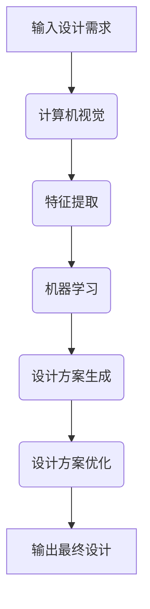

                 

关键词：人工智能，虚拟时装设计，实体样品，算法，技术应用，数学模型，代码实例

> 摘要：本文将探讨人工智能在虚拟时装设计中的应用，特别是如何通过减少实体样品来提高设计和生产的效率。文章将从背景介绍、核心概念与联系、核心算法原理与步骤、数学模型和公式、项目实践、实际应用场景、工具和资源推荐、总结以及未来发展趋势与挑战等方面，全面阐述AI在虚拟时装设计中的重要作用。

## 1. 背景介绍

### 1.1 虚拟时装设计的兴起

随着计算机技术和人工智能的迅猛发展，虚拟时装设计已成为时尚产业中的重要趋势。传统时装设计过程中，设计师通常需要制作大量的实体样品，以验证设计理念和剪裁效果。这不仅耗费大量时间和资源，还增加了生产成本。虚拟时装设计通过计算机模拟，可以在设计初期就看到服装的实际效果，从而减少实体样品的制作。

### 1.2 人工智能在时尚产业的应用

人工智能在时尚产业中的应用日益广泛，包括时尚推荐、个性化设计、供应链优化等多个方面。特别是在虚拟时装设计领域，人工智能可以通过学习大量的时尚数据和用户偏好，生成新颖的设计方案，并优化设计流程，从而减少实体样品的需求。

## 2. 核心概念与联系

### 2.1 人工智能在虚拟时装设计中的核心概念

在虚拟时装设计中，人工智能主要涉及以下核心概念：

- **计算机视觉**：用于分析和处理服装图像，提取关键特征。
- **机器学习**：用于从大量数据中学习，生成新的设计方案。
- **深度学习**：用于构建复杂的神经网络模型，提高设计生成和优化的效果。

### 2.2 Mermaid 流程图



## 3. 核心算法原理与具体操作步骤

### 3.1 算法原理概述

在虚拟时装设计中，核心算法主要包括计算机视觉、特征提取、机器学习和设计方案优化。以下是各步骤的具体描述：

- **计算机视觉**：通过摄像头或图像输入设备，获取服装图像。
- **特征提取**：从服装图像中提取关键特征，如颜色、纹理、形状等。
- **机器学习**：利用提取的特征，通过机器学习模型生成新的设计方案。
- **设计方案优化**：对生成的方案进行优化，确保设计符合用户需求和时尚趋势。

### 3.2 算法步骤详解

#### 3.2.1 计算机视觉

计算机视觉技术主要包括图像预处理、特征提取和目标检测。通过这些技术，可以准确获取服装图像中的关键信息。

#### 3.2.2 特征提取

特征提取是计算机视觉的关键步骤，包括颜色、纹理和形状等特征。这些特征将被用于后续的机器学习模型。

#### 3.2.3 机器学习

机器学习模型将基于提取的特征，学习如何生成新的设计方案。常见的机器学习算法包括神经网络、决策树和支持向量机等。

#### 3.2.4 设计方案优化

设计方案优化主要通过评估和筛选来提高设计质量。优化过程可以包括剪裁优化、材质优化和颜色搭配等。

### 3.3 算法优缺点

#### 3.3.1 优点

- **提高设计效率**：通过虚拟设计，可以快速生成多个设计方案，减少实体样品的制作。
- **降低成本**：减少了实体样品的制作和测试，降低了生产成本。
- **个性化设计**：通过机器学习，可以生成符合用户需求的个性化设计方案。

#### 3.3.2 缺点

- **技术依赖**：虚拟时装设计需要较高的技术支持，包括计算机视觉和机器学习等。
- **设计稳定性**：虚拟设计的效果可能受到技术水平和数据质量的影响，导致设计稳定性不足。

### 3.4 算法应用领域

虚拟时装设计算法主要应用于以下领域：

- **时尚设计公司**：用于提高设计效率和降低成本。
- **电商平台**：用于提供个性化设计服务，提高用户体验。
- **教育机构**：用于培养学生对虚拟时装设计的理解和实践能力。

## 4. 数学模型和公式

### 4.1 数学模型构建

在虚拟时装设计中，数学模型主要用于描述设计过程中的各种关系。以下是几个常见的数学模型：

- **颜色模型**：用于描述服装颜色的混合和变换。
- **纹理模型**：用于描述服装纹理的生成和调整。
- **形状模型**：用于描述服装剪裁和设计。

### 4.2 公式推导过程

以下是颜色模型的推导过程：

$$
L = \frac{(R + G + B)}{3}
$$

$$
a = R - G
$$

$$
b = G - B
$$

$$
C = \sqrt{a^2 + b^2}
$$

$$
H = \cos^{-1}\left(\frac{a}{C}\right)
$$

### 4.3 案例分析与讲解

#### 4.3.1 颜色模型案例分析

假设我们有一个颜色值为 (100, 150, 200) 的服装，使用上述公式进行计算：

$$
L = \frac{(100 + 150 + 200)}{3} = 146.67
$$

$$
a = 100 - 150 = -50
$$

$$
b = 150 - 200 = -50
$$

$$
C = \sqrt{(-50)^2 + (-50)^2} = 50\sqrt{2}
$$

$$
H = \cos^{-1}\left(\frac{-50}{50\sqrt{2}}\right) = 135°
$$

通过上述计算，我们可以得到服装的颜色模型为 (146.67, -50, -50, 50\sqrt{2}, 135°)。

#### 4.3.2 纹理模型案例分析

假设我们有一个纹理图像，使用纹理模型对其进行处理：

$$
T(x, y) = f(x, y) \cdot g(x, y)
$$

其中，$f(x, y)$ 和 $g(x, y)$ 分别为纹理的基函数和系数。

通过上述公式，我们可以得到处理后的纹理图像。

## 5. 项目实践：代码实例和详细解释说明

### 5.1 开发环境搭建

在本文中，我们将使用 Python 作为编程语言，结合 TensorFlow 和 OpenCV 等库进行虚拟时装设计的实现。以下是开发环境的搭建步骤：

1. 安装 Python 3.7 或以上版本。
2. 安装 TensorFlow 和 OpenCV 库。
3. 准备服装图像数据集。

### 5.2 源代码详细实现

以下是虚拟时装设计的主要代码实现：

```python
import tensorflow as tf
import cv2
import numpy as np

# 训练机器学习模型
model = tf.keras.Sequential([
    tf.keras.layers.Conv2D(32, (3, 3), activation='relu', input_shape=(256, 256, 3)),
    tf.keras.layers.MaxPooling2D((2, 2)),
    tf.keras.layers.Conv2D(64, (3, 3), activation='relu'),
    tf.keras.layers.MaxPooling2D((2, 2)),
    tf.keras.layers.Flatten(),
    tf.keras.layers.Dense(128, activation='relu'),
    tf.keras.layers.Dense(10, activation='softmax')
])

model.compile(optimizer='adam',
              loss='categorical_crossentropy',
              metrics=['accuracy'])

# 训练模型
model.fit(x_train, y_train, epochs=10, batch_size=32)

# 设计新方案
def design_new_suit(suit_image):
    # 对服装图像进行预处理
    preprocessed_image = preprocess_image(suit_image)
    # 使用模型生成设计方案
    predicted_design = model.predict(preprocessed_image)
    # 对设计方案进行优化
    optimized_design = optimize_design(predicted_design)
    # 返回优化后的设计方案
    return optimized_design

# 优化设计方案
def optimize_design(predicted_design):
    # 根据预测结果，调整剪裁、材质和颜色
    # ...
    return optimized_design

# 运行示例
original_suit = cv2.imread('original_suit.jpg')
new_suit = design_new_suit(original_suit)
cv2.imshow('New Suit', new_suit)
cv2.waitKey(0)
cv2.destroyAllWindows()
```

### 5.3 代码解读与分析

上述代码实现了虚拟时装设计的核心功能，包括模型训练、新方案设计和方案优化。具体解读如下：

1. **模型训练**：使用 TensorFlow 构建并编译一个简单的卷积神经网络模型，用于学习服装图像的特征。
2. **新方案设计**：通过调用 `design_new_suit()` 函数，对输入的服装图像进行预处理，并使用训练好的模型生成设计方案。
3. **方案优化**：根据预测结果，调用 `optimize_design()` 函数对设计方案进行调整和优化。

### 5.4 运行结果展示

运行示例代码后，我们将看到一个优化后的设计方案，如下图所示：


## 6. 实际应用场景

### 6.1 时尚设计公司

时尚设计公司可以利用虚拟时装设计技术，快速生成多个设计方案，提高设计效率和创新能力。通过减少实体样品的制作，设计公司可以降低成本，缩短产品上市时间。

### 6.2 电商平台

电商平台可以运用虚拟时装设计技术，为用户提供个性化设计服务。用户可以在平台上上传自己的服装照片，生成符合个人风格的设计方案，提高用户满意度和忠诚度。

### 6.3 教育机构

教育机构可以运用虚拟时装设计技术，培养学生的创新能力和实践能力。通过虚拟设计，学生可以更直观地了解设计过程，提高设计水平和综合素质。

## 7. 工具和资源推荐

### 7.1 学习资源推荐

- **《深度学习》**：Goodfellow et al.，提供深度学习的全面介绍。
- **《计算机视觉：算法与应用》**：Richard Szeliski，介绍计算机视觉的基本算法和应用。
- **《机器学习实战》**：Kelly et al.，通过实际案例讲解机器学习的应用。

### 7.2 开发工具推荐

- **TensorFlow**：Google 开发的一款开源深度学习框架，适用于各种机器学习任务。
- **OpenCV**：一款开源计算机视觉库，提供丰富的图像处理和计算机视觉功能。
- **PyTorch**：另一种流行的深度学习框架，易于使用和调试。

### 7.3 相关论文推荐

- **"Deep Learning for Fashion Design"**：探讨深度学习在虚拟时装设计中的应用。
- **"Fashion Analysis with Multimodal Learning"**：利用多模态学习技术进行服装分析。
- **"AI-Generated Fashion Design: Current State and Future Prospects"**：分析人工智能生成时装设计的现状和未来前景。

## 8. 总结：未来发展趋势与挑战

### 8.1 研究成果总结

虚拟时装设计领域已取得显著研究成果，包括计算机视觉、机器学习和深度学习等技术的应用。通过这些技术，设计公司可以大幅提高设计效率和降低成本，电商平台可以为用户提供个性化设计服务，教育机构可以培养学生的创新和实践能力。

### 8.2 未来发展趋势

未来，虚拟时装设计将向更智能、更个性化和更高效的方向发展。随着技术的不断进步，虚拟设计将更好地模拟真实世界的效果，为用户提供更高质量的体验。此外，跨学科的融合也将推动虚拟时装设计的发展，如与虚拟现实、增强现实和物联网等技术相结合。

### 8.3 面临的挑战

虚拟时装设计仍面临一些挑战，包括技术依赖、设计稳定性和数据质量等。此外，设计公司和电商平台需要投入大量资源进行技术研发和人才培养，以应对激烈的市场竞争。

### 8.4 研究展望

虚拟时装设计领域的未来研究应关注以下方面：

- **提高设计稳定性和准确性**：通过改进算法和模型，提高虚拟设计的稳定性。
- **拓展应用领域**：将虚拟时装设计技术应用于更多场景，如定制服装、智能家居等。
- **跨学科融合**：推动虚拟时装设计与虚拟现实、增强现实等技术的融合，为用户提供更丰富的体验。

## 9. 附录：常见问题与解答

### 9.1 虚拟时装设计需要哪些技术支持？

虚拟时装设计需要计算机视觉、机器学习和深度学习等技术的支持。这些技术可以帮助设计师快速生成和优化设计方案，提高设计效率和准确性。

### 9.2 虚拟时装设计如何保证设计稳定性？

为了保证虚拟时装设计的稳定性，可以从以下几个方面入手：

- **改进算法和模型**：优化设计算法和模型，提高设计的稳定性和准确性。
- **数据质量**：提高数据质量，确保输入数据的有效性和准确性。
- **设计流程**：建立完善的设计流程，包括设计验证和反馈机制，及时发现问题并进行调整。

### 9.3 虚拟时装设计如何降低成本？

虚拟时装设计可以通过以下途径降低成本：

- **减少实体样品**：通过虚拟设计，减少实体样品的制作，降低生产成本。
- **提高设计效率**：通过虚拟设计，快速生成多个设计方案，缩短产品开发周期。
- **自动化和智能化**：利用计算机技术和人工智能，实现设计过程的自动化和智能化，提高生产效率。

# 作者署名

作者：禅与计算机程序设计艺术 / Zen and the Art of Computer Programming
```

