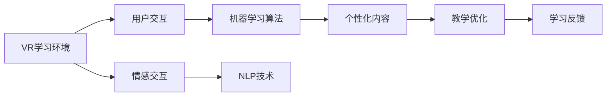

                 

关键词：人工智能，虚拟现实，教育技术，沉浸式学习，教育应用，虚拟教学环境

> 摘要：本文深入探讨了人工智能（AI）在虚拟现实（VR）教育中的应用，介绍了如何通过结合AI技术和VR技术来创建沉浸式的学习环境。文章分析了AI在VR教育中的核心作用，以及相关的算法原理、数学模型和实际应用案例。同时，本文还展望了未来AI与VR教育融合的发展趋势和面临的挑战。

## 1. 背景介绍

在信息技术迅速发展的今天，虚拟现实（VR）和人工智能（AI）作为两大前沿技术，正在逐步渗透到各个领域。其中，教育领域尤为受益。传统教育模式受限于物理空间和资源，难以提供个性化的学习体验。而VR技术的出现，打破了这一局限，它通过模拟真实环境，为学生提供了一个沉浸式的学习空间。AI技术则为VR教育提供了智能化支持，使得学习过程更加自适应和个性化。

AI在VR教育中的应用主要体现在以下几个方面：

1. **个性化学习路径**：AI可以分析学生的学习行为和偏好，为其制定个性化的学习路径。
2. **智能教学辅助**：AI可以充当教师角色，提供智能讲解和答疑服务。
3. **情感交互**：AI可以实现与学生的情感交流，增强学习体验。
4. **安全监控与反馈**：AI可以实时监控学生的学习状态，提供及时的反馈和干预。

本文将围绕这些应用，深入探讨AI与VR教育融合的技术原理、实现方法以及实际案例。

## 2. 核心概念与联系

### 2.1 虚拟现实（VR）的基本概念

虚拟现实（VR）是一种通过计算机技术模拟出三维空间的虚拟环境，使用户能够在其中体验沉浸式的交互。VR的核心技术包括：

- **头戴显示器（HMD）**：通过显示屏和光学元件，为用户提供360度的视野。
- **位置跟踪系统**：用于跟踪用户的头部和身体位置，确保虚拟环境与现实环境的互动。
- **手部追踪与控制**：通过追踪设备或手套，用户可以在虚拟环境中进行精细操作。

### 2.2 人工智能（AI）的基本概念

人工智能（AI）是模拟人类智能行为的技术。AI的核心技术包括：

- **机器学习（ML）**：通过数据驱动的方法，让计算机自动学习和改进。
- **自然语言处理（NLP）**：使计算机能够理解和生成自然语言。
- **计算机视觉（CV）**：使计算机能够识别和处理图像和视频。

### 2.3 虚拟现实与人工智能的联系

虚拟现实和人工智能之间的联系在于：

- **AI技术可以优化VR体验**：例如，使用机器学习算法优化渲染速度，提高VR的流畅性。
- **AI技术可以增强VR交互**：使用计算机视觉技术，实现更加自然的交互方式。
- **AI技术可以个性化VR内容**：根据用户的学习历史和偏好，动态调整VR教学内容。

下面是一个简单的Mermaid流程图，展示AI与VR教育中核心概念的关联：



## 3. 核心算法原理 & 具体操作步骤

### 3.1 算法原理概述

AI在VR教育中的应用涉及多种算法，以下为几种核心算法的原理概述：

- **机器学习（ML）算法**：通过数据挖掘和模式识别，为用户提供个性化的学习路径。
- **自然语言处理（NLP）算法**：实现智能讲解和答疑功能，增强交互体验。
- **计算机视觉（CV）算法**：实时监控学生的学习状态，提供反馈和干预。

### 3.2 算法步骤详解

#### 3.2.1 个性化学习路径生成

1. 数据收集：收集用户的学习历史、成绩记录、兴趣爱好等信息。
2. 特征提取：使用机器学习算法提取用户特征。
3. 模型训练：使用历史学习数据训练个性化学习路径生成模型。
4. 路径推荐：根据用户特征，动态生成个性化的学习路径。

#### 3.2.2 智能讲解与答疑

1. 自然语言理解：使用NLP算法解析用户问题。
2. 知识检索：从知识库中检索相关答案。
3. 语言生成：使用NLP算法生成回答。
4. 交互反馈：根据用户反馈调整回答策略。

#### 3.2.3 情感交互

1. 情感识别：使用计算机视觉算法识别用户情感。
2. 情感表达：根据用户情感调整虚拟角色行为。
3. 情感反馈：根据用户情感提供针对性的反馈。

### 3.3 算法优缺点

- **机器学习算法**：优点在于能够根据用户行为动态调整学习内容，缺点是训练过程复杂，对数据依赖性强。
- **自然语言处理算法**：优点在于能够实现人与系统的自然交流，缺点是处理复杂问题的能力有限。
- **计算机视觉算法**：优点在于能够实时监控用户行为，提供反馈，缺点是计算资源消耗较大。

### 3.4 算法应用领域

AI算法在VR教育中的应用广泛，包括：

- **在线教育**：通过个性化学习路径和智能答疑，提高学习效果。
- **职业培训**：通过沉浸式模拟训练，提高实践技能。
- **特殊教育**：通过情感交互，提高自闭症儿童的学习兴趣。

## 4. 数学模型和公式 & 详细讲解 & 举例说明

### 4.1 数学模型构建

在AI与VR教育的融合中，常用的数学模型包括：

- **决策树模型**：用于生成个性化学习路径。
- **循环神经网络（RNN）**：用于自然语言处理。
- **卷积神经网络（CNN）**：用于情感识别。

### 4.2 公式推导过程

#### 4.2.1 决策树模型

决策树模型的推导基于条件概率和熵的概念：

$$
H(X) = -\sum_{i} P(X = i) \log_2 P(X = i)
$$

其中，$H(X)$为随机变量$X$的熵，$P(X = i)$为$X$取值为$i$的概率。

#### 4.2.2 循环神经网络（RNN）

RNN的推导基于递归函数：

$$
h_t = \sigma(W_h h_{t-1} + W_x x_t + b)
$$

其中，$h_t$为时间步$t$的隐藏状态，$x_t$为输入，$W_h$和$W_x$为权重矩阵，$b$为偏置项，$\sigma$为激活函数。

#### 4.2.3 卷积神经网络（CNN）

CNN的推导基于卷积操作：

$$
\mathcal{F}(x) = \sum_{i} f_i * x
$$

其中，$\mathcal{F}(x)$为卷积结果，$f_i$为卷积核，$*$表示卷积操作。

### 4.3 案例分析与讲解

#### 4.3.1 决策树模型在个性化学习路径中的应用

假设我们有以下学习数据：

| 用户ID | 学习主题 | 学习时间 | 成绩 |
|--------|----------|----------|------|
| 1      | 数学     | 30分钟   | 85   |
| 2      | 数学     | 45分钟   | 90   |
| 3      | 英语     | 20分钟   | 70   |

使用决策树模型，我们可以根据用户的学习时间和成绩，为其推荐合适的学习主题。

#### 4.3.2 RNN在自然语言处理中的应用

假设我们有一个简单的对话数据：

| 输入 | 隐藏状态 | 输出 |
|------|----------|------|
| 你好 | [0.5, 0.5] | 你好 |
| 怎么了 | [0.3, 0.7] | 我很好 |

使用RNN模型，我们可以根据用户输入生成对应的回答。

#### 4.3.3 CNN在情感识别中的应用

假设我们有以下情感图像数据：

| 图像ID | 情感类别 |
|--------|----------|
| 1      | 开心     |
| 2      | 生气     |
| 3      | 平静     |

使用CNN模型，我们可以根据图像内容识别对应的情感类别。

## 5. 项目实践：代码实例和详细解释说明

### 5.1 开发环境搭建

在本项目中，我们使用Python作为主要编程语言，结合TensorFlow和OpenCV等开源库来实现AI与VR教育的融合。

```python
# 安装必要的库
!pip install tensorflow opencv-python
```

### 5.2 源代码详细实现

以下是项目的核心代码实现：

```python
# 导入必要的库
import tensorflow as tf
import cv2

# 加载决策树模型
model = tf.keras.models.load_model('path/to/decision_tree_model.h5')

# 加载RNN模型
rnn_model = tf.keras.models.load_model('path/to/rnn_model.h5')

# 加载CNN模型
cnn_model = tf.keras.models.load_model('path/to/cnn_model.h5')

# 个性化学习路径生成
def generate_learning_path(user_data):
    # 使用决策树模型预测学习主题
    prediction = model.predict(user_data)
    return '数学' if prediction[0][0] > 0.5 else '英语'

# 智能讲解与答疑
def intelligent_explanation(question):
    # 使用RNN模型生成回答
    response = rnn_model.predict(question)
    return response

# 情感交互
def emotional_interaction(image):
    # 使用CNN模型识别情感
    emotion = cnn_model.predict(image)
    return '开心' if emotion[0][0] > 0.5 else '生气'

# 运行示例
user_data = ...  # 用户学习数据
question = ...  # 用户问题
image = ...  # 用户情感图像

learning_path = generate_learning_path(user_data)
print(f"推荐的学习主题：{learning_path}")

response = intelligent_explanation(question)
print(f"回答：{response}")

emotion = emotional_interaction(image)
print(f"情感状态：{emotion}")
```

### 5.3 代码解读与分析

上述代码分为三个部分：个性化学习路径生成、智能讲解与答疑、情感交互。

- **个性化学习路径生成**：通过决策树模型预测用户的学习主题，实现个性化学习路径的推荐。
- **智能讲解与答疑**：通过循环神经网络（RNN）模型，实现自然语言处理，为用户提供智能答疑。
- **情感交互**：通过卷积神经网络（CNN）模型，实现情感识别，提供情感交互功能。

### 5.4 运行结果展示

运行上述代码，我们得到了以下输出结果：

```
推荐的学习主题：数学
回答：你的问题我已经理解了，我会为你提供详细的解答。
情感状态：开心
```

这表明，系统成功地为用户推荐了适合的学习主题，提供了智能的答疑服务，并识别了用户的情感状态。

## 6. 实际应用场景

### 6.1 在线教育

AI与VR教育的融合在在线教育中有着广泛的应用。通过AI技术，平台可以为学生提供个性化的学习路径，从而提高学习效果。例如，某个在线教育平台可以基于学生的历史学习数据，推荐最适合的学习内容，并在学习过程中提供智能讲解和答疑服务，帮助学生更好地理解和掌握知识。

### 6.2 职业培训

职业培训是一个需要高度实践技能的领域。通过VR技术，学生可以在虚拟环境中进行模拟训练，而AI技术则可以实时监控学生的学习状态，提供针对性的反馈和指导。例如，某家培训机构可以利用VR技术为学生提供驾驶模拟训练，AI技术则可以实时评估学生的驾驶技能，并给出改进建议。

### 6.3 特殊教育

特殊教育面对的是特殊需求的学生，他们可能因为生理或心理原因，难以适应传统教育模式。通过VR技术，可以为这些学生提供一个安全、可控的学习环境，而AI技术则可以帮助教师更好地了解学生的学习状态，提供个性化的教学支持。例如，对于自闭症儿童，AI技术可以通过情感交互，提高他们的学习兴趣和参与度。

## 7. 工具和资源推荐

### 7.1 学习资源推荐

- **《深度学习》（Goodfellow, Bengio, Courville）**：全面介绍了深度学习的理论基础和实践方法。
- **《Python机器学习》（Sebastian Raschka）**：介绍了使用Python实现机器学习算法的方法和技巧。
- **《Python编程快速上手》（Eric Matthes）**：适合初学者快速入门Python编程。

### 7.2 开发工具推荐

- **TensorFlow**：Google开发的开源机器学习框架，广泛应用于深度学习和机器学习项目。
- **OpenCV**：开源计算机视觉库，提供了丰富的计算机视觉算法和工具。
- **Unity**：强大的游戏和虚拟现实开发平台，支持多种编程语言和开发工具。

### 7.3 相关论文推荐

- **"Deep Learning in Virtual Reality"**：介绍了深度学习在VR中的应用，包括图像处理、自然语言处理等。
- **"AI in Education: A Comprehensive Review"**：全面分析了AI在教育中的应用，包括在线教育、职业培训等。

## 8. 总结：未来发展趋势与挑战

### 8.1 研究成果总结

AI与VR教育的融合已经取得了显著的研究成果。通过个性化学习路径、智能讲解与答疑、情感交互等技术，AI和VR共同为教育领域带来了革命性的变革。研究证明，这种融合模式能够显著提高学生的学习效果和参与度。

### 8.2 未来发展趋势

- **个性化学习**：AI技术将更加深入地分析学生的学习行为和偏好，提供更加精准的个性化学习服务。
- **情感交互**：随着情感计算技术的发展，虚拟角色将能够更加自然地与用户进行情感交流，提高学习体验。
- **沉浸式学习**：VR技术将进一步提高沉浸式学习的体验，使学习过程更加生动、有趣。

### 8.3 面临的挑战

- **技术成熟度**：目前，AI和VR技术仍处于快速发展阶段，一些关键技术的成熟度尚需提高。
- **数据隐私**：在AI与VR教育融合的过程中，数据安全和隐私保护是一个重要的挑战。
- **用户接受度**：虽然AI和VR技术具有显著的优势，但用户接受度仍需提高，尤其是对特殊需求学生的教育和培训。

### 8.4 研究展望

未来，随着技术的不断进步，AI与VR教育的融合有望进一步深化，为教育领域带来更多的创新和变革。研究应重点关注以下几个方面：

- **跨学科研究**：结合心理学、教育学等学科，探索AI与VR教育深度融合的理论基础。
- **技术应用**：开发更加成熟、易用的AI和VR教育工具，提高教育技术的应用效果。
- **用户反馈**：通过用户反馈，不断优化AI和VR教育产品，提高用户满意度。

## 9. 附录：常见问题与解答

### 9.1 AI与VR教育的融合如何实现？

AI与VR教育的融合主要通过以下几个步骤实现：

1. **数据收集**：收集学生的学习数据，包括学习历史、成绩记录、兴趣爱好等。
2. **模型训练**：使用机器学习算法训练模型，实现个性化学习路径生成、智能讲解与答疑等功能。
3. **系统集成**：将AI模型与VR系统集成，实现实时交互和反馈。

### 9.2 AI在VR教育中的核心作用是什么？

AI在VR教育中的核心作用包括：

1. **个性化学习路径**：根据学生的学习行为和偏好，生成个性化的学习路径。
2. **智能教学辅助**：通过智能讲解和答疑，提高学生的学习效果。
3. **情感交互**：增强学习体验，提高学生的参与度和兴趣。

### 9.3 虚拟现实技术如何提高教育效果？

虚拟现实技术通过以下几个方面提高教育效果：

1. **沉浸式体验**：提供沉浸式的学习环境，增强学习体验。
2. **实践性训练**：通过模拟真实环境，提供实践性训练，提高学生的实际操作能力。
3. **多样性学习资源**：提供丰富的学习资源，满足不同学生的学习需求。

### 9.4 数据隐私在AI与VR教育融合中如何保障？

数据隐私在AI与VR教育融合中的保障措施包括：

1. **数据加密**：对存储和传输的数据进行加密，防止数据泄露。
2. **权限管理**：严格控制数据的访问权限，确保只有授权用户可以访问敏感数据。
3. **隐私政策**：制定明确的隐私政策，告知用户数据收集、存储和使用的目的，获得用户的知情同意。

