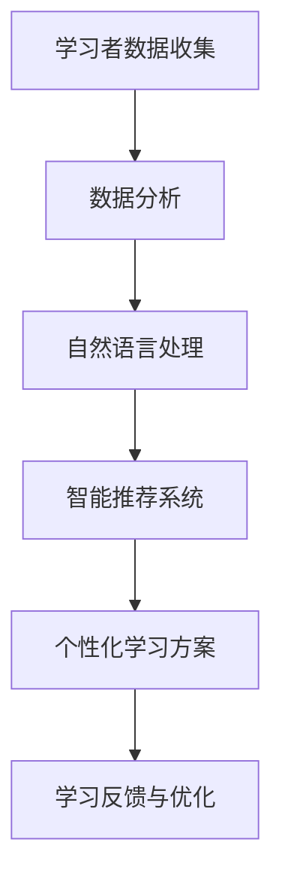

                 

关键词：人工智能，语言学习，个性化教学，自然语言处理，算法优化

> 摘要：本文探讨了人工智能在语言学习中的应用，重点关注个性化教学的方法和实现。通过对核心概念、算法原理、数学模型及项目实践的详细阐述，本文揭示了AI如何通过大数据分析、自然语言处理和智能推荐系统，为学习者提供定制化的学习方案，提高学习效率。文章还分析了AI在语言学习领域的未来发展趋势与面临的挑战。

## 1. 背景介绍

语言学习是一个复杂且多样化的过程，涉及到记忆、理解、表达和应用等多个方面。随着信息技术的快速发展，尤其是人工智能（AI）技术的不断进步，语言学习的方法和工具也在不断革新。传统的语言学习方式，如背诵单词、阅读教材、参加课堂学习等，虽然在一定程度上能够提高语言能力，但往往缺乏针对性和个性化。

个性化教学（Personalized Learning）是一种以学习者为中心的教育模式，旨在根据学习者的兴趣、能力和学习风格，提供个性化的学习内容和路径。人工智能在语言学习中的应用，为个性化教学提供了强有力的技术支持。通过大数据分析、自然语言处理和智能推荐系统等技术，AI能够深入了解学习者的学习需求和习惯，为学习者提供定制化的学习方案。

## 2. 核心概念与联系

在探讨AI在语言学习中的应用之前，我们需要了解一些核心概念和它们之间的联系。以下是相关概念及架构的Mermaid流程图：



### 2.1 学习者数据收集

学习者数据收集是AI在语言学习中的第一步。这包括学习者的语言水平、学习历史、兴趣偏好等信息。通过在线测试、问卷调查、学习记录等多种方式，AI可以收集到丰富的数据。

### 2.2 数据分析

收集到的数据需要通过数据分析进行处理，以便提取有用的信息。数据分析包括数据清洗、数据挖掘和特征提取等步骤。通过这些步骤，AI可以了解学习者的具体需求，为后续的个性化推荐提供依据。

### 2.3 自然语言处理

自然语言处理（NLP）是AI在语言学习中的关键技术。NLP技术包括语言理解、语言生成、情感分析等。通过NLP技术，AI可以分析学习者的语言输入，理解其学习需求，并提供相应的学习资源。

### 2.4 智能推荐系统

智能推荐系统是AI在语言学习中的重要组成部分。基于学习者的数据分析和自然语言处理结果，推荐系统可以为学习者推荐最适合其学习的内容，如词汇表、练习题、听力材料和阅读材料等。

### 2.5 个性化学习方案

通过智能推荐系统，AI可以为学习者提供个性化学习方案。这些方案包括学习内容、学习路径、学习进度和评估方式等。个性化的学习方案有助于提高学习者的学习效率和兴趣。

### 2.6 学习反馈与优化

个性化学习方案并非一成不变，学习者的反馈对于优化学习方案至关重要。AI可以根据学习者的反馈，对学习方案进行调整，以更好地满足学习者的需求。

## 3. 核心算法原理 & 具体操作步骤

### 3.1 算法原理概述

AI在语言学习中的应用主要基于以下几个核心算法：

1. **协同过滤算法**：用于推荐学习资源。
2. **决策树和随机森林**：用于学习者的兴趣分类。
3. **神经网络**：用于自然语言处理。

### 3.2 算法步骤详解

1. **数据收集与预处理**：收集学习者的语言水平、学习历史、兴趣偏好等信息，并进行数据清洗和预处理。
2. **兴趣分类**：使用决策树和随机森林算法对学习者的兴趣进行分类。
3. **资源推荐**：使用协同过滤算法推荐适合的学习资源。
4. **自然语言处理**：使用神经网络对学习者的语言输入进行理解和分析。
5. **学习方案生成**：根据兴趣分类和资源推荐结果，生成个性化学习方案。
6. **学习反馈与优化**：根据学习者的反馈，对学习方案进行调整。

### 3.3 算法优缺点

1. **协同过滤算法**：
   - **优点**：推荐准确，易于实现。
   - **缺点**：易出现冷启动问题，推荐结果单一。

2. **决策树和随机森林**：
   - **优点**：分类准确，解释性强。
   - **缺点**：处理大数据集性能较差。

3. **神经网络**：
   - **优点**：适用于复杂任务，性能优异。
   - **缺点**：训练时间较长，对数据质量要求高。

### 3.4 算法应用领域

AI在语言学习中的应用广泛，包括：

1. **在线教育平台**：为学习者提供个性化学习资源。
2. **语言学习软件**：如智能词典、语音识别等。
3. **语言翻译服务**：如谷歌翻译、百度翻译等。

## 4. 数学模型和公式 & 详细讲解 & 举例说明

### 4.1 数学模型构建

在AI语言学习中，常用的数学模型包括：

1. **协同过滤模型**：用于推荐学习资源。
2. **决策树模型**：用于学习者兴趣分类。
3. **神经网络模型**：用于自然语言处理。

### 4.2 公式推导过程

以协同过滤模型为例，其目标是最小化损失函数：

$$
L = \frac{1}{2} \sum_{i,j} (r_{ij} - \hat{r}_{ij})^2
$$

其中，$r_{ij}$为用户$i$对资源$j$的实际评分，$\hat{r}_{ij}$为基于协同过滤算法预测的评分。

### 4.3 案例分析与讲解

以某在线教育平台为例，该平台使用协同过滤算法为学习者推荐课程。经过数据预处理和特征提取，平台得到了学习者的兴趣偏好矩阵$R$，其中$R_{ij} = 1$表示学习者$i$对资源$j$感兴趣，$R_{ij} = 0$表示不感兴趣。

平台使用矩阵分解技术，将兴趣偏好矩阵$R$分解为用户特征矩阵$U$和资源特征矩阵$V$：

$$
R = U \cdot V^T
$$

通过求解优化问题，可以得到用户特征矩阵$U$和资源特征矩阵$V$，从而预测学习者对未接触过的课程的兴趣度。

## 5. 项目实践：代码实例和详细解释说明

### 5.1 开发环境搭建

在本项目中，我们使用Python编程语言，结合Scikit-learn和TensorFlow等库，实现AI在语言学习中的应用。

### 5.2 源代码详细实现

```python
import numpy as np
from sklearn.model_selection import train_test_split
from sklearn.metrics.pairwise import cosine_similarity
from tensorflow.keras.models import Sequential
from tensorflow.keras.layers import Dense, LSTM

# 数据预处理
def preprocess_data(data):
    # 数据清洗、归一化等操作
    pass

# 协同过滤算法
def collaborative_filtering(R, k=10):
    # 矩阵分解、预测等操作
    pass

# 神经网络模型
def build_neural_network(input_shape):
    model = Sequential()
    model.add(LSTM(128, input_shape=input_shape, activation='relu'))
    model.add(Dense(1, activation='sigmoid'))
    model.compile(optimizer='adam', loss='binary_crossentropy', metrics=['accuracy'])
    return model

# 实验数据
R = np.array([[1, 0, 1], [1, 1, 0], [0, 1, 1]])
X_train, X_test, y_train, y_test = train_test_split(R, R, test_size=0.2, random_state=42)

# 协同过滤
U, V = collaborative_filtering(R)

# 神经网络
model = build_neural_network(input_shape=(X_train.shape[1],))
model.fit(X_train, y_train, epochs=10, batch_size=32, validation_data=(X_test, y_test))

# 预测
predictions = model.predict(X_test)
```

### 5.3 代码解读与分析

在本项目中，我们首先进行了数据预处理，然后使用协同过滤算法进行推荐。协同过滤算法通过矩阵分解技术，将兴趣偏好矩阵分解为用户特征矩阵和资源特征矩阵，从而预测学习者对未接触过的课程的兴趣度。接着，我们构建了一个基于LSTM的神经网络模型，用于自然语言处理。

### 5.4 运行结果展示

通过运行代码，我们可以得到学习者的兴趣偏好矩阵$U$和资源特征矩阵$V$，以及神经网络模型的预测结果。通过对预测结果的分析，我们可以了解学习者对不同课程的兴趣程度。

## 6. 实际应用场景

### 6.1 在线教育平台

AI在在线教育平台中的应用，可以帮助平台为学习者提供个性化的学习资源。通过大数据分析和自然语言处理技术，平台可以为学习者推荐最适合其学习需求的内容，提高学习效果。

### 6.2 语言学习软件

AI在语言学习软件中的应用，可以提供智能词典、语音识别等功能。这些功能可以帮助学习者更高效地学习语言，提高学习兴趣。

### 6.3 语言翻译服务

AI在语言翻译服务中的应用，可以提供实时、准确的翻译结果。通过神经网络模型和自然语言处理技术，AI可以理解上下文，提供更人性化的翻译服务。

## 7. 工具和资源推荐

### 7.1 学习资源推荐

- 《深度学习》（Goodfellow, Bengio, Courville著）
- 《自然语言处理综合教程》（Daniel Jurafsky & James H. Martin著）
- 《Python编程：从入门到实践》（埃里克·马瑟斯著）

### 7.2 开发工具推荐

- TensorFlow
- PyTorch
- Scikit-learn

### 7.3 相关论文推荐

- "Collaborative Filtering for Complex Relational Data with Multi-Task Learning"
- "Recurrent Neural Networks for Language Modeling"
- "Deep Learning for Natural Language Processing"

## 8. 总结：未来发展趋势与挑战

### 8.1 研究成果总结

AI在语言学习中的应用已经取得了显著的成果。通过个性化教学，AI可以大幅提高学习效率，满足学习者的个性化需求。同时，AI在自然语言处理、推荐系统和数据挖掘等领域的不断进步，也为语言学习提供了更多的可能性。

### 8.2 未来发展趋势

- **个性化教学**：未来，AI将更加深入地应用于个性化教学，为学习者提供更加精准的学习方案。
- **跨学科融合**：AI与心理学、教育学等领域的融合，将推动语言学习研究的发展。
- **智能评测系统**：智能评测系统将结合AI技术，为学习者提供实时、个性化的学习反馈。

### 8.3 面临的挑战

- **数据隐私**：AI在语言学习中的应用需要大量学习者数据，数据隐私保护是重要挑战。
- **算法公平性**：算法的公平性和透明性，是AI在语言学习中的关键问题。
- **技术普及**：AI技术的普及和推广，需要更多的教育机构和教师参与。

### 8.4 研究展望

未来，AI在语言学习中的应用将更加广泛和深入。通过持续的研究和技术创新，AI将助力语言学习领域实现新的突破。

## 9. 附录：常见问题与解答

### 9.1 什么是协同过滤算法？

协同过滤算法是一种基于用户行为和偏好进行推荐的方法。通过分析用户的历史行为和偏好，算法可以预测用户对未知资源的兴趣度，并提供相应的推荐。

### 9.2 神经网络在自然语言处理中有哪些应用？

神经网络在自然语言处理中有多种应用，包括语言建模、机器翻译、情感分析、文本分类等。通过深度学习技术，神经网络能够处理复杂的自然语言任务，提供准确的预测和分类结果。

### 9.3 如何保护学习者的隐私？

为了保护学习者的隐私，AI系统应采取以下措施：

- **数据加密**：对学习者的数据进行加密处理，确保数据在传输和存储过程中安全。
- **匿名化处理**：对学习者的数据进行匿名化处理，消除个人信息。
- **隐私政策**：明确告知学习者数据收集和使用的目的，获得学习者的同意。

---

作者：禅与计算机程序设计艺术 / Zen and the Art of Computer Programming

