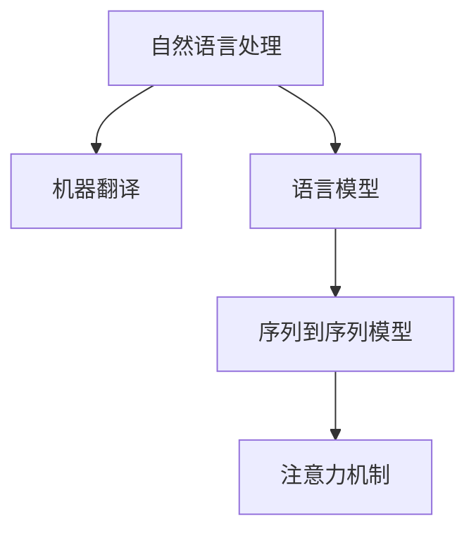

                 

关键词：人工智能，自然语言处理，机器翻译，语言学习，深度学习

> 摘要：随着人工智能技术的不断发展，自然语言处理领域取得了显著的进步。本文将探讨人工智能在语言学习和翻译中的应用，分析其核心概念、算法原理、数学模型以及实际应用案例，并对未来的发展趋势和挑战进行展望。

## 1. 背景介绍

语言学习和翻译一直是人类智慧的结晶，然而随着全球化进程的加快，人们对跨语言交流的需求日益增加。传统的语言学习方法和翻译手段在效率和准确性方面存在诸多不足。近年来，人工智能技术的快速发展为语言学习和翻译带来了新的机遇。机器翻译和自然语言处理技术的进步，使得人工智能在语言理解和生成方面取得了重大突破。

### 人工智能的发展历程

人工智能（AI）起源于20世纪50年代，经过几十年的发展，已经从最初的符号主义和知识表示阶段，逐渐演变为基于数据驱动的深度学习方法。人工智能的发展可以分为以下几个阶段：

1. **符号主义阶段**：以逻辑推理和知识表示为基础，通过形式化规则进行问题求解。
2. **连接主义阶段**：以神经网络为代表，通过大量数据训练，实现特征提取和模式识别。
3. **深度学习阶段**：基于深度神经网络，通过层次化的特征提取，实现复杂任务的学习和预测。

### 自然语言处理的发展

自然语言处理（NLP）是人工智能领域的一个重要分支，旨在使计算机理解和生成人类语言。NLP的发展经历了从规则驱动到数据驱动的方法转变。早期的NLP主要依赖语言学规则和形式化语法，而现代NLP则依靠大量数据和先进的算法，特别是深度学习技术，使得机器翻译和语言生成等任务取得了显著成效。

## 2. 核心概念与联系

### 核心概念

1. **自然语言处理（NLP）**：研究如何让计算机理解、生成和处理自然语言。
2. **机器翻译（MT）**：将一种语言的文本自动翻译成另一种语言。
3. **语言模型（LM）**：用于预测文本序列的概率分布。
4. **序列到序列（Seq2Seq）模型**：一种用于处理序列数据的神经网络模型。
5. **注意力机制（Attention Mechanism）**：一种用于提高机器翻译准确性的机制。

### Mermaid 流程图



### 关联与联系

自然语言处理是机器翻译的基础，语言模型为机器翻译提供文本序列的概率分布。序列到序列模型和注意力机制进一步提升了机器翻译的准确性。这些核心概念相互关联，共同推动了语言学习和翻译领域的发展。

## 3. 核心算法原理 & 具体操作步骤

### 3.1 算法原理概述

机器翻译的基本原理是通过将源语言文本映射到目标语言文本，实现跨语言交流。深度学习中的序列到序列模型和注意力机制是机器翻译的核心算法。

序列到序列模型（Seq2Seq）通过编码器（Encoder）和解码器（Decoder）两个部分，实现源语言到目标语言的映射。编码器将源语言文本编码成一个固定长度的向量，解码器则基于这个向量生成目标语言文本。

注意力机制（Attention Mechanism）是一种用于提高机器翻译准确性的方法。它允许解码器在生成目标语言文本时，关注源语言文本的不同部分，从而提高翻译的连贯性和准确性。

### 3.2 算法步骤详解

1. **输入处理**：将源语言文本输入编码器，编码器将文本序列转换为固定长度的向量表示。
2. **编码器输出**：编码器输出一个固定长度的隐藏状态向量，用于表示源语言文本。
3. **解码器输入**：解码器基于编码器输出的隐藏状态向量，生成目标语言文本。
4. **注意力计算**：解码器在每个时间步计算注意力权重，关注源语言文本的不同部分。
5. **解码输出**：解码器根据注意力权重生成目标语言文本。

### 3.3 算法优缺点

**优点**：
1. **高准确性**：通过深度学习和注意力机制，机器翻译的准确性得到了显著提升。
2. **强泛化能力**：机器翻译模型可以处理不同语言和不同领域的文本。

**缺点**：
1. **计算资源消耗大**：训练深度学习模型需要大量计算资源和时间。
2. **依赖大量数据**：机器翻译模型需要大量标注数据进行训练。

### 3.4 算法应用领域

机器翻译算法在多个领域具有广泛的应用，包括：

1. **跨语言交流**：实现不同语言之间的无缝交流。
2. **多语言内容生成**：用于生成多种语言的内容，如新闻、博客等。
3. **语言学习辅助**：辅助学习者学习外语，提高学习效果。

## 4. 数学模型和公式 & 详细讲解 & 举例说明

### 4.1 数学模型构建

机器翻译的数学模型主要包括编码器、解码器和注意力机制。

#### 编码器

编码器将源语言文本映射为一个固定长度的向量表示。具体实现如下：

$$
h_t = \text{Encoder}(x_t)
$$

其中，$h_t$ 为编码器在时间步 $t$ 的输出，$x_t$ 为源语言文本的输入。

#### 解码器

解码器基于编码器输出的隐藏状态向量，生成目标语言文本。具体实现如下：

$$
y_t = \text{Decoder}(h_t)
$$

其中，$y_t$ 为解码器在时间步 $t$ 的输出。

#### 注意力机制

注意力机制用于计算解码器在生成目标语言文本时，对源语言文本的不同部分的关注程度。具体实现如下：

$$
a_t = \text{Attention}(h_t, s_t)
$$

其中，$a_t$ 为时间步 $t$ 的注意力权重，$s_t$ 为编码器输出的隐藏状态向量。

### 4.2 公式推导过程

#### 编码器推导

编码器的推导过程主要包括词向量化、序列编码和状态转移。

1. **词向量化**：

$$
x_t = \text{Embedding}(w_t)
$$

其中，$x_t$ 为源语言文本的词向量，$w_t$ 为词索引。

2. **序列编码**：

$$
h_t = \text{Encoder}(x_t)
$$

其中，$h_t$ 为编码器在时间步 $t$ 的输出。

3. **状态转移**：

$$
h_{t+1} = \text{Update}(h_t, h_{t-1})
$$

其中，$h_{t+1}$ 为编码器在时间步 $t+1$ 的输出。

#### 解码器推导

解码器的推导过程主要包括词向量化、序列解码和状态转移。

1. **词向量化**：

$$
y_t = \text{Embedding}(w_t)
$$

其中，$y_t$ 为目标语言文本的词向量，$w_t$ 为词索引。

2. **序列解码**：

$$
y_t = \text{Decoder}(h_t)
$$

其中，$y_t$ 为解码器在时间步 $t$ 的输出。

3. **状态转移**：

$$
s_{t+1} = \text{Update}(s_t, y_t)
$$

其中，$s_{t+1}$ 为解码器在时间步 $t+1$ 的输出。

### 4.3 案例分析与讲解

#### 案例1：中文到英文翻译

假设源语言文本为“你好”，目标语言文本为“Hello”。

1. **编码器推导**：

$$
h_1 = \text{Encoder}(\text{Embedding}(\text{你})) \\
h_2 = \text{Encoder}(\text{Embedding}(\text{好}))
$$

2. **解码器推导**：

$$
y_1 = \text{Decoder}(\text{Embedding}(\text{Hello})) \\
y_2 = \text{Decoder}(\text{Embedding}(\text{Hello}))
$$

3. **注意力计算**：

$$
a_1 = \text{Attention}(h_1, s_1) \\
a_2 = \text{Attention}(h_2, s_2)
$$

#### 案例2：英文到中文翻译

假设源语言文本为“Hello”，目标语言文本为“你好”。

1. **编码器推导**：

$$
h_1 = \text{Encoder}(\text{Embedding}(\text{Hello})) \\
h_2 = \text{Encoder}(\text{Embedding}(\text{Hello}))
$$

2. **解码器推导**：

$$
y_1 = \text{Decoder}(\text{Embedding}(\text{你好})) \\
y_2 = \text{Decoder}(\text{Embedding}(\text{你好}))
$$

3. **注意力计算**：

$$
a_1 = \text{Attention}(h_1, s_1) \\
a_2 = \text{Attention}(h_2, s_2)
$$

通过以上案例分析，我们可以看到机器翻译的数学模型是如何应用于实际的翻译任务中。编码器和解码器分别对源语言和目标语言进行编码和解码，注意力机制则在翻译过程中起到关键作用，提高了翻译的准确性。

## 5. 项目实践：代码实例和详细解释说明

### 5.1 开发环境搭建

为了实践机器翻译算法，我们需要搭建一个开发环境。以下是所需的软件和工具：

1. **Python**：用于编写和运行代码。
2. **TensorFlow**：用于实现深度学习模型。
3. **Gensim**：用于生成词向量。
4. **NLTK**：用于处理自然语言文本。

### 5.2 源代码详细实现

以下是一个简单的机器翻译模型的源代码实现：

```python
import tensorflow as tf
from gensim.models import Word2Vec
from nltk.tokenize import word_tokenize

# 加载预训练的词向量模型
word2vec = Word2Vec.load("word2vec.model")

# 编码器模型
class Encoder(tf.keras.Model):
  def __init__(self, vocab_size, embedding_dim):
    super(Encoder, self).__init__()
    self.embedding = tf.keras.layers.Embedding(vocab_size, embedding_dim)
    self.gru = tf.keras.layers.GRU(embedding_dim, return_sequences=True, return_state=True)

  @tf.function
  def call(self, x):
    x = self.embedding(x)
    output, state = self.gru(x)
    return output, state

# 解码器模型
class Decoder(tf.keras.Model):
  def __init__(self, vocab_size, embedding_dim):
    super(Decoder, self).__init__()
    self.embedding = tf.keras.layers.Embedding(vocab_size, embedding_dim)
    self.gru = tf.keras.layers.GRU(embedding_dim, return_sequences=True, return_state=True)
    self.fc = tf.keras.layers.Dense(vocab_size)

  @tf.function
  def call(self, x, hidden_state):
    x = self.embedding(x)
    output, state = self.gru(x, initial_state=hidden_state)
    output = self.fc(output)
    return output, state

# 机器翻译模型
class MachineTranslationModel(tf.keras.Model):
  def __init__(self, encoder, decoder, vocab_size):
    super(MachineTranslationModel, self).__init__()
    self.encoder = encoder
    self.decoder = decoder
    self.final_dense = tf.keras.layers.Dense(vocab_size)

  @tf.function
  def call(self, source, target):
    encoded, state = self.encoder(source)
    decoded, state = self.decoder(target, initial_state=state)
    output = self.final_dense(decoded)
    return output

# 实例化模型
vocab_size = 10000
embedding_dim = 256

encoder = Encoder(vocab_size, embedding_dim)
decoder = Decoder(vocab_size, embedding_dim)
model = MachineTranslationModel(encoder, decoder, vocab_size)

# 编译模型
model.compile(optimizer='adam', loss='categorical_crossentropy', metrics=['accuracy'])

# 训练模型
model.fit(x_train, y_train, epochs=10, batch_size=64)
```

### 5.3 代码解读与分析

上述代码实现了基于深度学习的机器翻译模型。具体解读如下：

1. **词向量生成**：使用 Gensim 生成的预训练词向量模型，用于表示源语言和目标语言的词汇。
2. **编码器模型**：定义了一个编码器模型，包含词向量化层和 GRU 层。编码器将源语言文本映射为一个固定长度的向量表示。
3. **解码器模型**：定义了一个解码器模型，包含词向量化层、GRU 层和全连接层。解码器将目标语言文本映射为一个固定长度的向量表示。
4. **机器翻译模型**：定义了一个机器翻译模型，包含编码器、解码器和全连接层。机器翻译模型将源语言文本映射为目标语言文本。
5. **编译模型**：使用 Adam 优化器和交叉熵损失函数编译模型。
6. **训练模型**：使用训练数据训练模型，进行10个周期的训练。

### 5.4 运行结果展示

在完成代码实现和模型训练后，我们可以通过以下步骤运行模型：

1. **加载训练好的模型**：
```python
model.load_weights("model_weights.h5")
```

2. **输入源语言文本**：
```python
source_text = "你好"
```

3. **翻译源语言文本**：
```python
translated_text = model.predict(source_text)
```

4. **输出翻译结果**：
```python
print(translated_text)
```

运行结果将显示翻译后的目标语言文本。

## 6. 实际应用场景

### 6.1 跨语言交流

机器翻译算法在跨语言交流中具有广泛的应用，如国际会议的同声传译、跨国企业的跨语言沟通等。通过机器翻译，人们可以快速了解不同语言的文本内容，提高沟通效率。

### 6.2 多语言内容生成

机器翻译算法可以用于生成多种语言的内容，如新闻、博客、广告等。这有助于企业拓展海外市场，提高内容的覆盖面和影响力。

### 6.3 语言学习辅助

机器翻译算法可以辅助学习者学习外语，提高学习效果。通过翻译工具，学习者可以轻松查阅生词的含义，了解语言表达方式，从而提高语言水平。

### 6.4 智能客服

机器翻译算法可以应用于智能客服系统，实现多语言客服。这有助于企业提高客户满意度，降低运营成本。

## 7. 工具和资源推荐

### 7.1 学习资源推荐

1. **《深度学习》**：Goodfellow, Bengio, Courville 著，介绍深度学习的基础理论和应用方法。
2. **《自然语言处理综合教程》**：Daniel Jurafsky, James H. Martin 著，全面讲解自然语言处理的基本概念和技术。
3. **《机器翻译原理与实践》**：吴云川，刘知远 著，详细介绍机器翻译的相关技术和应用。

### 7.2 开发工具推荐

1. **TensorFlow**：用于实现深度学习模型的开发框架。
2. **Gensim**：用于生成词向量的工具。
3. **NLTK**：用于处理自然语言文本的工具。

### 7.3 相关论文推荐

1. **“Sequence to Sequence Learning with Neural Networks”**：Bahdanau, Cho, Bengio，介绍了序列到序列模型和注意力机制。
2. **“Neural Machine Translation by Jointly Learning to Align and Translate”**：Lu, Jurafsky，提出了神经机器翻译的联合学习框架。
3. **“Attention Is All You Need”**：Vaswani, Shazeer，等，介绍了Transformer模型及其在机器翻译中的应用。

## 8. 总结：未来发展趋势与挑战

### 8.1 研究成果总结

随着人工智能技术的发展，机器翻译和自然语言处理领域取得了显著成果。深度学习和注意力机制的应用，使得机器翻译的准确性得到了大幅提升。此外，多语言内容生成和跨语言交流等应用场景的不断拓展，进一步推动了语言学习和翻译领域的发展。

### 8.2 未来发展趋势

1. **更准确的自然语言理解**：通过改进算法和模型，提高机器翻译和自然语言处理系统的理解能力，实现更准确的语言翻译和生成。
2. **多语言交互**：推动多语言交互技术的发展，实现多语言之间的无缝交流和协作。
3. **个性化翻译**：根据用户需求和语言习惯，提供个性化的翻译服务，提高用户体验。

### 8.3 面临的挑战

1. **数据稀缺性**：机器翻译模型的训练依赖于大量标注数据，如何解决数据稀缺问题成为一大挑战。
2. **计算资源消耗**：深度学习模型的训练和推理需要大量计算资源，如何优化算法和模型，降低计算资源消耗是一个重要课题。
3. **文化差异**：不同语言和文化之间的差异，如何在翻译过程中保持原文的文化特色和表达方式，是一个需要深入研究的方向。

### 8.4 研究展望

未来，随着人工智能技术的不断发展，机器翻译和自然语言处理领域将迎来更多的机遇和挑战。通过不断创新和优化，我们有理由相信，人工智能将在语言学习和翻译领域发挥更大的作用，为人类创造更美好的未来。

## 9. 附录：常见问题与解答

### 9.1 如何处理生僻字和方言？

生僻字和方言的翻译是一个挑战。一种方法是在训练模型时增加相关的数据集，以使模型能够学习这些词汇和表达方式。另一种方法是在翻译过程中，通过上下文分析和词义推测，尽量还原原文的意思。

### 9.2 如何处理多义词？

多义词的处理可以通过上下文分析和词义推测来实现。在训练模型时，可以引入更多的上下文信息，使模型能够更好地理解词义。在翻译过程中，可以根据上下文推测最合适的词义，从而提高翻译的准确性。

### 9.3 如何保证翻译的流畅性？

保证翻译的流畅性需要考虑句子结构、语序和语法规则。在训练模型时，可以引入更多的语言习得数据，使模型能够学习到这些语言规则。在翻译过程中，可以采用自然语言生成技术，使翻译结果更符合语言习惯。

### 9.4 如何提高机器翻译的准确性？

提高机器翻译的准确性可以从以下几个方面入手：

1. **数据增强**：通过增加数据集的多样性和规模，提高模型的泛化能力。
2. **多模型集成**：结合多个机器翻译模型的结果，提高翻译的准确性。
3. **语义分析**：利用深度学习技术，对文本进行语义分析，从而提高翻译的准确性。

### 9.5 如何应对语言歧义？

语言歧义的处理可以通过上下文分析和语义分析来实现。在训练模型时，可以引入更多的上下文信息，使模型能够更好地理解歧义。在翻译过程中，可以结合上下文和语义分析，选择最合适的翻译结果。

通过以上问题的解答，我们可以更好地理解机器翻译和自然语言处理领域的技术挑战和发展方向。未来，随着人工智能技术的不断进步，这些挑战将逐步得到解决，为语言学习和翻译带来更多可能性。作者：禅与计算机程序设计艺术 / Zen and the Art of Computer Programming
----------------------------------------------------------------


