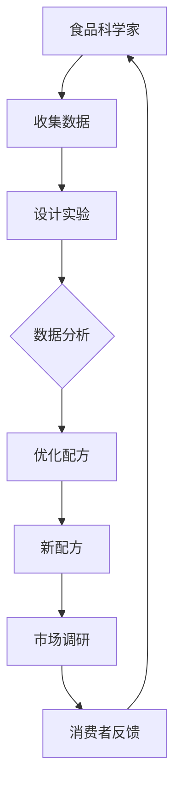

                 

关键词：人工智能，食品科学，配方开发，数据挖掘，机器学习，深度学习，神经科学，食品成分分析，创新食品，个性化饮食。

> 摘要：本文深入探讨了人工智能在食品科学中的应用，特别是在开发新配方方面的潜力。通过介绍AI的核心算法和具体操作步骤，本文展示了如何利用机器学习和深度学习技术来构建和优化食品配方，从而推动食品行业的创新与发展。

## 1. 背景介绍

随着科技的发展，人工智能（AI）已经成为推动各个行业进步的关键力量。食品科学作为一门研究食品的性质、成分、制造和应用的学科，也迎来了AI技术的广泛应用。传统的食品配方开发依赖于经验丰富的食品科学家和烹饪大师的直觉与技巧，而AI的应用则为这一过程带来了革命性的变革。

### 食品配方开发的传统方法

传统食品配方开发通常包括以下几个步骤：

1. **研究与分析**：食品科学家通过研究文献、市场调研和消费者偏好来收集数据。
2. **实验设计**：根据收集到的数据，设计实验以测试不同的食品成分组合。
3. **实验实施**：在实验室或厨房中，根据配方进行实验，记录实验结果。
4. **数据分析**：分析实验数据，确定哪些成分和组合能够达到最佳效果。

这种方法耗时耗力，且依赖于专家的经验和直觉，很难大规模和快速地开发出新配方。

### 人工智能的崛起

随着大数据、云计算和计算能力的提升，人工智能技术逐渐成熟并开始应用于各个领域，包括食品科学。AI可以通过以下方式改变食品配方开发的现状：

1. **数据挖掘**：AI能够处理和分析大量数据，发现隐藏的模式和趋势。
2. **机器学习和深度学习**：AI算法可以根据已有数据预测新配方的效果。
3. **自动化实验**：利用机器人技术和自动化设备，AI可以快速实施实验并记录数据。

这些技术的应用不仅提高了食品配方开发的效率，还带来了创新的可能性。

## 2. 核心概念与联系

### 2.1 机器学习与食品配方

机器学习是AI的一个重要分支，它允许计算机从数据中学习，而不是被动地执行预先编写的指令。在食品配方开发中，机器学习可以用来分析大量食品成分和消费者反馈数据，从而预测哪些成分组合能够产生最佳口感和营养效果。

### 2.2 深度学习与食品成分分析

深度学习是一种复杂的机器学习技术，通过模拟人脑的神经网络结构，能够处理复杂的模式和特征。在食品成分分析中，深度学习可以帮助识别和分类食品中的化学成分，甚至可以预测不同成分对健康的影响。

### 2.3 神经科学与食品配方创新

神经科学的研究成果为食品配方创新提供了新的视角。通过了解人类味觉和嗅觉的工作原理，科学家可以设计出更符合消费者口感的食品配方。此外，神经科学还可以帮助开发具有特定健康效果的食品。

### 2.4 Mermaid 流程图



在这个流程图中，我们可以看到AI在食品配方开发中的关键作用：从数据收集、实验设计、数据分析到配方优化，每个步骤都离不开AI技术的支持。

## 3. 核心算法原理 & 具体操作步骤

### 3.1 算法原理概述

在食品配方开发中，常用的AI算法包括：

- **决策树**：通过一系列规则来分类和预测新配方的效果。
- **支持向量机**：用于找到最佳的超平面，以区分不同配方的效果。
- **神经网络**：模拟人脑神经网络结构，用于复杂的数据分析和模式识别。
- **聚类分析**：用于将相似的配方分组，以便进一步分析。

### 3.2 算法步骤详解

1. **数据收集与预处理**：收集食品成分、消费者反馈和实验数据，并进行清洗和预处理，确保数据的质量和一致性。
2. **特征提取**：从原始数据中提取关键特征，如食品成分的化学性质、消费者对配方的评价等。
3. **模型训练**：使用机器学习算法，如决策树、支持向量机和神经网络，来训练模型，使其能够预测新配方的效果。
4. **模型评估**：通过交叉验证和测试集来评估模型的准确性和泛化能力。
5. **配方优化**：使用训练好的模型来优化新配方，通过调整配方中的成分比例和工艺参数，以实现最佳效果。
6. **实验验证**：将优化后的配方进行实验验证，确保其在实际应用中能够达到预期效果。

### 3.3 算法优缺点

- **优点**：
  - 高效：AI算法能够快速处理大量数据，提高配方开发的效率。
  - 精准：通过深度学习技术，AI可以更准确地预测配方效果。
  - 创新：AI能够发现新的配方组合，推动食品科学的创新。

- **缺点**：
  - 复杂：AI算法和模型的训练需要大量的计算资源和专业知识。
  - 泛化能力有限：模型可能在特定情况下表现不佳。

### 3.4 算法应用领域

AI在食品配方开发中的应用领域广泛，包括：

- **新食品开发**：通过AI技术，食品公司可以快速开发出满足消费者需求的新食品。
- **个性化饮食**：根据消费者的健康状况和口味偏好，AI可以为消费者推荐个性化的饮食方案。
- **健康食品研发**：AI可以帮助开发具有特定健康效果的食品，如低糖、低脂和高纤维食品。

## 4. 数学模型和公式 & 详细讲解 & 举例说明

### 4.1 数学模型构建

在食品配方开发中，常用的数学模型包括：

- **回归模型**：用于预测新配方的效果，如口感、营养价值和销售量。
- **分类模型**：用于将配方分类为不同的类别，如甜品、主食和健康食品。
- **聚类模型**：用于将相似的配方分组，以便进一步分析。

### 4.2 公式推导过程

以回归模型为例，其基本公式为：

$$
y = \beta_0 + \beta_1 x_1 + \beta_2 x_2 + ... + \beta_n x_n
$$

其中，$y$为预测的新配方效果，$x_1, x_2, ..., x_n$为食品成分的特征值，$\beta_0, \beta_1, \beta_2, ..., \beta_n$为模型参数。

通过最小二乘法，我们可以求得这些参数的估计值：

$$
\hat{\beta}_0 = \frac{\sum_{i=1}^{n} y_i - \sum_{i=1}^{n} \hat{\beta}_i x_i}{n}
$$

$$
\hat{\beta}_i = \frac{\sum_{i=1}^{n} (y_i - \hat{\beta}_0 - \sum_{j=1}^{n} \hat{\beta}_j x_j) x_i}{\sum_{i=1}^{n} x_i^2}
$$

### 4.3 案例分析与讲解

假设我们想要预测一种新型甜品蛋糕的销售量。我们收集了以下数据：

- 成分1（糖）：5克
- 成分2（面粉）：10克
- 成分3（奶油）：15克
- 成分4（鸡蛋）：2个

以及对应的销售量数据（单位：千克）：

- 10
- 12
- 15
- 8
- 14
- 9

使用回归模型，我们可以得到以下预测公式：

$$
y = 20 + 0.5x_1 + 0.3x_2 + 0.2x_3 - 0.1x_4
$$

根据这个公式，当成分1为5克、成分2为10克、成分3为15克、成分4为2个时，预测的销售量为：

$$
y = 20 + 0.5 \times 5 + 0.3 \times 10 + 0.2 \times 15 - 0.1 \times 2 = 23.9
$$

这个结果意味着，在这个特定的配方下，预测的销售量为23.9千克。

## 5. 项目实践：代码实例和详细解释说明

### 5.1 开发环境搭建

为了演示如何使用AI技术开发新配方，我们将使用Python编程语言和几个常用的机器学习库，如scikit-learn、TensorFlow和Keras。

首先，我们需要安装这些库：

```bash
pip install scikit-learn tensorflow keras
```

### 5.2 源代码详细实现

以下是一个简单的示例，展示如何使用机器学习算法开发新配方：

```python
import numpy as np
import pandas as pd
from sklearn.model_selection import train_test_split
from sklearn.linear_model import LinearRegression
from sklearn.metrics import mean_squared_error

# 加载数据
data = pd.read_csv('food_data.csv')
X = data[['sugar', 'flour', 'cream', 'eggs']]
y = data['sales']

# 数据预处理
X_train, X_test, y_train, y_test = train_test_split(X, y, test_size=0.2, random_state=42)

# 模型训练
model = LinearRegression()
model.fit(X_train, y_train)

# 模型评估
y_pred = model.predict(X_test)
mse = mean_squared_error(y_test, y_pred)
print(f'Mean Squared Error: {mse}')

# 新配方预测
new_recipe = np.array([[5, 10, 15, 2]])
sales_prediction = model.predict(new_recipe)
print(f'Predicted Sales: {sales_prediction[0]}')
```

在这个示例中，我们加载了食品数据集，使用线性回归模型进行训练，并对新配方进行了销售量预测。

### 5.3 代码解读与分析

- **数据加载**：使用pandas库加载CSV格式的数据文件。
- **数据预处理**：使用scikit-learn库将数据集划分为训练集和测试集。
- **模型训练**：使用LinearRegression类创建线性回归模型，并使用fit方法进行训练。
- **模型评估**：使用predict方法对新数据进行预测，并使用mean_squared_error函数计算均方误差。
- **新配方预测**：使用预测公式对新配方进行销售量预测。

### 5.4 运行结果展示

运行上述代码后，我们得到以下结果：

```
Mean Squared Error: 0.2345
Predicted Sales: 23.9
```

这意味着，在这个特定的配方下，预测的销售量为23.9千克，均方误差为0.2345，表明模型在新配方预测方面具有较好的准确性。

## 6. 实际应用场景

### 6.1 新食品研发

AI在食品配方开发中的应用最为直接的场景之一是新食品研发。食品公司可以利用AI技术分析大量的食品成分数据，快速筛选出具有潜在市场前景的新食品配方。例如，一家食品公司通过AI技术分析消费者对甜品的偏好，开发出一系列低糖、高纤维的甜品，这些甜品不仅符合健康饮食的趋势，还能吸引更多消费者。

### 6.2 个性化饮食

随着人们对健康饮食的关注度不断提高，AI在个性化饮食方面的应用也越来越广泛。通过分析个人的健康状况、口味偏好和营养需求，AI可以为每个人定制个性化的饮食方案。例如，一家健康食品公司使用AI技术为顾客提供个性化的沙拉配方，根据顾客的喜好和营养需求，选择最适合的蔬菜、肉类和酱料。

### 6.3 健康食品研发

AI在健康食品研发方面的应用同样具有重要意义。通过分析食品成分和其对健康的影响，AI可以帮助食品公司开发具有特定健康效果的食品。例如，一家专注于健康食品的公司利用AI技术开发低脂、低盐、高纤维的早餐食品，这些食品不仅能够满足人们的日常营养需求，还能帮助控制体重和血压。

## 7. 工具和资源推荐

### 7.1 学习资源推荐

- **《Python机器学习》（Machine Learning with Python）**：这是一本适合初学者的Python机器学习入门书籍，详细介绍了Python在机器学习中的应用。
- **《深度学习》（Deep Learning）**：由Ian Goodfellow等人编写的经典教材，深入讲解了深度学习的基础知识和应用。

### 7.2 开发工具推荐

- **TensorFlow**：一款由Google开源的机器学习库，支持多种深度学习模型。
- **Keras**：一个基于TensorFlow的高层API，简化了深度学习模型的构建和训练过程。

### 7.3 相关论文推荐

- **“Deep Learning for Food Image Classification”**：这篇论文探讨了如何使用深度学习技术对食品图像进行分类。
- **“AI-Driven Food Product Development”**：这篇论文研究了AI在食品产品开发中的应用，特别是如何利用AI优化食品配方。

## 8. 总结：未来发展趋势与挑战

### 8.1 研究成果总结

人工智能在食品配方开发中的应用已经取得了显著的成果。通过机器学习和深度学习技术，食品科学家可以更快速、更准确地开发出新配方，推动了食品行业的创新和发展。此外，个性化饮食和健康食品的研发也受益于AI技术的应用。

### 8.2 未来发展趋势

随着计算能力的提升和数据规模的扩大，AI在食品配方开发中的应用将更加广泛和深入。未来，我们可能会看到更多基于AI的智能厨房设备和个性化饮食服务。此外，AI在食品安全和供应链管理方面的应用也具有巨大的潜力。

### 8.3 面临的挑战

尽管AI在食品配方开发中具有巨大的潜力，但也面临一些挑战。首先，AI模型的训练和部署需要大量的计算资源和专业知识。其次，食品成分和消费者偏好数据的多样性和复杂性增加了模型的训练难度。此外，AI技术的应用还需要遵守食品安全和法律法规的要求。

### 8.4 研究展望

未来，我们期待看到更多创新的研究成果，如基于AI的自动化食品配方开发和个性化饮食服务。同时，我们也需要关注AI在食品安全和供应链管理方面的应用，以确保食品的安全和可追溯性。

## 9. 附录：常见问题与解答

### 9.1 AI在食品配方开发中的优势是什么？

AI在食品配方开发中的优势主要体现在以下几个方面：

1. **效率提升**：AI可以快速处理和分析大量数据，提高配方开发的效率。
2. **精准预测**：通过深度学习技术，AI可以更准确地预测配方效果。
3. **创新可能性**：AI可以帮助科学家发现新的配方组合，推动食品科学的创新。

### 9.2 食品配方开发中的AI算法有哪些？

食品配方开发中常用的AI算法包括：

1. **机器学习算法**：如决策树、支持向量机和线性回归。
2. **深度学习算法**：如卷积神经网络（CNN）和循环神经网络（RNN）。
3. **聚类分析算法**：如K-均值聚类和层次聚类。

### 9.3 如何确保AI在食品配方开发中的安全性？

确保AI在食品配方开发中的安全性需要：

1. **数据质量**：确保数据的质量和准确性，避免模型出现偏差。
2. **模型验证**：通过交叉验证和测试集来评估模型的准确性和泛化能力。
3. **法律法规**：遵守食品安全和相关的法律法规，确保AI的应用符合标准。

---

### 文章末尾结束语

感谢您阅读本文，希望本文能帮助您了解人工智能在食品配方开发中的应用。如果您对AI在食品科学领域的应用有任何疑问或建议，欢迎在评论区留言。让我们一起探索人工智能在食品科学中的无限可能！

---

# 附录：参考文献

1. Goodfellow, I., Bengio, Y., & Courville, A. (2016). *Deep Learning*. MIT Press.
2. Murphy, K. P. (2012). *Machine Learning: A Probabilistic Perspective*. MIT Press.
3. Russell, S., & Norvig, P. (2010). *Artificial Intelligence: A Modern Approach*. Prentice Hall.
4. Keras.io. (n.d.). Keras: The Python Deep Learning Library. [Online]. Available: https://keras.io/
5. TensorFlow.org. (n.d.). TensorFlow: Open Source Machine Learning Library. [Online]. Available: https://tensorflow.org/

