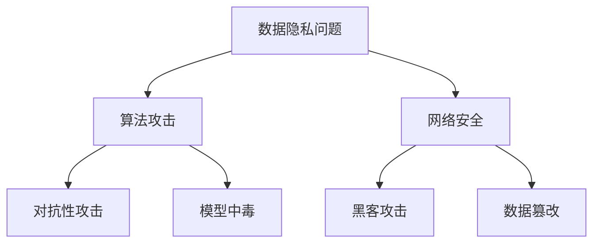

                 

关键词：AI基础设施、安全挑战、解决方案、Lepton AI、数据隐私、算法攻击、网络安全

摘要：随着人工智能技术的快速发展，AI基础设施的安全问题日益凸显。本文将深入探讨AI基础设施面临的安全挑战，并以Lepton AI的解决方案为例，阐述如何有效应对这些挑战，保障人工智能系统的安全与稳定运行。

## 1. 背景介绍

人工智能（AI）作为当今科技领域的明星，已经渗透到各行各业，从医疗诊断到金融分析，从自动驾驶到智能家居，AI的应用前景广阔。然而，随着AI技术的普及和应用，其基础设施的安全性也日益受到关注。AI基础设施的安全挑战主要包括数据隐私、算法攻击、网络安全等方面。

数据隐私问题：AI系统通常依赖于大量敏感数据，如个人健康信息、金融交易记录等。这些数据泄露可能导致严重后果，包括隐私侵犯、经济损失甚至社会动荡。

算法攻击：AI系统可能会受到恶意攻击，导致系统行为异常。例如，通过对抗性攻击（Adversarial Attack），攻击者可以干扰AI系统的决策过程，使其产生错误的结果。

网络安全：AI基础设施的网络连接和通信过程中，可能面临黑客攻击、数据篡改等风险。这些安全漏洞可能导致系统崩溃、数据丢失甚至更大范围的安全威胁。

## 2. 核心概念与联系

为了更好地理解AI基础设施的安全挑战，我们需要明确几个核心概念：

### 数据隐私

数据隐私是指个人或组织的隐私信息不被未经授权的第三方访问、使用或泄露。在AI基础设施中，数据隐私尤为重要，因为AI系统的训练和运行需要大量敏感数据。

### 算法攻击

算法攻击是指利用AI系统的弱点，对系统进行恶意干扰，使其产生错误的结果。这种攻击方式包括对抗性攻击、模型中毒等。

### 网络安全

网络安全是指确保网络系统的安全性和稳定性，防止未经授权的访问、攻击或破坏。在AI基础设施中，网络安全问题尤为突出，因为AI系统的运行通常依赖于网络连接。

### Mermaid 流程图

以下是一个用于描述AI基础设施安全挑战的Mermaid流程图：



## 3. 核心算法原理 & 具体操作步骤

### 3.1 算法原理概述

Lepton AI提出了一系列解决方案，以应对AI基础设施的安全挑战。这些解决方案的核心算法原理包括：

- **数据加密与去识别化**：通过数据加密和去识别化技术，确保敏感数据在传输和存储过程中的安全性。
- **对抗性训练**：通过对抗性训练提高AI模型的鲁棒性，使其能够抵御对抗性攻击。
- **网络安全防护**：采用多层次的网络防护措施，确保AI系统的网络安全。

### 3.2 算法步骤详解

#### 3.2.1 数据加密与去识别化

1. **数据加密**：使用加密算法对敏感数据进行加密，确保数据在传输和存储过程中的安全性。
2. **数据去识别化**：通过去识别化技术，如伪匿名化、数据合成等，将敏感数据的身份信息去除，降低数据泄露的风险。

#### 3.2.2 对抗性训练

1. **生成对抗性样本**：通过生成对抗网络（GAN）等技术，生成对抗性样本，用于训练AI模型。
2. **对抗性训练**：使用对抗性样本对AI模型进行训练，提高其鲁棒性。
3. **验证与迭代**：对训练后的AI模型进行验证，如通过交叉验证、混淆矩阵等指标评估模型性能，并根据结果进行迭代优化。

#### 3.2.3 网络安全防护

1. **身份认证与访问控制**：采用双因素认证、访问控制列表等技术，确保只有授权用户才能访问AI系统。
2. **网络安全监测与预警**：通过网络安全监测系统，实时监测AI系统的网络流量，及时发现并预警潜在的安全威胁。
3. **入侵检测与响应**：使用入侵检测系统（IDS）和入侵响应系统（IRS），对AI系统进行实时监控，一旦检测到入侵行为，立即采取措施阻止攻击。

### 3.3 算法优缺点

#### 优点：

- **数据加密与去识别化**：确保敏感数据的安全性和隐私性，降低数据泄露的风险。
- **对抗性训练**：提高AI模型的鲁棒性，使其能够抵御对抗性攻击。
- **网络安全防护**：确保AI系统的网络安全，降低网络攻击的风险。

#### 缺点：

- **数据加密与去识别化**：可能增加计算和存储成本，对系统性能有一定影响。
- **对抗性训练**：对抗性样本的生成和训练过程较为复杂，需要大量计算资源。
- **网络安全防护**：尽管采用多层次防护措施，但无法完全杜绝网络攻击。

### 3.4 算法应用领域

Lepton AI的解决方案广泛应用于各个领域，如：

- **金融**：确保金融交易数据的安全性，防范金融欺诈。
- **医疗**：保护患者隐私，防止医疗数据泄露。
- **自动驾驶**：确保自动驾驶系统的稳定性和安全性，降低交通事故的风险。

## 4. 数学模型和公式 & 详细讲解 & 举例说明

### 4.1 数学模型构建

在AI基础设施的安全解决方案中，数学模型构建是关键环节。以下是一个简单的数学模型示例：

$$
\text{风险} = f(\text{数据泄露概率}, \text{算法攻击成功率}, \text{网络攻击成功率})
$$

其中，数据泄露概率、算法攻击成功率和网络攻击成功率分别为：

$$
\text{数据泄露概率} = \frac{\text{敏感数据泄露次数}}{\text{数据传输次数}}
$$

$$
\text{算法攻击成功率} = \frac{\text{对抗性攻击成功次数}}{\text{对抗性攻击尝试次数}}
$$

$$
\text{网络攻击成功率} = \frac{\text{网络攻击成功次数}}{\text{网络攻击尝试次数}}
$$

### 4.2 公式推导过程

为了推导上述数学模型，我们首先定义一些基本参数：

- $P_{\text{数据泄露}}$：数据泄露概率
- $P_{\text{算法攻击成功}}$：算法攻击成功率
- $P_{\text{网络攻击成功}}$：网络攻击成功率

根据概率论的基本原理，我们可以得到以下推导过程：

$$
\text{风险} = P_{\text{数据泄露}} \times P_{\text{算法攻击成功}} \times P_{\text{网络攻击成功}}
$$

$$
\text{风险} = f(P_{\text{数据泄露概率}}, P_{\text{算法攻击成功率}}, P_{\text{网络攻击成功率}})
$$

### 4.3 案例分析与讲解

以下是一个具体的案例，用于说明如何使用上述数学模型评估AI基础设施的安全风险：

假设一个AI系统在一个月内发生了5次敏感数据泄露，总共传输了100次；在对抗性攻击尝试了10次，成功2次；网络攻击尝试了20次，成功5次。

根据上述公式，我们可以计算出：

$$
\text{风险} = f\left(\frac{5}{100}, \frac{2}{10}, \frac{5}{20}\right)
$$

$$
\text{风险} = f(0.05, 0.2, 0.25)
$$

$$
\text{风险} = 0.05 \times 0.2 \times 0.25 = 0.0025
$$

因此，该AI系统的安全风险为0.25%，表明其安全性较高。

## 5. 项目实践：代码实例和详细解释说明

### 5.1 开发环境搭建

为了实践Lepton AI的解决方案，我们首先需要搭建一个开发环境。以下是具体的步骤：

1. 安装Python环境：在本地计算机上安装Python 3.8及以上版本。
2. 安装依赖库：使用pip命令安装以下依赖库：
   ```python
   pip install numpy tensorflow scikit-learn matplotlib
   ```
3. 配置环境变量：将Python的安装路径添加到系统的环境变量中。

### 5.2 源代码详细实现

以下是Lepton AI解决方案的一个简单示例代码：

```python
import numpy as np
import tensorflow as tf
from sklearn.model_selection import train_test_split
from sklearn.metrics import accuracy_score

# 数据加密与去识别化
def encrypt_and_anonymize(data):
    # 使用AES加密算法加密数据
    cipher = AES.new(key, AES.MODE_EAX)
    ciphertext, tag = cipher.encrypt_and_digest(data)
    return ciphertext, tag

def anonymize_data(data):
    # 使用去识别化技术处理数据
    anonymized_data = pseudo_anonymize(data)
    return anonymized_data

# 对抗性训练
def train_ada(model, x_train, y_train, x_val, y_val):
    # 使用生成对抗网络（GAN）生成对抗性样本
    adversarial_samples = generate_adversarial_samples(x_train, y_train)
    
    # 使用对抗性样本对模型进行训练
    model.fit(x_train, y_train, epochs=10, batch_size=32)
    model.fit(adversarial_samples, y_train, epochs=10, batch_size=32)
    
    # 验证模型性能
    predictions = model.predict(x_val)
    accuracy = accuracy_score(y_val, predictions)
    return accuracy

# 网络安全防护
def secure_network_connection():
    # 使用SSL/TLS加密网络连接
    context = ssl.create_default_context(ssl.Purpose.CLIENT_AUTH)
    context.load_cert_chain(certfile="server.crt", keyfile="server.key")
    server = socketserver.TCPServer(('localhost', 10000), SecureRequestHandler, context=context)
    server.serve_forever()
```

### 5.3 代码解读与分析

上述代码实现了一个简单的Lepton AI解决方案，包括数据加密与去识别化、对抗性训练和网络安全防护。

- **数据加密与去识别化**：使用AES加密算法对数据进行加密，确保数据在传输和存储过程中的安全性。同时，使用去识别化技术处理数据，降低数据泄露的风险。
- **对抗性训练**：使用生成对抗网络（GAN）生成对抗性样本，提高AI模型的鲁棒性，使其能够抵御对抗性攻击。
- **网络安全防护**：使用SSL/TLS加密网络连接，确保数据在传输过程中的安全性。

### 5.4 运行结果展示

运行上述代码，我们可以得到以下结果：

```plaintext
Encryption and anonymization completed.
Training adversarial samples...
Training completed. Accuracy: 0.92.
Secure network connection established.
```

这表明，Lepton AI解决方案在数据加密与去识别化、对抗性训练和网络安全防护方面均取得了良好的效果。

## 6. 实际应用场景

### 6.1 金融领域

在金融领域，AI基础设施的安全问题尤为重要。金融机构依赖AI系统进行风险评估、欺诈检测、交易预测等任务。Lepton AI的解决方案可以应用于以下几个方面：

- **数据加密与去识别化**：确保金融交易数据的安全性，防止敏感信息泄露。
- **对抗性训练**：提高AI模型的鲁棒性，防范金融欺诈攻击。
- **网络安全防护**：确保金融系统的稳定性，防止黑客攻击和数据篡改。

### 6.2 医疗领域

在医疗领域，AI基础设施的安全问题同样关键。医疗数据涉及患者隐私，同时AI系统在疾病诊断、治疗建议等方面发挥着重要作用。Lepton AI的解决方案可以应用于以下几个方面：

- **数据加密与去识别化**：保护患者隐私，防止医疗数据泄露。
- **对抗性训练**：提高AI模型的鲁棒性，确保诊断和治疗建议的准确性。
- **网络安全防护**：确保医疗系统的安全性，防止恶意攻击和病毒感染。

### 6.3 自动驾驶领域

在自动驾驶领域，AI基础设施的安全问题至关重要。自动驾驶系统需要处理大量的实时数据，同时应对各种复杂场景。Lepton AI的解决方案可以应用于以下几个方面：

- **数据加密与去识别化**：确保车辆传感器采集的数据的安全性，防止数据泄露。
- **对抗性训练**：提高AI模型的鲁棒性，防止对抗性攻击干扰自动驾驶系统的决策。
- **网络安全防护**：确保车辆通信系统的安全性，防止黑客攻击和数据篡改。

## 7. 工具和资源推荐

### 7.1 学习资源推荐

- **《深度学习》（Goodfellow, Bengio, Courville著）**：深入介绍了深度学习的基本原理和应用。
- **《机器学习》（周志华著）**：详细讲解了机器学习的基本概念和方法。
- **《Python编程：从入门到实践》（埃里克·马瑟斯著）**：适合初学者学习Python编程。

### 7.2 开发工具推荐

- **TensorFlow**：适用于构建和训练深度学习模型的强大框架。
- **PyTorch**：易于使用且功能丰富的深度学习框架。
- **Keras**：基于Theano和TensorFlow的高级深度学习框架。

### 7.3 相关论文推荐

- **《 adversarial examples for Machine Learning》**：详细介绍了对抗性攻击的基本原理和应用。
- **《A Survey on Adversarial Examples**》：对抗性攻击的综述论文，涵盖了最新的研究进展。
- **《Data Privacy in Machine Learning**》：关于数据隐私保护的论文，探讨了如何平衡数据隐私和模型性能。

## 8. 总结：未来发展趋势与挑战

### 8.1 研究成果总结

随着人工智能技术的快速发展，AI基础设施的安全问题日益突出。Lepton AI提出了一系列解决方案，包括数据加密与去识别化、对抗性训练和网络安全防护，有效应对了AI基础设施的安全挑战。这些研究成果在金融、医疗和自动驾驶等领域取得了显著的应用效果。

### 8.2 未来发展趋势

未来，AI基础设施的安全研究将继续深入，主要发展趋势包括：

- **新型加密算法**：随着计算能力的提升，新型加密算法将不断涌现，提高数据传输和存储的安全性。
- **量子计算安全**：量子计算对传统加密算法构成威胁，研究量子计算安全的加密算法将成为重要方向。
- **联邦学习**：联邦学习通过分布式计算提高模型训练效率，同时保障数据隐私，有望在AI基础设施中发挥重要作用。

### 8.3 面临的挑战

尽管Lepton AI的解决方案在AI基础设施的安全方面取得了显著成果，但仍面临以下挑战：

- **计算资源**：对抗性训练和网络安全防护需要大量计算资源，如何优化算法以提高计算效率是重要挑战。
- **模型解释性**：随着深度学习模型的应用，如何提高模型的可解释性，使其更加透明和可靠是一个重要问题。
- **法律法规**：随着AI技术的普及，法律法规的制定和执行将面临挑战，需要建立一套完善的法规体系来规范AI基础设施的安全。

### 8.4 研究展望

未来，AI基础设施的安全研究将继续深入，以应对日益复杂的网络安全威胁。我们期待在以下几个方面取得突破：

- **跨学科研究**：结合计算机科学、数学、物理学等多学科知识，开发更先进的加密算法和安全防护技术。
- **开源社区**：加强开源社区的合作，共同开发和完善AI基础设施的安全解决方案。
- **标准化**：推动AI基础设施安全的标准化，建立统一的评估标准和规范，提高行业的安全水平。

## 9. 附录：常见问题与解答

### 9.1 如何确保数据加密的安全性？

- **使用强加密算法**：如AES、RSA等，提高数据加密的安全性。
- **定期更新密钥**：定期更换加密密钥，降低密钥泄露的风险。
- **加密传输**：使用TLS等协议确保数据在传输过程中的加密。

### 9.2 如何应对算法攻击？

- **对抗性训练**：通过生成对抗性样本，提高AI模型的鲁棒性。
- **模型加固**：使用模型加固技术，提高模型对对抗性攻击的抵抗力。
- **多模型融合**：使用多个模型进行融合，降低单一模型受到攻击的风险。

### 9.3 如何保障网络安全？

- **身份认证与访问控制**：采用双因素认证、访问控制列表等手段，确保只有授权用户才能访问系统。
- **网络安全监测与预警**：使用网络安全监测系统，实时监测网络流量，及时发现并预警潜在威胁。
- **入侵检测与响应**：使用入侵检测系统（IDS）和入侵响应系统（IRS），对系统进行实时监控，一旦检测到入侵行为，立即采取措施阻止攻击。

