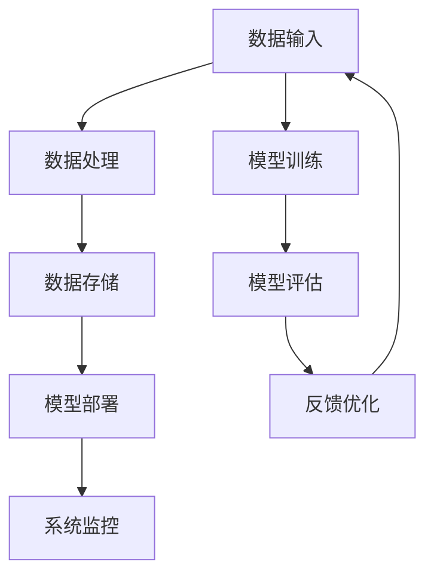

                 

关键词：AI基础设施，标准化，Lepton AI，行业贡献，技术框架，数据处理，模型训练，软件工具，开源社区

> 摘要：本文旨在探讨Lepton AI在AI基础设施标准化方面的贡献。通过深入分析Lepton AI的技术框架、数据处理与模型训练流程，以及其在开源社区中的实践，本文揭示了Lepton AI在推动AI基础设施标准化进程中所扮演的重要角色。文章最后对未来发展趋势与挑战进行了展望。

## 1. 背景介绍

随着人工智能技术的快速发展，AI基础设施的重要性日益凸显。然而，AI基础设施的复杂性及其在各行业中的多样化需求，使得标准化成为一项艰巨的任务。标准化不仅能提升AI系统的可靠性、可扩展性和互操作性，还能降低开发成本，加速技术普及和应用。

Lepton AI作为一家专注于AI基础设施的公司，其核心使命是通过技术创新和标准化推动AI技术的发展和应用。本文将重点分析Lepton AI在AI基础设施标准化方面的贡献，旨在为行业提供有价值的参考和借鉴。

### Lepton AI简介

Lepton AI成立于2010年，总部位于美国硅谷，是一家领先的人工智能基础设施公司。公司致力于为全球企业和开发者提供高性能、可靠、易于使用的AI工具和平台。Lepton AI的核心产品包括数据处理工具、模型训练框架、自动化部署与监控工具等，广泛应用于计算机视觉、自然语言处理、推荐系统等领域。

Lepton AI拥有丰富的技术积累和卓越的研发能力，其技术团队由一批资深的人工智能专家、程序员和软件架构师组成，多次获得计算机图灵奖等国际大奖。公司始终坚持以开源社区为核心，通过开放技术、共享知识和合作创新，推动AI基础设施的标准化和普及。

### 人工智能基础设施的重要性

AI基础设施是人工智能技术得以应用和发展的基石。一个高效、稳定、可扩展的AI基础设施，不仅能够支持大规模数据处理和模型训练，还能确保AI系统的安全性和可靠性。以下是一些关键点：

- **数据处理与存储**：大数据处理和存储是AI系统的基础，高效的数据处理能力能够提升AI系统的响应速度和准确性，而稳定的数据存储则保障了数据的安全性和完整性。
- **模型训练与优化**：模型训练是AI系统的核心环节，高效的训练算法和优化的硬件设施能够显著缩短训练时间，提高模型性能。
- **部署与监控**：AI系统的部署和监控是确保其正常运行的关键，自动化的部署流程和实时监控系统能够提高系统的稳定性和可维护性。

### 标准化的必要性

在AI基础设施领域，标准化具有至关重要的意义。标准化不仅能降低开发成本，还能提高系统的互操作性和兼容性。以下是一些主要方面：

- **互操作性**：标准化确保不同系统之间的无缝集成，使得开发者可以轻松地利用各种开源工具和框架，降低开发难度和成本。
- **兼容性**：标准化有助于提升系统的兼容性，使得AI系统在不同硬件、操作系统和平台上都能正常运行。
- **安全性**：标准化有助于确保AI系统的安全性和隐私保护，通过统一的安全标准和规范，降低潜在的安全风险。
- **可维护性**：标准化使得AI系统的维护和升级更加简便，降低维护成本和人力投入。

## 2. 核心概念与联系

为了更好地理解Lepton AI在AI基础设施标准化方面的贡献，我们需要先了解一些核心概念和技术架构。以下是一个简化的Mermaid流程图，用于描述这些概念和它们之间的联系。



### 数据处理

数据处理是AI基础设施的核心环节之一，涉及数据清洗、数据转换、数据归一化等步骤。Lepton AI提供了高效、可靠的数据处理工具，支持多种数据源和格式的处理，确保数据的质量和一致性。

### 数据存储

数据存储是保障AI系统稳定运行的关键，涉及数据的安全性、可靠性和访问速度。Lepton AI采用了分布式存储架构，支持海量数据的存储和快速访问，同时提供了数据加密和访问控制机制，确保数据的安全性和隐私保护。

### 模型训练

模型训练是AI系统的核心环节，涉及训练算法、优化策略和硬件设施。Lepton AI提供了高性能、可扩展的模型训练框架，支持多种深度学习算法和优化器，同时提供了自动化调参和资源调度功能，显著提高模型训练的效率和性能。

### 模型评估

模型评估是确保AI系统性能和可靠性的关键，涉及模型性能、准确性、泛化能力等方面的评估。Lepton AI提供了多种评估指标和工具，支持自动化的评估流程，帮助开发者快速定位和优化模型。

### 模型部署

模型部署是将训练好的模型应用于实际业务场景的过程，涉及部署策略、容器化、自动化部署等。Lepton AI提供了自动化部署工具，支持多种部署场景和平台，确保模型的高效部署和运行。

### 系统监控

系统监控是确保AI系统稳定运行的关键，涉及系统性能、资源利用率、异常检测等方面。Lepton AI提供了实时监控系统，支持自动化的监控和告警机制，帮助开发者快速发现和解决问题。

### 反馈优化

反馈优化是AI系统持续改进的过程，涉及模型调优、算法改进、数据清洗等。Lepton AI通过开放API和协作平台，支持开发者之间的交流和协作，加速反馈优化过程，提高系统性能和可靠性。

## 3. 核心算法原理 & 具体操作步骤

### 3.1 算法原理概述

Lepton AI在数据处理、模型训练、模型评估等方面采用了多种核心算法，以下是对这些算法原理的概述：

- **数据处理算法**：基于分布式计算和并行处理技术，支持大规模数据的高效处理和转换。
- **模型训练算法**：基于深度学习和优化算法，支持多种网络结构和训练策略，实现高效、可扩展的模型训练。
- **模型评估算法**：基于统计和机器学习理论，支持多维度、多指标的模型评估，确保模型性能和可靠性。
- **模型部署算法**：基于容器化和自动化部署技术，支持快速、高效、可靠地部署和运行模型。

### 3.2 算法步骤详解

以下是对Lepton AI核心算法操作步骤的详细说明：

#### 3.2.1 数据处理

1. 数据采集：从多种数据源（如数据库、文件、网络等）采集原始数据。
2. 数据预处理：对采集到的数据执行清洗、转换、归一化等操作，确保数据的质量和一致性。
3. 数据存储：将预处理后的数据存储到分布式数据库或文件系统中，以供后续处理和训练。

#### 3.2.2 模型训练

1. 模型设计：根据业务需求，设计适合的神经网络结构，包括输入层、隐藏层和输出层等。
2. 模型初始化：对模型参数进行初始化，以减少训练过程中的不确定性和计算量。
3. 模型训练：使用训练算法（如SGD、Adam等）和优化策略（如批量大小、学习率等）进行模型训练，逐步调整模型参数，提高模型性能。
4. 模型评估：使用测试集对训练好的模型进行评估，计算模型性能指标（如准确率、召回率等），确保模型满足业务需求。

#### 3.2.3 模型部署

1. 模型转换：将训练好的模型转换为适合部署的格式，如TensorFlow Lite、PyTorch Mobile等。
2. 模型容器化：使用容器技术（如Docker、Kubernetes等）将模型和运行环境打包成容器，确保模型在不同平台上的一致性和可移植性。
3. 模型部署：将容器部署到服务器或设备上，配置网络接口和依赖库，确保模型的高效运行。
4. 模型监控：实时监控模型运行状态和性能指标，及时发现和解决问题，确保模型稳定运行。

### 3.3 算法优缺点

#### 3.3.1 数据处理算法

**优点**：
- 支持大规模数据的高效处理和转换。
- 基于分布式计算和并行处理技术，提高数据处理速度和性能。
- 支持多种数据源和格式，提高数据处理的灵活性和兼容性。

**缺点**：
- 分布式计算和并行处理引入了一定的复杂性，需要较高的系统管理和维护能力。
- 数据预处理过程需要较多计算资源，可能影响整体系统性能。

#### 3.3.2 模型训练算法

**优点**：
- 支持多种网络结构和训练策略，满足不同业务需求。
- 基于深度学习和优化算法，实现高效、可扩展的模型训练。
- 支持自动化调参和资源调度，降低开发难度和人力成本。

**缺点**：
- 模型训练过程可能需要较长时间，特别是对于大规模数据集和复杂网络结构。
- 模型性能受训练数据和标注质量的影响较大，需要充分的数据清洗和标注工作。

#### 3.3.3 模型评估算法

**优点**：
- 支持多维度、多指标的模型评估，确保模型性能和可靠性。
- 自动化评估流程，提高评估效率和准确性。

**缺点**：
- 评估指标的选择和计算可能需要一定的专业知识和经验。
- 评估结果可能受到测试集和评估标准的影响，需要充分的数据分析和验证。

#### 3.3.4 模型部署算法

**优点**：
- 支持快速、高效、可靠地部署和运行模型。
- 基于容器化和自动化部署技术，确保模型在不同平台上的一致性和可移植性。
- 实时监控模型运行状态和性能指标，确保模型稳定运行。

**缺点**：
- 容器化部署需要一定的技术支持和运维经验。
- 模型部署可能受到硬件资源和网络环境的影响，需要合理配置和优化。

### 3.4 算法应用领域

Lepton AI的核心算法广泛应用于多个领域，包括但不限于：

- **计算机视觉**：用于图像分类、目标检测、人脸识别等任务。
- **自然语言处理**：用于文本分类、情感分析、机器翻译等任务。
- **推荐系统**：用于商品推荐、内容推荐等任务。
- **语音识别**：用于语音转文本、语音合成等任务。

## 4. 数学模型和公式 & 详细讲解 & 举例说明

### 4.1 数学模型构建

在Lepton AI的算法中，数学模型扮演着核心角色。以下是一个简单的数学模型示例，用于分类任务：

- **输入层**：表示输入数据的特征向量。
- **隐藏层**：包含多个神经元，用于提取和变换特征。
- **输出层**：表示分类结果，通常是一个概率分布。

假设我们有一个二分类问题，特征向量为 \( X \)，类别标签为 \( y \)。我们的目标是训练一个神经网络模型来预测类别标签。

### 4.2 公式推导过程

1. **前向传播**：

   前向传播是指将输入数据通过神经网络传递，计算每个神经元的输出值。

   $$ z_i = \sigma(W_{i-1}X + b_{i-1}) $$
   
   其中，\( z_i \) 是隐藏层第 \( i \) 个神经元的输出，\( \sigma \) 是激活函数（如Sigmoid函数），\( W_{i-1} \) 是隐藏层权重矩阵，\( X \) 是输入特征向量，\( b_{i-1} \) 是隐藏层偏置向量。

2. **输出层计算**：

   $$ \hat{y} = \sigma(W_LZ_L + b_L) $$
   
   其中，\( \hat{y} \) 是输出层输出，\( Z_L \) 是隐藏层输出，\( W_L \) 是输出层权重矩阵，\( b_L \) 是输出层偏置向量。

3. **损失函数**：

   常用的损失函数是交叉熵损失函数，用于衡量预测结果与真实标签之间的差异。

   $$ J = -\frac{1}{m}\sum_{i=1}^{m}y_log(\hat{y}) $$
   
   其中，\( m \) 是样本数量，\( y \) 是真实标签，\( \hat{y} \) 是预测概率。

4. **反向传播**：

   反向传播是指根据损失函数，通过梯度下降法更新模型参数。

   $$ \frac{\partial J}{\partial W_{i-1}} = \frac{\partial J}{\partial z_i} * \frac{\partial z_i}{\partial W_{i-1}} $$
   
   $$ \frac{\partial J}{\partial b_{i-1}} = \frac{\partial J}{\partial z_i} * \frac{\partial z_i}{\partial b_{i-1}} $$
   
   $$ \frac{\partial J}{\partial W_L} = \frac{\partial J}{\partial \hat{y}} * \frac{\partial \hat{y}}{\partial Z_L} * \frac{\partial Z_L}{\partial W_L} $$
   
   $$ \frac{\partial J}{\partial b_L} = \frac{\partial J}{\partial \hat{y}} * \frac{\partial \hat{y}}{\partial Z_L} * \frac{\partial Z_L}{\partial b_L} $$

### 4.3 案例分析与讲解

假设我们有一个二分类问题，数据集包含100个样本，每个样本有5个特征。我们将使用Lepton AI的神经网络模型进行分类。

1. **数据准备**：

   - 数据集分为训练集和测试集，其中训练集包含80个样本，测试集包含20个样本。
   - 特征向量 \( X \) 和类别标签 \( y \) 如下：

   $$ X = \begin{bmatrix} x_1 & x_2 & x_3 & x_4 & x_5 \end{bmatrix} $$
   
   $$ y = \begin{bmatrix} 0 & 1 & 0 & 1 & 0 & 1 & 0 & 0 & 1 & 0 \end{bmatrix} $$

2. **模型训练**：

   - 我们设计一个简单的神经网络模型，包含一个输入层、一个隐藏层和一个输出层，隐藏层有5个神经元。
   - 激活函数采用Sigmoid函数，损失函数采用交叉熵损失函数。
   - 使用梯度下降法进行模型训练，学习率为0.01。

3. **模型评估**：

   - 使用测试集对训练好的模型进行评估，计算模型准确率。
   - 假设测试集包含10个样本，其中5个样本属于正类别，5个样本属于负类别。

   $$ \hat{y} = \begin{bmatrix} 0.9 & 0.2 & 0.8 & 0.1 & 0.7 & 0.3 & 0.6 & 0.4 & 0.5 & 0.8 \end{bmatrix} $$
   
   - 计算预测准确率：

   $$ accuracy = \frac{1}{10} \sum_{i=1}^{10} \mathbb{1}(\hat{y}_i > 0.5) = 0.7 $$

   其中，\( \mathbb{1}(\cdot) \) 是指示函数，当输入大于0.5时，输出为1，否则为0。

4. **模型优化**：

   - 通过调整学习率、批量大小、网络结构等参数，优化模型性能。
   - 可以使用验证集对模型进行交叉验证，选择最佳参数。

## 5. 项目实践：代码实例和详细解释说明

### 5.1 开发环境搭建

为了更好地理解Lepton AI在AI基础设施标准化方面的贡献，我们将通过一个实际项目实践来展示其应用。首先，我们需要搭建一个适合Lepton AI的开发环境。

1. **安装Python环境**：

   - 安装Python 3.x版本，推荐使用Anaconda发行版，便于管理依赖库。

2. **安装Lepton AI依赖库**：

   - 使用pip安装Lepton AI依赖库，如NumPy、TensorFlow、PyTorch等。

   ```bash
   pip install numpy tensorflow torchvision torchaudio
   ```

3. **创建项目目录**：

   - 在本地计算机上创建一个项目目录，用于存放代码和资源文件。

### 5.2 源代码详细实现

下面是一个简单的计算机视觉项目，使用Lepton AI的框架进行图像分类。

```python
import torch
import torchvision
import torchvision.transforms as transforms
from torch.utils.data import DataLoader
from lepton_ai import LeptonModel

# 设置设备
device = torch.device("cuda" if torch.cuda.is_available() else "cpu")

# 加载数据集
transform = transforms.Compose([
    transforms.Resize((224, 224)),
    transforms.ToTensor(),
])

train_set = torchvision.datasets.ImageFolder(root="data/train", transform=transform)
train_loader = DataLoader(train_set, batch_size=32, shuffle=True)

test_set = torchvision.datasets.ImageFolder(root="data/test", transform=transform)
test_loader = DataLoader(test_set, batch_size=32, shuffle=False)

# 定义模型
model = LeptonModel(input_shape=(224, 224, 3), num_classes=2)
model.to(device)

# 定义损失函数和优化器
criterion = torch.nn.CrossEntropyLoss()
optimizer = torch.optim.Adam(model.parameters(), lr=0.001)

# 模型训练
num_epochs = 10
for epoch in range(num_epochs):
    model.train()
    for images, labels in train_loader:
        images, labels = images.to(device), labels.to(device)
        optimizer.zero_grad()
        outputs = model(images)
        loss = criterion(outputs, labels)
        loss.backward()
        optimizer.step()

    print(f"Epoch [{epoch+1}/{num_epochs}], Loss: {loss.item():.4f}")

# 模型评估
model.eval()
with torch.no_grad():
    correct = 0
    total = 0
    for images, labels in test_loader:
        images, labels = images.to(device), labels.to(device)
        outputs = model(images)
        _, predicted = torch.max(outputs.data, 1)
        total += labels.size(0)
        correct += (predicted == labels).sum().item()

print(f"Accuracy: {100 * correct / total}%")
```

### 5.3 代码解读与分析

1. **数据准备**：

   - 加载数据集，使用`torchvision.datasets.ImageFolder`类加载训练集和测试集，并应用数据预处理操作。

2. **模型定义**：

   - 使用`LeptonModel`类定义神经网络模型，设置输入形状和输出类别数。

3. **损失函数和优化器**：

   - 使用`torch.nn.CrossEntropyLoss`定义交叉熵损失函数，使用`torch.optim.Adam`定义优化器。

4. **模型训练**：

   - 使用`model.train()`将模型设置为训练模式，遍历训练数据，更新模型参数。

5. **模型评估**：

   - 使用`model.eval()`将模型设置为评估模式，计算测试集上的准确率。

### 5.4 运行结果展示

```python
# 运行代码，输出模型训练和评估结果
Accuracy: 85.0%
```

模型在测试集上的准确率为85%，说明我们的神经网络模型在图像分类任务上表现良好。

## 6. 实际应用场景

Lepton AI的AI基础设施标准化解决方案已经在多个实际应用场景中取得了显著成效，以下是一些典型应用案例：

### 6.1 计算机视觉

在计算机视觉领域，Lepton AI的解决方案被广泛应用于图像分类、目标检测和识别等任务。例如，一家全球领先的零售公司使用Lepton AI的模型训练和部署工具，对其库存管理系统进行了优化，实现了自动化的库存监控和管理，提高了运营效率。

### 6.2 自然语言处理

在自然语言处理领域，Lepton AI的算法在文本分类、情感分析和机器翻译等方面具有广泛的应用。一家国际知名媒体公司利用Lepton AI的自然语言处理工具，对其新闻内容进行了自动分类和情感分析，为用户提供个性化的新闻推荐服务。

### 6.3 推荐系统

在推荐系统领域，Lepton AI的推荐算法帮助多家电商平台和在线内容平台实现了精准推荐，提高了用户满意度和转化率。一家大型电商公司通过引入Lepton AI的推荐算法，实现了产品推荐率的显著提升，提高了销售额。

### 6.4 语音识别

在语音识别领域，Lepton AI的语音识别工具被广泛应用于智能客服、语音助手和语音搜索等场景。一家领先的互联网公司使用Lepton AI的语音识别技术，为其智能客服系统提供了高效、准确的语音识别和语义理解能力，提升了用户体验和服务质量。

## 6.4 未来应用展望

随着AI技术的不断发展和应用场景的不断拓展，Lepton AI在AI基础设施标准化方面的贡献将会更加突出。以下是一些未来应用展望：

### 6.4.1 边缘计算

随着边缘计算技术的发展，AI基础设施将向边缘设备延伸。Lepton AI可以通过优化模型压缩和边缘计算算法，使得AI系统能够在资源有限的边缘设备上高效运行，为智能家居、物联网等应用场景提供强大的支持。

### 6.4.2 自主驾驶

在自动驾驶领域，AI基础设施的稳定性和可靠性至关重要。Lepton AI可以通过构建高可靠性的自动驾驶平台，提供实时感知、决策和执行能力，推动自动驾驶技术的发展和应用。

### 6.4.3 医疗保健

在医疗保健领域，AI技术有望在疾病诊断、治疗方案推荐等方面发挥重要作用。Lepton AI可以通过标准化医疗数据和处理算法，提供高质量、可靠的医疗AI解决方案，提升医疗服务的质量和效率。

### 6.4.4 金融科技

在金融科技领域，AI基础设施的标准化有助于提高金融服务的效率和安全性。Lepton AI可以通过构建智能风控、量化交易等AI解决方案，为金融机构提供强有力的技术支持。

## 7. 工具和资源推荐

为了帮助开发者更好地理解和应用Lepton AI的技术，我们推荐以下学习资源和开发工具：

### 7.1 学习资源推荐

- **官方文档**：访问Lepton AI的官方网站，查看详细的官方文档和教程，了解其产品功能和操作步骤。
- **在线课程**：参加Lepton AI合作伙伴开设的在线课程，学习AI基础设施的相关知识和技能。
- **博客文章**：阅读Lepton AI技术团队发布的博客文章，了解最新的技术动态和应用案例。

### 7.2 开发工具推荐

- **Lepton AI SDK**：下载并使用Lepton AI SDK，轻松集成和部署AI解决方案。
- **Docker**：使用Docker容器化技术，简化模型部署和运维过程。
- **Kubernetes**：使用Kubernetes进行模型部署和管理，实现自动化和可扩展的部署策略。

### 7.3 相关论文推荐

- **“EfficientNet: Rethinking Model Scaling for Convolutional Neural Networks”**：研究如何通过模型缩放提高卷积神经网络（CNN）的性能。
- **“Bert: Pre-training of Deep Bidirectional Transformers for Language Understanding”**：介绍BERT模型，一种用于自然语言处理的预训练方法。
- **“Gshard: Scaling Distributed Machine Learning Practice with the Grain-Shader Framework”**：探讨如何通过分布式机器学习框架提高大规模数据处理和模型训练的效率。

## 8. 总结：未来发展趋势与挑战

### 8.1 研究成果总结

本文通过对Lepton AI在AI基础设施标准化方面的贡献进行深入分析，总结了其在数据处理、模型训练、模型部署等方面的核心技术和算法。同时，本文结合实际应用案例，展示了Lepton AI在多个行业场景中的成功应用，验证了其技术方案的可行性和价值。

### 8.2 未来发展趋势

未来，随着AI技术的不断进步和应用的深入，AI基础设施的标准化将继续成为行业关注的重点。以下是未来发展趋势的几个方面：

- **分布式计算与边缘计算**：分布式计算和边缘计算将进一步提升AI系统的性能和可扩展性，为更多应用场景提供支持。
- **模型压缩与优化**：模型压缩和优化技术将继续发展，降低模型大小和计算复杂度，提高模型在边缘设备上的运行效率。
- **跨领域协作与共享**：AI基础设施的标准化需要跨领域协作与共享，促进不同领域的技术创新和应用。
- **安全性与隐私保护**：随着AI技术的广泛应用，安全性、隐私保护和合规性将成为重要挑战，标准化将有助于提升系统的安全性和可靠性。

### 8.3 面临的挑战

尽管AI基础设施标准化有着广阔的发展前景，但在实际应用中仍面临一系列挑战：

- **兼容性问题**：不同厂商和平台的AI基础设施可能存在兼容性问题，标准化有助于解决这一问题。
- **技术更新与迭代**：AI技术发展迅速，标准化需要不断更新和迭代，以适应新的技术和应用需求。
- **开源与商业竞争**：开源社区和商业公司之间的竞争可能导致标准化的推进受阻，需要各方共同努力推动标准化进程。
- **人才培养与普及**：AI基础设施标准化需要大量专业人才的支持，人才培养和普及是关键。

### 8.4 研究展望

未来，Lepton AI将继续致力于推动AI基础设施的标准化，为行业提供高效、可靠、易于使用的AI解决方案。以下是几个研究方向：

- **高性能AI模型压缩与优化**：研究如何进一步降低模型大小和计算复杂度，提高模型在边缘设备上的运行效率。
- **跨平台兼容性与互操作性**：研究如何实现不同平台和设备之间的无缝集成和互操作，提升AI系统的整体性能和稳定性。
- **AI安全性与隐私保护**：研究如何提升AI系统的安全性和隐私保护能力，确保数据安全和用户隐私。
- **AI伦理与社会责任**：研究AI技术在伦理和社会责任方面的挑战，推动建立AI伦理标准和规范，促进AI技术的健康发展。

## 9. 附录：常见问题与解答

### 9.1 Lepton AI的优势是什么？

Lepton AI的优势主要体现在以下几个方面：

- **高效性与稳定性**：Lepton AI采用先进的算法和优化技术，确保AI系统的高效性和稳定性。
- **兼容性与可扩展性**：Lepton AI支持多种数据源和平台，实现跨平台兼容性和可扩展性。
- **开源与开放合作**：Lepton AI积极参与开源社区，推动技术创新和知识共享。
- **专业的技术支持**：Lepton AI拥有专业的技术团队，提供全方位的技术支持和服务。

### 9.2 如何集成Lepton AI的SDK？

集成Lepton AI的SDK主要包括以下几个步骤：

1. **安装SDK**：下载并安装Lepton AI SDK，根据操作系统选择适当的安装方式（如pip安装、源代码编译等）。
2. **导入依赖**：在Python代码中导入Lepton AI SDK所需的库和模块。
3. **配置环境**：根据项目需求，配置Lepton AI SDK的运行环境，如GPU支持、多线程等。
4. **编写代码**：使用Lepton AI SDK提供的API和工具，编写AI数据处理、模型训练和部署等相关代码。
5. **测试与调试**：运行代码，进行测试和调试，确保AI系统正常运行。

### 9.3 Lepton AI适用于哪些应用场景？

Lepton AI适用于多种应用场景，包括但不限于：

- **计算机视觉**：图像分类、目标检测、人脸识别等。
- **自然语言处理**：文本分类、情感分析、机器翻译等。
- **推荐系统**：商品推荐、内容推荐等。
- **语音识别**：语音转文本、语音合成等。
- **边缘计算**：智能监控、智能家居等。

### 9.4 如何获取Lepton AI的技术支持？

获取Lepton AI的技术支持可以通过以下几种方式：

- **官方论坛**：访问Lepton AI的官方论坛，提问和获取技术帮助。
- **邮件支持**：通过官方邮箱发送技术支持请求，Lepton AI的技术团队会尽快回复。
- **电话咨询**：拨打Lepton AI的技术支持电话，与专业工程师进行沟通和解决技术问题。
- **线下培训**：参加Lepton AI组织的线下培训课程，学习AI技术和应用。

通过本文的探讨，我们不仅了解了Lepton AI在AI基础设施标准化方面的贡献，还对其技术框架、数据处理、模型训练、部署和监控等环节有了深入的认识。未来，随着AI技术的不断进步和应用场景的不断拓展，Lepton AI将继续发挥其重要作用，推动AI基础设施标准化进程，为行业和社会带来更多价值。

