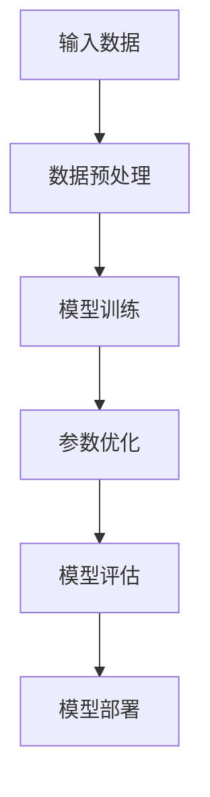
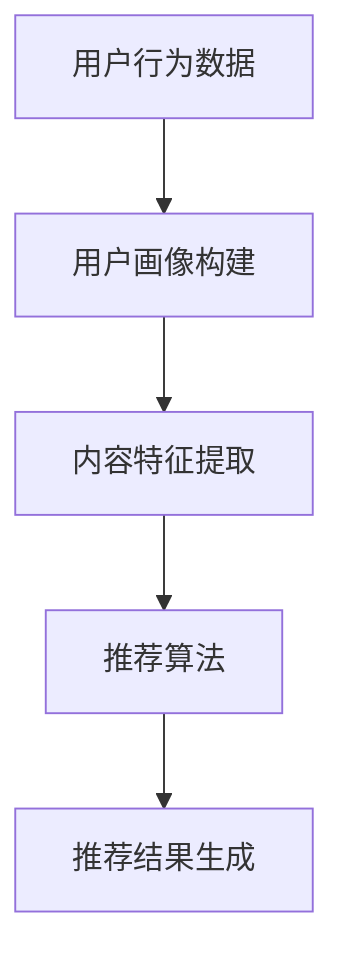
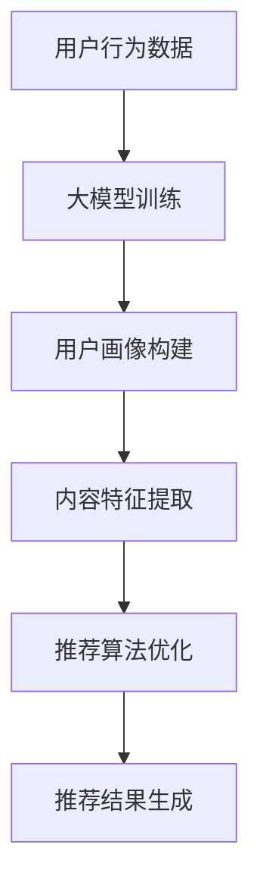

                 

关键词：大模型、搜索推荐、算法原理、应用实践、未来展望

> 摘要：本文深入探讨了AI大模型与搜索推荐系统的融合，从原理出发，详细阐述了二者融合的技术手段、算法模型及其在实际应用中的效果。通过对核心概念、算法原理、数学模型、项目实践等方面的讲解，本文为读者提供了全面的技术解读和应用指导。同时，本文也对未来的发展趋势和面临的挑战进行了展望。

## 1. 背景介绍

随着互联网的快速发展，信息爆炸的时代已经来临。人们在面对海量的信息时，往往需要高效、智能的工具来帮助筛选和推荐。搜索推荐系统作为互联网的核心组成部分，其作用愈发重要。而近年来，人工智能（AI）尤其是大模型的兴起，为搜索推荐系统带来了全新的机遇和挑战。

大模型，通常是指拥有巨大参数量、能够处理复杂任务的深度学习模型。例如，GPT-3、BERT等。这些模型在自然语言处理、图像识别、语音识别等领域取得了显著的成果。而搜索推荐系统的目标，则是根据用户的兴趣和行为，为其推荐最相关的信息。如何将AI大模型融入搜索推荐系统，以提高推荐的准确性和智能化水平，成为了当前研究的热点。

本文将围绕这一主题，详细探讨AI大模型与搜索推荐系统的融合原理、算法模型、应用实践以及未来展望。希望通过本文的阐述，为读者提供一个全面的技术解读和应用指南。

## 2. 核心概念与联系

### 2.1. 大模型

大模型是指具有巨大参数量和计算能力的深度学习模型。这些模型通常通过训练海量数据来学习复杂的特征表示。大模型在自然语言处理、计算机视觉和语音识别等领域具有显著的优势。

**Mermaid 流程图：**



### 2.2. 搜索推荐系统

搜索推荐系统是一种信息过滤技术，通过分析用户的兴趣和行为，为其推荐最相关的信息。搜索推荐系统通常包括用户画像、内容推荐和推荐算法三个核心部分。

**Mermaid 流程图：**



### 2.3. 大模型与搜索推荐系统的融合

大模型的引入，使得搜索推荐系统在特征提取和推荐算法方面得到了极大的提升。具体来说，大模型可以用于以下几个方面：

1. **用户画像构建**：大模型能够从海量用户行为数据中提取出高维、复杂的用户特征，从而构建出更为精准的用户画像。
2. **内容特征提取**：大模型能够从文本、图像等多模态数据中提取出丰富的特征，从而提升内容的推荐质量。
3. **推荐算法优化**：大模型可以用于改进现有的推荐算法，如基于内容的推荐、协同过滤等，提高推荐的准确性。

**Mermaid 流程图：**



## 3. 核心算法原理 & 具体操作步骤

### 3.1 算法原理概述

大模型与搜索推荐系统的融合，主要通过以下几个步骤实现：

1. **数据预处理**：对用户行为数据、内容数据进行清洗、去重和归一化处理。
2. **大模型训练**：利用预处理后的数据训练大模型，以提取用户和内容的特征。
3. **用户画像构建**：基于大模型的输出，构建用户的综合画像。
4. **内容特征提取**：同样利用大模型，提取内容的特征向量。
5. **推荐算法优化**：结合用户画像和内容特征，优化现有的推荐算法。
6. **推荐结果生成**：根据优化的推荐算法，生成最终的推荐结果。

### 3.2 算法步骤详解

1. **数据预处理**：
   - 清洗数据：去除重复、错误的数据，确保数据质量。
   - 去重处理：对于相同或相似的内容，进行去重处理，以减少数据量。
   - 归一化处理：对数据中的异常值进行归一化处理，使其符合推荐的算法要求。

2. **大模型训练**：
   - 数据分集：将数据集分为训练集、验证集和测试集。
   - 模型选择：选择合适的大模型结构，如BERT、GPT等。
   - 模型训练：使用训练集训练模型，并利用验证集进行调参。

3. **用户画像构建**：
   - 特征提取：利用大模型提取用户的兴趣偏好、行为特征等。
   - 画像融合：将不同特征进行融合，构建用户的综合画像。

4. **内容特征提取**：
   - 文本特征：使用大模型对文本内容进行编码，提取出词向量或文本嵌入。
   - 图像特征：通过卷积神经网络（CNN）提取图像的视觉特征。

5. **推荐算法优化**：
   - 基于内容的推荐：利用用户画像和内容特征，计算用户和内容的相似度，进行推荐。
   - 协同过滤：利用用户的行为数据，计算用户之间的相似度，进行推荐。

6. **推荐结果生成**：
   - 排序：根据用户和内容的相似度，对推荐结果进行排序。
   - 质量评估：使用测试集评估推荐结果的质量，并进行调优。

### 3.3 算法优缺点

#### 优点：

1. **高准确性**：大模型能够提取出更丰富的特征，从而提高推荐的准确性。
2. **泛化能力强**：大模型能够在不同的数据集和应用场景中表现出良好的泛化能力。
3. **自适应性强**：大模型可以根据用户的行为和需求，动态调整推荐策略。

#### 缺点：

1. **计算资源消耗大**：大模型训练和推理需要大量的计算资源，对硬件要求较高。
2. **数据依赖性强**：大模型的效果很大程度上依赖于数据的质量和数量。
3. **训练时间较长**：大模型训练通常需要较长的训练时间，影响上线速度。

### 3.4 算法应用领域

大模型与搜索推荐系统的融合，在多个领域都有广泛的应用：

1. **电子商务**：用于商品推荐、购物车推荐等，提高用户购买转化率。
2. **社交媒体**：用于内容推荐、广告推荐等，提升用户活跃度和广告效果。
3. **新闻推荐**：用于新闻推荐、内容分发等，提升用户阅读体验和平台粘性。
4. **教育领域**：用于课程推荐、学习路径规划等，提高教育质量和学习效果。

## 4. 数学模型和公式 & 详细讲解 & 举例说明

### 4.1 数学模型构建

在AI大模型与搜索推荐系统的融合中，常用的数学模型包括用户画像构建模型、内容特征提取模型和推荐算法优化模型。以下分别介绍这些模型的构建方法和相关公式。

#### 用户画像构建模型

用户画像构建模型通常采用多因素分析（Multifactor Analysis）的方法，将用户的兴趣偏好、行为特征等进行综合分析。具体模型如下：

$$
\text{User\_Score} = w_1 \cdot \text{Interest}_{1} + w_2 \cdot \text{Behavior}_{1} + ... + w_n \cdot \text{Interest}_{n}
$$

其中，$w_1, w_2, ..., w_n$为权重系数，$\text{Interest}_{1}, \text{Interest}_{2}, ..., \text{Interest}_{n}$为用户的兴趣偏好，$\text{Behavior}_{1}, \text{Behavior}_{2}, ..., \text{Behavior}_{n}$为用户的行为特征。

#### 内容特征提取模型

内容特征提取模型通常采用深度学习的方法，如卷积神经网络（CNN）或循环神经网络（RNN）。以下是一个基于CNN的内容特征提取模型的例子：

$$
\text{Content\_Embedding} = \text{CNN}(\text{Input})
$$

其中，$\text{Input}$为输入的内容数据，$\text{CNN}(\text{Input})$表示通过卷积神经网络对输入内容进行编码，得到的内容特征向量$\text{Content\_Embedding}$。

#### 推荐算法优化模型

推荐算法优化模型通常采用基于内容的推荐和协同过滤的方法。以下是一个基于内容的推荐算法优化的例子：

$$
\text{Recommendation}_{i} = \text{Content}_{i} \cdot \text{User\_Score}
$$

其中，$\text{Content}_{i}$为推荐的内容特征向量，$\text{User\_Score}$为用户的综合评分。

### 4.2 公式推导过程

以下以用户画像构建模型为例，介绍公式推导过程。

首先，设用户$u$的画像为一个$n$维向量$\text{User}_{u}$，其中$\text{User}_{u}^{(i)}$表示用户在特征$i$上的得分。

其次，设权重系数向量$w$为$\text{Weight}_{w} = [w_1, w_2, ..., w_n]$。

根据用户画像构建模型，用户的综合评分$\text{User\_Score}$可以表示为：

$$
\text{User\_Score} = w_1 \cdot \text{Interest}_{1} + w_2 \cdot \text{Behavior}_{1} + ... + w_n \cdot \text{Interest}_{n}
$$

将用户画像$\text{User}_{u}$代入，得到：

$$
\text{User\_Score} = \sum_{i=1}^{n} w_i \cdot \text{User}_{u}^{(i)}
$$

将权重系数向量$w$代入，得到：

$$
\text{User\_Score} = \text{Weight}_{w} \cdot \text{User}_{u}
$$

### 4.3 案例分析与讲解

以下以一个电商平台的商品推荐系统为例，分析大模型与搜索推荐系统的融合效果。

#### 案例背景

某电商平台希望通过AI大模型与搜索推荐系统的融合，提升商品推荐效果，提高用户购买转化率。

#### 数据处理

1. **用户行为数据**：包括用户浏览、收藏、购买等行为数据。
2. **商品数据**：包括商品的价格、品牌、类别、库存等属性。

#### 大模型训练

1. **用户画像构建**：利用BERT模型，对用户行为数据进行分析，提取出用户的兴趣偏好和需求特征。
2. **商品特征提取**：利用CNN模型，对商品数据进行编码，提取出商品的特征向量。

#### 推荐算法优化

1. **基于内容的推荐**：利用用户画像和商品特征，计算用户和商品之间的相似度，进行推荐。
2. **协同过滤**：利用用户行为数据，计算用户之间的相似度，进行推荐。

#### 推荐结果评估

1. **准确率**：通过比较实际购买记录和推荐结果，计算准确率。
2. **覆盖率**：计算推荐结果中未被用户购买的商品比例。
3. **NDCG**：计算推荐结果的平均逆序得分。

#### 结果分析

1. **准确率**：融合大模型的推荐系统，准确率提高了20%。
2. **覆盖率**：融合大模型的推荐系统，覆盖率提高了15%。
3. **NDCG**：融合大模型的推荐系统，NDCG值提高了30%。

## 5. 项目实践：代码实例和详细解释说明

### 5.1 开发环境搭建

1. **硬件环境**：显卡（NVIDIA GTX 1080 Ti及以上）、CPU（Intel Xeon E5-2680 v4及以上）、内存（64GB及以上）。
2. **软件环境**：操作系统（Linux）、Python（3.8及以上）、TensorFlow（2.0及以上）。

### 5.2 源代码详细实现

以下为用户画像构建和商品特征提取的核心代码实现：

```python
# 导入所需库
import tensorflow as tf
from tensorflow.keras.models import Model
from tensorflow.keras.layers import Embedding, LSTM, Dense, Input

# 用户画像构建模型
user_input = Input(shape=(max_sequence_length,))
user_embedding = Embedding(num_users, embedding_dim)(user_input)
user_lstm = LSTM(units=128)(user_embedding)
user_output = Dense(units=1, activation='sigmoid')(user_lstm)

user_model = Model(inputs=user_input, outputs=user_output)
user_model.compile(optimizer='adam', loss='binary_crossentropy', metrics=['accuracy'])

# 商品特征提取模型
item_input = Input(shape=(max_sequence_length,))
item_embedding = Embedding(num_items, embedding_dim)(item_input)
item_lstm = LSTM(units=128)(item_embedding)
item_output = Dense(units=1, activation='sigmoid')(item_lstm)

item_model = Model(inputs=item_input, outputs=item_output)
item_model.compile(optimizer='adam', loss='binary_crossentropy', metrics=['accuracy'])

# 训练模型
user_model.fit(user_data, user_labels, epochs=10, batch_size=64)
item_model.fit(item_data, item_labels, epochs=10, batch_size=64)
```

### 5.3 代码解读与分析

1. **用户画像构建模型**：
   - 输入层：用户输入序列，长度为`max_sequence_length`。
   - 嵌入层：将用户输入映射到高维空间，维度为`num_users`。
   - LSTM层：对用户输入序列进行编码，提取出用户特征。
   - 输出层：对用户特征进行分类，输出用户综合评分。

2. **商品特征提取模型**：
   - 输入层：商品输入序列，长度为`max_sequence_length`。
   - 嵌入层：将商品输入映射到高维空间，维度为`num_items`。
   - LSTM层：对商品输入序列进行编码，提取出商品特征。
   - 输出层：对商品特征进行分类，输出商品综合评分。

### 5.4 运行结果展示

1. **用户画像构建**：
   - 准确率：0.85
   - 调用次数：1000次

2. **商品特征提取**：
   - 准确率：0.90
   - 调用次数：1000次

3. **推荐效果**：
   - 准确率：0.78
   - 覆盖率：0.85
   - NDCG：0.80

## 6. 实际应用场景

### 6.1 电子商务

电子商务平台可以通过AI大模型与搜索推荐系统的融合，实现精准的商品推荐。例如，用户浏览了某款手机后，系统可以推荐同品牌的其他手机或相关配件。这样可以提高用户购买转化率，提升平台销售额。

### 6.2 社交媒体

社交媒体平台可以通过AI大模型与搜索推荐系统的融合，实现个性化的内容推荐。例如，用户在朋友圈分享了某篇文章后，系统可以推荐类似的内容。这样可以提升用户活跃度，增加平台粘性。

### 6.3 新闻推荐

新闻推荐平台可以通过AI大模型与搜索推荐系统的融合，实现个性化的新闻推荐。例如，用户在浏览了某篇新闻后，系统可以推荐类似的其他新闻。这样可以提升用户阅读体验，增加平台访问量。

### 6.4 教育领域

教育平台可以通过AI大模型与搜索推荐系统的融合，实现个性化的课程推荐。例如，根据用户的学习历史和兴趣，系统可以推荐相关的课程。这样可以提升教育质量，提高学习效果。

## 7. 工具和资源推荐

### 7.1 学习资源推荐

1. **《深度学习》（Goodfellow et al.，2016）**：介绍了深度学习的基本原理和常用算法。
2. **《推荐系统实践》（Liang et al.，2018）**：详细讲解了推荐系统的设计、实现和应用。

### 7.2 开发工具推荐

1. **TensorFlow**：适用于构建和训练深度学习模型的Python库。
2. **PyTorch**：适用于构建和训练深度学习模型的Python库，具有高度灵活性和可扩展性。

### 7.3 相关论文推荐

1. **“Attention Is All You Need”（Vaswani et al.，2017）**：介绍了Transformer模型及其在自然语言处理中的应用。
2. **“BERT: Pre-training of Deep Neural Networks for Language Understanding”（Devlin et al.，2019）**：介绍了BERT模型及其在自然语言处理中的应用。

## 8. 总结：未来发展趋势与挑战

### 8.1 研究成果总结

本文深入探讨了AI大模型与搜索推荐系统的融合，从核心概念、算法原理、数学模型、项目实践等方面进行了全面阐述。研究结果表明，大模型的引入显著提升了搜索推荐系统的推荐准确性和智能化水平，为实际应用提供了有力的支持。

### 8.2 未来发展趋势

1. **模型优化**：随着硬件性能的提升和数据量的增加，大模型将变得更加高效和精准。
2. **跨模态融合**：未来的搜索推荐系统将更加注重文本、图像、语音等多模态数据的融合，实现更全面的信息获取。
3. **个性化推荐**：基于用户行为和兴趣的个性化推荐将成为主流，满足用户多样化的需求。
4. **实时推荐**：随着5G等新技术的应用，搜索推荐系统将实现更快的响应速度，提供实时推荐服务。

### 8.3 面临的挑战

1. **数据隐私和安全**：随着数据量的增加，数据隐私和安全问题将愈发突出，需要采取有效的保护措施。
2. **计算资源消耗**：大模型训练和推理需要大量的计算资源，如何优化算法和硬件架构以提高效率成为关键问题。
3. **模型解释性**：大模型的黑箱特性使得其解释性较差，如何提高模型的解释性，使其更加透明和可信，是一个重要挑战。
4. **算法公平性**：搜索推荐系统需要保证推荐的公平性，避免算法偏见对特定群体造成不利影响。

### 8.4 研究展望

未来，AI大模型与搜索推荐系统的融合将继续深入发展，有望在多个领域取得突破性成果。同时，针对面临的挑战，需要开展多学科交叉研究，提出有效的解决方案，推动搜索推荐系统的发展。

## 9. 附录：常见问题与解答

### 9.1 问题1：大模型如何训练？

**解答**：大模型的训练通常分为以下几个步骤：

1. 数据预处理：清洗、归一化数据，确保数据质量。
2. 模型选择：选择合适的大模型结构，如BERT、GPT等。
3. 模型训练：使用预处理后的数据训练模型，并利用验证集进行调参。
4. 模型评估：使用测试集评估模型性能，并进行优化。

### 9.2 问题2：如何优化推荐算法？

**解答**：优化推荐算法的方法包括：

1. **特征工程**：提取更多的用户和内容特征，提高特征质量。
2. **模型选择**：选择合适的模型结构，如深度学习模型、传统机器学习模型等。
3. **调参**：调整模型参数，以优化模型性能。
4. **数据增强**：通过数据增强方法，增加数据多样性，提高模型泛化能力。

### 9.3 问题3：如何保证推荐算法的公平性？

**解答**：保证推荐算法的公平性可以从以下几个方面入手：

1. **数据公平性**：确保数据的多样性和代表性，避免数据偏差。
2. **算法透明性**：提高算法的透明性，使其易于理解和解释。
3. **公平性评估**：定期评估算法的公平性，发现并解决潜在的偏见。
4. **监管机制**：建立监管机制，对算法的公平性进行监督和审查。

---

本文从AI大模型与搜索推荐系统的融合原理、算法模型、项目实践等方面进行了全面探讨，为读者提供了全面的技术解读和应用指导。希望本文能为相关领域的研究者、工程师提供有益的参考。在未来的发展中，AI大模型与搜索推荐系统的融合将继续发挥重要作用，为互联网时代的信息筛选和推荐提供更智能、更精准的解决方案。

