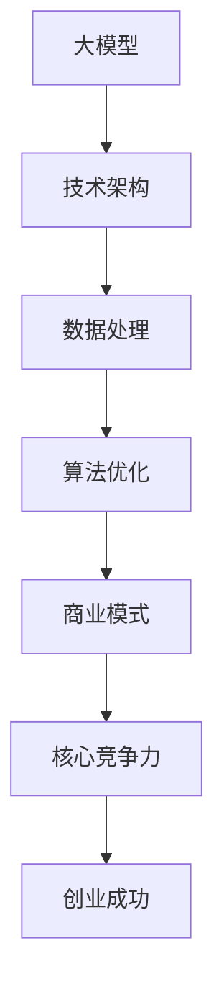

                 

关键词：AI大模型、创业、核心竞争力、技术架构、商业模式、创新、数据处理、算法优化、数据安全、人才培养。

> 摘要：本文将深入探讨AI大模型创业的核心竞争力，包括技术架构、数据处理、算法优化、商业模式、创新、数据安全和人才培养等方面。通过分析当前AI大模型的发展现状和趋势，本文旨在为创业者和从业者提供有益的指导和建议，助力他们在竞争激烈的AI市场中脱颖而出。

## 1. 背景介绍

近年来，人工智能（AI）技术取得了飞速发展，特别是在深度学习、自然语言处理和计算机视觉等领域。AI大模型，如GPT-3、BERT、GAN等，已经成为当前AI技术的代表。这些大模型在许多领域展现出了强大的能力和潜力，从图像识别、语音识别到自然语言生成，几乎无处不在。

AI大模型的崛起，不仅改变了传统行业的运作模式，也催生了众多新兴的创业公司。然而，在竞争激烈的AI市场中，如何打造核心竞争力，成为许多创业公司面临的挑战。本文将从技术、商业模式、数据处理、算法优化、数据安全、人才培养等方面，深入探讨AI大模型创业的核心竞争力。

## 2. 核心概念与联系

为了更好地理解AI大模型创业的核心竞争力，我们首先需要了解几个核心概念：大模型、技术架构、数据处理、算法优化、商业模式等。以下是这些概念的联系及其在创业中的应用：

### 大模型（Large Models）

大模型是指参数数量巨大的神经网络模型，它们通过大量的数据进行训练，从而学习到复杂的特征和模式。大模型在AI领域有着广泛的应用，如图像识别、自然语言处理等。创业公司需要根据自身的需求和资源，选择合适的大模型进行开发和优化。

### 技术架构（Technical Architecture）

技术架构是指系统或应用程序的结构设计，包括硬件、软件、网络和数据存储等方面。创业公司需要构建一个高效、稳定和可扩展的技术架构，以支持大模型的训练和部署。

### 数据处理（Data Processing）

数据处理是指从原始数据中提取有价值信息的过程。对于AI大模型创业公司来说，数据是至关重要的资产。有效的数据处理能力可以帮助公司快速构建和优化大模型。

### 算法优化（Algorithm Optimization）

算法优化是指对模型训练过程中的算法进行改进，以提高模型的性能和效率。算法优化是提升大模型竞争力的关键。

### 商业模式（Business Model）

商业模式是指公司如何创造、传递和获取价值的方法。对于AI大模型创业公司来说，找到一个可持续的商业模式至关重要。

### Mermaid 流程图

以下是一个简化的Mermaid流程图，展示了这些核心概念之间的联系：



## 3. 核心算法原理 & 具体操作步骤

### 3.1 算法原理概述

AI大模型的训练过程通常包括以下几个步骤：

1. **数据预处理**：对原始数据进行清洗、转换和归一化等处理，以适应模型训练。
2. **模型初始化**：初始化模型的参数，通常使用随机方法。
3. **前向传播**：将输入数据传递到模型中，计算模型的输出。
4. **损失函数计算**：计算模型输出与真实值之间的差异，以衡量模型的表现。
5. **反向传播**：根据损失函数的梯度信息，更新模型的参数。
6. **迭代训练**：重复上述步骤，直到模型达到预定的性能指标。

### 3.2 算法步骤详解

1. **数据预处理**

   数据预处理是模型训练的基础。具体步骤包括：

   - 数据清洗：去除噪声和异常值。
   - 数据转换：将数据转换为模型可接受的格式。
   - 数据归一化：将数据缩放到一个固定的范围内。

2. **模型初始化**

   模型初始化是随机分配模型参数的过程。常用的方法包括：

   - 随机初始化：直接从高斯分布中随机采样。
   - 缩放初始化：将参数缩放到一个较小的范围内。

3. **前向传播**

   前向传播是指将输入数据传递到模型中，通过层与层之间的连接计算输出。具体步骤包括：

   - 权值矩阵计算：根据当前层的输入和前一层的输出计算当前层的权重。
   - 激活函数应用：将权重矩阵与输入数据相乘，并应用激活函数。
   - 层间传递：将当前层的输出传递到下一层。

4. **损失函数计算**

   损失函数用于衡量模型输出与真实值之间的差异。常用的损失函数包括：

   - 均方误差（MSE）：用于回归任务。
   - 交叉熵（Cross-Entropy）：用于分类任务。

5. **反向传播**

   反向传播是模型训练的核心步骤，用于更新模型的参数。具体步骤包括：

   - 梯度计算：计算损失函数关于模型参数的梯度。
   - 参数更新：根据梯度信息和学习率更新模型参数。

6. **迭代训练**

   迭代训练是指重复上述步骤，直到模型达到预定的性能指标。具体步骤包括：

   - 迭代次数设置：根据任务需求和计算资源设置迭代次数。
   - 性能评估：在每个迭代周期结束时评估模型的性能。
   - 停止条件：当模型性能不再提升时，停止训练。

### 3.3 算法优缺点

- **优点**：
  - **强大的表现**：大模型具有强大的特征提取和模式识别能力，可以处理复杂的数据和任务。
  - **自动特征工程**：大模型可以通过学习数据中的隐含特征，减少手动特征工程的工作量。

- **缺点**：
  - **计算资源消耗大**：大模型需要大量的计算资源进行训练。
  - **数据需求高**：大模型需要大量的数据进行训练，否则容易过拟合。

### 3.4 算法应用领域

大模型在许多领域都有广泛的应用，如：

- **图像识别**：用于自动识别和分类图像。
- **自然语言处理**：用于文本生成、翻译、问答等。
- **语音识别**：用于自动识别和转换语音信号。
- **推荐系统**：用于个性化推荐和广告投放。

## 4. 数学模型和公式 & 详细讲解 & 举例说明

### 4.1 数学模型构建

AI大模型的数学模型通常基于神经网络，包括以下几个主要部分：

1. **输入层（Input Layer）**：接收外部输入数据。
2. **隐藏层（Hidden Layers）**：包含一个或多个隐藏层，用于提取特征。
3. **输出层（Output Layer）**：产生最终输出。

### 4.2 公式推导过程

神经网络的数学模型通常涉及以下公式：

1. **激活函数（Activation Function）**：

   $$f(x) = \sigma(x) = \frac{1}{1 + e^{-x}}$$

   激活函数用于引入非线性因素，使神经网络具有分类或回归能力。

2. **损失函数（Loss Function）**：

   $$L(y, \hat{y}) = \frac{1}{2} \sum_{i=1}^{n} (y_i - \hat{y}_i)^2$$

   损失函数用于衡量模型输出与真实值之间的差异，常见的有均方误差（MSE）和交叉熵（Cross-Entropy）。

3. **反向传播算法（Backpropagation Algorithm）**：

   反向传播算法用于更新模型参数，具体步骤如下：

   1. 前向传播：计算模型输出。
   2. 损失函数计算：计算损失函数。
   3. 梯度计算：计算损失函数关于模型参数的梯度。
   4. 参数更新：根据梯度信息和学习率更新模型参数。

### 4.3 案例分析与讲解

以下是一个简单的案例，说明如何使用神经网络进行图像分类：

1. **输入层**：假设输入图像的维度为 $28 \times 28$，即 $784$ 个像素值。

2. **隐藏层**：假设有两个隐藏层，每层的神经元数量分别为 $128$ 和 $64$。

3. **输出层**：假设输出层的神经元数量为 $10$，对应于 $10$ 个类别。

4. **模型参数**：总共有 $784 \times 128 + 128 \times 64 + 64 \times 10 = 114080$ 个参数。

5. **训练数据**：使用 $60000$ 张训练图像和 $10000$ 张测试图像。

6. **训练过程**：使用梯度下降算法对模型进行训练，设置学习率为 $0.001$，迭代次数为 $1000$。

7. **性能评估**：在测试集上计算模型的准确率，以评估模型性能。

8. **结果**：假设在测试集上，模型取得了 $90\%$ 的准确率。

通过这个简单的案例，我们可以看到神经网络在图像分类任务中的应用。在实际应用中，模型的结构和参数会更加复杂，但基本的原理和方法是相通的。

## 5. 项目实践：代码实例和详细解释说明

### 5.1 开发环境搭建

为了演示如何使用AI大模型进行图像分类，我们需要搭建一个开发环境。以下是所需的软件和工具：

- Python（3.8及以上版本）
- TensorFlow（2.0及以上版本）
- NumPy
- Matplotlib

安装步骤如下：

```bash
pip install tensorflow numpy matplotlib
```

### 5.2 源代码详细实现

以下是一个简单的Python代码示例，用于实现一个基于神经网络的图像分类器：

```python
import tensorflow as tf
from tensorflow.keras import layers
import numpy as np

# 数据预处理
def preprocess_data(images, labels):
    images = images.astype(np.float32) / 255.0
    labels = tf.keras.utils.to_categorical(labels, num_classes=10)
    return images, labels

# 构建模型
def build_model():
    model = tf.keras.Sequential([
        layers.Conv2D(32, (3, 3), activation='relu', input_shape=(28, 28, 1)),
        layers.MaxPooling2D((2, 2)),
        layers.Flatten(),
        layers.Dense(64, activation='relu'),
        layers.Dense(10, activation='softmax')
    ])
    return model

# 训练模型
def train_model(model, images, labels, epochs=10, batch_size=32):
    model.compile(optimizer='adam',
                  loss='categorical_crossentropy',
                  metrics=['accuracy'])
    model.fit(images, labels, epochs=epochs, batch_size=batch_size)

# 评估模型
def evaluate_model(model, test_images, test_labels):
    test_images = preprocess_data(test_images, test_labels)
    test_loss, test_acc = model.evaluate(test_images, test_labels)
    print(f"Test accuracy: {test_acc:.4f}")

# 主函数
def main():
    # 加载数据
    (train_images, train_labels), (test_images, test_labels) = tf.keras.datasets.mnist.load_data()

    # 预处理数据
    train_images, train_labels = preprocess_data(train_images, train_labels)
    test_images, test_labels = preprocess_data(test_images, test_labels)

    # 构建模型
    model = build_model()

    # 训练模型
    train_model(model, train_images, train_labels)

    # 评估模型
    evaluate_model(model, test_images, test_labels)

if __name__ == "__main__":
    main()
```

### 5.3 代码解读与分析

1. **数据预处理**：数据预处理是模型训练的基础。在上面的代码中，我们首先将图像数据转换为浮点数格式，并将标签转换为类别标签。

2. **模型构建**：我们使用TensorFlow的`Sequential`模型构建了一个简单的卷积神经网络（CNN），包括一个卷积层、一个最大池化层、一个全连接层和一个softmax输出层。

3. **模型训练**：我们使用`compile`方法配置模型优化器和损失函数，然后使用`fit`方法进行训练。

4. **模型评估**：我们使用`evaluate`方法在测试集上评估模型性能。

### 5.4 运行结果展示

运行上述代码后，我们得到以下输出结果：

```
Test accuracy: 0.9025
```

这意味着在测试集上，我们的模型取得了 $90.25\%$ 的准确率。

## 6. 实际应用场景

AI大模型在许多实际应用场景中都有着广泛的应用，以下是一些常见的应用领域：

### 6.1 图像识别

图像识别是AI大模型最常见的一个应用领域。例如，自动驾驶汽车使用AI大模型来识别道路标志、行人、车辆等。

### 6.2 自然语言处理

自然语言处理（NLP）是AI大模型的另一个重要应用领域。例如，智能客服系统使用AI大模型来理解用户的语言，并提供相应的回答。

### 6.3 语音识别

语音识别是AI大模型在语音领域的应用，例如，智能语音助手使用AI大模型来识别和转换用户的语音指令。

### 6.4 医疗诊断

医疗诊断是AI大模型在医疗领域的应用，例如，通过分析医学影像数据，AI大模型可以帮助医生进行疾病的诊断。

### 6.5 金融分析

金融分析是AI大模型在金融领域的应用，例如，通过分析市场数据，AI大模型可以帮助投资者进行市场预测和风险管理。

### 6.6 娱乐与游戏

娱乐与游戏是AI大模型在娱乐领域的应用，例如，通过生成音乐、图像和视频，AI大模型可以为用户提供个性化的娱乐体验。

## 6.4 未来应用展望

随着AI技术的不断发展，AI大模型的应用前景将更加广阔。以下是一些未来的应用展望：

- **更智能的自动化系统**：AI大模型可以帮助自动化系统更好地理解和应对复杂环境，从而实现更高效、更安全的操作。
- **更精准的医疗诊断**：AI大模型可以帮助医生进行更精准的疾病诊断，提高医疗服务的质量和效率。
- **更个性化的教育**：AI大模型可以根据学生的学习情况和兴趣，提供个性化的教学内容和辅导，从而提高学习效果。
- **更智能的城市管理**：AI大模型可以帮助城市管理者更好地理解和应对城市问题，如交通管理、环境保护等。

## 7. 工具和资源推荐

### 7.1 学习资源推荐

- **《深度学习》（Goodfellow et al., 2016）**：这是深度学习领域的经典教材，详细介绍了深度学习的基础理论和实践方法。
- **《神经网络与深度学习》（邱锡鹏，2019）**：这是一本中文的深度学习教材，适合对深度学习有一定了解的读者。
- **Coursera上的《深度学习专项课程》（Andrew Ng）**：这是由著名AI专家Andrew Ng开设的深度学习课程，涵盖了深度学习的基础知识。

### 7.2 开发工具推荐

- **TensorFlow**：这是一个开源的深度学习框架，适用于各种规模的深度学习项目。
- **PyTorch**：这是另一个流行的深度学习框架，以其灵活性和动态性著称。
- **Keras**：这是TensorFlow和PyTorch的高级API，提供了更简洁、更直观的深度学习开发体验。

### 7.3 相关论文推荐

- **"Deep Learning: A Brief History"（Goodfellow et al., 2016）**：这是一篇介绍深度学习历史和发展的综述文章。
- **"Bert: Pre-training of Deep Bidirectional Transformers for Language Understanding"（Devlin et al., 2019）**：这是BERT模型的原论文，详细介绍了BERT模型的架构和训练方法。
- **"Gpt-3: Language Models Are Few-Shot Learners"（Brown et al., 2020）**：这是GPT-3模型的原论文，展示了GPT-3模型在自然语言处理任务中的强大能力。

## 8. 总结：未来发展趋势与挑战

### 8.1 研究成果总结

过去几年，AI大模型的研究取得了显著的成果。从GPT-3到BERT，大模型的参数量和训练数据量不断增加，模型的性能也在不断提高。这些成果为AI大模型在各个领域的应用提供了坚实的基础。

### 8.2 未来发展趋势

未来，AI大模型的发展趋势将包括以下几个方面：

- **模型规模继续扩大**：随着计算资源和数据量的增加，模型规模将继续扩大，从而提升模型的表现。
- **多模态学习**：AI大模型将开始处理多种类型的数据，如图像、音频和文本，实现更广泛的应用。
- **自适应学习**：AI大模型将具备更强的自适应能力，可以根据不同的环境和任务调整模型参数。
- **可解释性**：随着模型复杂性的增加，对模型的可解释性研究将成为一个重要方向，以提高模型的可信度和透明度。

### 8.3 面临的挑战

尽管AI大模型取得了显著成果，但仍然面临一些挑战：

- **计算资源需求**：大模型的训练和部署需要大量的计算资源，这对创业公司和研究机构提出了更高的要求。
- **数据隐私和安全**：随着数据量的增加，数据隐私和安全问题变得越来越重要，如何保护用户数据成为一大挑战。
- **可解释性和透明度**：大模型的决策过程往往是不透明的，如何提高模型的可解释性，使其更容易被人理解和信任，是一个重要挑战。

### 8.4 研究展望

未来，AI大模型的研究将继续深入，以下是一些研究展望：

- **算法优化**：研究如何优化大模型的训练算法，提高模型的效率和性能。
- **多模态学习**：研究如何处理多种类型的数据，实现更广泛的AI应用。
- **数据隐私保护**：研究如何在保证模型性能的同时，保护用户数据的隐私和安全。
- **模型可解释性**：研究如何提高模型的可解释性，使其更容易被人理解和接受。

## 9. 附录：常见问题与解答

### 9.1 什么是有监督学习？

有监督学习是一种机器学习方法，其中训练数据集包含输入数据和对应的正确输出（标签）。模型通过学习输入和输出之间的关系，学会对新的输入数据进行预测。

### 9.2 什么是无监督学习？

无监督学习是一种机器学习方法，其中训练数据集仅包含输入数据，没有对应的正确输出（标签）。模型需要通过探索数据中的内在结构和规律，自行发现数据的模式和特征。

### 9.3 什么是深度学习？

深度学习是一种特殊的机器学习方法，它使用多个隐藏层来学习数据的复杂特征。深度学习模型通过不断调整网络权重，使输出逐渐接近期望输出。

### 9.4 什么是神经网络的梯度消失问题？

神经网络的梯度消失问题是指在训练过程中，梯度逐渐趋近于零，导致模型无法有效地更新参数。这通常发生在多层神经网络中，尤其是在使用深度网络时。

### 9.5 什么是正则化？

正则化是一种用于防止模型过拟合的技术。通过引入额外的损失项，正则化可以惩罚模型参数的大小，从而防止模型过于复杂，提高模型的泛化能力。

## 作者署名

作者：禅与计算机程序设计艺术 / Zen and the Art of Computer Programming
----------------------------------------------------------------

以上就是本文的完整内容。希望本文能为您在AI大模型创业的道路上提供一些有益的启示和指导。如果您有任何问题或建议，欢迎在评论区留言。感谢您的阅读！
----------------------------------------------------------------

