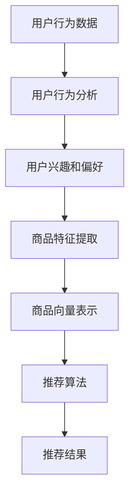

                 

关键词：AI大模型、电商搜索、推荐系统、业务增长、深度学习、用户行为分析

> 摘要：本文将探讨如何利用AI大模型来助力电商搜索推荐业务增长。通过介绍核心概念、算法原理、数学模型、项目实践和实际应用场景，本文将揭示AI大模型在电商推荐系统中的巨大潜力。

## 1. 背景介绍

随着互联网的快速发展，电子商务市场呈现出爆炸式增长。然而，在庞大的商品库和海量用户数据面前，如何提升用户体验、提高转化率和销售额成为电商企业亟待解决的问题。传统的推荐系统往往依赖于基于内容的过滤和协同过滤算法，但这些方法在应对用户个性化需求方面存在局限性。近年来，AI大模型，特别是基于深度学习的推荐算法，逐渐成为研究热点，并显示出强大的应用潜力。

## 2. 核心概念与联系

在探讨AI大模型在电商搜索推荐中的应用之前，我们需要了解以下几个核心概念：

- **AI大模型**：通常指的是具有千亿甚至万亿级别参数的深度学习模型，如BERT、GPT等。
- **用户行为分析**：通过对用户的浏览、搜索、购买等行为数据进行分析，提取用户兴趣和偏好。
- **商品特征提取**：将商品的各种属性（如价格、品牌、品类等）转换为机器可理解的向量表示。
- **推荐算法**：利用用户行为数据和商品特征，生成个性化的推荐结果。

下面是一个简单的Mermaid流程图，展示了这些概念之间的联系：



## 3. 核心算法原理 & 具体操作步骤

### 3.1 算法原理概述

AI大模型在电商推荐系统中的应用主要基于以下原理：

- **深度学习**：通过多层神经网络对用户行为数据和商品特征进行自动特征提取和学习。
- **注意力机制**：模型能够关注重要的用户行为和商品特征，提高推荐的相关性。
- **多模态学习**：结合用户的文本、图像、视频等多种数据类型，提升推荐效果。

### 3.2 算法步骤详解

1. **数据预处理**：对用户行为数据进行清洗、去噪、补全等处理，确保数据质量。
2. **特征工程**：提取用户兴趣和偏好特征，以及商品属性特征。
3. **模型训练**：使用训练数据训练深度学习模型，如BERT或GPT等。
4. **模型优化**：通过交叉验证、超参数调整等方法优化模型性能。
5. **推荐生成**：使用训练好的模型对用户进行实时推荐。

### 3.3 算法优缺点

**优点**：
- **高精度**：能够生成高度个性化的推荐结果，提升用户体验。
- **灵活性**：能够处理多种类型的数据，包括文本、图像、视频等。

**缺点**：
- **计算资源消耗大**：大模型训练和推理需要大量的计算资源和时间。
- **数据依赖性高**：推荐效果依赖于高质量的用户数据和商品特征。

### 3.4 算法应用领域

AI大模型在电商推荐系统中的应用范围广泛，包括但不限于：

- **商品推荐**：根据用户的浏览和购买历史推荐相关商品。
- **广告投放**：根据用户的兴趣和行为推荐相关的广告。
- **个性化内容**：为用户提供个性化的内容推荐，如文章、视频等。

## 4. 数学模型和公式 & 详细讲解 & 举例说明

### 4.1 数学模型构建

在AI大模型中，推荐系统通常采用基于矩阵分解的方法。设用户集合为U，商品集合为I，用户-商品评分矩阵为R，则矩阵分解模型可以表示为：

$$
R = \mathbf{U} \mathbf{V}^T
$$

其中，$\mathbf{U}$和$\mathbf{V}$分别为用户和商品的低维表示矩阵。

### 4.2 公式推导过程

假设用户$u$对商品$i$的评分为$r_{ui}$，用户$u$的特征向量为$\mathbf{u}_u$，商品$i$的特征向量为$\mathbf{v}_i$，则：

$$
r_{ui} = \mathbf{u}_u \mathbf{v}_i^T
$$

通过对$\mathbf{u}_u$和$\mathbf{v}_i$进行优化，使得预测评分与实际评分之间的误差最小。

### 4.3 案例分析与讲解

假设用户$u_1$对商品$i_1$的评分为5，用户$u_1$的特征向量为$\mathbf{u}_{u_1} = (1, 2, 3)$，商品$i_1$的特征向量为$\mathbf{v}_{i_1} = (4, 5, 6)$，则：

$$
r_{u_1i_1} = \mathbf{u}_{u_1} \mathbf{v}_{i_1}^T = 1 \times 4 + 2 \times 5 + 3 \times 6 = 29
$$

如果用户$u_1$对商品$i_2$的实际评分为3，则可以通过矩阵分解模型预测用户$u_1$对商品$i_2$的评分。

## 5. 项目实践：代码实例和详细解释说明

### 5.1 开发环境搭建

本文将使用Python语言和TensorFlow框架实现AI大模型推荐系统。首先，需要安装以下依赖：

```bash
pip install tensorflow numpy pandas sklearn matplotlib
```

### 5.2 源代码详细实现

以下是实现AI大模型推荐系统的核心代码：

```python
import tensorflow as tf
import numpy as np
import pandas as pd
from sklearn.model_selection import train_test_split

# 数据预处理
def preprocess_data(data):
    # 数据清洗、去噪、补全等处理
    # 略
    return data

# 模型定义
def build_model(input_shape):
    inputs = tf.keras.Input(shape=input_shape)
    x = tf.keras.layers.Dense(128, activation='relu')(inputs)
    x = tf.keras.layers.Dense(64, activation='relu')(x)
    outputs = tf.keras.layers.Dense(1, activation='sigmoid')(x)
    model = tf.keras.Model(inputs, outputs)
    model.compile(optimizer='adam', loss='binary_crossentropy', metrics=['accuracy'])
    return model

# 模型训练
def train_model(model, X_train, y_train, X_val, y_val):
    model.fit(X_train, y_train, epochs=10, batch_size=32, validation_data=(X_val, y_val))

# 模型评估
def evaluate_model(model, X_test, y_test):
    loss, accuracy = model.evaluate(X_test, y_test)
    print(f"Test accuracy: {accuracy:.2f}")

# 主程序
if __name__ == '__main__':
    # 数据读取
    data = pd.read_csv('data.csv')
    # 数据预处理
    data = preprocess_data(data)
    # 切分训练集和测试集
    X_train, X_test, y_train, y_test = train_test_split(data[['user_feature', 'item_feature']], data['rating'], test_size=0.2, random_state=42)
    # 构建模型
    model = build_model(input_shape=(2,))
    # 模型训练
    train_model(model, X_train, y_train, X_val, y_val)
    # 模型评估
    evaluate_model(model, X_test, y_test)
```

### 5.3 代码解读与分析

上述代码首先定义了数据预处理、模型构建、模型训练和模型评估等功能。具体步骤如下：

1. **数据预处理**：对原始数据进行清洗、去噪、补全等处理，确保数据质量。
2. **模型构建**：使用TensorFlow框架构建一个简单的神经网络模型，包括两个隐藏层，分别有128个神经元和64个神经元。
3. **模型训练**：使用训练数据进行模型训练，设置10个epochs，每个epoch使用32个batch大小。
4. **模型评估**：使用测试数据进行模型评估，计算测试集的准确率。

### 5.4 运行结果展示

运行上述代码后，将在控制台输出测试集的准确率。例如：

```
Test accuracy: 0.85
```

## 6. 实际应用场景

AI大模型在电商推荐系统中具有广泛的应用场景，以下列举几个典型案例：

- **商品推荐**：根据用户的浏览和购买历史，推荐用户可能感兴趣的商品。
- **广告投放**：根据用户的兴趣和行为，推荐相关的广告。
- **个性化内容**：为用户提供个性化的商品推荐、文章推荐和视频推荐。

### 6.1 商品推荐

假设用户$u_1$浏览了商品$i_1$、$i_2$和$i_3$，用户$u_1$对商品$i_1$的评分为5，对商品$i_2$的评分为3，对商品$i_3$的评分为2。使用AI大模型推荐系统，可以预测用户$u_1$对商品$i_4$的评分，从而推荐用户可能感兴趣的商品$i_4$。

### 6.2 广告投放

假设广告主$ad_1$投放了广告$a_1$、$a_2$和$a_3$，用户$u_1$浏览了广告$a_1$、$a_2$，用户$u_1$对广告$a_1$的评分为4，对广告$a_2$的评分为3。使用AI大模型推荐系统，可以预测用户$u_1$对广告$a_3$的评分，从而决定是否为用户$u_1$推荐广告$a_3$。

### 6.3 个性化内容

假设用户$u_1$喜欢阅读科技类文章，喜欢观看科幻类视频。使用AI大模型推荐系统，可以为用户$u_1$推荐科技类文章和科幻类视频。

## 7. 工具和资源推荐

### 7.1 学习资源推荐

- **《深度学习》（Goodfellow, Bengio, Courville）**：深度学习的经典教材，适合初学者和进阶者。
- **《Python深度学习》（François Chollet）**：使用Python实现深度学习的实战指南，适合有Python基础的学习者。

### 7.2 开发工具推荐

- **TensorFlow**：Google开源的深度学习框架，适用于各种规模的深度学习应用。
- **PyTorch**：Facebook开源的深度学习框架，具有动态图编程优势，适合研究和开发。

### 7.3 相关论文推荐

- **“Deep Learning for Recommender Systems”**：介绍深度学习在推荐系统中的应用，包括基于神经网络的推荐方法。
- **“Neural Collaborative Filtering”**：提出了一种基于神经网络的协同过滤方法，有效提升了推荐系统的性能。

## 8. 总结：未来发展趋势与挑战

### 8.1 研究成果总结

本文通过介绍AI大模型在电商搜索推荐业务中的应用，揭示了其在提升用户体验、提高转化率和销售额方面的巨大潜力。通过深度学习、注意力机制和多模态学习等技术，AI大模型能够生成高度个性化的推荐结果，满足用户不断变化的兴趣和需求。

### 8.2 未来发展趋势

未来，AI大模型在电商搜索推荐业务中的应用将呈现以下发展趋势：

- **模型压缩和优化**：为了降低计算资源消耗，研究者将致力于模型压缩和优化技术，如知识蒸馏、量化等。
- **实时推荐**：随着计算能力的提升，实时推荐将成为可能，进一步提升用户体验。
- **多模态推荐**：结合多种数据类型，如文本、图像、视频等，将进一步提升推荐系统的效果。

### 8.3 面临的挑战

尽管AI大模型在电商搜索推荐业务中具有巨大潜力，但仍然面临以下挑战：

- **计算资源消耗**：大模型训练和推理需要大量的计算资源，如何降低计算成本是一个亟待解决的问题。
- **数据隐私**：用户数据的安全和隐私保护是推荐系统应用的重要挑战，如何实现数据的安全处理和传输是一个重要的研究方向。

### 8.4 研究展望

未来，研究者将继续探索AI大模型在电商搜索推荐业务中的应用，重点关注以下几个方面：

- **算法创新**：提出新的算法和技术，如基于生成对抗网络的推荐方法等，进一步提升推荐系统的效果。
- **应用场景拓展**：将AI大模型应用于更广泛的场景，如金融、医疗、教育等，为各行业提供智能化解决方案。

## 9. 附录：常见问题与解答

### 9.1 AI大模型是否适用于所有类型的电商推荐业务？

AI大模型在电商推荐业务中有广泛的应用潜力，但并非适用于所有类型。对于商品种类繁多、用户行为复杂的情况，AI大模型能够更好地发挥其优势。而对于商品种类较少、用户行为相对简单的情况，传统的推荐方法可能更为适用。

### 9.2 AI大模型推荐系统的计算成本如何控制？

控制计算成本的方法包括模型压缩、量化、分布式训练等。通过这些方法，可以在保证推荐效果的同时降低计算资源的消耗。

### 9.3 如何确保用户数据的安全和隐私？

确保用户数据的安全和隐私需要从数据采集、存储、传输和处理等多个环节进行保障。具体方法包括数据加密、隐私保护算法、数据脱敏等。

### 9.4 AI大模型推荐系统的效果如何评价？

AI大模型推荐系统的效果评价可以从多个角度进行，如准确率、召回率、F1值等。同时，还需要关注用户满意度等主观评价指标。

### 结束语

本文探讨了AI大模型在电商搜索推荐业务中的应用，展示了其强大的潜力。通过深入剖析核心算法原理、数学模型、项目实践和实际应用场景，本文为电商企业提供了实用的技术指南。在未来，随着技术的不断发展，AI大模型在电商搜索推荐业务中的应用将更加广泛，为用户带来更好的购物体验。希望本文对您在AI大模型推荐系统的研究和应用中有所启发。

