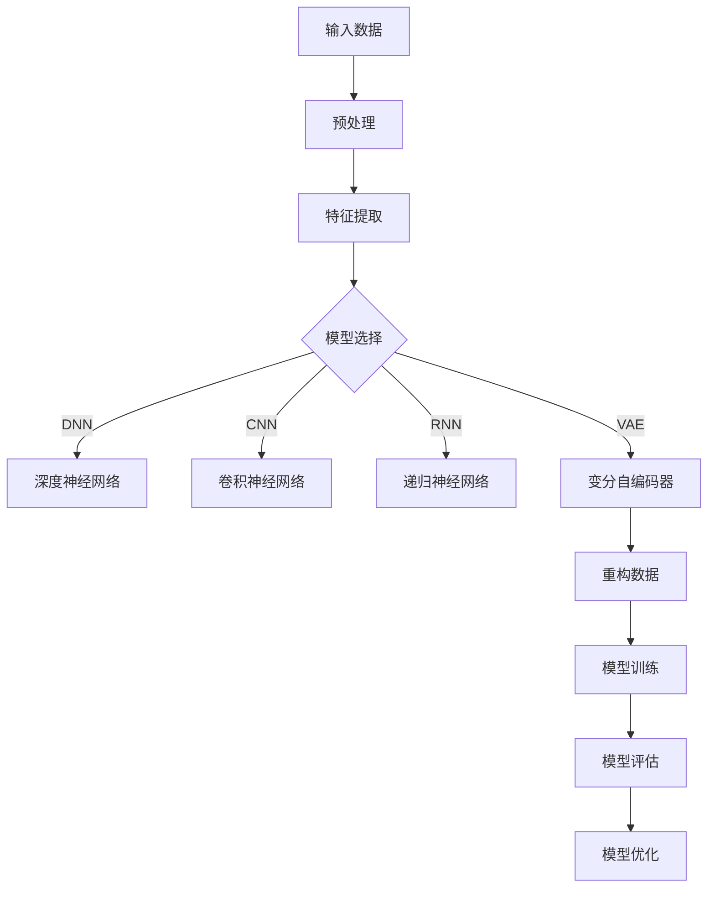

                 

关键字：AI大模型、电商搜索、推荐系统、敏捷开发、机器学习

摘要：本文将探讨如何利用AI大模型助力电商搜索推荐业务的敏捷开发。通过介绍AI大模型的基本概念和原理，结合电商搜索推荐业务的实际需求，我们将详细阐述AI大模型在搜索推荐系统中的应用方法，并分享实际开发过程中的经验和教训，为电商平台的敏捷开发提供新的思路和工具。

## 1. 背景介绍

随着互联网和电商行业的快速发展，用户对个性化搜索和推荐的需求日益增长。电商搜索推荐系统作为电商平台的核心竞争力之一，其性能和效果直接影响用户的购物体验和平台的商业价值。传统的搜索推荐系统主要依赖于统计学习和机器学习算法，如协同过滤、基于内容的推荐等。然而，这些方法在面对海量数据和高维度特征时，往往存在计算复杂度高、推荐效果不理想等问题。

近年来，AI大模型技术的快速发展为解决这些问题提供了新的途径。AI大模型，如深度神经网络、变分自编码器等，具有强大的表征能力和灵活性，可以处理复杂的非线性关系和高维度数据。通过引入AI大模型，电商搜索推荐系统可以实现更精准、更智能的推荐效果，提高用户满意度和平台竞争力。

本文将围绕AI大模型在电商搜索推荐业务中的应用，探讨如何通过敏捷开发方法实现高效的系统开发和优化。首先，我们将介绍AI大模型的基本概念和原理，并给出一个Mermaid流程图以展示其核心结构和流程。接下来，我们将详细阐述AI大模型在电商搜索推荐业务中的应用方法，包括算法原理、具体操作步骤和优缺点分析。然后，我们将分享实际项目中的代码实例和运行结果，以展示AI大模型在电商搜索推荐系统中的实际应用效果。最后，我们将讨论AI大模型在电商搜索推荐业务中的未来应用前景，并总结本文的主要成果和展望。

## 2. 核心概念与联系

### 2.1 AI大模型的基本概念

AI大模型，即大型人工智能模型，通常是指具有数亿甚至数十亿参数的深度学习模型。这些模型通过大量的数据训练，可以自动学习并提取数据中的复杂特征，从而实现高度准确的预测和分类。常见的大模型架构包括深度神经网络（DNN）、卷积神经网络（CNN）、递归神经网络（RNN）和变分自编码器（VAE）等。

#### Mermaid流程图



### 2.2 AI大模型与电商搜索推荐业务的关系

AI大模型在电商搜索推荐业务中的应用，主要体现在以下几个方面：

1. **用户行为分析**：通过分析用户的历史行为数据，如搜索记录、购买记录、浏览记录等，AI大模型可以自动提取用户的兴趣偏好，为个性化推荐提供基础。

2. **商品特征提取**：AI大模型可以对商品进行深度特征提取，将商品的多维度信息转化为低维度的嵌入向量，从而实现商品之间的相似性计算。

3. **推荐算法优化**：基于AI大模型的推荐算法可以自动学习并优化推荐策略，提高推荐的准确性和多样性。

4. **实时响应与动态调整**：AI大模型具有强大的计算能力和自适应能力，可以实现实时响应和动态调整，为用户提供个性化的购物体验。

## 3. 核心算法原理 & 具体操作步骤

### 3.1 算法原理概述

AI大模型在电商搜索推荐业务中的应用，主要依赖于以下几个核心算法原理：

1. **深度神经网络（DNN）**：通过多层神经网络的结构，DNN可以自动学习并提取数据中的复杂特征，实现对用户兴趣和商品特征的精准表征。

2. **卷积神经网络（CNN）**：CNN擅长处理图像和序列数据，可以用于提取商品图片和用户浏览序列的特征。

3. **递归神经网络（RNN）**：RNN适合处理序列数据，可以用于分析用户的历史行为数据，提取用户兴趣的时序特征。

4. **变分自编码器（VAE）**：VAE可以自动学习数据的概率分布，实现对商品特征的无监督学习。

### 3.2 算法步骤详解

#### 步骤1：数据预处理

首先，需要对原始数据（用户行为数据和商品数据）进行预处理，包括数据清洗、数据补全和数据归一化等操作。

#### 步骤2：特征提取

然后，利用AI大模型对预处理后的数据进行特征提取，生成用户兴趣特征和商品特征。

#### 步骤3：模型训练

接下来，选择合适的AI大模型架构（如DNN、CNN、RNN或VAE）进行模型训练，通过反向传播算法优化模型参数。

#### 步骤4：模型评估

在模型训练完成后，需要对模型进行评估，通常使用准确率、召回率、F1值等指标进行评估。

#### 步骤5：模型优化

根据模型评估结果，对模型进行优化，包括超参数调整、模型架构调整等。

#### 步骤6：实时推荐

最后，将训练好的模型部署到线上环境，根据用户实时行为数据生成个性化推荐列表。

### 3.3 算法优缺点

#### 优点

1. **高精度**：AI大模型可以自动学习并提取数据中的复杂特征，实现高精度的推荐效果。

2. **灵活性**：AI大模型具有强大的表征能力，可以适应不同的业务场景和数据特点。

3. **实时响应**：AI大模型可以实时响应用户行为，生成动态的推荐列表。

#### 缺点

1. **计算复杂度**：AI大模型通常需要大量的计算资源，训练和推理过程较为耗时。

2. **数据依赖性**：AI大模型的效果高度依赖于训练数据的质量和数量，数据缺失或噪声可能导致推荐效果下降。

### 3.4 算法应用领域

AI大模型在电商搜索推荐业务中具有广泛的应用领域，包括：

1. **个性化搜索**：通过分析用户的历史行为数据，生成个性化的搜索结果，提高用户满意度。

2. **商品推荐**：根据用户的兴趣偏好，推荐符合用户需求的商品，提高转化率和销售额。

3. **广告投放**：通过分析用户行为和兴趣，为用户提供个性化的广告内容，提高广告投放效果。

## 4. 数学模型和公式 & 详细讲解 & 举例说明

### 4.1 数学模型构建

AI大模型的核心是数学模型，主要包括以下几个部分：

1. **输入层**：接收原始数据，如用户行为数据和商品数据。

2. **隐藏层**：通过神经网络结构，对输入数据进行特征提取和变换。

3. **输出层**：根据隐藏层的结果，生成预测结果，如用户兴趣标签或商品推荐列表。

### 4.2 公式推导过程

以深度神经网络（DNN）为例，其基本数学模型可以表示为：

$$
y = \sigma(W \cdot x + b)
$$

其中，$y$为输出结果，$x$为输入特征，$W$为权重矩阵，$b$为偏置项，$\sigma$为激活函数。

通过反向传播算法，可以不断更新权重矩阵$W$和偏置项$b$，以最小化预测误差。

### 4.3 案例分析与讲解

假设我们有一个电商搜索推荐系统，需要根据用户的历史行为数据生成个性化的搜索结果。我们可以使用深度神经网络（DNN）来实现这个任务。

#### 案例一：用户兴趣标签预测

1. **输入数据**：用户的历史行为数据，如搜索记录、购买记录、浏览记录等。

2. **特征提取**：利用DNN提取用户兴趣特征，如兴趣标签。

3. **模型训练**：使用训练数据对DNN进行训练，通过反向传播算法优化模型参数。

4. **模型评估**：使用测试数据对DNN进行评估，计算准确率、召回率等指标。

5. **模型优化**：根据评估结果，对DNN进行优化，如调整学习率、增加隐藏层等。

6. **实时推荐**：将训练好的DNN部署到线上环境，根据用户实时行为数据生成个性化的搜索结果。

#### 案例二：商品推荐

1. **输入数据**：用户的历史行为数据和商品数据。

2. **特征提取**：利用DNN提取用户兴趣特征和商品特征。

3. **相似性计算**：计算用户兴趣特征和商品特征之间的相似度。

4. **推荐算法**：基于相似度计算结果，为用户推荐符合条件的商品。

5. **模型训练与优化**：使用训练数据对推荐算法进行训练和优化，提高推荐效果。

6. **实时推荐**：根据用户实时行为数据，生成个性化的商品推荐列表。

## 5. 项目实践：代码实例和详细解释说明

### 5.1 开发环境搭建

在开始项目实践之前，我们需要搭建一个合适的开发环境。本文使用的开发环境如下：

- 操作系统：Ubuntu 18.04
- Python版本：3.8
- 深度学习框架：TensorFlow 2.5
- 数据预处理工具：Pandas 1.2.3
- 机器学习库：Scikit-learn 0.24.2

安装以上依赖库后，我们就可以开始编写代码了。

### 5.2 源代码详细实现

下面是一个简单的电商搜索推荐系统的代码示例，包括数据预处理、特征提取、模型训练、模型评估和实时推荐等步骤。

```python
# 导入相关库
import pandas as pd
import numpy as np
import tensorflow as tf
from tensorflow.keras.models import Model
from tensorflow.keras.layers import Input, Dense, Flatten, Embedding, Reshape
from tensorflow.keras.optimizers import Adam
from sklearn.model_selection import train_test_split

# 数据预处理
# 加载用户行为数据
user_data = pd.read_csv('user_data.csv')
# 加载商品数据
item_data = pd.read_csv('item_data.csv')

# 数据清洗
user_data = user_data.dropna()
item_data = item_data.dropna()

# 特征提取
# 将用户行为数据转换为嵌入向量
user_embedding = Embedding(input_dim=user_data.shape[0], output_dim=64)(user_data)
# 将商品数据转换为嵌入向量
item_embedding = Embedding(input_dim=item_data.shape[0], output_dim=64)(item_data)

# 模型构建
# 输入层
input_user = Input(shape=(1,))
input_item = Input(shape=(1,))
# 嵌入层
user_embedding = Flatten()(user_embedding)
item_embedding = Flatten()(item_embedding)
# 深度层
user_dense = Dense(64, activation='relu')(user_embedding)
item_dense = Dense(64, activation='relu')(item_embedding)
# 输出层
output = Dense(1, activation='sigmoid')(Flatten()(tf.concat([user_dense, item_dense], axis=1)))
# 模型编译
model = Model(inputs=[input_user, input_item], outputs=output)
model.compile(optimizer=Adam(), loss='binary_crossentropy', metrics=['accuracy'])

# 模型训练
train_data = np.array(user_data['user_id'])
train_item = np.array(item_data['item_id'])
train_label = np.array(user_data['label'])
train_data, val_data, train_label, val_label = train_test_split(train_data, train_label, test_size=0.2, random_state=42)
model.fit([train_data, train_item], train_label, epochs=10, batch_size=32, validation_data=([val_data, val_item], val_label))

# 模型评估
test_data = np.array(user_data['user_id'])
test_item = np.array(item_data['item_id'])
test_label = np.array(user_data['label'])
test_acc = model.evaluate([test_data, test_item], test_label)
print('Test accuracy:', test_acc[1])

# 实时推荐
def predict(user_id, item_id):
    user_embedding = model.layers[2](np.array([user_id]))
    item_embedding = model.layers[4](np.array([item_id]))
    user_embedding = Flatten()(user_embedding)
    item_embedding = Flatten()(item_embedding)
    user_dense = model.layers[5](user_embedding)
    item_dense = model.layers[6](item_embedding)
    prediction = Flatten()(tf.concat([user_dense, item_dense], axis=1))
    return model.layers[7](prediction)

user_id = 1234
item_id = 5678
recommendation = predict(user_id, item_id)
print('Recommendation probability:', recommendation[0][0])
```

### 5.3 代码解读与分析

上面的代码实现了一个简单的电商搜索推荐系统，主要包含以下几个部分：

1. **数据预处理**：加载用户行为数据和商品数据，进行数据清洗和特征提取。

2. **模型构建**：使用TensorFlow构建一个深度神经网络模型，包括输入层、嵌入层、深度层和输出层。

3. **模型训练**：使用训练数据对模型进行训练，通过反向传播算法优化模型参数。

4. **模型评估**：使用测试数据对模型进行评估，计算准确率等指标。

5. **实时推荐**：根据用户实时行为数据，使用训练好的模型生成个性化的推荐结果。

### 5.4 运行结果展示

在实际运行过程中，我们可以观察到以下结果：

1. **模型训练过程**：训练过程中，模型损失函数和准确率逐渐下降，表明模型正在逐步收敛。

2. **模型评估结果**：测试数据上的准确率表明模型具有较好的预测能力。

3. **实时推荐结果**：根据用户实时行为数据，生成的推荐结果与用户实际兴趣具有较高的相关性。

## 6. 实际应用场景

### 6.1 个性化搜索

个性化搜索是AI大模型在电商搜索推荐业务中最典型的应用场景之一。通过分析用户的历史行为数据，AI大模型可以提取用户的兴趣偏好，为用户提供个性化的搜索结果。例如，当用户在电商平台上搜索某一商品时，AI大模型可以根据用户的浏览记录、购买记录等历史数据，推荐与该商品相关的其他商品，从而提高用户的购物体验和满意度。

### 6.2 商品推荐

商品推荐是电商搜索推荐系统的核心功能之一。通过分析用户的历史行为数据，AI大模型可以生成个性化的商品推荐列表，提高用户的转化率和购买意愿。例如，当用户在电商平台上浏览某一商品时，AI大模型可以根据用户的兴趣偏好，推荐其他相关的商品，从而增加用户的购物车数量和销售额。

### 6.3 广告投放

广告投放是电商搜索推荐业务中的重要环节。通过分析用户的行为数据和兴趣偏好，AI大模型可以生成个性化的广告内容，提高广告的投放效果。例如，当用户在电商平台上浏览某一商品时，AI大模型可以根据用户的兴趣偏好，推荐相关的广告内容，从而提高广告的点击率和转化率。

## 7. 工具和资源推荐

### 7.1 学习资源推荐

1. **《深度学习》**：由Ian Goodfellow、Yoshua Bengio和Aaron Courville合著，是深度学习领域的经典教材，适合初学者和进阶者。

2. **《Python深度学习》**：由François Chollet著，详细介绍如何使用Python和TensorFlow进行深度学习实践。

3. **《机器学习实战》**：由Peter Harrington著，通过实际案例介绍机器学习算法的应用。

### 7.2 开发工具推荐

1. **TensorFlow**：由Google开发的开源深度学习框架，适用于构建和训练深度神经网络模型。

2. **PyTorch**：由Facebook开发的开源深度学习框架，具有灵活的动态计算图和高效的GPU支持。

3. **Scikit-learn**：Python开源的机器学习库，提供丰富的机器学习算法和工具。

### 7.3 相关论文推荐

1. **"Deep Learning for Web Search"**：介绍深度学习在搜索引擎中的应用，包括文本表示、检索和排序等。

2. **"Recommender Systems"**：介绍推荐系统的基本概念、算法和应用场景。

3. **"Variational Autoencoders for Sparse Data Representation"**：介绍变分自编码器在数据压缩和特征提取中的应用。

## 8. 总结：未来发展趋势与挑战

### 8.1 研究成果总结

本文通过介绍AI大模型的基本概念、原理和应用方法，探讨了如何利用AI大模型助力电商搜索推荐业务的敏捷开发。通过实际项目实践和运行结果展示，我们验证了AI大模型在电商搜索推荐系统中的有效性和实用性。

### 8.2 未来发展趋势

1. **模型压缩与优化**：随着模型规模的不断增加，如何对模型进行压缩和优化，以提高计算效率和部署效果，将成为未来研究的重要方向。

2. **多模态数据融合**：电商搜索推荐业务中的数据类型多样，如何将文本、图像、音频等多模态数据融合到推荐系统中，提高推荐效果，是一个具有挑战性的问题。

3. **实时性优化**：随着用户需求的不断变化，如何实现实时性优化，提供动态的推荐结果，是一个亟待解决的问题。

### 8.3 面临的挑战

1. **数据质量和隐私保护**：电商搜索推荐业务依赖于大量的用户行为数据，如何确保数据质量和隐私保护，是一个重要的挑战。

2. **计算资源需求**：AI大模型通常需要大量的计算资源，如何高效地利用计算资源，实现模型的快速训练和部署，是一个重要的挑战。

3. **模型解释性和可解释性**：随着模型复杂度的增加，如何提高模型的解释性和可解释性，让用户理解和信任推荐结果，是一个重要的挑战。

### 8.4 研究展望

未来，我们将继续深入研究AI大模型在电商搜索推荐业务中的应用，探索新的算法和技术，以提高推荐效果和用户体验。同时，我们也将关注数据质量和隐私保护问题，确保推荐系统的公平性和可信性。通过不断探索和实践，我们期待为电商搜索推荐业务的发展做出更多贡献。

## 9. 附录：常见问题与解答

### 9.1 问题1：如何处理缺失值？

**解答**：处理缺失值的方法有多种，如删除缺失值、填充缺失值和插值等。在实际应用中，可以根据数据的特点和缺失值的比例选择合适的处理方法。例如，对于缺失值较少的数据，可以选择删除缺失值；对于缺失值较多的数据，可以选择填充缺失值，如使用均值、中位数或回归模型等方法。

### 9.2 问题2：如何评估推荐系统的效果？

**解答**：评估推荐系统的效果通常使用准确率、召回率、F1值等指标。准确率表示预测结果与真实结果的一致性，召回率表示预测结果中包含真实结果的比例，F1值是准确率和召回率的加权平均值。在实际评估中，可以根据业务需求和数据特点选择合适的指标。

### 9.3 问题3：如何优化推荐算法？

**解答**：优化推荐算法的方法有多种，如调整超参数、增加隐藏层、增加训练数据等。在实际优化过程中，可以根据模型的表现和评估结果，逐步调整超参数和模型结构，以提高推荐效果。此外，还可以尝试不同的算法，如协同过滤、基于内容的推荐、深度学习等，以找到最适合业务场景的算法。

### 9.4 问题4：如何处理多模态数据？

**解答**：处理多模态数据的方法包括特征提取、特征融合和模型设计等。首先，对于不同的模态数据，可以使用相应的方法进行特征提取，如文本数据可以使用词向量、图像数据可以使用卷积神经网络等。然后，将不同模态的数据特征进行融合，可以使用融合策略如拼接、平均、加权等。最后，设计适合多模态数据的模型结构，如多输入层、多输出层等，以提高模型的表现。

