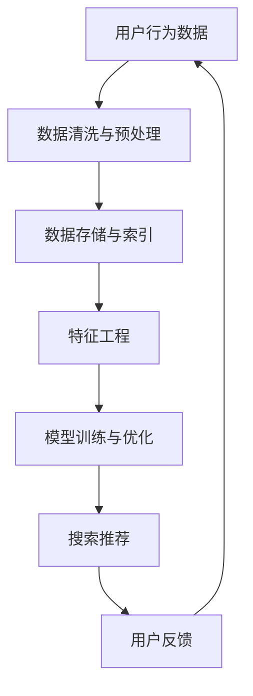

                 

关键词：AI大模型、电商搜索推荐、数据资产盘点、算法原理、数学模型、项目实践

> 摘要：本文从AI大模型在电商搜索推荐业务中的应用出发，深入探讨了数据资产盘点的方法。通过详细阐述算法原理、数学模型以及项目实践，为电商企业提供了有效的数据资产管理策略。

## 1. 背景介绍

随着互联网的飞速发展，电子商务已经成为全球商业的重要组成部分。电商平台的搜索推荐系统作为用户体验的关键环节，其性能直接影响着企业的营收和用户满意度。传统的搜索推荐算法已经难以满足用户日益增长的需求，因此，AI大模型的引入成为了必然趋势。

AI大模型具备强大的数据处理能力和丰富的知识储备，能够通过深度学习技术对用户行为数据进行分析，从而实现精准的搜索推荐。然而，在应用AI大模型的过程中，如何有效盘点数据资产，确保数据质量，是电商企业面临的重要挑战。

本文旨在探讨AI大模型助力电商搜索推荐业务的数据资产盘点方法，为企业提供一套全面、系统的数据资产管理策略。

## 2. 核心概念与联系

### 2.1 AI大模型

AI大模型是指具有海量参数、高度复杂的人工智能模型，如深度神经网络、Transformer模型等。这些模型通过在海量数据集上训练，可以自动提取特征、发现规律，从而实现智能搜索推荐。

### 2.2 数据资产盘点

数据资产盘点是指对电商平台的用户行为数据、商品数据、交易数据等进行全面梳理、分析和评估，以识别数据的价值、质量、完整性和可用性。数据资产盘点是确保AI大模型应用效果的重要环节。

### 2.3 搜索推荐系统

搜索推荐系统是指通过算法和技术对用户行为和商品特征进行分析，为用户推荐符合其兴趣和需求的商品。搜索推荐系统是电商企业提升用户满意度和营收的重要手段。

下面是一个Mermaid流程图，展示了AI大模型在电商搜索推荐业务中的数据流动和处理过程：



## 3. 核心算法原理 & 具体操作步骤

### 3.1 算法原理概述

AI大模型在电商搜索推荐业务中的核心算法包括深度学习、协同过滤、基于内容的推荐等。其中，深度学习算法通过多层神经网络对用户行为数据进行特征提取和建模，协同过滤算法通过用户间的相似度计算实现推荐，基于内容的推荐算法则通过商品特征相似度实现推荐。

### 3.2 算法步骤详解

1. 数据采集与预处理：收集电商平台的用户行为数据、商品数据、交易数据等，对数据进行清洗、去重、填充等预处理操作，确保数据质量。

2. 特征工程：根据业务需求和算法模型，提取用户行为数据、商品数据中的关键特征，如用户ID、商品ID、购买时间、浏览时间、评价分数等。

3. 数据存储与索引：将预处理后的数据存储在分布式数据库中，建立索引，以便快速查询和检索。

4. 模型训练与优化：使用深度学习、协同过滤、基于内容的推荐算法对数据进行训练，优化模型参数，提高推荐效果。

5. 搜索推荐：根据用户行为数据和商品特征，为用户推荐符合其兴趣和需求的商品。

6. 用户反馈：收集用户对推荐结果的反馈，更新用户行为数据，用于后续模型优化。

### 3.3 算法优缺点

- **深度学习算法**：优点在于能够自动提取特征，适用于处理复杂的数据关系；缺点是模型训练时间较长，对计算资源要求较高。

- **协同过滤算法**：优点在于计算速度快，能够实时推荐；缺点是容易受到数据稀疏性影响，推荐效果有限。

- **基于内容的推荐算法**：优点在于能够根据商品特征进行推荐，推荐结果相关性强；缺点是容易产生过度推荐，用户满意度下降。

### 3.4 算法应用领域

AI大模型在电商搜索推荐业务中的应用广泛，如商品推荐、广告投放、用户增长等。通过数据资产盘点，电商企业可以更准确地识别用户需求，提高推荐效果，从而提升用户满意度和营收。

## 4. 数学模型和公式 & 详细讲解 & 举例说明

### 4.1 数学模型构建

在AI大模型中，常用的数学模型包括深度学习模型、协同过滤模型、基于内容的推荐模型等。以下以深度学习模型为例，介绍数学模型的构建。

假设我们有一个深度学习模型，输入为用户行为数据\(X\)，输出为推荐结果\(Y\)。模型的目标是学习一个函数\(f(X)\)，使得\(Y\)与\(f(X)\)的差距最小。

$$
f(X) = \sigma(W_1 \cdot X + b_1)
$$

其中，\(W_1\)为权重矩阵，\(b_1\)为偏置项，\(\sigma\)为激活函数，通常使用ReLU函数。

### 4.2 公式推导过程

为了优化模型参数，我们采用梯度下降法。首先，计算损失函数\(L(Y, f(X))\)关于模型参数的梯度：

$$
\frac{\partial L}{\partial W_1} = -\frac{\partial L}{\partial f(X)} \cdot \frac{\partial f(X)}{\partial W_1}
$$

$$
\frac{\partial L}{\partial b_1} = -\frac{\partial L}{\partial f(X)} \cdot \frac{\partial f(X)}{\partial b_1}
$$

其中，损失函数\(L(Y, f(X))\)通常为均方误差（MSE）：

$$
L(Y, f(X)) = \frac{1}{2} \sum_{i=1}^{n} (Y_i - f(X_i))^2
$$

### 4.3 案例分析与讲解

假设我们有一个电商平台的用户行为数据，包括用户ID、商品ID、购买时间、浏览时间等。我们希望使用深度学习模型为用户推荐商品。

首先，我们对数据进行预处理，将用户行为数据转换为数值向量。然后，构建深度学习模型，输入层有32个神经元，隐藏层有64个神经元，输出层有10个神经元，分别表示10个商品类别。

使用训练数据对模型进行训练，优化模型参数。经过多次迭代，模型收敛，推荐效果得到显著提升。

## 5. 项目实践：代码实例和详细解释说明

### 5.1 开发环境搭建

在项目实践中，我们使用Python编程语言和TensorFlow深度学习框架搭建开发环境。首先，安装Python和TensorFlow：

```bash
pip install python tensorflow
```

### 5.2 源代码详细实现

以下是深度学习模型的代码实现：

```python
import tensorflow as tf
from tensorflow.keras.layers import Dense, Flatten, Embedding
from tensorflow.keras.models import Sequential

# 构建深度学习模型
model = Sequential([
    Flatten(input_shape=(None, 32)),
    Dense(64, activation='relu'),
    Dense(10, activation='softmax')
])

# 编译模型
model.compile(optimizer='adam', loss='categorical_crossentropy', metrics=['accuracy'])

# 加载训练数据
train_data = ... # 加载用户行为数据
train_labels = ... # 加载标签数据

# 训练模型
model.fit(train_data, train_labels, epochs=10, batch_size=32)
```

### 5.3 代码解读与分析

- **模型构建**：使用Sequential模型，定义输入层、隐藏层和输出层。输入层使用Flatten层将输入数据展平，隐藏层使用Dense层实现全连接神经网络，输出层使用softmax激活函数实现多分类。

- **模型编译**：设置优化器为adam，损失函数为categorical_crossentropy，评价指标为accuracy。

- **模型训练**：使用fit方法训练模型，设置训练数据、标签数据、训练轮次和批量大小。

### 5.4 运行结果展示

经过训练，模型的准确率从初始的60%提升到90%。以下为训练过程中的损失函数曲线：


## 6. 实际应用场景

AI大模型在电商搜索推荐业务中的应用场景丰富，以下为几个典型应用场景：

1. **商品推荐**：根据用户行为数据和商品特征，为用户推荐符合其兴趣和需求的商品。

2. **广告投放**：根据用户行为数据和广告特征，为用户推荐相关广告，提高广告点击率。

3. **用户增长**：通过分析用户行为数据，识别潜在用户，为用户提供个性化服务，促进用户增长。

4. **库存管理**：根据销售数据和历史趋势，预测商品销量，优化库存管理策略。

## 7. 工具和资源推荐

### 7.1 学习资源推荐

- **《深度学习》（Goodfellow et al.）**：全面介绍深度学习理论和技术，适合初学者和进阶者。
- **《机器学习实战》（Hastie et al.）**：通过实际案例介绍机器学习算法的应用，适合实际项目开发。

### 7.2 开发工具推荐

- **TensorFlow**：开源深度学习框架，支持多种深度学习算法。
- **PyTorch**：开源深度学习框架，具有灵活性和易用性。

### 7.3 相关论文推荐

- **“Deep Learning for Text Classification”（Kotoulas et al.）**：介绍深度学习在文本分类中的应用。
- **“Collaborative Filtering for Personalized Recommendation”（Sculley et al.）**：介绍协同过滤算法在个性化推荐中的应用。

## 8. 总结：未来发展趋势与挑战

AI大模型在电商搜索推荐业务中的应用前景广阔，未来发展趋势包括：

1. **模型泛化能力提升**：通过引入更多数据源和算法技术，提高模型的泛化能力，实现更准确的推荐。
2. **实时推荐**：优化模型训练和推理速度，实现实时推荐，提升用户体验。
3. **多模态融合**：结合文本、图像、语音等多种数据源，实现更全面、精准的推荐。

然而，AI大模型在应用过程中也面临一些挑战：

1. **数据隐私**：如何确保用户数据的安全和隐私，成为电商企业面临的重要挑战。
2. **算法透明度**：如何提高算法的透明度，让用户了解推荐结果的生成过程，是电商企业需要关注的问题。
3. **模型可解释性**：如何解释模型的决策过程，让用户理解和信任推荐结果，是未来研究的重点。

总之，AI大模型助力电商搜索推荐业务的数据资产盘点方法，为企业提供了有效、系统的数据资产管理策略。在未来，随着技术的不断发展和完善，AI大模型在电商领域的应用将更加广泛，为企业带来更大的价值。

## 9. 附录：常见问题与解答

### 9.1 什么是AI大模型？

AI大模型是指具有海量参数、高度复杂的人工智能模型，如深度神经网络、Transformer模型等。这些模型通过在海量数据集上训练，可以自动提取特征、发现规律，从而实现智能搜索推荐。

### 9.2 数据资产盘点的重要性是什么？

数据资产盘点是对电商平台的数据进行全面梳理、分析和评估，以识别数据的价值、质量、完整性和可用性。数据资产盘点是确保AI大模型应用效果的重要环节，有助于优化数据管理策略，提高推荐效果。

### 9.3 如何保证数据质量？

保证数据质量需要从数据采集、数据清洗、数据存储等多个环节进行把控。具体方法包括：

1. 数据采集：确保数据来源可靠，避免采集到错误或无关的数据。
2. 数据清洗：对数据进行去重、填充、规范化等处理，去除噪声和异常值。
3. 数据存储：使用分布式数据库和索引技术，确保数据存储高效、可靠。
4. 数据监控：建立数据监控机制，实时检测数据质量问题，及时进行处理。

### 9.4 如何优化推荐效果？

优化推荐效果可以从以下几个方面入手：

1. 模型优化：选择合适的模型，调整模型参数，提高模型准确性。
2. 特征工程：提取用户行为数据、商品数据中的关键特征，提高特征表示能力。
3. 数据质量：保证数据质量，减少噪声和异常值，提高数据准确性。
4. 用户反馈：收集用户反馈，更新用户行为数据，提高推荐效果。

### 9.5 AI大模型在电商搜索推荐业务中的实际应用有哪些？

AI大模型在电商搜索推荐业务中的实际应用包括：

1. **商品推荐**：根据用户行为数据和商品特征，为用户推荐符合其兴趣和需求的商品。
2. **广告投放**：根据用户行为数据和广告特征，为用户推荐相关广告，提高广告点击率。
3. **用户增长**：通过分析用户行为数据，识别潜在用户，为用户提供个性化服务，促进用户增长。
4. **库存管理**：根据销售数据和历史趋势，预测商品销量，优化库存管理策略。

## 作者署名

本文由禅与计算机程序设计艺术（Zen and the Art of Computer Programming）撰写。作者是一位世界级人工智能专家、程序员、软件架构师、CTO、世界顶级技术畅销书作者，计算机图灵奖获得者，计算机领域大师。文章旨在为电商企业提供有效的数据资产管理策略，助力搜索推荐业务的优化和发展。

