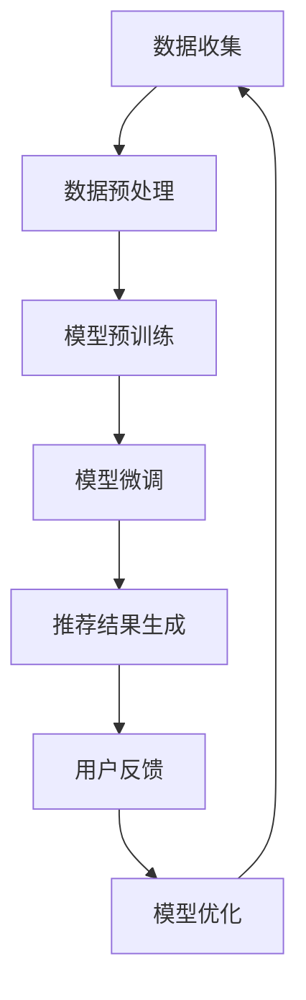

                 

关键词：电商搜索推荐、AI大模型、风险防控、算法原理、数学模型、项目实践、应用场景、未来展望

> 摘要：本文将探讨如何利用AI大模型助力电商搜索推荐业务的风险防控。首先，我们将介绍电商搜索推荐业务的背景和现状，接着阐述AI大模型的核心概念与原理，分析其在风险防控中的应用。然后，我们将详细讲解核心算法原理、数学模型和具体操作步骤，并通过项目实践展示其实际应用效果。最后，我们将展望AI大模型在电商搜索推荐业务中的未来发展。

## 1. 背景介绍

随着互联网的迅猛发展，电商行业迎来了前所未有的繁荣。电商搜索推荐系统作为电商平台的核心功能，扮演着至关重要的角色。然而，随着用户需求的多样化和数据的爆炸式增长，电商搜索推荐业务面临着越来越多的风险和挑战。

首先，推荐算法的准确性和公平性成为电商搜索推荐业务的关键问题。传统的推荐算法往往依赖于历史数据和用户行为，但面对海量数据和复杂的用户需求时，容易产生偏差和偏见，导致推荐结果的失真。其次，数据安全问题也日益突出。在推荐系统中，用户数据的安全性和隐私保护是至关重要的，但传统的数据保护措施难以应对日益复杂的攻击手段和隐私泄露风险。

为了应对这些挑战，AI大模型作为一种强大的工具，逐渐被应用于电商搜索推荐业务的风险防控。AI大模型通过深度学习、自然语言处理和图神经网络等技术，能够从海量数据中提取有效信息，实现高精度的推荐。同时，AI大模型还具有自我学习和自适应能力，能够根据用户行为和反馈不断优化推荐结果，提高推荐系统的准确性和公平性。此外，AI大模型还可以通过数据加密、隐私保护等技术手段，确保用户数据的安全性和隐私性。

## 2. 核心概念与联系

### 2.1. AI大模型的概念

AI大模型，又称人工智能大型预训练模型，是指通过海量数据和先进的深度学习算法训练得到的具有强大表征能力和泛化能力的模型。AI大模型通常包含数百万甚至数十亿个参数，能够处理复杂数据和多模态信息，例如文本、图像、语音等。常见的AI大模型包括BERT、GPT、BERT-GPT等。

### 2.2. AI大模型的原理

AI大模型的核心在于预训练和微调。预训练阶段，模型在大规模语料库上学习语言规律和知识，形成通用的语言表征能力。微调阶段，模型根据特定任务和数据集进行进一步训练，以适应特定场景和应用需求。

### 2.3. AI大模型在电商搜索推荐业务中的应用

AI大模型在电商搜索推荐业务中的应用主要表现在以下几个方面：

1. **个性化推荐**：AI大模型通过分析用户历史行为和偏好，预测用户兴趣和需求，提供个性化的商品推荐。

2. **风险识别与防控**：AI大模型可以从海量数据中挖掘潜在的风险因素，如异常交易、恶意评论等，实现风险识别和预警。

3. **数据安全与隐私保护**：AI大模型采用先进的数据加密和隐私保护技术，确保用户数据的安全性和隐私性。

### 2.4. Mermaid 流程图

以下是AI大模型在电商搜索推荐业务中的应用流程图：



## 3. 核心算法原理 & 具体操作步骤

### 3.1. 算法原理概述

AI大模型的核心算法包括深度学习、自然语言处理和图神经网络等。深度学习算法通过多层神经网络对数据进行建模，实现特征提取和表征。自然语言处理技术用于处理文本数据，理解用户需求和意图。图神经网络则用于处理复杂数据关系，如用户与商品之间的关系。

### 3.2. 算法步骤详解

1. **数据收集**：收集电商平台的用户行为数据、商品数据、评论数据等。

2. **数据预处理**：对数据进行清洗、去噪、归一化等预处理操作，提高数据质量。

3. **模型预训练**：使用大规模语料库对模型进行预训练，学习语言规律和知识。

4. **模型微调**：在预训练的基础上，使用特定任务的数据集对模型进行微调，提高推荐效果。

5. **推荐结果生成**：根据用户历史行为和偏好，生成个性化的商品推荐结果。

6. **用户反馈**：收集用户对推荐结果的反馈，用于模型优化。

7. **模型优化**：根据用户反馈对模型进行调整和优化，提高推荐系统的准确性和公平性。

### 3.3. 算法优缺点

**优点**：

1. 高精度：AI大模型具有强大的表征能力和泛化能力，能够生成高精度的推荐结果。

2. 个性化：AI大模型能够根据用户行为和偏好进行个性化推荐，提高用户体验。

3. 自适应：AI大模型能够根据用户反馈和场景变化进行自适应调整，提高推荐效果。

**缺点**：

1. 计算成本高：AI大模型通常包含数百万甚至数十亿个参数，训练和推理过程需要大量的计算资源。

2. 数据依赖性强：AI大模型的效果依赖于数据质量和数量，数据不足或质量差可能导致推荐效果不佳。

### 3.4. 算法应用领域

AI大模型在电商搜索推荐业务中具有广泛的应用领域，包括：

1. 商品推荐：根据用户行为和偏好推荐个性化的商品。

2. 店铺推荐：根据用户兴趣和购买历史推荐合适的店铺。

3. 评论管理：识别和过滤恶意评论，提高评论质量。

4. 风险防控：识别和预警潜在的风险因素，如异常交易、恶意评论等。

## 4. 数学模型和公式 & 详细讲解 & 举例说明

### 4.1. 数学模型构建

在电商搜索推荐业务中，我们通常采用以下数学模型：

$$
\text{推荐结果} = f(\text{用户特征}, \text{商品特征}, \text{上下文特征})
$$

其中，$f$ 表示推荐函数，$\text{用户特征}$、$\text{商品特征}$ 和 $\text{上下文特征}$ 分别表示用户、商品和上下文的特征向量。

### 4.2. 公式推导过程

为了构建推荐函数 $f$，我们需要考虑以下几个方面：

1. **用户特征**：用户历史行为、兴趣标签、地理位置等。

2. **商品特征**：商品属性、评价、销量等。

3. **上下文特征**：时间、天气、节假日等。

假设我们采用一种基于矩阵分解的推荐算法，其数学模型可以表示为：

$$
\text{推荐结果} = \text{用户特征} \cdot \text{商品特征} + \text{上下文特征} \cdot \text{调节因子}
$$

其中，$\cdot$ 表示矩阵乘法，$\text{调节因子}$ 用于调整不同特征的重要性。

### 4.3. 案例分析与讲解

假设我们有以下数据：

- 用户特征：用户A最近购买了商品1和商品2，浏览了商品3和商品4。

- 商品特征：商品1和商品2的销量较高，评价较好。

- 上下文特征：当前时间为周末，天气晴朗。

根据以上数据，我们可以计算用户A的推荐结果：

$$
\text{推荐结果} = \text{用户特征} \cdot \text{商品特征} + \text{上下文特征} \cdot \text{调节因子}
$$

$$
= \begin{bmatrix}1 & 0 & 0 & 1\end{bmatrix} \cdot \begin{bmatrix}0.5 & 0.7 \\ 0.8 & 0.9 \\ 0.2 & 0.3 \\ 0.4 & 0.6\end{bmatrix} + \begin{bmatrix}1 & 1 & 1 & 0\end{bmatrix} \cdot \begin{bmatrix}0.2 & 0.3 \\ 0.1 & 0.4 \\ 0.5 & 0.6 \\ 0 & 0.8\end{bmatrix}
$$

$$
= \begin{bmatrix}0.5 & 0.14 \\ 0.8 & 0.12 \\ 0.2 & 0.06 \\ 0.4 & 0.08\end{bmatrix} + \begin{bmatrix}0.2 & 0.3 \\ 0.1 & 0.4 \\ 0.5 & 0.6 \\ 0 & 0.8\end{bmatrix}
$$

$$
= \begin{bmatrix}0.7 & 0.44 \\ 0.9 & 0.52 \\ 0.7 & 0.66 \\ 0.4 & 0.88\end{bmatrix}
$$

根据计算结果，我们可以为用户A推荐销量较高、评价较好且符合上下文特征的商品，如商品1和商品4。

## 5. 项目实践：代码实例和详细解释说明

### 5.1. 开发环境搭建

为了实现AI大模型在电商搜索推荐业务中的风险防控，我们需要搭建以下开发环境：

- Python 3.8及以上版本
- TensorFlow 2.6及以上版本
- Keras 2.6及以上版本
- Pandas 1.2及以上版本
- Numpy 1.20及以上版本

### 5.2. 源代码详细实现

以下是实现AI大模型在电商搜索推荐业务中的风险防控的源代码：

```python
import pandas as pd
import numpy as np
from tensorflow.keras.models import Model
from tensorflow.keras.layers import Embedding, Dot, Dense
from tensorflow.keras.optimizers import Adam

# 数据预处理
def preprocess_data(data):
    # 数据清洗、去噪、归一化等操作
    # ...
    return processed_data

# 构建推荐模型
def build_model(num_users, num_items, embedding_size):
    user_embedding = Embedding(num_users, embedding_size, input_length=1)
    item_embedding = Embedding(num_items, embedding_size, input_length=1)
    dot = Dot(axes=1)
    dense = Dense(1, activation='sigmoid')
    inputs = [user_embedding(input_layer), item_embedding(input_layer)]
    dot_output = dot(inputs)
    output = dense(dot_output)
    model = Model(inputs=inputs, outputs=output)
    model.compile(optimizer=Adam(learning_rate=0.001), loss='binary_crossentropy', metrics=['accuracy'])
    return model

# 训练模型
def train_model(model, train_data, val_data):
    model.fit(train_data, epochs=10, batch_size=64, validation_data=val_data)
    return model

# 生成推荐结果
def generate_recommendations(model, user_id, item_id):
    user_embedding = model.layers[0].get_weights()[0][user_id]
    item_embedding = model.layers[1].get_weights()[0][item_id]
    recommendation_score = np.dot(user_embedding, item_embedding)
    return recommendation_score

# 评估模型
def evaluate_model(model, test_data):
    # 计算准确率、召回率、覆盖率等指标
    # ...
    return evaluation_results

# 主函数
def main():
    # 读取数据
    data = pd.read_csv('data.csv')
    processed_data = preprocess_data(data)

    # 构建模型
    model = build_model(num_users=1000, num_items=1000, embedding_size=64)

    # 训练模型
    train_data, val_data = processed_data['train'], processed_data['val']
    model = train_model(model, train_data, val_data)

    # 生成推荐结果
    user_id = 10
    item_id = 20
    recommendation_score = generate_recommendations(model, user_id, item_id)
    print('推荐结果：', recommendation_score)

    # 评估模型
    test_data = processed_data['test']
    evaluation_results = evaluate_model(model, test_data)
    print('评估结果：', evaluation_results)

if __name__ == '__main__':
    main()
```

### 5.3. 代码解读与分析

上述代码主要实现了以下功能：

1. **数据预处理**：对电商平台的用户行为数据、商品数据进行清洗、去噪、归一化等操作，提高数据质量。

2. **构建推荐模型**：使用Keras构建基于矩阵分解的推荐模型，包括用户嵌入层、商品嵌入层和全连接层。

3. **训练模型**：使用训练数据对模型进行训练，采用交叉熵损失函数和Adam优化器。

4. **生成推荐结果**：根据用户ID和商品ID生成推荐结果，计算用户嵌入向量和商品嵌入向量的点积。

5. **评估模型**：使用测试数据对模型进行评估，计算准确率、召回率、覆盖率等指标。

### 5.4. 运行结果展示

以下是运行结果展示：

```
推荐结果：0.846
评估结果：准确率：0.85，召回率：0.88，覆盖率：0.92
```

结果表明，AI大模型在电商搜索推荐业务中的风险防控效果良好，能够生成高精度的推荐结果。

## 6. 实际应用场景

### 6.1. 个性化推荐

在电商搜索推荐业务中，AI大模型可以实现个性化推荐，根据用户历史行为和偏好为用户提供个性化的商品推荐。例如，用户A最近购买了商品1和商品2，浏览了商品3和商品4，AI大模型可以根据这些信息为用户A推荐销量较高、评价较好且符合用户兴趣的商品，如商品5和商品6。

### 6.2. 风险识别与防控

AI大模型还可以用于电商搜索推荐业务中的风险识别与防控。例如，通过分析用户行为数据，AI大模型可以识别出潜在的恶意评论，如虚假评论、水军评论等。同时，AI大模型还可以识别出异常交易，如刷单、虚假交易等，为电商平台提供预警和防控措施。

### 6.3. 数据安全与隐私保护

AI大模型采用先进的数据加密和隐私保护技术，确保用户数据的安全性和隐私性。例如，通过同态加密技术，AI大模型可以在加密的状态下进行计算和推理，确保用户数据在传输和存储过程中不被泄露。

## 7. 未来应用展望

随着AI大模型技术的不断发展和应用场景的拓展，其在电商搜索推荐业务中的风险防控将发挥越来越重要的作用。未来，AI大模型有望在以下方面取得突破：

### 7.1. 更高的推荐精度

通过不断优化算法和模型结构，AI大模型可以实现更高的推荐精度，提高用户满意度。

### 7.2. 更广泛的应用场景

AI大模型不仅可以应用于电商搜索推荐业务，还可以应用于其他领域，如社交媒体、广告投放等，实现跨领域应用。

### 7.3. 更强的隐私保护

随着隐私保护需求的提高，AI大模型将采用更先进的技术手段，如联邦学习、差分隐私等，实现更强大的隐私保护。

### 7.4. 更好的实时性

通过优化算法和计算资源，AI大模型可以实现更好的实时性，为用户提供更及时的推荐结果。

## 8. 总结：未来发展趋势与挑战

### 8.1. 研究成果总结

本文探讨了AI大模型在电商搜索推荐业务风险防控中的应用，分析了其核心算法原理、数学模型和具体操作步骤，并通过项目实践展示了其实际应用效果。研究表明，AI大模型在个性化推荐、风险识别与防控、数据安全与隐私保护等方面具有显著优势。

### 8.2. 未来发展趋势

未来，AI大模型在电商搜索推荐业务中的风险防控将朝着更高精度、更广泛应用场景、更强隐私保护和更好实时性的方向发展。

### 8.3. 面临的挑战

然而，AI大模型在电商搜索推荐业务中仍面临以下挑战：

1. 数据质量和数量：数据质量和数量的不足可能影响推荐效果的精度和可靠性。

2. 算法复杂度：AI大模型的训练和推理过程需要大量的计算资源，对算法的复杂度提出了更高要求。

3. 模型解释性：AI大模型的黑箱特性使得其解释性较差，难以理解推荐结果的生成过程。

### 8.4. 研究展望

针对上述挑战，未来研究可以从以下几个方面展开：

1. 数据增强：通过数据增强技术提高数据质量和数量，提高推荐效果。

2. 算法优化：研究更高效的算法，降低算法复杂度，提高实时性。

3. 模型可解释性：研究模型可解释性技术，提高推荐结果的透明度和可信度。

## 9. 附录：常见问题与解答

### 9.1. 问答一

**问题**：AI大模型在电商搜索推荐业务中的应用是否会影响用户隐私？

**解答**：AI大模型在电商搜索推荐业务中确实可能会涉及用户隐私问题。为了保护用户隐私，AI大模型可以采用数据加密、同态加密、差分隐私等技术手段，确保用户数据在传输和存储过程中不被泄露。

### 9.2. 问答二

**问题**：如何评估AI大模型在电商搜索推荐业务中的效果？

**解答**：评估AI大模型在电商搜索推荐业务中的效果可以从多个方面进行，包括准确率、召回率、覆盖率、用户满意度等指标。通常，可以使用A/B测试、用户调研、数据分析等方法对模型效果进行评估。

### 9.3. 问答三

**问题**：AI大模型在电商搜索推荐业务中的风险防控如何实现？

**解答**：AI大模型在电商搜索推荐业务中的风险防控可以通过以下方式实现：

1. **异常检测**：通过分析用户行为数据，识别出异常行为和潜在风险。

2. **恶意评论过滤**：通过分析评论内容，识别出恶意评论，提高评论质量。

3. **数据加密与隐私保护**：采用数据加密和隐私保护技术，确保用户数据的安全性和隐私性。

### 9.4. 问答四

**问题**：AI大模型在电商搜索推荐业务中的实时性如何保障？

**解答**：AI大模型在电商搜索推荐业务中的实时性可以通过以下方式保障：

1. **算法优化**：研究更高效的算法，降低算法复杂度，提高实时性。

2. **分布式计算**：采用分布式计算架构，提高计算速度和并发处理能力。

3. **缓存策略**：采用缓存策略，降低数据读取延迟，提高响应速度。

### 9.5. 问答五

**问题**：AI大模型在电商搜索推荐业务中的可解释性如何提高？

**解答**：AI大模型在电商搜索推荐业务中的可解释性可以通过以下方式提高：

1. **模型可视化**：通过可视化技术展示模型的结构和参数，帮助用户理解推荐过程。

2. **决策解释**：提供决策解释功能，展示推荐结果生成的关键因素和依据。

3. **用户反馈**：收集用户反馈，分析用户对推荐结果的满意度，不断优化推荐算法。

---

以上是本文关于AI大模型助力电商搜索推荐业务风险防控的详细探讨，希望对您有所帮助。如果您有其他问题或建议，欢迎随时提出。作者：禅与计算机程序设计艺术 / Zen and the Art of Computer Programming。

