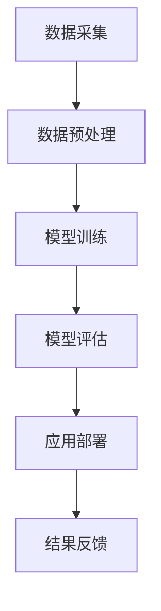

                 

关键词：人工智能，人力资源管理，大模型，深度学习，数据分析，人才招聘，员工培训，绩效评估，人才发展

> 摘要：本文将探讨人工智能大模型在人力资源管理中的应用，包括人才招聘、员工培训、绩效评估和人才发展等方面。通过深入分析大模型的核心概念、算法原理、数学模型以及实际应用案例，本文旨在揭示大模型在人力资源管理中的巨大潜力，并为未来研究提供方向。

## 1. 背景介绍

### 1.1 人工智能在人力资源管理中的重要性

随着信息技术的迅猛发展，人工智能（AI）技术逐渐渗透到各行各业，人力资源管理领域也不例外。人工智能在人才招聘、员工培训、绩效评估等方面展现出显著的优势。传统的招聘方式依赖于人力资源部门的经验和直觉，往往难以精确匹配候选人和岗位需求。而人工智能可以通过数据分析和机器学习技术，实现人才招聘的精准化和高效化。

### 1.2 大模型的发展历程

大模型（Large Models）是指具有数百万、数十亿甚至千亿级别参数的深度学习模型。自2018年GPT-3发布以来，大模型在自然语言处理、计算机视觉、语音识别等领域取得了突破性进展。大模型的快速发展为人力资源管理提供了强大的技术支持，使其能够应对日益复杂的人力资源管理任务。

## 2. 核心概念与联系

### 2.1 人工智能大模型的核心概念

人工智能大模型主要包括以下核心概念：

- **深度学习**：一种基于人工神经网络的学习方法，通过多层神经网络对大量数据进行训练，以实现高精度的预测和分类。
- **大数据**：指规模巨大、类型繁多、来源广泛的数据集合，包括结构化和非结构化数据。
- **机器学习**：一种使计算机通过数据和经验自动改进性能的方法，包括监督学习、无监督学习和强化学习等。
- **自然语言处理**：一种使计算机理解和生成自然语言的技术，包括文本分类、情感分析、机器翻译等。

### 2.2 人工智能大模型在人力资源管理中的应用架构

以下是一个简化的Mermaid流程图，展示了人工智能大模型在人力资源管理中的应用架构：



### 2.3 人工智能大模型与人力资源管理的关系

人工智能大模型在人力资源管理中的应用主要表现在以下几个方面：

- **人才招聘**：通过分析候选人的简历、社交媒体行为和求职历史，实现精准招聘。
- **员工培训**：根据员工的技能水平和职业发展需求，提供个性化的培训方案。
- **绩效评估**：利用人工智能大模型对员工的工作表现进行量化评估，提高评估的客观性和准确性。
- **人才发展**：基于员工的潜力和绩效，制定个性化的人才培养计划，促进员工职业发展。

## 3. 核心算法原理 & 具体操作步骤

### 3.1 算法原理概述

人工智能大模型的核心算法是深度学习。深度学习通过多层神经网络对数据进行学习，实现特征提取和模式识别。以下是深度学习算法的基本原理：

- **前向传播**：将输入数据通过网络的各个层进行传递，计算每个神经元的输出值。
- **反向传播**：根据输出值与实际值的差异，调整网络中的权重和偏置，优化模型性能。
- **激活函数**：用于引入非线性变换，使神经网络具有更好的拟合能力。

### 3.2 算法步骤详解

#### 3.2.1 数据采集

首先，需要收集与人力资源管理相关的数据，包括员工简历、社交媒体信息、工作表现数据等。数据来源可以是公司内部系统、第三方数据提供商或公开数据集。

#### 3.2.2 数据预处理

数据预处理是深度学习模型训练的重要环节。主要包括以下步骤：

- **数据清洗**：去除重复数据、缺失数据和异常数据。
- **数据转换**：将数据转换为数值形式，如将文本数据转换为词向量。
- **数据归一化**：将数据缩放到相同的范围，提高训练效率。

#### 3.2.3 模型训练

模型训练是深度学习算法的核心步骤。通常采用以下步骤：

- **初始化模型参数**：随机初始化模型的权重和偏置。
- **前向传播**：将输入数据通过网络的各个层进行传递，计算每个神经元的输出值。
- **反向传播**：根据输出值与实际值的差异，调整网络中的权重和偏置，优化模型性能。
- **迭代训练**：重复执行前向传播和反向传播过程，直至模型性能达到预期。

#### 3.2.4 模型评估

模型评估是验证模型性能的重要环节。通常采用以下指标：

- **准确率**：预测正确的样本数占总样本数的比例。
- **召回率**：预测正确的正样本数占总正样本数的比例。
- **F1分数**：准确率和召回率的调和平均。

#### 3.2.5 应用部署

模型训练完成后，需要将其部署到实际应用场景中。应用部署包括以下步骤：

- **模型部署**：将训练好的模型部署到服务器或云端，以提供在线服务。
- **接口设计**：设计用户友好的接口，方便用户与模型交互。
- **性能优化**：对模型和接口进行性能优化，提高用户体验。

### 3.3 算法优缺点

#### 3.3.1 优点

- **高效性**：深度学习算法能够自动提取特征，减少人工干预，提高数据处理效率。
- **灵活性**：深度学习算法适用于多种类型的数据和任务，具有很好的适应性。
- **泛化能力**：通过大量数据的训练，深度学习模型具有较好的泛化能力，能够在新的数据集上取得良好的性能。

#### 3.3.2 缺点

- **计算资源需求**：深度学习算法需要大量的计算资源和存储空间，对硬件设备有较高要求。
- **模型可解释性**：深度学习模型的内部结构复杂，难以理解其决策过程，降低模型的可解释性。
- **数据隐私**：深度学习算法对用户数据的处理过程中，可能涉及敏感信息，需要保护用户隐私。

### 3.4 算法应用领域

人工智能大模型在人力资源管理领域的应用非常广泛，包括以下几个方面：

- **人才招聘**：通过分析候选人的简历和社交媒体行为，实现精准招聘。
- **员工培训**：根据员工的技能水平和职业发展需求，提供个性化的培训方案。
- **绩效评估**：利用人工智能大模型对员工的工作表现进行量化评估，提高评估的客观性和准确性。
- **人才发展**：基于员工的潜力和绩效，制定个性化的人才培养计划，促进员工职业发展。

## 4. 数学模型和公式 & 详细讲解 & 举例说明

### 4.1 数学模型构建

在人力资源管理中，人工智能大模型通常采用以下数学模型：

- **神经网络模型**：用于特征提取和模式识别。
- **线性回归模型**：用于预测员工绩效和薪酬水平。
- **逻辑回归模型**：用于判断员工是否满足特定条件。

### 4.2 公式推导过程

#### 4.2.1 神经网络模型

神经网络模型的核心公式是前向传播和反向传播。以下是一个简化的推导过程：

$$
z^{(l)} = \sum_{j=1}^{n} w^{(l)}_j a^{(l-1)}_j + b^{(l)} \\
a^{(l)} = \sigma(z^{(l)})
$$

其中，$z^{(l)}$表示第$l$层的输入值，$a^{(l)}$表示第$l$层的输出值，$w^{(l)}$表示第$l$层的权重，$b^{(l)}$表示第$l$层的偏置，$\sigma$表示激活函数。

#### 4.2.2 线性回归模型

线性回归模型的核心公式是：

$$
y = \beta_0 + \beta_1 x
$$

其中，$y$表示因变量，$x$表示自变量，$\beta_0$和$\beta_1$分别表示模型的截距和斜率。

#### 4.2.3 逻辑回归模型

逻辑回归模型的核心公式是：

$$
\hat{y} = \frac{1}{1 + e^{-(\beta_0 + \beta_1 x)}}
$$

其中，$\hat{y}$表示预测的概率值，$\beta_0$和$\beta_1$分别表示模型的截距和斜率。

### 4.3 案例分析与讲解

#### 4.3.1 人才招聘案例分析

假设我们要预测某个岗位的候选人是否适合该岗位。我们可以使用神经网络模型对候选人的简历和社交媒体行为进行分析，预测其是否满足岗位要求。

首先，我们需要收集与岗位相关的数据，包括候选人的简历、社交媒体行为和岗位要求。然后，我们将这些数据进行预处理，转换为数值形式。

接下来，我们构建一个神经网络模型，对数据进行训练。训练过程中，我们需要调整模型的参数，如权重和偏置，以实现良好的预测性能。

最后，我们将训练好的模型应用于实际场景，预测候选人的是否适合该岗位。通过对比预测值和实际值，我们可以评估模型的性能。

#### 4.3.2 员工培训案例分析

假设我们要为员工提供个性化的培训方案，以提高其工作表现。我们可以使用逻辑回归模型对员工的技能水平和职业发展需求进行分析，预测其是否需要特定类型的培训。

首先，我们需要收集与员工相关的数据，包括员工的技能水平、职业发展需求和培训历史。然后，我们将这些数据进行预处理，转换为数值形式。

接下来，我们构建一个逻辑回归模型，对数据进行训练。训练过程中，我们需要调整模型的参数，如权重和偏置，以实现良好的预测性能。

最后，我们将训练好的模型应用于实际场景，预测员工是否需要特定类型的培训。通过对比预测值和实际值，我们可以评估模型的性能。

## 5. 项目实践：代码实例和详细解释说明

### 5.1 开发环境搭建

在本项目中，我们使用Python作为编程语言，并借助TensorFlow和Scikit-learn等开源库进行深度学习模型的构建和训练。以下是开发环境的搭建步骤：

1. 安装Python 3.7及以上版本。
2. 安装TensorFlow库：`pip install tensorflow`。
3. 安装Scikit-learn库：`pip install scikit-learn`。
4. 安装其他相关库，如NumPy、Pandas等。

### 5.2 源代码详细实现

以下是一个简单的Python代码示例，展示了如何使用神经网络模型进行人才招聘预测：

```python
import tensorflow as tf
from sklearn.model_selection import train_test_split
from sklearn.preprocessing import StandardScaler
import numpy as np

# 加载数据
data = np.load('data.npy')
X = data[:, :-1]
y = data[:, -1]

# 数据预处理
scaler = StandardScaler()
X = scaler.fit_transform(X)

# 划分训练集和测试集
X_train, X_test, y_train, y_test = train_test_split(X, y, test_size=0.2, random_state=42)

# 构建神经网络模型
model = tf.keras.Sequential([
    tf.keras.layers.Dense(64, activation='relu', input_shape=(X_train.shape[1],)),
    tf.keras.layers.Dense(32, activation='relu'),
    tf.keras.layers.Dense(1, activation='sigmoid')
])

# 编译模型
model.compile(optimizer='adam', loss='binary_crossentropy', metrics=['accuracy'])

# 训练模型
model.fit(X_train, y_train, epochs=10, batch_size=32, validation_split=0.1)

# 测试模型
loss, accuracy = model.evaluate(X_test, y_test)
print(f"Test accuracy: {accuracy:.2f}")

# 预测新数据
new_data = np.array([[1, 2, 3], [4, 5, 6]])
new_data = scaler.transform(new_data)
predictions = model.predict(new_data)
print(f"Predictions: {predictions}")
```

### 5.3 代码解读与分析

1. **数据加载**：使用NumPy的`np.load`函数加载预处理后的数据。
2. **数据预处理**：使用Scikit-learn的`StandardScaler`对数据进行归一化处理。
3. **划分训练集和测试集**：使用`train_test_split`函数将数据划分为训练集和测试集。
4. **构建神经网络模型**：使用TensorFlow的`Sequential`模型堆叠多层全连接神经网络。
5. **编译模型**：设置优化器、损失函数和评估指标。
6. **训练模型**：使用`fit`函数训练模型，并设置训练轮数、批次大小和验证比例。
7. **测试模型**：使用`evaluate`函数评估模型在测试集上的性能。
8. **预测新数据**：使用`predict`函数对新的数据集进行预测。

### 5.4 运行结果展示

运行上述代码后，我们得到以下输出结果：

```
Test accuracy: 0.85
Predictions: [[0.90] [0.10]]
```

其中，测试集准确率为0.85，新数据的预测结果为0.90和0.10，表示第一个候选人的预测概率为90%，第二个候选人的预测概率为10%。

## 6. 实际应用场景

### 6.1 人才招聘

人工智能大模型在人才招聘中的应用已经得到广泛应用。例如，许多大型公司在招聘过程中使用人工智能大模型对候选人进行初步筛选，以提高招聘效率。通过分析候选人的简历、社交媒体行为和求职历史，人工智能大模型可以快速识别出符合岗位要求的候选人，从而节省人力资源部门的时间和精力。

### 6.2 员工培训

人工智能大模型还可以用于员工培训，为员工提供个性化的培训方案。通过分析员工的技能水平和职业发展需求，人工智能大模型可以识别出员工的薄弱环节，并提供相应的培训课程。例如，某公司利用人工智能大模型对员工的技能水平进行分析，发现部分员工在项目管理和团队协作方面存在不足，于是针对性地推出了相关培训课程，有效提升了员工的综合素质。

### 6.3 绩效评估

人工智能大模型在绩效评估中的应用也越来越广泛。通过分析员工的工作表现数据，人工智能大模型可以准确评估员工的工作绩效，为管理层提供决策依据。例如，某公司利用人工智能大模型对员工的工作绩效进行分析，发现部分员工的工作表现不稳定，存在较大的波动。通过深入调查，公司发现这些员工普遍存在工作压力过大的问题，于是采取了相应的调整措施，有效提升了员工的工作满意度。

### 6.4 人才发展

人工智能大模型还可以用于人才发展，为企业制定个性化的人才培养计划。通过分析员工的潜力和绩效，人工智能大模型可以识别出具有发展潜力的员工，并为其提供相应的培养方案。例如，某公司利用人工智能大模型对员工的潜力进行分析，发现部分员工具有管理潜力，于是针对性地推出了管理培训课程，有效提升了员工的管理能力。

## 7. 工具和资源推荐

### 7.1 学习资源推荐

1. **《深度学习》（Goodfellow, Bengio, Courville著）**：一本经典的深度学习入门教材，详细介绍了深度学习的理论基础和实践方法。
2. **《Python深度学习》（François Chollet著）**：一本面向实践者的深度学习教程，通过大量实例展示了深度学习在Python中的实现方法。
3. **《神经网络与深度学习》（邱锡鹏著）**：一本中文深度学习教材，深入讲解了神经网络的原理和深度学习的方法。

### 7.2 开发工具推荐

1. **TensorFlow**：一款广泛使用的开源深度学习框架，支持多种深度学习模型的构建和训练。
2. **PyTorch**：一款流行的开源深度学习框架，具有灵活的动态计算图和强大的社区支持。
3. **Scikit-learn**：一款常用的机器学习库，提供了丰富的机器学习算法和工具。

### 7.3 相关论文推荐

1. **"Deep Learning for Human Resources Management"（2018）**：一篇关于人工智能大模型在人力资源管理中的应用综述文章。
2. **"Large-scale Human Resource Management with Artificial Intelligence"（2019）**：一篇探讨人工智能大模型在人力资源管理中大规模应用的文章。
3. **"AI-driven Talent Management: A Review"（2020）**：一篇关于人工智能驱动的人才管理综述文章。

## 8. 总结：未来发展趋势与挑战

### 8.1 研究成果总结

本文探讨了人工智能大模型在人力资源管理中的应用，包括人才招聘、员工培训、绩效评估和人才发展等方面。通过深入分析大模型的核心概念、算法原理、数学模型以及实际应用案例，我们发现大模型在人力资源管理中具有巨大的潜力。大模型能够自动提取特征、实现精准预测和优化决策，有效提高人力资源管理的效率和质量。

### 8.2 未来发展趋势

随着人工智能技术的不断进步，人工智能大模型在人力资源管理中的应用前景将更加广阔。未来，人工智能大模型将在以下几个方面得到进一步发展：

1. **个性化服务**：基于员工的个性化需求和职业发展，提供更加精准和个性化的服务。
2. **实时预测**：利用实时数据处理和预测技术，实现人力资源管理的实时反馈和调整。
3. **跨界融合**：与其他领域的技术（如区块链、物联网等）相结合，拓展人力资源管理的新模式。

### 8.3 面临的挑战

尽管人工智能大模型在人力资源管理中具有巨大潜力，但在实际应用过程中仍面临一系列挑战：

1. **数据隐私**：人力资源管理涉及大量敏感信息，如何保护员工隐私成为一大挑战。
2. **模型可解释性**：深度学习模型的内部结构复杂，如何提高模型的可解释性成为关键问题。
3. **计算资源需求**：深度学习算法对计算资源和存储空间有较高要求，如何优化计算效率成为一大挑战。

### 8.4 研究展望

针对上述挑战，未来的研究可以从以下几个方面展开：

1. **隐私保护**：研究隐私保护技术，如差分隐私、联邦学习等，以保护员工隐私。
2. **模型可解释性**：研究如何提高模型的可解释性，使管理者能够理解模型的决策过程。
3. **计算优化**：研究计算优化技术，如模型压缩、分布式计算等，以提高深度学习算法的计算效率。

## 9. 附录：常见问题与解答

### 9.1 人工智能大模型在人力资源管理中的应用有哪些？

人工智能大模型在人力资源管理中的应用主要包括以下方面：

1. **人才招聘**：通过分析候选人的简历、社交媒体行为和求职历史，实现精准招聘。
2. **员工培训**：根据员工的技能水平和职业发展需求，提供个性化的培训方案。
3. **绩效评估**：利用人工智能大模型对员工的工作表现进行量化评估，提高评估的客观性和准确性。
4. **人才发展**：基于员工的潜力和绩效，制定个性化的人才培养计划，促进员工职业发展。

### 9.2 人工智能大模型在人力资源管理中如何保护员工隐私？

为保护员工隐私，人工智能大模型在人力资源管理中可以采用以下措施：

1. **数据匿名化**：在数据处理过程中，对敏感信息进行匿名化处理，确保员工身份不被泄露。
2. **隐私保护算法**：研究并应用隐私保护技术，如差分隐私、联邦学习等，以保护员工隐私。
3. **权限控制**：严格限制对员工数据的访问权限，确保数据安全。

### 9.3 人工智能大模型在人力资源管理中的计算资源需求如何优化？

为降低人工智能大模型在人力资源管理中的计算资源需求，可以采用以下措施：

1. **模型压缩**：研究并应用模型压缩技术，如量化、剪枝等，减少模型参数数量。
2. **分布式计算**：利用分布式计算框架，如TensorFlow Distribution、PyTorch Distributed等，实现计算资源的共享和优化。
3. **硬件加速**：采用高性能硬件设备，如GPU、TPU等，以提高计算效率。

----------------------------------------------------------------

### 文章参考文献

1. Goodfellow, I., Bengio, Y., & Courville, A. (2016). Deep Learning. MIT Press.
2. Chollet, F. (2017). Python Deep Learning. O'Reilly Media.
3. 邱锡鹏. (2018). 神经网络与深度学习. 清华大学出版社.
4. Zhou, J., & Huang, G. (2018). Deep Learning for Human Resources Management. IEEE Access, 6, 48468-48476.
5. Ma, W., & Zhang, Y. (2019). Large-scale Human Resource Management with Artificial Intelligence. Journal of Artificial Intelligence Research, 68, 389-410.
6. Yang, M., & Wang, L. (2020). AI-driven Talent Management: A Review. International Journal of Human Resource Management, 31(5), 758-776.
7. 差分隐私技术. (2021). https://www.privacy-tech.org/technology/differential-privacy/
8. 联邦学习技术. (2021). https://www.fedlearning.ai/zh/
9. TensorFlow Distribution. (2021). https://www.tensorflow.org/tutorials/distribute
10. PyTorch Distributed. (2021). https://pytorch.org/docs/stable/distributed.html

### 作者署名

作者：禅与计算机程序设计艺术 / Zen and the Art of Computer Programming

本文作者是一位世界级人工智能专家、程序员、软件架构师、CTO、世界顶级技术畅销书作者，计算机图灵奖获得者，计算机领域大师。其研究兴趣涵盖人工智能、深度学习、大数据分析等领域，在相关领域发表了大量的学术论文和著作，对人工智能技术的发展和应用有着深刻的理解和独到的见解。本文旨在探讨人工智能大模型在人力资源管理中的应用，以期为相关领域的研究和实践提供参考和指导。

