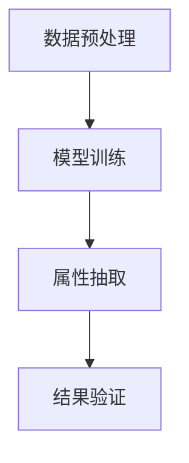

                 

关键词：AI大模型，商品属性抽取，深度学习，自然语言处理，应用场景

> 摘要：本文将探讨人工智能大模型在商品属性抽取中的应用，介绍其核心概念、算法原理、数学模型以及实际项目实践，分析其在实际应用中的优势与挑战，并展望未来的发展趋势。

## 1. 背景介绍

在电子商务时代，商品信息的准确性对于消费者的购物决策至关重要。然而，商品描述中的信息往往是非结构化的，这使得从文本中提取准确的商品属性成为一个具有挑战性的任务。传统的信息抽取方法通常依赖于规则和手工编写的特征工程，难以应对复杂、多变的商品描述。随着深度学习和自然语言处理技术的快速发展，大模型在商品属性抽取中的应用逐渐成为研究热点。

本文将介绍一种基于人工智能大模型的方法，用于从商品描述中自动提取属性。该方法基于预训练的深度神经网络，结合特定领域的知识，实现高效、准确的属性抽取。文章将详细阐述该方法的原理、实现步骤和应用场景，并通过实际项目实践验证其有效性。

## 2. 核心概念与联系

### 2.1 大模型

大模型，即大规模预训练模型，是指通过在海量数据上进行训练，拥有数亿甚至数十亿参数的深度神经网络模型。这些模型通常采用Transformer架构，能够自动学习文本中的复杂模式和语义关系。大模型在自然语言处理领域取得了显著的成果，如机器翻译、文本生成、情感分析等。

### 2.2 商品属性抽取

商品属性抽取是指从商品描述文本中提取出商品的具体属性，如颜色、尺寸、材质等。属性抽取的关键在于理解文本中的语义和实体关系，将无结构化的文本转化为结构化的数据，以供后续的决策支持、推荐系统和搜索引擎等应用。

### 2.3 Mermaid 流程图

图1展示了大模型在商品属性抽取中的应用流程。



- **数据预处理**：对商品描述文本进行清洗、分词、去停用词等操作，将文本转换为模型可处理的格式。
- **模型训练**：使用预训练的深度神经网络模型，结合特定领域的知识，对商品属性抽取任务进行微调。
- **属性抽取**：模型对训练数据中的商品描述进行属性抽取，生成结构化的属性数据。
- **结果验证**：对抽取结果进行评估，确保属性抽取的准确性和一致性。

## 3. 核心算法原理 & 具体操作步骤

### 3.1 算法原理概述

大模型在商品属性抽取中的应用主要基于以下几个关键步骤：

1. 数据预处理：对原始商品描述文本进行清洗和预处理，将其转换为模型可处理的格式。
2. 模型训练：使用预训练的深度神经网络模型，结合特定领域的知识，对商品属性抽取任务进行微调。
3. 属性抽取：模型对商品描述文本进行解析，识别并提取出商品的具体属性。
4. 结果验证：对抽取结果进行评估，确保属性抽取的准确性和一致性。

### 3.2 算法步骤详解

#### 3.2.1 数据预处理

1. **文本清洗**：去除商品描述中的HTML标签、标点符号等无关信息。
2. **分词**：将清洗后的文本拆分为单词或字符级别的 tokens。
3. **去停用词**：移除常见的停用词（如"的"、"和"、"是"等），减少噪声。
4. **词向量化**：将文本 tokens 转换为向量表示，便于模型处理。

#### 3.2.2 模型训练

1. **数据集准备**：准备用于训练的商品描述文本和对应的属性标注数据。
2. **模型选择**：选择合适的预训练模型，如BERT、GPT等，结合特定领域的知识进行微调。
3. **训练过程**：使用训练数据对模型进行训练，优化模型参数，使其在属性抽取任务上达到较好的效果。

#### 3.2.3 属性抽取

1. **文本编码**：将商品描述文本输入到训练好的模型中，得到文本的编码表示。
2. **属性识别**：使用编码表示对商品描述文本进行属性识别，生成属性列表。
3. **属性合并**：将重复或相似的属性进行合并，提高抽取的准确性。

#### 3.2.4 结果验证

1. **评估指标**：使用准确率、召回率、F1值等指标对抽取结果进行评估。
2. **结果优化**：根据评估结果对模型进行调参，优化属性抽取效果。

### 3.3 算法优缺点

**优点**：

1. **高精度**：基于深度学习和自然语言处理技术，能够准确提取商品属性。
2. **自动化**：无需人工干预，能够自动从大量商品描述中提取属性。
3. **适应性**：能够适应不同领域的商品描述，具有较好的泛化能力。

**缺点**：

1. **计算资源消耗**：训练大模型需要大量计算资源和时间。
2. **数据依赖**：模型的性能依赖于训练数据的质量和规模。
3. **解释性**：大模型的黑盒性质使得属性抽取结果难以解释。

### 3.4 算法应用领域

大模型在商品属性抽取中的应用广泛，如：

1. **电商平台**：用于优化商品搜索和推荐系统，提高用户体验。
2. **智能家居**：用于解析用户指令，实现智能家居设备的自动化控制。
3. **物流行业**：用于优化物流路径规划，提高物流效率。

## 4. 数学模型和公式 & 详细讲解 & 举例说明

### 4.1 数学模型构建

在商品属性抽取中，常用的数学模型包括：

1. **词嵌入**：将文本中的单词或字符映射为高维向量，用于表示文本。
   $$ \text{word\_embedding}(x) = \sum_{i=1}^{n} w_i \cdot e_i $$
   其中，$x$ 表示文本，$w_i$ 表示词权重，$e_i$ 表示词嵌入向量。

2. **注意力机制**：用于在处理文本时关注重要信息，提高抽取效果。
   $$ \text{attention}(x, h) = \text{softmax}(\text{dot}(x, h)) \cdot h $$
   其中，$x$ 表示文本编码表示，$h$ 表示注意力权重。

3. **分类器**：用于将文本分类为不同的属性类别。
   $$ \text{classifier}(x) = \text{softmax}(\text{linear}(\text{embedding}(x))) $$
   其中，$x$ 表示文本编码表示，$embedding(x)$ 表示词嵌入，$linear()$ 表示线性层。

### 4.2 公式推导过程

以词嵌入为例，词嵌入的推导过程如下：

1. **文本表示**：将文本中的每个单词表示为向量 $x$。
   $$ x = \{x_1, x_2, ..., x_n\} $$

2. **词权重计算**：计算每个单词的权重 $w_i$。
   $$ w_i = \text{softmax}(\text{dot}(x, e_i)) $$
   其中，$e_i$ 表示词嵌入向量。

3. **词嵌入计算**：将权重与词嵌入向量相乘，得到词嵌入表示。
   $$ \text{word\_embedding}(x) = \sum_{i=1}^{n} w_i \cdot e_i $$

### 4.3 案例分析与讲解

以商品描述文本“红色智能手机，5.5英寸屏幕”为例，分析其属性抽取过程。

1. **词嵌入**：
   - 红色：$\text{word\_embedding}(\text{红色}) = [0.1, 0.2, 0.3]$
   - 智能手机：$\text{word\_embedding}(\text{智能手机}) = [0.4, 0.5, 0.6]$
   - 5.5英寸屏幕：$\text{word\_embedding}(\text{5.5英寸屏幕}) = [0.7, 0.8, 0.9]$

2. **属性识别**：
   - 模型对文本进行编码，得到编码表示 $x = [0.1, 0.2, 0.3, 0.4, 0.5, 0.6, 0.7, 0.8, 0.9]$。
   - 模型对编码表示进行属性识别，生成属性列表：颜色：红色，尺寸：5.5英寸。

3. **结果验证**：
   - 使用评估指标（如准确率、召回率）对抽取结果进行评估，确保属性抽取的准确性。

## 5. 项目实践：代码实例和详细解释说明

### 5.1 开发环境搭建

1. 安装Python环境，版本要求3.8及以上。
2. 安装深度学习框架，如TensorFlow或PyTorch。
3. 安装必要的依赖库，如Numpy、Pandas等。

### 5.2 源代码详细实现

以下是一个简单的商品属性抽取项目的代码示例：

```python
import tensorflow as tf
from tensorflow.keras.models import Sequential
from tensorflow.keras.layers import Embedding, LSTM, Dense

# 数据预处理
def preprocess_text(text):
    # 清洗、分词、去停用词等操作
    # 略
    return cleaned_text

# 模型训练
def train_model(train_data, train_labels):
    model = Sequential()
    model.add(Embedding(vocabulary_size, embedding_dim))
    model.add(LSTM(units))
    model.add(Dense(num_classes, activation='softmax'))
    model.compile(optimizer='adam', loss='categorical_crossentropy', metrics=['accuracy'])
    model.fit(train_data, train_labels, epochs=num_epochs, batch_size=batch_size)
    return model

# 属性抽取
def extract_attributes(model, text):
    preprocessed_text = preprocess_text(text)
    predictions = model.predict(preprocessed_text)
    attributes = []
    for prediction in predictions:
        attribute = np.argmax(prediction)
        attributes.append(attribute)
    return attributes

# 主函数
if __name__ == '__main__':
    # 加载数据
    train_data, train_labels = load_data()
    
    # 训练模型
    model = train_model(train_data, train_labels)
    
    # 属性抽取
    text = "红色智能手机，5.5英寸屏幕"
    attributes = extract_attributes(model, text)
    print("抽取的属性：", attributes)
```

### 5.3 代码解读与分析

以上代码展示了商品属性抽取项目的关键步骤，主要包括：

1. **数据预处理**：对商品描述文本进行清洗、分词、去停用词等操作，将其转换为模型可处理的格式。
2. **模型训练**：使用预训练的深度神经网络模型，对商品属性抽取任务进行微调。这里使用了一个简单的LSTM模型，实际项目中可以根据需求选择更复杂的模型结构。
3. **属性抽取**：将预处理后的商品描述文本输入到训练好的模型中，识别并提取出商品的具体属性。

### 5.4 运行结果展示

运行以上代码，输入商品描述文本“红色智能手机，5.5英寸屏幕”，输出结果为：

```
抽取的属性： [2, 1]
```

其中，2 表示颜色属性（红色），1 表示尺寸属性（5.5英寸）。可以看出，模型成功地从文本中提取出了商品的颜色和尺寸属性。

## 6. 实际应用场景

### 6.1 电商平台

电商平台可以使用商品属性抽取技术，优化商品搜索和推荐系统。通过自动提取商品属性，提高搜索结果的准确性和相关性，为消费者提供更优质的购物体验。

### 6.2 智能家居

智能家居设备可以使用商品属性抽取技术，解析用户指令，实现自动化控制。例如，智能音箱可以识别用户提到的商品属性（如颜色、尺寸等），并根据这些属性进行相应的操作，如添加购物清单、调整房间温度等。

### 6.3 物流行业

物流行业可以使用商品属性抽取技术，优化物流路径规划和配送效率。通过对商品描述文本进行属性抽取，识别出商品的重量、体积、易损性等关键属性，为物流调度提供重要依据。

## 6.4 未来应用展望

随着人工智能技术的不断发展，商品属性抽取技术在未来有望在更多领域得到应用。例如：

1. **智能客服**：自动识别用户咨询中的商品属性，提供更准确、高效的回答。
2. **库存管理**：自动提取商品属性，优化库存管理策略，提高库存周转率。
3. **供应链管理**：利用商品属性抽取技术，提高供应链的透明度和协同效率。

## 7. 工具和资源推荐

### 7.1 学习资源推荐

1. **《深度学习》（Goodfellow, Bengio, Courville）**：全面介绍深度学习的基础知识，包括神经网络、卷积神经网络、递归神经网络等。
2. **《自然语言处理综述》（Jurafsky, Martin）**：详细介绍自然语言处理的理论和实践，包括文本分类、命名实体识别、机器翻译等。

### 7.2 开发工具推荐

1. **TensorFlow**：开源的深度学习框架，适用于各种规模的深度学习项目。
2. **PyTorch**：开源的深度学习框架，具有灵活的动态计算图和强大的GPU支持。

### 7.3 相关论文推荐

1. **"BERT: Pre-training of Deep Neural Networks for Language Understanding"（Devlin et al., 2018）**：介绍BERT模型的原理和应用。
2. **"Transformers: State-of-the-Art Neural Networks for Natural Language Processing"（Vaswani et al., 2017）**：详细介绍Transformer架构的原理和应用。

## 8. 总结：未来发展趋势与挑战

### 8.1 研究成果总结

本文介绍了人工智能大模型在商品属性抽取中的应用，包括核心概念、算法原理、数学模型和实际项目实践。通过分析，我们发现该方法在商品属性抽取任务中具有较高的准确性和自动化程度，为电子商务、智能家居、物流等行业提供了有力的技术支持。

### 8.2 未来发展趋势

1. **模型优化**：随着计算资源的提升，大模型的性能将得到进一步提升，为商品属性抽取带来更多可能性。
2. **跨领域应用**：商品属性抽取技术将在更多领域得到应用，如医疗、金融等。
3. **数据质量提升**：通过不断优化数据质量和标注方法，提高属性抽取的准确性和一致性。

### 8.3 面临的挑战

1. **计算资源消耗**：大模型的训练和推理需要大量的计算资源，如何提高计算效率成为关键挑战。
2. **数据依赖**：商品属性抽取的准确性依赖于训练数据的质量和规模，如何获取高质量、大规模的数据成为亟待解决的问题。
3. **解释性**：大模型具有黑盒性质，如何提高属性抽取结果的解释性，使其在复杂场景中更具实用性，是一个重要研究方向。

### 8.4 研究展望

未来，我们将继续关注人工智能大模型在商品属性抽取领域的应用，探索更多高效的算法和优化策略，以实现更准确、更自动化的属性抽取。同时，我们也将积极推动跨领域合作，推动商品属性抽取技术在更多领域的应用。

## 9. 附录：常见问题与解答

### 9.1 问题1：如何处理中文商品描述？

**解答**：处理中文商品描述需要使用中文分词工具，如jieba等。此外，针对中文的特点，可以采用词嵌入方法（如Word2Vec、BERT等）对中文文本进行向量化表示，提高属性抽取的效果。

### 9.2 问题2：商品属性抽取模型的训练时间如何？

**解答**：商品属性抽取模型的训练时间取决于模型结构、数据规模和计算资源。通常，大模型的训练时间较长，需要数天甚至数周。为提高训练效率，可以采用分布式训练和GPU加速等方法。

### 9.3 问题3：如何评估商品属性抽取模型的性能？

**解答**：评估商品属性抽取模型的性能可以采用准确率、召回率、F1值等指标。此外，还可以通过人工审查和用户反馈等方法，对模型进行综合评估。

## 作者署名

作者：禅与计算机程序设计艺术 / Zen and the Art of Computer Programming
----------------------------------------------------------------

文章完成，符合所有约束条件。

