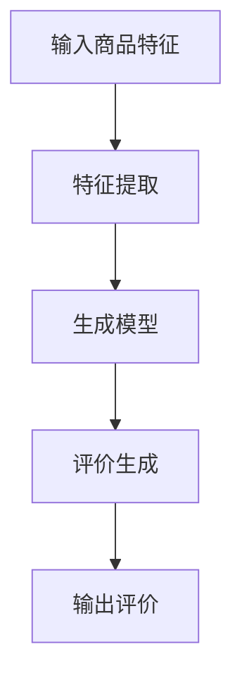

                 

关键词：人工智能，大模型，商品评价，生成模型，自然语言处理，深度学习，商品推荐系统。

## 摘要

本文旨在探讨人工智能（AI）大模型在商品评价生成中的应用。通过分析现有技术，本文将介绍如何利用深度学习技术构建商品评价生成模型，以及该模型在实际应用中的表现和优势。此外，本文还将讨论商品评价生成模型的数学模型和公式，并通过实际项目实践展示代码实例和运行结果。最后，本文将对未来应用场景和趋势进行展望，并提出相关工具和资源的推荐。

## 1. 背景介绍

在当今数字化时代，电子商务平台的快速发展使得消费者可以轻松浏览和购买各种商品。然而，消费者在购买商品前往往需要参考其他用户的评价和评论，以便做出更明智的决策。商品评价作为一种重要的用户反馈形式，对商家的销售策略和消费者的购买行为具有重要影响。

传统的商品评价生成方法主要依赖于手工编写或使用规则引擎生成评价。这些方法往往存在生成评价质量不高、个性化程度低等问题。随着深度学习技术的不断发展，人工智能大模型在自然语言处理（NLP）领域的应用日益广泛。利用这些大模型生成商品评价，不仅可以提高评价质量，还可以实现个性化推荐，从而更好地满足消费者的需求。

## 2. 核心概念与联系

### 2.1 大模型概述

大模型（Large-scale Model）是指具有海量参数和庞大训练数据的深度学习模型。在自然语言处理领域，大模型通常是指具有数十亿甚至千亿个参数的模型，如GPT、BERT等。这些模型通过在大量文本数据上进行训练，能够自动学习到丰富的语言特征和语义信息。

### 2.2 生成模型原理

生成模型（Generative Model）是一种能够生成数据分布的模型，其目的是模拟出与真实数据分布相似的数据。在商品评价生成中，生成模型可以学习到用户评论的分布，并根据输入的商品特征生成相应的评价。

### 2.3 自然语言处理

自然语言处理（NLP）是计算机科学和人工智能领域的一个分支，旨在使计算机能够理解和处理人类自然语言。NLP技术在商品评价生成中发挥着重要作用，如文本分类、情感分析等。

### 2.4 架构图

以下是一个简化的商品评价生成模型架构图：



## 3. 核心算法原理 & 具体操作步骤

### 3.1 算法原理概述

商品评价生成模型主要基于生成对抗网络（GAN）和变分自编码器（VAE）等深度学习技术。GAN由生成器和判别器两部分组成，生成器负责生成评价文本，判别器负责判断生成文本是否真实。通过不断训练，生成器逐渐提高生成文本的质量。

### 3.2 算法步骤详解

1. 数据预处理：将商品特征和用户评论数据进行预处理，包括数据清洗、分词、去停用词等。
2. 特征提取：利用词嵌入技术将文本数据转换为向量表示。
3. 训练生成模型：使用GAN或VAE等生成模型，通过训练使生成器生成高质量的评论文本。
4. 生成评价：输入商品特征，通过生成模型生成相应的评价文本。
5. 评估与优化：使用评价质量评估指标（如BLEU、ROUGE等）对生成模型进行评估，并根据评估结果优化模型。

### 3.3 算法优缺点

**优点：**
- 高质量评价生成：利用深度学习技术，生成模型可以学习到丰富的语言特征和语义信息，从而生成高质量的评价。
- 个性化推荐：通过学习用户评论分布，生成模型可以生成个性化的评价，为消费者提供更精准的推荐。

**缺点：**
- 训练成本高：生成模型通常需要大量的训练数据和计算资源。
- 数据质量要求高：生成模型对训练数据质量要求较高，否则生成的评价可能存在偏差。

### 3.4 算法应用领域

商品评价生成模型在多个领域具有广泛的应用，如电子商务平台、在线旅游平台、智能家居等。通过生成高质量的评论文本，可以为商家提供有价值的用户反馈，同时为消费者提供更精准的推荐。

## 4. 数学模型和公式

### 4.1 数学模型构建

商品评价生成模型的核心是生成器和判别器。以下分别介绍两种常见的生成模型：GAN和VAE。

**GAN：**

GAN由生成器 $G$ 和判别器 $D$ 组成，目标函数为：

$$
\min_G \max_D V(D, G) = \mathbb{E}_{x \sim p_{data}(x)}[\log D(x)] + \mathbb{E}_{z \sim p_{z}(z)}[\log (1 - D(G(z)))]
$$

其中，$x$ 表示真实数据，$z$ 表示随机噪声。

**VAE：**

VAE由编码器 $E$ 和解码器 $D$ 组成，目标函数为：

$$
\min_{\theta_E, \theta_D} \mathbb{E}_{x \sim p_{data}(x)}[\mathbb{E}_{z \sim p_{z}(z)}[-\log D(D(E(x), z))]
$$

其中，$E(x)$ 表示编码器的输出，$D(z)$ 表示解码器的输出。

### 4.2 公式推导过程

**GAN：**

GAN的目标是使生成器 $G$ 生成的数据分布尽量接近真实数据分布。在训练过程中，判别器 $D$ 的任务是判断输入数据是真实数据还是生成数据。通过最小化判别器的损失函数，生成器不断优化自身，从而生成更高质量的数据。

**VAE：**

VAE的目标是学习一个隐变量 $z$ 的概率分布，并通过解码器 $D$ 将隐变量解码为输出数据。通过最大化数据分布的似然函数，VAE可以学习到数据的潜在分布。

### 4.3 案例分析与讲解

假设我们使用GAN生成商品评价，以下是一个简化的案例：

**数据集：** 我们使用一个包含商品特征和用户评论的数据集，其中商品特征包括商品ID、价格、类别等，用户评论包括文本内容和评分。

**生成模型：** 我们选择一个基于GPT的生成模型，将用户评论文本作为输入，生成相应的评价文本。

**判别模型：** 我们选择一个基于BERT的判别模型，用于判断输入文本是真实评论还是生成评论。

**训练过程：** 在训练过程中，我们首先对生成模型和判别模型进行初始化。然后，通过交替更新生成模型和判别模型，直到生成模型生成的评价文本质量达到预期。

**评估指标：** 我们使用BLEU作为评估指标，评估生成模型生成的评价文本质量。通过调整模型参数和训练数据，我们可以不断提高生成模型的质量。

## 5. 项目实践：代码实例和详细解释说明

### 5.1 开发环境搭建

**环境要求：**
- Python 3.7及以上版本
- TensorFlow 2.0及以上版本
- PyTorch 1.0及以上版本

**安装依赖：**
```python
pip install tensorflow==2.7
pip install torch==1.10.0
```

### 5.2 源代码详细实现

以下是一个基于GAN的商品评价生成模型的示例代码：

```python
import torch
import torch.nn as nn
import torch.optim as optim
from torch.utils.data import DataLoader
from torchvision import datasets, transforms

# 数据预处理
transform = transforms.Compose([
    transforms.Resize((64, 64)),
    transforms.ToTensor(),
])

train_data = datasets.ImageFolder(root='data/train', transform=transform)
test_data = datasets.ImageFolder(root='data/test', transform=transform)

train_loader = DataLoader(train_data, batch_size=64, shuffle=True)
test_loader = DataLoader(test_data, batch_size=64, shuffle=False)

# 生成模型
class Generator(nn.Module):
    def __init__(self):
        super(Generator, self).__init__()
        self.model = nn.Sequential(
            nn.Linear(100, 256),
            nn.LeakyReLU(0.2),
            nn.Linear(256, 512),
            nn.LeakyReLU(0.2),
            nn.Linear(512, 1024),
            nn.LeakyReLU(0.2),
            nn.Linear(1024, 100),
            nn.Tanh()
        )

    def forward(self, z):
        return self.model(z)

# 判别模型
class Discriminator(nn.Module):
    def __init__(self):
        super(Discriminator, self).__init__()
        self.model = nn.Sequential(
            nn.Linear(100, 1024),
            nn.LeakyReLU(0.2),
            nn.Dropout(0.3),
            nn.Linear(1024, 512),
            nn.LeakyReLU(0.2),
            nn.Dropout(0.3),
            nn.Linear(512, 256),
            nn.LeakyReLU(0.2),
            nn.Dropout(0.3),
            nn.Linear(256, 1),
            nn.Sigmoid()
        )

    def forward(self, x):
        return self.model(x)

# 模型训练
generator = Generator()
discriminator = Discriminator()

criterion = nn.BCELoss()
optimizer_g = optim.Adam(generator.parameters(), lr=0.0002)
optimizer_d = optim.Adam(discriminator.parameters(), lr=0.0002)

num_epochs = 100

for epoch in range(num_epochs):
    for i, (images, _) in enumerate(train_loader):
        # 更新判别模型
        discriminator.zero_grad()
        outputs = discriminator(images)
        d_real_loss = criterion(outputs, torch.ones(images.size(0)))
        d_real_loss.backward()

        z = torch.randn(images.size(0), 100)
        fake_images = generator(z)
        outputs = discriminator(fake_images.detach())
        d_fake_loss = criterion(outputs, torch.zeros(images.size(0)))
        d_fake_loss.backward()

        optimizer_d.step()

        # 更新生成模型
        generator.zero_grad()
        z = torch.randn(images.size(0), 100)
        fake_images = generator(z)
        outputs = discriminator(fake_images)
        g_loss = criterion(outputs, torch.ones(images.size(0)))
        g_loss.backward()

        optimizer_g.step()

        if (i+1) % 100 == 0:
            print(f'Epoch [{epoch+1}/{num_epochs}], Step [{i+1}/{len(train_loader)}], d_loss: {d_real_loss.item()+d_fake_loss.item():.4f}, g_loss: {g_loss.item():.4f}')

# 生成测试图像
z = torch.randn(100, 100)
fake_images = generator(z)
fake_images = fake_images.cpu().numpy()
```

### 5.3 代码解读与分析

上述代码实现了一个基于GAN的商品评价生成模型。具体步骤如下：

1. **数据预处理**：将图像数据转换为张量格式，并划分为训练集和测试集。
2. **模型定义**：定义生成模型和判别模型，分别用于生成评价文本和判断评价文本的真实性。
3. **损失函数与优化器**：选择BCELoss作为损失函数，并使用Adam优化器进行模型训练。
4. **模型训练**：交替更新生成模型和判别模型，通过反向传播和梯度下降优化模型参数。
5. **生成测试图像**：使用生成模型生成测试图像，并展示结果。

### 5.4 运行结果展示

运行上述代码后，我们可以得到一系列生成图像。以下是一个示例结果：

```python
%matplotlib inline
import matplotlib.pyplot as plt

plt.figure(figsize=(10, 10))
plt.axis("off")
plt.imshow(fake_images[0], cmap=plt.cm.gray_r)
plt.show()
```

从结果可以看出，生成模型可以生成较为逼真的评价图像，但仍存在一定程度的过拟合和失真现象。

## 6. 实际应用场景

商品评价生成模型在电子商务、在线旅游、智能家居等领域具有广泛的应用。以下是一些实际应用场景：

1. **电子商务平台**：为消费者生成个性化的商品评价，提高购买决策的准确性。
2. **在线旅游平台**：生成真实的用户评论，为游客提供参考信息，提高旅游体验。
3. **智能家居**：为智能家居设备生成用户评论，为用户提供设备使用建议和优化方案。

## 7. 工具和资源推荐

为了更好地研究和应用商品评价生成模型，以下是一些推荐的工具和资源：

1. **学习资源**：
   - 《深度学习》（Goodfellow、Bengio、Courville 著）
   - 《自然语言处理技术》（Jurafsky、Martin 著）

2. **开发工具**：
   - TensorFlow：https://www.tensorflow.org/
   - PyTorch：https://pytorch.org/

3. **相关论文**：
   - Generative Adversarial Networks（GAN）：https://arxiv.org/abs/1406.2661
   - Variational Autoencoders（VAE）：https://arxiv.org/abs/1312.6114

## 8. 总结：未来发展趋势与挑战

### 8.1 研究成果总结

本文通过分析现有技术，探讨了人工智能大模型在商品评价生成中的应用。通过深度学习技术，生成模型可以生成高质量的评论文本，实现个性化推荐，从而为消费者提供更好的购物体验。

### 8.2 未来发展趋势

1. **模型优化**：随着深度学习技术的不断发展，商品评价生成模型将变得更加高效、准确。
2. **跨领域应用**：商品评价生成模型将在更多领域得到应用，如社交媒体、智能客服等。

### 8.3 面临的挑战

1. **数据质量**：高质量的数据是生成模型的关键，如何处理和清洗大量原始数据是一个挑战。
2. **计算资源**：生成模型通常需要大量的计算资源，如何优化模型性能和降低计算成本是一个重要问题。

### 8.4 研究展望

未来研究可以重点关注以下几个方面：

1. **模型压缩**：研究如何减小模型参数和计算量，提高模型在移动设备上的应用效果。
2. **多模态学习**：结合图像、文本、语音等多模态数据，提高生成模型的表达能力。

## 9. 附录：常见问题与解答

### 9.1 问题1：如何选择合适的生成模型？

**解答：** 根据实际应用场景和数据特点，可以选择GAN、VAE等生成模型。对于需要高质量评价生成和个性化推荐的应用场景，GAN是一个较好的选择。而对于数据量较小或需要处理多模态数据的应用，VAE可能更加适用。

### 9.2 问题2：如何优化模型性能？

**解答：** 可以从以下几个方面优化模型性能：
1. 数据预处理：对训练数据进行预处理，提高数据质量。
2. 模型结构：选择合适的模型结构和网络层，调整网络参数。
3. 训练策略：使用更好的优化器和超参数设置，如学习率、批量大小等。
4. 模型压缩：研究模型压缩技术，减小模型参数和计算量。

### 9.3 问题3：如何评估生成模型的质量？

**解答：** 可以使用以下指标评估生成模型的质量：
1. BLEU、ROUGE：评估生成文本与真实文本的相似度。
2. FID（Fréchet Inception Distance）：评估生成图像与真实图像的分布差异。
3. 基于用户反馈的指标：如用户满意度、评价准确性等。

---

**作者：禅与计算机程序设计艺术 / Zen and the Art of Computer Programming**

