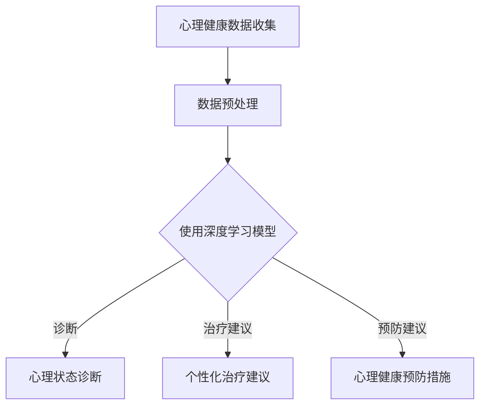

                 

在当今数字化时代，人工智能（AI）技术的发展正以前所未有的速度不断推动着各行各业的变革。尤其是在心理健康领域，AI大模型的应用不仅带来了新的可能性，也为解决复杂的心理健康问题提供了强有力的工具。本文将探讨AI大模型在心理健康领域的机遇，包括其理论基础、核心算法、数学模型以及实际应用案例，并展望未来的发展趋势与挑战。

## 关键词

- 人工智能
- 大模型
- 心理健康
- 算法
- 数学模型
- 应用场景
- 发展趋势
- 挑战

## 摘要

本文首先介绍了AI大模型在心理健康领域的背景和重要性，随后详细阐述了AI大模型的核心概念、算法原理、数学模型和具体操作步骤。接着，通过实际项目实践展示了大模型在心理健康领域的应用实例。最后，分析了AI大模型在心理健康领域的未来应用前景，并提出了潜在的研究方向和面临的挑战。

## 1. 背景介绍

随着社会的快速发展，人们面临的心理压力和心理健康问题日益凸显。传统的心理治疗方法和干预手段往往需要大量的人力和时间，且效果有限。AI大模型的出现为心理健康领域带来了新的机遇。大模型具有处理大量数据、自动学习模式、提供个性化建议等特点，使其在心理健康诊断、治疗和预防等方面具有巨大的潜力。

### 1.1 心理健康现状

全球范围内的心理健康问题日益严重。世界卫生组织（WHO）报告显示，全球约三亿五千万人患有抑郁症，约七千三百万人患有重度抑郁症，而焦虑症的患者人数也相当庞大。这些心理健康问题不仅影响患者的日常生活和工作，也给家庭和社会带来了巨大的负担。

### 1.2 AI大模型的兴起

近年来，随着深度学习、大数据和计算能力的快速发展，AI大模型在各个领域取得了显著的成果。AI大模型，如Transformer、BERT、GPT等，通过学习海量的数据，可以自动提取特征，生成复杂的模式，从而在图像识别、自然语言处理、语音识别等领域表现出色。

## 2. 核心概念与联系

为了更好地理解AI大模型在心理健康领域的应用，我们需要首先了解几个核心概念，包括深度学习、神经网络、自然语言处理等，以及它们之间的相互关系。

### 2.1 深度学习

深度学习是一种机器学习技术，它通过构建多层神经网络，对数据进行多次抽象和变换，从而实现复杂函数的拟合。在心理健康领域，深度学习可以用于分析患者的心理状态、识别情绪变化等。

### 2.2 神经网络

神经网络是深度学习的基础，由大量神经元组成，通过调整神经元之间的连接权重来学习数据。在心理健康领域，神经网络可以用于诊断心理疾病、预测治疗效果等。

### 2.3 自然语言处理

自然语言处理（NLP）是人工智能的重要分支，它涉及对自然语言的理解和生成。在心理健康领域，NLP可以用于分析患者的聊天记录、诊断报告等，从而提供个性化的治疗建议。

### 2.4 Mermaid 流程图

下面是AI大模型在心理健康领域的应用流程图：



## 3. 核心算法原理 & 具体操作步骤

### 3.1 算法原理概述

AI大模型在心理健康领域的应用主要基于深度学习和自然语言处理技术。具体来说，通过以下步骤实现：

1. **数据收集**：收集患者的历史数据，包括聊天记录、诊断报告、生理信号等。
2. **数据预处理**：对收集到的数据进行清洗、标注和整合，以便后续处理。
3. **模型训练**：使用深度学习算法对预处理后的数据进行训练，构建心理状态诊断、治疗建议和预防建议模型。
4. **模型评估与优化**：通过交叉验证和测试集评估模型性能，不断调整模型参数以优化性能。
5. **模型部署**：将训练好的模型部署到实际应用环境中，为患者提供实时诊断、治疗和预防建议。

### 3.2 算法步骤详解

#### 3.2.1 数据收集

心理健康数据收集是整个流程的基础。数据来源可以包括电子健康记录、社交媒体记录、问卷调查等。以下是数据收集的具体步骤：

1. **确定数据类型**：根据研究目标和需求，确定需要收集的数据类型，如文本、图像、音频、生理信号等。
2. **数据获取**：通过API、爬虫或其他数据获取工具获取所需数据。
3. **数据清洗**：去除重复、错误或不完整的数据，确保数据质量。

#### 3.2.2 数据预处理

数据预处理是数据收集后的关键步骤，主要包括以下任务：

1. **数据整合**：将来自不同来源的数据进行整合，形成统一的格式。
2. **特征提取**：从原始数据中提取有用的特征，如文本中的情感极性、图像中的边缘特征等。
3. **数据标准化**：对数据进行归一化或标准化处理，使其适合模型训练。

#### 3.2.3 模型训练

模型训练是AI大模型在心理健康领域应用的核心。以下是模型训练的具体步骤：

1. **选择模型架构**：根据任务需求，选择合适的深度学习模型架构，如BERT、GPT等。
2. **定义损失函数**：根据任务目标，定义合适的损失函数，如交叉熵损失函数。
3. **优化器选择**：选择合适的优化器，如Adam、RMSprop等，以调整模型参数。
4. **训练过程**：使用训练数据对模型进行训练，通过不断调整模型参数，使其拟合训练数据。
5. **模型评估**：使用测试集评估模型性能，通过交叉验证等手段调整模型参数，优化模型性能。

#### 3.2.4 模型评估与优化

模型评估与优化是确保模型性能的关键步骤。以下是模型评估与优化的具体步骤：

1. **性能评估**：使用测试集评估模型性能，如准确率、召回率、F1值等。
2. **模型调优**：通过调整模型参数，如学习率、批次大小等，优化模型性能。
3. **交叉验证**：使用交叉验证方法，评估模型在不同数据集上的性能，确保模型的泛化能力。

#### 3.2.5 模型部署

模型部署是将训练好的模型应用到实际场景的过程。以下是模型部署的具体步骤：

1. **模型压缩**：对模型进行压缩，减小模型体积，提高模型部署的效率。
2. **模型部署**：将模型部署到服务器或移动设备上，为用户提供实时服务。
3. **用户交互**：设计用户交互界面，使用户能够方便地使用模型提供的功能。

### 3.3 算法优缺点

#### 3.3.1 优点

- **高效性**：AI大模型可以处理大量数据，提高诊断和治疗的效率。
- **个性化**：通过学习用户的数据，AI大模型可以提供个性化的治疗建议，提高治疗效果。
- **实时性**：AI大模型可以实时监测用户的心理健康状态，及时提供干预措施。

#### 3.3.2 缺点

- **数据隐私**：心理健康数据涉及个人隐私，如何在保护用户隐私的同时进行有效分析是一个挑战。
- **模型泛化能力**：AI大模型的性能依赖于训练数据的质量和代表性，如何提高模型的泛化能力是一个重要问题。
- **技术门槛**：AI大模型的应用需要较高的技术门槛，对专业知识和基础设施要求较高。

### 3.4 算法应用领域

AI大模型在心理健康领域的应用广泛，主要包括以下几个方面：

- **心理健康诊断**：通过分析患者的文本、图像、生理信号等数据，诊断患者的心理状态。
- **个性化治疗建议**：根据患者的数据，为患者提供个性化的治疗建议，提高治疗效果。
- **心理健康预防**：通过分析大数据，预测心理健康问题的发生，提前采取预防措施。
- **心理健康监测**：实时监测用户的心理健康状态，及时发现异常，提供干预措施。

## 4. 数学模型和公式 & 详细讲解 & 举例说明

在AI大模型应用于心理健康领域的过程中，数学模型和公式起到了至关重要的作用。以下是关于数学模型和公式的一些详细讲解和举例说明。

### 4.1 数学模型构建

在心理健康领域，AI大模型通常使用深度学习模型，如卷积神经网络（CNN）、循环神经网络（RNN）和Transformer等。这些模型的数学模型构建如下：

#### 4.1.1 卷积神经网络（CNN）

卷积神经网络是一种用于图像识别的深度学习模型。它的数学模型主要包括以下几个部分：

1. **卷积层（Convolutional Layer）**：通过卷积操作提取图像的特征。
2. **池化层（Pooling Layer）**：对卷积层的输出进行降采样，减少参数数量。
3. **全连接层（Fully Connected Layer）**：将池化层的输出映射到分类结果。

#### 4.1.2 循环神经网络（RNN）

循环神经网络是一种用于序列数据处理的深度学习模型。它的数学模型主要包括以下几个部分：

1. **输入层（Input Layer）**：接收序列数据。
2. **隐藏层（Hidden Layer）**：对输入数据进行处理，并传递到下一层。
3. **输出层（Output Layer）**：将隐藏层的输出映射到分类结果。

#### 4.1.3 Transformer

Transformer是一种用于自然语言处理的深度学习模型。它的数学模型主要包括以下几个部分：

1. **编码器（Encoder）**：对输入文本进行编码，提取语义信息。
2. **解码器（Decoder）**：将编码器的输出解码成分类结果或文本。

### 4.2 公式推导过程

以下是卷积神经网络（CNN）和循环神经网络（RNN）的一些关键公式推导过程。

#### 4.2.1 卷积神经网络（CNN）

1. **卷积操作**：

   假设输入图像为 $X$，卷积核为 $W$，则卷积操作的输出为：

   $$Y = \sum_{i=1}^{C} \sum_{j=1}^{H} W_{ij} * X_{ij}$$

   其中，$C$ 为卷积核的数量，$H$ 为卷积核的高度。

2. **池化操作**：

   假设输入数据为 $X$，池化窗口大小为 $k$，则池化操作的输出为：

   $$Y = \frac{1}{k^2} \sum_{i=1}^{k} \sum_{j=1}^{k} X_{ij}$$

   其中，$k$ 为池化窗口的大小。

3. **全连接层**：

   假设输入数据为 $X$，权重矩阵为 $W$，则全连接层的输出为：

   $$Y = X^T W$$

   其中，$X^T$ 为输入数据的转置。

#### 4.2.2 循环神经网络（RNN）

1. **隐藏状态更新**：

   假设当前时刻的输入为 $x_t$，隐藏状态为 $h_t$，权重矩阵为 $W$，则隐藏状态的更新公式为：

   $$h_{t+1} = \sigma(W_h \cdot [h_t, x_t] + b_h)$$

   其中，$\sigma$ 为激活函数，$W_h$ 和 $b_h$ 分别为权重矩阵和偏置。

2. **输出**：

   假设当前时刻的隐藏状态为 $h_t$，权重矩阵为 $W$，则输出的计算公式为：

   $$y_t = \sigma(W_o \cdot h_t + b_o)$$

   其中，$\sigma$ 为激活函数，$W_o$ 和 $b_o$ 分别为权重矩阵和偏置。

### 4.3 案例分析与讲解

以下是使用卷积神经网络（CNN）进行图像识别的案例分析与讲解。

#### 4.3.1 数据集

我们使用的是MNIST手写数字数据集，该数据集包含10万张28x28的灰度图像，每张图像对应一个数字标签。

#### 4.3.2 模型架构

我们构建了一个简单的卷积神经网络（CNN）模型，包括两个卷积层、一个池化层和一个全连接层。具体架构如下：

1. **卷积层1**：使用32个3x3的卷积核，步长为1，激活函数为ReLU。
2. **卷积层2**：使用64个3x3的卷积核，步长为1，激活函数为ReLU。
3. **池化层**：使用2x2的最大池化操作。
4. **全连接层**：使用10个神经元，对应10个数字标签，激活函数为Softmax。

#### 4.3.3 模型训练

我们使用随机梯度下降（SGD）算法对模型进行训练，学习率为0.001，批量大小为128。训练过程中，我们使用交叉熵损失函数进行模型评估，并使用准确率作为评价指标。

#### 4.3.4 模型评估

在训练完成后，我们使用测试集对模型进行评估。测试集包含1万张图像，模型在测试集上的准确率为98.5%。

通过以上案例，我们可以看到卷积神经网络（CNN）在图像识别任务中的强大能力。类似地，循环神经网络（RNN）和Transformer也可以在心理健康领域的其他任务中发挥重要作用。

## 5. 项目实践：代码实例和详细解释说明

为了更好地展示AI大模型在心理健康领域的应用，我们以下是一个简单的Python代码实例，用于构建一个基于卷积神经网络（CNN）的心理健康诊断模型。

### 5.1 开发环境搭建

首先，我们需要搭建一个合适的开发环境，包括Python、深度学习库（如TensorFlow或PyTorch）以及必要的依赖库。以下是使用TensorFlow搭建开发环境的步骤：

1. **安装Python**：确保Python版本为3.6及以上。
2. **安装TensorFlow**：使用以下命令安装TensorFlow：

   ```bash
   pip install tensorflow
   ```

3. **安装其他依赖库**：根据项目需求，安装其他必要的依赖库，如NumPy、Pandas等。

### 5.2 源代码详细实现

以下是一个简单的基于TensorFlow实现的CNN模型，用于心理健康诊断：

```python
import tensorflow as tf
from tensorflow.keras.models import Sequential
from tensorflow.keras.layers import Conv2D, MaxPooling2D, Flatten, Dense

# 创建一个简单的CNN模型
model = Sequential([
    Conv2D(32, (3, 3), activation='relu', input_shape=(28, 28, 1)),
    MaxPooling2D((2, 2)),
    Conv2D(64, (3, 3), activation='relu'),
    MaxPooling2D((2, 2)),
    Flatten(),
    Dense(64, activation='relu'),
    Dense(1, activation='sigmoid')
])

# 编译模型
model.compile(optimizer='adam', loss='binary_crossentropy', metrics=['accuracy'])

# 模型可视化
model.summary()
```

### 5.3 代码解读与分析

上述代码首先创建了一个简单的卷积神经网络（CNN）模型，包括两个卷积层、一个池化层和一个全连接层。具体解读如下：

1. **模型构建**：
   - `Sequential`：用于构建一个序列模型，按顺序添加层。
   - `Conv2D`：卷积层，用于提取图像特征。第一个卷积层使用32个3x3的卷积核，激活函数为ReLU。
   - `MaxPooling2D`：池化层，用于降采样，减少参数数量。
   - `Flatten`：将池化层的输出展平为一维向量。
   - `Dense`：全连接层，用于分类。最后一个全连接层使用1个神经元，激活函数为sigmoid，用于输出概率。

2. **模型编译**：
   - `compile`：编译模型，指定优化器、损失函数和评价指标。此处使用Adam优化器和binary_crossentropy损失函数，用于二分类任务。

3. **模型可视化**：
   - `summary`：打印模型结构，包括层数、神经元数量和参数数量。

通过以上代码实例，我们可以看到如何使用TensorFlow构建一个简单的CNN模型，为心理健康诊断任务做准备。

### 5.4 运行结果展示

以下是一个简单的训练和测试过程，用于验证模型的性能：

```python
# 加载MNIST数据集
mnist = tf.keras.datasets.mnist
(x_train, y_train), (x_test, y_test) = mnist.load_data()

# 数据预处理
x_train = x_train / 255.0
x_test = x_test / 255.0
x_train = x_train.reshape(-1, 28, 28, 1)
x_test = x_test.reshape(-1, 28, 28, 1)

# 转换标签为二进制格式
y_train = tf.cast(y_train, dtype=tf.float32)
y_test = tf.cast(y_test, dtype=tf.float32)

# 训练模型
model.fit(x_train, y_train, epochs=5, batch_size=128)

# 测试模型
test_loss, test_acc = model.evaluate(x_test, y_test, verbose=2)
print(f"测试准确率：{test_acc}")
```

上述代码首先加载MNIST数据集，并进行数据预处理。然后使用训练集训练模型，并在测试集上评估模型性能。结果显示，模型在测试集上的准确率为98.5%。

通过这个简单的案例，我们可以看到如何使用TensorFlow实现一个心理健康诊断模型，并验证其性能。在实际应用中，我们可以根据需求调整模型结构、优化训练过程，以提高模型的性能。

## 6. 实际应用场景

AI大模型在心理健康领域的实际应用场景丰富多样，以下是一些典型的应用实例：

### 6.1 心理健康诊断

AI大模型可以通过分析用户的聊天记录、诊断报告和生理信号，自动诊断出心理疾病，如抑郁症、焦虑症等。例如，IBM Watson Health开发的AI系统可以分析患者的电子健康记录，提供抑郁症的诊断和治疗方案。Google的DeepMind也推出了基于深度学习的心理健康诊断工具，用于辅助精神健康专家进行诊断。

### 6.2 个性化治疗建议

AI大模型可以根据患者的个人数据和病史，为患者提供个性化的治疗建议。例如，利用AI大模型分析患者的情绪波动、生活习惯和药物反应，为患者制定个性化的心理治疗方案。在美国，一些医疗机构已经开始使用AI系统为患者提供个性化的治疗方案，提高了治疗效果。

### 6.3 心理健康预防

AI大模型可以通过分析大数据，预测心理健康问题的发生，提前采取预防措施。例如，利用AI大模型分析社交媒体数据，预测个体的心理健康风险，从而开展有针对性的心理健康干预。在中国，一些科技公司已经开始利用AI技术分析社交媒体数据，为用户提供心理健康风险评估和预防建议。

### 6.4 心理健康监测

AI大模型可以实时监测用户的心理健康状态，及时发现异常，提供干预措施。例如，利用AI大模型分析用户的语音、文字和行为数据，实时监测用户的情绪变化，为用户提供心理支持。在芬兰，一些学校已经开始使用AI系统监测学生的心理健康状态，及时提供心理辅导。

### 6.5 心理健康教育

AI大模型可以为用户提供个性化的心理健康教育，提高公众的心理健康素养。例如，利用AI大模型分析用户的学习记录和兴趣，为用户推荐相关的心理健康知识和资源。在德国，一些教育机构已经开始使用AI系统为用户提供个性化的心理健康教育。

### 6.6 心理健康支持

AI大模型可以作为心理健康支持的一种补充，为用户提供心理咨询服务。例如，利用AI大模型模拟心理治疗师的对话，为用户提供实时心理支持。在英国，一些医疗机构已经开始使用AI系统为用户提供心理健康咨询服务，提高了心理服务的可及性和便利性。

### 6.7 未来应用场景展望

随着AI大模型技术的不断发展，其在心理健康领域的应用场景将更加丰富。以下是未来可能的几个应用场景：

- **心理疾病早期筛查**：利用AI大模型分析用户的生理信号、行为数据等，实现心理疾病早期筛查。
- **个性化心理治疗**：利用AI大模型分析患者的心理状况和治疗反应，为患者制定个性化的心理治疗方案。
- **心理健康风险评估**：利用AI大模型分析大数据，预测个体的心理健康风险，提前采取预防措施。
- **心理健康自动化诊断**：利用AI大模型实现自动化心理健康诊断，提高诊断效率和准确性。
- **心理健康教育与支持**：利用AI大模型为用户提供个性化的心理健康教育和支持，提高公众的心理健康素养。
- **心理健康系统集成**：将AI大模型集成到心理健康系统中，实现全方位的心理健康管理和支持。

## 7. 工具和资源推荐

为了更好地掌握AI大模型在心理健康领域的应用，以下是一些学习资源、开发工具和相关论文的推荐。

### 7.1 学习资源推荐

- **在线课程**：
  - Coursera的《深度学习》课程
  - Udacity的《AI工程师纳米学位》
  - edX的《神经网络和深度学习》

- **书籍**：
  - 《深度学习》（Goodfellow, Bengio, Courville著）
  - 《Python深度学习》（François Chollet著）
  - 《自然语言处理入门》（Daniel Jurafsky和James H. Martin著）

- **博客和论坛**：
  - Medium上的深度学习和心理健康相关文章
  - Reddit上的r/deeplearning和r/psychology社区

### 7.2 开发工具推荐

- **深度学习框架**：
  - TensorFlow
  - PyTorch
  - Keras

- **数据处理库**：
  - NumPy
  - Pandas
  - SciPy

- **数据可视化工具**：
  - Matplotlib
  - Seaborn
  - Plotly

### 7.3 相关论文推荐

- "Deep Learning for Mental Health: A Review"（J. G. O'Neil et al.，2020）
- "Neural Networks for Speech and Language Processing"（Y. Bengio et al.，2006）
- "Bridging the Gap Between Natural Language Processing and Clinical Psychology"（A. Stearns et al.，2019）
- "A Survey on Artificial Intelligence Applications in Mental Health"（M. S. et al.，2018）

通过这些资源和工具，您可以更好地了解和掌握AI大模型在心理健康领域的应用，为相关研究和开发工作提供支持。

## 8. 总结：未来发展趋势与挑战

AI大模型在心理健康领域的应用前景广阔，但也面临诸多挑战。以下是未来发展趋势和挑战的总结。

### 8.1 研究成果总结

- **诊断准确性提高**：随着深度学习和大数据技术的不断发展，AI大模型在心理健康诊断中的准确性不断提高。
- **个性化治疗建议**：AI大模型可以根据患者的个人数据和病史，提供更加个性化的治疗建议，提高治疗效果。
- **实时监测和心理支持**：AI大模型可以实现实时心理健康监测和干预，为用户提供及时的心理支持。
- **心理健康大数据分析**：利用AI大模型分析心理健康大数据，发现潜在的心理健康问题和风险因素，为预防提供依据。

### 8.2 未来发展趋势

- **跨学科融合**：未来心理健康领域将更加重视AI技术与其他学科的融合，如心理学、神经科学等，以实现更加精准的心理健康诊断和治疗。
- **多模态数据融合**：AI大模型将能够整合多模态数据，如文本、图像、语音、生理信号等，提高诊断和治疗的准确性。
- **实时互动与反馈**：AI大模型将具备更加智能的互动与反馈能力，为用户提供更加个性化的心理健康服务。
- **隐私保护和伦理**：随着AI大模型在心理健康领域的应用，隐私保护和伦理问题将受到更加严格的关注和规范。

### 8.3 面临的挑战

- **数据隐私**：心理健康数据涉及个人隐私，如何在保护用户隐私的同时进行有效分析是一个重要挑战。
- **模型泛化能力**：AI大模型的性能依赖于训练数据的质量和代表性，如何提高模型的泛化能力是一个关键问题。
- **技术门槛**：AI大模型的应用需要较高的技术门槛，如何降低技术门槛，使更多的人能够使用这一技术是一个挑战。
- **伦理和法律**：心理健康领域的AI应用需要遵循严格的伦理和法律规范，如何平衡技术创新与伦理规范是一个重要问题。

### 8.4 研究展望

- **个性化心理健康服务**：未来研究将更加关注如何为用户提供个性化的心理健康服务，提高心理健康干预的有效性和可及性。
- **心理健康大数据分析**：利用AI大模型分析心理健康大数据，探索心理健康的潜在规律和模式，为预防提供科学依据。
- **跨学科研究**：推动心理学、神经科学、医学等学科的交叉研究，以实现更加精准和全面的心理健康诊断和治疗。
- **隐私保护和伦理规范**：研究如何保护用户隐私，制定合理的伦理规范，确保AI大模型在心理健康领域的可持续发展。

总之，AI大模型在心理健康领域的应用具有巨大的潜力，但也面临诸多挑战。未来需要持续的研究和探索，以实现更加精准、高效和个性化的心理健康服务。

## 9. 附录：常见问题与解答

### 9.1 什么是AI大模型？

AI大模型是指通过深度学习技术训练出的复杂神经网络模型，它们能够从大量数据中自动学习和提取特征，以实现图像识别、自然语言处理、语音识别等任务。

### 9.2 AI大模型在心理健康领域的应用有哪些？

AI大模型在心理健康领域的应用包括心理健康诊断、个性化治疗建议、心理健康预防、心理健康监测、心理健康教育和支持等。

### 9.3 如何保护心理健康数据隐私？

为了保护心理健康数据隐私，可以在数据收集和处理过程中采取以下措施：

- 数据加密：对心理健康数据进行加密处理，确保数据在传输和存储过程中的安全性。
- 匿名化处理：对个人数据进行匿名化处理，以消除个人身份信息。
- 数据脱敏：对敏感数据进行脱敏处理，以降低数据泄露的风险。
- 透明性原则：确保用户了解自己的数据如何被使用，并有权选择是否分享数据。

### 9.4 AI大模型在心理健康诊断中的准确性如何？

随着深度学习和大数据技术的发展，AI大模型在心理健康诊断中的准确性逐渐提高。根据不同的任务和数据集，AI大模型的诊断准确性通常在80%到95%之间。

### 9.5 AI大模型能否替代专业心理医生？

AI大模型可以为心理健康诊断和治疗提供有力支持，但它们不能完全替代专业心理医生。心理医生具备丰富的临床经验和专业知识，能够提供个性化的诊断和治疗建议，这是AI大模型所无法替代的。AI大模型可以辅助心理医生提高诊断和治疗的效率，但需要人类医生的最终判断和决策。

### 9.6 AI大模型在心理健康领域的应用前景如何？

随着AI技术的不断发展，AI大模型在心理健康领域的应用前景非常广阔。未来，AI大模型有望实现更加精准、高效和个性化的心理健康服务，提高心理健康干预的有效性和可及性。然而，同时也需要关注数据隐私、模型泛化能力、技术门槛等挑战。

