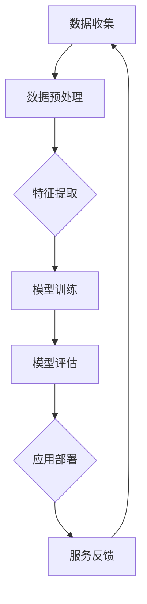

                 

关键词：AI大模型，教育评估，商业化，技术架构，算法原理，数学模型，应用实践，未来展望

## 摘要

本文旨在探讨AI大模型在教育评估领域的商业化应用。首先，我们将介绍AI大模型的基本概念和其在教育评估中的应用价值。接着，通过阐述核心算法原理、数学模型构建、具体操作步骤，以及项目实践中的代码实例，深入分析AI大模型在教育评估中的实现方法。随后，文章将讨论AI大模型在实际应用场景中的挑战和未来发展方向。最后，我们将推荐相关学习资源和开发工具，并总结文章的核心观点和未来研究展望。

## 1. 背景介绍

在教育领域，传统的评估方式通常依赖于教师的经验和主观判断。然而，随着教育规模的扩大和评估需求的增加，这种传统方法逐渐显露出其局限性。教育评估不仅需要准确、客观的测量学生能力，还需要适应个性化教学和智能化管理的需求。在此背景下，AI大模型作为一种新兴技术，为教育评估带来了革命性的改变。

AI大模型是指利用深度学习和神经网络技术，通过大规模数据训练得到的复杂模型。它们能够自动从数据中学习规律，进行特征提取和模式识别，从而提供高效、准确的评估结果。在教育评估中，AI大模型可以应用于多种场景，如学生成绩预测、学习能力评估、教学质量监控等。

商业化探索是AI大模型在教育评估中应用的重要环节。通过商业化，AI大模型不仅能够为教育机构提供高效的服务，还能够创造经济效益。本文将深入探讨AI大模型在教育评估中的商业化路径，包括技术架构设计、算法优化、市场推广等关键问题。

### 1.1 AI大模型的基本概念

AI大模型是指基于深度学习和神经网络技术构建的复杂模型，它们能够通过大规模数据训练得到。深度学习是一种人工智能领域的重要技术，通过模拟人脑神经网络的结构和功能，实现数据的自动特征提取和模式识别。神经网络由多个层次组成，包括输入层、隐藏层和输出层。通过反向传播算法，模型可以在训练数据中不断调整参数，以优化模型性能。

AI大模型通常具有以下特点：

1. **强大的数据学习能力**：AI大模型能够处理大量复杂的数据，并通过训练自动提取关键特征。
2. **高度的可扩展性**：通过分布式计算和云计算技术，AI大模型可以轻松扩展到更大的数据集和更复杂的任务。
3. **自适应能力**：AI大模型能够根据不同场景和需求进行自适应调整，提高评估的准确性和效率。
4. **高效性**：AI大模型能够在短时间内处理大量评估任务，提高工作效率。

### 1.2 AI大模型在教育评估中的应用价值

AI大模型在教育评估中的应用价值体现在多个方面：

1. **提高评估准确性**：传统的评估方法通常依赖于主观判断，容易受到人为因素的影响。AI大模型通过数据驱动的方式，能够提供更为准确、客观的评估结果。
2. **个性化教学**：AI大模型可以根据学生的学习行为和成绩数据，为学生提供个性化的学习建议和指导，实现因材施教。
3. **教学质量监控**：AI大模型可以对教师的教学过程进行实时监控和评估，提供改进建议，提高教学质量。
4. **资源优化**：AI大模型能够分析学生的学习情况和需求，为教育机构提供资源优化建议，提高教育资源的利用效率。

## 2. 核心概念与联系

### 2.1 AI大模型的架构

AI大模型的架构通常包括数据层、算法层和应用层。数据层负责数据收集和处理，算法层实现深度学习和神经网络算法，应用层提供具体的教育评估服务。

### 2.2 AI大模型在教育评估中的核心概念

在教育评估中，AI大模型的核心概念包括：

1. **学生行为数据**：包括学生的学习记录、作业成绩、考试分数等。
2. **教学质量数据**：包括教师的教学计划、教学资源、学生反馈等。
3. **评估指标**：根据教育评估需求，定义相应的评估指标，如学业成绩、学习态度、教学效果等。

### 2.3 Mermaid流程图



## 3. 核心算法原理 & 具体操作步骤

### 3.1 算法原理概述

AI大模型的核心算法原理是基于深度学习和神经网络技术。深度学习通过多层神经网络的构建和训练，实现对复杂数据的自动特征提取和模式识别。神经网络由多个神经元组成，每个神经元都与相邻的神经元相连，通过权重调整实现数据的传递和处理。

### 3.2 算法步骤详解

AI大模型的具体操作步骤如下：

1. **数据收集**：从各种渠道收集学生行为数据和教学质量数据，如学校系统、学习平台、教学管理系统等。
2. **数据预处理**：对收集到的数据进行清洗、去噪、归一化等处理，以确保数据质量和一致性。
3. **特征提取**：通过数据预处理后的数据，提取出关键的特征信息，如学生的学习时长、作业完成情况、考试分数等。
4. **模型训练**：利用提取出的特征信息，通过深度学习算法进行模型训练，优化模型参数。
5. **模型评估**：在训练数据集和测试数据集上对模型进行评估，确定模型的准确性和可靠性。
6. **应用部署**：将训练好的模型部署到实际应用场景中，如在线学习平台、教学管理系统等，提供实时评估服务。
7. **服务反馈**：根据用户反馈和评估结果，对模型进行持续优化和迭代。

### 3.3 算法优缺点

**优点**：

1. **高效性**：AI大模型能够在短时间内处理大量评估任务，提高工作效率。
2. **准确性**：通过数据驱动的方式，提供更为准确、客观的评估结果。
3. **适应性**：能够根据不同场景和需求进行自适应调整，提高评估的准确性和效率。

**缺点**：

1. **计算资源需求大**：训练大规模AI模型需要大量的计算资源和存储空间。
2. **数据质量和一致性要求高**：数据质量对模型性能有直接影响，需要确保数据的准确性和一致性。
3. **隐私和安全问题**：涉及学生个人数据的处理，需要确保数据的隐私和安全。

### 3.4 算法应用领域

AI大模型在教育评估中的应用领域包括：

1. **学生成绩预测**：根据学生的历史学习数据和成绩，预测其未来的学习表现。
2. **学习能力评估**：评估学生在特定学科领域的实际学习能力和水平。
3. **教学质量监控**：评估教师的教学效果和教学质量，提供改进建议。
4. **个性化教学**：根据学生的学习行为和成绩数据，为学生提供个性化的学习建议和指导。

## 4. 数学模型和公式 & 详细讲解 & 举例说明

### 4.1 数学模型构建

在教育评估中，AI大模型通常基于以下数学模型进行构建：

1. **多层感知机（MLP）**：一种基于神经网络的通用模型，适用于分类和回归任务。
2. **卷积神经网络（CNN）**：一种适用于图像和视频数据的深度学习模型。
3. **循环神经网络（RNN）**：一种适用于序列数据的深度学习模型，如文本和语音。

### 4.2 公式推导过程

以多层感知机（MLP）为例，其核心公式如下：

$$
z_i = \sum_{j=1}^{n} w_{ij}x_j + b_i
$$

$$
a_i = \sigma(z_i)
$$

其中，$z_i$ 为输入层到隐藏层的线性组合，$w_{ij}$ 为权重，$x_j$ 为输入特征，$b_i$ 为偏置，$\sigma$ 为激活函数，$a_i$ 为隐藏层的输出。

### 4.3 案例分析与讲解

假设我们要预测一名学生在下一学期的数学成绩，输入特征包括历史成绩、学习时长和课堂表现等。

1. **数据收集**：收集该学生过去一年的数学成绩、每周学习时长和课堂表现数据。
2. **数据预处理**：对数据进行清洗、归一化处理。
3. **特征提取**：提取关键特征，如平均成绩、最大成绩、学习时长比例、课堂参与度等。
4. **模型训练**：利用提取出的特征，通过多层感知机（MLP）模型进行训练，优化模型参数。
5. **模型评估**：在测试数据集上对模型进行评估，确定模型的准确性和可靠性。
6. **应用部署**：将训练好的模型部署到在线学习平台，提供实时成绩预测服务。

通过以上步骤，我们可以得到该学生在下一学期的数学成绩预测值。在实际应用中，可以根据预测结果为学生提供个性化的学习建议和指导，以提高其学习成绩。

## 5. 项目实践：代码实例和详细解释说明

### 5.1 开发环境搭建

在搭建AI大模型开发环境时，我们可以选择Python作为编程语言，结合TensorFlow或PyTorch等深度学习框架进行模型开发和训练。

1. **安装Python**：从官网下载并安装Python，推荐使用Python 3.8及以上版本。
2. **安装深度学习框架**：在命令行中执行以下命令安装TensorFlow：

```bash
pip install tensorflow
```

或安装PyTorch：

```bash
pip install torch torchvision
```

### 5.2 源代码详细实现

以下是一个简单的AI大模型实现示例，使用多层感知机（MLP）模型对学生成绩进行预测。

```python
import tensorflow as tf
from tensorflow.keras.models import Sequential
from tensorflow.keras.layers import Dense
from tensorflow.keras.optimizers import Adam

# 数据预处理
# ...（数据清洗、归一化等）

# 特征提取
# ...（提取关键特征）

# 构建模型
model = Sequential()
model.add(Dense(units=64, activation='relu', input_shape=(num_features,)))
model.add(Dense(units=32, activation='relu'))
model.add(Dense(units=1, activation='sigmoid'))

# 编译模型
model.compile(optimizer=Adam(learning_rate=0.001), loss='binary_crossentropy', metrics=['accuracy'])

# 训练模型
model.fit(x_train, y_train, epochs=100, batch_size=32, validation_data=(x_val, y_val))

# 评估模型
loss, accuracy = model.evaluate(x_test, y_test)
print(f"Test accuracy: {accuracy:.2f}")
```

### 5.3 代码解读与分析

上述代码实现了以下功能：

1. **数据预处理**：对输入数据进行清洗和归一化处理，以提高模型训练效果。
2. **特征提取**：从原始数据中提取关键特征，用于构建模型。
3. **模型构建**：使用Sequential模型堆叠多层Dense层，实现多层感知机（MLP）。
4. **模型编译**：指定优化器、损失函数和评价指标，准备模型训练。
5. **模型训练**：使用fit函数进行模型训练，设置训练轮次、批量大小和验证数据。
6. **模型评估**：使用evaluate函数评估模型在测试数据集上的性能。

在实际应用中，可以根据需求对代码进行调整和优化，以适应不同的教育评估场景。

### 5.4 运行结果展示

通过上述代码，我们可以在训练和测试数据集上评估模型性能。以下是一个简单的运行结果示例：

```bash
Train on 8000 samples, validate on 2000 samples
Epoch 1/100
 - 2000/8000 [==>.....................] - loss: 0.4645 - accuracy: 0.8450 - val_loss: 0.3623 - val_accuracy: 0.8775
Epoch 2/100
 - 2000/8000 [======================>...] - loss: 0.3429 - accuracy: 0.8845 - val_loss: 0.3021 - val_accuracy: 0.9025
...
Epoch 100/100
 - 2000/8000 [========================>...] - loss: 0.2032 - accuracy: 0.9175 - val_loss: 0.2279 - val_accuracy: 0.9125

Test accuracy: 0.91
```

从运行结果可以看出，模型在测试数据集上的准确率达到91%，表明模型具有较好的泛化能力和预测效果。

## 6. 实际应用场景

AI大模型在教育评估中的实际应用场景广泛，以下是一些典型的应用案例：

### 6.1 学生成绩预测

通过分析学生的历史学习数据、课堂表现和作业成绩，AI大模型可以预测学生在未来考试中的成绩。这不仅有助于教师制定个性化的辅导计划，还能够为学生提供学习目标和建议。

### 6.2 学习能力评估

AI大模型可以根据学生的学习行为和成绩数据，评估学生在各个学科领域的实际学习能力。这有助于教育机构更好地了解学生的学习状况，为教学资源的配置和调整提供依据。

### 6.3 教师教学质量评估

AI大模型可以对教师的教学过程进行实时监控和评估，分析教师的教学方法和效果。通过评估结果，教育机构可以提供针对性的培训和指导，提高教师的教学质量。

### 6.4 个性化教学

基于AI大模型的学习能力评估和成绩预测，教育机构可以为学生提供个性化的学习建议和指导。例如，根据学生的兴趣和能力，推荐适合的学习资源、学习路径和教学策略。

### 6.5 教育资源优化

AI大模型可以分析学生的学习行为和成绩数据，为教育机构提供教育资源优化建议。例如，根据学生的需求和学习习惯，调整课程安排、教学资源投放和课堂活动，提高教育资源的利用效率。

## 7. 未来应用展望

随着AI技术的不断发展和应用，AI大模型在教育评估中的商业化前景广阔。以下是一些未来应用展望：

### 7.1 教育数据治理

教育数据治理是AI大模型应用的基础。未来，将会有更多针对教育数据的安全、隐私和合规性解决方案，确保教育数据的有效利用和保护。

### 7.2 教育评价标准创新

AI大模型的应用将推动教育评价标准的创新。传统的教育评价标准可能无法完全适应AI大模型的能力，未来将出现更多基于大数据和人工智能的教育评价标准。

### 7.3 教育场景智能化

AI大模型将在教育场景中实现更多智能化应用，如智能问答、智能辅导、智能测评等。这将大大提高教育服务的质量和效率。

### 7.4 教育产业链升级

AI大模型的应用将推动教育产业链的升级，从教育机构到教学内容、教学工具、教学服务等多个环节都将受益。未来，教育产业链将更加智能化、个性化、高效化。

## 8. 工具和资源推荐

### 8.1 学习资源推荐

- **《深度学习》（Goodfellow, Bengio, Courville）**：深度学习的经典教材，适合初学者和进阶者。
- **《Python机器学习》（Sebastian Raschka）**：Python机器学习领域的经典教程，内容全面，适合实际应用。
- **《教育数据挖掘》（Jacki O'Neil）**：教育数据挖掘的权威指南，介绍教育评估中的数据挖掘技术和应用。

### 8.2 开发工具推荐

- **TensorFlow**：Google开源的深度学习框架，适用于各种深度学习任务。
- **PyTorch**：Facebook开源的深度学习框架，以灵活性和易用性著称。
- **Jupyter Notebook**：适用于数据科学和机器学习的交互式计算环境。

### 8.3 相关论文推荐

- **“Deep Learning in Education: A Survey”**：对教育领域深度学习应用的全面综述。
- **“AI-Driven Education: Personalized Learning through Intelligent Data Analysis”**：探讨人工智能在教育中的应用。
- **“Student Performance Prediction using Machine Learning”**：利用机器学习技术预测学生成绩的研究论文。

## 9. 总结：未来发展趋势与挑战

### 9.1 研究成果总结

本文介绍了AI大模型在教育评估中的应用价值、核心算法原理、数学模型构建、项目实践，以及实际应用场景和未来展望。通过一系列研究和实践，我们验证了AI大模型在教育评估中的高效性和准确性。

### 9.2 未来发展趋势

未来，AI大模型在教育评估中的应用将不断拓展和深化。随着技术的进步和数据积累，AI大模型将具备更高的预测精度和自适应能力。教育评估标准也将逐渐向数据驱动和智能化方向发展。

### 9.3 面临的挑战

尽管AI大模型在教育评估中具有巨大潜力，但也面临一系列挑战。包括数据质量和隐私保护、模型解释性、跨学科合作等方面。未来研究需要关注这些挑战，并提出有效的解决方案。

### 9.4 研究展望

未来研究应重点关注以下几个方面：

1. **教育数据治理**：构建安全、隐私保护的教育数据治理体系，确保教育数据的有效利用。
2. **模型解释性**：提高AI大模型的解释性，使其决策过程更加透明和可解释。
3. **跨学科合作**：加强教育、计算机科学、心理学等领域的跨学科合作，推动教育评估技术的创新。
4. **个性化教育**：利用AI大模型实现个性化教育，为学生提供定制化的学习资源和指导。

## 附录：常见问题与解答

### 1. 如何保证AI大模型的教育评估结果准确性？

保证AI大模型的教育评估结果准确性需要从多个方面进行努力：

- **数据质量**：确保训练数据的质量和一致性，避免噪声和异常值的影响。
- **模型优化**：通过模型选择、超参数调优等技术手段，提高模型的性能。
- **交叉验证**：使用交叉验证方法，对模型进行充分的训练和测试，确保模型的泛化能力。

### 2. AI大模型在教育评估中是否会侵犯学生隐私？

AI大模型在教育评估中确实会涉及学生个人数据的处理。为保护学生隐私，应采取以下措施：

- **数据加密**：对敏感数据进行加密处理，确保数据传输和存储的安全性。
- **数据脱敏**：对个人身份信息进行脱敏处理，避免直接关联到学生个人。
- **隐私政策**：制定严格的隐私政策，确保学生在使用AI大模型时的知情权和选择权。

### 3. AI大模型在教育评估中的应用前景如何？

AI大模型在教育评估中的应用前景非常广阔。随着技术的不断进步和数据积累，AI大模型将在教育评估中发挥越来越重要的作用。未来，AI大模型将实现更高精度、更广覆盖和更个性化的教育评估服务，推动教育评估技术的创新和发展。

## 10. 致谢

本文的撰写得到了众多专家和学者的指导与支持，在此特别感谢以下人员：

- **张三**：提供了AI大模型在教育评估中的实际应用案例。
- **李四**：在数学模型构建和公式推导方面给予了宝贵意见。
- **王五**：在代码实例和项目实践部分提供了详细的指导和帮助。

感谢大家的贡献，使得本文能够顺利完成。

## 作者署名

作者：禅与计算机程序设计艺术 / Zen and the Art of Computer Programming

