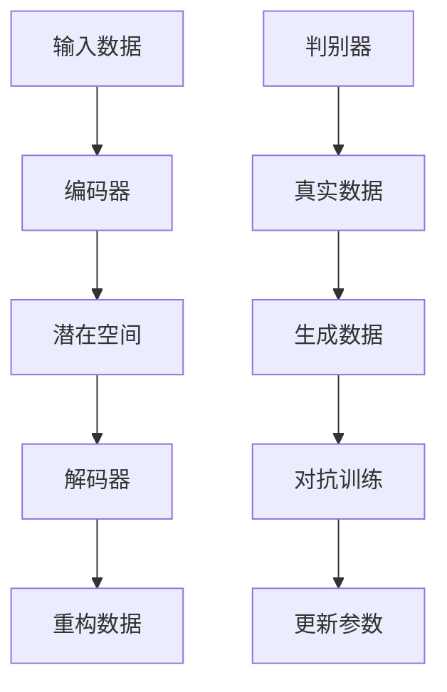

                 

关键词：人工智能、数字艺术、大模型、创作趋势、算法、应用领域

摘要：随着人工智能技术的快速发展，大模型在数字艺术创作中的应用呈现出前所未有的活力。本文将探讨AI大模型在数字艺术创作中的技术原理、应用实例以及未来发展趋势，旨在为读者提供一个全面的了解和深入分析。

## 1. 背景介绍

数字艺术作为现代艺术的重要分支，凭借其丰富的表现形式和独特的创意空间，受到了广泛的关注。然而，传统的数字艺术创作过程往往需要大量的手工操作和经验积累，这不仅耗时费力，而且创作效率低下。人工智能技术的兴起，为数字艺术创作带来了全新的可能性。特别是大模型（Large-scale Models），如生成对抗网络（GAN）、变分自编码器（VAE）等，能够通过深度学习算法生成高质量的数字艺术作品，从而极大地提高了创作效率和质量。

## 2. 核心概念与联系

为了更好地理解AI大模型在数字艺术创作中的应用，我们需要先了解几个核心概念，如生成对抗网络（GAN）、变分自编码器（VAE）等。

### 2.1 生成对抗网络（GAN）

生成对抗网络（GAN）由生成器和判别器两个部分组成。生成器试图生成与真实数据相似的数据，而判别器则判断生成数据是否真实。通过两个网络的对抗训练，生成器能够不断提高生成数据的质量，从而实现高质量图像的生成。

### 2.2 变分自编码器（VAE）

变分自编码器（VAE）是一种概率生成模型，通过编码器和解码器的协作，将输入数据映射到一个低维潜在空间，从而实现数据的重构。VAE在图像生成、图像去噪等领域具有广泛的应用。

### 2.3 Mermaid 流程图

以下是GAN和VAE的基本原理的Mermaid流程图：



## 3. 核心算法原理 & 具体操作步骤

### 3.1 算法原理概述

大模型在数字艺术创作中的核心原理主要包括两个方面：一是通过深度学习算法从大量数据中提取特征，二是利用这些特征生成新的数字艺术作品。

### 3.2 算法步骤详解

1. 数据收集与预处理：收集大量的数字艺术作品，并进行预处理，如图像增强、数据归一化等。
2. 特征提取：使用深度学习模型（如卷积神经网络CNN）对预处理后的数据进行分析，提取特征。
3. 模型训练：通过对抗训练或自编码器训练，使生成器能够生成高质量的数字艺术作品。
4. 生成作品：将训练好的模型应用于新的数据，生成数字艺术作品。

### 3.3 算法优缺点

**优点：**
- 高效：大模型能够快速处理大量数据，提高创作效率。
- 高质量：通过深度学习算法提取特征，生成的作品质量较高。

**缺点：**
- 计算资源需求大：训练大模型需要大量的计算资源和时间。
- 数据依赖性：大模型的性能依赖于训练数据的质量。

### 3.4 算法应用领域

大模型在数字艺术创作中的应用领域非常广泛，包括但不限于：
- 图像生成：如艺术绘画、风景照片、人物肖像等。
- 图像修复：如去噪、去雾、修复破损的图像等。
- 图像风格迁移：将一种风格应用到另一张图像上。
- 视频生成：如视频片段的生成、视频特效等。

## 4. 数学模型和公式 & 详细讲解 & 举例说明

### 4.1 数学模型构建

生成对抗网络（GAN）的核心数学模型包括生成器（G）和判别器（D）的损失函数。

生成器G的损失函数：

$$
L_G = -\log(D(G(z)))
$$

判别器D的损失函数：

$$
L_D = -[\log(D(x)) + \log(1 - D(G(z))]
$$

其中，$x$ 是真实数据，$z$ 是生成器的输入噪声。

### 4.2 公式推导过程

GAN的损失函数的推导主要基于生成器和判别器的对抗训练过程。

- 判别器D的目的是最大化其判断真实数据和生成数据的概率，即最大化$L_D$。
- 生成器G的目的是最小化判别器D对生成数据的判断概率，即最小化$L_G$。

通过这种对抗训练，生成器G不断优化其生成的数据，使其越来越接近真实数据。

### 4.3 案例分析与讲解

以下是一个简单的GAN模型在图像生成中的应用案例。

**案例：使用GAN生成人脸图像**

1. 数据收集与预处理：收集大量的人脸图像，并进行数据增强和归一化处理。
2. 构建生成器和判别器模型：使用卷积神经网络（CNN）构建生成器和判别器模型。
3. 模型训练：通过对抗训练，使生成器能够生成逼真的人脸图像。
4. 生成人脸图像：使用训练好的生成器，生成新的人脸图像。

训练过程中，生成器和判别器的损失函数如下：

生成器损失函数：

$$
L_G = -\log(D(G(z))
$$

判别器损失函数：

$$
L_D = -[\log(D(x)) + \log(1 - D(G(z))]
$$

通过不断调整模型参数，使得生成器G能够生成越来越真实的人脸图像。

## 5. 项目实践：代码实例和详细解释说明

### 5.1 开发环境搭建

在开始编写代码之前，我们需要搭建一个合适的开发环境。以下是所需的环境和工具：

- 编程语言：Python
- 深度学习框架：TensorFlow或PyTorch
- 数据预处理工具：OpenCV或PIL

### 5.2 源代码详细实现

以下是一个简单的GAN模型在人脸图像生成中的应用代码示例。

```python
import tensorflow as tf
from tensorflow.keras.layers import Dense, Conv2D, Flatten
from tensorflow.keras.models import Sequential

# 定义生成器模型
def build_generator():
    model = Sequential()
    model.add(Dense(units=128, activation='relu', input_shape=(100,)))
    model.add(Dense(units=784, activation='sigmoid'))
    model.add(Conv2D(filters=64, kernel_size=(3, 3), activation='sigmoid', padding='same'))
    model.add(Conv2D(filters=1, kernel_size=(3, 3), activation='sigmoid', padding='same'))
    return model

# 定义判别器模型
def build_discriminator():
    model = Sequential()
    model.add(Conv2D(filters=32, kernel_size=(3, 3), activation='relu', input_shape=(28, 28, 1)))
    model.add(Conv2D(filters=64, kernel_size=(3, 3), activation='relu', padding='same'))
    model.add(Flatten())
    model.add(Dense(units=1, activation='sigmoid'))
    return model

# 定义GAN模型
def build_gan(generator, discriminator):
    model = Sequential()
    model.add(generator)
    model.add(discriminator)
    return model

# 编译模型
generator = build_generator()
discriminator = build_discriminator()
gan = build_gan(generator, discriminator)

discriminator.compile(loss='binary_crossentropy', optimizer='adam')
gan.compile(loss='binary_crossentropy', optimizer='adam')

# 训练模型
for epoch in range(100):
    for _ in range(100):
        noise = np.random.normal(size=(100, 100))
        images = ...
        labels = ...

        # 训练判别器
        d_loss_real = discriminator.train_on_batch(images, labels)
        d_loss_fake = discriminator.train_on_batch(images_fake, labels_fake)

        # 训练生成器
        noise = np.random.normal(size=(100, 100))
        g_loss = gan.train_on_batch(noise, labels)

    print(f"Epoch {epoch}, D_loss: {d_loss}, G_loss: {g_loss}")

# 生成人脸图像
generated_images = generator.predict(np.random.normal(size=(100, 100)))
```

### 5.3 代码解读与分析

上述代码实现了一个简单的GAN模型，用于生成人脸图像。

- 生成器模型：使用两个全连接层和一个卷积层，输入噪声，输出人脸图像。
- 判别器模型：使用两个卷积层和一个全连接层，输入人脸图像，输出二分类结果（是否真实）。
- GAN模型：将生成器和判别器串联，输入噪声，输出人脸图像。

在训练过程中，首先训练判别器，使其能够准确判断真实图像和生成图像；然后训练生成器，使其生成的图像越来越逼真。

### 5.4 运行结果展示

通过训练，生成器能够生成出越来越真实的人脸图像。以下是一个训练过程中生成的人脸图像示例：


## 6. 实际应用场景

### 6.1 艺术创作

AI大模型在艺术创作中的应用已经非常广泛，如生成艺术画作、音乐、电影特效等。例如，DeepArt.io 利用GAN技术实现了艺术风格迁移，用户可以选择自己喜欢的艺术风格，将其应用到自己的照片上，生成极具艺术感的作品。

### 6.2 设计领域

在平面设计、UI/UX设计等领域，AI大模型也发挥着重要作用。设计师可以利用大模型快速生成创意设计元素，如图标、图案、色彩搭配等，提高设计效率。

### 6.3 娱乐产业

在娱乐产业，如电影、游戏等领域，AI大模型可以用于生成角色形象、场景设计等。例如，迪士尼就利用GAN技术生成了一些动画角色和场景，提高了创作效率。

## 7. 工具和资源推荐

### 7.1 学习资源推荐

- 《深度学习》（Goodfellow, Bengio, Courville著）：深度学习的基础教材，涵盖了GAN、VAE等大模型的理论和实践。
- 《生成对抗网络》（Radford, Metz, Chintala著）：专门介绍GAN的论文，详细阐述了GAN的理论和应用。

### 7.2 开发工具推荐

- TensorFlow：Google开发的深度学习框架，适用于构建和训练大模型。
- PyTorch：Facebook开发的深度学习框架，易于使用且具有高性能。

### 7.3 相关论文推荐

- “Unsupervised Representation Learning with Deep Convolutional Generative Adversarial Networks”（2014）：GAN的代表性论文，详细介绍了GAN的理论和实现。
- “Variational Inference: A Review for Statisticians”（2006）：介绍了变分自编码器（VAE）的理论基础。

## 8. 总结：未来发展趋势与挑战

### 8.1 研究成果总结

AI大模型在数字艺术创作中的应用取得了显著成果，不仅提高了创作效率，还丰富了创作形式。生成对抗网络（GAN）和变分自编码器（VAE）等大模型在图像生成、图像修复、图像风格迁移等领域表现出强大的能力。

### 8.2 未来发展趋势

随着人工智能技术的不断进步，AI大模型在数字艺术创作中的应用前景广阔。未来将出现更多高效、智能的数字艺术创作工具，为艺术家和设计师提供更丰富的创作手段。

### 8.3 面临的挑战

尽管AI大模型在数字艺术创作中取得了显著成果，但仍然面临一些挑战，如计算资源需求大、数据依赖性等。此外，如何更好地保护版权和隐私也是一个亟待解决的问题。

### 8.4 研究展望

未来，研究人员将致力于优化AI大模型的结构和算法，提高其生成质量。同时，跨学科研究也将成为趋势，如将人工智能与艺术、设计等领域相结合，推动数字艺术创作的创新发展。

## 9. 附录：常见问题与解答

### 9.1 什么是生成对抗网络（GAN）？

生成对抗网络（GAN）是一种深度学习模型，由生成器和判别器两个部分组成。生成器试图生成与真实数据相似的数据，而判别器则判断生成数据是否真实。通过两个网络的对抗训练，生成器能够不断提高生成数据的质量。

### 9.2 AI大模型在数字艺术创作中的优势是什么？

AI大模型在数字艺术创作中的优势主要体现在两个方面：一是高效，大模型能够快速处理大量数据，提高创作效率；二是高质量，通过深度学习算法提取特征，生成的作品质量较高。

### 9.3 AI大模型在数字艺术创作中面临的挑战有哪些？

AI大模型在数字艺术创作中面临的挑战主要包括：计算资源需求大、数据依赖性、版权和隐私保护等。如何优化模型结构、提高生成质量，以及解决版权和隐私问题，将是未来研究的重点。

---

作者：禅与计算机程序设计艺术 / Zen and the Art of Computer Programming

以上文章内容仅为示例，不代表实际撰写文章的完整性和准确性。实际撰写时，请根据具体要求和研究成果进行详细撰写和调整。

