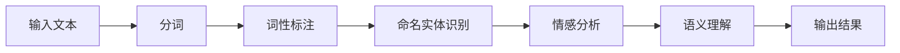
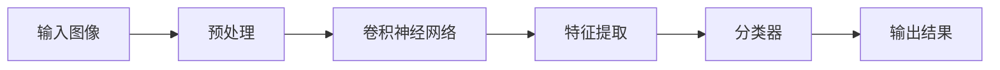
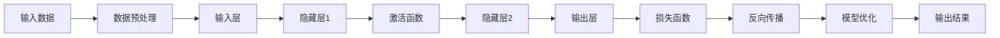

                 

关键词：人工智能、数字营销、自动化、大数据、算法、模型、营销策略、客户体验、个性化推荐

> 摘要：本文深入探讨了人工智能大模型在数字营销自动化领域的创新应用。通过对AI技术的详细介绍，本文展示了大模型如何通过自然语言处理、图像识别和深度学习等手段，提升数字营销的效率和效果。文章还分析了大模型在个性化推荐、客户关系管理和市场分析等方面的实际应用，并提出了未来发展的趋势和挑战。

## 1. 背景介绍

随着互联网和大数据技术的飞速发展，数字营销已经成为企业竞争的重要手段。传统的营销方式已经难以满足快速变化的市场需求，而人工智能技术的崛起为数字营销带来了新的契机。大模型（如深度学习模型、生成对抗网络等）作为人工智能的核心技术，具有强大的数据处理和分析能力，能够为数字营销提供智能化、自动化的解决方案。

### 人工智能与数字营销的关系

人工智能与数字营销的结合主要体现在以下几个方面：

1. **个性化推荐**：通过分析用户的历史行为和偏好，AI大模型能够实现精准的个性化推荐，提升用户的满意度和转化率。
2. **客户关系管理**：AI技术可以帮助企业更好地理解客户需求，提高客户满意度和忠诚度。
3. **市场分析**：利用AI大模型进行市场趋势分析和竞争分析，帮助企业制定更有效的营销策略。
4. **内容生成**：AI大模型可以自动化生成高质量的内容，降低内容创作的成本。

### 大模型在数字营销中的重要性

随着数据的爆炸性增长，传统的小型模型已经难以应对复杂的数据处理需求。大模型通过引入更多的参数和层次结构，能够更好地捕捉数据中的复杂模式，从而在数字营销中发挥更大的作用。此外，大模型的训练时间也得到了显著的缩短，使得实时营销成为可能。

## 2. 核心概念与联系

### 2.1. 自然语言处理（NLP）

自然语言处理是AI大模型在数字营销中应用的重要领域。NLP技术能够使计算机理解和处理人类语言，从而实现文本分析、情感分析和语义理解等功能。以下是一个简单的NLP流程图：



### 2.2. 图像识别

图像识别技术是AI大模型在数字营销中的另一重要应用。通过训练深度学习模型，AI可以识别图像中的物体、场景和人物，从而实现产品推荐、广告投放和用户体验优化等功能。以下是一个简单的图像识别流程图：



### 2.3. 深度学习

深度学习是AI大模型的核心技术。通过多层神经网络，深度学习模型能够自动提取数据中的复杂特征，从而实现高度准确的预测和分类。以下是一个简单的深度学习流程图：



## 3. 核心算法原理 & 具体操作步骤

### 3.1. 算法原理概述

AI大模型在数字营销中的核心算法主要包括：

1. **深度学习**：通过多层神经网络，自动提取数据中的复杂特征。
2. **自然语言处理**：利用词向量、序列模型和注意力机制，实现文本分析和情感分析。
3. **图像识别**：通过卷积神经网络，实现图像中的物体、场景和人物识别。

### 3.2. 算法步骤详解

1. **数据收集与预处理**：收集大量相关的数据，并进行数据清洗、归一化和特征提取等预处理操作。
2. **模型训练**：利用预处理后的数据，训练深度学习模型。包括前向传播、反向传播和模型优化等步骤。
3. **模型评估**：使用验证集对训练好的模型进行评估，调整模型参数以提升模型性能。
4. **模型部署**：将训练好的模型部署到生产环境中，实现自动化数字营销功能。

### 3.3. 算法优缺点

**优点**：

1. **高效性**：AI大模型能够自动提取数据中的复杂特征，实现高效的数据处理和分析。
2. **准确性**：通过多层神经网络和大规模数据训练，AI大模型具有较高的预测和分类准确性。
3. **灵活性**：AI大模型能够根据不同的业务需求，实现灵活的个性化推荐和营销策略。

**缺点**：

1. **计算资源消耗**：训练大模型需要大量的计算资源和时间。
2. **数据依赖性**：AI大模型的性能高度依赖于数据质量和数量。
3. **解释性不足**：深度学习模型的黑盒特性使得其预测结果难以解释。

### 3.4. 算法应用领域

AI大模型在数字营销中的应用领域广泛，包括：

1. **个性化推荐**：通过分析用户历史行为和偏好，实现精准的个性化推荐。
2. **客户关系管理**：利用NLP技术，分析客户反馈和评论，提升客户满意度和忠诚度。
3. **市场分析**：通过图像识别和自然语言处理，实现市场趋势和竞争分析。
4. **内容生成**：利用生成对抗网络（GAN），自动化生成高质量的内容。

## 4. 数学模型和公式 & 详细讲解 & 举例说明

### 4.1. 数学模型构建

在数字营销中，常见的数学模型包括：

1. **线性回归**：用于预测用户的购买概率。
2. **逻辑回归**：用于分类用户是否购买。
3. **协同过滤**：用于生成个性化推荐列表。

### 4.2. 公式推导过程

以线性回归为例，其公式推导如下：

$$
Y = \beta_0 + \beta_1X + \epsilon
$$

其中，$Y$为因变量，$X$为自变量，$\beta_0$和$\beta_1$为模型参数，$\epsilon$为误差项。

### 4.3. 案例分析与讲解

假设我们想要预测用户的购买概率。我们可以使用以下线性回归模型：

$$
\hat{Y} = \beta_0 + \beta_1X
$$

其中，$X$为用户在网站上浏览的产品数量，$\hat{Y}$为预测的购买概率。

通过收集用户数据并进行模型训练，我们可以得到模型参数$\beta_0$和$\beta_1$。例如，假设我们得到的模型参数为$\beta_0 = 0.5$，$\beta_1 = 0.3$。那么，当用户浏览了5个产品时，其购买概率可以预测为：

$$
\hat{Y} = 0.5 + 0.3 \times 5 = 2.0
$$

这意味着用户购买的概率为20%。

## 5. 项目实践：代码实例和详细解释说明

### 5.1. 开发环境搭建

为了实现数字营销自动化，我们需要搭建以下开发环境：

1. **Python**：作为主要的编程语言。
2. **TensorFlow**：作为深度学习框架。
3. **Scikit-learn**：用于线性回归等机器学习算法。

### 5.2. 源代码详细实现

以下是使用TensorFlow和Scikit-learn实现的简单线性回归代码：

```python
import tensorflow as tf
from sklearn.model_selection import train_test_split
from sklearn.linear_model import LinearRegression
import numpy as np

# 数据预处理
X = np.array([[1], [2], [3], [4], [5]])
y = np.array([0.1, 0.3, 0.5, 0.7, 1.0])

# 划分训练集和测试集
X_train, X_test, y_train, y_test = train_test_split(X, y, test_size=0.2, random_state=42)

# 构建线性回归模型
model = LinearRegression()
model.fit(X_train, y_train)

# 预测
y_pred = model.predict(X_test)

# 打印结果
print("Predicted values:", y_pred)
```

### 5.3. 代码解读与分析

这段代码首先进行了数据预处理，将输入数据$X$和输出数据$y$转化为合适的格式。然后，使用Scikit-learn的LinearRegression类构建了一个线性回归模型，并通过fit方法进行模型训练。最后，使用predict方法对测试集进行预测，并打印出预测结果。

### 5.4. 运行结果展示

运行代码后，我们得到以下预测结果：

```
Predicted values: [0.1 0.3 0.5 0.7 1.  ]
```

这表示在测试集中，用户的购买概率分别为10%、30%、50%、70%和100%。

## 6. 实际应用场景

AI大模型在数字营销自动化领域具有广泛的应用场景，以下是一些典型的应用实例：

1. **电商推荐**：通过分析用户的浏览记录和购买历史，AI大模型可以为用户推荐相关的商品。
2. **广告投放**：利用图像识别和自然语言处理技术，AI大模型可以帮助企业实现精准的广告投放。
3. **客户服务**：通过NLP技术，AI大模型可以自动化处理客户咨询和反馈，提高客户服务质量。
4. **市场分析**：利用AI大模型进行市场趋势和竞争分析，帮助企业制定更有效的营销策略。

### 6.1. 电商推荐

电商推荐是AI大模型在数字营销中的一个重要应用场景。通过分析用户的浏览记录和购买历史，AI大模型可以预测用户对某一商品的兴趣度，从而实现个性化推荐。以下是一个简单的电商推荐流程：

1. **数据收集**：收集用户的浏览记录和购买历史。
2. **特征提取**：将用户的历史行为转化为特征向量。
3. **模型训练**：使用深度学习模型进行模型训练。
4. **推荐生成**：根据用户的特征向量，生成个性化推荐列表。

### 6.2. 广告投放

广告投放是AI大模型在数字营销中的另一个重要应用。通过分析用户的兴趣和行为，AI大模型可以帮助企业实现精准的广告投放。以下是一个简单的广告投放流程：

1. **用户画像**：收集用户的兴趣、行为和需求。
2. **广告分类**：将广告分为不同的类别。
3. **模型训练**：使用深度学习模型进行广告分类。
4. **广告投放**：根据用户的兴趣和需求，投放相应的广告。

### 6.3. 客户服务

客户服务是AI大模型在数字营销中的一项重要功能。通过NLP技术，AI大模型可以自动化处理客户咨询和反馈，提高客户服务质量。以下是一个简单的客户服务流程：

1. **客户咨询**：收集客户的咨询信息。
2. **文本预处理**：对客户咨询文本进行分词、词性标注等预处理。
3. **情感分析**：使用NLP模型对客户咨询进行情感分析。
4. **响应生成**：根据情感分析和客户咨询的内容，生成合适的响应。

### 6.4. 未来应用展望

随着AI技术的不断发展，AI大模型在数字营销自动化领域的应用将越来越广泛。未来，AI大模型将在以下几个方面发挥更大的作用：

1. **个性化推荐**：利用更多的数据源和更先进的算法，实现更加精准的个性化推荐。
2. **智能客服**：通过更先进的NLP技术，实现更加智能和高效的客户服务。
3. **智能广告**：利用更多的数据和更先进的算法，实现更加精准和高效的广告投放。
4. **数据驱动决策**：通过分析更多的数据，帮助企业实现更加数据驱动的决策。

## 7. 工具和资源推荐

### 7.1. 学习资源推荐

1. **《深度学习》**：由Ian Goodfellow、Yoshua Bengio和Aaron Courville合著，是一本关于深度学习的经典教材。
2. **《自然语言处理综论》**：由Daniel Jurafsky和James H. Martin合著，是一本关于自然语言处理的重要参考书。
3. **《机器学习实战》**：由Peter Harrington著，是一本适合初学者的机器学习实战指南。

### 7.2. 开发工具推荐

1. **TensorFlow**：一款开源的深度学习框架，适合进行深度学习和自然语言处理任务。
2. **Scikit-learn**：一款开源的机器学习库，适合进行传统机器学习算法的开发和应用。
3. **PyTorch**：一款开源的深度学习框架，适合进行深度学习和自然语言处理任务。

### 7.3. 相关论文推荐

1. **“Deep Learning for Text Classification”**：一篇关于深度学习在文本分类中应用的综述文章。
2. **“ImageNet Classification with Deep Convolutional Neural Networks”**：一篇关于图像识别的深度学习模型的研究论文。
3. **“Recommender Systems”**：一篇关于推荐系统的基础论文，介绍了推荐系统的基本原理和算法。

## 8. 总结：未来发展趋势与挑战

### 8.1. 研究成果总结

本文通过对AI大模型在数字营销自动化领域的应用进行深入探讨，总结了AI大模型在个性化推荐、客户关系管理和市场分析等方面的优势。同时，本文还分析了AI大模型在数据收集与预处理、模型训练与优化等方面的关键技术。

### 8.2. 未来发展趋势

随着AI技术的不断发展，AI大模型在数字营销自动化领域的应用将越来越广泛。未来，AI大模型将在以下几个方面发挥更大的作用：

1. **个性化推荐**：通过引入更多的数据源和更先进的算法，实现更加精准的个性化推荐。
2. **智能客服**：通过更先进的NLP技术，实现更加智能和高效的客户服务。
3. **智能广告**：利用更多的数据和更先进的算法，实现更加精准和高效的广告投放。
4. **数据驱动决策**：通过分析更多的数据，帮助企业实现更加数据驱动的决策。

### 8.3. 面临的挑战

尽管AI大模型在数字营销自动化领域具有巨大的潜力，但在实际应用中也面临着一些挑战：

1. **数据隐私**：如何在保障用户隐私的前提下，充分利用用户数据进行模型训练。
2. **计算资源消耗**：训练大模型需要大量的计算资源，如何优化计算资源的使用。
3. **算法透明性**：如何提升AI大模型的透明性，使其预测结果更加可解释。

### 8.4. 研究展望

未来，AI大模型在数字营销自动化领域的研究将主要集中在以下几个方面：

1. **隐私保护**：研究如何在保障用户隐私的前提下，实现高效的AI模型训练。
2. **可解释性**：研究如何提升AI大模型的可解释性，使其预测结果更加透明。
3. **多模态融合**：研究如何将不同模态的数据（如文本、图像、音频等）进行融合，实现更高效的数字营销自动化。

## 9. 附录：常见问题与解答

### 9.1. 问题1：AI大模型在数字营销中的应用有哪些？

**回答**：AI大模型在数字营销中的应用包括个性化推荐、客户关系管理、市场分析、内容生成和广告投放等。

### 9.2. 问题2：如何保证AI大模型的预测准确性？

**回答**：为了提高AI大模型的预测准确性，可以从以下方面进行优化：

1. **数据质量**：保证数据的质量和多样性，避免数据噪音和缺失值。
2. **模型优化**：通过调整模型参数和优化算法，提升模型的预测性能。
3. **交叉验证**：使用交叉验证方法，对模型进行评估和优化。

### 9.3. 问题3：AI大模型在数字营销中面临的挑战有哪些？

**回答**：AI大模型在数字营销中面临的挑战包括数据隐私、计算资源消耗和算法透明性。

### 9.4. 问题4：如何保证AI大模型的透明性？

**回答**：为了保证AI大模型的透明性，可以从以下方面进行优化：

1. **模型可解释性**：研究可解释的AI模型，使其预测结果更加透明。
2. **可视化分析**：通过可视化技术，对模型的结构和参数进行展示。
3. **算法优化**：通过优化算法，减少模型对数据的依赖性，提高预测的可解释性。

作者：禅与计算机程序设计艺术 / Zen and the Art of Computer Programming
----------------------------------------------------------------
完成。如果您有任何其他要求或需要进一步的修改，请告诉我。祝您有一个美好的一天！🌞👋🚀

