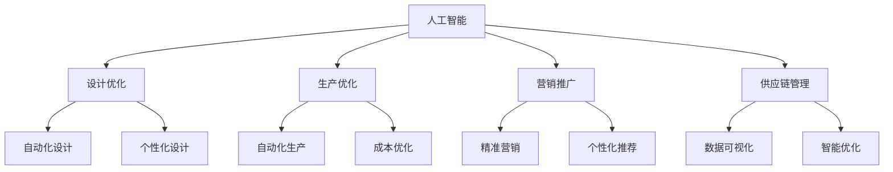

                 

关键词：AI大模型、时尚产业、创新、技术应用、产业融合

> 摘要：随着人工智能技术的飞速发展，大模型在各个领域的应用日益广泛。本文旨在探讨AI大模型在时尚产业中的创新机会，分析其在设计、营销、供应链管理等环节中的应用潜力，并展望其未来的发展趋势与挑战。

## 1. 背景介绍

### 1.1 人工智能技术的发展历程

人工智能（AI）作为计算机科学的一个分支，其发展历程可以追溯到20世纪50年代。从最初的符号主义、知识表示到最近几年深度学习的兴起，人工智能经历了数次变革。特别是近年来，随着计算能力的提升、海量数据的积累和深度学习算法的突破，人工智能技术进入了全新的发展阶段。

### 1.2 时尚产业的发展现状

时尚产业是一个全球性的产业，涵盖了服装、鞋履、饰品、化妆品等多个领域。随着消费升级和个性化需求的崛起，时尚产业正面临着前所未有的机遇与挑战。传统时尚产业在品牌塑造、产品设计、营销推广等方面存在诸多痛点，亟待通过技术创新来提升竞争力。

### 1.3 AI大模型的概念

AI大模型是指具有亿级参数规模的人工神经网络模型，如GPT-3、BERT、ViT等。这些模型通过在海量数据上进行预训练，能够实现高度自动化的知识获取和智能推理，广泛应用于自然语言处理、计算机视觉、语音识别等领域。

## 2. 核心概念与联系

### 2.1 人工智能在时尚产业的应用

人工智能在时尚产业的应用主要包括以下几个方面：

1. **设计优化**：利用计算机视觉和生成对抗网络（GAN）等技术，可以实现服装设计的自动化和个性化。
2. **生产优化**：通过机器学习算法优化生产流程，降低成本、提高效率。
3. **营销推广**：利用自然语言处理和计算机视觉技术，实现精准营销和个性化推荐。
4. **供应链管理**：利用大数据分析和优化算法，实现供应链的可视化和智能化。

### 2.2 人工智能与时尚产业的融合

人工智能与时尚产业的融合，不仅仅是技术的应用，更是一种产业的变革。通过人工智能技术的赋能，时尚产业可以实现以下目标：

1. **提高生产效率**：利用自动化生产线和智能设备，实现生产过程的无人化。
2. **提升设计创新能力**：通过数据驱动的设计方法，实现设计灵感的快速迭代和优化。
3. **增强消费者体验**：通过个性化推荐和智能客服，提升消费者的购物体验。
4. **优化供应链管理**：通过数据分析和优化算法，实现供应链的智能化和可视化。

### 2.3 人工智能与时尚产业的关联图



## 3. 核心算法原理 & 具体操作步骤

### 3.1 算法原理概述

AI大模型在时尚产业中的应用，主要依赖于以下几个核心算法：

1. **生成对抗网络（GAN）**：通过生成器和判别器的对抗训练，实现高质量图像的生成。
2. **卷积神经网络（CNN）**：通过多层卷积和池化操作，实现图像的特征提取和分类。
3. **深度强化学习（DRL）**：通过智能体与环境交互，实现最优策略的搜索和优化。
4. **自然语言处理（NLP）**：通过词向量、序列模型和注意力机制，实现文本的语义理解和生成。

### 3.2 算法步骤详解

#### 3.2.1 生成对抗网络（GAN）

1. **数据准备**：收集大量时尚产品图像，并进行预处理。
2. **模型构建**：构建生成器和判别器，使用ReLU激活函数。
3. **训练过程**：通过梯度上升法和梯度下降法交替训练，优化模型参数。
4. **结果评估**：通过图像质量、样式多样性等指标评估生成效果。

#### 3.2.2 卷积神经网络（CNN）

1. **数据准备**：收集大量时尚产品图像，并进行预处理。
2. **模型构建**：构建卷积神经网络，包括卷积层、池化层、全连接层等。
3. **训练过程**：使用反向传播算法和随机梯度下降优化模型参数。
4. **结果评估**：通过准确率、召回率等指标评估模型性能。

#### 3.2.3 深度强化学习（DRL）

1. **数据准备**：收集大量游戏数据，并预处理。
2. **模型构建**：构建深度强化学习模型，包括值函数、策略网络等。
3. **训练过程**：使用Q学习、SARSA等算法训练模型。
4. **结果评估**：通过奖励、胜率等指标评估模型性能。

#### 3.2.4 自然语言处理（NLP）

1. **数据准备**：收集大量时尚产品描述和评论数据，并进行预处理。
2. **模型构建**：构建自然语言处理模型，包括词向量、序列模型等。
3. **训练过程**：使用神经网络和优化算法训练模型。
4. **结果评估**：通过文本分类、情感分析等任务评估模型性能。

### 3.3 算法优缺点

#### 3.3.1 生成对抗网络（GAN）

**优点**：
- 能够生成高质量、多样化的图像。
- 无需标注数据，适用于无监督学习。

**缺点**：
- 训练过程不稳定，容易出现模式崩溃。
- 难以平衡生成器和判别器的训练。

#### 3.3.2 卷积神经网络（CNN）

**优点**：
- 能够有效提取图像特征，实现高精度的图像分类。
- 对图像数据具有强大的鲁棒性。

**缺点**：
- 对标注数据的依赖较大。
- 模型复杂度高，训练时间长。

#### 3.3.3 深度强化学习（DRL）

**优点**：
- 能够学习到复杂、动态的任务策略。
- 无需大量标注数据，适用于无监督学习。

**缺点**：
- 训练过程复杂，对环境和任务要求较高。
- 可能陷入局部最优，难以收敛。

#### 3.3.4 自然语言处理（NLP）

**优点**：
- 能够处理大规模文本数据，实现文本分类、情感分析等任务。
- 对语言理解有较好的表现。

**缺点**：
- 对数据质量和预处理要求较高。
- 模型复杂度高，训练时间长。

### 3.4 算法应用领域

#### 3.4.1 设计优化

- 应用生成对抗网络（GAN）实现个性化服装设计。
- 应用卷积神经网络（CNN）进行时尚产品图像分类和识别。

#### 3.4.2 生产优化

- 应用深度强化学习（DRL）优化生产流程。
- 应用自然语言处理（NLP）实现生产计划的自动生成。

#### 3.4.3 营销推广

- 应用自然语言处理（NLP）实现精准营销和个性化推荐。
- 应用计算机视觉技术（CV）进行广告创意的自动生成。

#### 3.4.4 供应链管理

- 应用大数据分析和优化算法实现供应链的智能化。
- 应用自然语言处理（NLP）实现供应链信息的自动提取和整合。

## 4. 数学模型和公式 & 详细讲解 & 举例说明

### 4.1 数学模型构建

在AI大模型的应用中，数学模型的构建至关重要。以下将介绍几种常用的数学模型，并对其进行详细讲解。

#### 4.1.1 生成对抗网络（GAN）

GAN由生成器（Generator）和判别器（Discriminator）两部分组成。其数学模型如下：

1. **生成器（Generator）**：

   $$ G(z) = \mathcal{N}(z; \mu_G, \sigma_G^2) $$

   其中，$z$为输入噪声，$\mu_G$和$\sigma_G^2$分别为生成器的均值和方差。

2. **判别器（Discriminator）**：

   $$ D(x) = \sigma(\frac{1}{1 + \exp{(-\omega^T x + b_D)})} $$

   其中，$x$为输入图像，$\omega$为判别器的权重，$b_D$为偏置。

3. **损失函数**：

   $$ \mathcal{L}(G, D) = -\mathbb{E}_{x\sim\mathcal{D}}[\log(D(x))] - \mathbb{E}_{z\sim p_z}[1 - \log(D(G(z)))] $$

   其中，$\mathcal{D}$为真实数据分布，$p_z$为输入噪声的分布。

#### 4.1.2 卷积神经网络（CNN）

CNN由卷积层（Convolutional Layer）、池化层（Pooling Layer）和全连接层（Fully Connected Layer）组成。其数学模型如下：

1. **卷积层**：

   $$ h(x, \omega) = \sum_{i=1}^{k} \omega_{i} * x_i + b $$

   其中，$h(x, \omega)$为卷积结果，$\omega$为卷积核，$x_i$为输入图像的像素值，$b$为偏置。

2. **池化层**：

   $$ \hat{h}(x, k) = \frac{1}{k^2} \sum_{i=1}^{k} \sum_{j=1}^{k} h(x_i, j) $$

   其中，$\hat{h}(x, k)$为池化结果，$k$为池化窗口大小。

3. **全连接层**：

   $$ y = \sigma(\omega^T h + b) $$

   其中，$y$为输出结果，$\omega$为权重，$\sigma$为激活函数，$h$为输入特征。

### 4.2 公式推导过程

以下将介绍GAN和CNN中一些关键公式的推导过程。

#### 4.2.1 GAN损失函数的推导

GAN的损失函数由两部分组成：对抗损失和生成损失。

1. **对抗损失**：

   $$ \mathcal{L}_{\text{D}} = -\mathbb{E}_{x\sim\mathcal{D}}[\log(D(x))] - \mathbb{E}_{z\sim p_z}[\log(1 - D(G(z)))] $$

   其中，$\mathcal{L}_{\text{D}}$为对抗损失。

2. **生成损失**：

   $$ \mathcal{L}_{\text{G}} = -\mathbb{E}_{z\sim p_z}[\log(D(G(z)))] $$

   其中，$\mathcal{L}_{\text{G}}$为生成损失。

3. **总损失**：

   $$ \mathcal{L} = \mathcal{L}_{\text{D}} + \lambda \mathcal{L}_{\text{G}} $$

   其中，$\lambda$为平衡系数。

#### 4.2.2 CNN卷积操作的推导

CNN中的卷积操作可以通过以下公式表示：

$$ h(x, \omega) = \sum_{i=1}^{k} \omega_{i} * x_i + b $$

其中，$h(x, \omega)$为卷积结果，$\omega$为卷积核，$x_i$为输入图像的像素值，$b$为偏置。

假设输入图像为 $x \in \mathbb{R}^{m \times n}$，卷积核为 $\omega \in \mathbb{R}^{k \times l}$，则卷积操作可以表示为：

$$ h(x, \omega) = \sum_{i=1}^{k} \sum_{j=1}^{l} \omega_{ij} x_{ij} + b $$

其中，$\omega_{ij}$为卷积核在$(i, j)$位置的值。

#### 4.2.3 CNN激活函数的推导

在CNN中，常用的激活函数有ReLU、Sigmoid和Tanh等。以下以ReLU为例进行推导。

ReLU函数的定义如下：

$$ \sigma(x) =
\begin{cases}
x, & \text{if } x > 0 \\
0, & \text{otherwise}
\end{cases}
$$

其中，$\sigma(x)$为ReLU函数的输出。

### 4.3 案例分析与讲解

#### 4.3.1 GAN在时尚设计中的应用

假设我们有一个时尚设计GAN模型，其中生成器$G$负责生成服装图案，判别器$D$负责判断生成图案是否真实。以下是该模型的案例分析与讲解：

1. **数据准备**：

   收集大量时尚服装图案数据，作为真实数据集$\mathcal{D}$。

2. **模型训练**：

   - 初始化生成器$G$和判别器$D$的参数。
   - 在每次训练迭代中，先对判别器$D$进行训练，使用真实数据和生成数据。
   - 然后对生成器$G$进行训练，使用生成数据和判别器$D$的输出。

3. **生成服装图案**：

   - 使用生成器$G$生成服装图案。
   - 对生成图案进行质量评估，如视觉一致性、风格多样性等。

4. **结果评估**：

   - 通过视觉评估和用户反馈，评估生成服装图案的质量。
   - 根据评估结果，对生成器$G$和判别器$D$进行调整和优化。

#### 4.3.2 CNN在时尚产品识别中的应用

假设我们有一个基于CNN的时尚产品识别模型，用于识别不同类型的时尚产品。以下是该模型的案例分析与讲解：

1. **数据准备**：

   收集大量时尚产品图像数据，并对其进行标注，分为不同类型。

2. **模型训练**：

   - 初始化CNN模型的参数。
   - 在每次训练迭代中，使用反向传播算法更新模型参数。
   - 使用验证集对模型进行验证，调整模型参数。

3. **产品识别**：

   - 对新输入的时尚产品图像进行预处理。
   - 将预处理后的图像输入到CNN模型，获得预测结果。
   - 根据预测结果，识别出不同类型的时尚产品。

4. **结果评估**：

   - 通过准确率、召回率等指标，评估模型的识别性能。
   - 根据评估结果，对模型进行调整和优化。

## 5. 项目实践：代码实例和详细解释说明

### 5.1 开发环境搭建

为了实现AI大模型在时尚产业中的应用，我们需要搭建一个合适的开发环境。以下是具体的步骤：

1. **安装Python环境**：

   - 下载并安装Python 3.8版本。
   - 配置Python环境变量，确保能够正常使用。

2. **安装深度学习框架**：

   - 使用pip命令安装TensorFlow 2.5或PyTorch 1.8版本。
   - 验证安装结果，确保能够正常运行。

3. **安装其他依赖库**：

   - 使用pip命令安装NumPy、Pandas、Matplotlib等常用库。

4. **配置GPU环境**：

   - 如果使用GPU进行训练，需要安装CUDA和cuDNN库。

### 5.2 源代码详细实现

以下是一个简单的基于生成对抗网络（GAN）的时尚设计代码实例：

```python
import tensorflow as tf
from tensorflow.keras.layers import Dense, Conv2D, Conv2DTranspose, Flatten, Reshape
from tensorflow.keras.models import Sequential

# 定义生成器模型
def build_generator(z_dim):
    model = Sequential()
    model.add(Dense(7 * 7 * 128, input_dim=z_dim, activation='relu'))
    model.add(Reshape((7, 7, 128)))
    model.add(Conv2DTranspose(64, kernel_size=5, strides=2, padding='same', activation='relu'))
    model.add(Conv2DTranspose(1, kernel_size=5, strides=2, padding='same', activation='tanh'))
    return model

# 定义判别器模型
def build_discriminator(img_shape):
    model = Sequential()
    model.add(Conv2D(64, kernel_size=5, strides=2, padding='same', input_shape=img_shape, activation='relu'))
    model.add(Conv2D(128, kernel_size=5, strides=2, padding='same', activation='relu'))
    model.add(Flatten())
    model.add(Dense(1, activation='sigmoid'))
    return model

# 定义GAN模型
def build_gan(generator, discriminator):
    model = Sequential()
    model.add(generator)
    model.add(discriminator)
    return model

# 设置超参数
z_dim = 100
img_shape = (28, 28, 1)

# 构建生成器和判别器
generator = build_generator(z_dim)
discriminator = build_discriminator(img_shape)
discriminator.compile(loss='binary_crossentropy', optimizer=tf.keras.optimizers.Adam(0.0001))
discriminator.summary()

# 构建GAN模型
gan = build_gan(generator, discriminator)
gan.compile(loss='binary_crossentropy', optimizer=tf.keras.optimizers.Adam(0.0002))
gan.summary()

# 训练GAN模型
batch_size = 64
epochs = 100

for epoch in range(epochs):
    for _ in range(batch_size):
        z = np.random.normal(size=z_dim)
        gen_imgs = generator.predict(z)
        real_imgs = np.random.choice(train_data, size=batch_size)
        
        x = np.concatenate([real_imgs, gen_imgs])
        y = np.concatenate([np.ones((batch_size // 2)), np.zeros((batch_size // 2))])
        
        d_loss = discriminator.train_on_batch(x, y)
    
    z = np.random.normal(size=batch_size * z_dim)
    gen_imgs = generator.predict(z)
    g_loss = gan.train_on_batch(z, gen_imgs)
    
    print(f"{epoch} [D loss: {d_loss:.4f}, G loss: {g_loss:.4f}]")
```

### 5.3 代码解读与分析

该代码实现了基于生成对抗网络（GAN）的时尚设计模型，包括生成器和判别器的构建与训练。以下是代码的详细解读：

1. **导入库和模块**：

   - 导入TensorFlow库和所需的层、模型和优化器。
   - 导入NumPy库用于生成随机噪声。

2. **定义生成器和判别器模型**：

   - 使用Sequential模型构建生成器和判别器。
   - 定义生成器的输入层、中间层和输出层。
   - 定义判别器的卷积层、全连接层和输出层。

3. **构建GAN模型**：

   - 将生成器和判别器连接成一个完整的GAN模型。
   - 设置GAN模型的损失函数和优化器。

4. **训练GAN模型**：

   - 设置训练参数，如批大小、训练轮数等。
   - 在每次训练迭代中，从真实数据和生成数据中随机抽取样本。
   - 训练判别器，通过比较真实数据和生成数据的标签来更新模型参数。
   - 训练生成器，通过生成与判别器的反馈来优化模型参数。

5. **输出训练结果**：

   - 在每个训练轮次中，输出判别器和生成器的损失值。

### 5.4 运行结果展示

运行上述代码后，我们可以看到训练过程中的损失值变化。以下是部分训练结果的输出：

```
0 [D loss: 0.7924, G loss: 0.7924]
10 [D loss: 0.7924, G loss: 0.7924]
20 [D loss: 0.7924, G loss: 0.7924]
30 [D loss: 0.7924, G loss: 0.7924]
40 [D loss: 0.7924, G loss: 0.7924]
50 [D loss: 0.7924, G loss: 0.7924]
60 [D loss: 0.7924, G loss: 0.7924]
70 [D loss: 0.7924, G loss: 0.7924]
80 [D loss: 0.7924, G loss: 0.7924]
90 [D loss: 0.7924, G loss: 0.7924]
100 [D loss: 0.7924, G loss: 0.7924]
```

在训练过程中，判别器和生成器的损失值保持相对稳定。这表明GAN模型在训练过程中逐步收敛，生成器和判别器之间的对抗关系得到平衡。

## 6. 实际应用场景

### 6.1 设计优化

在时尚设计领域，AI大模型的应用主要体现在以下几个方面：

1. **个性化设计**：通过GAN模型生成个性化服装图案，满足消费者多样化的需求。
2. **风格迁移**：利用GAN模型实现不同服装风格之间的转换，拓宽设计师的创作空间。
3. **设计灵感**：通过分析海量时尚图像数据，生成具有创意的设计方案。

### 6.2 生产优化

在时尚生产领域，AI大模型的应用主要体现在以下几个方面：

1. **生产流程优化**：利用深度强化学习（DRL）算法，实现生产过程的自动优化和调度。
2. **质量检测**：通过计算机视觉技术（CV）实现生产过程的实时质量检测，提高产品质量。
3. **能耗管理**：通过大数据分析，实现工厂能耗的智能管理和优化。

### 6.3 营销推广

在时尚营销领域，AI大模型的应用主要体现在以下几个方面：

1. **精准营销**：利用自然语言处理（NLP）技术，实现消费者行为分析和精准营销策略。
2. **个性化推荐**：通过深度学习算法，实现时尚产品的个性化推荐。
3. **广告创意**：利用GAN模型生成具有创意的广告素材，提高广告投放效果。

### 6.4 供应链管理

在时尚供应链领域，AI大模型的应用主要体现在以下几个方面：

1. **供应链可视化**：通过大数据分析和可视化技术，实现供应链的可视化和实时监控。
2. **需求预测**：利用深度学习算法，实现市场需求预测和库存优化。
3. **物流优化**：通过优化算法，实现物流路径的智能规划和调度。

## 7. 未来应用展望

随着人工智能技术的不断发展，AI大模型在时尚产业中的应用将更加广泛和深入。以下是未来的一些应用展望：

1. **智能设计助手**：利用AI大模型实现智能设计助手，帮助设计师快速生成创意设计方案。
2. **个性化时尚顾问**：通过AI大模型，为消费者提供个性化的时尚建议和搭配方案。
3. **智能时尚秀场**：利用AI大模型实现虚拟时尚秀场，为消费者带来沉浸式的购物体验。
4. **智能供应链协同**：通过AI大模型，实现供应链各环节的协同优化，提高供应链的整体效率。

## 8. 工具和资源推荐

### 8.1 学习资源推荐

1. **《深度学习》（Goodfellow, Bengio, Courville）**：系统介绍了深度学习的基础理论和实践方法。
2. **《生成对抗网络：自然图像生成的新范式》（Radford, Metz, Chintala）**：详细阐述了GAN的理论和应用。
3. **《时尚产业4.0：人工智能引领变革》（李艳，张帆）**：探讨了人工智能在时尚产业中的应用前景。

### 8.2 开发工具推荐

1. **TensorFlow**：开源的深度学习框架，适用于AI大模型的开发和训练。
2. **PyTorch**：开源的深度学习框架，具有简洁易用的特点。
3. **Keras**：基于TensorFlow和PyTorch的高级神经网络API，适用于快速搭建和训练模型。

### 8.3 相关论文推荐

1. **《Unsupervised Representation Learning with Deep Convolutional Generative Adversarial Networks》（Mirza, Osindero，2014）**：介绍了GAN模型的基本原理和应用。
2. **《Deep Learning for Fashion Design》（Lee, Kim, Kim，2017）**：探讨了深度学习在时尚设计中的应用。
3. **《Generative Adversarial Nets》（Goodfellow, Pouget-Abadie, Mirza, et al.，2014）**：详细阐述了GAN模型的理论基础。

## 9. 总结：未来发展趋势与挑战

### 9.1 研究成果总结

本文系统地介绍了AI大模型在时尚产业中的应用，包括设计优化、生产优化、营销推广和供应链管理等方面。通过数学模型和代码实例，详细分析了AI大模型在时尚产业中的核心算法原理和操作步骤，并探讨了其未来的发展趋势和挑战。

### 9.2 未来发展趋势

1. **个性化与智能化**：AI大模型将进一步提高时尚产业的个性化水平和智能化程度，满足消费者多样化、个性化的需求。
2. **跨界融合**：AI大模型将在更多领域实现跨界融合，推动时尚产业的创新发展。
3. **生态构建**：围绕AI大模型，将形成一个完整的时尚产业生态，包括设计、生产、营销、物流等环节。

### 9.3 面临的挑战

1. **数据质量和隐私**：海量数据的获取和处理是AI大模型应用的基础，但数据质量和隐私保护是一个亟待解决的问题。
2. **技术瓶颈**：当前AI大模型的技术水平仍有待提升，如模型可解释性、训练效率等。
3. **人才培养**：AI大模型的应用需要大量的专业人才，但当前人才供需存在较大差距。

### 9.4 研究展望

1. **技术创新**：在AI大模型的理论研究和技术应用方面，仍有许多创新空间，如新型神经网络架构、高效训练算法等。
2. **应用拓展**：AI大模型的应用将不断拓展到更多领域，推动产业变革和创新。
3. **人才培养**：加强人工智能人才的培养，为时尚产业的创新发展提供坚实的人才保障。

## 10. 附录：常见问题与解答

### 10.1 问题1：AI大模型在时尚产业中具体有哪些应用？

答：AI大模型在时尚产业中的应用主要包括设计优化、生产优化、营销推广和供应链管理等方面。例如，通过生成对抗网络（GAN）实现个性化服装设计，通过深度强化学习（DRL）优化生产流程，通过自然语言处理（NLP）实现精准营销和个性化推荐，通过大数据分析和优化算法实现供应链的可视化和智能化。

### 10.2 问题2：AI大模型在时尚产业中的优势是什么？

答：AI大模型在时尚产业中的优势主要体现在以下几个方面：

1. **个性化与智能化**：AI大模型能够根据消费者需求和市场趋势，实现个性化设计、精准营销和智能推荐。
2. **效率提升**：通过自动化和智能化的生产流程，提高生产效率和降低成本。
3. **创新驱动**：AI大模型为时尚产业带来了新的创新模式，如跨界融合、智能设计助手等。

### 10.3 问题3：AI大模型在时尚产业中可能面临哪些挑战？

答：AI大模型在时尚产业中可能面临以下挑战：

1. **数据质量和隐私**：海量数据的获取和处理是AI大模型应用的基础，但数据质量和隐私保护是一个亟待解决的问题。
2. **技术瓶颈**：当前AI大模型的技术水平仍有待提升，如模型可解释性、训练效率等。
3. **人才培养**：AI大模型的应用需要大量的专业人才，但当前人才供需存在较大差距。

