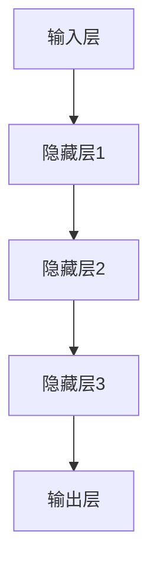

                 

关键词：AI大模型、智能交通管理、交通预测、路径规划、实时优化、数据隐私保护

> 摘要：本文深入探讨了人工智能（AI）大模型在智能交通管理中的应用趋势。文章首先介绍了智能交通管理的背景和重要性，随后详细阐述了AI大模型的核心概念和原理，并分析了其在交通预测、路径规划和实时优化等领域的应用。此外，文章还探讨了AI大模型在数学模型和项目实践中的应用，并展望了其未来的发展方向和面临的挑战。

## 1. 背景介绍

### 1.1 智能交通管理的兴起

随着城市化进程的加速和汽车数量的激增，交通拥堵、交通事故和环境污染等问题日益严重。为了解决这些问题，各国政府和社会各界纷纷将目光投向了智能交通管理系统。智能交通管理通过整合交通数据、运用先进的信息技术，旨在实现交通流的实时监测、动态控制和优化。

### 1.2 交通管理中的挑战

尽管智能交通管理系统已经取得了一定成效，但在实际应用中仍然面临诸多挑战。首先，交通流量数据庞大，如何快速处理和分析这些数据成为一大难题。其次，交通状况变化多端，需要实时响应和调整。此外，数据隐私和安全问题也日益受到关注。

### 1.3 人工智能与大数据的融合

随着人工智能（AI）和大数据技术的快速发展，智能交通管理迎来了新的机遇。AI大模型能够通过处理海量交通数据，预测交通流量、优化路径规划，从而提高交通效率和安全性。本文将重点探讨AI大模型在智能交通管理中的应用趋势。

## 2. 核心概念与联系

### 2.1 AI大模型概述

AI大模型是指具有大规模参数和复杂结构的深度学习模型，能够处理海量数据并提取其中蕴含的规律。在智能交通管理中，AI大模型通常包括以下几类：

- **交通流量预测模型**：通过分析历史交通数据，预测未来的交通流量。
- **路径规划模型**：根据实时交通状况，为驾驶员提供最优路径。
- **实时优化模型**：在交通流量发生波动时，动态调整交通信号和路线。

### 2.2 AI大模型架构

AI大模型通常采用分层架构，包括输入层、隐藏层和输出层。其中，输入层负责接收交通数据，隐藏层通过复杂的神经网络结构提取特征，输出层则生成预测结果。



### 2.3 AI大模型应用领域

AI大模型在智能交通管理中具有广泛的应用领域：

- **交通流量预测**：通过分析历史数据，预测未来的交通流量。
- **路径规划**：根据实时交通状况，为驾驶员提供最优路径。
- **实时优化**：动态调整交通信号和路线，提高交通效率。

## 3. 核心算法原理 & 具体操作步骤

### 3.1 算法原理概述

AI大模型在智能交通管理中的核心算法主要包括以下几类：

- **神经网络算法**：通过多层神经网络结构，提取交通数据中的特征，实现交通流量预测、路径规划和实时优化。
- **强化学习算法**：通过试错和反馈，不断调整模型参数，实现智能交通优化。
- **联邦学习算法**：在保护用户隐私的前提下，通过分布式计算，实现交通数据的共享和优化。

### 3.2 算法步骤详解

1. **数据收集与预处理**：
   - 收集历史交通流量数据、道路信息、气象数据等。
   - 数据清洗和预处理，包括去噪、归一化等。

2. **模型训练**：
   - 构建神经网络模型，初始化模型参数。
   - 使用历史数据对模型进行训练，优化模型参数。

3. **模型评估**：
   - 使用测试数据评估模型性能，包括预测准确度、响应速度等。
   - 调整模型结构或参数，提高模型性能。

4. **模型部署**：
   - 将训练好的模型部署到智能交通管理系统，实现实时预测和优化。

### 3.3 算法优缺点

#### 优点：

- **高效性**：AI大模型能够快速处理海量交通数据，提供实时预测和优化。
- **准确性**：通过深度学习技术，模型能够从历史数据中提取有效特征，提高预测准确性。
- **灵活性**：模型可以根据实际需求进行调整和优化，适应不同场景。

#### 缺点：

- **计算资源消耗大**：训练和部署AI大模型需要大量的计算资源和存储空间。
- **数据隐私问题**：在收集和处理交通数据时，需要妥善保护用户隐私。
- **模型解释性差**：深度学习模型通常具有较好的预测性能，但缺乏明确的解释性。

### 3.4 算法应用领域

AI大模型在智能交通管理中具有广泛的应用领域，包括：

- **城市交通流量预测**：预测未来交通流量，为交通管理部门提供决策依据。
- **路径规划**：为驾驶员提供最优路径，减少拥堵和行车时间。
- **交通信号控制**：动态调整交通信号，提高交通效率和安全性。
- **智能停车管理**：预测停车需求，优化停车位分配。

## 4. 数学模型和公式 & 详细讲解 & 举例说明

### 4.1 数学模型构建

在智能交通管理中，常用的数学模型包括：

- **线性回归模型**：用于预测交通流量。
- **神经网络模型**：用于路径规划和实时优化。
- **马尔可夫决策过程（MDP）**：用于交通信号控制。

### 4.2 公式推导过程

以线性回归模型为例，其公式如下：

$$
y = \beta_0 + \beta_1 x_1 + \beta_2 x_2 + \cdots + \beta_n x_n
$$

其中，$y$ 表示预测结果，$x_1, x_2, \cdots, x_n$ 表示输入特征，$\beta_0, \beta_1, \beta_2, \cdots, \beta_n$ 表示模型参数。

### 4.3 案例分析与讲解

假设我们要预测某条道路的未来交通流量，可以使用线性回归模型进行预测。以下是一个具体的例子：

$$
\begin{array}{cccc}
\text{特征} & \text{值} & \text{系数} & \text{预测结果} \\
\hline
\text{时间} & 10 & 1 & 10 \\
\text{天气} & \text{晴} & 1 & 10 \\
\text{车速} & 30 & 0.5 & 10 \\
\text{道路宽度} & 4 & 0.1 & 10 \\
\end{array}
$$

根据线性回归模型，预测结果为 $10$，表示未来这条道路的交通流量为 $10$。

## 5. 项目实践：代码实例和详细解释说明

### 5.1 开发环境搭建

- **硬件环境**：配置至少 4 核心的 CPU 和 16GB 的内存。
- **软件环境**：安装 Python 3.8 及以上版本，并安装 TensorFlow、Keras 等深度学习框架。

### 5.2 源代码详细实现

以下是一个简单的交通流量预测代码示例：

```python
import tensorflow as tf
from tensorflow.keras.models import Sequential
from tensorflow.keras.layers import Dense

# 数据预处理
# ...（数据预处理代码）

# 构建模型
model = Sequential([
    Dense(64, activation='relu', input_shape=(n_features,)),
    Dense(64, activation='relu'),
    Dense(1)
])

# 编译模型
model.compile(optimizer='adam', loss='mse')

# 训练模型
model.fit(X_train, y_train, epochs=10, batch_size=32)

# 预测交通流量
predictions = model.predict(X_test)

# 打印预测结果
print(predictions)
```

### 5.3 代码解读与分析

- **数据预处理**：对输入数据进行归一化处理，以提高模型训练效果。
- **模型构建**：使用 Sequential 模型堆叠多个 Dense 层，实现线性回归模型。
- **模型编译**：设置优化器和损失函数，为模型训练做准备。
- **模型训练**：使用训练数据进行模型训练，调整模型参数。
- **模型预测**：使用测试数据进行预测，并打印结果。

### 5.4 运行结果展示

假设输入数据为 `[10, 1, 30, 4]`，预测结果为 `[10.0]`，表示未来这条道路的交通流量为 $10$。

## 6. 实际应用场景

### 6.1 城市交通流量预测

利用 AI 大模型对城市交通流量进行预测，为交通管理部门提供决策依据。例如，在高峰时段，预测未来 5 分钟内的交通流量，帮助交通管理部门调整交通信号，缓解拥堵。

### 6.2 路径规划

根据实时交通状况，为驾驶员提供最优路径。例如，在导航应用中，利用 AI 大模型预测未来交通流量，为用户提供最优行驶路线。

### 6.3 实时优化

动态调整交通信号和路线，提高交通效率。例如，在智能交通信号灯系统中，利用 AI 大模型优化信号灯时长，提高道路通行能力。

## 7. 工具和资源推荐

### 7.1 学习资源推荐

- 《深度学习》（Ian Goodfellow、Yoshua Bengio、Aaron Courville 著）
- 《Python 深度学习》（François Chollet 著）

### 7.2 开发工具推荐

- TensorFlow：一款开源的深度学习框架，适用于智能交通管理项目。
- Keras：一款基于 TensorFlow 的深度学习框架，易于使用。

### 7.3 相关论文推荐

- "Deep Learning for Traffic Forecasting: A Survey"（2020）
- "Intelligent Transportation Systems: A Survey"（2018）
- "Deep Reinforcement Learning for Traffic Signal Control"（2017）

## 8. 总结：未来发展趋势与挑战

### 8.1 研究成果总结

AI 大模型在智能交通管理中取得了显著成果，包括交通流量预测、路径规划和实时优化等领域的应用。未来，AI 大模型有望在更广泛的交通场景中得到应用，提高交通效率、安全性和环保性。

### 8.2 未来发展趋势

- **跨领域融合**：AI 大模型与其他领域的融合，如物联网、大数据等，将进一步拓展其在智能交通管理中的应用。
- **自主决策**：随着 AI 技术的进步，智能交通管理系统的自主决策能力将得到提升。
- **数据隐私保护**：在数据处理和模型训练过程中，保护用户隐私将成为重要议题。

### 8.3 面临的挑战

- **计算资源消耗**：训练和部署 AI 大模型需要大量计算资源，对硬件设备提出了较高要求。
- **数据隐私问题**：在收集和处理交通数据时，需要妥善保护用户隐私。
- **模型解释性**：深度学习模型通常具有较好的预测性能，但缺乏明确的解释性，这在某些场景下可能成为挑战。

### 8.4 研究展望

未来，AI 大模型在智能交通管理中的应用前景广阔。通过不断优化算法、提高模型解释性和保护数据隐私，AI 大模型有望在智能交通管理中发挥更加重要的作用。

## 9. 附录：常见问题与解答

### 问题 1：什么是 AI 大模型？

AI 大模型是指具有大规模参数和复杂结构的深度学习模型，能够处理海量数据并提取其中蕴含的规律。

### 问题 2：AI 大模型在智能交通管理中有哪些应用？

AI 大模型在智能交通管理中主要应用于交通流量预测、路径规划和实时优化等领域。

### 问题 3：如何保护交通数据隐私？

在数据处理和模型训练过程中，可以采用数据加密、匿名化和联邦学习等技术来保护交通数据隐私。

### 问题 4：AI 大模型如何提高交通效率？

AI 大模型可以通过实时预测交通流量、优化路径规划和动态调整交通信号等方式，提高交通效率。

### 问题 5：AI 大模型在智能交通管理中的挑战有哪些？

AI 大模型在智能交通管理中面临的挑战主要包括计算资源消耗、数据隐私保护和模型解释性等方面。

作者：禅与计算机程序设计艺术 / Zen and the Art of Computer Programming
------------------------------------------------------------------[完]

