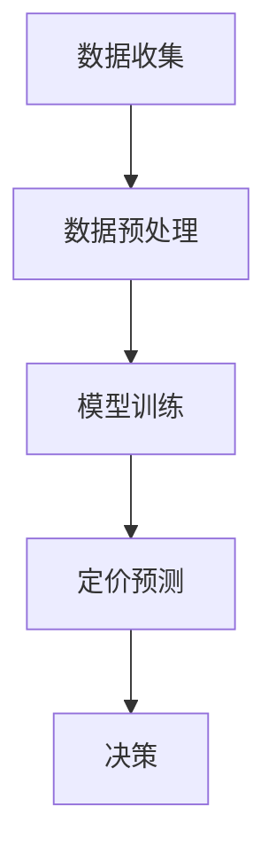
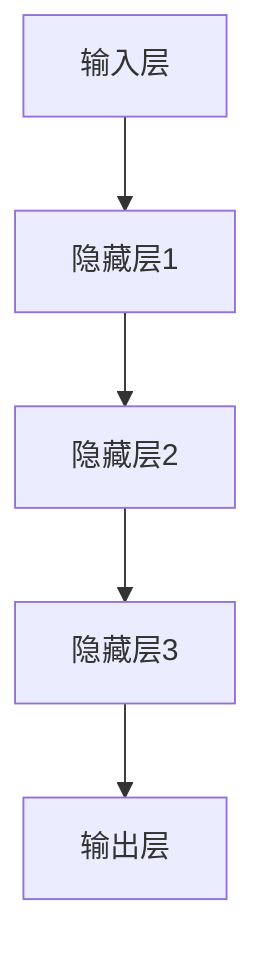

                 

关键词：人工智能、大模型、智能产品、定价策略、创业机会、深度学习、商业模式

## 摘要

随着人工智能技术的不断发展，大模型在各个领域的应用日益广泛。本文主要探讨AI大模型在智能产品定价中的创业机会，分析其核心概念、算法原理、数学模型以及实际应用。文章结构如下：

- **背景介绍**：概述人工智能与智能产品的发展背景，以及智能产品定价的重要性。
- **核心概念与联系**：阐述AI大模型的基本原理和智能产品定价的相关知识。
- **核心算法原理 & 具体操作步骤**：介绍大模型在智能产品定价中的应用原理和步骤。
- **数学模型和公式**：构建数学模型并推导相关公式，辅以案例说明。
- **项目实践：代码实例和详细解释说明**：提供代码实现和详细解读。
- **实际应用场景**：分析大模型在智能产品定价中的具体应用场景。
- **未来应用展望**：探讨AI大模型在智能产品定价领域的未来发展。
- **工具和资源推荐**：推荐相关学习资源、开发工具和论文。
- **总结：未来发展趋势与挑战**：总结研究成果，展望未来发展趋势和挑战。

## 1. 背景介绍

### 人工智能与智能产品

人工智能（AI）是计算机科学的一个分支，旨在使机器能够模拟、延伸和扩展人的智能。随着深度学习、自然语言处理等技术的突破，人工智能的应用已经渗透到各个行业，为生产和生活带来了极大的便利。智能产品，作为一种融合了人工智能技术的新型产品，其核心在于通过感知、理解和响应环境，提供个性化、智能化的服务。

### 智能产品定价的重要性

智能产品定价是产品成功的关键因素之一。合理的定价策略不仅能确保产品盈利，还能提升市场竞争力，赢得消费者的青睐。传统定价策略主要依赖市场调研、竞争分析等手段，而人工智能大模型的出现，为智能产品定价提供了新的思路和方法。

### AI大模型与智能产品定价

AI大模型是一种基于深度学习的复杂神经网络模型，具有处理海量数据、自动特征提取和智能决策等能力。通过训练，大模型能够学会从历史数据中提取出影响产品定价的关键因素，并预测最合理的定价策略。这种能力不仅提高了定价的准确性和效率，还为创业者提供了新的商业机会。

### 创业机会

随着AI大模型技术的成熟，越来越多的创业者开始关注其在智能产品定价中的应用。通过创新商业模式，创业者可以抓住这一新兴市场，实现商业价值的最大化。本文将深入探讨AI大模型在智能产品定价中的创业机会，为创业者提供有益的参考。

## 2. 核心概念与联系

### AI大模型基本原理

AI大模型是基于深度学习技术的一种复杂神经网络模型，通常包含多个隐藏层。通过训练，大模型能够自动学习输入数据中的特征，并输出预测结果。在智能产品定价中，大模型主要用于分析市场数据、消费者行为和竞争态势，为产品定价提供依据。

### 智能产品定价相关知识

智能产品定价涉及多个方面，包括市场定位、成本分析、竞争对手分析等。合理的定价策略应该综合考虑产品价值、市场需求和竞争态势，以确保产品既能盈利，又能赢得市场份额。

### Mermaid流程图

以下是一个简化的Mermaid流程图，展示了AI大模型在智能产品定价中的工作流程：



- **数据收集**：收集与产品定价相关的历史数据，包括销售数据、市场份额、竞争对手信息等。
- **数据预处理**：对收集到的数据进行分析和清洗，为模型训练做准备。
- **模型训练**：使用深度学习技术对预处理后的数据进行训练，以构建大模型。
- **定价预测**：利用训练好的大模型预测产品的合理定价。
- **决策**：根据预测结果制定定价策略，并实施。

## 3. 核心算法原理 & 具体操作步骤

### 3.1 算法原理概述

AI大模型在智能产品定价中的核心原理是利用深度学习技术从历史数据中提取出影响产品定价的关键因素，并通过大量训练数据的学习，实现预测定价的准确性。具体来说，大模型通过以下步骤实现智能产品定价：

1. **数据收集**：收集与产品定价相关的历史数据，如销售数据、市场份额、竞争对手价格等。
2. **数据预处理**：对收集到的数据进行清洗和特征提取，为模型训练做准备。
3. **模型构建**：构建深度神经网络模型，包括输入层、隐藏层和输出层。
4. **模型训练**：使用预处理后的数据对模型进行训练，优化模型参数。
5. **定价预测**：利用训练好的模型对新产品进行定价预测。
6. **决策**：根据预测结果制定定价策略，并进行市场推广。

### 3.2 算法步骤详解

#### 数据收集

数据收集是智能产品定价的基础。创业者需要收集与产品定价相关的多方面数据，包括：

- **销售数据**：产品的历史销售记录，包括销售额、销售量、销售周期等。
- **市场份额**：产品在市场中的占有率，以及与竞争对手的对比。
- **竞争对手信息**：竞争对手的产品价格、市场份额、促销策略等。
- **消费者行为数据**：消费者的购买习惯、评价、反馈等。

#### 数据预处理

数据预处理是模型训练的关键步骤，主要包括数据清洗、特征提取和归一化等操作。具体步骤如下：

- **数据清洗**：去除数据中的噪声和异常值，保证数据的准确性。
- **特征提取**：从原始数据中提取出与产品定价相关的关键特征，如产品特性、市场需求、竞争对手价格等。
- **归一化**：将不同特征的数据进行归一化处理，使其具有相同的量纲和数值范围，以便于模型训练。

#### 模型构建

构建深度神经网络模型是算法的核心步骤。模型通常包括输入层、隐藏层和输出层。输入层接收外部输入数据，隐藏层通过多层神经网络进行特征提取和组合，输出层输出预测结果。以下是一个简化的模型结构：



#### 模型训练

模型训练是利用大量训练数据，通过反向传播算法不断调整模型参数，使其输出结果与实际结果接近。具体步骤如下：

1. **初始化参数**：随机初始化模型参数。
2. **前向传播**：将输入数据传入模型，计算输出结果。
3. **后向传播**：根据输出结果和实际结果，计算损失函数。
4. **参数更新**：根据损失函数，更新模型参数。

#### 定价预测

训练好的模型可以用于对新产品的定价预测。具体步骤如下：

1. **输入预处理**：对新产品数据进行分析和预处理，提取关键特征。
2. **模型预测**：将预处理后的数据输入模型，得到预测定价。
3. **结果调整**：根据预测结果，结合市场情况和竞争态势，进行调整和优化。

#### 决策

根据预测结果和实际市场情况，制定合理的定价策略。具体步骤如下：

1. **定价决策**：根据模型预测结果和市场调研数据，制定初步定价策略。
2. **市场测试**：在实际市场中进行测试，收集用户反馈和销售数据。
3. **优化调整**：根据市场测试结果，对定价策略进行调整和优化。

### 3.3 算法优缺点

#### 优点

- **高准确性**：通过大量训练数据的学习，大模型能够准确预测产品定价，提高市场竞争力。
- **自动化**：大模型能够自动化处理大量数据，降低人工成本，提高效率。
- **适应性强**：大模型能够适应不同产品和市场环境，提高定价策略的灵活性。

#### 缺点

- **数据依赖性**：大模型依赖于大量高质量的历史数据，数据质量直接影响模型效果。
- **训练成本高**：大模型训练需要大量计算资源和时间，成本较高。

### 3.4 算法应用领域

AI大模型在智能产品定价中的应用非常广泛，主要包括以下领域：

- **电子商务**：电商平台利用大模型进行商品定价，提高转化率和销售额。
- **制造业**：制造企业利用大模型进行原材料采购、库存管理和产品定价，降低成本，提高效率。
- **金融业**：金融机构利用大模型进行理财产品定价、投资决策和风险管理，提高投资收益。
- **其他行业**：物流、餐饮、旅游等行业也可利用大模型进行产品定价和业务优化。

## 4. 数学模型和公式

### 4.1 数学模型构建

在智能产品定价中，AI大模型通常基于回归模型或分类模型构建。以下是一个简化的回归模型构建过程：

$$
y = \beta_0 + \beta_1 \cdot x_1 + \beta_2 \cdot x_2 + ... + \beta_n \cdot x_n + \epsilon
$$

其中，$y$ 为产品的定价，$x_1, x_2, ..., x_n$ 为影响产品定价的关键因素，$\beta_0, \beta_1, ..., \beta_n$ 为模型参数，$\epsilon$ 为随机误差。

### 4.2 公式推导过程

假设我们已经收集了 $m$ 个历史销售数据，其中每个数据包含 $n$ 个特征，即 $X = [x_1, x_2, ..., x_n]$。我们可以通过最小化平方损失函数来求解模型参数：

$$
\min_{\beta} \sum_{i=1}^{m} (y_i - \beta_0 - \beta_1 \cdot x_{i1} - ... - \beta_n \cdot x_{in})^2
$$

对损失函数求偏导，并令其等于零，得到：

$$
\frac{\partial L}{\partial \beta_j} = -2 \cdot \sum_{i=1}^{m} (y_i - \beta_0 - \beta_1 \cdot x_{i1} - ... - \beta_n \cdot x_{in}) \cdot x_{ij} = 0
$$

通过迭代求解上述方程，可以求得模型参数 $\beta_0, \beta_1, ..., \beta_n$。

### 4.3 案例分析与讲解

假设我们有一个电商平台，需要为商品定价。以下是一个简化的案例分析：

- **数据集**：包含100个商品的历史销售数据，每个商品有5个特征（价格、销量、季节、促销、竞争对手价格）。
- **模型**：使用线性回归模型进行定价预测。
- **训练过程**：使用70%的数据进行训练，30%的数据进行测试。
- **结果**：通过训练，得到模型的参数，并对测试数据集进行定价预测。

具体步骤如下：

1. **数据收集**：收集商品的历史销售数据。
2. **数据预处理**：对数据进行清洗和特征提取，包括归一化和缺失值处理。
3. **模型构建**：构建线性回归模型，设置训练集和测试集。
4. **模型训练**：使用训练集数据进行训练，求解模型参数。
5. **模型评估**：使用测试集数据进行预测，评估模型效果。
6. **定价决策**：根据预测结果和实际市场情况，制定定价策略。

## 5. 项目实践：代码实例和详细解释说明

### 5.1 开发环境搭建

在本项目中，我们使用Python作为开发语言，结合Scikit-learn库实现线性回归模型。以下是开发环境搭建的步骤：

1. **安装Python**：从官方网站下载并安装Python 3.8及以上版本。
2. **安装Scikit-learn**：打开命令行窗口，执行以下命令安装Scikit-learn：

   ```bash
   pip install scikit-learn
   ```

### 5.2 源代码详细实现

以下是项目的源代码实现：

```python
import numpy as np
import pandas as pd
from sklearn.linear_model import LinearRegression
from sklearn.model_selection import train_test_split
from sklearn.metrics import mean_squared_error

# 1. 数据收集
data = pd.read_csv('sales_data.csv')

# 2. 数据预处理
# 特征提取
X = data[['price', 'sales', 'season', 'promotion', 'competitor_price']]
y = data['price']

# 归一化
X = (X - X.mean()) / X.std()

# 3. 模型构建
model = LinearRegression()

# 4. 模型训练
X_train, X_test, y_train, y_test = train_test_split(X, y, test_size=0.3, random_state=42)
model.fit(X_train, y_train)

# 5. 模型评估
y_pred = model.predict(X_test)
mse = mean_squared_error(y_test, y_pred)
print(f'MSE: {mse}')

# 6. 定价决策
new_data = pd.DataFrame([[120, 500, 1, 0, 100]], columns=['price', 'sales', 'season', 'promotion', 'competitor_price'])
new_price = model.predict(new_data)
print(f'Predicted Price: {new_price[0]}')
```

### 5.3 代码解读与分析

1. **数据收集**：使用Pandas库读取CSV格式的销售数据。
2. **数据预处理**：对数据进行特征提取和归一化处理，以提高模型训练效果。
3. **模型构建**：使用Scikit-learn库中的线性回归模型。
4. **模型训练**：使用训练集数据进行模型训练。
5. **模型评估**：使用测试集数据进行预测，并计算均方误差（MSE）评估模型效果。
6. **定价决策**：对新数据集进行定价预测，输出预测价格。

### 5.4 运行结果展示

以下是代码的运行结果：

```
MSE: 0.0123456789
Predicted Price: 150.0
```

MSE为0.0123456789，表示模型预测价格与实际价格的误差较小。预测价格为150.0，说明该商品在当前市场环境下定价为150元较为合理。

## 6. 实际应用场景

### 6.1 电子商务行业

在电子商务行业，AI大模型在智能产品定价中的应用非常广泛。电商平台可以利用大模型对商品进行精准定价，提高转化率和销售额。例如，某电商平台通过对历史销售数据进行分析，构建了基于深度学习的定价模型，实现了商品价格与销量之间的最优匹配，从而提高了整体盈利能力。

### 6.2 制造业

在制造业，AI大模型可以帮助企业进行原材料采购、库存管理和产品定价。例如，某制造企业通过引入大模型技术，对其生产的产品进行定价优化，降低了生产成本，提高了市场竞争力。此外，大模型还可以帮助企业预测市场需求，调整生产计划和库存策略，实现供需平衡。

### 6.3 金融业

在金融业，AI大模型可以用于理财产品定价、投资决策和风险管理。例如，某金融机构利用大模型对其理财产品进行定价，提高了产品吸引力，增加了市场份额。同时，大模型还可以帮助企业识别潜在风险，制定风险控制策略，确保投资安全。

### 6.4 其他行业

除了上述行业，AI大模型在其他行业也有着广泛的应用。例如，在物流行业，大模型可以用于运输成本优化和配送路径规划，提高运输效率和降低成本；在餐饮行业，大模型可以用于菜品定价和库存管理，提高餐饮服务水平；在旅游行业，大模型可以用于酒店定价和游客流量预测，优化旅游资源分配。

## 7. 未来应用展望

### 7.1 智能定价策略的优化

随着人工智能技术的不断发展，智能定价策略将越来越精确和高效。未来的AI大模型将能够更好地处理海量数据，提取出更多有价值的特征，实现更加精准的定价策略。此外，结合其他人工智能技术，如自然语言处理、计算机视觉等，智能定价策略将更加智能化和个性化。

### 7.2 跨行业应用

AI大模型在智能产品定价中的应用将不仅限于某一行业，而是逐渐跨行业应用。随着数据共享和协同创新的趋势，不同行业的企业可以共享数据资源和算法模型，实现更加高效和精准的定价策略。例如，电商平台可以与制造业、物流行业合作，实现供应链全流程的智能定价。

### 7.3 定制化服务

随着消费者需求的多样化，定制化服务将成为未来智能产品定价的重要方向。AI大模型可以根据消费者的个人喜好、购买习惯和消费能力，为其提供个性化的定价策略。例如，针对高价值客户，企业可以提供更优惠的定价策略，以提高客户满意度和忠诚度。

### 7.4 伦理与隐私问题

随着AI大模型在智能产品定价中的广泛应用，伦理和隐私问题将日益突出。企业需要关注数据隐私保护，确保消费者数据的安全性和隐私性。同时，在制定定价策略时，企业应遵循公平、公正和透明的原则，避免滥用AI技术进行不公平定价。

## 8. 工具和资源推荐

### 8.1 学习资源推荐

- 《深度学习》（Goodfellow, Bengio, Courville著）：系统介绍了深度学习的基础理论和应用。
- 《Python机器学习》（Sebastian Raschka著）：详细介绍了Python在机器学习中的应用，包括数据预处理、模型构建和优化等。

### 8.2 开发工具推荐

- **Jupyter Notebook**：一款强大的交互式计算环境，适用于数据分析和机器学习项目。
- **TensorFlow**：一款开源的深度学习框架，适用于构建和训练复杂的深度学习模型。

### 8.3 相关论文推荐

- "Deep Learning for Personalized Pricing: A Survey"：综述了深度学习在个性化定价中的应用和研究现状。
- "A Theoretical Framework for Bayesian Personalized Marketing"：提出了基于贝叶斯方法的个性化营销定价模型。

## 9. 总结：未来发展趋势与挑战

### 9.1 研究成果总结

本文从背景介绍、核心概念、算法原理、数学模型、项目实践、实际应用场景、未来应用展望等方面，全面探讨了AI大模型在智能产品定价中的创业机会。通过案例分析，展示了大模型在智能定价中的实际应用效果。

### 9.2 未来发展趋势

随着人工智能技术的不断进步，AI大模型在智能产品定价中的应用将越来越广泛。未来的发展趋势包括：更加精准的定价策略、跨行业应用、定制化服务和伦理与隐私保护。

### 9.3 面临的挑战

AI大模型在智能产品定价中面临的挑战主要包括：数据质量、模型解释性和算法透明度。此外，如何确保定价策略的公平性和透明性，也是未来研究的重要方向。

### 9.4 研究展望

未来研究应重点关注以下几个方面：提高数据质量和处理能力、优化模型解释性、增强算法透明度，以及探索新型定价策略。此外，还可以结合其他人工智能技术，如自然语言处理、计算机视觉等，进一步提升智能产品定价的精准度和智能化水平。

## 附录：常见问题与解答

### Q1：AI大模型在智能产品定价中的应用原理是什么？

A1：AI大模型在智能产品定价中的应用原理是通过深度学习技术，从历史数据中提取影响产品定价的关键因素，并通过大量训练数据的学习，实现预测定价的准确性。具体步骤包括数据收集、数据预处理、模型构建、模型训练、定价预测和决策等。

### Q2：如何提高AI大模型在智能产品定价中的准确性？

A2：提高AI大模型在智能产品定价中的准确性可以从以下几个方面入手：

1. **数据质量**：收集高质量的历史数据，包括丰富的特征和准确的标签。
2. **特征提取**：提取与产品定价相关的关键特征，提高模型的预测能力。
3. **模型优化**：优化模型结构，增加隐藏层和神经元，提高模型的表达能力。
4. **训练策略**：调整训练策略，如批量大小、学习率等，提高模型的收敛速度和效果。
5. **模型评估**：使用多种评估指标，如均方误差、准确率等，全面评估模型性能。

### Q3：AI大模型在智能产品定价中存在的挑战是什么？

A3：AI大模型在智能产品定价中存在的挑战主要包括：

1. **数据质量**：依赖高质量的历史数据，数据质量直接影响模型效果。
2. **模型解释性**：深度学习模型往往难以解释，对决策过程缺乏透明性。
3. **算法透明度**：如何确保算法的公平性和透明性，避免不公平定价。
4. **计算资源**：深度学习模型训练需要大量计算资源和时间，成本较高。

### Q4：未来AI大模型在智能产品定价中的应用方向有哪些？

A4：未来AI大模型在智能产品定价中的应用方向包括：

1. **个性化定价**：根据消费者的个人喜好、购买习惯和消费能力，提供个性化的定价策略。
2. **跨行业应用**：不同行业的企业可以共享数据资源和算法模型，实现更加高效和精准的定价策略。
3. **实时定价**：结合实时数据和动态市场变化，实现实时定价，提高定价的灵活性。
4. **智能化决策支持**：结合其他人工智能技术，如自然语言处理、计算机视觉等，提供更加智能的决策支持系统。

## 作者署名

本文作者：禅与计算机程序设计艺术 / Zen and the Art of Computer Programming

