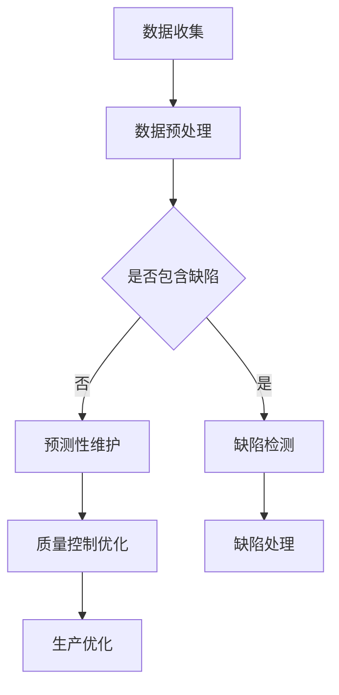

                 

关键词：AI大模型，智能制造，质量控制，创业机会

摘要：本文将探讨人工智能大模型在智能制造质量控制中的应用，分析其带来的创业机会，并探讨未来的发展趋势与挑战。

## 1. 背景介绍

近年来，随着人工智能技术的快速发展，智能制造成为制造业转型升级的重要方向。然而，智能制造过程中面临着质量控制难题，如何提高产品质量、降低不良品率成为企业关注的焦点。人工智能大模型作为一种先进的计算模型，其在数据处理、特征提取和预测方面具有显著优势，为智能制造质量控制提供了新的思路。

### 1.1 智能制造现状

智能制造是指通过利用信息技术、物联网、大数据、人工智能等先进技术，实现制造业的自动化、智能化和数字化。目前，智能制造已经在全球范围内得到了广泛关注和快速发展。据国际数据公司（IDC）预测，到2025年，全球智能制造市场规模将达到1.2万亿美元。

### 1.2 质量控制难题

在智能制造过程中，质量控制是一个关键问题。传统的质量控制方法主要依赖于人工检查和统计方法，存在以下难题：

- **高成本**：人工检查需要大量人力和物力投入，导致成本高昂。
- **效率低**：人工检查速度较慢，无法满足大规模生产的需求。
- **准确性差**：人工检查容易受到主观因素的影响，导致质量控制效果不稳定。

## 2. 核心概念与联系

为了解决智能制造质量控制难题，人工智能大模型发挥了重要作用。下面将介绍人工智能大模型的核心概念及其在智能制造质量控制中的应用。

### 2.1 人工智能大模型

人工智能大模型是指通过深度学习等方法，对海量数据进行训练，从而获得强大的数据处理和预测能力。大模型通常具有以下特点：

- **大规模训练数据**：大模型需要海量数据作为训练基础，以便更好地理解数据中的规律和特征。
- **深度神经网络结构**：大模型通常采用深度神经网络结构，能够自动提取数据中的层次特征。
- **强大的预测能力**：大模型通过训练，能够实现对未知数据的准确预测。

### 2.2 人工智能大模型在智能制造质量控制中的应用

人工智能大模型在智能制造质量控制中的应用主要包括以下几个方面：

- **缺陷检测**：利用大模型对生产过程中的数据进行实时分析，识别出潜在的质量缺陷。
- **预测性维护**：通过大模型对设备的运行数据进行预测，提前发现设备故障，从而避免生产中断。
- **质量控制优化**：利用大模型对生产数据进行深度分析，发现生产过程中的瓶颈和问题，提供改进建议。

### 2.3 Mermaid 流程图

以下是一个简化的 Mermaid 流程图，展示了人工智能大模型在智能制造质量控制中的流程：



## 3. 核心算法原理 & 具体操作步骤

### 3.1 算法原理概述

人工智能大模型在智能制造质量控制中的核心算法主要包括以下几种：

- **深度神经网络**：用于对生产数据进行分析和预测。
- **生成对抗网络**：用于生成高质量的数据集，提高训练效果。
- **迁移学习**：利用已有的大模型，对新的生产数据进行快速训练。

### 3.2 算法步骤详解

#### 3.2.1 数据收集

数据收集是算法的基础。主要包括以下步骤：

- **传感器数据采集**：通过传感器采集生产过程中的各种数据，如温度、压力、速度等。
- **生产数据采集**：通过生产设备采集生产过程中的工艺参数，如切割速度、加工时间等。
- **质量数据采集**：通过人工检查或仪器检测，获取产品的质量数据，如尺寸、重量、外观等。

#### 3.2.2 数据预处理

数据预处理是算法的重要步骤，主要包括以下步骤：

- **数据清洗**：去除数据中的噪声和异常值。
- **数据归一化**：将不同维度的数据进行归一化处理，以便于后续分析。
- **数据增强**：通过数据增强方法，增加训练数据的多样性。

#### 3.2.3 模型训练

模型训练是算法的核心步骤。主要包括以下步骤：

- **模型选择**：选择合适的深度神经网络结构，如卷积神经网络（CNN）、循环神经网络（RNN）等。
- **参数优化**：通过优化算法，如随机梯度下降（SGD）、Adam等，调整模型参数。
- **模型训练**：使用预处理后的数据集，对模型进行训练，直到达到预定的训练效果。

#### 3.2.4 模型评估

模型评估是算法的最后一步。主要包括以下步骤：

- **模型验证**：使用验证数据集，对模型进行验证，评估模型的泛化能力。
- **模型测试**：使用测试数据集，对模型进行测试，评估模型的实际效果。
- **模型调优**：根据评估结果，对模型进行调优，提高模型的性能。

### 3.3 算法优缺点

#### 3.3.1 优点

- **强大的数据处理能力**：大模型能够处理大规模、复杂的生产数据，实现对数据的深度分析。
- **高准确性**：大模型通过训练，能够实现对质量缺陷的准确检测和预测。
- **自适应性强**：大模型能够根据生产环境的变化，自适应调整模型参数，提高模型的效果。

#### 3.3.2 缺点

- **高计算成本**：大模型训练需要大量的计算资源和时间。
- **对数据质量要求高**：数据质量直接影响模型的性能，需要确保数据的质量和多样性。
- **可解释性差**：大模型通常缺乏可解释性，难以理解模型的具体工作原理。

### 3.4 算法应用领域

人工智能大模型在智能制造质量控制中的应用非常广泛，主要包括以下领域：

- **汽车制造业**：用于汽车零部件的质量检测和故障预测。
- **电子制造业**：用于电子产品的质量检测和缺陷修复。
- **航空航天业**：用于航空航天器的质量检测和寿命预测。
- **食品制造业**：用于食品的质量检测和安全性评估。

## 4. 数学模型和公式 & 详细讲解 & 举例说明

### 4.1 数学模型构建

在智能制造质量控制中，常用的数学模型包括深度神经网络模型、生成对抗网络模型和迁移学习模型。以下分别介绍这些模型的数学模型和公式。

#### 4.1.1 深度神经网络模型

深度神经网络模型是一种由多个神经元组成的神经网络，其数学模型可以表示为：

$$
f(x) = \sigma(\boldsymbol{W}^T \boldsymbol{a}^{[L-1]} + b^L)
$$

其中，$f(x)$ 表示输出值，$\sigma$ 表示激活函数，$\boldsymbol{W}$ 和 $b$ 分别表示权重和偏置，$\boldsymbol{a}^{[L-1]}$ 和 $a^L$ 分别表示第 $L-1$ 层和第 $L$ 层的激活值。

#### 4.1.2 生成对抗网络模型

生成对抗网络模型由生成器 $G$ 和判别器 $D$ 组成，其数学模型可以表示为：

$$
\min_G \max_D V(D, G) = E_{x \sim p_{data}(x)}[\log D(x)] + E_{z \sim p_{z}(z)][\log(1 - D(G(z))]
$$

其中，$V(D, G)$ 表示生成对抗网络的损失函数，$p_{data}(x)$ 和 $p_{z}(z)$ 分别表示真实数据和噪声数据的概率分布。

#### 4.1.3 迁移学习模型

迁移学习模型通过利用已有的大模型，对新的生产数据进行快速训练，其数学模型可以表示为：

$$
\min_{\theta} J(\theta) = \sum_{i=1}^N L(y_i, \hat{y}_i)
$$

其中，$J(\theta)$ 表示迁移学习模型的损失函数，$L$ 表示损失函数，$y_i$ 和 $\hat{y}_i$ 分别表示真实标签和预测标签。

### 4.2 公式推导过程

以下分别介绍深度神经网络模型、生成对抗网络模型和迁移学习模型的公式推导过程。

#### 4.2.1 深度神经网络模型

深度神经网络模型的推导过程如下：

$$
\begin{aligned}
\frac{\partial f}{\partial x} &= \frac{\partial}{\partial x} [\sigma(\boldsymbol{W}^T \boldsymbol{a}^{[L-1]} + b^L)] \\
&= \frac{\partial \sigma}{\partial z} \frac{\partial z}{\partial x} \\
&= \sigma'(z) \boldsymbol{W}^T
\end{aligned}
$$

其中，$\sigma'(z)$ 表示激活函数的导数。

#### 4.2.2 生成对抗网络模型

生成对抗网络模型的推导过程如下：

$$
\begin{aligned}
\frac{\partial V(D, G)}{\partial G} &= \frac{\partial}{\partial G} [E_{x \sim p_{data}(x)}[\log D(x)] + E_{z \sim p_{z}(z)][\log(1 - D(G(z)))] \\
&= E_{z \sim p_{z}(z)}[\log(1 - D(G(z)))] \\
&= -E_{z \sim p_{z}(z)}[\log D(G(z))]
\end{aligned}
$$

其中，$\log D(G(z))$ 表示判别器对生成器的输出进行评分。

#### 4.2.3 迁移学习模型

迁移学习模型的推导过程如下：

$$
\begin{aligned}
\frac{\partial J(\theta)}{\partial \theta} &= \frac{\partial}{\partial \theta} [\sum_{i=1}^N L(y_i, \hat{y}_i)] \\
&= \sum_{i=1}^N \frac{\partial L(y_i, \hat{y}_i)}{\partial \theta} \\
&= \sum_{i=1}^N \nabla_{\theta} L(y_i, \hat{y}_i)
\end{aligned}
$$

其中，$\nabla_{\theta} L(y_i, \hat{y}_i)$ 表示损失函数对参数 $\theta$ 的梯度。

### 4.3 案例分析与讲解

以下通过一个简单的例子，介绍如何使用深度神经网络模型对智能制造质量控制中的缺陷检测问题进行建模和求解。

#### 4.3.1 数据集

假设我们有一个包含1000个样本的数据集，每个样本包含5个特征值和一个标签，标签为0或1，分别表示是否存在缺陷。

#### 4.3.2 模型构建

我们选择一个简单的多层感知机模型，其结构为：

$$
\begin{aligned}
h_1 &= \sigma(\boldsymbol{W}_1^T \boldsymbol{x} + b_1) \\
h_2 &= \sigma(\boldsymbol{W}_2^T h_1 + b_2) \\
\hat{y} &= \sigma(\boldsymbol{W}_3^T h_2 + b_3)
\end{aligned}
$$

其中，$\sigma$ 表示激活函数，$\boldsymbol{W}$ 和 $b$ 分别表示权重和偏置。

#### 4.3.3 模型训练

我们使用随机梯度下降（SGD）算法对模型进行训练，其公式为：

$$
\theta^{t+1} = \theta^t - \alpha \nabla_{\theta} J(\theta^t)
$$

其中，$\alpha$ 表示学习率，$J(\theta)$ 表示损失函数。

#### 4.3.4 模型评估

我们使用验证集对模型进行评估，计算模型在验证集上的准确率，公式为：

$$
\text{accuracy} = \frac{\sum_{i=1}^N \text{正确预测的样本数}}{N}
$$

## 5. 项目实践：代码实例和详细解释说明

### 5.1 开发环境搭建

在进行项目实践之前，需要搭建相应的开发环境。以下是开发环境的基本要求：

- **操作系统**：Windows 10 或 macOS
- **编程语言**：Python 3.8 或以上版本
- **深度学习框架**：TensorFlow 2.x 或 PyTorch 1.x
- **依赖库**：NumPy、Pandas、Matplotlib 等

### 5.2 源代码详细实现

以下是一个简单的深度学习模型实现，用于智能制造质量控制中的缺陷检测。

```python
import numpy as np
import pandas as pd
import matplotlib.pyplot as plt
import tensorflow as tf
from sklearn.model_selection import train_test_split

# 数据集加载
data = pd.read_csv('data.csv')
X = data.iloc[:, :-1].values
y = data.iloc[:, -1].values

# 数据集划分
X_train, X_test, y_train, y_test = train_test_split(X, y, test_size=0.2, random_state=42)

# 模型构建
model = tf.keras.Sequential([
    tf.keras.layers.Dense(64, activation='relu', input_shape=(X_train.shape[1],)),
    tf.keras.layers.Dense(64, activation='relu'),
    tf.keras.layers.Dense(1, activation='sigmoid')
])

# 模型编译
model.compile(optimizer='adam', loss='binary_crossentropy', metrics=['accuracy'])

# 模型训练
model.fit(X_train, y_train, epochs=10, batch_size=32, validation_data=(X_test, y_test))

# 模型评估
loss, accuracy = model.evaluate(X_test, y_test)
print(f"Test accuracy: {accuracy:.2f}")

# 模型预测
predictions = model.predict(X_test)
predictions = (predictions > 0.5).astype(int)

# 结果可视化
plt.scatter(X_test[:, 0], X_test[:, 1], c=predictions, cmap='red')
plt.xlabel('Feature 1')
plt.ylabel('Feature 2')
plt.title('Defect Detection')
plt.show()
```

### 5.3 代码解读与分析

#### 5.3.1 数据集加载

首先，我们使用 Pandas 库读取数据集，并将其分为特征值和标签两部分。

```python
data = pd.read_csv('data.csv')
X = data.iloc[:, :-1].values
y = data.iloc[:, -1].values
```

#### 5.3.2 数据集划分

接下来，我们使用 Sklearn 库中的 train_test_split 函数将数据集划分为训练集和测试集。

```python
X_train, X_test, y_train, y_test = train_test_split(X, y, test_size=0.2, random_state=42)
```

#### 5.3.3 模型构建

我们使用 TensorFlow 库构建一个简单的多层感知机模型，包含两个隐藏层，每个隐藏层有64个神经元。

```python
model = tf.keras.Sequential([
    tf.keras.layers.Dense(64, activation='relu', input_shape=(X_train.shape[1],)),
    tf.keras.layers.Dense(64, activation='relu'),
    tf.keras.layers.Dense(1, activation='sigmoid')
])
```

#### 5.3.4 模型编译

我们使用 Adam 优化器和二进制交叉熵损失函数编译模型，并添加准确率作为评价指标。

```python
model.compile(optimizer='adam', loss='binary_crossentropy', metrics=['accuracy'])
```

#### 5.3.5 模型训练

我们使用训练集对模型进行训练，设置训练轮数为10，批量大小为32，并将测试集作为验证集。

```python
model.fit(X_train, y_train, epochs=10, batch_size=32, validation_data=(X_test, y_test))
```

#### 5.3.6 模型评估

训练完成后，我们使用测试集评估模型的性能，计算准确率。

```python
loss, accuracy = model.evaluate(X_test, y_test)
print(f"Test accuracy: {accuracy:.2f}")
```

#### 5.3.7 模型预测

最后，我们使用训练好的模型对测试集进行预测，并将预测结果可视化。

```python
predictions = model.predict(X_test)
predictions = (predictions > 0.5).astype(int)

plt.scatter(X_test[:, 0], X_test[:, 1], c=predictions, cmap='red')
plt.xlabel('Feature 1')
plt.ylabel('Feature 2')
plt.title('Defect Detection')
plt.show()
```

## 6. 实际应用场景

人工智能大模型在智能制造质量控制中的应用场景非常广泛，以下是一些典型的应用实例：

### 6.1 汽车制造业

汽车制造业对质量要求极高，人工智能大模型可以用于汽车零部件的质量检测和故障预测。例如，通过分析传感器数据，预测零部件的磨损情况，提前进行维护，从而提高生产效率和产品质量。

### 6.2 电子制造业

电子制造业中，产品质量问题可能导致设备故障和安全事故。人工智能大模型可以用于电子产品的质量检测和缺陷修复，提高生产线的自动化水平，降低人工干预。

### 6.3 食品制造业

食品制造业中，产品质量直接影响消费者的健康。人工智能大模型可以用于食品的质量检测和安全性评估，提高产品质量，保障消费者的食品安全。

### 6.4 航空航天业

航空航天业对质量要求极高，人工智能大模型可以用于航空航天器的质量检测和寿命预测，确保飞行安全。

## 7. 未来应用展望

随着人工智能技术的不断发展和应用，人工智能大模型在智能制造质量控制中的前景非常广阔。以下是一些未来的应用展望：

### 7.1 新材料开发

新材料开发过程中，质量检测是一个重要环节。人工智能大模型可以用于新材料的质量检测和性能预测，提高新材料的开发效率。

### 7.2 零部件个性化定制

随着消费者需求的多样化，零部件个性化定制成为趋势。人工智能大模型可以用于零部件的个性化定制，提高生产线的灵活性和适应性。

### 7.3 全生命周期质量监控

人工智能大模型可以实现对生产全过程的质量监控，从原材料采购、生产加工到产品出厂，实现全生命周期的质量保障。

## 8. 工具和资源推荐

为了更好地学习和应用人工智能大模型在智能制造质量控制中的技术，以下是一些建议的工具和资源：

### 8.1 学习资源推荐

- **书籍**：《深度学习》（Goodfellow et al.）、《Python深度学习》（François Chollet）
- **在线课程**：Coursera、edX、Udacity等平台上的深度学习和人工智能相关课程
- **博客和论坛**：Reddit、知乎、CSDN等平台上的相关技术博客和论坛

### 8.2 开发工具推荐

- **深度学习框架**：TensorFlow、PyTorch、Keras
- **编程语言**：Python、R
- **数据预处理工具**：Pandas、NumPy、Matplotlib

### 8.3 相关论文推荐

- **深度学习**：Hinton et al., "Deep Neural Networks for Acoustic Modeling in Speech Recognition: The Shared Views of Four Research Groups"
- **生成对抗网络**：Goodfellow et al., "Generative Adversarial Networks"
- **迁移学习**：Pan et al., "A Survey on Transfer Learning"

## 9. 总结：未来发展趋势与挑战

人工智能大模型在智能制造质量控制中的应用前景广阔，但仍面临一些挑战：

### 9.1 研究成果总结

- **数据处理能力**：人工智能大模型具有强大的数据处理能力，能够处理大规模、复杂的生产数据。
- **预测准确性**：通过深度学习等方法，人工智能大模型能够实现高准确性的质量检测和预测。
- **自适应性强**：人工智能大模型能够根据生产环境的变化，自适应调整模型参数，提高模型的效果。

### 9.2 未来发展趋势

- **数据处理技术**：随着数据处理技术的不断发展，人工智能大模型在智能制造质量控制中的应用将越来越广泛。
- **算法优化**：研究人员将继续优化人工智能大模型的算法，提高模型的效果和效率。
- **跨领域应用**：人工智能大模型将在更多领域得到应用，如新材料开发、医疗健康等。

### 9.3 面临的挑战

- **计算资源**：人工智能大模型训练需要大量的计算资源，如何优化计算资源的使用成为一个重要问题。
- **数据质量**：数据质量直接影响模型的性能，如何确保数据的质量和多样性是一个挑战。
- **可解释性**：人工智能大模型通常缺乏可解释性，如何提高模型的可解释性，使其更加透明和可信是一个重要问题。

### 9.4 研究展望

未来，人工智能大模型在智能制造质量控制中的应用将不断深入，为制造业的智能化、数字化和高质量发展提供强大支持。同时，随着技术的不断发展，人工智能大模型将面临更多挑战和机遇，为制造业带来更多的创新和变革。

## 附录：常见问题与解答

### 问题1：人工智能大模型如何处理海量数据？

解答：人工智能大模型通常采用分布式计算和并行计算技术，以提高数据处理速度。同时，大模型采用深度神经网络结构，能够自动提取数据中的层次特征，从而降低对数据量的依赖。

### 问题2：人工智能大模型在智能制造质量控制中的应用有哪些？

解答：人工智能大模型在智能制造质量控制中的应用非常广泛，包括缺陷检测、预测性维护、质量控制优化等。通过分析生产数据，大模型能够实现对产品质量的实时监控和预测，提高生产效率和产品质量。

### 问题3：如何确保人工智能大模型的数据质量？

解答：确保数据质量是人工智能大模型应用的关键。首先，需要对数据进行清洗，去除噪声和异常值。其次，通过数据增强方法，增加数据的多样性。此外，定期对数据进行监测和评估，确保数据的质量和可靠性。

### 问题4：人工智能大模型的可解释性如何提高？

解答：人工智能大模型的可解释性是一个重要问题。目前，研究人员正在探索各种方法，如模型可视化、模型解释算法等，以提高模型的可解释性。此外，开发可解释性更强的模型结构，如基于规则的模型等，也是提高模型可解释性的一个方向。

